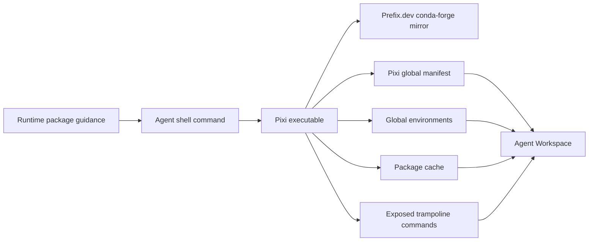

# User-Managed Runtime Tools Design

- Snapshot: `packages-260901`
- Document reference: `packages-260901/DESIGN`

## Scope

This Design implements
[packages-260901/REQ](../requirements/packages-260901-user-managed-runtime-tools.md)
through the accepted
[packages-260901/ADR](../adr/packages-260901-user-managed-runtime-tools.md).

It replaces the Runner's HOME-relative Nix configuration with checksum-pinned Pixi
global package management whose writable state resides in the existing Agent
Workspace. It does not add Provider, API, Profile, capability, inventory, or
administrator surfaces.

## Current Behavior and Gaps

The Runner image installs Debian `nix-bin`. `prepare_nix_environment()` relocates
the Nix store, database, configuration, logs, and user profile under the current
Workspace and prepends the Nix profile binary directory to `PATH`.

This preserves bytes across Workspace recreation but changes the logical store
prefix. Standard Nix binary-cache artifacts reference `/nix/store`, so a package
such as ffmpeg cannot use the standard cache and instead plans a complete source
build. Nix also falls back from a Workspace HOME that is not owned by the Runtime
UID for some user state.

The existing Docker and Kubernetes Providers already preserve and reset the Agent
Workspace at the required lifecycle boundaries. No Provider storage change is
needed for a HOME-prefix package manager.

## Requirements and ADR Traceability

| Requirement | Design mechanisms | ADR authority |
| --- | --- | --- |
| `packages-260901/REQ-1` | M1, M2, M4 | D1, D2 |
| `packages-260901/REQ-2` | M1, M2, M3 | D1, D3, D4 |
| `packages-260901/REQ-3` | M2, M4 | D2 |
| `packages-260901/REQ-4` | M2, M3 | D1, D4 |
| `packages-260901/REQ-5` | M1, M3, M5 | D3, D4, D5 |
| `packages-260901/REQ-6` | M1, M2, M3, M5 | D1, D5 |

## Architecture

The Runner release owns the Pixi executable and default system configuration. The
Agent owns native package commands and all writable package state under the current
Workspace. The Provider continues owning only the existing Workspace storage
lifecycle.

## M1. Checksum-Pinned Pixi Runner Image

The Runner Dockerfile removes Debian `nix-bin` and installs Pixi `0.78.0` from the
official release artifact.

The build selects the static Linux musl artifact for the BuildKit target
architecture:

- `amd64` → `pixi-x86_64-unknown-linux-musl.tar.gz`;
- `arm64` → `pixi-aarch64-unknown-linux-musl.tar.gz`.

Each artifact is verified against its release SHA-256 before `/usr/local/bin/pixi`
is installed. Unsupported architectures fail the image build.

The image writes `/etc/pixi/config.toml` with conda-forge as the default channel and
a Prefix.dev mirror for the conda-forge endpoint. Pixi system configuration remains
lower priority than native user and project configuration.

The image validates the installed Pixi version during build. The Runner continues
executing as UID/GID 1000 with its existing security context.

## M2. Workspace-Derived Pixi Environment

Replace `prepare_nix_environment()` with `prepare_pixi_environment()`.

The helper accepts the resolved Runner Workspace path and current machine
architecture. It creates the package home and cache roots and returns:

- `PIXI_HOME=<workspace>/.pixi`;
- `PIXI_CACHE_DIR=<workspace>/.cache/pixi`;
- `PIXI_PLATFORM=linux-64` for x86_64/amd64 or `linux-aarch64` for
  aarch64/arm64;
- `PIXI_BASE_PATH=<Runner PATH before Pixi exposure>`; and
- `PATH=<workspace>/.pixi/bin:<existing PATH>`.

PATH composition preserves order, removes duplicate path entries, and never derives
the Workspace from a fixed Provider path.

The Runner's direct execution backend inherits this environment for every Agent
process. A matching `/etc/profile.d/azents-pixi.sh` provides equivalent dynamic
HOME-based values for login shells. The profile does not mutate Pixi state.

Pixi global environments default to one environment per installed tool. Pixi owns
the global manifest and trampoline configuration below `PIXI_HOME`.

## M3. Native Agent Guidance

Replace Nix prompt guidance with native Pixi guidance:

- search with `pixi search <name> --platform "$PIXI_PLATFORM"`;
- install with `pixi global install <package>`;
- do not use sudo or operating-system package managers.

The guidance describes supported user-space tools and does not claim that Pixi is
an operating-system package manager or that every Linux package is available.

No wrapper command, API, persisted package state, capability, Profile setting, or
administrator policy is added.

## M4. Persistence and Destructive Boundaries

The following writable paths reside below the existing Agent Workspace:

- `.pixi/envs` — installed global environments;
- `.pixi/bin` — exposed trampoline commands and configuration;
- `.pixi/manifests` — global desired package state;
- `.cache/pixi` — reusable package metadata and artifacts.

Ordinary Runtime replacement preserves these paths because Providers retain the
Workspace. Runner startup only reconstructs environment variables and does not
resolve, update, migrate, or delete packages.

Workspace reset and terminal deletion remove Pixi state with the complete
Workspace. Historical `.nix` paths are ignored and remain user-controlled until the
user removes them or resets the Workspace.

Installed Conda environments may contain their absolute installation prefix.
Recreation therefore preserves the same Runner Workspace mount path. Moving a
Workspace to another absolute path requires native Pixi synchronization or
reinstallation and is outside this snapshot.

## M5. Coordinated Nix Removal

Remove:

- the Dockerfile `nix-bin` package;
- `docker/azents-nix-profile.sh`;
- `azents_runtime_runner.nix`;
- Nix environment preparation from Runner startup;
- Nix unit tests;
- Nix prompt guidance and tests; and
- current Nix behavior from Living Specs.

Add the corresponding Pixi image files, environment helper, tests, prompt, and
Living Spec behavior in the same change.

There is no legacy compatibility path. The Runtime does not remove existing `.nix`
Workspace data automatically.

## Security and Permissions

Pixi and installed package commands execute as the existing non-root Runtime user.
They receive no additional Linux capability, ServiceAccount, Provider credential,
host filesystem, or network authority.

Package installation executes third-party prebuilt artifacts with the Agent's
ordinary permissions. Checksums protect artifact integrity relative to channel
metadata but do not establish maintainer trust, vulnerability status, or signed
provenance. Pixi post-link scripts remain at their upstream default and are not
enabled by Azents.

The Prefix.dev mirror is a release default rather than enforced policy. Agents may
override native Pixi configuration within their existing authority.

## Failure, Retry, and Recovery

- Package search or solve failure changes no Runtime control-plane state.
- Download failure may leave reusable cache data but does not authorize a Platform
  retry loop.
- Native Pixi commands own retry, synchronization, update, and removal behavior.
- Runner recreation never performs an automatic package update or repair.
- An unavailable package channel prevents new search or installation but does not
  prevent existing Workspace environments from executing.
- Cache growth is user-managed; no automatic garbage collection or quota is added.

## Rollout and Rollback

The Runner image, prompt, and Living Specs change together. A deployed Runtime uses
Pixi after its compute is recreated onto the new image; existing Workspace contents
remain.

Rollback to an older Runner image restores the older Nix executable and prompt but
does not delete `.pixi`. This is an operational image rollback, not a supported
dual package-manager product mode.

## Test Strategy

The requester explicitly excluded E2E testing for this implementation. No Azents
E2E fixture, live Docker Runtime journey, or Kubernetes E2E is added or executed.

### Unit verification

- Runner tests verify Workspace-derived Pixi home, cache, platform, base PATH,
  exposed PATH, directory creation, recreation preservation, and reset clearing.
- Prompt tests verify exact native Pixi guidance and absence of the Nix guidance.

### Image verification

- Build the Runner Docker image.
- The Dockerfile verifies the pinned Pixi version during image construction.
- Inspect the built image configuration and bundled system Pixi config without
  running a product E2E scenario.

### Static quality

- Run Ruff formatting and lint checks.
- Run the configured type checker.
- Run the Runner and targeted backend unit test suites.
- Run documentation validation through the repository pre-commit path.

### Evidence and limits

Evidence consists of unit-test output, static quality output, image-build output,
and CI results. Persistence of an installed third-party package across a real
Provider recreation is not revalidated in this snapshot because the requester
excluded E2E; the Design relies on the unchanged existing Workspace lifecycle and
keeps the lack of new E2E evidence explicit.

## Design Authority

- Design revision: `1`

| ID | Material design mechanism | Authority | Classification |
| --- | --- | --- | --- |
| M1 | Checksum-pinned Pixi image and release default mirror | `packages-260901/REQ-1`, `REQ-2`; `packages-260901/ADR-D1`, `ADR-D3` | `decided` |
| M2 | Workspace-derived Pixi environment and global command PATH | `packages-260901/REQ-1`, `REQ-2`, `REQ-3`, `REQ-4`; `packages-260901/ADR-D2` | `required` |
| M3 | Native Pixi Agent guidance without control-plane state | `packages-260901/REQ-2`, `REQ-5`; `packages-260901/ADR-D4` | `decided` |
| M4 | Existing Workspace persistence and reset boundaries own package state | `packages-260901/REQ-3`; current Agent Runtime persistence Spec; `packages-260901/ADR-D2` | `derived` |
| M5 | Coordinated Nix removal without compatibility mode | `packages-260901/REQ-6`; `packages-260901/ADR-D5` | `decided` |

## Removal and Replacement

| Existing unit or behavior | Removal authority | Replacement or remaining authority | Removal boundary | Absence verification |
| --- | --- | --- | --- | --- |
| Runner image `nix-bin` | `packages-260901/REQ-6`, `ADR-D1`, `ADR-D5` | M1 Pixi executable | Runner Dockerfile | Image package search and `nix` command absence |
| HOME-relative Nix environment helper | `packages-260901/REQ-6`, `ADR-D5` | M2 Pixi environment helper | Runner source and import graph | Repository search and Runner unit tests |
| Nix shell profile | `packages-260901/REQ-6`, `ADR-D5` | M2 Pixi shell profile | Runner image profile files | Image file inspection and repository search |
| Nix prompt guidance | `packages-260901/REQ-6`, `ADR-D5` | M3 Pixi guidance | Builtin Runtime prompt | Targeted prompt unit test |
| Nix Living Spec behavior | `packages-260901/REQ-6`, `ADR-D5` | M3 and M4 Pixi current behavior | Toolkit and Runtime persistence Specs | Spec review and repository search |
| Existing Workspace `.nix` bytes | None; destructive removal was not authorized | User-controlled historical files or Workspace reset | No automatic removal | Startup source contains no `.nix` deletion |

## Feasibility

- **REQ-1 — feasible:** local fresh-HOME probes installed prebuilt ffmpeg as an
  unprivileged user with payloads under `PIXI_HOME`.
- **REQ-2 — feasible:** Pixi global install exposed direct trampoline commands
  without activation.
- **REQ-3 — feasible:** all selected writable paths are under the unchanged
  Provider-owned Agent Workspace boundary.
- **REQ-4 — feasible:** Pixi global tools use isolated environments and native
  exposed command configuration.
- **REQ-5 — feasible:** the change is confined to Runner image/environment, prompt,
  tests, and documentation.
- **REQ-6 — feasible:** Nix has a bounded source, image, prompt, test, and Spec
  surface with no API or database dependency.

## Assumptions and Non-Blocking Risks

- Conda-forge package coverage and maintenance quality vary by feedstock.
- Concurrent mutation of one global manifest is delegated to Pixi's native locking
  behavior and is not independently E2E-validated in this snapshot.
- Global manifests are less exact than project lock files for transitive
  reproduction after a complete reset.
- Package cache growth is visible Workspace usage and remains user-managed.

## Design Approval

- Mode: `Collaborative`
- Decision owner: Requester
- Approved on: `2026-09-01`
- Approved Design revision: `1`
- Approved authority IDs: `M1, M2, M3, M4, M5`
- Approved scope: Replace the Runner's nonfunctional HOME-relative Nix package path
  with checksum-pinned Pixi global tools stored entirely in the existing Agent
  Workspace, with no Provider or package-management control-plane change and no E2E
  testing for this implementation.
