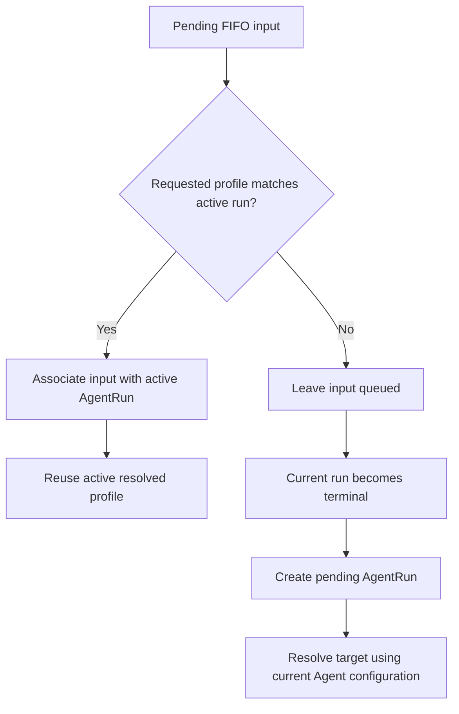
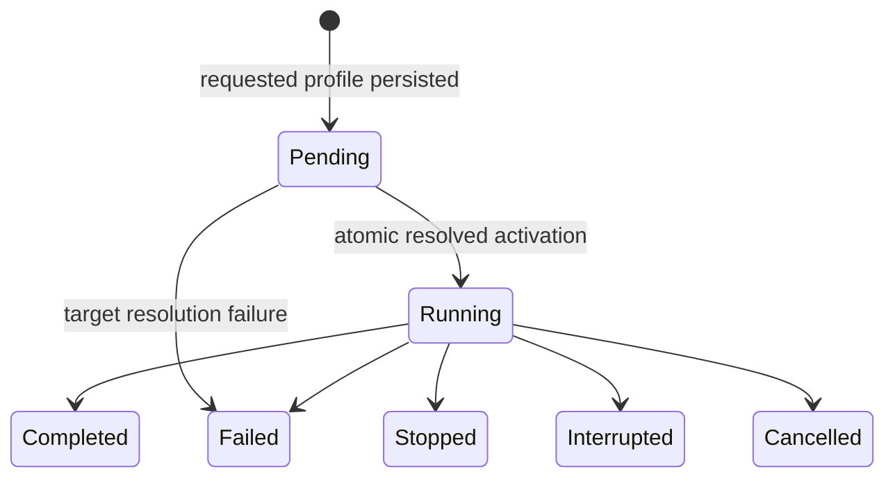
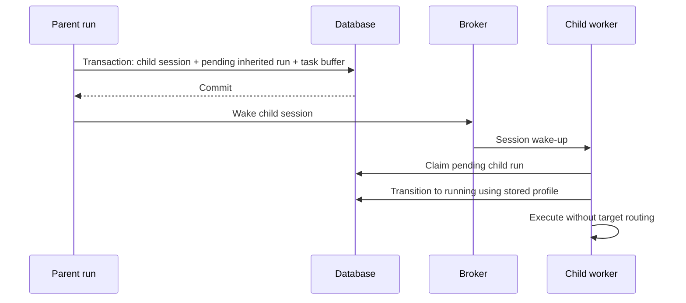

# Per-Prompt Inference Profile Design

## Problem

Azents currently resolves every normal Agent run from the Agent's denormalized main `model_selection` and Agent-level reasoning effort. The chat Composer cannot choose a different Agent-owned model target for one prompt. Pending inputs are also flushed as one prefix before an action barrier, so adding fields only to the REST request would not preserve prompt-specific execution intent.

The feature must let a user choose Model and optional reasoning effort for each prompt while preserving these runtime invariants:

- one main physical model and one effective effort per `AgentRun`;
- FIFO input ordering;
- strict Agent-owned target policy rather than client-submitted provider snapshots;
- stable automatic retry within a run;
- durable requested and resolved provenance;
- exact parent-run profile inheritance for the first subagent run.

## Goals

- Add a compact per-prompt Model and effort selector to chat.
- Treat target label and effort as one requested inference profile and FIFO run boundary.
- Resolve labels authoritatively at each new run against current Agent target configuration.
- Preserve a fixed resolved profile throughout one run and its automatic retries.
- Persist the latest successfully activated profile on AgentSession for implicit execution.
- Preserve profile intent through queueing, reload, edit, and manual retry.
- Make requested target and actual resolution inspectable from the originating user message.
- Keep context/token usage tied to actual run provenance.
- Give a new subagent the exact resolved parent-run profile for its first run.

## Non-goals

- Dynamic model routing policy. The current implementation resolves a label to its saved static `AgentModelSelection` snapshot.
- Final dynamic-routing semantics for inputs arriving during an active run.
- A `spawn_agent` model or effort override.
- Per-prompt lightweight/compaction model selection.
- Voice input or unrelated Composer actions.
- Letting clients submit provider IDs, physical model snapshots, credentials, or routing results.

## Terminology

| Term | Meaning |
|---|---|
| Model target | An Agent-owned selectable-model label exposed to clients. |
| Requested inference profile | `model_target_label` plus nullable explicit `reasoning_effort`. |
| `Default` effort | Visible no-override state represented as `reasoning_effort: null`. |
| Resolved inference profile | Immutable physical `AgentModelSelection` snapshot plus effective effort and limits fixed for one run. |
| Profile source | How a run obtained requested intent: explicit input, session last-used, Agent default, parent run, or retry original. |
| Run activation | Atomic persistence of resolved provenance, pending-to-running transition, and AgentSession last-used profile before provider invocation. |

## Current Behavior

- Agent settings own `selectable_model_options`, `main_model_label`, `lightweight_model_label`, and denormalized effective snapshots.
- `resolve_invoke_input()` reads the Agent main snapshot and Agent-level model parameters.
- `input_buffers` persist content, general metadata, actions, and attachments but no inference profile.
- `_next_flush_prefix()` stops only at an action-message barrier and can combine all earlier normal inputs.
- `agent_runs` persist execution state but no requested or resolved model provenance.
- `ChatInput` renders a textarea between external attachment and Send/Stop buttons.
- Token usage combines observed usage with the Agent default model's context settings.
- `spawn_agent` creates the child session and task buffer before a payload-free wake-up, but does not preserve the parent run model profile.

## Proposed Design

### 1. Selection and precedence

A run-producing public chat request submits an explicit inference profile. Internal runs without explicit input choose requested intent in this order:

1. explicit run-triggering input profile;
2. AgentSession last-used target and effort;
3. Agent default target and configured initial effort, only when the session has no prior profile.

Failure to resolve an explicit or inherited target does not continue down the precedence list. The Agent default is initialization, not a failure fallback.

The current static resolver in the Azents worker's run-preparation layer performs a strict lookup of `model_target_label` in the Agent's selectable options and copies that option's saved `AgentModelSelection`. It must not reuse Agent-settings normalization that silently selects the first option for a missing label. Agent option inputs remain snapshotted when settings are written. The external runtime/provider adapter receives only the resolved snapshot and never reads labels, provider catalogs, Agent settings, or Workspace defaults.

### 2. FIFO segmentation

Requested target label and requested effort form one FIFO key. A pending prefix can join an active run only when both values exactly match its requested profile. Different target or effort remains queued for the next run.

For this static-routing phase, matching input that arrives during an active run reuses the run's resolved snapshot without routing again. A later run resolves its target again even if its requested profile matches the previous run. Dynamic routing must revisit this join policy explicitly.



### 3. Public API

Add a shared request object:

```json
{
  "model_target_label": "GPT-5.4",
  "reasoning_effort": "high"
}
```

`reasoning_effort` is required but nullable. Null means visible `Default`, not an omitted unknown value.

Add required non-null `inference_profile` to:

- new-session first-message request;
- existing-session normal/turn-producing Composer input;
- user-message edit request.

The combined Composer input request uses a required nullable field because non-model commands send `inference_profile: null`. Server validation rejects null for run-producing input and rejects a non-null profile for a command that does not invoke the main model.

Failed-run retry accepts no profile override and reconstructs the original requested intent. Idempotency payload comparison includes the complete requested inference profile so reusing a client request ID with different target or effort is rejected consistently.

The API never accepts resolved provider/model snapshots. OpenAPI and both generated clients must be regenerated from the backend schema.

### 4. Durable requested intent

Add typed InputBuffer fields:

| Field | Type | Meaning |
|---|---|---|
| `requested_model_target_label` | nullable string | Explicit target intent; null only for internal inheritance. |
| `requested_reasoning_effort` | nullable PostgreSQL enum | Explicit effort or null Default/inheritance. |

A database constraint rejects effort without a target. `{target, null}` is explicit Default; `{null, null}` is internal inheritance.

When promoting an InputBuffer, copy its profile into nullable typed `UserMessagePayload.requested_inference_profile`. Do not put profile data in general message metadata and do not put physical snapshots on InputBuffer or user-message events.

Pending live events and durable history use the same requested-profile response type.

### 5. AgentSession state

Add nullable fields:

- `last_model_target_label`;
- `last_reasoning_effort`.

A non-null target with null effort means the most recently activated target used provider/model Default effort. Both null means the session has not activated a profile.

Composer restoration precedence is:

1. browser-local unsent draft profile;
2. most recent durable run-producing human input with a non-null requested profile, considering pending InputBuffer and promoted user-message event state;
3. AgentSession last successfully activated profile;
4. Agent default profile.

The local draft persists message, selected action, target label, and effort as one unit. A profile-only selection is meaningful draft state. Latest submitted intent skips commands with null profile and does not treat manual retry as a newer human message; an edited replacement message does become newer intent. Editing temporarily uses the original message requested profile; cancelling returns to the normal draft/latest-intent state.

### 6. AgentRun lifecycle and provenance

Add `pending` AgentRun status. Pending means not yet worker-activated, not necessarily unresolved. An ordinary model-producing run exists with requested-only provenance before target resolution; a precreated inherited subagent run is pending with an already resolved parent snapshot.

Requested provenance fields:

- `requested_model_target_label`;
- `requested_reasoning_effort`;
- `inference_profile_source` (`explicit_input`, `session_last_used`, `agent_default`, `parent_run`, `retry_original`).

Resolved provenance fields:

- immutable `resolved_model_selection` JSONB;
- nullable `resolved_reasoning_effort`;
- `resolved_at`;
- `effective_context_window_tokens`;
- `effective_auto_compaction_threshold_tokens`.

Store safe typed profile-resolution failure data on a failed run. Never persist credentials or decrypted provider configuration in provenance.

Create `agent_run_input_events(agent_run_id, event_id, input_order)` so one run can consume multiple messages and a manually retried message can be associated with multiple runs. Automatic retry stays inside the same run.



### 7. Atomic activation

After successful resolution, one database transaction:

1. persists resolved snapshot, effort, timestamp, and effective limits;
2. transitions AgentRun from pending to running;
3. updates AgentSession last target and effort.

The provider call starts only after commit. Failure to commit prevents model invocation. Resolution failure atomically marks the pending run failed with typed failure data while leaving AgentSession last-used fields unchanged.

```mermaid
sequenceDiagram
    participant W as Worker
    participant DB as Database
    participant R as Target resolver
    participant P as Model provider

    W->>DB: Create pending AgentRun with requested profile
    W->>R: Resolve target at run start
    alt Resolution succeeds
        W->>DB: Atomic activation transaction
        Note over DB: Resolved provenance + running status + session last-used
        DB-->>W: Commit
        W->>P: Start model call
    else Resolution fails
        W->>DB: Mark run failed; keep prior session profile
        DB-->>W: Commit
    end
```

### 8. Retry and edit

- Automatic retry reuses the same AgentRun, resolved snapshot, and effort.
- Manual retry creates a new pending AgentRun from the original requested profile and resolves it against current routing configuration.
- Edit starts with the original requested profile, allows changes, and creates a new run boundary.
- Neither manual retry nor edit reuses the old resolved physical snapshot.

### 9. Subagent first run

`spawn_agent` precreates the child first AgentRun in the same transaction as child AgentSession, SessionAgent, inherited context, and spawn-task InputBuffer. The Subagent Toolkit retains the current `TurnContext.run_id` so the transaction can load the concrete spawning parent AgentRun rather than infer it from session history. The child run is pending and contains:

- `parent_agent_run_id`;
- parent requested target and effort;
- `inference_profile_source = parent_run`;
- exact parent resolved model snapshot and effective limits.

Initialize the child session last-used target and effort in the same transaction. Publish wake-up only after commit. The worker claims the precreated run and transitions it to running without routing again. A unique/claim invariant permits only one pending run per session.



Future `spawn_agent` profile override remains out of scope.

### 10. Profile failures

Persist one of these initial typed codes when run-start profile resolution fails:

- `model_target_not_found`;
- `model_target_resolution_failed`;
- `reasoning_effort_unsupported`.

Render a localized failed-run card with safe actionable copy and Edit message / Retry actions. Run-start profile resolution failures become terminal immediately rather than entering the provider-call automatic retry loop because no resolved profile was activated. Edit can change profile; manual Retry preserves it. User-facing details never include raw provider responses, credentials, or decrypted configuration. Structured logs may include run/session/agent IDs, requested label/effort, failure code, safe internal reason, and integration ID.

### 11. Chat projection and provenance UI

The normal visible user-message metadata is:

`sent time · requested target label`

Use the same quiet timestamp typography rather than a badge. Hover/focus on desktop and tap on touch opens details with requested effort, latest associated run state, safe resolved model summary, or safe failure.

Chat history and live projections include a compact allowlisted `inference_run_summary` for the latest associated run. They do not dump the internal snapshot. Queued messages have requested profile and null run summary. Manual-retry history defaults to the latest run index.

Do not add persistent model metadata to assistant-message footers.

### 12. Composer redesign

Replace the input flanked by external actions with one rounded Composer surface:

- vertically expanding textarea;
- one compact bottom toolbar containing attachment, Model, conditional effort, and Send/Stop;
- docked one-line Goal/Todo session-context tab behind the top edge;
- optional attachment and selected-action rows only when content exists.

Desktop can render Model and effort as separate controls. Narrow mobile uses one compact combined profile control while keeping both independently editable in a bottom sheet.

Mobile constraints:

- textarea and placeholder render at least 16 CSS pixels to prevent Safari focus zoom;
- default Composer target height is approximately 80–84 CSS pixels;
- exposed Goal/Todo tab is approximately 22 CSS pixels with no gap;
- toolbar visual controls are approximately 32 CSS pixels with approximately 40 CSS pixel interaction targets;
- truncate model names before increasing height;
- expand textarea upward, then scroll internally at its maximum;
- avoid redundant safe-area padding and strong mobile shadow.

If Model changes, preserve explicit effort when supported; otherwise visibly select `Default`. Hide effort control when the model preview has no selectable effort levels.

### 13. Context/token usage

The header indicator uses the active run's resolved model and effective limits. With no active run, use the latest successfully resolved terminal run explicitly associated with the displayed usage snapshot, regardless of terminal status. Before any committed activation, show unknown values. Composer selection and queued targets never change this observed-execution indicator.

## Data Model Changes

### `input_buffers`

- add nullable requested target and effort columns;
- add target/effort consistency constraint;
- include profile fields in repository and live projection models.

### `agent_sessions`

- add nullable last target and effort columns.

### `agent_runs`

- add pending status;
- add requested target, effort, and source;
- add resolved model snapshot, effort, timestamp, and effective limits;
- add nullable typed profile failure fields;
- add nullable `parent_agent_run_id`;
- add non-null `created_at` and make `started_at` nullable until the activation checkpoint; backfill existing `created_at` from the prior `started_at` value.

### `agent_run_input_events`

- composite uniqueness for run/event participation;
- stable `input_order` within a run;
- indexes for latest runs by event and ordered inputs by run.

### Event payload

- add nullable structured `requested_inference_profile` to `UserMessagePayload`;
- preserve decoding of historical events without the field.

## Security and Permissions

- Existing chat/session authorization continues to gate profile submission and history.
- Server validates target labels only within the selected Agent.
- Clients cannot submit integration IDs or resolved snapshots.
- Public projections allowlist safe provider/model fields.
- Full internal snapshots stay server-side and contain no credentials.
- Failure messages do not disclose credential state, raw provider responses, or decrypted configuration.
- Subagent inheritance reads the currently executing parent AgentRun and cannot name an arbitrary source run.

## Migration and Rollout

1. Generate an Alembic revision for new enums, columns, constraints, and association table.
2. Existing AgentSession, InputBuffer, AgentRun, and event provenance remains null.
3. Deploy backend read compatibility for null historical provenance before requiring new API fields.
4. Add target-aware buffering, pending runs, resolution, activation, and failure projections.
5. Regenerate OpenAPI plus Python and TypeScript public clients.
6. Deploy frontend Composer and provenance UI after backend projections are available.
7. Update current specs only when implementation lands.
8. Monitor pending-run recovery, resolution failure rates, and mismatched profile validation.

No old migration is edited. Existing Agents already have selectable model options from the label-target foundation.

## Primary Implementation Surface

| Area | Primary paths |
|---|---|
| RDB and repositories | `rdb/models/input_buffer.py`, `rdb/models/agent_session.py`, `rdb/models/agent_run.py`, `repos/input_buffer/**`, `repos/agent_session/**`, `repos/agent_execution/**` |
| Public chat API | `api/public/chat/v1/data.py`, `api/public/chat/v1/__init__.py`, `services/agent_session_input.py`, `services/chat_write.py` |
| Events and buffering | `engine/events/types.py`, `engine/events/user_messages.py`, `engine/io/user_input.py`, `services/input_buffer.py`, `services/chat/live_events.py` |
| Run preparation | `worker/run/executor.py`, `worker/session/lifecycle.py`, `engine/run/resolve.py`, `engine/run/contracts.py`, `engine/events/engine_adapter.py` |
| Subagents | `engine/tools/subagent.py`, `repos/agent_session/**` |
| Web transport/state | `typescript/apps/azents-web/src/trpc/routers/chat.ts`, `features/chat/containers/useChatSessionContainer.ts`, `useAgentDraftChatContainer.ts` |
| Web UI | `ChatInput.tsx`, `TodoPreviewBar.tsx`, `MessageBubble.tsx`, pending-input components, `ChatSessionView.tsx`, `TokenUsageIndicator.tsx`, stories and locale files |
| Generated clients | public OpenAPI plus `python/libs/azents-public-client` and `typescript/packages/azents-public-client` |

## Implementation Phases

### Phase 1: persistence and contracts

- Define shared requested/resolved profile types and enums.
- Generate database migration.
- Update RDB/domain/repository models.
- Add API request/response schemas and regenerate clients.

### Phase 2: buffer segmentation and run activation

- Persist requested profile during enqueue and promotion.
- Segment initial and polled FIFO prefixes by target and effort.
- Create pending AgentRuns before resolution.
- Resolve label at run start and atomically activate run/session state.
- Add typed failure finalization.

### Phase 3: retry, edit, and subagent inheritance

- Preserve requested profile through edit and manual retry.
- Reuse resolved profile for automatic retry.
- Precreate and claim inherited child first runs.
- Add pending-run recovery/re-wake behavior.

### Phase 4: frontend

- Add profile-aware session bootstrap and draft persistence.
- Redesign compact Composer and responsive selectors.
- Add user-message timestamp label and detail interaction.
- Bind token indicator to run provenance.

### Phase 5: QA and spec promotion

- Run backend and frontend quality suites.
- Run E2E matrix and collect screenshots/traces.
- Update Agent domain and execution/chat flow specs.
- Run `/spec-review` immediately before final QA if implementation is split across stacked phases.

## Error Handling and Recovery

- Malformed API profile or action/profile mismatch: request validation error before enqueue.
- Missing target, unsatisfied routing, unsupported explicit effort: typed failed pending run; no session-profile update.
- Activation transaction failure: no provider call; worker can retry preparation.
- Commit succeeded but wake publication failed for child: pending run remains discoverable and recoverable.
- Duplicate child wake: only one worker claims the pending run.
- Frontend preview became stale: run-time validation remains authoritative and returns actionable failure.

## Test Strategy

Product behavior verification is E2E-first, backed by focused repository/service/unit tests.

### E2E primary matrix

| Scenario | Required evidence |
|---|---|
| New session default profile | Composer displays Agent default; sent message metadata shows target; run summary shows resolved fixture model. |
| Per-prompt Model change | Two profiles create ordered separate runs; physical model evidence matches each target. |
| Effort-only change | Same target with different effort creates a new run. |
| Same-profile active continuation | Matching input joins active run and reuses run ID/resolved model. |
| Different-profile active queue | Later input remains queued until current run terminates. |
| Reload with unsent draft | Message/action/profile restore together, including profile-only draft. |
| Reload with queued latest intent | Composer uses latest submitted requested profile ahead of session last-used. |
| Edit | Original profile restores, can change, and new run resolves current target. |
| Manual retry | Original requested profile is reused and current target config is re-resolved. |
| Automatic retry | Same run ID and resolved snapshot are retained. |
| Deleted target | Typed failed-run card, stable timestamp label, Edit and Retry actions, prior session profile retained. |
| Unsupported effort | Typed failure and editable invalid original state. |
| Subagent spawn | Child first run has parent run ID and exact resolved profile with no routing call. |
| Context indicator | Active/latest run model and limits drive percentage, not Agent default or Composer preview. |
| Narrow mobile Composer | Goal/Todo tab plus Composer stays within height budget; long model truncates; controls remain usable. |
| Mobile Safari focus | Textarea focus does not trigger page zoom; rendered input/placeholder remain at least 16px. |
| Accessibility | Keyboard can open Model/effort/provenance details; focus and dismissal behavior are correct. |

### E2E plan

Use deterministic fixture integrations with at least two named targets that resolve to distinguishable fixture models and different effort capability sets. Add a controllable provider failure/automatic-retry fixture and a target mutation step for missing-target failure. Inspect public chat projections and persisted run/session state through supported test helpers rather than relying only on visible labels.

Capture browser screenshots for default mobile, Goal/Todo mobile, expanded profile sheet, queued different-profile message, and failed profile resolution. Capture run IDs and safe resolved summaries as structured test evidence.

### Testenv and fixtures

Testenv support is required because physical resolution, effort capability changes, provider retry, and subagent inheritance need deterministic model evidence. Seed:

- an Agent with at least `Fast`, `Quality`, and a non-reasoning target;
- distinct saved model snapshots and context limits;
- selectable effort sets with one intentional incompatibility;
- Goal/Todo session state for compact Composer verification;
- deterministic automatic-retry behavior;
- subagent capacity greater than zero.

Store no live credentials in fixtures. Use the existing deterministic provider/integration prerequisite snapshot. A missing deterministic prerequisite is a test setup failure for required E2E cases, not a skip.

### Backend tests

- request validation for normal input, turn action, command, edit, and retry;
- InputBuffer profile constraints, idempotency, promotion, and exact FIFO segmentation;
- user-event profile preservation;
- requested source precedence;
- static target resolution and strict failures;
- atomic activation rollback and no provider call before commit;
- session profile unchanged on resolution failure;
- run/event many-to-many retry associations;
- automatic versus manual retry provenance;
- pending child-run creation, claim exclusivity, recovery, and parent snapshot equality;
- safe public projection allowlist.

### Frontend tests

Add colocated Storybook states and component/container tests for:

- empty/default, Goal, Todo, combined Goal/Todo, attachment, action, editing, running, and stopped Composer states;
- separate desktop and combined mobile profile controls;
- long labels, Default effort, no effort capability, and invalid edited effort;
- queued/running/completed/failed user-message provenance;
- keyboard, hover, focus, tap, and outside-dismiss interactions;
- token usage with active/latest/unknown run provenance.

### CI policy and evidence

- Unit, type, lint, and deterministic E2E tests are required and fail the change when prerequisites or assertions fail.
- Optional live-provider smoke tests may be skipped only when their documented external credential prerequisite is absent; they do not replace deterministic coverage.
- Required evidence includes test command output, structured E2E run/profile assertions, and mobile/desktop screenshots for layout-sensitive states.

## Spec Updates Required at Implementation

- `docs/azents/spec/domain/agent.md`
  - main label becomes Agent default target rather than every-run selection;
  - AgentSession last-used profile fields.
- `docs/azents/spec/flow/agent-execution-loop.md`
  - profile-aware FIFO segmentation, pending run, run-time label resolution, activation, retries, and subagent inheritance.
- Chat history/live projection specs covering requested profile and compact run summary.
- Any AgentSession or message-routing spec introduced or identified during implementation.

Do not update current-behavior specs in this design-only change.

## Alternatives Considered

- Enqueue-time physical snapshot: rejected because it prevents current-policy run-time routing.
- Client-submitted provider/model: rejected because it bypasses Agent targets.
- Model changes inside one run: rejected because retry and provenance become ambiguous.
- Session update at enqueue or completion: rejected in favor of atomic activation.
- Profile in general metadata/JSONB only: rejected in favor of typed durable fields.
- Separate subagent bootstrap payload: rejected because pending AgentRun can own the snapshot directly.
- Profile badges on every message: rejected in favor of quiet user-message timestamp metadata.
- Separate persistent Model/effort row: rejected to protect mobile vertical space.

## Deferred Decisions

- Dynamic-routing inputs, guarantees, and active-run join/re-resolution semantics.
- Explicit `spawn_agent` Model/effort override.
- Rich full AgentRun audit history beyond the latest compact user-message projection.
