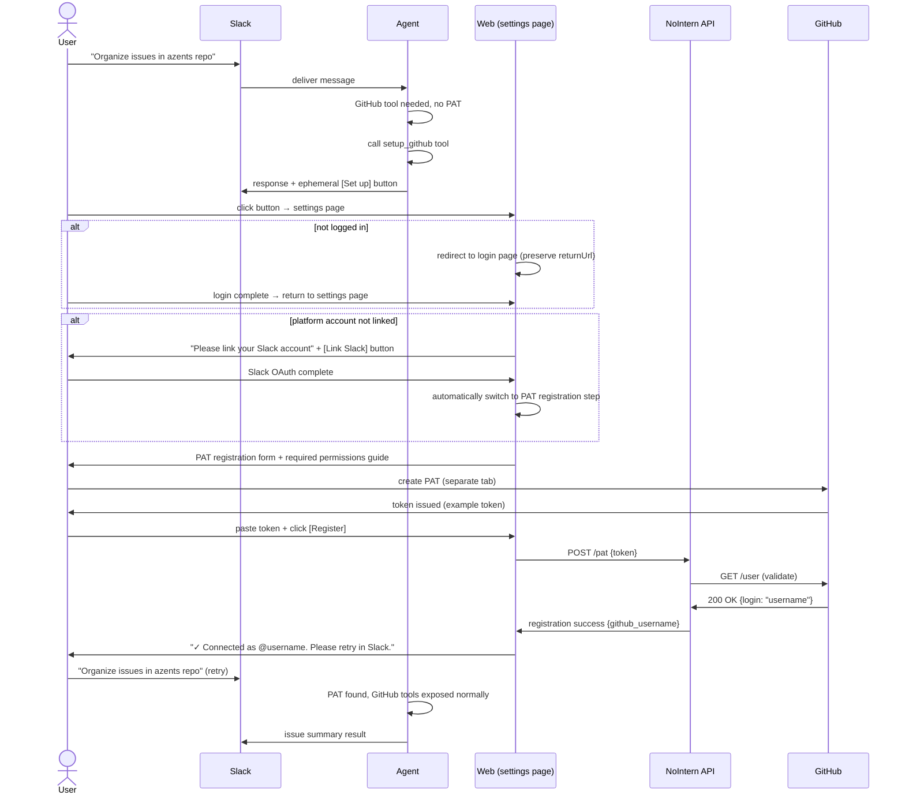
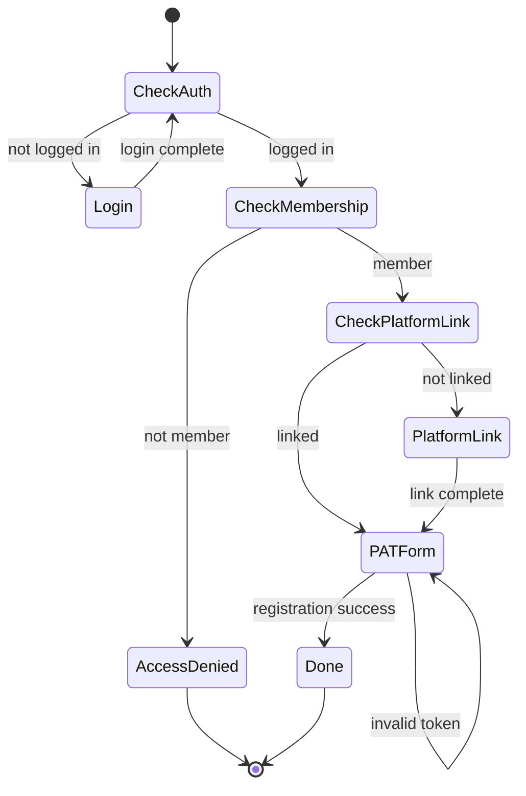
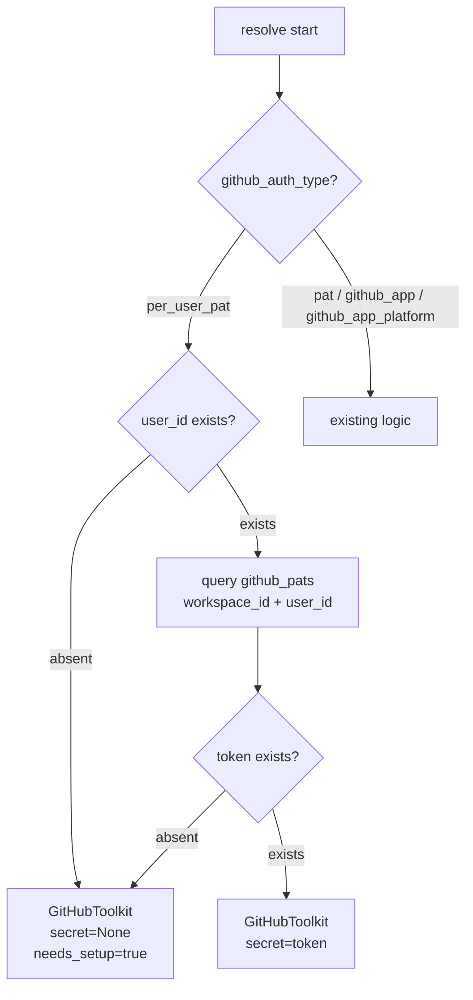
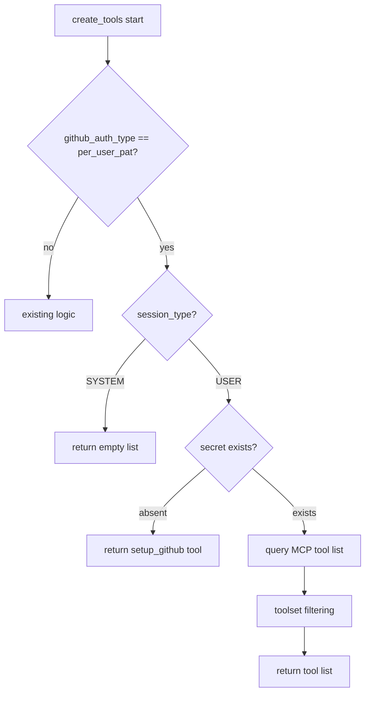

# GitHub Per-User PAT Authentication

## Overview

Support per-user Personal Access Token (PAT) authentication in GitHub toolkit. When workspace administrator configures `per_user_pat` auth method, each user registers their own GitHub PAT and uses GitHub tools within their own permission scope.

## Background

### Per-User OAuth Failure

GitHub Copilot MCP server (`api.githubcopilot.com/mcp/`):

- rejects Classic OAuth token (403 Forbidden)
- does not support MCP OAuth discovery (RFC 9728 `/.well-known/oauth-authorization-server`)

Therefore, existing MCP per-user OAuth infrastructure cannot provide GitHub per-user auth. `oauth_app` auth method was removed.

### Why PAT Method Was Adopted

- GitHub PAT is Bearer token accepted by MCP server.
- User creates it directly in GitHub Settings, so OAuth client registration is unnecessary.
- User can directly control permission scope of their PAT.

## Design Principles

- **Workspace scope**: PAT is stored per workspace × user. Even if multiple GitHub toolkits exist in same workspace, they share one PAT. Users do not need to access toolkit management page, so PAT management naturally belongs in workspace settings.
- **Single setup flow**: account link and PAT registration are handled in one page. Agent does not ask twice separately.
- **Web UI required**: PAT is not received through chat. Prevent token exposure in chat history/logs.
- **Minimal validation**: validate only token validity with `GET /user` on registration. Scope is not validated (Classic/Fine-grained permission models differ and unified validation is difficult).
- **Token preservation**: do not delete stored PAT when 401 occurs during execution. It may be temporary failure, so only deliver error to agent.
- **Exclude system session**: exclude `per_user_pat` toolkit in system sessions such as scheduled execution.

## UX Design

### User Scenarios

#### Scenario 1: Admin — toolkit setup

Admin adds GitHub toolkit to workspace and selects "Per-user PAT" as auth method. There is no workspace-level credential.

#### Scenario 2: User first use — setup flow



#### Scenario 3: Normal use

User with registered PAT runs agent. During resolve, GitHub MCP tools are exposed normally with stored PAT and operate within user's GitHub permission scope.

#### Scenario 4: Token expired/revoked

User revoked PAT in GitHub or Fine-grained PAT expired. When agent calls tool, 401 occurs. Agent informs "GitHub token is expired or revoked". User re-registers PAT in web settings.

#### Scenario 5: Insufficient permission

User's PAT lacks required permission. Tool call returns 403. Agent delivers error message to user.

#### Scenario 6: PAT replacement

User revoked old PAT for security and created a new one. Replace existing token in web settings page.

### Settings Page Details

#### Entry points

Two access paths:

| Path | Description |
|------|------|
| [Set up] button in Slack/Discord ephemeral message | when PAT absent during agent execution |
| Web workspace settings > GitHub PAT section | preconfigure or replace |

#### URL Structure

```
/w/{handle}/settings/github-pat?platform=slack
```

- `handle`: workspace handle
- `platform`: platform user entered from (slack, discord). Used for account link step and completion guidance message.

#### Page State Flow



#### Screens by State

**Not logged in**

Redirect to login page. Preserve settings page URL in `returnUrl` and return after login.

**Not member**

```
You do not have access to this workspace.
Please ask a workspace administrator for an invitation.
```

**Platform account not linked** (only when platform parameter exists)

```
┌─────────────────────────────────────────┐
│  To use GitHub tools,                    │
│  first link your Slack account.          │
│                                           │
│  [Link Slack account]                    │
│                                           │
│  After linking, requests sent from Slack  │
│  are associated with your account.        │
└─────────────────────────────────────────┘
```

After Slack OAuth completes, automatically switch to PAT registration step.

**PAT registration form**

```
┌─────────────────────────────────────────┐
│  Register GitHub Personal Access Token  │
│                                           │
│  Step 1. Create PAT in GitHub            │
│  [Create in GitHub Settings →]           │
│                                           │
│  Depending on tools configured for this  │
│  toolkit, following permissions are      │
│  required:                                │
│                                           │
│  ┌───────────────────────────────────┐   │
│  │ Classic PAT:                      │   │
│  │   • repo                          │   │
│  │   • read:org                      │   │
│  │                                   │   │
│  │ Fine-grained PAT:                 │   │
│  │   • Repository access: target repo│   │
│  │   • Contents: Read and write      │   │
│  │   • Issues: Read and write        │   │
│  │   • Pull requests: Read and write │   │
│  └───────────────────────────────────┘   │
│                                           │
│  Step 2. Enter created token             │
│  ┌───────────────────────────────────┐   │
│  │ <github-token>  │   │
│  └───────────────────────────────────┘   │
│                                           │
│  [Register]                              │
│                                           │
│  The token is stored encrypted.           │
│  NoIntern operators cannot view the       │
│  raw token.                               │
└─────────────────────────────────────────┘
```

Permission guidance changes dynamically based on toolset configured in toolkit:

| Toolset | Classic PAT Scope | Fine-grained Permission |
|---------|-------------------|------------------------|
| repos | `repo` | Contents: Read and write |
| issues | `repo` | Issues: Read and write |
| pull_requests | `repo` | Pull requests: Read and write |
| actions | `repo` | Actions: Read and write |
| code_security | `security_events` | Code scanning alerts: Read |
| users | `read:user` | (included by default) |

**Registration success**

```
┌─────────────────────────────────────────┐
│  ✓ GitHub connection complete            │
│                                           │
│  Connected as @octocat.                  │
│  Please retry with the agent in Slack.   │
└─────────────────────────────────────────┘
```

**Invalid token**

```
┌─────────────────────────────────────────┐
│  ✗ Invalid token.                        │
│  Please check GitHub Personal Access     │
│  Token again.                            │
│                                           │
│  ┌───────────────────────────────────┐   │
│  │                                   │   │
│  └───────────────────────────────────┘   │
│                                           │
│  [Register]                              │
└─────────────────────────────────────────┘
```

### PAT Management

Managed in GitHub PAT section of workspace settings page. Placed next to account link (Slack/Discord) section:

| State | Display | Action |
|------|------|------|
| not registered | "GitHub PAT is not registered" | [Register] → settings page |
| registered | "@octocat · token-prefix...suffix" (first 4 chars + masked) | [Replace] [Delete] |
| expired | "@octocat · expired" (Fine-grained PAT) | [Re-register] |

### Agent Conversation UX

#### Tool Exposure Policy

| User state | Exposed tools | Note |
|-----------|-----------|------|
| PAT registered | all GitHub MCP tools (toolset filtering applied) | normal use |
| PAT not registered (user_id exists) | `setup_github` | settings page link guidance |
| account not linked (no user_id) | `setup_github` | same link — page guides account link first |
| system session | (excluded) | per-user impossible because no user |

Core: Whether account not linked or PAT not registered, expose only **one same `setup_github` tool**. Page guides from appropriate step based on user state.

#### Tool Spec

```
Name: setup_github
Description: "Request the user to set up GitHub authentication.
      Call this when the user wants to use GitHub tools
      but hasn't completed setup yet."
Input: none
```

#### Agent Response Examples

When PAT not registered:

```
Authentication setup is required to use GitHub tools.
Please complete setup from the link below.
```

+ Slack ephemeral:

```
┌────────────────────────────────────────┐
│ GitHub authentication setup             │
│ To use GitHub tools,                    │
│ complete authentication setup.          │
│                                          │
│ [Set up]                                │
└────────────────────────────────────────┘
```

401 during tool execution:

```
GitHub API call failed.
The token may be expired or revoked.
Please re-register PAT in web settings.
```

403 during tool execution:

```
Insufficient permission for this operation.
Please check permission settings of GitHub PAT.
```

## Technical Design

### Data Model

#### New table: `github_pats`

Separate table from existing `mcp_oauth2_tokens`. OAuth2 token and PAT have different lifecycle (refresh presence, expiration policy). PAT is stored per workspace × user, so every GitHub toolkit in same workspace shares one PAT.

```python
class RDBGitHubPAT(Base):
    __tablename__ = "github_pats"

    id: Mapped[str]                    # UUID7, PK
    workspace_id: Mapped[str]          # FK → workspaces.id (CASCADE)
    user_id: Mapped[str]               # FK → users.id (CASCADE)
    encrypted_token: Mapped[str]       # Fernet-encrypted token
    github_username: Mapped[str | None] # GitHub username (display)
    display_hint: Mapped[str | None]   # identifying hint such as first 4 chars of token
    expires_at: Mapped[datetime | None] # Fine-grained PAT expiration date
    created_at: Mapped[datetime]
    updated_at: Mapped[datetime]
```

| Constraint | Definition |
|----------|------|
| PK | `id` |
| Unique | `(workspace_id, user_id)` — 1 PAT per workspace × user |
| Index | `workspace_id` |
| FK | `workspace_id → workspaces.id ON DELETE CASCADE` |
| FK | `user_id → users.id ON DELETE CASCADE` |

#### Reuse existing table

- `mcp_auth_requests`: Rate limit / mute tracking. Used the same for `per_user_pat`.

### App Layer Abstraction

Abstract how `ToolkitProvider` fetches per-user token:

```python
class PerUserTokenStore(Protocol):
    """per-user token storage protocol."""

    async def get_token(
        self, session: AsyncSession, workspace_id: str, user_id: str,
    ) -> str | None:
        """Fetch user's token."""
        ...

    async def delete_token(
        self, session: AsyncSession, workspace_id: str, user_id: str,
    ) -> None:
        """Delete user's token."""
        ...
```

| Implementation | Purpose | Store | Key |
|--------|------|--------|----|
| `GitHubPATRepository` | GitHub PAT | `github_pats` | `(workspace_id, user_id)` |
| `MCPOAuth2TokenRepository` | MCP per-user OAuth2 token | `mcp_oauth2_tokens` | `(toolkit_id, user_id)` |

Each `ToolkitProvider` receives suitable implementation. Resolve flow references only protocol.

### API Design

PAT is workspace-scoped, so API also uses workspace-based path.

#### PAT registration

```
POST /workspaces/{handle}/github-pat
```

| Item | Value |
|------|------|
| Auth | login required, workspace member |
| Request Body | `{ "token": "<github-token>" }` |
| Handling | call GitHub `GET /user` → validate → encrypted store (upsert) |
| Success response | `201 { "github_username": "octocat", "expires_at": null }` |
| Failure response | `422 { "detail": "Invalid GitHub token" }` |

#### PAT status query

```
GET /workspaces/{handle}/github-pat
```

| Item | Value |
|------|------|
| Auth | login required, workspace member |
| Response (registered) | `{ "registered": true, "github_username": "octocat", "display_hint": "token-hint", "expires_at": null }` |
| Response (not registered) | `{ "registered": false }` |

#### PAT deletion

```
DELETE /workspaces/{handle}/github-pat
```

| Item | Value |
|------|------|
| Auth | login required, workspace member |
| Response | `204 No Content` |

#### Setup status query (for settings page)

```
GET /workspaces/{handle}/github-pat/setup-status?platform=slack
```

Endpoint for settings page to understand user's current state at once.

| Item | Value |
|------|------|
| Auth | login required, workspace member |
| Response | `{ "platform_linked": true, "pat_registered": false, "github_username": null }` |

### Resolve Flow



```python
# GitHubToolkitProvider.resolve() — per_user_pat branch
async def _resolve_per_user_pat(
    self,
    config: GitHubToolkitConfig,
    context: ResolveContext,
) -> GitHubToolkit:
    secret: str | None = None

    if context.user_id is not None:
        token = await self._user_token_store.get_token(
            context.session, context.workspace_id, context.user_id,
        )
        if token is not None:
            secret = token

    setup_url = (
        f"{context.web_url}/w/{context.workspace_handle}"
        f"/settings/github-pat"
    )

    return GitHubToolkit(
        secret=secret,
        setup_url=setup_url,
        toolkit_name=config.name or "GitHub",
        toolkit_id=context.toolkit_id,
        toolsets=config.toolsets,
        proxy_url=context.mcp_proxy_url,
    )
```

### Tool Creation Flow



### Events and Adapters

#### Unified event

`per_user_pat` does not distinguish `AccountLinkNudgeEvent` and `AuthorizationRequestEvent`. When `setup_github` tool is called, publish `AuthorizationRequestEvent`, but put settings page URL in `authorization_url`.

```python
await context.publish_event(
    AuthorizationRequestEvent(
        toolkit_id=toolkit_id,
        toolkit_name=toolkit_name,
        authorization_url=setup_url,  # settings page URL, not OAuth URL
    )
)
```

Reuse existing Slack/Discord adapter `AuthorizationRequestEvent` handler as-is. Change button text from "Authorize" to "Set up" or use generic text.

#### Slack message format

```python
blocks = [
    {
        "type": "section",
        "text": {
            "type": "mrkdwn",
            "text": (
                f"*{toolkit_name} setup required*\n"
                f"Complete the setup to use {toolkit_name} tools."
            ),
        },
    },
    {
        "type": "actions",
        "elements": [
            {
                "type": "button",
                "text": {"type": "plain_text", "text": "Set up"},
                "url": setup_url,
                "style": "primary",
                "action_id": "setup_toolkit",
            },
        ],
    },
]
```

### Config Changes

#### GitHubToolkitConfig

```python
github_auth_type: Literal[
    "pat",
    "github_app",
    "github_app_platform",
    "per_user_pat",  # added
]
```

Workspace-level credential is unnecessary when selecting `per_user_pat`. Other settings such as `server_url`, `toolsets` remain the same.

#### Frontend GithubConfigFields

- Add `per_user_pat` to `GITHUB_AUTH_TYPE_OPTIONS`.
- Hide credential input field when `per_user_pat` selected.
- Guidance text: "Each user registers and uses their own GitHub PAT."

### Security

| Item | Handling |
|------|------|
| PAT storage | Fernet(AES-128 + HMAC-SHA256) encryption, use `CredentialCipher` |
| PAT transmission | HTTPS only, Request body (not URL parameter) |
| Prevent PAT exposure | not received via chat, not written to logs, not included in API response |
| Display | expose only first 4 chars (`token-hint`) + masking |
| Deletion | CASCADE: automatically delete when user/workspace deleted |

## Implementation Plan

### Phase 1: Backend foundation

- [ ] `github_pats` table + Alembic migration
- [ ] `GitHubPATRepository` (upsert, get, delete, get_status)
- [ ] Define `PerUserTokenStore` protocol
- [ ] PAT registration/query/delete API endpoints (`/workspaces/{handle}/github-pat`)
- [ ] setup status query API endpoint
- [ ] Add `per_user_pat` to `GitHubToolkitConfig`
- [ ] `per_user_pat` branch in `GitHubToolkitProvider.resolve()`
- [ ] `setup_github` tool creation logic in `GitHubToolkit.create_tools()`
- [ ] Regenerate OpenAPI spec

### Phase 2: Frontend

- [ ] settings page (`/w/{handle}/settings/github-pat`)
  - login status check + redirect
  - platform account link step
  - PAT registration form (permission guide)
  - success/failure state
- [ ] Add `per_user_pat` option to `GithubConfigFields`
- [ ] Add GitHub PAT section to workspace settings page (status check, replace, delete)
- [ ] tRPC router (PAT register/query/delete/setup status)

### Phase 3: Integration and verification

- [ ] Generalize message text of Slack adapter `AuthorizationRequestEvent`
- [ ] Same handling for Discord adapter
- [ ] E2E test: setup flow (account link → PAT registration → tool use)
- [ ] E2E test: error cases (invalid token, expiration, insufficient permission)
