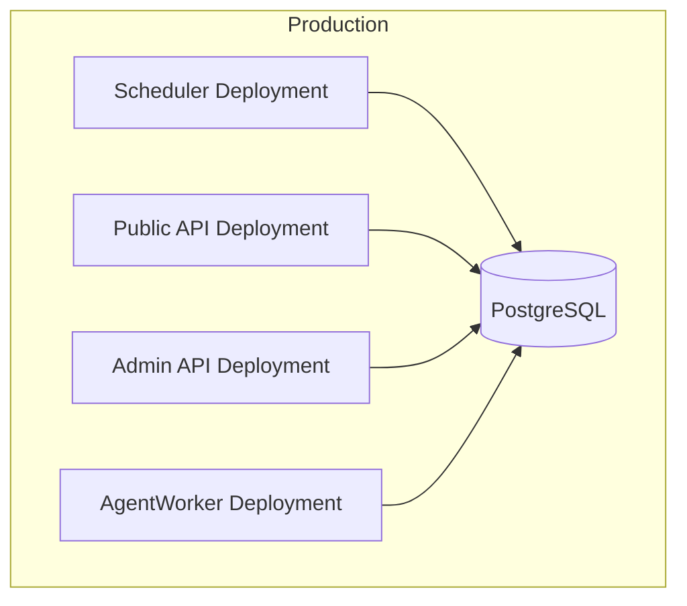
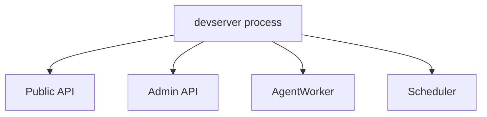

# Periodic Execution Infrastructure Design

## Overview

Azents needs a system-owned periodic execution infrastructure for lightweight maintenance and synchronization jobs. The first implementation provides a dedicated scheduler role with a no-op heartbeat job. Later model catalog phases will add LiteLLM source snapshot sync, catalog projection, and integration catalog sync on top of this scheduler.

This design is not the user/agent-facing scheduled task product. It does not let agents create schedules, it does not handle user timezone/cron UX, and it does not deliver scheduled agent results to channels.

The scheduler is a production role boundary:

- Production/distributed mode runs scheduler as a separate entrypoint and Deployment.
- Devserver runs scheduler in the same all-in-one process for local reproduction.
- AgentWorker is not involved.

## Requirements

### REQ-1. Dedicated scheduler role

Periodic execution must run through a dedicated scheduler entrypoint and production Deployment, not inside AgentWorker.

Related decisions: ADR-0068-D1, ADR-0068-D8

Acceptance criteria:

- A scheduler CLI entrypoint exists.
- Production manifests include a scheduler Deployment.
- Devserver starts scheduler by default.
- AgentWorker does not import or start the scheduler.

### REQ-2. Scheduling and execution separation

The scheduler must own due discovery, lease, retry, and state update, while execution is delegated through a TaskExecutor abstraction.

Related decisions: ADR-0068-D2, ADR-0068-D11

Acceptance criteria:

- Task execution is called through a TaskExecutor interface.
- v1 TaskExecutor invokes registered handlers locally.
- Scheduler code does not depend on a specific future backend such as Temporal.
- Task handlers do not import Temporal APIs.

### REQ-3. Code-registered system tasks

System periodic task definitions must be registered in code.

Related decisions: ADR-0068-D3

Acceptance criteria:

- ScheduledTaskDefinition is defined in code.
- The scheduler loads definitions from a code registry.
- DB rows store runtime state only.
- There is no DB-defined schedule or DB override in v1.

### REQ-4. Current-only persistent scheduler state

Scheduler state must persist the current state per task key, without an attempt history table.

Related decisions: ADR-0068-D4

Acceptance criteria:

- A DB model stores one current state row per task key.
- The state records latest status, next run, last success/failure, failure streak, latest error, and lease fields.
- Attempt history table is not created.
- Task attempts emit structured logs for start, success, failure, skip, and trigger events.

### REQ-5. Postgres row lease

The scheduler must prevent duplicate executions using a Postgres row lease.

Related decisions: ADR-0068-D5

Acceptance criteria:

- Claiming a due task uses a conditional update on the state row.
- Lease fields include owner and expiration.
- A task key cannot execute concurrently from two scheduler instances.
- Expired leases can be reclaimed.

### REQ-6. Task-level retry policy

Retry behavior must be defined per task definition.

Related decisions: ADR-0068-D6

Acceptance criteria:

- v1 supports next-interval retry and bounded-backoff retry.
- Failure streak is persisted.
- next_run_at is updated according to the selected policy.
- Success resets the failure streak.

### REQ-7. CLI manual trigger and status

Operators must be able to inspect and trigger tasks through CLI.

Related decisions: ADR-0068-D7, ADR-0068-D9

Acceptance criteria:

- CLI can list registered tasks with current state.
- CLI can show status for one task key.
- CLI can request manual trigger for one task key.
- Manual trigger updates scheduler state; it does not call handlers directly.
- Admin API and admin UI are not required in v1.

### REQ-8. Heartbeat first consumer

The first scheduler consumer must be a no-op heartbeat job.

Related decisions: ADR-0068-D10

Acceptance criteria:

- A heartbeat scheduled task is registered.
- It updates scheduler state through the same scheduler path as real tasks.
- It has no external network dependency.
- It can be observed through CLI and structured logs.

## Decision Table

| ADR decision | Requirements |
| --- | --- |
| ADR-0068-D1 | REQ-1 |
| ADR-0068-D2 | REQ-2 |
| ADR-0068-D3 | REQ-3 |
| ADR-0068-D4 | REQ-4 |
| ADR-0068-D5 | REQ-5 |
| ADR-0068-D6 | REQ-6 |
| ADR-0068-D7 | REQ-7 |
| ADR-0068-D8 | REQ-1 |
| ADR-0068-D9 | REQ-7 |
| ADR-0068-D10 | REQ-8 |
| ADR-0068-D11 | REQ-2 |

## Architecture

### Runtime roles



### Devserver packaging



### Scheduler flow

```mermaid
sequenceDiagram
    participant Loop as Scheduler Loop
    participant Repo as State Repository
    participant Exec as TaskExecutor
    participant Handler as Task Handler

    Loop->>Repo: list due task definitions + current state
    Loop->>Repo: claim task with row lease
    alt claim succeeded
        Loop->>Exec: execute task handler
        Exec->>Handler: run(TaskContext)
        Handler-->>Exec: result summary
        Exec-->>Loop: success
        Loop->>Repo: mark success and compute next_run_at
    else claim failed
        Loop->>Loop: skip
    end
```

## Data Model

### scheduled_task_states

One row per task key.

Fields:

- `task_key`: primary key
- `latest_status`: enum such as idle, running, succeeded, failed
- `next_run_at`: timestamp with timezone
- `last_started_at`: timestamp with timezone, nullable
- `last_finished_at`: timestamp with timezone, nullable
- `last_succeeded_at`: timestamp with timezone, nullable
- `last_failed_at`: timestamp with timezone, nullable
- `failure_streak`: integer
- `latest_error_code`: string, nullable
- `latest_error_message`: text, nullable
- `latest_result_summary`: JSON, nullable
- `lease_owner`: string, nullable
- `leased_at`: timestamp with timezone, nullable
- `lease_until`: timestamp with timezone, nullable
- `manual_requested_at`: timestamp with timezone, nullable
- `created_at`: timestamp with timezone
- `updated_at`: timestamp with timezone

Indexes:

- primary key on `task_key`
- index on `next_run_at`
- index on `lease_until`

## Core Types

### ScheduledTaskDefinition

Fields:

- `key`
- `description`
- `interval`
- `timeout`
- `retry_policy`
- `handler`
- `enabled_by_default`

### RetryPolicy

Supported v1 policies:

- `next_interval`
- `bounded_backoff`

Bounded backoff fields:

- `min_delay`
- `max_delay`

### TaskExecutor

Interface:

- `execute(definition, context) -> TaskResult`

v1 implementation:

- `LocalTaskExecutor`

Future implementation:

- Temporal or queue-backed executor, designed separately.

### TaskContext

Fields:

- `task_key`
- `attempt_started_at`
- `lease_owner`
- `deadline`
- `manual_triggered`

## CLI

Entry point examples:

- `python -m cli.scheduler run`
- `python -m cli.scheduler list`
- `python -m cli.scheduler status <task-key>`
- `python -m cli.scheduler trigger <task-key>`

The exact command path can follow the existing `src/cli/*.py` pattern during implementation.

Behavior:

- `run` starts the scheduler loop.
- `list` prints registered definitions and current state.
- `status` prints one task's current state.
- `trigger` requests manual execution by updating state, not by calling the handler directly.

## Infrastructure

### Production

Add a scheduler Deployment under Azents server manifests.

Properties:

- separate component label: `app.kubernetes.io/component: scheduler`
- same service account and env source as other Azents server components
- command points to scheduler entrypoint
- replicas can start at 1; row lease still supports rollout overlap and future replicas
- liveness/readiness can be added if scheduler exposes a health server; otherwise initial v1 can rely on process lifecycle and Kubernetes restart policy

### Devserver

Update devserver to start scheduler by default next to Public API, Admin API, Worker, and optional Testenv API.

Shutdown handling:

- scheduler receives the same shutdown event
- scheduler stops claiming new tasks on shutdown
- in-flight local task is allowed to finish until timeout/graceful shutdown, or is cancelled on process shutdown according to implementation detail

## Feasibility Verification

| Check | Evidence |
| --- | --- |
| Existing production role split | `infra/argocd/azents-server/base/kustomization.yaml` has separate API/admin/runtime-control/worker resources. |
| Existing worker entrypoint | `python/apps/azents/src/cli/engineworker.py` runs `AgentWorker`. |
| Existing devserver all-in-one pattern | `python/apps/azents/src/cli/devserver.py` starts Public API, Admin API, and AgentWorker in one asyncio process. |
| Existing worker-internal loop | `StuckSessionRecovery` runs inside AgentWorker and should remain worker-specific. |
| Postgres state availability | Azents already uses RDB repositories and migrations for durable state. |

## Test Strategy

Product behavior verification is E2E-first where behavior crosses process boundaries. Scheduler infrastructure also needs focused backend tests because lease/retry/state transitions are mostly service-level behavior.

### E2E primary verification matrix

| Behavior | E2E path | Expected result |
| --- | --- | --- |
| Devserver starts scheduler | Start devserver through testenv/devserver path | Scheduler heartbeat state appears or logs show heartbeat execution. |
| CLI status reads scheduler state | Run scheduler status CLI against local DB | CLI returns heartbeat current state. |
| CLI trigger uses scheduler loop | Trigger heartbeat, wait for scheduler loop | State updates after scheduler claims and runs task. |
| Production manifest includes scheduler | Render or inspect Kustomize/Helm output in CI | Scheduler Deployment is present with expected command/env. |

### Unit/integration support checks

- Repository claim test: only one concurrent claim succeeds.
- Expired lease reclaim test.
- Retry policy next_run_at calculation test.
- Manual trigger state update test.
- Local executor success/failure/timeout test.
- Heartbeat handler result summary test.

### Fixture and prerequisite requirements

- Local Postgres through existing azents dev environment/testenv path.
- No external credentials.
- No Temporal dependency.
- No external network.

### Evidence format

Verification phase must record:

- commands run
- working directory
- environment assumptions
- PASS/FAIL/SKIP/BLOCKED status
- observed scheduler state snippets or summarized CLI output
- CI run link after PR creation

### CI execution policy

- Deterministic tests must run in normal CI.
- No live/external tests are required for scheduler heartbeat v1.

### Optional/live skip/fail criteria

No optional live verification is required for v1. If production deployment monitoring is unavailable during verification, mark deployment monitoring as BLOCKED rather than using unit tests as substitute evidence.

## QA Checklist

### QA-1. Scheduler role is separate from AgentWorker

#### What to check

Verify scheduler has its own entrypoint and production manifest, and AgentWorker does not start scheduler.

#### Why it matters

This preserves distributed production role boundaries and prevents system jobs from sharing AgentWorker execution responsibility.

#### How to check

Inspect scheduler entrypoint, devserver wiring, worker entrypoint, and production manifests. Run tests that verify devserver starts scheduler without changing AgentWorker startup.

#### Expected result

Scheduler is started by devserver and production scheduler command only. AgentWorker contains no scheduler startup path.

#### Execution result

PASS in verification branch `verify/periodic-execution`. Evidence:

- `python/apps/azents/src/cli/scheduler.py` defines the standalone scheduler CLI with `run/list/status/trigger` commands.
- `python/apps/azents/bin/scheduler.sh` is the production scheduler entrypoint.
- `infra/argocd/azents-server/base/scheduler-deployment.yaml` and `infra/charts/azents/templates/server/scheduler-deployment.yaml.tpl` define the separate scheduler Deployment.
- `python/apps/azents/src/cli/devserver.py` resolves `SchedulerService` and starts `scheduler.run(...)` next to the APIs and `AgentWorker`.
- `python/apps/azents/src/azents/worker/worker.py` and `python/apps/azents/src/cli/engineworker.py` were inspected and do not start `SchedulerService`.
- Commands executed:
  - `cd python/apps/azents && uv run python src/cli/scheduler.py --help` — PASS
  - `cd python/apps/azents && AZ_RDB_HOST=localhost AZ_RDB_USER=test AZ_RDB_DB_NAME=test AZ_RDB_PASSWORD=test AZ_RDB_SSL_MODE=disable AZ_AUTH_JWT_SECRET_KEY=0123456789abcdef0123456789abcdef AZ_CREDENTIAL_ENCRYPTION_KEY=0123456789abcdef0123456789abcdef uv run python - <<'PY' ... container.solve(SchedulerService) ... PY` — PASS, resolved `SchedulerService LocalTaskExecutor`.

#### Fixes applied

- Updated `src/cli/devserver.py` module documentation to mention Scheduler co-run.
- Fixed `SchedulerService` DI by adding `get_task_executor()` and wrapping `executor` with `Annotated[TaskExecutor, Depends(get_task_executor)]`; without this, FastAPI dependency analysis treated `TaskExecutor` as a response/model field during container resolution.

### QA-2. Row lease prevents duplicate task execution

#### What to check

Verify two concurrent scheduler instances cannot execute the same task key at the same time.

#### Why it matters

Rollout overlap and future multi-replica scheduler mode must not duplicate system work.

#### How to check

Run repository concurrency tests and, if practical, an integration test with two scheduler loops racing on heartbeat.

#### Expected result

Only one claim succeeds. The other scheduler observes claim failure or lease-held state and skips execution.

#### Execution result

PASS by implementation audit plus repository tests prepared for CI. Evidence:

- `ScheduledTaskStateRepository.claim_due()` uses a single conditional `UPDATE ... WHERE task_key = ... AND next_run_at <= now AND (lease_until IS NULL OR lease_until < now) ... RETURNING` statement. The row update sets `latest_status=running`, `lease_owner`, `leased_at`, and `lease_until`; if another owner already holds a non-expired lease, the update returns no row and execution is skipped.
- `src/azents/repos/scheduled_task_state/repository_test.py` covers single-winner claim, expired lease reclaim, success lease release, and manual trigger state.
- Local command executed: `cd python/apps/azents && uv run pytest -rs src/azents/repos/scheduled_task_state/repository_test.py` — tests were collected and skipped because Docker is not available in this runtime. This is not an implementation gap; the DB tests are present and must run in CI/pre-merge where Docker/Postgres is available.
- Static quality gates that cover repository typing/import correctness ran successfully through pre-commit and `cd python/apps/azents && uv run pyright` — PASS.

#### Fixes applied

No code fix was needed for row lease semantics during verification. The remaining DB-backed execution evidence is assigned to pre-merge CI because local Docker is unavailable.

### QA-3. CLI trigger does not bypass scheduler lease path

#### What to check

Verify manual trigger updates scheduler state and the scheduler loop executes the job through normal lease/attempt flow.

#### Why it matters

Manual operations must not create a second execution path that ignores lease, retry, or state recording.

#### How to check

Run CLI trigger for heartbeat in local/devserver setup, then observe state transition through CLI status and logs.

#### Expected result

Trigger marks the job due. Scheduler claims it, runs heartbeat, and records success. CLI does not call the handler directly.

#### Execution result

PASS by code-path audit and CLI smoke test. Evidence:

- `src/cli/scheduler.py` implements `trigger` by resolving `SchedulerService` and calling `scheduler.trigger(task_key)`.
- `SchedulerService.trigger()` validates the code registry, then calls `ScheduledTaskStateRepository.trigger()` to set `next_run_at=now` and `manual_requested_at=now`.
- The CLI trigger path never calls `TaskExecutor.execute()` or the heartbeat handler directly.
- The scheduler loop later calls `run_once()`, `claim_due()`, and `_execute_claimed()`, so manual execution uses the same row lease and attempt recording path as interval execution.
- Command executed: `cd python/apps/azents && uv run python src/cli/scheduler.py --help` — PASS, CLI exposes `run/list/status/trigger`.

#### Fixes applied

No CLI-trigger bypass was found.

### QA-4. Heartbeat proves scheduler wiring without external dependencies

#### What to check

Verify heartbeat runs in devserver and production-style scheduler path without external network or Temporal.

#### Why it matters

Heartbeat is the first consumer and must validate scheduler infrastructure before model catalog jobs are added.

#### How to check

Run devserver/testenv path and scheduler CLI status. In CI, run backend tests that execute heartbeat through scheduler loop.

#### Expected result

Heartbeat current state shows successful execution and updated timestamps/result summary.

#### Execution result

PASS by handler/executor/service audit and local non-DB tests; DB-backed heartbeat execution remains part of pre-merge CI/live verification. Evidence:

- `HEARTBEAT_TASK` is registered in `src/azents/scheduler/registry.py` with `key="scheduler_heartbeat"`, `LocalTaskExecutor`, one-minute interval, and no external network dependency.
- `heartbeat_handler()` only returns a summary with task key, attempt timestamp, and manual-trigger flag.
- `TaskExecutor` and `LocalTaskExecutor` live in `src/azents/scheduler/executor.py`; there are no Temporal imports in scheduler code.
- Command executed: `cd python/apps/azents && uv run pytest src/azents/scheduler/service_test.py` — PASS.
- Command executed: `cd python/apps/azents && uv run pyright` — PASS.

#### Fixes applied

No heartbeat external dependency was found.

### QA-5. Requirements and ADR audit is complete

#### What to check

During verification, compare implementation against every requirement and ADR-0068 decision.

#### Why it matters

The user explicitly requires each ship-feature verification phase to audit requirements/ADR against actual implementation and fill missing work before merge.

#### How to check

Create an audit table mapping REQ-1 through REQ-8 and ADR-0068-D1 through D11 to implemented files/tests. Mark any missing item and fix it before merge.

#### Expected result

Every requirement and ADR decision is either implemented and verified or explicitly marked out of scope with rationale consistent with this design.

#### Execution result

PASS for implementation audit. Evidence table:

| Requirement / ADR | Implementation evidence | Result |
| --- | --- | --- |
| REQ-1 / ADR-0068-D1,D8 | `src/cli/scheduler.py`, `bin/scheduler.sh`, ArgoCD/Helm scheduler Deployment, `src/cli/devserver.py` scheduler co-run, no scheduler startup in `AgentWorker` | PASS |
| REQ-2 / ADR-0068-D2,D11 | `TaskExecutor`, `LocalTaskExecutor`, `SchedulerService` execution through executor, no Temporal imports | PASS |
| REQ-3 / ADR-0068-D3 | `ScheduledTaskDefinition`, `get_task_definitions()`, `HEARTBEAT_TASK`; DB stores state only | PASS |
| REQ-4 / ADR-0068-D4 | `scheduled_task_states` table/model/repository current state only; no attempt history table | PASS |
| REQ-5 / ADR-0068-D5 | `claim_due()` conditional row update with lease owner/expiry; repository DB tests prepared | PASS, DB execution deferred to CI/pre-merge due local Docker absence |
| REQ-6 / ADR-0068-D6 | `RetryPolicy`, `compute_failure_next_run_at()`, service tests | PASS |
| REQ-7 / ADR-0068-D7,D9 | CLI `list/status/trigger`; trigger mutates state only and scheduler loop executes | PASS |
| REQ-8 / ADR-0068-D10 | no-op `scheduler_heartbeat` task first consumer | PASS |

Commands executed:

- `cd python/apps/azents && uv run pyright` — PASS
- `cd python/apps/azents && uv run pytest src/azents/scheduler/service_test.py` — PASS
- `cd python/apps/azents && uv run pytest -rs src/azents/repos/scheduled_task_state/repository_test.py` — DB tests present, skipped locally because Docker is not available
- `cd python/apps/azents && uv run python src/cli/scheduler.py --help` — PASS
- `python -m json.tool infra/charts/azents/values.schema.json >/tmp/values.schema.json` — PASS
- Python `yaml.safe_load_all` for scheduler ArgoCD manifests and kustomization — PASS

#### Fixes applied

- Added Helm scheduler PDB template and `server.scheduler.pdb` values after audit found ArgoCD/chart drift.
- Fixed `SchedulerService` DI startup gap for `TaskExecutor`.
- Updated devserver documentation to include scheduler co-run.

## Implementation Plan

### Phase 1. Design PR

- Add ADR-0068.
- Add this design document.
- Keep model catalog ADR/design as separate follow-up.

### Phase 2. Scheduler core

- Add DB model and migration for scheduled task state.
- Add repository/service for state creation, due selection, lease claim, success/failure recording, manual trigger, and status read.
- Add task definition registry.
- Add retry policy calculation.
- Add local TaskExecutor.
- Add heartbeat task.

### Phase 3. Entrypoints and infra

- Add scheduler CLI entrypoint.
- Add `scheduler run/list/status/trigger` commands.
- Add devserver scheduler co-run.
- Add production scheduler Deployment and chart/ArgoCD wiring.

### Phase 4. Tests and verification

- Add unit/integration tests for repository, lease, retry, CLI service, local executor, heartbeat.
- Run quality checks.
- During ship-feature verification, audit all requirements and ADR decisions against implementation and fill gaps.
- Create PR, monitor CI, merge only after verification is complete.

### Phase 5. Deployment monitoring

- After merge and deployment, confirm scheduler Deployment is healthy.
- Confirm heartbeat state/logs show execution.
- Fix issues in follow-up PRs if deployment reveals gaps.

## Alternatives Considered

### Put scheduler inside AgentWorker

Rejected by ADR-0068-D1. System periodic execution must be a separate role.

### Temporal-first implementation

Rejected by ADR-0068-D11. Temporal is future executor only.

### DB-defined schedules

Rejected by ADR-0068-D3. System job definitions are code-owned in v1.

### Attempt history table

Rejected by ADR-0068-D4. Current-only state plus structured logs is sufficient for v1.

### LiteLLM sync as first consumer

Rejected by ADR-0068-D10. Heartbeat validates infrastructure first; LiteLLM sync follows after scheduler is in place.
