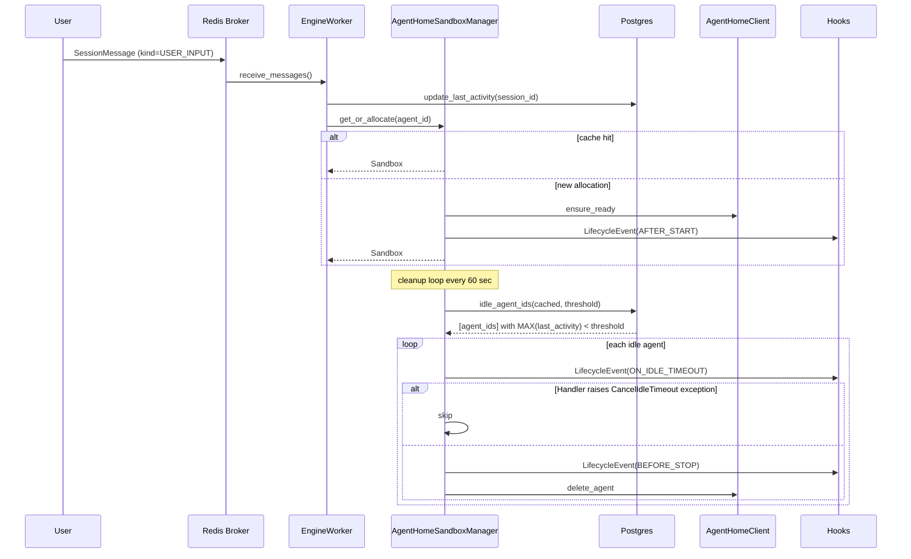
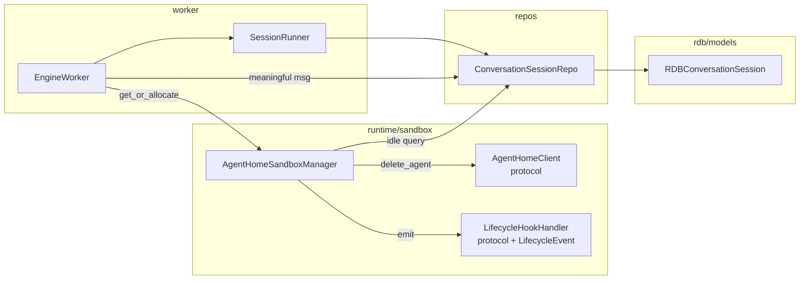

# Phase 1 — Separate Activity Tracking + Lifecycle Hook Interface (Design)

> Decision basis document: [../../adr/phase1-260416-phase1-activity-tracking-lifecycle-hooks.md](../adr/phase1-260416-phase1-activity-tracking-lifecycle-hooks.md)
> Parent issue: #2609 / preceding research: #2608

## 1. Overview

Switch Agent Home idle decision to **DB `conversation_sessions.last_activity_at`** basis, and formalize integration surface for follow-up Phases (state capture / snapshot / notification) by inserting **lifecycle hooks** into decision/deletion flow.

User scenarios:
- When user talks to agent in Slack → that session `last_activity_at` updates to NOW()
- Worker restart / reconnect probe / Redis lock TTL refresh are **not counted as activity** → only "truly idle Agent Home" is accurately determined as idle
- Follow-up Phase can easily extend by subscribing to `before_stop` hook for git diff backup, `after_start` hook for metric emission, etc.

## 2. Architecture

### 2.1 State flow



### 2.2 Component boundaries



- Remove `update_last_used` / `list_idle_agents` from `AgentHomeClient` protocol. Client only owns container lifecycle.
- Manager directly queries DB for idle decision (through repository method).
- Hook is Manager-internal event.

## 3. Data Model

### 3.1 Migration (`conversation_sessions.last_activity_at`)

File: `python/apps/nointern/db-schemas/rdb/migrations/versions/c2ea1992a602_add_last_activity_at_to_conversation_sessions.py`

> **Actual implementation reflected (2026-04-15)**: `down_revision` is fixed to `0057dab8a446`, the latest `alembic heads` at PR-3 merge point. `revision` was generated as random 8-hex `c2ea1992a602`. Also `db-schemas/rdb/revision` file must be updated to `c2ea1992a602` so devserver `alembic_upgrade` applies to latest head (fixed forward in PR-5).

```python
"""add last_activity_at to conversation_sessions

Revision ID: c2ea1992a602
Revises: 0057dab8a446
Create Date: 2026-04-15
"""
from collections.abc import Sequence

import sqlalchemy as sa
from alembic import op

revision: str = "c2ea1992a602"
down_revision: str | None = "0057dab8a446"
branch_labels: str | Sequence[str] | None = None
depends_on: str | Sequence[str] | None = None


def upgrade() -> None:
    op.add_column(
        "conversation_sessions",
        sa.Column(
            "last_activity_at",
            sa.TIMESTAMP(timezone=True),
            nullable=True,
        ),
    )
    op.execute(
        """
        UPDATE conversation_sessions
        SET last_activity_at = updated_at
        WHERE last_activity_at IS NULL
        """
    )
    op.alter_column(
        "conversation_sessions",
        "last_activity_at",
        nullable=False,
        server_default=sa.func.now(),
    )
    op.create_index(
        "ix_conversation_sessions_agent_id_last_activity_at",
        "conversation_sessions",
        ["agent_id", "last_activity_at"],
    )


def downgrade() -> None:
    op.drop_index("ix_conversation_sessions_agent_id_last_activity_at", table_name="conversation_sessions")
    op.drop_column("conversation_sessions", "last_activity_at")
```

**Design intent**:
- 3-step upgrade: add column (nullable) → backfill existing rows → promote to NOT NULL + default NOW(). Safe for large tables.
- Composite index `(agent_id, last_activity_at)` → covers critical idle decision query path.
- Migration ID generated as random 8-hex at creation time + duplicate checked (memory rule).

### 3.2 Model change

`python/apps/nointern/src/nointern/rdb/models/conversation_session.py`:

```python
last_activity_at: Mapped[datetime.datetime] = mapped_column(
    TimeZoneDateTime,
    init=False,
    server_default=sa.func.now(),
    nullable=False,
)
```

- Unlike `updated_at`, do not set `onupdate` — non-activity updates such as title change must not become activity.

### 3.3 Repository methods

`python/apps/nointern/src/nointern/repos/conversation_session/__init__.py`:

> **Actual implementation reflected (2026-04-15)**: Following existing NoIntern `ConversationSessionRepository` pattern, `session: AsyncSession` is the **first positional argument** (stateless repo convention, not using `self._session` stateful field).

```python
async def touch_last_activity_at(
    self,
    session: AsyncSession,
    session_id: str,
    *,
    now: datetime.datetime | None = None,
) -> None:
    """Update the session's last activity time to NOW()."""
    ts = now if now is not None else datetime.datetime.now(datetime.timezone.utc)
    await session.execute(
        sa.update(RDBConversationSession)
        .where(RDBConversationSession.id == session_id)
        .values(last_activity_at=ts)
    )

async def find_idle_agent_ids(
    self,
    session: AsyncSession,
    *,
    agent_ids: Sequence[str],
    threshold: datetime.timedelta,
) -> list[str]:
    """Return agent ids whose MAX(last_activity_at) exceeds threshold among given agent_id set."""
    if not agent_ids:
        return []
    cutoff = datetime.datetime.now(datetime.timezone.utc) - threshold
    subq = (
        sa.select(
            RDBConversationSession.agent_id.label("agent_id"),
            sa.func.max(RDBConversationSession.last_activity_at).label("last_act"),
        )
        .where(RDBConversationSession.agent_id.in_(list(agent_ids)))
        .group_by(RDBConversationSession.agent_id)
        .subquery()
    )
    stmt = sa.select(subq.c.agent_id).where(subq.c.last_act < cutoff)
    result = await session.execute(stmt)
    return [row[0] for row in result.all()]
```

## 4. Implementation Details

### 4.1 Clean up AgentHomeClient protocol

`python/apps/nointern/src/nointern/runtime/sandbox/agent_home.py`:

- **Remove**: `update_last_used(agent_id)`, `list_idle_agents(threshold)`
- Impact: remove these methods from `DockerAgentHomeClient`, `K8sAgentHomeClient`, `FakeAgentHomeClient` and update tests
- Keep `delete_agent`

### 4.2 Lifecycle Hook infrastructure

`python/apps/nointern/src/nointern/runtime/sandbox/lifecycle_hooks.py` (new):

```python
"""Agent Home lifecycle hook interface.

AgentHomeSandboxManager emits LifecycleEvent at AFTER_START, BEFORE_STOP,
and ON_IDLE_TIMEOUT, and registered handlers process them.
"""
from __future__ import annotations

import enum
import logging
from collections.abc import Mapping, Sequence
from dataclasses import dataclass, field
from typing import Any, Protocol

logger = logging.getLogger(__name__)


class LifecycleEventType(enum.StrEnum):
    AFTER_START = "after_start"
    BEFORE_STOP = "before_stop"
    ON_IDLE_TIMEOUT = "on_idle_timeout"


@dataclass(frozen=True, slots=True)
class LifecycleEvent:
    type: LifecycleEventType
    agent_id: str
    reason: str
    metadata: Mapping[str, Any] = field(default_factory=dict)


class LifecycleHookHandler(Protocol):
    """async-callable, receives a LifecycleEvent."""

    async def __call__(self, event: LifecycleEvent) -> None: ...


class CancelIdleTimeout(Exception):
    """A handler may raise this during ON_IDLE_TIMEOUT to skip cleanup."""

    def __init__(self, reason: str) -> None:
        super().__init__(reason)
        self.reason = reason


async def dispatch_lifecycle_event(
    handlers: Sequence[LifecycleHookHandler],
    event: LifecycleEvent,
) -> None:
    """Call every handler sequentially. Log failures and isolate.

    For ON_IDLE_TIMEOUT, re-propagate CancelIdleTimeout exception.
    """
    for handler in handlers:
        try:
            await handler(event)
        except CancelIdleTimeout:
            raise
        except Exception:
            logger.exception(
                "Lifecycle hook handler failed",
                extra={
                    "event_type": event.type.value,
                    "agent_id": event.agent_id,
                    "handler": getattr(handler, "__name__", type(handler).__name__),
                },
            )
```

### 4.3 AgentHomeSandboxManager changes

- Extend `__init__` signature:

> **Actual implementation reflected (2026-04-15)**: Because Repo method follows stateless pattern, inject `SessionManager[AsyncSession]` too and open single DB transaction in `_cleanup_idle` with `async with self._session_manager() as db_session`. `ConversationSessionRepository` is named to match actual type name.

```python
def __init__(
    self,
    client: AgentHomeClient,
    conversation_session_repository: ConversationSessionRepository,  # NEW
    session_manager: SessionManager[AsyncSession],                   # NEW
    *,
    idle_timeout_secs: float = 1800.0,
    hooks: Sequence[LifecycleHookHandler] = (),                      # NEW
) -> None: ...
```

- `get_or_allocate`:
  - Remove `update_last_used` call
  - Immediately after new allocation (`ensure_ready` success), `dispatch_lifecycle_event(AFTER_START, reason="cache_miss_allocation")`

- `delete`:
  - Just before `delete_agent`, `dispatch_lifecycle_event(BEFORE_STOP, reason="explicit_delete")`

- `_cleanup_idle`:

> **Actual implementation reflected (2026-04-15)**: Changed `find_idle_agent_ids` call to occur inside `session_manager()` context. Pass `db_session` explicitly for observability.

```python
async def _cleanup_idle(self) -> None:
    cached_ids = list(self._sandboxes.keys())
    if not cached_ids:
        return

    async with self._session_manager() as db_session:
        idle_ids = await self._repo.find_idle_agent_ids(
            db_session,
            agent_ids=cached_ids,
            threshold=timedelta(seconds=self._idle_timeout_secs),
        )
    for agent_id in idle_ids:
        try:
            await dispatch_lifecycle_event(
                self._hooks,
                LifecycleEvent(
                    type=LifecycleEventType.ON_IDLE_TIMEOUT,
                    agent_id=agent_id,
                    reason="idle_cleanup",
                ),
            )
        except CancelIdleTimeout as e:
            logger.info(
                "Idle cleanup cancelled by handler",
                extra={"agent_id": agent_id, "reason": e.reason},
            )
            continue

        await dispatch_lifecycle_event(
            self._hooks,
            LifecycleEvent(
                type=LifecycleEventType.BEFORE_STOP,
                agent_id=agent_id,
                reason="idle_cleanup",
            ),
        )
        self._sandboxes.pop(agent_id, None)
        self._locks.pop(agent_id, None)
        try:
            await self._client.delete_agent(agent_id)
        except Exception:
            logger.exception(
                "Failed to delete idle Agent Home",
                extra={"agent_id": agent_id},
            )
```

### 4.4 EngineWorker activity update point

`python/apps/nointern/src/nointern/worker/engine.py`:

- `EngineWorker` already has `conversation_session_repository: ConversationSessionRepository` (engine.py:220). No new DI needed.
- In `EngineWorker.run()`, call `self.conversation_session_repository.touch_last_activity_at(session_id)` only for `SessionMessage` received by `broker.receive_messages()` with `kind != SessionMessageKind.RESUME`.
- `SessionMessageKind` has only `USER` / `RESUME` values (`broker/types.py:14-18`). Default is `USER`.
- Concrete insertion point: immediately before `runner.enqueue(message)` (engine.py:280).
- Edge cases:
  - `SessionCommand` (slash command), `SessionStopRequest` → Phase 1 does **not** count as activity (30-min threshold has enough margin and preceding user message already recorded activity)
  - refine in follow-up Phase if needed
- `touch_last_activity_at` is independent DB write per session → use short-lived session separate from existing conversation DB transaction for failure isolation

### 4.5 DI update

`python/apps/nointern/src/nointern/worker/deps.py`:

- `ConversationSessionRepository` is already imported and injected into `EngineWorker` (deps.py:22, 164)
- Need new injection of `ConversationSessionRepository` + `hooks=()` into `AgentHomeSandboxManager` (modify `get_agent_home_manager` factory)
- In Phase 1, complete wiring with `hooks=()` (empty default). Actual handler injection is follow-up Phase.

## 5. API / Frontend / Infra

**No change**. This Phase only cleans internal integration surface.

## 6. Feasibility Verification

| Item | Status | Note |
|---|---|---|
| add `conversation_sessions` column migration possible | OK | same pattern as latest migration `fea922c9bf44` |
| composite index creation cost | OK | thousands of rows in test DB; even in production, small enough (sessions ≲ tens of thousands) that CREATE INDEX CONCURRENTLY unnecessary |
| `SessionMessageKind` has `RESUME` enum | OK | `broker/types.py:14-18` — only USER/RESUME values exist |
| DI target `ConversationSessionRepository` exists in worker context | OK | already imported + injected in `worker/deps.py:22,164`. no extra wiring needed |
| EngineWorker has `conversation_session_repository` field | OK | confirmed at `engine.py:220` |
| Hook failure isolation logic does not break existing delete flow | OK | log & swallow pattern, preserve existing `_cleanup_idle` `except Exception` |
| No leak when removing `update_last_used` from Docker / K8s client | OK | method internals are purely for activity tracking. no other path references it (verified by grep) |

### Risks / Mitigation

| Risk | Probability | Impact | Mitigation |
|---|---|---|---|
| Activity update DB write burdens worker hot path | medium | medium | short-lived session + independent commit. introduce write coalescing later if needed |
| Migration backfill slow on large conversation_sessions | low | medium | single UPDATE, `updated_at` already exists. expected a few seconds. CONCURRENTLY not needed |
| Hook handler accidentally blocks agent lifecycle | medium | high | log & swallow + sequential dispatch. consider asyncio.gather + timeout in follow-up Phase |
| Missing case where RESUME incorrectly considered activity | medium | medium | unit test + scenario verifying activity is not updated after enqueueing `SessionMessageKind.RESUME` |

## 7. testenv QA Scenarios

`testenv/nointern/scenarios/` uses pair pattern of `TC-*.md` (frontmatter + description) + `tc_handlers/.../tc_*.py` (`docs/development/web/testenv-260414-testenv-runner-redesign.md`, existing `TC-SBOX-001` reference). Phase 1 adds following 4 TCs under new category `agent-home-lifecycle/`.

- `TC-LCY-001` — happy path: update `last_activity_at` on SessionMessage(USER) receive
- `TC-LCY-002` — RESUME non-update: force RESUME injection and confirm `last_activity_at` unchanged
- `TC-LCY-003` — DB-based idle cleanup: backdate `last_activity_at` → run cleanup → container deleted
- `TC-LCY-004` — Lifecycle hook recording: AFTER_START / BEFORE_STOP order and payload

Example (TC-LCY-001 concept):

### TC-LCY-001: Activity update — happy path

```python
# testenv/nointern/scenarios/phase1_activity_tracking.py
async def scenario(client):
    user = await client.auth.create_user()
    ws = await client.workspace.create(user)
    agent = await client.agent.create(ws, user)

    t0 = datetime.now(timezone.utc)
    session = await client.chat.start_session(agent, user)
    await client.chat.send(session, "hello")

    # direct DB query
    row = await client.admin.sql(
        "SELECT last_activity_at FROM conversation_sessions WHERE id = :id",
        id=session.id,
    )
    assert row["last_activity_at"] >= t0
```

### Scenario 2: RESUME message is not counted as activity

```python
async def scenario(client):
    # create session then record last_activity_at
    session = ...
    await client.admin.sql(
        "UPDATE conversation_sessions SET last_activity_at = NOW() - INTERVAL '31 minutes' "
        "WHERE id = :id",
        id=session.id,
    )

    # simulate worker restart → enqueue RESUME
    await client.devtools.simulate_worker_restart()

    # verify: last_activity_at unchanged
    row = await client.admin.sql(
        "SELECT last_activity_at FROM conversation_sessions WHERE id = :id",
        id=session.id,
    )
    assert (datetime.now(timezone.utc) - row["last_activity_at"]) > timedelta(minutes=30)
```

### Scenario 3: Idle cleanup works based on DB

```python
async def scenario(client):
    # create session + Agent Home
    session = ...
    await client.chat.send(session, "hello")

    # backdate to 30+ minutes ago
    await client.admin.sql(
        "UPDATE conversation_sessions SET last_activity_at = NOW() - INTERVAL '31 minutes' "
        "WHERE id = :id",
        id=session.id,
    )

    # cleanup trigger (test API: manually call manager._cleanup_idle())
    await client.devtools.trigger_agent_home_cleanup()

    # verify: container deleted (Docker backend check with docker ps)
    containers = await client.devtools.list_agent_home_containers()
    assert agent.id not in [c.agent_id for c in containers]
```

### Scenario 4: Lifecycle hook call order

```python
async def scenario(client):
    # devtools: inject test recording hook
    await client.devtools.install_recording_hooks()

    # create session + explicit delete immediately
    session = await client.chat.start_session(agent, user)
    await client.chat.send(session, "hi")
    await client.devtools.delete_agent_home(agent.id)

    events = await client.devtools.fetch_recorded_hook_events()
    assert [e.type for e in events] == ["after_start", "before_stop"]
```

## 8. testenv Impact

- **New seed block**: none (existing auth/workspace/agent sufficient)
- **New `devtools` API**:
  - `install_recording_hooks()` — inject test-only recording hook (QA support within Phase 1 scope)
  - `trigger_agent_home_cleanup()` — manually run cleanup loop
  - `simulate_worker_restart()` — reproduce RESUME enqueue
  - `list_agent_home_containers()` — query Docker backend state
- **Existing scenarios**: no breakage. All E2E goes through “meaningful message creates activity” path, so compatible.
- **docker-compose / .env.example**: no change.
- **preflight**: no change.

## 9. Implementation Plan (Phase split)

Ship as 2 stacked PRs.

### PR-1: Separate Activity Tracking

**Branch**: `feat/phase1-activity-tracking` (base: `main`)

Files:
- `python/apps/nointern/db-schemas/rdb/migrations/versions/{new}_add_last_activity_at_to_conversation_sessions.py`
- `python/apps/nointern/src/nointern/rdb/models/conversation_session.py`
- `python/apps/nointern/src/nointern/repos/conversation_session/__init__.py`
- `python/apps/nointern/src/nointern/runtime/sandbox/agent_home.py` (remove `update_last_used`, `list_idle_agents`)
- `python/apps/nointern/src/nointern/runtime/sandbox/agent_home_manager.py` (switch to DB idle query, remove `update_last_used` calls)
- `python/apps/nointern/src/nointern/runtime/sandbox/agent_home_docker.py`, `agent_home_k8s.py` (remove deprecated methods)
- `python/apps/nointern/src/nointern/worker/engine.py` (touch last_activity_at at dispatch)
- `python/apps/nointern/src/nointern/worker/deps.py` (inject ConversationSessionRepo into manager)
- Tests: `agent_home_manager_test.py`, `conversation_session_repo_test.py`, migration test

### PR-2: Lifecycle Hook Interface

**Branch**: `feat/phase1-lifecycle-hooks` (base: `feat/phase1-activity-tracking`)

Files:
- `python/apps/nointern/src/nointern/runtime/sandbox/lifecycle_hooks.py` (new)
- `python/apps/nointern/src/nointern/runtime/sandbox/agent_home_manager.py` (hooks DI + dispatch)
- `python/apps/nointern/src/nointern/worker/deps.py` (`hooks=()` wiring)
- Tests: `lifecycle_hooks_test.py`, `agent_home_manager_test.py` (hook dispatch, CancelIdleTimeout)

PR-2 is stacked PR based on PR-1. Once PR-1 is merged, automatically switch base to main.

## 10. Alternatives Considered

| Alternative | Rejection reason |
|---|---|
| `agents.last_activity_at` (column on agent table) | Agent is cold setting, and activity update creates unrelated write burden. Aggregate query is simple, so session side is natural |
| Dedicated Redis activity store instead of DB | low restart resilience, difficult consistency across multiple workers. DB = single source of truth |
| Keep Client `list_idle_agents` + DB together | debugging hell if two sources disagree. decision should have single source |
| Count activity with allowlist (UserInput only) | Phase 1 has no probe. over-engineering |
| Hook subclass (extend AgentHomeClient) | couples Backend (Docker/K8s) and lifecycle logic → pollution |
| Stop delete on Hook failure | blast radius too large. discuss option in Phase 2 |
| Cleanup loop interval / threshold adjustment | outside Phase 1 scope. separate tuning phase |

## 11. Success Criteria

- [ ] `conversation_sessions.last_activity_at` column exists + composite index (`agent_id`, `last_activity_at`)
- [ ] Migration up / down verification complete
- [ ] `last_activity_at` updates on meaningful SessionMessage receive (unit + testenv scenario)
- [ ] `SessionMessageKind.RESUME` does not update (unit test)
- [ ] `AgentHomeSandboxManager._cleanup_idle` works based on DB query (unit test)
- [ ] `update_last_used`, `list_idle_agents` removed from `AgentHomeClient`
- [ ] 3 hook points defined + default no-op behavior + sequential dispatch + failure isolation
- [ ] cleanup can be skipped with `CancelIdleTimeout` exception (unit test)
- [ ] Quality checks pass (ruff / pyright / pytest)
- [ ] 4 testenv scenarios pass
- [ ] no existing E2E regression
