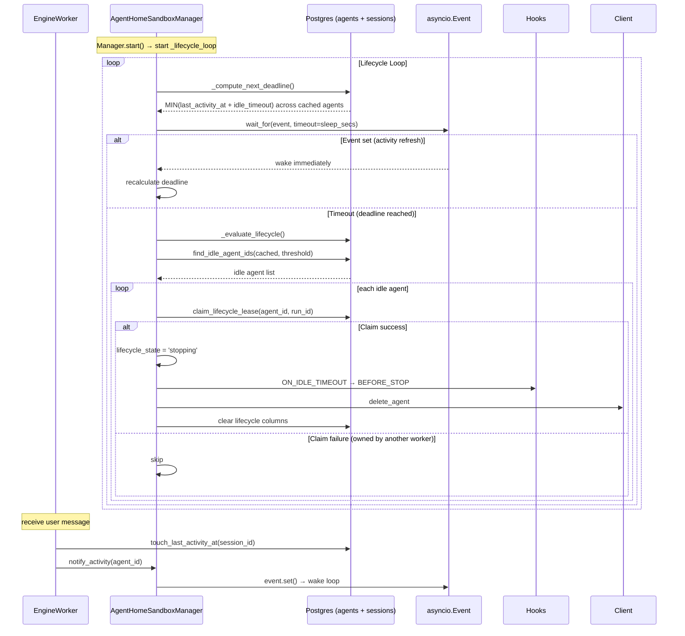
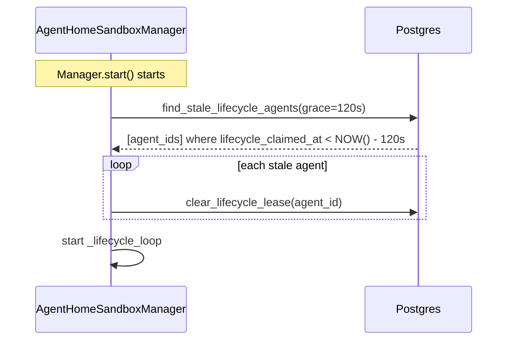

# Phase 2 — Durable Lifecycle Workflow + Lease Token (Design)

> Discussion basis: [../../adr/0020-phase2-durable-lifecycle-workflow.md](../../adr/0020-phase2-durable-lifecycle-workflow.md)
> Parent issue: #2627 / Prerequisite: #2609 (Phase 1), #2608 (Research)

## 1. Overview

Replace Phase 1 60-second polling cleanup loop with **deadline-driven lifecycle loop + DB lease token**.

User scenarios:
- On Agent Home allocation → idle deadline (NOW + 30 minutes) is calculated and recorded in DB.
- When user sends message → deadline is extended and sleeping loop wakes immediately.
- When deadline reached → lease claim → idle judgment → hooks → delete (at exact time).
- After Worker crash and restart → stale lease detected (120s grace) → lifecycle resumes.

## 2. Architecture

### 2.1 Lifecycle Loop Flow



### 2.2 Crash Recovery



## 3. Data Model

### 3.1 Migration (extend `agents` table)

File: `python/apps/nointern/db-schemas/rdb/migrations/versions/{new}_add_lifecycle_columns_to_agents.py`

```python
def upgrade() -> None:
    op.add_column("agents", sa.Column("lifecycle_run_id", sa.String(80), nullable=True))
    op.add_column("agents", sa.Column("lifecycle_state", sa.String(20), nullable=True))
    op.add_column("agents", sa.Column("lifecycle_claimed_at", sa.TIMESTAMP(timezone=True), nullable=True))

def downgrade() -> None:
    op.drop_column("agents", "lifecycle_claimed_at")
    op.drop_column("agents", "lifecycle_state")
    op.drop_column("agents", "lifecycle_run_id")
```

Backfill unnecessary — NULL = untracked.

### 3.2 Model Change

`python/apps/nointern/src/nointern/rdb/models/agent.py`:

```python
# Lifecycle management columns — Phase 2
lifecycle_run_id: Mapped[str | None] = mapped_column(
    sa.String(80), nullable=True, default=None,
)
lifecycle_state: Mapped[str | None] = mapped_column(
    sa.String(20), nullable=True, default=None,
)
lifecycle_claimed_at: Mapped[datetime.datetime | None] = mapped_column(
    TimeZoneDateTime, nullable=True, default=None,
)
```

### 3.3 Repository Methods

`python/apps/nointern/src/nointern/repos/agent/__init__.py` (or separate lifecycle repo):

```python
async def claim_lifecycle_lease(
    self,
    session: AsyncSession,
    agent_id: str,
    run_id: str,
) -> bool:
    """Atomically claim Lifecycle lease.

    Succeeds only when lifecycle_run_id is NULL or same as current run_id.
    """
    stmt = (
        sa.update(RDBAgent)
        .where(
            RDBAgent.id == agent_id,
            sa.or_(
                RDBAgent.lifecycle_run_id.is_(None),
                RDBAgent.lifecycle_run_id == run_id,
            ),
        )
        .values(
            lifecycle_run_id=run_id,
            lifecycle_state="stopping",
            lifecycle_claimed_at=datetime.datetime.now(datetime.timezone.utc),
        )
    )
    result = await session.execute(stmt)
    return result.rowcount > 0

async def clear_lifecycle_lease(
    self,
    session: AsyncSession,
    agent_id: str,
    *,
    run_id: str | None = None,
) -> None:
    """Release Lifecycle lease.

    If run_id is provided, release only after ownership check (no-op on owner mismatch).
    """
    conditions = [RDBAgent.id == agent_id]
    if run_id is not None:
        conditions.append(RDBAgent.lifecycle_run_id == run_id)
    stmt = (
        sa.update(RDBAgent)
        .where(*conditions)
        .values(
            lifecycle_run_id=None,
            lifecycle_state=None,
            lifecycle_claimed_at=None,
        )
    )
    await session.execute(stmt)

async def set_lifecycle_active(
    self,
    session: AsyncSession,
    agent_id: str,
) -> None:
    """Set Agent lifecycle_state to 'active'.

    Called when Agent Home is allocated.
    """
    stmt = (
        sa.update(RDBAgent)
        .where(RDBAgent.id == agent_id)
        .values(lifecycle_state="active")
    )
    await session.execute(stmt)

async def find_stale_lifecycle_agents(
    self,
    session: AsyncSession,
    *,
    grace_secs: float,
) -> list[str]:
    """Return agents whose Lifecycle lease is stale."""
    cutoff = datetime.datetime.now(datetime.timezone.utc) - datetime.timedelta(seconds=grace_secs)
    stmt = (
        sa.select(RDBAgent.id)
        .where(
            RDBAgent.lifecycle_claimed_at.is_not(None),
            RDBAgent.lifecycle_claimed_at < cutoff,
        )
    )
    result = await session.execute(stmt)
    return [row[0] for row in result.all()]
```

## 4. Implementation Details

### 4.1 AgentHomeSandboxManager Changes

**Constructor addition**:
```python
def __init__(self, ..., agent_repository: AgentRepository, ...):
    ...
    self._agent_repo = agent_repository
    self._activity_event = asyncio.Event()
    self._lifecycle_run_id = f"lifecycle:{uuid4().hex}"  # per-manager instance
```

**New methods**:

```python
async def notify_activity(self, agent_id: str) -> None:
    """Notify lifecycle loop that Activity occurred."""
    if agent_id in self._sandboxes:
        self._activity_event.set()

async def _lifecycle_loop(self) -> None:
    """Deadline-driven lifecycle loop. Replaces existing _cleanup_loop."""
    while True:
        try:
            next_deadline = await self._compute_next_deadline()
            sleep_secs = min(
                max((next_deadline - _utcnow()).total_seconds(), 1.0) if next_deadline else 60.0,
                60.0,
            )
            try:
                await asyncio.wait_for(self._activity_event.wait(), timeout=sleep_secs)
                self._activity_event.clear()
            except asyncio.TimeoutError:
                pass
            await self._evaluate_lifecycle()
        except asyncio.CancelledError:
            break
        except Exception:
            logger.exception("Error in lifecycle loop")

async def _compute_next_deadline(self) -> datetime.datetime | None:
    """Return minimum idle deadline of cached agents."""
    cached_ids = list(self._sandboxes.keys())
    if not cached_ids:
        return None
    async with self._session_manager() as db_session:
        # MIN of MAX(last_activity_at) per agent + idle_timeout
        # new repo method or variation of existing find_idle_agent_ids
        return await self._repo.compute_earliest_idle_deadline(
            db_session, agent_ids=cached_ids, idle_timeout_secs=self._idle_timeout_secs,
        )

async def _evaluate_lifecycle(self) -> None:
    """Find due agents, claim lease → hooks → delete."""
    cached_ids = list(self._sandboxes.keys())
    if not cached_ids:
        return
    async with self._session_manager() as db_session:
        idle_ids = await self._repo.find_idle_agent_ids(
            db_session, agent_ids=cached_ids,
            threshold=datetime.timedelta(seconds=self._idle_timeout_secs),
        )
    for agent_id in idle_ids:
        async with self._session_manager() as db_session:
            claimed = await self._agent_repo.claim_lifecycle_lease(
                db_session, agent_id, self._lifecycle_run_id,
            )
        if not claimed:
            logger.info("Lifecycle lease not acquired", extra={"agent_id": agent_id})
            continue
        try:
            # ON_IDLE_TIMEOUT
            try:
                await dispatch_lifecycle_event(self._hooks, LifecycleEvent(
                    type=LifecycleEventType.ON_IDLE_TIMEOUT,
                    agent_id=agent_id, reason="idle_cleanup",
                ))
            except CancelIdleTimeout as e:
                logger.info("Idle cleanup cancelled", extra={"agent_id": agent_id, "reason": e.reason})
                async with self._session_manager() as db_session:
                    await self._agent_repo.clear_lifecycle_lease(db_session, agent_id, run_id=self._lifecycle_run_id)
                continue
            # BEFORE_STOP
            await dispatch_lifecycle_event(self._hooks, LifecycleEvent(
                type=LifecycleEventType.BEFORE_STOP,
                agent_id=agent_id, reason="idle_cleanup",
            ))
            # Delete
            self._sandboxes.pop(agent_id, None)
            self._locks.pop(agent_id, None)
            await self._client.delete_agent(agent_id)
        except Exception:
            logger.exception("Failed to stop idle Agent Home", extra={"agent_id": agent_id})
        finally:
            async with self._session_manager() as db_session:
                await self._agent_repo.clear_lifecycle_lease(db_session, agent_id, run_id=self._lifecycle_run_id)
```

**start() change**:
```python
async def start(self) -> None:
    # Crash recovery — clear stale lease
    await self._recover_stale_leases()
    # Start deadline-driven loop (replace existing _cleanup_loop)
    self._lifecycle_task = asyncio.create_task(
        self._lifecycle_loop(), name="agent-home-lifecycle",
    )

async def _recover_stale_leases(self) -> None:
    async with self._session_manager() as db_session:
        stale_ids = await self._agent_repo.find_stale_lifecycle_agents(
            db_session, grace_secs=_STALE_GRACE_SECS,
        )
    for agent_id in stale_ids:
        async with self._session_manager() as db_session:
            await self._agent_repo.clear_lifecycle_lease(db_session, agent_id)
        logger.info("Cleared stale lifecycle lease", extra={"agent_id": agent_id})
```

**get_or_allocate() change**:
- After new allocation succeeds (ensure_ready success) → call `set_lifecycle_active(agent_id)`
- Wake loop with `_activity_event.set()` (register new agent deadline)

### 4.2 EngineWorker Change

Call `notify_activity` after `_touch_session_activity`:

```python
if isinstance(message, SessionMessage) and message.kind != SessionMessageKind.RESUME:
    await self._touch_session_activity(session_id)
    # Phase 2: lifecycle deadline refresh
    await self.sandbox_manager.notify_activity(message.agent_id)
```

### 4.3 ConversationSessionRepository Additional Method

```python
async def compute_earliest_idle_deadline(
    self,
    session: AsyncSession,
    *,
    agent_ids: Sequence[str],
    idle_timeout_secs: float,
) -> datetime.datetime | None:
    """Return earliest idle deadline among cached agents.

    deadline = MIN of MAX(last_activity_at) + idle_timeout per agent.
    """
    if not agent_ids:
        return None
    subq = (
        sa.select(
            sa.func.max(RDBConversationSession.last_activity_at).label("last_act"),
        )
        .where(RDBConversationSession.agent_id.in_(list(agent_ids)))
        .group_by(RDBConversationSession.agent_id)
        .subquery()
    )
    stmt = sa.select(
        sa.func.min(subq.c.last_act + sa.text(f"INTERVAL '{idle_timeout_secs} seconds'"))
    )
    result = await session.execute(stmt)
    row = result.scalar_one_or_none()
    return row
```

### 4.4 DI Update

`python/apps/nointern/src/nointern/engine/tools/deps.py`:

```python
from nointern.repos.agent import AgentRepository

def get_sandbox_manager(..., ...):
    return AgentHomeSandboxManager(
        client, conversation_session_repo, session_manager,
        agent_repository=AgentRepository(),  # NEW
        idle_timeout_secs=..., hooks=...,
    )
```

### 4.5 Constants

```python
_STALE_GRACE_SECS = 120.0    # Crash recovery grace period
_LIFECYCLE_LOOP_CAP_SECS = 60.0  # Maximum sleep between evaluations
```

## 5. API / Frontend / Infra

**No change.**

## 6. Feasibility Verification

| Item | Status | Note |
|---|---|---|
| add columns to `agents` table | OK | same existing pattern |
| asyncio.Event + wait_for combination | OK | pattern verified in EngineWorker (`engine.py` shutdown waiter) |
| DB compare-and-set (UPDATE WHERE) | OK | PostgreSQL atomic update |
| `AgentRepository` exists in worker DI | needs verification | need confirm injectable in `deps.py` |
| `compute_earliest_idle_deadline` SQL | OK | `INTERVAL` + `MIN` + subquery, uses composite index |

### Risks

| Risk | Probability | Impact | Mitigation |
|---|---|---|---|
| asyncio.Event race (timing between set and wait) | low | low | Event is level-triggered → wait after set returns immediately |
| loop stops on DB query failure | medium | medium | isolate with try/except, 60s fallback sleep |
| Multi-worker simultaneous claim race | low (currently single worker) | medium | atomic UPDATE WHERE → only one succeeds |
| misjudge normal worker as stale within grace period | low | high | 120s sufficient for network hiccup. refresh lifecycle_claimed_at every loop iteration |

## 7. testenv QA Scenarios

### TC-LCY-101 — Deadline-driven loop cleans up at exact time

- Create Agent Home → `idle_timeout_secs=5` (testenv override)
- Wait 5s → cleanup occurs → confirm container deleted
- live promotion of existing TC-LCY-003

### TC-LCY-102 — Activity refresh extends deadline

- Create Agent Home (idle=5s) → send message after 3s → deadline extended by 5s
- No cleanup at original 5s point → confirm cleanup at 8s point

### TC-LCY-103 — Lease claim prevents duplicate cleanup

- evaluate same agent twice → second fails to acquire lease → skip
- Unit test scope (multi-worker is future)

### TC-LCY-104 — Crash recovery: clear stale lease

- Set Agent `lifecycle_claimed_at` to 120s+ ago
- Manager start → detect stale → clear lease → lifecycle resumes

## 8. testenv Impact

- **new seed**: none
- **config override**: `NI_AGENT_HOME_IDLE_TIMEOUT_SECS=5` (testenv env)
- **existing scenarios**: no impact (loop replacement is internal behavior change)
- **docker-compose**: no change

## 9. Implementation Plan

3 stacked PRs (docs/plan separate):

### PR-1: DB + Lease infra

- Migration (3 columns in agents table)
- Agent model change
- AgentRepository methods (claim/clear/find_stale/set_active)
- ConversationSessionRepository.compute_earliest_idle_deadline
- Unit tests

### PR-2: Lifecycle Loop replacement

- `AgentHomeSandboxManager._lifecycle_loop` (replace existing `_cleanup_loop`)
- `_evaluate_lifecycle`, `_compute_next_deadline`, `_recover_stale_leases`
- `notify_activity`, `_activity_event`
- DI update (AgentRepository injection)
- call `set_lifecycle_active` in get_or_allocate
- Unit + integration tests

### PR-3: EngineWorker integration

- call `notify_activity` after `_touch_session_activity`
- Unit tests

## 10. Alternatives Considered

| Alternative | Rejection reason |
|---|---|
| Per-agent asyncio task (Vercel per-session workflow) | task management complexity high; global loop achieves same accuracy |
| Redis sorted set based timer | duplicate state store, consistency problem, violates DB single source philosophy |
| Temporal / Celery durable workflow | additional infra cost, overkill for current NoIntern scale |
| separate `agent_lifecycle_leases` table | agent count low; join cost vs separate table management cost unfavorable |
| Heartbeat-based worker health | lease claimed_at sufficient; separate heartbeat excessive |

## 11. Changes from Design after Implementation (Reconciliation)

During PR-1 ~ PR-3 implementation, following changes from design occurred.

| Item | Design (§4.1) | Implementation | Reason |
|---|---|---|---|
| `_lifecycle_loop` sleep calculation | one-line ternary | `if/else` branch + `_LIFECYCLE_LOOP_CAP_SECS` constant reference | improved readability, functionally same |
| `CancelIdleTimeout` lease release | handler directly called `clear_lifecycle_lease` then `continue` | only `continue`; lease release delegated to `finally` block | avoid double-clear, unify lease release path |
| `_evaluate_lifecycle` logging | minimal (`"Lifecycle lease not acquired"` only) | added `"Deleting idle Agent Home"` + `idle_secs` metadata | improved operational visibility |
| PR structure | PR-1 (DB), PR-2 (Loop), PR-3 (Worker) | same 3-PR stack + added PR-4 (testenv QA) | separated testenv scenario into separate PR |

All changes are functionally identical to design and improve code quality/readability.

## 12. Success Criteria

- [x] `agents` 3-column migration up/down
- [x] Lease claim compare-and-set works (unit test)
- [x] `_lifecycle_loop` wakes accurately at deadline (mock clock, ±1s)
- [x] `notify_activity` → Event.set() → loop recalculation (unit test)
- [x] Stale lease recovery on startup (unit test)
- [x] Existing `_cleanup_loop` removed
- [x] Quality check passed
- [x] testenv TC-LCY-101~104 scenarios registered (audit-only PASS)
