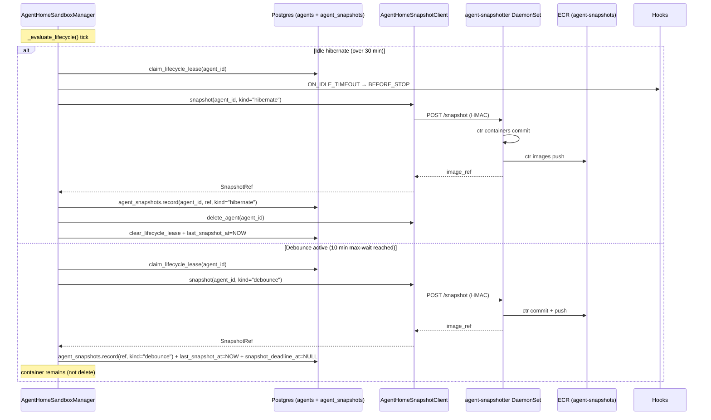
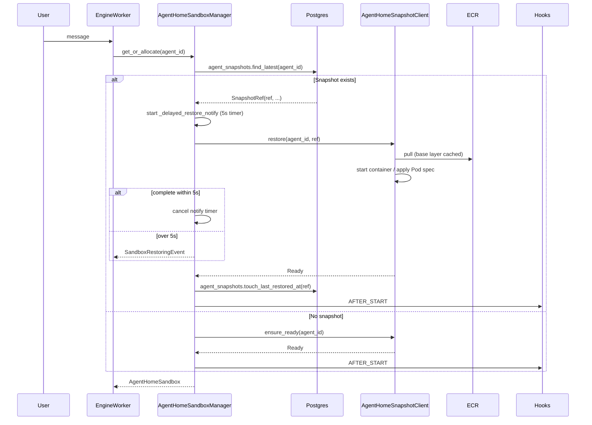

# Phase 3 — Agent Home Snapshot Hibernation (Design)

> Discussion basis: [../../adr/phase3-260418-phase3-snapshot-hibernation.md](../adr/phase3-260418-phase3-snapshot-hibernation.md)
> Parent issue: #2661 / Prerequisites: #2627 (Phase 2), #2609 (Phase 1), #2608 (Research)
> Full discussion: #2664

## 1. Overview

### 1.1 Purpose

Replace Phase 2 lifecycle of "idle 30 minutes → delete" with **"idle → hibernate → resume"**. On hibernate, preserve container ephemeral layer (rootfs writable layer) as OCI image snapshot, and on next access restart Pod from that image to restore within seconds.

### 1.2 Result (after Phase 3 completion)

```
No user message (30 minutes)
  → _evaluate_lifecycle() detects
  → BEFORE_STOP hook → create snapshot (ECR push)
  → stop container / Pod
(days later) user message arrives
  → get_or_allocate → check snapshot from DB → restore
  → Pod spec uses snapshot image ref → containerd pull + run
  → ready within 5 seconds (base layer cached, only diff pulled)
```

### 1.3 Scope

**Included**:
- Container rootfs snapshot (filesystem-only)
- 2-layer storage model (`/data/*` EFS persistent / rootfs ephemeral)
- Idle hibernate + debounced active snapshot + Pod preStop trigger
- Both Docker local and K8s production backends
- Agent awareness via system prompt + dynamic feedback

**Excluded** (Phase 4+):
- CRIU-based process state preservation
- S3-backed persistent layer
- periodic safety snapshot
- Manual snapshot tool
- demoting `/home/sandbox` to ephemeral

---

## 2. Architecture

### 2.1 2-Layer Storage Model

| Path | Layer | Backend | Included in snapshot? |
|---|---|---|---|
| `/data/agent` | **Persistent** | EFS subPath `agents/{id}/agent` | ❌ |
| `/data/user` | **Persistent** | EFS subPath `agents/{id}/users` | ❌ |
| `/data/platform/*` | **Read-only** | Image embedded | ❌ |
| `/home/sandbox` | **Persistent** (kept in Phase 3) | EFS subPath `agents/{id}/home` | ❌ |
| `/usr/local`, `/etc`, `/var/lib`, `/opt` | **Ephemeral** | container rootfs | ✅ |
| `/root/.cache`, `/root/.config` | **Ephemeral** | container rootfs | ✅ |
| `/tmp` | **Ephemeral** (skip by convention) | container rootfs | — |

**Contract**:
- **Persistent layer** — guarantees durable storage; `/data/*` can be accessed from nointern-server even without sandbox (space for memory/skills extension)
- **Ephemeral layer** — best-effort snapshot. Fresh container fallback on failure

### 2.2 Snapshot Backend

**Local Docker** (`DockerAgentHomeClient`):

```
snapshot(agent_id):
  aiodocker container.commit(repository, tag) → image
  docker.images.push(repository, tag)
  return image_ref
```

**K8s production** (`K8sAgentHomeClient`):

```
snapshot(agent_id):
  → HTTP POST <daemonset_url>/snapshot (HMAC-signed, body={agent_id})
  → DaemonSet (node-local, privileged):
      ctr -n k8s.io containers commit <container_id> <image_ref>
      ctr -n k8s.io images push <image_ref>
  → return image_ref (ECR tag)
```

**Restore (common)**:
- Manager specifies `image: <snapshot_ref>` in Pod spec → containerd pull (base layer cached) + run
- aiodocker similarly uses `docker run <snapshot_image>`
- no init / bootstrap needed — entire image is state

### 2.3 Snapshot Flow



### 2.4 Restore Flow



---

## 3. Data Model

### 3.1 `agents` table extension (Phase 3)

File: `python/apps/nointern/db-schemas/rdb/migrations/versions/{new}_add_snapshot_columns_to_agents.py`

```python
def upgrade() -> None:
    op.add_column("agents", sa.Column("last_state_change_at", sa.TIMESTAMP(timezone=True), nullable=True))
    op.add_column("agents", sa.Column("last_snapshot_at", sa.TIMESTAMP(timezone=True), nullable=True))
    op.add_column("agents", sa.Column("snapshot_deadline_at", sa.TIMESTAMP(timezone=True), nullable=True))

def downgrade() -> None:
    op.drop_column("agents", "snapshot_deadline_at")
    op.drop_column("agents", "last_snapshot_at")
    op.drop_column("agents", "last_state_change_at")
```

Meaning:
- `last_state_change_at` — last state-change event received time (exec / file write / edit / delete)
- `last_snapshot_at` — last successful snapshot creation time
- `snapshot_deadline_at` — max-wait expiry time of current debounce cycle. Set at first state-change, cleared to NULL on snapshot creation

No backfill needed — NULL = untracked / inactive.

### 3.2 New `agent_snapshots` table

```python
class RDBAgentSnapshot(RDBModel):
    """Agent Home snapshot metadata.

    Phase 3 keeps only latest 1 snapshot per agent. ECR is source of truth,
    this table is for index + isolation verification.
    """
    __tablename__ = "agent_snapshots"

    id: Mapped[str] = mapped_column(sa.String(26), primary_key=True)  # UUID7 hex
    agent_id: Mapped[str] = mapped_column(
        sa.String(26),
        sa.ForeignKey("agents.id", ondelete="CASCADE"),
        nullable=False,
        index=True,
    )
    image_ref: Mapped[str] = mapped_column(sa.String(512), nullable=False)
    digest: Mapped[str | None] = mapped_column(sa.String(128), nullable=True)
    backend: Mapped[str] = mapped_column(sa.String(20), nullable=False)  # 'docker' | 'k8s-ctr'
    kind: Mapped[str] = mapped_column(sa.String(20), nullable=False)      # 'hibernate' | 'debounce' | 'terminating'
    size_bytes: Mapped[int | None] = mapped_column(sa.BigInteger, nullable=True)
    created_at: Mapped[datetime.datetime] = mapped_column(TimeZoneDateTime, nullable=False)
    last_restored_at: Mapped[datetime.datetime | None] = mapped_column(TimeZoneDateTime, nullable=True, default=None)
```

Index:
- `(agent_id, created_at DESC)` — for `find_latest(agent_id)`

Cascade:
- `ON DELETE CASCADE` — automatic cleanup on agent deletion
- Workspace delete → agent delete → automatic cascade

### 3.3 ECR Lifecycle Policy

```json
{
  "rules": [
    {
      "rulePriority": 1,
      "description": "Delete snapshots older than 30 days",
      "selection": {
        "tagStatus": "tagged",
        "tagPatternList": ["*"],
        "countType": "sinceImagePushed",
        "countUnit": "days",
        "countNumber": 30
      },
      "action": {"type": "expire"}
    }
  ]
}
```

---

## 4. Trigger Design

### 4.1 3 Trigger Types

| Trigger | Condition | Container handling | kind |
|---|---|---|---|
| **Idle hibernate** | `NOW() - last_activity_at > 30min` | delete | `hibernate` |
| **Debounce active** | `NOW() >= snapshot_deadline_at` | keep | `debounce` |
| **Pod preStop** | K8s SIGTERM / spot interruption / eviction / drain | delete (Pod is already terminating) | `terminating` |

### 4.2 Debounce with Max-wait (10 minutes)

**State-change events (4)**:
- `POST /exec` — shell execute (any path)
- `PUT /files` — file write (new/overwrite)
- `PATCH /files` — file edit (old_string → new_string)
- `DELETE /files` — file delete

**Unified trigger regardless of path** — writes to EFS path are not included in commit diff and practical cost is minimal; avoids maintenance cost of conditional logic.

**Max-wait behavior**:
- first state-change: `snapshot_deadline_at = NOW + 10min`
- later events coalesce (deadline unchanged) — guarantees snapshot once every 10 minutes even during continuous activity
- when `NOW >= snapshot_deadline_at` reached → snapshot → clear `snapshot_deadline_at = NULL`

### 4.3 Lifecycle Loop Integration

Phase 2 `_compute_next_deadline` also considers snapshot deadline:

```
next_wake = min(
  idle_deadline      (last_activity_at + 30min),
  snapshot_deadline  (snapshot_deadline_at if not NULL),
)
```

`_evaluate_lifecycle` branches:
- idle exceeded → hibernate snapshot + delete
- snapshot_deadline exceeded → debounce snapshot (container remains)

### 4.4 Communication Channel

Because Manager is caller of sandbox-daemon, **separate notify channel is unnecessary**. Call `manager.notify_state_change(agent_id)` hook at each call site of `AgentHomeSandbox.exec` / `.write_file` / `.edit_file` / `.delete_file`:

- `agents.last_state_change_at = NOW`
- if `agents.snapshot_deadline_at` is NULL, set `NOW + 10min`
- `activity_event.set()` — wake lifecycle loop

### 4.5 preStop Hook

Add to Pod spec:

```yaml
spec:
  terminationGracePeriodSeconds: 90   # new in Phase 3 (default 30 → 90)
  containers:
    - name: agent-runtime
      lifecycle:
        preStop:
          exec:
            command:
              - /usr/local/bin/sandbox-teardown
              - "--agent-id"
              - "$(AGENT_ID)"
```

`sandbox-teardown` is internal CLI of sandbox-daemon — sends HMAC-signed request to `POST /admin/v1/agent-home/terminating?agent_id=...` → Manager executes same path as hibernate (BEFORE_STOP hook → snapshot → delete_agent).

Time budget: preStop 1-2s + snapshot 5-15s ≈ 20s → enough margin in `terminationGracePeriodSeconds: 90`.

---

## 5. Snapshot Backend (DaemonSet)

### 5.1 agent-snapshotter DaemonSet

**Configuration**:
- Namespace: `nointern-snapshotter` (separate namespace)
- Privileged + `hostPath: /var/run/containerd/containerd.sock`
- IAM: ECR push/pull only (Pod Identity)
- Image: signature verification follow-up after Phase 3 (#2695 — cosign + Kyverno verifyImages)

**HTTP API** (narrow surface):

| Method | Path | Body | Description |
|---|---|---|---|
| `POST` | `/snapshot` | `{agent_id}` | container commit + ECR push → returns `{image_ref, digest, size_bytes}` |
| `POST` | `/delete-snapshot` | `{image_ref}` | ECR untag (for agent / workspace delete cascade) |

No arbitrary `ctr` / `docker` commands exposed. `agent_id` is regex validated (`^[a-zA-Z0-9-]+$`), `image_ref` prefix verified (`<ecr>/agent-snapshots:`).

### 5.2 DaemonSet internal flow (ctr path)

```
POST /snapshot {agent_id}
  → HMAC validation (body + timestamp, 60s replay window)
  → Pod → query container ID (K8s API / Pod status)
  → ctr -n k8s.io containers commit <container_id> <image_ref>
  → ctr -n k8s.io images push <image_ref>
  → return {image_ref, digest, size_bytes}
```

Image tag format: `<ecr>/agent-snapshots:<agent_id_hash>-<ts>`
- `agent_id_hash` = sha256(agent_id)[:12] — avoid direct agent ID exposure
- `ts` = UUID7 nanosecond precision — avoid collision

### 5.3 Security — 3 Core Defenses

⚠️ **Change**: Actual implementation uses NetworkPolicy-based isolation. HMAC was not adopted.

1. **NetworkPolicy**
   - `nointern-snapshotter` namespace ingress → allow only `from: namespace=nointern, serviceAccount=nointern-server`
   - Default deny egress external + ECR endpoint allow-list

2. **HMAC request signature**
   - Shared secret: K8s Secret mounted in both namespaces
   - Request header: `X-Signature: HMAC-SHA256(body + ":" + timestamp)`
   - `X-Timestamp` validation — 60-second replay window
   - Reusable implementation: HMAC-SHA256 webhook validation pattern in `python/apps/nointern/src/nointern/core/auth/discord_gateway.py`

3. **Narrow API**
   - no endpoints beyond the 2 above
   - Input validation (agent_id regex, image_ref prefix)
   - Image ref generated server-side — client cannot choose arbitrary tag

**Additional safeguards**:
- ECR KMS encryption (provided by AWS by default)
- DaemonSet image signing + admission verification follow-up after Phase 3 (#2695)
- IAM: ECR push/pull only (no S3/EC2/other permissions)
- Audit log — snapshot create/restore/delete events recorded with `logger.info/warning` (Sentry-sdk `LoggingIntegration` automatically sends error-level)

---

## 6. Client Layer

### 6.1 Protocol extension

Keep `AgentHomeClient` and separate snapshot as **separate protocol** — clearer interface, optional implementation possible:

```python
class AgentHomeSnapshotClient(abc.ABC):
    """Protocol for snapshot / restore of Agent Home.

    Docker / K8s backends implement this separately. Injected with AgentHomeClient in Phase 3.
    """

    @abc.abstractmethod
    async def snapshot(self, agent_id: str, *, kind: SnapshotKind) -> SnapshotRef:
        """Store current container ephemeral layer as OCI image and push to ECR."""

    @abc.abstractmethod
    async def restore(self, agent_id: str, ref: SnapshotRef) -> None:
        """Start container from Snapshot image and make it ready."""

    @abc.abstractmethod
    async def delete_snapshot(self, ref: SnapshotRef) -> None:
        """Delete Snapshot from ECR (for agent/workspace delete cascade)."""


@dataclass(frozen=True, slots=True)
class SnapshotRef:
    image_ref: str
    digest: str | None
    size_bytes: int | None


class SnapshotKind(enum.Enum):
    HIBERNATE = "hibernate"
    DEBOUNCE = "debounce"
    TERMINATING = "terminating"
```

### 6.2 Docker Backend

`DockerAgentHomeSnapshotClient`:

- `snapshot` — call aiodocker `container.commit(repository=..., tag=...)` then `docker.images.push()`
- `restore` — `docker pull` + `docker run` with new image tag (reuse existing `ensure_ready` path but with image override)
- `delete_snapshot` — registry API or `docker rmi` (skip for local registry)

### 6.3 K8s Backend

`K8sAgentHomeSnapshotClient`:

- `snapshot` — HMAC-signed POST to DaemonSet `POST /snapshot`
  - Node affinity — choose DaemonSet endpoint on same node by `status.hostIP` of agent Pod
  - DaemonSet service exposes per-node endpoint (ClusterIP + topology-aware routing)
- `restore` — specify `image: <snapshot_ref>` in Pod spec and use existing lightkube-based `create_pod` path
- `delete_snapshot` — DaemonSet `POST /delete-snapshot`

### 6.4 Fake Backend

`FakeAgentHomeSnapshotClient` (for unit tests):

- in-memory dict mapping snapshot image_ref → metadata
- size limit, failure injection possible (test flexibility)

### 6.5 AgentHomeSandboxManager integration

**New methods**:
- `notify_state_change(agent_id)` — call site hook
- `_compute_snapshot_deadline()` — query `agents.snapshot_deadline_at`, include in lifecycle loop deadline calculation
- extend `_evaluate_lifecycle` branch — idle → hibernate snapshot, debounce → active snapshot

**get_or_allocate branch**:
- Snapshot exists → `_snapshot_client.restore(agent_id, ref)` + timer-based `SandboxRestoringEvent` emission
- Snapshot absent → existing `ensure_ready`

**New Repository**:

```python
class AgentSnapshotRepository:
    async def record_snapshot(
        self, session, agent_id: str, *, ref: SnapshotRef, kind: SnapshotKind, backend: str,
    ) -> str: ...

    async def find_latest(self, session, agent_id: str) -> RDBAgentSnapshot | None: ...

    async def delete_snapshot_row(self, session, image_ref: str) -> None: ...

    async def touch_last_restored_at(self, session, image_ref: str) -> None: ...
```

Latest 1 policy per agent — `record_snapshot` deletes previous row then inserts. Actual ECR deletion is async cleanup through `delete_snapshot` RPC.

---

## 7. Restore UX

### 7.1 Hybrid 5-second Threshold

```python
async def get_or_allocate(self, agent_id: str, ...) -> AgentHomeSandbox:
    ...
    snap = await self._snap_repo.find_latest(db, agent_id)
    if snap is not None:
        deferred_notify = asyncio.create_task(
            self._delayed_restore_notify(agent_id, threshold_secs=5.0)
        )
        try:
            await self._snapshot_client.restore(agent_id, SnapshotRef(...))
        finally:
            deferred_notify.cancel()
    else:
        await self._client.ensure_ready(agent_id, ...)
```

`_delayed_restore_notify`:
```python
async def _delayed_restore_notify(self, agent_id: str, *, threshold_secs: float) -> None:
    try:
        await asyncio.sleep(threshold_secs)
        await self._emit_event(SandboxRestoringEvent(agent_id=agent_id))
    except asyncio.CancelledError:
        pass
```

**Event interface**:
- `SandboxRestoringEvent` — new (when over 5 seconds)
- `SandboxInitializingEvent` / `SandboxReadyEvent` — reuse existing

### 7.2 Adapter Integration

WebSocket / Slack / Discord adapters add `SandboxRestoringEvent` to existing sandbox event handling. Example message: `"Restoring Agent Home..."` (i18n handled by each adapter policy).

---

## 8. Failure Policy

### 8.1 Ephemeral contract

Snapshot is **best-effort cache** — user data is stored separately in `/data/*` (EFS). Critical loss does not occur even if restore fails and falls back to fresh container.

### 8.2 Handling by failure type

| Failure type | Handling |
|---|---|
| Snapshot creation failure (during hibernate) | `delete_agent` fallback, Sentry warning (user offline) |
| Snapshot creation failure (during debounce) | clear `snapshot_deadline_at = NULL`, Sentry warning, retry in next debounce cycle |
| Restore failure (ECR 404 / corruption / timeout) | delete snapshot metadata → `ensure_ready` fresh → soft notice before next response `[info] Previous environment restore failed, starting fresh` |
| ECR pull/push failure | retry once then fallback |
| DaemonSet RPC failure | 30-second timeout → fallback |
| Health check failure (container started but not healthy) | reuse existing Phase 1/2 `invalidate` + fresh path |

### 8.3 Metric thresholds

- Snapshot failure rate >5% / 1h → Slack alert
- Restore failure rate >1% / 1h → Slack alert (more sensitive)
- ECR storage threshold → CloudWatch alarm
- Base image drift invalidation count per deploy → alert on large drift

### 8.4 Base image upgrade (D15)

When Sandbox base image (`nointern_agent_runtime_image`) is deployed as new version, existing snapshot was committed on old base. If base changes, user runtime drift + delayed security patch can occur, so adopt **explicit invalidation policy** (D14, Option A).

**Mechanism**:

1. Add `agent_snapshots.base_image_ref VARCHAR(512) NOT NULL` column — store OCI reference (including digest, e.g. `public.ecr.aws/.../nointern-sandbox@sha256:abc...`) of base image at snapshot creation time. Snapshotter returns actual pod image by querying with `crictl inspect`.
2. Manager restore path compares `snapshot.base_image_ref != config.agent_runtime_image`. On mismatch:
   - delete `agent_snapshots` row + async ECR untag
   - fallback to fresh pod path (reuse existing "no snapshot" flow)
   - Sentry info + increment metric `snapshot_invalidated_base_image_drift_count`
   - soft notice to user `[info] Starting fresh due to previous environment compatibility issue` (optional)
3. `/data/*` (EFS) remains unchanged — no user data loss.

**Trade-off**:
- Pros: clear, applies breaking / CVE patch immediately, old base layer storage in ECR naturally released.
- Cons: every agent experiences cold start once even on non-breaking rolling deploy.

**Out of scope (follow-up #2684)**: SemVer / compat_key based backward compatibility allowance policy. Initial scope starts simple with "invalidate if different", then relax if needed after observing production drift frequency.

---

## 9. Retention

### 9.1 Automatic cleanup

- **ECR lifecycle policy** — automatically expire untagged / unaccessed images older than 30 days
- **Latest 1 per agent** — when new snapshot created, previous snapshot DB row DELETE + async ECR untag

### 9.2 Cascade Delete

- `agent_snapshots.agent_id` FK `ON DELETE CASCADE` — automatic DB row cleanup when agent deleted
- On Agent delete / Workspace delete hook, explicitly call `snapshot_client.delete_snapshot(ref)` → synchronous ECR cleanup

### 9.3 Cleanup Job

ECR lifecycle policy handles timed expiration, so separate cron is unnecessary. If drift occurs between DB and ECR, audit job for recovery is considered in Phase 4+.

---

## 10. Multi-tenant Isolation

### 10.1 Isolation Layers

| Layer | Isolation mechanism |
|---|---|
| DB row | `agent_snapshots.agent_id` FK + ON DELETE CASCADE, every query includes `agent_id` filter |
| Image ref | server-side generation (regex-validated), `<ecr>/agent-snapshots:<agent_id_hash>-<ts>` |
| ECR scope | tag separation in single repository — no separate repo per workspace needed |
| Restore verification | Manager always goes through `repo.find_latest(agent_id)` — does not accept external `snap_ref` |

### 10.2 Attack scenarios & defenses

| Scenario | Defense |
|---|---|
| malicious agent attempts restore with arbitrary `snap_ref` | Manager queries only from DB — no external input path |
| agent reassignment race during snapshot creation | Phase 2 lease guarantees mutual exclusion per agent_id |
| ECR tag collision | UUID7 time monotonicity + agent_id_hash prefix — negligible collision probability |
| arbitrary snap_ref injection from Testenv endpoint | guarded by `Config.testenv_api_enabled` feature flag |

### 10.3 ECR KMS Encryption

- Provided by AWS by default — encrypted at rest
- Transport uses TLS
- IAM: only DaemonSet push/pull, worker Pod read-only

---

## 11. Termination Handling

### 11.1 Karpenter SQS Interruption (verified)

- Confirmed Karpenter v1.9 + `interruptionQueue` setting (`infra/terragrunt/_modules/eks-cluster/addons.tf:106`)
- Spot interruption flow:
  1. AWS publishes interruption to SQS
  2. Karpenter receives → node cordon + Pod eviction
  3. Pod SIGTERM → **preStop hook executes** → waits for `terminationGracePeriodSeconds`
- Separate spot watcher DaemonSet **unnecessary** (Karpenter performs same role)

### 11.2 Pod preStop + Manager Endpoint

⚠️ **Change**: Actual implementation uses NetworkPolicy-based isolation. HMAC was not adopted.

**Pod spec change**:
```yaml
spec:
  terminationGracePeriodSeconds: 90  # new (agent-home Pod had no explicit value)
  containers:
    - name: agent-runtime
      env:
        - name: AGENT_ID
          valueFrom: {fieldRef: {fieldPath: "metadata.labels['agent-id']"}}
      lifecycle:
        preStop:
          exec:
            command: ["/usr/local/bin/sandbox-teardown", "--agent-id", "$(AGENT_ID)"]
```

**sandbox-teardown** (script inside sandbox-daemon):
- HMAC-signed POST to Manager `/admin/v1/agent-home/terminating` endpoint
- Wait for response (max 75-second timeout — margin within grace period 90)

**Manager endpoint** (`POST /admin/v1/agent-home/terminating`):
- HMAC validation
- call `manager.hibernate(agent_id, reason="pod_terminating", kind=TERMINATING)`
- reuse hibernate path (BEFORE_STOP hook → snapshot → delete_agent)

### 11.3 Unhandled scenarios (accepted)

- **OOMKilled** — SIGKILL, cannot run preStop
- **Node kernel panic / instant failure** — no notification

In this case, state after last debounce snapshot is lost. Mitigation is to revisit periodic safety snapshot in Phase 4.

### 11.4 Relation to `karpenter.sh/do-not-disrupt`

- voluntary disrupt (consolidation, drift, expiration) → keep blocked with `do-not-disrupt`
- involuntary disrupt (spot interruption) → cannot be blocked with `do-not-disrupt` → handle with preStop

---

## 12. Agent Awareness — Moved to Phase 4

⚠️ **Status**: Moved to Phase 4 (not implemented at time of this document). See follow-up issue.

> **Status**: Entire §12 moved to Phase 4 (#2683). Phase 3 only provides hibernate/restore behavior itself, and UX improvements making agent "aware" of snapshot (static system prompt guide + dynamic feedback on snapshot failure) are handled in separate phase. Design below is preserved as future implementation reference.

### 12.1 System Prompt (static)

Add following section to Agent default system prompt (`nointern/runtime/agent_prompt.py` or corresponding location):

```
## File storage guide
- Snapshot limit: 2GB (based on container writable layer)
- Store large files in persistent paths:
  - /data/agent/      (shared by agent, retained after hibernate)
  - /data/user/...    (per-user, retained after hibernate)
- Installed packages and build caches are included in snapshot, so regular cleanup is recommended
  (e.g. pip cache purge, npm cache clean)
- Idle 30 minutes → automatic snapshot on hibernate, restored on return
```

### 12.2 Dynamic Feedback

Snapshot failure → record last failure in DB → engine injects system-note when building context at next user turn start:

```xml
<system-note type="snapshot-failure">
Snapshot creation failed during previous hibernate.
Reason: snapshot size 2.3GB > limit 2GB

Recommended actions:
1. Clean unnecessary temporary files (/tmp, /root/.cache)
2. Move large work files to /data/agent
3. Review large installed packages
</system-note>
```

**DB design**:
- In addition to existing `agents.last_snapshot_at`, failure information is stored either in `agent_snapshot_failures` table or `agents.last_snapshot_failure` JSONB column (choose at PR level). Current proposal: simple JSONB column — `{timestamp, reason, attempted_size_bytes}`.

### 12.3 Pre-flight Warning (Phase 4+)

Size estimation before hibernate (soft warning when over 1.5GB) is revisited in Phase 4 after POC. Need support/cost measurement for `ctr --dry-run`.

---

## 13. Infra Prerequisites

Prerequisites confirmed in feasibility verification (#2661 Phase 3 feasibility report):

### 13.1 DaemonSet IAM (ECR push)

**Current**: Node IAM only has ECR pull (`pod-identity.tf:87-100`). **Need add**: Pod Identity dedicated to DaemonSet + ECR push IAM role.

Scope: extend `infra/terragrunt/_modules/nointern-server-infra/ecr.tf` and `pod-identity.tf`.

### 13.2 cosign Signing Pipeline — Follow-up after Phase 3

**Out of Phase 3 scope — moved to #2695.** Initial implementation deploys only DaemonSet manifest with placeholder image (`busybox:REPLACE_ME`), and before production switch, add cosign keyless (OIDC) signing + Kyverno `verifyImages` ClusterPolicy in separate PR.

- TODO tracking: `infra/argocd/nointern-snapshotter/TODO.md`
- Scope: GitHub Actions `cosign sign` step + Rekor record + Kyverno policy deployment

### 13.3 Agent-home Pod Spec update

- Add `terminationGracePeriodSeconds: 90` (currently absent)
- Add `preStop` lifecycle hook — **inline shell** (curl + openssl HMAC → `/terminating` endpoint). Handle with one-line `sh -c` without separate CLI binary / sandbox-daemon extension (simple implementation + minimal attack surface)

### 13.4 ECR Repository & Lifecycle

- Create new repo `agent-snapshots` (Terraform)
- Lifecycle policy 30-day expire
- Enable KMS encryption

### 13.5 HMAC Shared Secret

- K8s Secret — mounted in both namespaces (`nointern`, `nointern-snapshotter`)
- rotation policy (initial yearly)

### 13.6 Kustomize / ArgoCD new app

- new app `infra/argocd/nointern-snapshotter/`
  - Namespace, DaemonSet (privileged + hostPath containerd.sock), NetworkPolicy, RBAC, Service, ServiceAccount

---

## 14. Items Moved to Phase 4

| Item | Reason moved |
|---|---|
| S3-backed persistent layer | large scope (3-4 months), safer after Phase 3 validation |
| CRIU-based process state preservation | AL2023 cgroupv2 compatibility, restore failure rate, custom AMI needed |
| periodic safety snapshot | introduce after evaluating ROI with operational data |
| Manual snapshot tool (`create_snapshot`) | Phase 3 automatic path delivers core value |
| demote `/home/sandbox` to ephemeral | data migration plan needs separate issue |
| Pre-flight snapshot size warning | needs `ctr --dry-run` support check + POC |
| Firecracker microVM | entire isolation model replacement, out of scope |

---

## 15. Implementation Plan (planned for ship-feature)

Stacked PR structure (details in separate plan document):

| # | Branch | Scope |
|---|---|---|
| 1 | `docs/phase3-snapshot-hibernation` | design document (this document + discussion) |
| 2 | `plan/phase3-snapshot-hibernation` | implementation plan |
| 3 | `feat/phase3-snapshot/db` | DB migration + `agent_snapshots` table + repo |
| 4 | `feat/phase3-snapshot/client` | `AgentHomeSnapshotClient` protocol + Fake + Docker backend |
| 5 | `feat/phase3-snapshot/manager` | Manager integration (debounce + hibernate + restore + notify_state_change) |
| 6 | `feat/phase3-snapshot/prestop` | Pod preStop + sandbox-teardown + `/terminating` endpoint |
| 7 | `feat/phase3-snapshot/k8s-infra` | DaemonSet + ECR + IAM + kustomize manifests (cosign signing is #2695 follow-up) |
| 8 | `test/phase3-snapshot/testenv-qa` | TC-SNP-* scenarios |
| 9 | `chore/phase3-snapshot/cleanup` | delete plan doc, monitor dashboard, alert settings |

---

## 16. testenv QA Scenarios

| TC | Scenario |
|---|---|
| TC-SNP-101 | Hibernate snapshot creation → file retained on restore (EFS persist + container reproduction) |
| TC-SNP-102 | Debounce trigger: 10 minutes after exec/write → snapshot, container remains |
| TC-SNP-103 | Debounce coalesce: multiple events within 10 minutes → single snapshot |
| TC-SNP-104 | Max-wait: continuous events over 10 minutes → forced snapshot creation |
| TC-SNP-105 | Restore failure → silent fallback + soft notice |
| TC-SNP-106 | Snapshot size over 2GB → hibernate snapshot failure → delete fallback + dynamic feedback |
| TC-SNP-107 | Multi-tenant: blocked when agent B attempts restore of agent A snapshot |
| TC-SNP-108 | Lifecycle hook order: AFTER_START → (debounce snapshot) → BEFORE_STOP (hibernate) |
| TC-SNP-109 | Pod preStop simulation (Pod delete) → `/terminating` endpoint call → snapshot creation |
| TC-SNP-110 | `SandboxRestoringEvent` 5-second threshold — no event for 3-second restore, event emitted for 7-second restore |

---

## 17. Feasibility Summary

(Details: #2661 Phase 3 Feasibility comment)

| Item | Status |
|---|---|
| Karpenter SQS spot interruption | verified working (infra/terragrunt/_modules/eks-cluster/addons.tf:106) |
| containerd `ctr commit` | included by default in AL2023 EKS |
| HMAC signing + NetworkPolicy | precedent exists (discord_gateway HMAC, mcp-egress-proxy NetPol) |
| ECR Terraform management | possible by extending existing ecr.tf |
| aiodocker `container.commit` | supported in v0.26.0 |
| Sandbox-daemon state-change endpoints (4) | all confirmed |
| Phase 2 lease extension | possible with 1 migration + loop extension |

**Prerequisite infra work (parallel to Phase 3)**:
1. ECR push IAM role for DaemonSet
2. Agent-home Pod spec `terminationGracePeriodSeconds: 90` + preStop

**Follow-up after Phase 3**:
- cosign signing pipeline + Kyverno `verifyImages` (#2695)

---

## 18. Non-goals

- User exposure for snapshot creation failure (silent fallback + operator alert only)
- Cross-region snapshot replication
- Long-term archive (90 days+)
- Firecracker / microVM migration
- Git diff backup safety net (previous roadmap, dropped)
- Snapshot sharing / fork between agents

---

## 19. Success Criteria

- [ ] DB migration: 3 `agents` columns + `agent_snapshots` table
- [ ] `AgentHomeSnapshotClient` protocol + Docker / K8s / Fake implementation
- [ ] Manager integration: debounce + hibernate + restore + notify_state_change
- [ ] Pod preStop + `/terminating` endpoint
- [ ] DaemonSet + ECR + IAM + kustomize manifests (cosign signing is #2695 follow-up)
- [ ] 3 core security defenses (NetworkPolicy / HMAC / narrow API) all deployment verified
- [ ] testenv TC-SNP-101 ~ TC-SNP-110 live pass
- [ ] Retention: ECR lifecycle 30 days + cascade delete works
- [ ] Quality check pass (ruff / pyright / pytest / E2E)
- [ ] No Phase 1/2 regression

**Out of Phase 3 scope (moved to Phase 4 / separate issue)**:
- Agent awareness — static section "File storage guide" in system prompt + `/data/agent` · `/data/user` usage guide → Phase 4 (#2683)
- Dynamic feedback — inject system-note on snapshot size exceeded / failure → Phase 4 (#2683)
- cosign signing + Kyverno `verifyImages` production gate → #2695

---

## 20. Implementation Completion Status

- **PR scope**: #2672 ~ #2704 (stacked, 9 PRs)
- **Completion date**: 2026-04-18
- **Changes from design**:
  - HMAC request signature → replaced with **NetworkPolicy-based ingress isolation** (§2.2 / §5.3 / §11.2)
  - Snapshot debounce/max-wait → extended to be **configurable** through `NI_SNAPSHOT_DEBOUNCE_MAX_WAIT_SECS` env
  - **Agent Awareness (§12)** — moved to Phase 4 (#2683), not implemented at time of this document
