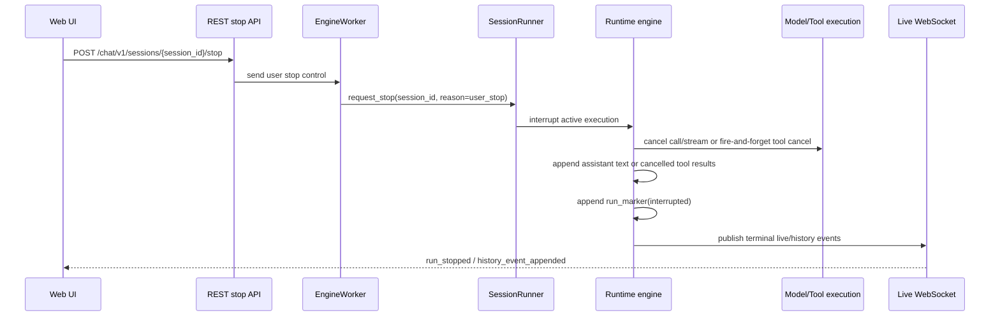

# Preemptive User Stop Design

## Overview

This design changes Chat stop from WebSocket-input-based cooperative stop to REST control boundary based preemptive user interrupt.

Related decisions follow [ADR-0052](../adr/0052-preemptive-user-stop.md). Existing [ADR-0051](../adr/0051-rest-chat-write-boundary.md) moved message/edit/command writes to REST and left stop as follow-up target. This design implements that follow-up target and simplifies Chat WebSocket into a live-subscription-only channel.

Core changes:

- User stop is preemptive interrupt that takes precedence over current run.
- Idle stop is durable no-op without ack.
- Stop during LLM call/streaming immediately cancels provider call/stream, closes HTTP stream, and promotes only assistant text to durable history.
- Stop during tool calling terminates result collection loop, sends optional cancel signal to foreground tool fire-and-forget, and patches unresolved tool calls as cancelled results.
- User stop is `interrupted` terminal.
- Shutdown/handover stop is non-terminal and subject to continuation/recovery.
- User stop interruption is delivered to next model input as user-role synthetic XML control event.
- Stop button uses REST endpoint.
- Chat WebSocket becomes live-subscription-only channel that receives no client-to-server input.

## Requirements

### REQ-1. User stop takes precedence over active execution

#### Description
When user stop applies to active run, engine must switch immediately to cancellation path rather than waiting for model call, streaming, or foreground tool execution to finish naturally.

#### Related decisions
- ADR-0052-D1

#### Acceptance criteria
- When stop request arrives during active run, runner/engine delivers interrupt to active execution handle.
- Primary stop path does not depend only on queue drain or `check_stop` polling.
- cooperative `check_stop` may remain as fallback or safety net.

### REQ-2. Idle stop is durable no-op and does not leak to next run

#### Description
If stop request arrives with no active run, do not create history, run marker, terminal status. This stop must not remain as latch interrupting next run.

#### Related decisions
- ADR-0052-D2

#### Acceptance criteria
- idle stop does not append durable event.
- idle stop does not require semantic ack/result.
- next run started after idle stop is not interrupted by previous stop request.

### REQ-3. LLM call/streaming stop durably stores only assistant text

#### Description
When user stop arrives during LLM call or streaming, immediately cancel provider call/stream and close underlying HTTP response/body stream. At stop time, only non-empty assistant text in engine streaming accumulator is promoted to durable assistant message.

#### Related decisions
- ADR-0052-D3

#### Acceptance criteria
- provider call/stream receives cancellation on stop and underlying HTTP response/body stream is closed.
- non-empty assistant text from engine streaming accumulator is appended as durable assistant message.
- reasoning live state, partial tool/function call delta, usage live state, provider raw/native chunk are excluded from stop-time durable promotion.
- if no assistant text, run closes as `interrupted` without assistant message.

### REQ-4. Tool calling stop uses fire-and-forget cancel signal

#### Description
When user stop arrives during tool calling, send cancel signal to active foreground tool, but engine does not wait for tool termination.

#### Related decisions
- ADR-0052-D4

#### Acceptance criteria
- foreground tool executor may provide optional cancellation hook.
- normal callable tool only needs coroutine task cancellation.
- shell/bash family tool calls TERM or runtime cancel API in optional hook and does not delay engine terminal processing.
- stop path does not delay run terminal by `await`ing active tool task completion.

### REQ-5. Unresolved active tool calls are patched as cancelled results

#### Description
On stop during tool calling, completed tool results already in durable history remain. Active foreground tool calls without result are patched as cancelled result.

#### Related decisions
- ADR-0052-D5

#### Acceptance criteria
- on stop, durable `client_tool_result(status="cancelled")` is appended for every active client tool call without result.
- run marker is appended as `interrupted`.
- active tool result collection loop terminates on stop.
- even if tool completes late afterward, it is not connected to current run append path.

### REQ-6. Streaming tool partial persistence is excluded from this scope

#### Description
Current scope assumes completed-result-centered tool execution. If streaming output tool appears, durable promotion policy of tool live state is decided by separate design.

#### Related decisions
- ADR-0052-D6

#### Acceptance criteria
- this implementation does not promote partial tool output to durable history.
- streaming tool partial persistence requirement is not QA pass condition for this scope.

### REQ-7. Separate terminal meaning of user stop and shutdown/handover stop

#### Description
User stop closes current run as `interrupted` terminal. Shutdown or handover stop is non-terminal stop for worker shutdown, process restart, execution owner change, recovery/resume, and remains continuation/recovery target.

#### Related decisions
- ADR-0052-D7

#### Acceptance criteria
- user stop cancellation reason creates run marker `interrupted`.
- shutdown/handover cancellation reason does not create user interruption marker.
- shutdown/handover path preserves state subject to continuation/recovery.

### REQ-8. User stop interruption is delivered to model input as user-role synthetic control event

#### Description
Tell next model input that previous assistant run was interrupted by user. Do not use system role or assistant role.

#### Related decisions
- ADR-0052-D8

#### Acceptance criteria
- durable history keeps interruption marker or system-reminder-like event.
- model lowering inserts that interruption as user-role synthetic XML control event: `<user_control_event type="run_interrupted">The previous assistant run was interrupted by the user.</user_control_event>`.
- synthetic control event is not stored as canonical user message.
- synthetic control event is not rendered in UI as normal user message.
- marker is not inserted for handover stop.

### REQ-9. Stop button uses REST endpoint

#### Description
Frontend stop button sends user stop request through REST endpoint, not WebSocket payload.

#### Related decisions
- ADR-0052-D9

#### Acceptance criteria
- public REST stop endpoint exists.
- Web UI stop button calls REST stop endpoint through generated public client.
- stop REST response does not require semantic stop result.
- stop REST request can be sent even when WebSocket is disconnected.

### REQ-10. Chat WebSocket becomes live-subscription-only channel

#### Description
After stop input moves to REST, Chat WebSocket does not receive client-to-server chat input. It only owns server-to-client live/history projection subscription.

#### Related decisions
- ADR-0052-D10

#### Acceptance criteria
- WebSocket `{ "type": "stop" }` handling path is removed and does not execute user stop.
- WebSocket message/edit/command/stop write payloads are not processed.
- WebSocket endpoint does not provide legacy write compatibility response.
- WebSocket route only has live/history event subscription responsibility.

## Decision Table

| ADR decision | Requirements |
| --- | --- |
| ADR-0052-D1. User stop is preemptive interrupt that takes precedence over current run | REQ-1 |
| ADR-0052-D2. User stop in idle state is durable no-op without ack | REQ-2 |
| ADR-0052-D3. User stop during LLM call/streaming immediately cancels and durably stores only assistant text | REQ-3 |
| ADR-0052-D4. User stop during tool calling sends cancel signal fire-and-forget | REQ-4 |
| ADR-0052-D5. Tool calling stop patches unresolved active tool calls as cancelled results | REQ-5 |
| ADR-0052-D6. Streaming tool partial persistence is not handled in this scope | REQ-6 |
| ADR-0052-D7. User stop and shutdown/handover stop have separate terminal meaning | REQ-7 |
| ADR-0052-D8. User stop interruption is delivered to model input as user-role synthetic control event | REQ-8 |
| ADR-0052-D9. Stop button works through REST endpoint | REQ-9 |
| ADR-0052-D10. Chat WebSocket becomes live-subscription-only channel | REQ-10 |

## Problem Definition

Current stop receives `{ "type": "stop" }` payload in WebSocket receive loop and delivers `SessionStopRequest` to broker. Worker session runner combines queue drain, stop event, runtime desired state, shutdown event to check stop.

Problems in this structure:

- It is unclear in design that Stop is treated like session queue message but should take precedence over active execution.
- User stop and shutdown/handover stop can be mixed from Python task cancellation perspective.
- It is unclear which live states should promote to durable history on stop during LLM streaming.
- If stop during tool calling waits for tool termination, current run terminal is again tied to long-running process.
- Stop remains as last WebSocket input, keeping bidirectional responsibility of WebSocket handler.

## Goals

- Implement user stop as interrupt that takes precedence over active execution by managing active run handle and stop reason with `RunStopController`.
- Clearly define stop semantics for three states.
  - Idle: durable no-op
  - LLM call/streaming: immediate cancel, durably store only assistant text, run interrupted
  - Tool calling: cancel signal fire-and-forget, unresolved tool call cancelled result, run interrupted
- Separate terminal meaning of user stop and shutdown/handover stop.
- Deliver user stop interruption to next model input as order-preserving synthetic user control event.
- Convert stop button to REST endpoint.
- Remove final client-to-server input path from Chat WebSocket.

## Non-goals

- Do not newly define pending input buffer policy. If pending input exists and next run can proceed in current implementation, this design does not redefine it as policy goal.
- Do not design durable persistence of streaming tool partial output.
- Do not merge runtime stop control UI and chat user stop.
- Do not redesign whole shutdown/handover continuation/recovery.
- Stop button visual redesign is not main scope of this engine/API design.

## Stop Semantics by State

### Idle state

Idle means there is no active run task. Stop in this state has no current run to terminate, so it is durable no-op.

Required condition is that stop flag does not leak into next run. Idle stop must not interrupt the next run immediately on start.

### LLM call/streaming state

LLM call/streaming state means provider request is in-flight or assistant text delta is being received.

Stop handling order:

1. receive user stop request
2. set current run cancellation reason to user stop
3. cancel provider call/stream and close underlying HTTP response/body stream
4. if assistant text in engine streaming accumulator is non-empty, append durable assistant message
5. append run marker `interrupted`
6. publish terminal live event

Stop-time durable promotion target is assistant text only. Reasoning, partial tool/function call, usage, provider raw chunk are excluded.

### Tool calling state

Tool calling state means foreground client tool call is active.

Stop handling order:

1. receive user stop request
2. set current run cancellation reason to user stop
3. terminate active tool result collection loop
4. cancel active foreground tool task and call optional cancellation hook fire-and-forget
5. append cancelled result for unresolved active tool call
6. append run marker `interrupted`
7. publish terminal live event

Shell/bash tool calls TERM or runtime cancel API in optional cancellation hook and engine forgets it. Follow-up KILL, process reap, sandbox cleanup are tool/runtime cleanup responsibility.

## Target Architecture

## Backend Design

### REST stop endpoint

Add session-scoped stop endpoint to Public API.

- Method: `POST`
- Path: `/chat/v1/sessions/{session_id}/stop`
- Auth: same as existing session access permission verification
- Request body: none or minimal request body
- Response: success response without semantic result

Endpoint delivers user stop request to worker/broker control path. Do not make semantic results like idle/already stopped part of frontend contract.

### Remove WebSocket receive path

Chat WebSocket no longer handles stop payload. WebSocket only owns live/history projection subscription.

If older frontend sends stop or write payload, server does not process it as chat input/control. WebSocket endpoint provides no compatibility response and keeps only server-to-client live subscription responsibility.

### RunStopController

Dedicated `RunStopController` owns stop lifecycle. Controller manages active run handle, cancellation reason, duplicate stop idempotency, idle no-op, stop state clear.

Runner manages session queue and lifecycle, and registers/unregisters run handle with controller on active run start/end. If user stop request arrives during active run, controller delivers interrupt to active execution without waiting for normal queue message processing order.

`check_stop` can remain but must not be primary path. `check_stop` remains safety net for quickly exiting at cooperative boundary.

### Separate cancellation reasons

Cancellation reason must distinguish at least user stop and shutdown/handover stop.

- user stop: terminal `interrupted`
- shutdown/handover stop: non-terminal, continuation/recovery target

This distinction must be consistently observable in runner, canonical execution, terminal cleanup.

### Assistant text materialization

During LLM streaming, assistant text uses engine streaming accumulator as source and is materialized to durable assistant message. Redis/live projection is UI display path and may have batching delay, so it must not be source of truth for stop-time durableization.

Required conditions:

- engine run-level assistant text accumulator can be read by stop cleanup.
- materialized assistant message is valid canonical assistant payload.
- reasoning/tool/usage/native raw state is not materialized together.
- after materialize, matching live projection removal or history/live handoff must not conflict with existing protocol.

### Tool cancel fire-and-forget

Foreground tool executor may provide optional cancellation hook. Normal callable tool only receives coroutine task cancellation. Tool with subprocess such as shell/bash calls TERM or runtime cancel API in optional hook.

Stop path first terminates active tool result collection loop. Then it cancels active tool task and calls optional hook fire-and-forget. Engine does not wait for tool task completion.

After result collection loop closes, late completed result is not connected to current run append path.

## Model Input Lowering Design

User stop interruption is inserted into next model input as user-role synthetic XML control event.

Synthetic event lowers to following shape.

`<user_control_event type="run_interrupted">The previous assistant run was interrupted by the user.</user_control_event>`

Do not use expression `response`. Stop can occur during not only LLM streaming but also tool calling, so interrupted target is expressed as assistant run.

This event is not canonical user message. Durable history keeps interruption marker or system-reminder-like canonical event, and lowerer renders it as user-role synthetic message only when constructing model input.

## Frontend Design

### Stop mutation

Remove `useChatWebSocket.sendStopRequest`. Stop is called through REST mutation.

Frontend must use generated public client. Do not directly call raw fetch or hand-written endpoint path.

### Stop pending UI

While stop REST request is in-flight, UI can keep pending state equivalent to existing `isStopPending`. However, it must not infer run state from REST response semantic result. Run terminal reflection converges through WebSocket live event or REST live reload.

### WebSocket role

Chat WebSocket does not send stop payload. Connection status indicates live subscription state and is not sole gate for stop availability.

## Feasibility Check Items

Following items are technical checks by code comparison before implementation, not decisions.

### F-1. Route/service location of REST stop endpoint

`POST /chat/v1/sessions/{session_id}/stop` delegates from public chat route to `ChatService`. Feasibility stage confirms whether current route/service DI structure can call broker/control path through service after existing session access verification.

### F-2. RunStopController connection point

`RunStopController` owns active run handle and cancellation reason between runner and engine boundary. Feasibility stage checks insertion point that does not conflict with current `_run_with_timeout` task lifecycle, `check_stop`, shutdown wait path.

### F-3. LLM adapter stream close

User stop must guarantee not only provider call/stream cancel but also underlying HTTP response/body stream close. Feasibility stage checks whether LiteLLM/provider adapter provides stream close hook on cancellation.

### F-4. Engine streaming accumulator location

Stop-time assistant text materialization uses engine streaming accumulator as source. Feasibility stage checks possible location for accumulator in current streaming normalizer or adapter loop and canonical assistant message append boundary.

### F-5. Optional tool cancellation hook connection

Tool cancel capability is optional hook. Feasibility stage checks whether foreground tool executor can register task and optional hook per active call, and whether shell/bash tool can provide TERM call hook.

### F-6. Tool result collection loop termination

Core of tool stop is terminating active result collection loop, not late result idempotency. Feasibility stage checks whether current `asyncio.gather` or tool result collection structure can immediately stop on stop and patch unresolved calls with cancelled result.

### F-7. Handover stop reason separation

Handover stop is non-terminal stop for worker shutdown, process restart, execution owner change, recovery/resume. Feasibility stage checks whether current shutdown/recovery path is mixed with user stop as same bool signal and whether it can be separated into reason-aware structure.

### F-8. Synthetic user control event lowering

Model input inserts `<user_control_event type="run_interrupted">The previous assistant run was interrupted by the user.</user_control_event>` as user-role synthetic message. Feasibility stage checks location where lowerer can insert only into model input without saving as canonical user message.

### F-9. Remove legacy WebSocket client payload compatibility

Even if old frontend sends WebSocket `{ "type": "stop" }` or message/edit/command write payload, server does not process it as chat input/control. Feasibility stage checks whether receive loop itself can be removed to keep subscription-only structure simplest.

## Feasibility Results

Code comparison on 2026-06-09 found no blockers for design implementation. Confirmed connection points:

- REST route/service: public chat v1 route already has REST message/edit/command write and session access verification. Stop endpoint can be added to same route and delegate session access verification plus broker control dispatch to `ChatSessionService`.
- Runner/controller: `_SessionRunner._run_with_timeout` currently owns engine task and explicit stop waiter. `RunStopController` can be connected here to manage active task/reason/idle no-op/duplicate stop.
- LLM adapter close: `LiteLLMResponsesModelAdapter.stream` directly iterates `aresponses(..., stream=True)` async iterable. Adapter cleanup hook can best-effort call `aclose`/`close` capability of response object on cancellation.
- Accumulator: canonical execution `_stream_model` collects native stream event, and normalizer creates content delta projection and assistant message. Stop-time assistant text accumulator can live inside this streaming loop.
- Tool hook/loop: canonical execution `_execute_tools` collects active tool calls with `asyncio.gather`. Boundary already exists to cancel gather/result collection on stop and append cancelled result for unresolved calls; optional cancellation hook can be added to `FunctionTool`.
- Handover reason: current shutdown event and explicit stop are mixed in `_make_check_stop_fn`, `_wait_for_explicit_stop`, `_run_with_timeout`. Clear locations exist to separate with reason-aware controller.
- Model lowering: `LiteLLMResponsesLowerer._lower_event` lowers canonical event to role item. Run interruption marker can be inserted as user-role synthetic item in lowerer/pre-lower step without saving as canonical user message.
- Frontend/generated client: azents-web tRPC chat router uses generated public client function. Once stop endpoint is generated in OpenAPI/client, stop mutation can connect with same pattern.
- Legacy WebSocket payload: current WebSocket receive loop forwards stop payload to broker and rejects other writes. In subscription-only transition, removing receive loop also removes legacy write/control compatibility path.

## Test Strategy

Product behavior verification is E2E primary. Unit test, type check, static check are implementation-supporting verification and are not alone used as QA Checklist PASS evidence.

### E2E primary verification matrix

| Scenario | Primary verification path | Expected result |
| --- | --- | --- |
| Idle stop | public REST stop call + history/live query | no durable event added, next run proceeds normally |
| LLM streaming stop | REST stop during actual worker/model stream | only assistant text is durably stored, run interrupted |
| Tool calling stop | REST stop during long-running foreground tool | cancel signal dispatch, cancelled tool result, run interrupted |
| Shutdown/handover distinction | worker shutdown/recovery path | no user interruption marker, continuation/recovery preserved |
| WebSocket input removal | after WebSocket connection, stop payload unused | frontend calls REST only, WS only performs live subscription |
| Model input marker | next user input run after stop | user-role synthetic control event included in model input |

### E2E primary verification plan

- Actually run public API, WebSocket, worker, runtime in testenv/azents E2E.
- LLM streaming stop needs deterministic fake model adapter or controllable slow stream fixture.
- Tool calling stop needs deterministic long-running foreground tool fixture.
- Model input marker must record final model input snapshot received by fake model adapter as evidence.
- Shell/bash TERM fire-and-forget verification is performed if sandbox/process fixture is ready; otherwise track as separate issue.

### Seed/fixture requirements

- user/workspace/agent/session creation fixture
- slow streaming model fixture
- long-running foreground tool fixture
- fake model input capture fixture
- WebSocket live subscription capture helper

### Credential/prerequisite snapshot requirements

- Primary uses fake model path requiring no external provider credential.
- live provider verification is separated into optional/live.
- sandbox process signal verification is promoted to primary only if sandbox runtime is ready in testenv.

### Evidence format

- REST stop request/response record
- WebSocket live event sequence
- durable canonical history rows or public history response
- captured model input snapshot
- tool cancel signal dispatch log or observable cancellation marker

### CI execution policy

- deterministic fake model/tool E2E is CI target.
- verification requiring external provider or live sandbox credential is split to optional/live.
- optional/live can SKIP if credentials absent, but does not replace deterministic primary E2E.

## QA Checklist

### QA-1. Idle stop durable no-op

#### What to check
Call REST stop on idle session, then confirm durable history and run state do not change, and later new message run proceeds normally.

#### Why it matters
If idle stop latches into next run, next input sent by user can stop immediately.

#### How to check
In testenv/azents E2E, make session idle, call public REST stop, query history/live, then verify next message REST write and run completion.

#### Expected result
No new durable event after stop call, and next run proceeds without interrupted.

#### Execution result
TBD — fill during E2E/testenv verification phase.

#### Fixes applied
TBD — fill during verification phase.

### QA-2. LLM streaming stop assistant text materialization

#### What to check
After slow streaming model emits assistant text delta, call REST stop and verify only assistant text is saved in durable history and run marker is `interrupted`.

#### Why it matters
Assistant text seen by user must be preserved, but reasoning/tool/usage partials have unstable canonical validity.

#### How to check
Use fake slow streaming model fixture to create text, reasoning, partial tool-call-like delta, then verify public history response or DB read model after stop.

#### Expected result
Assistant message includes stop-time text from engine accumulator. Reasoning partial, partial tool call, usage live state are not saved as durable event. Provider HTTP stream is closed. Run marker is `interrupted`.

#### Execution result
TBD — fill during E2E/testenv verification phase.

#### Fixes applied
TBD — fill during verification phase.

### QA-3. Tool calling stop fire-and-forget cancellation

#### What to check
During long-running foreground tool execution, call REST stop and verify cancel signal is dispatched and engine closes run as `interrupted` without waiting for tool exit.

#### Why it matters
If stop is tied to long-running tool process, it fails preemptive interrupt goal.

#### How to check
Run long-running tool fixture, call stop, observe terminal event and durable cancelled tool result. If possible, record evidence that run terminal occurs before actual tool process exit.

#### Expected result
Active tool result collection loop terminates and `client_tool_result(status="cancelled")` is stored for unresolved active tool call. Run marker is `interrupted`. Engine terminal does not wait for actual tool exit.

#### Execution result
TBD — fill during E2E/testenv verification phase.

#### Fixes applied
TBD — fill during verification phase.

### QA-4. Separate user stop and shutdown/handover stop

#### What to check
User stop creates interrupted terminal and model-visible marker, while shutdown/handover stop remains continuation/recovery target without terminal marker.

#### Why it matters
If shutdown is recorded as user interruption, recoverable run is incorrectly made terminal.

#### How to check
Run user stop E2E and worker shutdown/recovery E2E separately and compare durable history, run state, model input marker.

#### Expected result
Only user stop creates `interrupted` terminal and synthetic user control event. Shutdown/handover path does not create user interruption marker.

#### Execution result
TBD — fill during E2E/testenv verification phase.

#### Fixes applied
TBD — fill during verification phase.

### QA-5. Model input synthetic user control event

#### What to check
Confirm that after user stop, next model input includes user-role synthetic XML control event with guaranteed order.

#### Why it matters
Model must know that previous assistant run was interrupted by user. System role has weak ordering guarantee and assistant role has risk of repeated output.

#### How to check
Capture lowered model input of next run after stop with fake model input capture fixture.

#### Expected result
`<user_control_event type="run_interrupted">The previous assistant run was interrupted by the user.</user_control_event>` is included in appropriate position immediately after interrupted marker or before next user input. UI history does not show it as normal user message.

#### Execution result
TBD — fill during E2E/testenv verification phase.

#### Fixes applied
TBD — fill during verification phase.

### QA-6. Stop REST endpoint and WebSocket input removal

#### What to check
Confirm frontend stop button uses REST endpoint, and WebSocket stop payload does not execute user stop.

#### Why it matters
To make Chat WebSocket live-subscription-only, final client-to-server input must be removed.

#### How to check
In browser or component E2E, observe REST stop call on stop button click and confirm no stop payload in WebSocket sent frames. In backend route test, confirm WebSocket endpoint has no path handling stop/write client payload.

#### Expected result
Stop button sends REST call. Chat WebSocket only receives live/history events. Legacy stop/write payload compatibility path is not provided.

#### Execution result
TBD — fill during E2E/testenv verification phase.

#### Fixes applied
TBD — fill during verification phase.

## Alternatives Considered

### Keep stop as WebSocket control

Rejected. After message/edit/command moved to REST, if only stop remains as WebSocket input, WebSocket keeps client-to-server control responsibility. Stop must move to REST too so Chat WebSocket becomes live-subscription-only channel.

### Durableize all live state on stop

Rejected. Reasoning, partial tool/function call, usage, provider raw chunk cannot be guaranteed to be valid canonical payload at stop time. Durable promotion target is limited to assistant text.

### Wait for tool completion before processing run interrupted

Rejected. This ties stop terminal back to long-running tool or stuck process. From engine perspective, tool cancel must be fire-and-forget.

### Insert interruption marker as system role

Rejected. Message ordering is not guaranteed because provider-specific system prompt aggregation differs.

### Insert interruption marker as assistant role

Rejected. Model may repeat the marker as assistant output.
