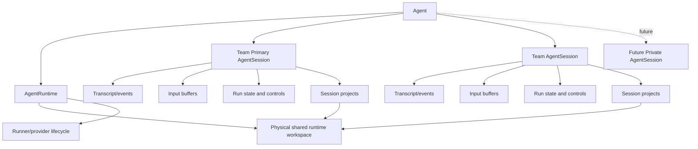

# Primary Agent Sessions Target Design

## Overview

This document defines the final target state for Azents agent sessions after the single-current-session model is replaced by primary and multi-session semantics.

This is a target-state design, not an incremental implementation plan. Phase ordering and migration slices are intentionally handled separately.

The target preserves the useful continuity of the original single-session model while allowing multiple explicit sessions under one agent. The default team workflow still has one stable primary session, but additional sessions can exist without making `AgentRuntime` own session selection.

## Goals

- Keep one stable team-visible default conversation per agent.
- Allow multiple sessions under one agent without runtime-owned current session state.
- Make the selected Web session explicit in the URL.
- Keep shared external channel routing simple by defaulting to the team primary session.
- Make session projects part of session working context, not runtime state.
- Leave a clean extension path for future private sessions without implementing private visibility in the first delivery.

## Non-Goals

- This design does not define the incremental implementation phase plan.
- This design does not implement private sessions in the first delivery.
- This design does not define primary clear/reset semantics.
- This design does not make Git a first-class Azents domain.
- This design does not require automatic git worktree creation.
- This design does not introduce arbitrary user-managed external channel to session mappings.
- This design does not introduce selected/current/active project state.

## User Model

Users should understand sessions through two eventual sections:

```text
Team sessions
  Team primary session
  Team session A
  Team session B
  + New team session

Private sessions
  My private primary session
  Private session A
  Private session B
  + New private session
```

The initial product may only show Team sessions. Private sessions remain target-compatible but implementation-deferred.

Team sessions are visible to the workspace audience allowed to access the agent. The team primary session is the default shared conversation and external integration target.

Private sessions are future user-specific conversations. They are not part of the initial implementation, but the target UI reserves a clear place for them so future private behavior does not require redefining the session model.

## Requirements

### REQ-1. Runtime and session ownership separation

`AgentRuntime` and `AgentSession` must be sibling models owned by `Agent`. Runtime must not own session selection.

Related decisions: ADR-0074-D1, ADR-0074-D7

Acceptance criteria:

- Session ownership and lookup are agent/session based, not runtime-current based.
- Runtime-owned current session state is absent from target APIs and service contracts.
- Runtime remains responsible only for physical workspace and lifecycle concerns.

### REQ-2. Team primary session

Every agent has exactly one team primary session.

Related decisions: ADR-0074-D2, ADR-0074-D7

Acceptance criteria:

- The team primary session is the default team-visible conversation for an agent.
- The team primary session is not deletable.
- Shared external inputs can resolve to the team primary session without runtime current-session state.

### REQ-3. Future-compatible private sessions

The target model must allow future private sessions without requiring a different session architecture.

Related decisions: ADR-0074-D3, ADR-0074-D4

Acceptance criteria:

- The target UX has a Private sessions section reserved for future implementation.
- A future user-private primary session can exist per `(agent_id, user_id)`.
- Initial implementation can omit private authorization and private routing.

### REQ-4. Sectioned session list UX

The session list UX must avoid ambiguous visibility by grouping sessions into Team and Private sections.

Related decisions: ADR-0074-D4

Acceptance criteria:

- Team primary appears at the top of Team sessions.
- Future user private primary appears at the top of Private sessions.
- New-session creation controls are section-specific.
- The initial implementation may only expose the Team sessions section.

### REQ-5. URL-selected Web session

The selected Web session must be represented by route state.

Related decisions: ADR-0074-D5

Acceptance criteria:

- Canonical session route shape is `/w/{handle}/agents/{agent_id}/sessions/{session_id}`.
- The agent chat root route can resolve to the team primary session and navigate to the canonical route.
- Refreshing or sharing a session URL preserves the selected session.

### REQ-6. Simple external routing

External routing must default to primary sessions and avoid user-managed mapping tables.

Related decisions: ADR-0074-D6

Acceptance criteria:

- Shared external inputs route to the team primary session by default.
- Future private external inputs route to the current user's private primary session.
- General-purpose user-editable channel/session mapping is not part of the target UX.

### REQ-7. Session-owned projects

Projects are session-owned working context.

Related decisions: ADR-0074-D8, ADR-0074-D9, ADR-0074-D10

Acceptance criteria:

- Session project registrations belong to `AgentSession`.
- Runtime owns only the physical workspace where project paths live.
- New sessions start with a snapshot copy of the team primary session's project registrations.
- There is no runtime current project, selected project, or active project state.
- Git worktree automation is not required by the target model.

### REQ-8. Deferred clear semantics

Primary sessions are non-deletable, but clear/reset behavior is a separate future feature.

Related decisions: ADR-0074-D11

Acceptance criteria:

- This design does not require clear behavior to ship with multi-session foundations.
- Future clear behavior can be added without making primary sessions deletable.

## Decision Table

| ADR decision | Requirements |
|---|---|
| ADR-0074-D1 Runtime and session are sibling models under Agent | REQ-1 |
| ADR-0074-D2 Team primary session is the continuity-preserving default | REQ-2 |
| ADR-0074-D3 Private sessions are target-compatible but implementation-deferred | REQ-3 |
| ADR-0074-D4 Session list UX is divided into Team and Private sections | REQ-3, REQ-4 |
| ADR-0074-D5 Selected Web session is route state | REQ-5 |
| ADR-0074-D6 External routing defaults to primary sessions and hides arbitrary mappings | REQ-6 |
| ADR-0074-D7 Primary session is not runtime current session | REQ-1, REQ-2 |
| ADR-0074-D8 Projects are session-owned working context | REQ-7 |
| ADR-0074-D9 New sessions copy projects from the team primary session | REQ-7 |
| ADR-0074-D10 Git worktree automation is deferred | REQ-7 |
| ADR-0074-D11 Primary clear behavior is deferred | REQ-8 |

## Target Architecture



Ownership summary:

| Domain | Owner | Notes |
|---|---|---|
| Physical workspace path | `AgentRuntime` | Shared filesystem root where session project paths live. |
| Runner/provider lifecycle | `AgentRuntime` | Runtime control-plane only. |
| Transcript and live history | `AgentSession` | Per session. |
| Input buffers | `AgentSession` | Per session write target. |
| Run state and stop/pending controls | `AgentSession` | Per session execution-control boundary. |
| Projects | `AgentSession` | Session working context; paths may point into shared runtime workspace. |
| Web selected session | URL route state | Not runtime state. |
| Default shared external target | Team primary session | Not runtime state. |

## Data Model

This is target conceptual shape, not migration DDL.

### AgentRuntime

Runtime keeps runtime infrastructure fields only:

- `id`
- `agent_id`
- physical workspace/sandbox identity fields
- provider desired/observed lifecycle fields
- runner connectivity and generation fields

Runtime does not store:

- current session ID
- active session ID
- current project ID
- selected project ID

### AgentSession

Target session fields include:

- `id`
- `agent_id`
- `status`
- `is_primary`
- future-compatible visibility/owner fields when private sessions are implemented
- transcript/input/run-state control fields

Target invariants:

- One team primary session per agent.
- Future: one private primary session per `(agent_id, user_id)`.
- Primary sessions are non-deletable.
- Non-primary team sessions can coexist under the same agent.

### SessionProject

Project registrations are session-owned.

Conceptual fields:

- `id`
- `agent_session_id`
- `path`
- optional display metadata
- optional external repository metadata when known

Rules:

- Project rows belong to one session.
- A new team session receives a snapshot copy of the team primary session's project rows.
- Multiple sessions may point to the same physical path.
- No project row is runtime-global current state.

## API Target

Exact route names are implementation detail, but target capabilities are:

- Fetch or ensure an agent's team primary session.
- List an agent's team sessions with primary first.
- Create a new team session by copying the team primary session's project registrations.
- Fetch session history/live state by explicit session ID.
- Write input to an explicit session ID.

Compatibility note:

- An old active-session route may remain temporarily if it resolves team primary without runtime current-session state.
- New API terminology should prefer primary/default session vocabulary over active/current vocabulary.

## Frontend Target

### Routes

Canonical selected session route:

```text
/w/{handle}/agents/{agent_id}/sessions/{session_id}
```

Convenience entry route:

```text
/w/{handle}/agents/{agent_id}/chat
```

The convenience route resolves the team primary session and navigates to the canonical session route.

### Session list layout

Target layout:

```text
Agent

Team sessions
  [primary badge] Team chat
  Team session A
  Team session B
  + New team session

Private sessions
  [future] My private chat
  [future] Private session A
  [future] + New private session
```

Initial implementation may omit the Private sessions section entirely or show it disabled only if product copy explicitly calls it future/private.

## External Routing Target

Shared external inputs route to the team primary session.

Examples:

- Slack channel mention -> team primary.
- GitHub shared event -> team primary.
- Shared alert integration -> team primary.

Future private inputs route to the user's private primary session.

Examples:

- Slack DM -> future user private primary.
- Personal integration event -> future user private primary.

This target deliberately avoids exposing arbitrary session mapping management to users.

## Project and Working Directory Target

Session projects define the working context that a session can use. They do not isolate filesystem writes. The physical workspace remains runtime-owned and shared.

Conflict policy remains normal shared workspace behavior. File, process, git, and build conflicts are surfaced through ordinary tool failures, diffs, process output, or git state; this design does not add a global workspace mutex or session-specific filesystem isolation.

Git worktree automation is future work. If introduced later, it should create or locate a path in the runtime workspace and register that path as a session project.

## Alternatives Considered

### Channel-per-session by default

Rejected by ADR-0074. It breaks cross-channel continuity for workflows that move through Slack, GitHub, alerts, and Web UI.

### User-managed arbitrary channel/session mapping

Rejected by ADR-0074. It makes users understand internal routing and session IDs.

### Runtime-owned current session

Rejected by ADR-0074. It mixes product default conversation behavior with runtime infrastructure state.

### Runtime-owned project catalog or current project

Rejected by ADR-0074. Projects are session working context, and runtime current project state would recreate hidden global selection state.

### Git worktree per session as a required target invariant

Rejected for this design. Git is not currently a first-class Azents domain. Automatic worktree creation can be a future convenience, not a prerequisite for primary sessions.

## Feasibility Verification

| Item | Current evidence | Target implication |
|---|---|---|
| Session-owned execution state | Existing code already moves run state, heartbeat, pending command, and stop request to `AgentSession`. | Target aligns with current migration direction. |
| Explicit session writes | Existing write path can target explicit session IDs. | Multi-session API can build on explicit session writes. |
| Runtime/session dependency | Current schema still has `agent_sessions.agent_runtime_id`. | Requires migration away from runtime ownership. |
| URL-selected session | Current Web route lacks session ID. | Requires new canonical session route. |
| Project ownership | Current project behavior is not session-owned target shape. | Requires session project model/change. |
| Private sessions | Not required for initial implementation. | Target can reserve UX/model space without immediate authorization work. |

## Test Strategy

Product behavior verification should be E2E-primary when implementation phases are delivered. This target design itself does not implement behavior.

Implementation phases should validate:

- Agent chat entry resolves to team primary and canonical session URL.
- Existing selected session URL reloads the same session.
- New team session creation copies team primary projects.
- Explicit session write writes to the selected session.
- Shared external input resolves to team primary when that integration path is implemented.
- Runtime rows do not own or redirect session selection.

Unit, integration, static, and migration tests are supporting checks only. QA pass/fail evidence for product behavior should come from public API/WebSocket/Web UI E2E or testenv-based agentic verification.

## QA Checklist

### QA-1. Team primary session entry

#### What to check

Entering an agent chat without a selected session resolves to the agent's team primary session.

#### Why it matters

This preserves the original default conversation behavior while removing runtime-owned selection.

#### How to check

Use E2E or testenv to create a workspace, user, agent, and then open/call the agent chat entry path.

#### Expected result

The user lands on or receives a canonical session route/ID for the team primary session.

#### Execution result

TBD — implementation verification phase.

#### Fixes applied

TBD — implementation verification phase.

### QA-2. URL-selected session persistence

#### What to check

A canonical session URL reloads the same session.

#### Why it matters

Selected session must be route state, not local component state or runtime state.

#### How to check

Use Web E2E to navigate to `/w/{handle}/agents/{agent_id}/sessions/{session_id}`, reload, and assert the same history/live state loads.

#### Expected result

The same session remains selected after reload.

#### Execution result

TBD — implementation verification phase.

#### Fixes applied

TBD — implementation verification phase.

### QA-3. New team session project copy

#### What to check

A new team session receives a snapshot copy of the team primary session's projects.

#### Why it matters

This keeps projects session-owned while preserving useful default context for new sessions.

#### How to check

Use API/E2E setup to add projects to team primary, create a new team session, and inspect that session's project list.

#### Expected result

The new session has copied project rows. Later primary project changes do not mutate that session's existing project rows.

#### Execution result

TBD — implementation verification phase.

#### Fixes applied

TBD — implementation verification phase.

### QA-4. Explicit session write target

#### What to check

A message sent to a non-primary session writes to that session, not to team primary.

#### Why it matters

Multi-session correctness depends on explicit session writes staying authoritative.

#### How to check

Use public API/WebSocket E2E to create two sessions, write to the non-primary session, and verify the event appears only in that session's history/live stream.

#### Expected result

The selected session receives the input and wake-up; team primary is not modified by the write.

#### Execution result

TBD — implementation verification phase.

#### Fixes applied

TBD — implementation verification phase.

### QA-5. Runtime does not own selection

#### What to check

Runtime state cannot redirect a session write or chat entry to another session.

#### Why it matters

Runtime-owned current session state is the implementation debt this design removes.

#### How to check

Use DB/API verification after implementation to assert runtime has no current-session field/path and service calls resolve primary/session through agent/session repositories.

#### Expected result

Runtime stores lifecycle/workspace state only. Session lookup and write routing are agent/session based.

#### Execution result

TBD — implementation verification phase.

#### Fixes applied

TBD — implementation verification phase.

## Implementation Plan

Out of scope for this target-state design. The incremental implementation phase plan will be documented separately after this target design is accepted.
