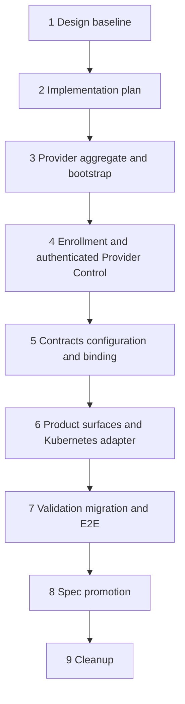

# Platform Runtime Provider Management Implementation Plan

## Feature Summary

Implement the approved [`provider-260722/REQ`](../requirements/provider-260722-platform-runtime-provider-management.md), [`provider-260722/ADR`](../adr/provider-260722-platform-runtime-provider-management.md), and [`provider-260722/DESIGN`](./provider-260722-platform-runtime-provider-management.md).

The feature turns Platform Runtime Providers into durable operational resources. It adds trusted adapter-neutral bootstrap declarations, Provider-bound enrollment and credentials, accepted capability contracts, validated configuration revisions, Workspace availability, immutable logical Runtime bindings, Provider lifecycle and cleanup evidence, and a Kubernetes Provider/Helm first adapter.

## Stack Prefix

`Platform runtime providers`

## Delivery Shape

This feature uses nine stacked PRs. The boundaries isolate persistent authority and migration risk, Provider Control security, configuration and Runtime binding semantics, product surfaces and Kubernetes integration, then final lifecycle/migration validation and living-spec promotion.

1. `Platform runtime providers [1/9]: Design baseline`
2. `Platform runtime providers [2/9]: Implementation plan`
3. `Platform runtime providers [3/9]: Phase 1 — Provider aggregate and bootstrap foundation`
4. `Platform runtime providers [4/9]: Phase 2 — Enrollment and authenticated Provider Control`
5. `Platform runtime providers [5/9]: Phase 3 — Contracts, configuration, and Runtime binding`
6. `Platform runtime providers [6/9]: Phase 4 — Provider product surfaces and Kubernetes adapter`
7. `Platform runtime providers [7/9]: Validation, migration, and E2E`
8. `Platform runtime providers [8/9]: Spec promotion`
9. `Platform runtime providers [9/9]: Cleanup`

Create the complete stack before monitoring CI. Each implementation phase remains reviewable on its own branch but later phases compile and test only against their immediately preceding stack base.

## Phase Dependencies

The stack remains linear because later phases need the authority and persistence contracts established before exposing APIs, generated clients, UI, or provider deployment behavior.

## PR 1 — Design Baseline

Add confirmed Requirements, accepted ADR-D1 through ADR-D8, primary Design, and generated docs index.

Completion criteria:

- Requirements, ADR, and Design share the `provider-260722` basename and snapshot ID;
- all 20 requirements trace to accepted decisions and design mechanisms;
- security boundaries, migration constraints, and E2E strategy have no open product decision; and
- documentation validation passes.

## PR 2 — Implementation Plan

Add this temporary plan and assign each design mechanism, validation matrix, fixture prerequisite, rollout boundary, and living-spec candidate to an implementation or validation phase.

Completion criteria:

- database migrations, protocol changes, generated clients, UI, Helm, migration, E2E, spec promotion, and plan removal each have an explicit owner phase;
- the observed empty `runtime_providers` table and active `system-kubernetes` bindings are represented in migration fixtures; and
- no phase reintroduces a shared-token or environment-default compatibility fallback.

## PR 3 — Phase 1: Provider Aggregate and Bootstrap Foundation

Create the durable Provider domain without accepting Provider controller connections or exposing product UI.

Scope:

- replace the unused `runtime_providers` skeleton with the Platform Provider aggregate fields required by `provider-260722/ADR-D1`, while preserving an additive migration path;
- add PostgreSQL enums, named constraints, indexes, models, repositories, domain data, services, and metadata-only audit events for Provider registration, enablement, lifecycle projection, Workspace availability, bootstrap sources, and bootstrap declarations;
- add platform default System Settings Section definition and typed resolution contract, without yet exposing an Admin UI;
- implement Admin and bootstrap source reconciliation service boundaries with source locking, immutable declaration identity, idempotency, conflict, absence, and terminal identity behavior;
- add the Helm file-bootstrap adapter contract and chart rendering of a non-secret authoritative declaration file, including an empty authoritative source state when Kubernetes Provider deployment is disabled;
- introduce migration preflight data readers that fail on unexpected legacy Provider rows, IDs, or non-empty legacy configuration;
- retain legacy string fields only for migration; do not dual-write new product operations;
- add repository, service, source reconciliation, schema, migration-preflight, and Helm render tests.

Out of scope:

- enrollment grants, Provider credentials, Provider Control authentication, dynamic contracts, configuration revisions, Agent selection, Admin pages, and Kubernetes controller behavior.

Completion criteria:

- Admin-created and bootstrap-created Providers reconcile into the same aggregate;
- declaration withdrawal is non-destructive;
- no source can implicitly adopt an existing Admin or different-source Provider; and
- no Provider table data is assumed absent outside the explicit preflight fixture.

## PR 4 — Phase 2: Enrollment and Authenticated Provider Control

Replace Provider self-registration and shared-token Provider identity with Provider-bound enrollment and authenticated streams.

Scope:

- add one-time enrollment grant and Provider credential persistence, verifier, expiration, exchange, overlap rotation, revocation, and audit;
- add narrow bootstrap-source enrollment authority and a separate operator enrollment API or CLI-compatible endpoint;
- update Runtime Control Provider stream authentication so credential binding resolves the durable Provider before any registration or report claim is accepted;
- add connection session persistence, connection generation, heartbeat, revocation, readiness projection, and cleanup-only authorization mode;
- reject Provider ID, implementation, credential, or Runtime claims that conflict with authenticated binding;
- update runtime coordination routing from logical string identity to durable Provider identity while retaining the stable logical ID as a route projection;
- extend protocol and `azents-runtime-control` client/server code for authenticated hello and connection lifecycle;
- retain Runner shared transport authentication independently; do not permit a Runner credential to authenticate as a Provider;
- add protocol, credential, rotation, replay, spoofing, stale generation, revocation, and migration-negative tests.

Out of scope:

- accepting capability contracts, configuration changes, Provider selection, Agent APIs, or Kubernetes configuration application.

Completion criteria:

- a controller cannot create an unknown Provider;
- a credential for Provider A cannot connect or report as Provider B;
- new shared-token-only Provider identity is rejected; and
- cleanup-only mode cannot provision a new Runtime incarnation.

## PR 5 — Phase 3: Contracts, Configuration, and Runtime Binding

Introduce accepted Provider capability contracts, Provider-scoped configuration revisions, effective policy snapshots, Workspace eligibility, and immutable logical Runtime binding.

Scope:

- add immutable capability contract candidate, accepted, rejected, digest, compatibility, and Admin acceptance model;
- define the restricted configuration schema descriptor union, capability vocabulary, extension validation, persistence semantics, policy scopes, and application-impact vocabulary;
- extend Provider Control protocol for contract proposals, candidate validation, active configuration acknowledgement, Runtime Policy Snapshot acknowledgement, and full runtime report validation;
- reuse or extract System Settings candidate, encryption, validation, impact, audit, and optimistic-concurrency mechanisms at Provider scope;
- add Provider configuration candidates, backend validation requests/results, explicit activation, desired-versus-Provider-active divergence, and redacted secret handling;
- add Agent Provider preference, Provider-Workspace availability, optional Agent override revisions, typed Platform default validation, Runtime provisioning origin, immutable Provider FK, binding evidence, and Runtime Policy Snapshot persistence;
- replace current default/string assignment in Agent Runtime creation with one transactional exact-candidate resolver; explicit ineligible selection must not fall back;
- validate every Provider Runtime report against immutable Provider binding, contract, generation, and snapshot;
- update public and Admin API schemas and regenerate Admin/Public OpenAPI clients after routes are stable;
- add migration, repository, selection race, capability, configuration, policy resolution, contract mismatch, snapshot, and protocol tests.

Out of scope:

- rendered Admin and Main Web surfaces, Helm enrollment delivery, Kubernetes Provider contract implementation, decommission UI, and real cutover execution.

Completion criteria:

- new logical Runtime creation stores one immutable Provider FK and snapshot before dispatch;
- changing default, availability, preference, contract, or capacity never moves an existing Runtime;
- ordinary configuration activation never restarts or replaces a Runtime; and
- secret plaintext is absent from API responses, audit, reports, and Runner payloads unless the snapshot explicitly requires it at the target boundary.

## PR 6 — Phase 4: Provider Product Surfaces and Kubernetes Adapter

Expose operational Admin/Main Web experiences and make Kubernetes the first complete implementation of the new Provider contract.

Scope:

- add protected Admin Provider inventory, registration, detail, availability, default, enrollment, credential rotation, contract acceptance, configuration candidate, runtime impact, lifecycle-preview, cleanup, and audit routes;
- regenerate Admin clients and implement Admin Web Runtime Providers navigation plus responsive inventory/master-detail view;
- add dynamic safe configuration form rendering from typed field descriptors, status-first candidate/contract/readiness UI, and destructive lifecycle confirmation flows;
- add Main Web Provider preference, availability/capability/persistence display, Agent override editor, immutable binding, and unavailable/replacement states;
- update Kubernetes Provider to use Provider credential authentication, contract proposal, configuration validation/application acknowledgement, readiness/capacity reporting, Runtime Policy Snapshot application, inventory resynchronization, and cleanup evidence;
- update Kubernetes chart to mount an operator-provided Provider credential Secret reference, render the source declaration document, preserve `system-kubernetes`, and remove direct server default injection;
- provide operator-run enrollment command documentation or tooling without granting the long-running Provider ServiceAccount Secret write permission;
- preserve non-root Runtime Pods, no Docker socket, no generic privileged control, and deployment-owned RBAC/NetworkPolicy/RuntimeClass boundaries;
- add backend API, generated-client, Admin/Main Web component and browser E2E, Kubernetes Provider, Helm render, and credential/RBAC tests.

Out of scope:

- final migration execution, cleanup ledger completion, force-retire release behavior, and final spec promotion.

Completion criteria:

- a bootstrapped Kubernetes Provider is visible and manageable exactly as an Admin-created Provider;
- controller connection is credential-bound;
- Admin configuration cannot alter Kubernetes infrastructure security policy; and
- Main Web never exposes an eligible Provider as a mutable binding after Runtime creation.

## PR 7 — Validation, Migration, and E2E

Complete administrative lifecycle, run the narrow cutover implementation, and validate the stack against the real Runtime and Kubernetes contracts.

Scope:

- add explicit Provider lifecycle transitions, decommission preview, Cleanup Dependency Ledger, generation-fenced cleanup operations, full inventory barrier, decommission completion, and force-retire semantics;
- implement narrow migration preflight, bootstrap-first backfill, `system-kubernetes` FK conversion, legacy-unverified policy state, Platform default conversion, cutover gating, and contract cleanup migrations;
- preserve existing labelled Kubernetes Pods and PVCs; verify their Provider ID and resource UID continuity before reopening provisioning;
- remove legacy shared-token Provider identity, environment default fallback, direct Helm server default injection, self-registration, and unversioned `provider_config` write behavior;
- add deterministic fake Provider E2E, Admin/Main Web browser E2E, migration database fixtures, Helm chart tests, Kubernetes component E2E, contract/credential negative tests, and decommission/force-retire tests;
- create a validation record in the PR body with commands, prerequisite state, sanitized traces, screenshot evidence, migration report, Kubernetes resource snapshots, and strict current-spec comparison;
- repair any discovered implementation defect in this PR or its owning predecessor before final validation.

Completion criteria:

- the observed migration fixture with zero Provider rows and three running `system-kubernetes` Runtime bindings passes without replacement;
- shared-token-only Provider identity fails after cutover;
- decommission reaches terminal state only with verified cleanup evidence;
- force retirement preserves unresolved resources as unverified; and
- all planned local and CI-capable checks pass.

## PR 8 — Spec Promotion

Promote verified behavior into living specs and mark the snapshot implemented only after the implementation and validation evidence are complete.

Scope:

- run `/spec-review` against the completed stack;
- update Agent Runtime Control, Agent, Workspace, System Settings, Kubernetes Provider/Helm, and new Provider management living specs;
- update spec index and `last_verified_at` values;
- add `implemented: 2026-07-22` to the Requirements and Design only after all verification passes;
- do not rewrite accepted ADR decisions;
- record a new snapshot instead if validation reveals a new hard-to-reverse decision.

Completion criteria:

- current specs describe the actual released behavior rather than design intent;
- no material spec drift remains; and
- Requirements and Design implementation dates match.

## PR 9 — Cleanup

Remove this temporary implementation plan after verified spec promotion.

Scope:

- delete this supporting plan and generated documentation index entries;
- remove temporary migration-only documentation or obsolete rollout notes that are superseded by living specs and immutable snapshots;
- do not include behavior changes, refactors, or unverified cleanup.

Completion criteria:

- no stale implementation plan remains;
- immutable Requirements, ADR, Design, and current specs remain; and
- docs validation passes.

## Cross-Phase Test Matrix

| Behavior | Foundation | Control | Policy | Surfaces | Validation |
| --- | --- | --- | --- | --- | --- |
| Optional absence | schema/service | connection rejection | selection unavailable | empty UI | E2E |
| Bootstrap declaration | reconciliation | authority isolation | readiness gating | Helm source | upgrade/removal E2E |
| Provider identity | aggregate | credential binding | Runtime report binding | redacted display | spoofing E2E |
| Contract/configuration | storage | proposal transport | candidate/activation | Admin form | drift/reconnect E2E |
| Selection/binding | availability storage | route identity | transaction/FK/snapshot | Agent settings | race/migration E2E |
| Kubernetes | source declaration | credential transport | contract/config commands | chart/UI | live component E2E |
| Lifecycle | state records | cleanup-only connection | dependency policy | lifecycle UI | decommission/retire E2E |
| Migration | preflight readers | cutover auth | backfill shape | status visibility | no-replacement evidence |

## Fixture and Prerequisite Requirements

- A deterministic fake Provider implementing the actual Provider Control client is required for contract, validation, capacity, readiness, configuration, inventory, cleanup, and stale-generation coverage without a cluster.
- Database migration fixtures are required for the observed deployed state: empty `runtime_providers`, three Agent and Runtime string references to `system-kubernetes`, empty `provider_config`, and active generations.
- Kubernetes component fixtures require labelled Pod/PVC resource creation and resource UID capture so cutover can prove no unintended replacement.
- Browser E2E requires system-admin, Workspace, Agent editor, Provider inventory, enrollment-grant, and credential fixtures. Credential values remain ephemeral and redacted from evidence.
- The configured live Kubernetes CI lane requires an available cluster, chart deployment authority, and sanitized prerequisite snapshot. A missing documented optional cluster prerequisite may skip only the designated live lane; a configured lane failure fails CI.

## External and Manual Actions

| Action | Owner | Blocks |
| --- | --- | --- |
| Provide an operator-controlled Secret target for Provider credential delivery | Deployment Operator | Kubernetes enrollment and cutover |
| Confirm target runtime namespace, storage class, and existing Provider ID | Deployment Operator | migration preflight and Kubernetes E2E |
| Schedule a provisioning pause for production cutover | Platform Operator | production migration |
| Preserve database backup and Kubernetes object inventory evidence | Platform Operator | rollback boundary and production validation |

No manual action authorizes Admin configuration to mutate deployment RBAC, NetworkPolicy, RuntimeClass, admission policy, or Kubernetes Secret contents.

## Spec Impact Candidates

- `docs/azents/spec/flow/agent-runtime-control.md`
- `docs/azents/spec/domain/agent.md`
- `docs/azents/spec/domain/workspace.md`
- `docs/azents/spec/domain/system-settings.md`
- new Platform Provider domain and bootstrap/enrollment/lifecycle specs
- Kubernetes Provider and Helm packaging/runtime-control behavior specs
- E2E strategy and Runtime Provider prerequisite documentation

## Rollout and Cleanup Notes

- Preserve `system-kubernetes` as the existing opaque Provider ID. Terminology changes use `Platform Provider`; resource identity is not renamed.
- Do not modify executed migrations. Generate additive revisions and update the revision pointer.
- Do not preserve compatibility fallback for shared-token Provider identity, direct environment default selection, or Provider self-registration.
- Before cutover, rollback may use the additive schema boundary. Once new credentials, accepted contracts, configuration revisions, policy snapshots, or lifecycle state are authoritative, recover by roll-forward.
- The cleanup PR deletes this plan only after validation and spec promotion are complete.
