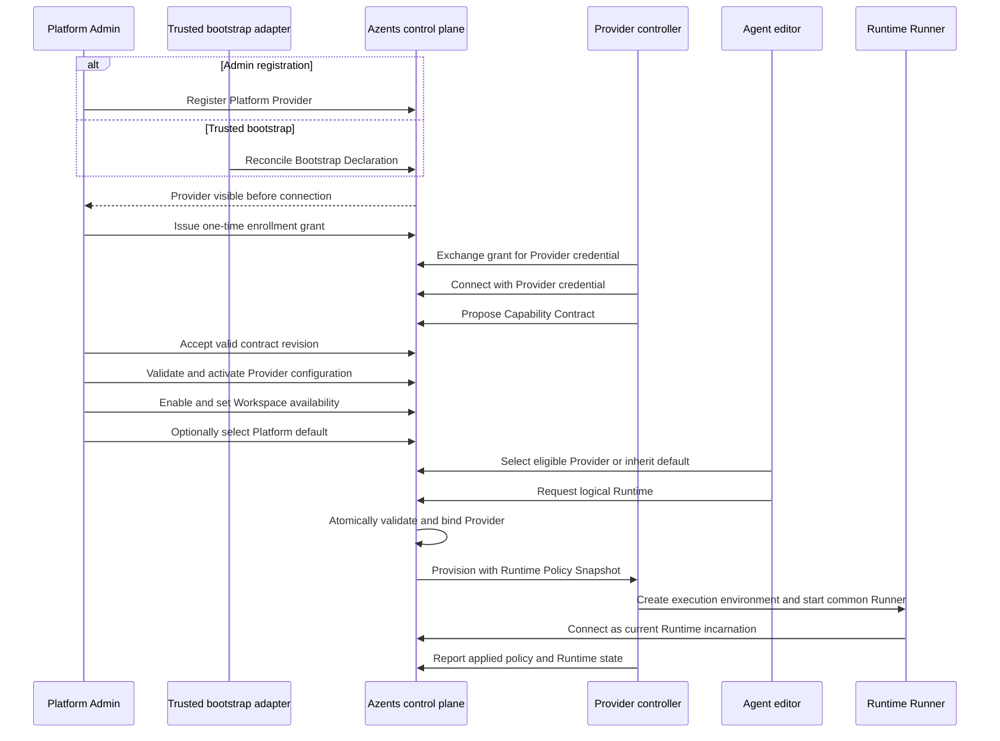
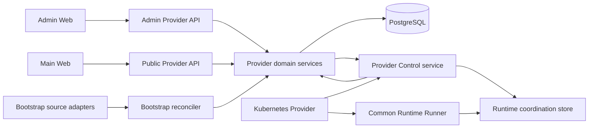

# provider-260722/DESIGN: Platform Runtime Provider Management

## Overview

This design implements the confirmed [Platform Runtime Provider Management Requirements](../requirements/provider-260722-platform-runtime-provider-management.md) (`provider-260722/REQ`) according to the accepted [Platform Runtime Provider Management ADR](../adr/provider-260722-platform-runtime-provider-management.md) (`provider-260722/ADR`).

Platform Providers become durable operational resources that Platform Admins can register, enroll, configure, observe, make available to Workspaces, select as the Platform default, decommission, and force retire. Trusted deployment bootstrap creates the same resource through an adapter-neutral declaration model. Helm supplies the first bootstrap adapter and Kubernetes supplies the first complete Provider implementation.

The design keeps four authorities separate:

1. A trusted bootstrap source may declare that a known Provider should exist.
2. Platform Admin owns product policy, configuration, availability, and administrative lifecycle.
3. An authenticated Provider controller reports implementation contract, readiness, capacity, configuration application, Runtime state, and cleanup evidence.
4. A Runtime Runner authenticates only as one physical incarnation of one logical Runtime.

No Provider is required when an installation or future Runtime flow does not use automated provisioning. Runtime and sandbox containers never receive a host Docker socket, Provider controller credential, unrestricted privileged toggle, or control over deployment security boundaries.

## Primary End-to-End Flow



## Current System and Required Changes

### Reusable foundations

- `agent_runtimes` already provides one logical Runtime per Agent, desired and observed generations, Provider and Runner state, workspace path, failure reporting, and terminal deletion acknowledgement.
- `RuntimeLifecycleReconciler` already performs generation-fenced Provider dispatch and explicit retry.
- Kubernetes and Docker Providers already run outside the Azents server and use the shared Provider Control protocol and common Runtime Runner.
- Kubernetes Runtime resources have stable Runtime IDs and Provider labels, and the Kubernetes Provider can resynchronize labelled Pods and PVCs.
- System Settings already provides reusable optimistic revision, candidate validation, confirmation, encryption, health, audit, and operation-boundary resolution mechanisms.
- Admin API authorization, generated Admin clients, Admin Web container/component patterns, master-detail surfaces, and status-oriented configuration UI already exist.

### Gaps

- `runtime_providers` is an unused configuration skeleton with no operational service, API, UI, credential, connection, lifecycle, availability, contract, or revision model.
- Agent and Agent Runtime Provider references are unvalidated strings without foreign keys.
- Provider Control accepts a shared token and client-supplied Provider identity.
- Provider capabilities and configuration schema are live registration claims rather than durable accepted contracts.
- Kubernetes Provider product settings are process environment values and cannot be validated or activated through Admin.
- Helm injects a default Provider ID directly into the server instead of declaring a durable Provider.
- No Provider-level readiness, capacity, dependency, cleanup, or forced-retirement projection exists.

## Target Architecture



The live Provider route remains in `RuntimeCoordinationStore`; PostgreSQL owns durable identity, accepted policy, connection history, and the latest durable operational projection. Losing Redis or a Provider stream does not lose the Provider registration or accepted configuration.

## Domain Ownership

### Provider aggregate

The Provider aggregate owns:

- stable internal and logical identity;
- Platform ownership scope;
- implementation key;
- Admin or bootstrap registration ownership;
- enabled policy and Workspace availability;
- active, decommissioning, decommissioned, or force-retired lifecycle;
- accepted Capability Contract and active Provider configuration pointers;
- enrollment and credential relationships;
- connection, readiness, capacity, and configuration divergence projections;
- bound Runtime and cleanup dependency projections; and
- audit history.

### Bootstrap Declaration

A Bootstrap Declaration is deployment intent. It owns source identity, declaration key, canonical Provider ID, implementation key, source revision, declaration presence, and creation-time seeds. It does not own later Admin policy and is not a Provider controller connection.

### Provider connection

A Provider connection is an authenticated process session bound to one known Provider credential. It may propose contracts, validate configuration, report readiness, receive commands, and report Runtime or cleanup state. It cannot create or select its Provider identity.

### Logical Runtime binding

An Agent preference and the Platform default are selection inputs. The Provider binding belongs to the logical Runtime and is written once during Runtime creation. Physical Runtime incarnations remain replaceable under that binding.

## Persistence Model

```mermaid
erDiagram
    RUNTIME_PROVIDERS ||--o| RUNTIME_PROVIDER_BOOTSTRAP_DECLARATIONS : established_by
    RUNTIME_PROVIDER_BOOTSTRAP_SOURCES ||--o{ RUNTIME_PROVIDER_BOOTSTRAP_DECLARATIONS : publishes
    RUNTIME_PROVIDERS ||--o{ RUNTIME_PROVIDER_WORKSPACE_AVAILABILITY : available_to
    WORKSPACES ||--o{ RUNTIME_PROVIDER_WORKSPACE_AVAILABILITY : selects
    RUNTIME_PROVIDERS ||--o{ RUNTIME_PROVIDER_ENROLLMENT_GRANTS : enrolls
    RUNTIME_PROVIDERS ||--o{ RUNTIME_PROVIDER_CREDENTIALS : authenticates
    RUNTIME_PROVIDERS ||--o{ RUNTIME_PROVIDER_CONNECTIONS : connects
    RUNTIME_PROVIDERS ||--o{ RUNTIME_PROVIDER_CONTRACT_REVISIONS : proposes
    RUNTIME_PROVIDERS ||--o{ RUNTIME_PROVIDER_CONFIG_REVISIONS : configures
    RUNTIME_PROVIDERS ||--o{ AGENT_RUNTIME_PROVIDER_OVERRIDES : constrains
    AGENTS ||--o{ AGENT_RUNTIME_PROVIDER_OVERRIDES : overrides
    RUNTIME_PROVIDERS ||--o{ RUNTIME_POLICY_SNAPSHOTS : resolves
    AGENT_RUNTIMES ||--o{ RUNTIME_POLICY_SNAPSHOTS : applies
    RUNTIME_PROVIDERS ||--o{ RUNTIME_PROVIDER_CLEANUP_DEPENDENCIES : cleans
    AGENT_RUNTIMES ||--o{ RUNTIME_PROVIDER_CLEANUP_DEPENDENCIES : depends
    RUNTIME_PROVIDERS ||--o{ RUNTIME_PROVIDER_AUDIT_EVENTS : records
```



### `runtime_providers`

The existing empty table is evolved into the aggregate root.

| Column group | Contract |
| --- | --- |
| Identity | `id`, globally unique `provider_id`, `scope`, `implementation_key` |
| Registration | `registration_method`, nullable unique `bootstrap_declaration_id` |
| Admin policy | `display_name`, `admin_version`, `enabled`, `availability_mode` |
| Lifecycle | `lifecycle_state`, transition timestamps, decommission actor |
| Revision pointers | nullable accepted contract and active configuration revision IDs |
| Projection | contract compatibility, configuration divergence, provisioning-readiness reason |
| Audit | creator, timestamps |

`provider_id` is an opaque stable logical ID and is not renamed after the Provider owns infrastructure. `scope` uses `platform` for this delivery; `workspace` remains reserved for a future snapshot. `implementation_key` is an extensible identifier rather than a closed list of every possible future backend.

`enabled` remains separate from `lifecycle_state`. Connection and bootstrap presence are not stored as lifecycle values.

### `runtime_provider_bootstrap_sources`

One row per trusted source identity:

- stable `source_key`;
- adapter kind;
- last accepted source revision and semantic digest;
- last successful reconciliation time;
- current adapter health and sanitized error;
- timestamps.

The initial Helm file adapter derives a stable source key from Helm release namespace and name. Failure to read a source does not mean declarations were withdrawn.

### `runtime_provider_bootstrap_declarations`

One row per `(source_id, declaration_key)`:

- canonical Provider ID and implementation key;
- linked Provider internal ID;
- source revision and semantic digest;
- present or absent state;
- creation-time non-secret seeds;
- first seen, last seen, and withdrawn timestamps;
- reconciliation conflict code and message.

An authoritative source revision may explicitly omit a declaration and mark it absent. Reusing the declaration identity with different immutable identity fields is a conflict.

### `runtime_provider_workspace_availability`

Rows exist only when `availability_mode = selected_workspaces`. The primary key is `(provider_id, workspace_id)`. Workspace deletion does not delete the Provider; it removes that availability membership. Existing Runtime bindings remain.

### `runtime_provider_enrollment_grants`

- grant ID and Provider FK;
- keyed verifier for a high-entropy one-time secret;
- issuing Admin or bootstrap source;
- creation and expiry;
- consumed time and resulting credential ID;
- revoked time and actor.

Plaintext is returned once and is never stored or logged.

### `runtime_provider_credentials`

- credential ID and Provider FK;
- keyed verifier for the high-entropy credential secret;
- status, optional expiry, creation, last use, and revocation;
- issuance grant and audit actor.

Multiple active credentials support rotation. Credential verification uses a deployment-rooted keyed verifier and constant-time comparison. Credential plaintext is not encrypted for later readback because it is never retrievable.

### `runtime_provider_connections`

Durable connection-session history:

- connection ID, Provider and credential;
- Provider connection generation;
- connected, last-heartbeat, and disconnected times;
- reported implementation and protocol versions;
- observed contract digest;
- readiness, capacity, and sanitized diagnostics;
- current or closed state.

The current stream route and generation remain in `RuntimeCoordinationStore`. The PostgreSQL row is the durable Admin projection and audit history.

### `runtime_provider_contract_revisions`

Immutable semantic revisions contain:

- Provider and content digest;
- implementation identity and version;
- protocol version;
- core and optional capabilities;
- Workspace persistence semantics;
- restricted configuration schema and policy scopes;
- application and compatibility semantics;
- Azents validation status and diagnostics;
- candidate, accepted, rejected, or superseded state;
- acceptance actor and timestamps.

The Provider points to one accepted revision. The connected controller may observe the same digest or a pending different candidate.

### `runtime_provider_config_revisions`

Immutable configuration revisions combine Provider product configuration and the Provider's Platform Runtime defaults and constraints:

- monotonic Provider revision and base revision;
- accepted contract revision;
- non-secret config JSON;
- encrypted complete secret payload and redacted secret metadata;
- candidate validation state;
- Provider validation request and result;
- redacted impact;
- candidate, Provider-accepted, active, superseded, rejected, or divergent state;
- creation and activation actors and timestamps.

The lifecycle reuses or extracts generic mechanisms from System Settings, including optimistic locking, candidate replacement, encryption, expiry, audit, and impact confirmation. It does not store Provider identity in System Settings.

### `agent_runtime_provider_overrides`

One versioned override document per `(agent_id, provider_id)`:

- accepted contract revision;
- non-secret values and encrypted Agent-scope secrets when the contract permits them;
- optimistic version;
- validation status and timestamps.

An override is not a Provider binding. It is used only when the Agent selects or is already bound to that Provider. Clearing an override restores inheritance.

### `runtime_policy_snapshots`

Immutable effective policy for a provisioning or live-application operation:

- logical Runtime and Provider;
- accepted contract and active Provider configuration revisions;
- Platform policy and Agent override revisions;
- future nullable Session revision;
- resolved non-secret values, encrypted required secrets, and source trace;
- semantic digest;
- target Provider and desired generations;
- application state, Provider acknowledgement, and Runtime applied observation.

Migration may mark an existing incarnation `legacy_unverified`; it is not reported as applied until the Provider resynchronizes compatible evidence or the incarnation is replaced.

### `runtime_provider_cleanup_dependencies`

Each decommission dependency stores:

- Provider and optional logical Runtime;
- incarnation and external resource references;
- persistence consequence;
- cleanup operation ID and generation;
- requested and observed terminal states;
- sanitized Provider evidence;
- pending, in-progress, verified-clean, failed, or unverified status;
- timestamps.

Provider-level final inventory and reconciliation barriers are represented as dependencies without a logical Runtime.

### `runtime_provider_audit_events`

Append-only metadata events cover registration, bootstrap reconciliation, Admin changes, enrollment, credential use and revocation, contract acceptance, configuration activation, default selection, availability changes, binding, lifecycle transitions, cleanup, and forced retirement. Events never contain plaintext secrets, complete configuration payloads, Runner tokens, or Kubernetes Secret values.

### Agent and Agent Runtime changes

`agents` gains a nullable Provider preference FK. The public `runtime_provider_id` field continues to expose the Provider logical ID.

`agent_runtimes` gains:

- `provisioning_origin` (`provider` or future `user`);
- nullable Provider FK required when origin is `provider`;
- binding source (`agent_explicit`, `platform_default`, or `migration`);
- binding time;
- binding contract and policy evidence;
- current Runtime Policy Snapshot reference.

The old string-only `runtime_provider_id` and `provider_config` are removed after migration. Existing desired, observed, Provider, Runner, failure, and terminal-delete generations remain authoritative.

## Platform Default

A compiled System Settings Section, `platform_runtime`, stores the nullable default Provider logical ID. The section is instance-wide and uses typed service validation to ensure that the referenced Provider exists and is not terminal. Physical Provider deletion is not supported, so an activated reference cannot dangle silently.

Changing the default uses candidate impact confirmation and shows:

- Workspaces for which the Provider is eligible;
- Agents without an explicit preference;
- Agents whose next Runtime request would remain unavailable;
- Provider persistence and capability summary.

The default is not an automatic fallback. Runtime creation always validates current eligibility.

## Bootstrap Source Contract

### Adapter interface

Control-plane adapters implement a source interface that returns an authoritative snapshot:

```text
source identity
source revision
complete declaration list
adapter health
```

The reconciler validates the complete snapshot, acquires a source lock, and applies one source revision transactionally. A malformed or partially read snapshot does not withdraw existing declarations.

### Initial Helm file adapter

Helm always renders and mounts one non-secret source document into the server, even when the Kubernetes Provider declaration list is empty. This allows `enabled: false` to produce an authoritative empty source revision instead of making the adapter disappear.

Conceptual source content:

```yaml
apiVersion: azents.io/v1
source:
  key: helm/default/azents
  revision: <rendered-content-digest>
providers:
  - declarationKey: runtime-provider-kubernetes
    providerId: system-kubernetes
    implementationKey: kubernetes
    initial:
      displayName: Kubernetes
      enabled: true
      availability: platform-wide
      setAsPlatformDefaultWhenUnset: true
```

The document contains no enrollment grant, Provider credential, Runner token, database secret, Kubernetes service-account token, or Admin credential. Product configuration seeds may contain only fields explicitly allowed as non-secret creation seeds. Secret product configuration enters the Admin candidate flow.

The server polls mounted source documents by content digest and reconciles changes. Future installation CLI or operator adapters use the same source and declaration service rather than creating a second Provider model.

### Reconciliation behavior

- New declaration: create the Provider and apply allowed creation seeds.
- Same identity and immutable fields: update presence and source revision only.
- Changed Provider ID or implementation: record conflict.
- Existing Admin or other-source Provider ID: record conflict without adoption.
- Missing declaration in an authoritative snapshot: mark declaration absent and block new selection and provisioning.
- Returning declaration: restore presence if lifecycle remains active.
- Terminal Provider: keep identity reserved and report conflict.

## Enrollment and Connection Authentication

### Operator flow

1. Admin or an owning bootstrap source requests an enrollment grant.
2. Admin shows the grant once with its Provider and expiry.
3. The Deployment Operator runs the Provider controller distribution in enrollment mode to exchange the grant before starting the long-running controller.
4. Azents returns a Provider credential once.
5. The operator persists it using an operator-controlled secret mechanism.
6. The long-running Provider controller mounts or reads that secret and connects.

For Kubernetes, the chart accepts an existing Secret reference and key. The Provider image or companion distribution supplies an `enroll` subcommand that may write the returned credential using the operator's Kubernetes authority. The long-running Provider Deployment and ServiceAccount are not granted permission to create or update Secrets.

The chart may initially deploy a waiting or not-ready controller until the Secret exists. This does not affect bootstrap registration.

### Control authentication

The Provider credential is supplied in gRPC metadata over authenticated encrypted transport. Authentication completes before accepting a registration payload. The credential resolves:

- Provider internal and logical identity;
- allowed lifecycle mode;
- credential status;
- connection generation.

Client-supplied Provider ID, implementation key, and credential ID are consistency claims only. A mismatch closes the stream and writes a sanitized security audit event.

An optional deployment gateway credential or mTLS layer may protect network access but cannot authorize a Provider identity.

## Capability Contract Lifecycle

### Proposal

After authentication, the controller sends a contract proposal. Azents:

1. validates protocol compatibility and mandatory core operations;
2. validates the restricted configuration and policy schema;
3. canonicalizes semantic content;
4. creates or finds the digest revision;
5. compares it with the accepted revision.

The first or changed digest becomes a candidate. The connection remains available for contract review, observation, and safe cleanup but is not provisioning-ready.

### Acceptance

Admin sees a semantic diff grouped by:

- core lifecycle;
- optional lifecycle;
- persistence;
- configuration fields and ranges;
- supported override scopes;
- application and replacement semantics;
- compatibility impact on bound Runtimes.

Protocol-incompatible candidates cannot be accepted. A valid accepted revision updates the Provider pointer and triggers configuration compatibility re-evaluation. Acceptance does not apply configuration or replace Runtimes.

### Operational observations

Heartbeats, capacity, readiness, health, and applied revisions update the connection projection without creating contract revisions.

## Provider Configuration and Runtime Policy

### Candidate and activation

Provider configuration endpoints use the accepted contract to project typed Admin fields. Saving creates an immutable candidate. The configuration service:

1. locks the Provider version;
2. applies explicit field patches and secret actions;
3. performs local and contract validation;
4. encrypts secrets;
5. computes impact;
6. enqueues a durable Provider validation request.

The Provider Control reconciler sends pending validation requests on connect and retry. Provider validation never applies the candidate. Admin confirms an unchanged valid candidate and impact to make it active.

The desired active revision is resent until the Provider acknowledges it. Admin displays desired, Provider-active, and divergent revisions separately.

### Effective policy resolution

The policy resolver evaluates:

```text
accepted Provider contract
→ active Platform defaults and constraints
→ Agent override
→ future Session override
```

It rejects unsupported values and records the source of each effective field. Resolution occurs when creating a logical Runtime, provisioning a new incarnation, or requesting a supported live update.

### Runtime application

Provider commands include the Runtime Policy Snapshot ID, digest, relevant resolved values, and only the secrets required at that boundary. Provider reports include accepted and applied snapshot identity.

Application behavior is:

- `immediate`: apply and acknowledge without incarnation replacement;
- `next_incarnation`: retain divergence until the next incarnation;
- `replacement_required`: expose explicit required or recommended replacement;
- `new_logical_runtime`: preserve current logical Runtime behavior;
- `immutable`: reject mutation.

No ordinary configuration save dispatches a restart or replacement command.

## Availability, Selection, and Binding

### Eligibility projection

The Provider selection service combines:

- lifecycle active;
- enabled policy;
- bootstrap presence when bootstrap-owned;
- Workspace availability;
- accepted and observed contract compatibility;
- active configuration readiness;
- active authenticated connection;
- fresh Provider readiness and capacity observation;
- requested capability, persistence, and policy satisfaction.

The service returns structured rejection reasons for UI and API use.

### Runtime creation transaction

The Agent Runtime creation service:

1. locks or otherwise protects the Agent preference and Platform default versions;
2. resolves explicit Agent preference first, then Platform default;
3. validates the exact candidate without fallback;
4. creates the logical Runtime and immutable Provider FK in one transaction;
5. creates the initial Runtime Policy Snapshot;
6. commits before external dispatch.

If no candidate is eligible, no Provider-provisioned logical Runtime is created. If the Provider rejects after commit because capacity changed, the bound Runtime enters a blocked state and remains on that Provider.

### Existing Runtime behavior

Provider preference, default, availability, contract, or readiness changes do not rewrite an existing binding. Agent UI disables Provider selection while the logical Runtime exists and explains that another Provider requires ending the current Runtime with the displayed persistence consequence.

## Provider Control Protocol

The protocol remains one outbound bidirectional stream but replaces live self-registration with authenticated reconciliation.

### Provider-to-control messages

- `ProviderHello`: connection identity claims, implementation version, protocol version, observed contract digest.
- `ProviderContractProposal`: complete versioned contract.
- `ProviderHeartbeat`: sequence, readiness, capacity, active Provider configuration revision.
- `ProviderConfigurationValidationResult`: request ID, candidate revision, validation status, field errors, impact.
- `ProviderConfigurationApplied`: desired and actual Provider configuration revisions.
- `RuntimeProviderReport`: existing Runtime state plus bound Provider verification, external references, accepted and applied Runtime Policy Snapshot.
- `ProviderInventoryItem`: one managed Runtime or external resource during resynchronization.
- `ProviderInventoryComplete`: reconciliation generation and final inventory digest.
- `ProviderCommandCompletion` and sanitized `ProviderError`.

### Control-to-Provider messages

- `ProviderHelloAccepted`: authenticated Provider identity, generation, lifecycle mode, heartbeat interval.
- `RequestProviderContract`: request the full contract for an unknown digest.
- `ValidateProviderConfiguration`: immutable candidate revision and validation request.
- `ActivateProviderConfiguration`: active desired revision.
- `ProviderCommand`: existing lifecycle command plus immutable Provider binding and Runtime Policy Snapshot.
- `RequestProviderInventory`: full resynchronization or decommission barrier request.
- `ProviderHeartbeatAck` and sanitized `ProviderError`.

All command, validation, configuration, and inventory messages carry stable request IDs and relevant Provider, Runtime, desired, configuration, or reconciliation generations. Retries converge and stale responses do not become current.

### Report validation

The server rejects a Runtime report unless:

- the authenticated connection Provider equals the Runtime's immutable Provider FK;
- the Provider generation is current;
- the desired generation and incarnation evidence are not stale;
- terminal cleanup evidence satisfies the declared command and state;
- the reported Runtime Policy Snapshot belongs to that Runtime and Provider.

This validation is added before the existing state sinks persist observations.

## Kubernetes Provider Changes

The Kubernetes Provider remains external and retains ownership of Runtime Pod and PVC automation.

Required changes:

- Provider-specific credential authentication;
- versioned Capability Contract for Kubernetes lifecycle, PVC persistence, configuration, capacity, and placement;
- candidate validation and active revision acknowledgement;
- Runtime Policy Snapshot application and reporting;
- readiness and capacity projection;
- complete labelled Pod and PVC inventory with reconciliation barriers;
- cleanup evidence with external references;
- cleanup-only lifecycle mode;
- preservation of existing `azents/runtime-provider-id` identity during migration.

Deployment-owned configuration remains in Helm or Kubernetes resources:

- controller Deployment topology and image;
- namespace and ServiceAccount;
- RBAC, NetworkPolicy, RuntimeClass, admission, and security policy;
- controller Secret references;
- Runtime image source and infrastructure endpoints required before database configuration is available.

Admin-managed product configuration may include only contract-declared safe values such as supported Runner resource defaults, product-level persistence choices, or bounded Pod metadata and placement choices that do not grant new cluster authority. The exact first contract field set must be reviewed against the existing environment fields during implementation.

The Runtime Pod security context remains non-root and does not mount a host Docker socket. A generic Admin-controlled privileged switch is not added.

## Administrative Lifecycle

### Disable

Disable is reversible and blocks selection, binding, and commands that create a new incarnation. Existing Runner processes continue. Observation and explicitly cleanup-safe commands remain.

### Decommission

The service first builds a preview containing affected Workspaces, bound Runtimes, persistence consequences, external references, configuration divergence, bootstrap presence, and connection state. Confirmation moves the Provider irreversibly to decommissioning and creates the Cleanup Dependency Ledger.

Only cleanup-safe protocol operations are dispatched. Each dependency retains retries and evidence. After Runtime cleanup, a complete inventory barrier must prove no Provider-owned infrastructure remains before decommissioned state is entered and credentials are revoked.

### Force retire

Force retire is available only from decommissioning and requires confirmation of unresolved dependencies. It revokes all authority, closes connections, reserves identity, and marks unresolved dependencies unverified. Later notes or external evidence do not reactivate or rewrite the terminal state.

## API Design

All Admin routes use the existing live `system_admin` dependency. Provider controllers and bootstrap adapters do not call Admin routes with Admin credentials.

### Admin Provider API

Base prefix: `/runtime-provider/v1`.

| Method and path | Purpose |
| --- | --- |
| `GET /providers` | Paginated inventory with filters and status facets |
| `POST /providers` | Admin registration |
| `GET /providers/{provider_id}` | Full redacted operational detail |
| `PATCH /providers/{provider_id}` | Versioned Admin-owned field update |
| `POST /providers/{provider_id}/enable` | Enable active Provider |
| `POST /providers/{provider_id}/disable` | Disable active Provider |
| `PUT /providers/{provider_id}/availability` | Platform-wide or selected Workspace policy |
| `POST /providers/{provider_id}/set-platform-default` | Candidate-confirmed default change |
| `DELETE /providers/{provider_id}/platform-default` | Clear default when it matches |
| `POST /providers/{provider_id}/enrollment-grants` | Issue one-time grant |
| `GET /providers/{provider_id}/credentials` | Redacted credential inventory |
| `POST /providers/{provider_id}/credentials/{credential_id}/revoke` | Revoke credential |
| `GET /providers/{provider_id}/contracts` | Accepted and candidate contracts |
| `POST /providers/{provider_id}/contracts/{revision_id}/accept` | Accept valid contract |
| `PATCH /providers/{provider_id}/configuration` | Create or replace candidate |
| `POST /providers/{provider_id}/configuration/candidate/validate` | Retry Provider validation |
| `POST /providers/{provider_id}/configuration/candidate/confirm` | Activate unchanged valid candidate |
| `DELETE /providers/{provider_id}/configuration/candidate` | Cancel candidate |
| `GET /providers/{provider_id}/runtimes` | Bound Runtime and impact inventory |
| `POST /providers/{provider_id}/decommission/preview` | Build current dependency preview |
| `POST /providers/{provider_id}/decommission` | Enter decommissioning |
| `POST /providers/{provider_id}/force-retire` | Force terminal trust removal |
| `GET /providers/{provider_id}/cleanup-dependencies` | Cleanup ledger |
| `GET /providers/{provider_id}/audit-events` | Metadata-only audit |

Mutations require expected Admin or resource version where concurrent updates matter. Stable error bodies include a machine code, user-safe message, current version or state, and action hint.

### Enrollment API

A narrow unauthenticated-to-Admin enrollment endpoint accepts only a valid one-time grant and performs the credential exchange. It cannot list Providers or perform Admin operations. Rate limits and audit apply by grant ID and source address.

### Public Provider API

Authenticated Workspace members use generated Public API clients:

| Method and path | Purpose |
| --- | --- |
| `GET /runtime-provider/v1/eligible` | Providers eligible for one Agent or Workspace with rejection summaries |
| `GET /runtime-provider/v1/providers/{provider_id}/policy-schema` | Redacted Agent-scope fields and effective limits |
| `GET /agent/v1/{agent_id}/runtime-provider-policy` | Preference, immutable binding, overrides, and effective sources |
| `PATCH /agent/v1/{agent_id}/runtime-provider-policy` | Set pre-Runtime preference and Agent overrides |

The existing Agent create and update `runtime_provider_id` field is routed through the same selection service. It is rejected when a logical Runtime already exists or the exact Provider is not available to the Workspace. No Admin client is added to Main Web.

## Admin Web

### Navigation and primary workspace

Add **Runtime Providers** to the existing Admin side navigation. The page uses the established master-detail pattern:

- desktop: inventory table and selected Provider detail in adjacent panes;
- mobile: inventory first, detail in a full-height drawer;
- route/query state preserves selected Provider and active detail section.

The inventory is the visual anchor rather than a dashboard card grid.

### Inventory table

Columns:

- display name and stable ID;
- implementation;
- registration source and bootstrap presence;
- enabled and lifecycle;
- availability;
- accepted contract;
- connection and provisioning readiness;
- capacity summary;
- bound Runtime count;
- Platform default marker.

Toolbar actions provide search, status filters, registration, and refresh. The empty state states that Platform Providers are optional and offers **Register Provider** while explaining that trusted deployment bootstrap may populate the same list.

### Provider detail

A sticky header shows identity, lifecycle, enabled state, connection freshness, readiness, default status, and the primary safe action.

Detail sections:

1. **Overview** — status breakdown, source ownership, availability, persistence, capacity, last observation.
2. **Configuration** — schema-rendered fields, source badges, candidate validation, impact, desired/Provider-active divergence.
3. **Capabilities** — accepted contract and pending semantic diff.
4. **Runtimes** — bound Runtime table, Workspace, state, applied policy, replacement and cleanup status.
5. **Enrollment** — create grant, credential inventory, rotation, revocation, connection sessions.
6. **Lifecycle** — disable, decommission preview, cleanup ledger, force retirement.
7. **Audit** — compact metadata table.

Destructive actions remain in Lifecycle. Force retirement requires typed confirmation and displays unverified external resources.

### Dynamic configuration form

The Admin API projects the restricted Provider schema into a typed field-descriptor union understood by the generated client. The UI does not execute Provider-supplied JavaScript, render arbitrary HTML, or accept a raw unrestricted JSON editor as the primary flow.

Each field displays:

- scope;
- effective source;
- validation constraints;
- secret configured state;
- application timing;
- expected replacement or persistence impact.

Candidate status remains visible while editing or navigating detail sections.

## Main Web

Agent settings add a Runtime Provider section.

Before a logical Runtime exists:

- select **Use Platform default** or one eligible Provider;
- show implementation, connection/readiness, persistence behavior, capability fit, and reason when unavailable;
- edit only Agent-scope overrides allowed by the selected Provider contract.

After a logical Runtime exists:

- show the immutable bound Provider, binding source, persistence behavior, active and applied policy revisions, connection and Runtime status;
- disable selection changes;
- explain that another Provider requires ending the logical Runtime;
- show replacement-required or incompatible state with the supported action.

Empty and failure states distinguish:

- no Provider registered;
- no Provider available to the Workspace;
- selected Provider disabled;
- contract pending;
- Provider disconnected;
- insufficient capability or capacity.

## Security Boundaries

- Bootstrap, Admin, enrollment, Provider, Runner, and Runtime-scoped authorities are distinct.
- Provider identity is derived from credential binding, not request claims.
- Provider reports are checked against immutable Runtime binding.
- Secret plaintext is returned only during grant or credential issuance and is never logged.
- Configuration secrets are encrypted and sent only to the required boundary.
- Provider and Runner credentials are not interchangeable.
- Admin APIs cannot write Kubernetes RBAC, NetworkPolicy, RuntimeClass, admission policy, ServiceAccounts, or Secrets.
- The Provider controller does not receive Kubernetes Secret write authority for enrollment.
- Runtime and sandbox containers never receive a host Docker socket or Provider credential.
- No generic Admin-controlled privileged toggle is exposed.
- Runtime application continues to rely on deployment security policy, including non-root execution and optional operator-managed isolation such as gVisor.
- Security events use structured logging; Sentry delivery occurs through logging integration rather than direct SDK calls.

## Observability

### Metrics

- Provider counts by lifecycle, enablement, registration method, connection, readiness, and contract status;
- bootstrap source reconciliation success, conflict, and age;
- enrollment issuance, exchange, expiry, and revocation;
- active Provider connections and heartbeat age;
- contract candidates and mismatches;
- configuration candidates, validation duration, divergence, and Runtime application lag;
- selection rejection reasons;
- provisioning admission failures;
- decommission dependency counts and age;
- force-retired unverified resources.

Metrics use bounded labels such as implementation, state, and error code; Provider IDs and Runtime IDs remain log fields rather than high-cardinality labels.

### Logs and audit

Structured logs include Provider, connection, credential ID, Runtime, request, revision, and generation where relevant. They exclude secrets and full configuration. Stable sanitized error codes feed Admin and Runtime status. Durable audit events cover user and system mutations independently of application logs.

## Migration and Rollout

### Verified starting state

Read-only home database inspection on 2026-07-22 established:

- zero `runtime_providers` rows;
- three Agents referencing `system-kubernetes`;
- three logical Agent Runtimes referencing `system-kubernetes`;
- all three with connected Provider and running observed state;
- no non-empty Runtime `provider_config`.

The Kubernetes Provider uses Provider ID in Pod and PVC labels, inventory selectors, Runtime environment, and Pod reuse checks. The migration retains `system-kubernetes` as the stable ID for the existing installation.

### Expand

Generate new Alembic revisions; never edit the executed migration that introduced the skeleton. Add new tables and shadow FK columns. Preserve legacy strings temporarily for verified conversion and pre-cutover rollback.

### Preflight and bootstrap

The migration command fails unless:

- the Provider table remains empty or explicitly resolved;
- all legacy non-null references match the configured Kubernetes Provider ID;
- no non-empty legacy config lacks a conversion;
- the Helm bootstrap source can create the same stable Provider;
- existing Runtime identities and Kubernetes resources can be enumerated.

The Helm source reconciles the durable Provider before FK backfill.

### Backfill

- map Agent preferences and Runtime bindings to the new Provider FK;
- set binding source to `migration`;
- preserve all logical Runtime and generation state;
- create `legacy_unverified` policy application evidence;
- convert the environment default to the `platform_runtime` System Settings Section;
- import safe product-level environment values as a configuration candidate, not accepted state.

### Coordinated cutover

1. Pause new binding and incarnation creation.
2. Apply schema and backfill.
3. Issue and install a Provider credential.
4. Deploy the new server and Kubernetes Provider protocol together.
5. Accept the Kubernetes contract and activate required Provider configuration.
6. Request full labelled Pod and PVC inventory.
7. Verify the three logical Runtimes and external resources without replacement.
8. Reopen provisioning.

Existing Runner processes continue unless independent incompatibility requires replacement.

### Contract

After an observation window:

- remove legacy string writes and `provider_config`;
- remove `system` scope semantics;
- remove environment default and product-config fallback;
- remove Helm direct server default injection;
- remove shared-token-only Provider identity and self-registration;
- retain existing opaque Provider IDs.

Rollback is supported only before new-model state becomes authoritative. After cutover, recovery is roll-forward.

## Failure Handling

| Failure | Durable behavior |
| --- | --- |
| Bootstrap source unreadable | Keep prior declaration presence; show source error |
| Declaration identity conflict | Do not mutate Provider; show conflict |
| Enrollment grant leaked or expired | Revoke or expire grant; no Provider credential exists |
| Provider credential revoked | Close matching sessions; Provider remains |
| Contract invalid | Reject candidate; connection may remain observation/cleanup-only |
| Contract changed | Preserve accepted contract; block new provisioning until resolved |
| Config candidate rejected | Preserve active revision |
| Active config not applied | Show desired/Provider-active divergence |
| Runtime policy not applied | Show Runtime-specific divergence or replacement requirement |
| Provider disconnected | Keep registration and bindings; no fallback |
| Capacity race | Keep immutable binding in blocked state |
| Bootstrap declaration withdrawn | Block new use; preserve Runtime and Admin state |
| Decommission cleanup fails | Retain failed dependency and retry |
| Provider unreachable | Permit explicit force retire with unverified cleanup |
| Migration sees unexpected ID | Stop before cutover |

## Test Strategy

### E2E primary verification matrix

| Scenario | Primary evidence |
| --- | --- |
| No Provider installed | Core product remains usable; Runtime request shows explicit unavailable result |
| Admin registration | Provider appears before enrollment or connection |
| Trusted bootstrap | Helm source creates the same Provider resource idempotently |
| Bootstrap upgrade | Admin-owned configuration and availability remain unchanged |
| Bootstrap withdrawal and return | Presence changes without deletion; same identity recovers |
| Enrollment | One-time grant creates only its bound Provider credential |
| Identity spoofing | Credential cannot claim another Provider or Runtime |
| Contract lifecycle | Initial and changed contract require valid Admin acceptance |
| Configuration lifecycle | Candidate validation, impact confirmation, activation, and divergence are visible |
| Workspace availability | Ineligible Workspace cannot select or bind Provider |
| Selection precedence | Explicit selection wins; invalid explicit selection does not fall back |
| Immutable binding | Default and preference changes do not move an existing Runtime |
| Kubernetes provisioning | Runtime Pod starts the common Runner and reports applied snapshot |
| Incarnation replacement | Pod replacement preserves logical Runtime and rejects stale reports |
| Persistence warning | UI shows declared data-loss behavior before destructive action |
| Disable and reconnect | Existing Runner remains; new provisioning is blocked |
| Decommission | Every dependency requires verified cleanup and final inventory barrier |
| Force retire | Credentials revoked and unresolved infrastructure remains unverified |
| Migration | Existing labelled resources resynchronize without replacement |

### E2E plan

Deterministic product E2E uses a controllable external Provider fixture that implements the real Provider Control client and can vary contract, validation, capacity, readiness, application, and cleanup responses. It verifies Admin and Main Web flows through generated clients and rendered UI.

Kubernetes integration E2E runs against the test Kubernetes environment and verifies the real Helm bootstrap file, Provider credential Secret reference, Pod/PVC labels, common Runner connection, policy reporting, resynchronization, and no-replacement migration fixture.

### Fixture and prerequisite support

Testenv needs:

- system Admin, Workspace, Agent editor, and Agent fixtures;
- empty, Admin-created, and bootstrapped Provider states;
- one-time grant and redacted credential fixture helpers;
- deterministic contract and configuration manifests;
- configurable fake Provider readiness, capacity, validation, and cleanup responses;
- seeded migration database with an empty Provider table and legacy `system-kubernetes` Agent and Runtime references;
- Kubernetes Pods and PVCs labelled with the preserved Provider and Runtime IDs;
- a way to assert resource UID continuity across cutover.

Credentials are generated per test run and never committed. Live-cluster credentials and external endpoints are prerequisite snapshots, not test assertions.

### Evidence format

CI retains:

- E2E test report and failure traces;
- Admin and Main Web screenshots for key status transitions;
- sanitized Provider Control message trace keyed by request and generation;
- migration preflight and backfill summary;
- Kubernetes object snapshots showing stable UID and labels;
- audit-event assertions without secret payloads.

### CI and optional test policy

- Backend domain, repository, API, protocol, migration, and fake-Provider E2E tests are required CI.
- Admin Web and Main Web interaction E2E are required CI.
- Helm render and chart tests are required CI.
- Kubernetes Provider unit and component tests are required CI.
- Live Kubernetes E2E is required in the configured cluster-enabled pipeline and may skip only when the pipeline explicitly lacks the documented cluster prerequisite. A configured cluster failure fails CI.
- No test skips because no Provider is installed unless the test explicitly verifies the optional-Provider state.

## Traceability Matrix

| Requirement | ADR decisions | Design mechanism |
| --- | --- | --- |
| `REQ-1` | D1, D5 | Provisioning origin and nullable future user-provisioned binding |
| `REQ-2` | D5, D6 | One logical Runtime, immutable binding, generation-fenced incarnations |
| `REQ-3` | D1, D2 | Durable Provider aggregate and Admin registration |
| `REQ-4` | D3 | One-time enrollment and Provider-specific credential |
| `REQ-5` | D2, D8 | Durable adapter-neutral Bootstrap Declaration and Helm file adapter |
| `REQ-6` | D5 | Optional inventory and explicit unavailable result |
| `REQ-7` | D5 | Availability mode and Provider-Workspace memberships |
| `REQ-8` | D1, D4, D6 | Restricted schema, candidate validation, active revision |
| `REQ-9` | D4, D5 | Connection, readiness, capacity, and compatibility projections |
| `REQ-10` | D5 | Transactional exact-candidate selection and immutable Runtime FK |
| `REQ-11` | D4, D6 | Mandatory core contract and generation-fenced commands |
| `REQ-12` | D3, D5 | Separate Runner authority and common Runner startup |
| `REQ-13` | D2, D4, D8 | Kubernetes contract, Helm adapter, stable migration identity |
| `REQ-14` | D3, D7 | Credential revocation and force-retired unverified dependencies |
| `REQ-15` | D4, D5, D6 | Persistence contract, selection display, Runtime snapshot |
| `REQ-16` | D4 | Versioned core, optional, and namespaced capability contract |
| `REQ-17` | D6 | Capability → Platform → Agent → future Session resolution |
| `REQ-18` | D6 | Application semantics and per-Runtime applied snapshot |
| `REQ-19` | D5 | Explicit Agent preference then Platform default, no fallback |
| `REQ-20` | D7, D8 | Separate lifecycle state machine, cleanup ledger, safe migration |

## Repository Feasibility

| Requirement area | Result | Repository evidence and implementation path |
| --- | --- | --- |
| `REQ-1` | Feasible | Nullable current Provider strings and common Runner already separate execution from provisioning; add explicit origin and validated binding |
| `REQ-2` | Feasible | `agent_runtimes` has one row per Agent and generation fencing |
| `REQ-3` | Feasible | Existing Provider table and Admin resource patterns can be replaced with aggregate service and routes |
| `REQ-4` | Feasible | Existing auth, secret hashing/encryption, and protected endpoint patterns support scoped enrollment |
| `REQ-5` | Conditional | Helm can render and mount a source document; bootstrap adapter and reconciler are new |
| `REQ-6` | Feasible | Chart already permits Provider and Runtime Control to be disabled |
| `REQ-7` | Feasible | Workspace FKs and Admin Workspace APIs exist; add membership table |
| `REQ-8` | Conditional | System Settings lifecycle is reusable, but Provider-scoped revisions and protocol validation are new |
| `REQ-9` | Conditional | Heartbeats and coordination exist; readiness, capacity, and durable connection sessions are new |
| `REQ-10` | Feasible | Agent Runtime creation is transactional; add selection service, locks, and FKs |
| `REQ-11` | Feasible | Kubernetes implements provision, observe/resync, deprovision, and generation behavior |
| `REQ-12` | Feasible | Kubernetes Provider already starts the common Runner |
| `REQ-13` | Feasible | Kubernetes chart, Provider, RBAC, NetworkPolicy, Pod/PVC rendering, and tests exist |
| `REQ-14` | Conditional | Credential revocation is new; terminal Runtime acknowledgement provides a base for cleanup evidence |
| `REQ-15` | Feasible | PVC-backed Kubernetes persistence and lifecycle distinctions already exist |
| `REQ-16` | Conditional | Current repeated strings and JSON schema fields require a versioned contract protocol |
| `REQ-17` | Conditional | Agent config fields exist, but source-traced override persistence and resolution are new |
| `REQ-18` | Conditional | Current generation model supports replacement; policy snapshots and application acknowledgements are new |
| `REQ-19` | Feasible | Existing Agent and environment default fields show the integration points; replace with validated preference and System Setting |
| `REQ-20` | Conditional | Current terminal delete acknowledgement is reusable; Provider lifecycle and cleanup ledger are new |

No requirement is blocked. Conditional items require substantial implementation but have a concrete persistence, API, protocol, UI, and verification path.

## Implementation Phases

This feature is too large for one focused PR and should be delivered as a stack after implementation is requested.

1. **Provider aggregate and schema expansion** — domain models, repositories, bootstrap declarations, availability, audit, and migration preflight.
2. **Enrollment and authenticated Provider connection** — grants, credentials, connection sessions, protocol identity binding.
3. **Capability Contract and configuration lifecycle** — protocol revisions, Admin API, candidate validation, activation, policy snapshots.
4. **Selection and immutable Runtime binding** — System Settings default, Workspace eligibility, Agent preference and overrides, Runtime FK.
5. **Admin and Main Web** — Provider inventory/detail, configuration, enrollment, selection, status, and lifecycle surfaces.
6. **Kubernetes and Helm adapter** — bootstrap file, credential Secret reference, contract, configuration, readiness, inventory, cleanup.
7. **Lifecycle, migration cutover, and QA** — decommission ledger, force retirement, stable-ID backfill, full E2E, observability.
8. **Living spec synchronization** — update Runtime control, Agent Runtime, configuration, Admin, and Helm specs immediately before final QA.

The complete stack should be created before CI monitoring. No PR is merged without explicit approval.

## Required Living Spec Updates

Implementation must update or add living specs covering:

- `docs/azents/spec/flow/agent-runtime-control.md`;
- Provider enrollment and connection authentication;
- Platform Provider registration, availability, configuration, and lifecycle;
- Agent Provider selection and immutable Runtime binding;
- Kubernetes Provider bootstrap and persistence behavior;
- Admin-managed instance default Provider policy;
- migration and removal of environment/shared-token behavior.

## Remaining Non-Blocking Risks

- The first restricted configuration descriptor vocabulary must be broad enough for Kubernetes product settings without becoming executable UI schema.
- Provider validation and inventory messages increase protocol surface and require careful idempotency and generation tests.
- Operator credential persistence is intentionally outside the Provider ServiceAccount and needs clear Helm and CLI documentation.
- Existing Runtime policy application is unverified until resynchronization; UI and migration evidence must not overstate it.
- A configured Platform default may be unavailable to some Workspaces; Admin impact and Main Web rejection copy must remain explicit.
- Large lifecycle and configuration tables require pagination, bounded diagnostic payloads, and retention policy for non-current operational history.

## Final Feasibility Conclusion

The design is feasible in the current repository. The existing logical Runtime model, external Provider process, Kubernetes automation, common Runner, generation fencing, System Settings lifecycle, Admin authorization, generated clients, and frontend patterns provide the required foundations. The principal work is adding durable authority, authentication, contract, revision, selection, and cleanup models and replacing environment/shared-token shortcuts with those models.

The verified empty Provider table materially reduces migration scope. The only deployed data conversion demonstrated in the home environment is a stable-ID FK backfill for three active `system-kubernetes` Agent and Agent Runtime references, followed by authenticated Provider resynchronization without replacing their Kubernetes resources.
