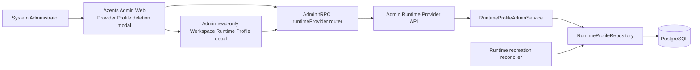
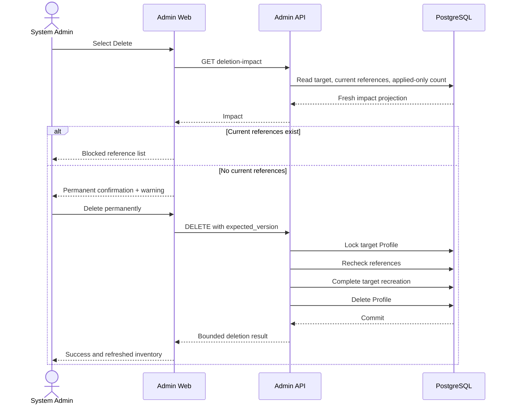

# Provider Infrastructure Profile Deletion Design

- Snapshot: `provider-260811`
- Document reference: `provider-260811/DESIGN`
- Requirements: [Provider Infrastructure Profile Deletion Requirements](../requirements/provider-260811-infrastructure-profile-deletion.md) (`provider-260811/REQ`)
- ADR: [Provider Infrastructure Profile Deletion](../adr/provider-260811-infrastructure-profile-deletion.md) (`provider-260811/ADR`)
- Design revision: `1`

## Summary

Add a System-Admin-only deletion flow for Provider-owned Kubernetes Pod Profiles and Docker Container Profiles. The Admin UI always exposes the destructive action, fetches a fresh PostgreSQL-backed impact projection, blocks deletion on any current Workspace Runtime Profile reference, warns about applied-only running Runtimes, and submits an exact-version hard delete only after explicit confirmation.

The delete transaction locks the exact infrastructure Profile, rechecks current Workspace Runtime Profile references, terminates active target-scoped recreation operations, and deletes only the Profile row. Existing Runtime desired/applied state, Provider bindings, workloads, Runner Workspace paths, Workspace storage, Workspace defaults, and Agent selections are not mutated. PostgreSQL foreign-key locking remains the final concurrency boundary against a new reference racing with deletion.

The Admin application gains a System-Admin-owned read-only Workspace Runtime Profile detail route so blocking references can be inspected without Workspace membership or mutation authority.

## Current Behavior and Gaps

### Current behavior

- `RDBRuntimeInfrastructureProfile` is a mutable Provider-owned Profile with exact Provider identity, optimistic `version`, lifecycle, typed document, and Provider-scoped name uniqueness.
- `RDBWorkspaceRuntimeProfile` holds a restrictive composite foreign key from `(provider_id, infrastructure_profile_id)` to the owning infrastructure Profile.
- Infrastructure Profiles support Admin create, list, get, replace, compatibility projection, and scoped Runtime recreation.
- Workspace Runtime Profiles support customer-owned create, get, replace, default selection, recreation, and permanent deletion.
- Runtime configuration state stores desired and applied Profile identities inside bounded scalar/JSON document evidence rather than foreign keys to mutable Profiles.
- Infrastructure-Profile recreation operations snapshot the target ID and version and are processed by a durable reconciler.
- The Admin Runtime Provider detail page renders Provider-owned Profiles with Edit and Recreate actions.
- The Admin Workspace surface provides Workspace inventory and editing but no System-Admin-readable Workspace Runtime Profile detail.

### Gaps

- No Admin impact contract identifies current Workspace Runtime Profile references or applied-only running Runtime usage.
- No infrastructure Profile delete repository, service, route, generated client, tRPC mutation, or UI flow exists.
- Active infrastructure-Profile recreation is not terminalized at Profile deletion because deletion does not exist.
- Recreation reconciliation currently locks an item before taking the target share lock, which would permit a target-delete/item-update lock cycle once deletion is added.
- No Admin detail route can satisfy reference navigation without requiring customer Workspace membership.

## Requirement and ADR Traceability

| Requirement | Design mechanisms | ADR authority |
| --- | --- | --- |
| `provider-260811/REQ-1` | M1, M6 | Fixed Requirements |
| `provider-260811/REQ-2` | M1, M5, M6 | `provider-260811/ADR-D2` |
| `provider-260811/REQ-3` | M1, M2, M6 | Fixed Requirements |
| `provider-260811/REQ-4` | M1, M4, M6 | Fixed Requirements |
| `provider-260811/REQ-5` | M2, M3, M7 | `provider-260811/ADR-D1` |
| `provider-260811/REQ-6` | M2, M3, M7 | `provider-260811/ADR-D1` |
| `provider-260811/REQ-7` | M2, M3, M4 | `provider-260811/ADR-D1` |
| `provider-260811/REQ-8` | M1, M2, M5, M6, M7 | `provider-260811/ADR-D2` |

## Architecture and Ownership



Ownership boundaries:

- System Admin authentication is the only product authority for impact, delete, and Admin detail reads.
- PostgreSQL is authoritative for current references, applied evidence, exact Profile version, recreation state, and hard deletion.
- Workspace membership remains authoritative only for customer Workspace Runtime Profile mutations and is not consulted by the Admin detail read.
- Runtime Providers and Runners receive no new operation, event, or protocol field.
- Redis, Provider connectivity, and live Runtime observation are not required for deletion correctness.

## Material Mechanisms

### M1. Fresh bounded deletion-impact projection

Add shared service/repository projections for one exact Provider-owned infrastructure Profile:

- target Profile ID, kind, display name, and current version;
- total current Workspace Runtime Profile reference count;
- a bounded page of current references;
- applied-only currently-running Runtime count.

Each reference contains:

- Workspace ID, name, and handle;
- Workspace Runtime Profile ID, display name, lifecycle, and version;
- current Agent selection count;
- currently running Runtime count among those selected Agents.

The API exposes parallel kind-specific routes consistent with existing Pod/Container routes:

```text
GET /runtime-provider/v1/providers/{provider_id}/pod-profiles/{profile_id}/deletion-impact
GET /runtime-provider/v1/providers/{provider_id}/container-profiles/{profile_id}/deletion-impact
```

Both accept `offset >= 0` and `1 <= limit <= 100`, defaulting to `0` and `50`. The response includes `offset`, `limit`, `blocking_reference_count`, `references`, and `applied_only_running_runtime_count`. Opening the Admin modal creates or refetches this query with no cached result treated as confirmation authority.

A current reference is every `workspace_runtime_profiles` row whose `infrastructure_profile_id` equals the target, including disabled Profiles. Agent and running Runtime counts are grouped per Workspace Runtime Profile. Running means current `agent_runtimes.provider_observed_state == running`.

Applied-only means:

- the Runtime is currently observed running;
- its current applied configuration document names the target infrastructure Profile; and
- its Agent has no current Workspace Runtime Profile selection whose infrastructure Profile is the same target.

The applied-only count is global for the target and does not duplicate direct current-reference impact.

### M2. Exact-version atomic hard deletion

Add kind-specific delete routes using the existing DELETE-with-body convention:

```text
DELETE /runtime-provider/v1/providers/{provider_id}/pod-profiles/{profile_id}
DELETE /runtime-provider/v1/providers/{provider_id}/container-profiles/{profile_id}
```

Request:

```json
{
  "expected_version": 3
}
```

Successful response:

```json
{
  "profile_id": "...",
  "superseded_recreation_operation_count": 1,
  "skipped_recreation_item_count": 4
}
```

The service first resolves the logical Provider and validates Provider/Profile kind. The repository transaction then:

1. selects the exact infrastructure Profile by resource Provider ID and Profile ID `FOR UPDATE`;
2. returns not-found or current-version conflict without mutation when identity or version fails;
3. counts current Workspace Runtime Profile references after the Profile lock is held;
4. returns `profile_referenced` without mutation when the count is non-zero;
5. terminalizes target-scoped recreation as M3 defines;
6. deletes the infrastructure Profile row and flushes the transaction.

Locking the parent Profile before the reference recheck prevents a concurrently created Workspace Runtime Profile from committing a new foreign-key reference around the delete. The existing restrictive composite foreign key remains the database backstop. An unexpected FK `IntegrityError` is mapped to the bounded referenced outcome and never retried as an unsafe delete.

Success physically removes the row. Provider-scoped name uniqueness therefore permits later reuse of the deleted display name. No tombstone or audit entity is introduced.

### M3. Recreation terminalization and target-first lock order

Following `provider-260811/ADR-D1`, the delete transaction selects active `pending` or `running` recreation operations whose target kind is `infrastructure_profile` and target ID is the deleted Profile. It locks those operations and their non-terminal items, marks each item `skipped` with code `target_deleted`, zeroes pending/running counts, advances skipped counts, and completes each operation in the same transaction.

To avoid a delete-versus-worker lock cycle, recreation item processing changes to this order:

1. load the operation;
2. acquire a share lock and exact version read on the operation target;
3. lock the recreation item using its expected attempt;
4. re-read/validate operation, Runtime, configuration, target match, and target version before dispatch.

All recreation target kinds use this target-first order so a target mutation/delete transaction and worker have one consistent lock hierarchy. If the target is absent or its version differs, the worker terminalizes the item as skipped when it can still claim the item; if deletion already terminalized it, the claim fails harmlessly.

A Runtime restart already committed and delivered before deletion acquired its target lock is not cancelled or rolled back. Normal generation-fenced Runtime lifecycle reporting settles that command independently. No post-delete worker can acquire target authority and dispatch a new restart.

### M4. Retained applied configuration without Runtime mutation

The delete transaction never updates:

- `runtime_configuration_states.desired_*`;
- `runtime_configuration_states.applied_*`;
- `agent_runtimes` Provider binding, desired generation, observed state, Runner state, or Workspace path;
- `agents.runtime_profile_id`;
- `workspaces.default_runtime_profile_id`;
- Workspace Runtime Profile rows;
- Provider rows or capability revisions.

Applied documents remain valid evidence of the physical running incarnation even though their infrastructure Profile ID no longer resolves as a mutable Profile resource. Existing lifecycle rules continue to allow stop, observation where applicable, and terminal removal. Any future create/start/restart/reset/recreate resolution must use currently existing Workspace and infrastructure Profiles and therefore cannot select the deleted ID.

No reconciliation task is enqueued for deletion because there is no current Workspace reference to converge and no authorized desired-state mutation.

### M5. System-Admin read-only Workspace Runtime Profile detail

Add a System-Admin route under the Admin Runtime Provider API:

```text
GET /runtime-provider/v1/workspaces/{handle}/runtime-profiles/{profile_id}
```

The service resolves the Workspace by handle, loads the exact Workspace-owned Runtime Profile, infrastructure Profile, and Provider, and returns:

- Workspace ID, name, and handle;
- Workspace Runtime Profile ID, display name, description, lifecycle, policy, version, digest, and timestamps;
- Provider logical ID, display name, and kind;
- infrastructure Profile ID, display name, kind, lifecycle, and version;
- current Agent selection count;
- current running Runtime count.

The route is read-only and mounted under existing Admin System Admin authentication. It does not call the public Workspace member service and exposes no mutation. A mismatched Workspace handle/Profile pair returns not found.

Add an Admin Web route:

```text
/workspaces/{handle}/runtime-profiles/{profileId}
```

The page is English, read-only, responsive, and includes Workspace identity, Profile identity and status, exact Provider/infrastructure selection, policy summary, counts, loading/error/not-found states, and navigation back to Admin Workspaces. Reference links in the deletion modal open this route in a new browser tab so the destructive review state remains intact.

### M6. Admin deletion state machine and interaction design

Extend `InfrastructureProfilesSectionContainer` with one selected deletion target and explicit states:

- `CLOSED`;
- `LOADING_IMPACT`;
- `READY` with zero current references;
- `BLOCKED` with one or more current references;
- `IMPACT_ERROR`;
- `DELETING`;
- `DELETE_ERROR`.

Every Profile card renders a red destructive `Delete` action beside Edit and Recreate. It remains visible for every lifecycle and compatibility state. Opening it resets prior delete errors and performs a fresh impact query.

The Mantine modal behavior is:

- loading: target identity plus loader; destructive confirmation disabled;
- impact error: bounded English error, Retry, and Cancel; confirmation disabled;
- blocked: red blocking summary, total count, scrollable/paginated reference rows, and no enabled Delete button;
- ready: explicit permanent-deletion copy and enabled `Delete permanently` button;
- applied-only count greater than zero: yellow warning explaining that currently running Runtimes and Workspace storage remain unchanged;
- deleting: controls disabled and progress shown;
- stale/reference conflict: modal remains open, displays the specific outcome, invalidates Profile inventory, and refetches impact;
- success: modal closes, Profile list/detail/impact caches invalidate, and a success notification is shown.

Reference rows use Workspace name and handle as the primary identity, Profile name and monospace ID as secondary identity, compact Agent/running Runtime counts, and an accessible `Open details in new tab` link. Desktop uses a bounded table/list pane; mobile stacks each reference. Long names and IDs truncate visually while remaining available through title/accessible text. Modal focus trap, Escape/cancel behavior outside deletion, and keyboard button ordering use Mantine primitives.

### M7. Bounded errors, idempotence, and observability

Service error codes:

- `provider_not_found` → 404;
- `profile_not_found` → 404;
- `workspace_profile_not_found` → 404 for Admin detail;
- `profile_kind_mismatch` → 422;
- `profile_version_conflict` → 409 with current version;
- `profile_referenced` → 409 with current blocking reference count;
- `profile_delete_conflict` → 409 for an unexpected integrity conflict.

The tRPC layer maps these to stable `NOT_FOUND`, `BAD_REQUEST`, or `CONFLICT` classes while preserving safe server messages. UI presentation distinguishes impact load failure, current-reference block, stale version, concurrent reference, and already-absent target by operation phase and returned code.

Deletion is idempotent at the product boundary: a successful retry cannot delete another Profile because identity is exact; a later duplicate receives not found. No Runtime operation is created by retry.

Structured INFO logs record Provider logical ID, Profile ID/kind/version, actor user ID, blocking reference count, applied-only running count at preview, recreation operations/items superseded at delete, and success/failure code. Logs exclude Profile documents, Workspace policies, credentials, and Runtime configuration documents. Sentry delivery remains logger-integrated only.

### M8. Generated contracts and application integration

Regenerate OpenAPI and both Admin clients after backend routes and schemas are stable:

- `python/libs/azents-admin-client`;
- `typescript/packages/azents-admin-client`.

Extend the Admin tRPC `runtimeProvider` router with:

- `getInfrastructureProfileDeletionImpact`;
- `deleteInfrastructureProfile`;
- `getWorkspaceRuntimeProfileAdminDetail`.

Kind dispatch follows the existing Pod/Container create/replace/recreation pattern. Zod inputs enforce non-empty IDs, positive expected version, and bounded impact pagination. No hand-written client types duplicate generated response contracts.

### M9. Persistence and migration boundary

No database migration is required.

Existing indexes cover current reference and selection joins:

- `workspace_runtime_profiles.infrastructure_profile_id`;
- `agents.runtime_profile_id`;
- `agent_runtimes.agent_id` uniqueness;
- `agent_runtimes` desired/observed state indexes.

Applied-only impact reads inspect one bounded current-state row per Runtime and are invoked only by an explicit System Admin destructive review. The implementation does not add a speculative JSONB expression index without measured need. Query plans and fixture-scale performance are checked during implementation; a later measured scale requirement would use a separate snapshot rather than silently adding stored authority.

No data backfill, tombstone conversion, or compatibility path exists.

## State and Sequence Flows

### Impact and delete



### Recreation concurrency

```mermaid
sequenceDiagram
    participant Worker as Recreation Worker
    participant DB as PostgreSQL
    participant Delete as Delete Transaction

    Worker->>DB: Share-lock exact target
    Worker->>DB: Lock item and validate snapshot
    Worker->>DB: Commit dispatch or terminal item
    Delete->>DB: Update-lock exact target
    Note over Delete,DB: Waits for any earlier target share lock
    Delete->>DB: Recheck current references
    Delete->>DB: Skip remaining non-terminal target items
    Delete->>DB: Delete target and commit
    Worker->>DB: Later target share-lock attempt
    DB-->>Worker: Target absent; no dispatch authority
```

## Security and Permissions

- All new Admin routes inherit the mounted Admin System Admin authentication dependency; mutation handlers also accept the resolved System Admin actor for attribution.
- Provider logical ID and Profile ID are both checked. A globally valid Profile ID under another Provider returns not found rather than leaking cross-Provider identity.
- The Admin detail route verifies Workspace handle and Profile Workspace ownership together.
- Customer Workspace member permissions are neither consulted nor granted by Admin reads.
- API responses contain operational identities and counts only; they exclude user identities, Agent names, Runtime IDs, Provider credentials, raw capability secrets, and Runtime configuration documents.
- Backend authorization is final. UI action visibility is not treated as authority.

## Failure, Retry, and Recovery

- Impact query failure leaves deletion disabled and supports explicit retry.
- A stale target version leaves the Profile unchanged and returns the latest version for inventory refresh.
- A current or concurrently created reference leaves the Profile and all dependent state unchanged and returns a referenced conflict.
- An unexpected integrity conflict rolls back the complete transaction and maps to a bounded conflict.
- A transaction or process crash before commit leaves the Profile and recreation state unchanged; after commit, both recreation terminalization and deletion are durable.
- No background recovery job is needed. The administrator retries from a fresh impact read.
- Already dispatched Runtime lifecycle work settles through existing generation fencing. Deletion creates no compensating operation.
- Redis loss or unavailability has no effect on correctness or retry.

## Rollout and Rollback

Rollout is additive and coordinated in one application release:

1. deploy backend routes, repository/service behavior, generated Admin clients, tRPC procedures, and Admin UI together;
2. no schema migration or external Provider/Runner rollout is required;
3. old Admin Web versions do not invoke the new routes;
4. new Admin Web versions fail visibly if paired with an old backend and cannot enable deletion without impact data.

Rollback removes access to the UI and routes but cannot restore a successfully hard-deleted Profile. This is the intentional permanent-delete contract. Existing running Runtimes remain operable under retained applied evidence across either rollout direction.

## Observability and Operational Risks

Metrics are not required for correctness. Existing HTTP and service logging plus structured deletion logs provide operational evidence.

Non-blocking risks:

- Applied-only JSONB scanning may become expensive at very large Runtime counts. The explicit Admin-only frequency and bounded current-state table make this acceptable for the initial implementation; query-plan evidence is retained during validation.
- An already delivered recreation restart may settle after Profile deletion. The UI warning and ADR boundary distinguish this pre-delete action from deletion-triggered work.
- Reference pages may change while the modal is open. Total count and final atomic recheck remain authoritative; stale pages never authorize deletion.

## Test Strategy

Testing is E2E-first, with focused lower-level tests proving concurrency and failure boundaries.

### Deterministic product E2E

Extend the Runtime Profile E2E journey using real Admin/Public APIs and the Docker Provider:

1. create a temporary Container Profile through the generated Admin client;
2. create a Workspace Runtime Profile referencing it;
3. open deletion impact and assert the Workspace/Profile reference, Agent count, running Runtime count, and blocking total;
4. assert delete returns a referenced conflict and changes nothing;
5. move Workspace authority to another infrastructure Profile and wait for current desired state while the running Runtime retains the old applied Profile;
6. assert impact has zero current references and one applied-only running warning;
7. delete the old infrastructure Profile;
8. assert the Runtime remains running and its applied evidence and exact Workspace path remain unchanged;
9. recreate a Profile with the deleted display name and assert success;
10. assert the old infrastructure Profile ID is absent and the preserved Admin Workspace Profile detail resolves the replacement infrastructure Profile.

Browser UI E2E covers opening the always-visible Delete action, blocked references, the detail link, applied-only warning, confirmation, and refreshed inventory when the Admin test substrate supports the route without nondeterministic external dependencies. If browser infrastructure cannot create the full Runtime state deterministically, API E2E remains the release gate and component/integration tests cover the modal state machine.

### Backend tests

- Repository integration tests for reference grouping, disabled references, Agent/running counts, applied-only exclusion, exact-provider scoping, name reuse, and no mutation of Runtime/configuration/storage metadata.
- Transaction tests for version conflict, referenced conflict, concurrent Workspace Runtime Profile creation, recreation terminalization, and delete rollback.
- Recreation reconciler tests proving target-first lock/validation behavior, absent target no-dispatch, and already-terminalized item no-op.
- Service tests for Provider kind/ownership, impact projection, delete outcome mapping, and Admin detail ownership.
- Route tests for System Admin protection, Pod/Container parity, pagination validation, response conversion, and bounded HTTP errors.

### Frontend tests

- Container tests for fresh impact refetch, blocked/ready/error/deleting transitions, stale conflict refetch, success invalidation, and kind-specific client dispatch.
- Component tests for always-visible Delete, disabled confirmation during loading/error/block, reference fields, applied-only warning, English copy, keyboard-accessible controls, mobile overflow, and detail target.
- Read-only Admin detail tests for loading, not-found, long content, counts, and absence of mutation controls.

### Quality and generated-contract checks

- Backend Ruff, configured type checker, and focused/full pytest as applicable.
- OpenAPI dump and generated Admin clients with clean regeneration diff.
- TypeScript format, lint, typecheck, focused tests, and Admin Web build.
- Deterministic Runtime Profile E2E.
- `git diff --check`, migration-head verification, code review, and spec review.

## Feasibility Validation

| Requirement | Status | Repository evidence |
| --- | --- | --- |
| `REQ-1` | feasible | `InfrastructureProfilesSection.tsx` already owns every Profile card and action group. |
| `REQ-2` | feasible | Workspace name/handle, Profile name/ID/lifecycle/version, Agent selection FK, Runtime row, and running observation are durable PostgreSQL fields. |
| `REQ-3` | feasible | `RDBWorkspaceRuntimeProfile` has an indexed restrictive FK to the exact Provider/Profile pair. |
| `REQ-4` | feasible | `runtime_configuration_states.applied_document` retains scalar infrastructure Profile identity without a Profile FK; `agent_runtimes` retains observed running state. |
| `REQ-5` | feasible | Infrastructure Profiles already carry positive optimistic versions; PostgreSQL row/FK locks close the create-reference race. |
| `REQ-6` | feasible | Provider-scoped name uniqueness releases on physical row deletion; no existing tombstone dependency exists. |
| `REQ-7` | feasible | Profile deletion can avoid every Workspace, Agent, Runtime, and configuration update path; retained applied evidence is already independent. |
| `REQ-8` | feasible | Admin API/tRPC surfaces already map bounded 404/409/422 outcomes and Mantine modal/query primitives cover all required states. |
| `ADR-D1` | feasible | Recreation operations/items are durable and already support `skipped` plus bounded failure codes; worker target version validation is reusable. |
| `ADR-D2` | feasible | Admin mount already provides System Admin authentication and Workspace/Profile repositories can produce a read-only cross-Workspace projection. |

Overall feasibility: **feasible**. No requirement or accepted decision requires a new external dependency, Provider protocol, Runtime operation, persistent lifecycle entity, compatibility mode, or live infrastructure action.

## Design Authority

- Design revision: `1`

| ID | Material design mechanism | Authority | Classification |
| --- | --- | --- | --- |
| M1 | Fresh bounded deletion-impact projection with current references and applied-only running count | `provider-260811/REQ-1`, `REQ-2`, `REQ-3`, `REQ-4`, current Runtime Provider Spec | `required` |
| M2 | Exact-version PostgreSQL hard delete with parent lock, final reference recheck, and FK backstop | `provider-260811/REQ-3`, `REQ-5`, `REQ-6`, Fixed Constraints | `required` |
| M3 | Transactional recreation terminalization and target-first worker lock order | `provider-260811/ADR-D1`, `REQ-5`, `REQ-7` | `decided` |
| M4 | Preserve desired/applied state, Runtime workload, Provider binding, Workspace path, and storage | `provider-260811/REQ-4`, `REQ-7`, current Runtime Provider and Persistence Specs | `required` |
| M5 | System-Admin-owned read-only Workspace Runtime Profile detail route and page | `provider-260811/ADR-D2`, `REQ-2`, `REQ-8` | `decided` |
| M6 | Always-visible fail-closed Admin deletion modal state machine | `provider-260811/REQ-1`, `REQ-2`, `REQ-3`, `REQ-4`, `REQ-8` | `required` |
| M7 | Bounded conflict taxonomy, retry behavior, and structured logging | `provider-260811/REQ-5`, `REQ-8`, existing Admin error conventions | `derived` |
| M8 | Generated Admin API clients and typed tRPC integration | M1, M2, M5, project generated-client constraint | `derived` |
| M9 | No migration, tombstone, reconcile task, Provider protocol, or Redis correctness dependency | `provider-260811/REQ-6`, `REQ-7`, Fixed Constraints, current Specs | `required` |

## Removal and Replacement

| Existing unit or behavior | Removal authority | Replacement or remaining authority | Removal boundary | Absence verification |
| --- | --- | --- | --- | --- |
| Infrastructure Profile inventory without permanent deletion | `provider-260811/REQ-1`, `REQ-6` | M1, M2, M6 | Admin API/UI Profile management surface | Generated client and UI tests prove delete exists for both kinds. |
| Recreation worker item-first target validation order | `provider-260811/ADR-D1` | M3 target-first lock hierarchy | `RuntimeRecreationReconciler._process_item` | Focused tests and source search prove target lock precedes item dispatch authority. |
| Resumable pending/running infrastructure-Profile recreation after target deletion | `provider-260811/ADR-D1` | M3 terminal `target_deleted` outcome | Delete transaction and reconciler | Repository/service tests prove no active target operation or non-terminal item remains after commit. |
| Requirement to use customer Workspace membership for Profile detail | `provider-260811/ADR-D2` | M5 System Admin read-only projection | New Admin API and route | Route tests prove System Admin access and no Workspace member dependency; UI exposes no mutations. |
| Infrastructure Profile tombstone, fallback, alias, migration, Provider protocol, or Runtime delete operation | `provider-260811/REQ-6`, `REQ-7` | None | Entire implementation | Schema/source/OpenAPI searches prove absence. |

## Design Approval

- Mode: `Collaborative`
- Decision owner: requester
- Approved on: `2026-08-11`
- Approved Design revision: `1`
- Approved authority IDs: `M1, M2, M3, M4, M5, M6, M7, M8, M9`
- Approved scope: Implement the confirmed Provider infrastructure Profile deletion behavior and both accepted ADR decisions without further product-decision prompts, through implementation, PR creation, and CI verification.

The requester accepted both material ADR decisions and explicitly instructed implementation to proceed without further questions through CI verification. No material decision remains open.
