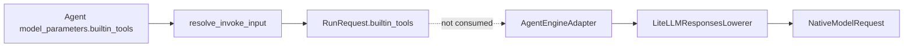
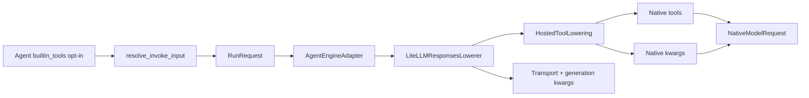

# Provider-hosted Web Search Design

## 1. Problem / Background

Azents Agent resolves model selection snapshot and Agent-local `model_parameters` into runtime `RunRequest`. Catalog capability and Agent form still have selection surface for `web_search` hosted tool, but LiteLLM Responses request lowering path in event runtime does not reflect enabled hosted tools into native request.

Provider-hosted web search is different from client function tool. Provider owns search execution and result grounding, so Azents must declare tool in request and preserve output as canonical provider tool event.

## 2. Goals

1. Agent owner can see model-specific `web_search` capability and opt in per Agent.
2. Runtime lowers `web_search` from Agent `model_parameters.builtin_tools` into LiteLLM Responses native request.
3. Same semantic `web_search` capability is converted into provider/model-developer-specific native activation.
4. Provider tool output is stored as canonical provider tool event without entering client tool execution loop.
5. Model switch / continuation prefers same-target native replay and degrades to assistant text when impossible.

## 3. Non-goals

- Do not turn on Web search by default.
- Do not create Gemini web search-specific subagent execution path.
- Do not create provider-specific citation UI.
- Do not create client-side web search fallback tool.
- Do not verify live web search for every provider with credentials in this PR.

## 4. Requirements

### REQ-1. Agent opt-in setting

Agent uses provider-hosted web search only when `web_search` exists in `model_parameters.builtin_tools`.

Related decisions: ADR-0064-D1, ADR-0064-D2

Acceptance criteria:
- Even if model capability includes `web_search`, web search is not included in native request when Agent setting is empty.
- Agent form shows checkbox only when selected model's `built_in_tools.supported` includes `web_search`.
- Hosted tool selection is reset when model selection changes.

### REQ-2. Native request lowering

LiteLLM Responses lowerer receives model options, client tools, and hosted tools from RunRequest and creates both `NativeModelRequest.tools` and `NativeModelRequest.kwargs`.

Related decisions: ADR-0064-D3

Acceptance criteria:
- OpenAI / ChatGPT OAuth target lowers `web_search` to Responses tool entry.
- Google model developer target lowers to Gemini Google Search tool entry.
- Anthropic model developer target lowers to Anthropic versioned server tool entry.
- If required hosted tool exists on unsupported target, fail before model call.

### REQ-3. Model capability validation

Agent create/update and runtime lowerer validate `web_search` support from selected model snapshot capability.

Related decisions: ADR-0064-D1, ADR-0064-D2, ADR-0064-D5

Acceptance criteria:
- If `web_search` is absent from model capability, Agent create/update returns validation error.
- Gemini web search does not require subagent, shell disabled, or no toolkit.
- Runtime lowerer blocks unsupported hosted tool before model call even for stale Agent snapshot or direct RunRequest.

### REQ-4. Canonical transcript behavior

Provider web search output is stored as provider tool canonical event and degrades to text on model change.

Related decisions: ADR-0064-D4

Acceptance criteria:
- `web_search_call` native output is normalized as `provider_tool_call(name="web_search")`.
- Same target continuation replays compatible `native_artifact`.
- Other target continuation lowers provider tool call/result as assistant text.

## 5. Decision Table

| Decision | Requirements |
| --- | --- |
| ADR-0064-D1 | REQ-1, REQ-3 |
| ADR-0064-D2 | REQ-1, REQ-3 |
| ADR-0064-D3 | REQ-2 |
| ADR-0064-D4 | REQ-4 |
| ADR-0064-D5 | REQ-3 |

## 6. Pre-implementation State



Implementation result:

- `RunRequest.builtin_tools` is consumed by the LiteLLM Responses lowerer.
- generation/transport kwargs are lowered inside `LiteLLMResponsesLowerer`.
- adapter-global `EventEngineAdapterConfig.supported_builtin_tools` and
  `LiteLLMResponsesPostLowerFilter` are removed.
- Gemini-specific exclusive validation is removed for `web_search`.
- Agent form displays normalized hosted tool labels.

## 7. Target Architecture



### 7.1 Lowerer responsibility

`LiteLLMResponsesLowerer` owns the full native request surface:

- transcript input lowering
- client function tool passthrough
- transport kwargs from credentials/provider
- generation kwargs from model parameters
- hosted tool lowering into native `tools` and `kwargs`

The lowerer does not execute tools. It only builds `NativeModelRequest`.

### 7.2 Hosted tool lowering

The first implementation supports only `web_search`.

| Target | Native activation |
| --- | --- |
| OpenAI / ChatGPT OAuth | `tools += [{"type": "web_search"}]` |
| Google model developer | `tools += [{"google_search": {config}}]` |
| Anthropic model developer | `tools += [{"type": "web_search_20250305", "name": "web_search", ...config}]` |
| Fallback unsupported | fail before model call when required |

If a provider later requires request kwargs instead of native tools, the hosted tool lowering result already has a `kwargs` channel.

### 7.3 Validation

Agent create/update validation remains in `core/builtin_tools.py`, but `web_search` no longer applies Gemini exclusive rules. It checks only that selected model capability includes `web_search`.

Runtime lowerer repeats capability validation because Agent snapshots can be stale or tests can construct RunRequest directly.

### 7.4 Transcript lowering

Existing canonical event behavior remains:

- same native target: compatible provider tool native artifact is replayed.
- different target: provider tool call/result is rendered as assistant text.

## 8. API / Data Model

No new API field is required.

Agent request/response keeps the existing shape:

```json
{
  "model_parameters": {
    "builtin_tools": [{ "name": "web_search", "config": {} }]
  }
}
```

Model list response keeps the existing normalized capability:

```json
{
  "normalized_capabilities": {
    "built_in_tools": {
      "supported": ["web_search"]
    }
  }
}
```

## 9. Frontend

Agent form behavior:

- read supported hosted tools from selected model capability.
- display `web_search` as `Web search`.
- default unchecked.
- reset selection when main provider/model changes.
- submit checked tools as existing `builtin_tools: [{ name }]`.

## 10. Rollout / Failure Modes

| Failure mode | Handling |
| --- | --- |
| Catalog marks unsupported model as `web_search` capable | Provider may reject the call; runtime error is surfaced and capability override can remove support. |
| Agent snapshot has `web_search` but current lowerer target does not support it | Lowerer fails before provider call. |
| Provider output shape changes | Raw native event becomes unknown output or provider tool call without result; native artifact remains available for debugging. |
| Model changes mid-conversation | Same target raw replay is used when compatible; otherwise provider tool event lowers to assistant text. |

## 11. Test Strategy

E2E is the product verification source of truth. This PR adds focused backend/frontend tests as implementation checks and records E2E coverage requirements for verification phase.

| Behavior | Primary verification | Supporting checks |
| --- | --- | --- |
| Agent opt-in controls native request | Azents E2E creates Agent with `web_search`, sends chat, inspects fake model request | Lowerer unit tests |
| Capability off means no checkbox / validation failure | Browser E2E or component story fixture with unsupported model | Agent service tests |
| Provider-specific native shape | Fake model adapter captures `NativeModelRequest` for OpenAI/Gemini/Anthropic targets | Lowerer unit tests |
| Canonical provider tool transcript | E2E/fake adapter emits `web_search_call` and history resync sees provider event | Normalizer unit tests |

Fixture/prerequisite requirements:

- deterministic model listing fixture with one OpenAI-like model supporting `web_search`.
- optional live provider credentials for OpenAI/Gemini/Anthropic can be used outside required CI; absence should skip live tests.
- required CI can use fake model adapter/request capture instead of live web search.

Evidence format:

- command line, working directory, commit SHA, pass/fail/skip result.
- captured native request shape for each supported target.
- screenshot or DOM assertion for Agent form checkbox if browser E2E is available.

## 12. QA Checklist

### QA-1. Agent opt-in request lowering

#### What to check

An Agent with `web_search` enabled sends a native request that includes provider-hosted web search, while the same model without opt-in does not.

#### Why it matters

This confirms capability does not automatically change existing Agent behavior and opt-in actually reaches runtime.

#### How to check

Run azents E2E/fake adapter chat flow with deterministic model capability fixture.

#### Expected result

Captured `NativeModelRequest` includes web search only for the opted-in Agent.

#### Execution result

Focused implementation check passed:

```bash
cd python/apps/azents && uv run pytest src/azents/core/builtin_tools_test.py src/azents/engine/events/litellm_responses_test.py src/azents/engine/events/engine_adapter_test.py
```

Result: 87 passed. Full chat E2E/fake adapter flow is still recommended before broad rollout.

#### Fixes applied

- Added lowerer tests for no opt-in, OpenAI, Google, Anthropic, and unsupported capability paths.
- Moved model kwargs lowering into `LiteLLMResponsesLowerer`.

### QA-2. Model capability validation

#### What to check

Agent create/update rejects `web_search` when the selected model capability does not include it.

#### Why it matters

Invalid hosted tool configuration should fail at save time before users hit provider errors.

#### How to check

Run public API E2E or service integration test with unsupported model fixture.

#### Expected result

API returns validation error containing `builtin_tool_errors.web_search`.

#### Execution result

Focused validation check passed through `builtin_tools_test.py` and lowerer unsupported capability tests. Full public API E2E remains pending.

#### Fixes applied

- Removed Gemini exclusive constraints from `WebSearchRule`.
- Repeated capability validation in hosted tool lowerer.

### QA-3. Agent form opt-in UI

#### What to check

Agent form displays `Web search` only for models whose capability includes `web_search`, defaults it off, and resets it on model change.

#### Why it matters

The user-visible opt-in policy depends on UI not enabling provider-hosted tools implicitly.

#### How to check

Run browser E2E or Storybook/component coverage with supported and unsupported model fixtures.

#### Expected result

Supported model shows unchecked `Web search`; unsupported model hides the option; model change clears selected tools.

#### Execution result

Implementation changed Agent form label rendering from raw id to `Web search`.

```bash
cd typescript && pnpm --filter @azents/public-client run generate
cd typescript && pnpm --filter @azents/web run typecheck
cd typescript && pnpm --filter @azents/web exec eslint src/features/agents/components/AgentForm.tsx
cd typescript && pnpm --filter @azents/web exec prettier --check src/features/agents/components/AgentForm.tsx
```

Result: passed. Full browser E2E remains pending.

#### Fixes applied

- Added hosted tool label normalization in `AgentForm`.

### QA-4. Provider tool transcript continuation

#### What to check

Native `web_search_call` output is stored as provider tool event and can be lowered for later turns.

#### Why it matters

Provider-hosted tools must not enter client tool execution loop and must survive model continuation.

#### How to check

Run azents E2E/fake adapter flow or focused normalizer/lowerer tests with `web_search_call` output.

#### Expected result

Transcript contains provider tool event; subsequent request replays compatible native artifact or degrades to assistant text.

#### Execution result

Focused normalizer/lowerer coverage already existed for `web_search_call` degrade behavior and passed in `litellm_responses_test.py`. Full E2E/fake adapter transcript verification remains pending.

#### Fixes applied

- Preserved provider tool canonical event behavior; this PR changes request lowering, not transcript schema.
