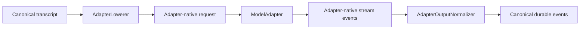

# Provider Tool Live Activity Design

## 1. Problem

Provider-hosted tools execute as part of a provider-owned model stream. Azents currently normalizes their durable call or result only after the model response reaches a successful completion boundary. When Web search or another hosted tool takes several seconds, the chat timeline shows only general model activity and users cannot distinguish active provider work from a slow response.

The current transports do not share native stream types. OpenAI API-key and ChatGPT OAuth use official OpenAI SDK events, while other providers use LiteLLM Responses events. Future adapters may use additional native SDKs. Product behavior must not depend on one transport's event classes or status vocabulary.

## 2. Goals

1. Display observed provider-hosted tool activity before the complete model response is available.
2. Use one provider-neutral projection contract across every adapter output normalizer.
3. Preserve adapter ownership of native event parsing and identity normalization.
4. Restore running activity through the existing `/live` and WebSocket resync surfaces.
5. Replace live activity with durable provider-tool history without duplication or disappearance.
6. Remove attempt-local provider activity on failure, retry, Stop, and terminal cleanup.
7. Keep provider-hosted tools separate from Azents-executed client-tool lifecycle and recovery.

## 3. Non-goals

- Do not infer tool execution from Agent configuration, request tools, elapsed time, or model capability.
- Do not add provider-specific WebSocket actions, REST fields, or frontend components.
- Do not make every provider expose progress when its transport supplies only final output.
- Do not add provider-tool cancellation, retry, or execution ownership to Azents.
- Do not add provider-specific citation rendering.
- Do not persist native progress events or incomplete provider-tool calls in transcript history.

## 4. Existing Behavior

The adapter pipeline is generic over native request and native stream event types:

`AdapterOutputNormalizer` currently emits a weak `StreamProjection` record whose `type` string selects assistant text, reasoning, or client function-call deltas. Provider-tool native events are accumulated until response completion and then normalized into durable `provider_tool_call` or `provider_tool_result` events.

`LiveEventProjector` stores streaming assistant and reasoning projections in Redis. PostgreSQL-backed active client tools are projected separately from `agent_runs.active_tool_calls`. The frontend already renders `provider_tool_call` live events and merges provider call/result pairs by `call_id`, but no backend path currently produces an in-progress live provider-tool event.

## 5. Design Principles

- Canonical live meaning is independent from provider wire shape.
- Adapter-specific event knowledge remains inside the matching output normalizer.
- Shared lifecycle rules are implemented once.
- Live activity is attempt-local and non-durable.
- Durable history wins over matching live projection.
- Missing progress data remains missing rather than guessed.
- Client-tool and provider-tool execution authorities remain separate.

## 6. Canonical Stream Projection Model

Replace the open `StreamProjection` model with a discriminated union of immutable projection models:

- `ContentDeltaProjection`
- `ReasoningDeltaProjection`
- `ClientToolCallDeltaProjection`
- `ProviderToolActivityProjection`

`ProviderToolActivityProjection` contains:

| Field | Type | Meaning |
| --- | --- | --- |
| `call_id` | non-empty string | Stable identity normalized by the adapter. |
| `name` | non-empty string | Azents semantic hosted-tool name such as `web_search`. |
| `status` | `running`, `completed`, `failed` | Provider-neutral current lifecycle state. |
| `arguments` | string or null | Canonical JSON-string input when reliably available. |

Native stages map to canonical state inside each adapter:

| Native meaning | Canonical status |
| --- | --- |
| added, queued, pending, in-progress, searching, generating, interpreting | `running` |
| completed, done, succeeded | `completed` |
| failed, error | `failed` |

The engine and frontend do not receive native stage names.

## 7. Shared Provider Tool Activity Accumulator

Each output stream owns one `ProviderToolActivityAccumulator`. Adapter-specific extraction produces a `ProviderToolObservation` with the same fields as the canonical activity projection.

The accumulator:

- stores the latest snapshot per `call_id`;
- suppresses duplicate snapshots;
- enriches an existing call when arguments become available later;
- prevents terminal `completed` or `failed` state from regressing to `running`;
- supports multiple concurrent or sequential provider calls in one model response;
- returns a projection only when the public snapshot changed.

The accumulator does not know provider event types, Redis, Session state, or frontend messages.

## 8. Adapter Integration

### 8.1 OpenAI Responses normalizer

The OpenAI normalizer extracts observations from official SDK output-item and provider-tool lifecycle events. SDK classes and wire discriminators remain confined to `openai_responses.py`.

### 8.2 LiteLLM Responses normalizer

The LiteLLM normalizer extracts observations from LiteLLM Responses event wrappers and completed/added output items. It uses the same semantic names and canonical status mapping.

LiteLLM may not preserve progress for every underlying provider. In that case the normalizer emits no running observation and continues to produce final durable events at response completion.

### 8.3 Future adapters

A future adapter participates by:

1. extracting zero or more provider-tool observations from its native stream;
2. passing observations through the common accumulator;
3. continuing to normalize completed output into canonical durable events.

No engine, live-state, transport, or frontend changes are required for another provider.

## 9. Engine Event Boundary

The engine converts `ProviderToolActivityProjection` to an internal ephemeral `ProviderToolActivityChanged` event. This event is included in the internal `EngineEvent` union and broker serialization but is not a public WebSocket control frame.

The event carries the full current snapshot:

| Field | Meaning |
| --- | --- |
| `call_id` | Stable provider-call identity. |
| `name` | Semantic hosted-tool name. |
| `status` | Canonical lifecycle state. |
| `arguments` | Optional canonical JSON string. |

`WorkerEventPublisher` routes it through `LiveEventProjector` like other internal runtime telemetry.

## 10. Live Event Projection

`LiveEventProjector` converts the engine activity into a non-durable Event:

- kind: `provider_tool_call`;
- deterministic ID: hash of Session, `provider-tool`, and `call_id`;
- external ID: `call_id`;
- adapter/native format: `azents-live` live projection;
- payload: call ID, semantic name, canonical status, and optional arguments.

The Event is upserted into `LiveEventStore` and broadcast with `live_event_upserted`. The existing `/live.partial_history.items` surface restores it after reload or reconnection.

## 11. Canonical Provider Tool Payload

Extend `ProviderToolCallPayload` with nullable canonical status:

- `running`
- `completed`
- `failed`
- null when the provider supplies no reliable state

Live calls normally carry `running`. Completed durable output carries the terminal status when it is present in normalized provider output. The field is semantic and provider-neutral; native status strings stay only in the opaque native artifact.

`ProviderToolResultPayload.status` remains unchanged. A call status describes provider-owned invocation lifecycle, while a result status describes a separate normalized result item when one exists.

## 12. Durable Handoff

A matching durable provider-tool call or result removes the live call projection by `call_id`.

Ordering remains:

1. commit durable event;
2. publish `history_event_appended`;
3. remove matching live projection;
4. publish `live_event_removed`.

Frontend semantic identity continues to use `call_id`, so durable history replaces live state without duplicate cards or temporary disappearance.

## 13. Failure, Retry, and Stop

Provider-tool activity is model-attempt-local state. `discard_failed_attempt()` removes live projections with:

- adapter `azents-live`; and
- kind `assistant_message`, `reasoning`, or `provider_tool_call`.

Cleanup happens before retry state publication. A new retry therefore cannot inherit a previous attempt's tool card.

Session terminal cleanup, Run replacement, and User Stop continue to clear remaining Session live state through the existing projector lifecycle.

## 14. Run State and Recovery

Provider-hosted tools do not change Run phase. The Run remains in `streaming_model` while provider activity is visible.

Provider activities are not written to `agent_runs.active_tool_calls` because that field is the execution and recovery authority for Azents client tools. Worker recovery retries or finalizes the model attempt; it never independently resumes or cancels a provider-hosted call.

## 15. Frontend Behavior

The existing generic `ProviderToolCallCard` remains the only UI component. It receives the canonical status and semantic name regardless of provider.

Initial presentation:

- `running`: active indicator and semantic activity label;
- `completed`: completed state while final assistant output may still stream;
- `failed`: failed state;
- null/unknown: existing neutral fallback for historical events without status.

`web_search` may display a friendly semantic label such as “Searching the web,” but the UI must not branch on provider identity.

## 16. API and Storage Impact

- No database migration is required.
- Event JSON payload adds an optional `status` property for provider-tool calls.
- Existing history rows without status remain valid.
- `/history`, `/live`, and WebSocket action envelopes remain unchanged.
- Generated public clients require regeneration only if the OpenAPI event payload schema changes.

## 17. Security and Privacy

- Activity arguments are included only when the adapter can produce a bounded canonical JSON string.
- Native provider event bodies are not copied into live payloads.
- Credentials, response IDs, provider metadata, citations, and raw search results are not exposed through activity projection.
- Existing output and event-size limits continue to apply to durable provider results.

## 18. Rollout

1. Introduce the typed projection union and common accumulator.
2. Add engine/live-store lifecycle support.
3. Integrate every current output normalizer.
4. Update frontend status handling and stories.
5. Validate OpenAI and LiteLLM fixtures, resync, retry cleanup, and durable handoff.
6. Promote current behavior to Living Specs.

A provider without progress events silently retains final-output-only behavior.

## 19. Test Strategy

### E2E primary validation matrix

| Scenario | Expected user-visible behavior |
| --- | --- |
| Provider emits running then completed activity before assistant text | One provider-tool card appears immediately, updates terminal state, and remains until durable handoff. |
| Multiple provider calls occur in one response | Each call has an independent card keyed by call ID. |
| Duplicate or regressive native lifecycle events arrive | No duplicate card and no terminal-to-running regression. |
| Model attempt fails and retries | Previous attempt's provider activity disappears before retry UI and does not return. |
| User stops during provider activity | Live provider activity is removed with terminal Session cleanup. |
| Browser reconnects during activity | `/live` restores the same card without duplication. |
| Durable call/result arrives | Durable history replaces the live card without disappearance. |
| Provider supplies only final output | No guessed running card; durable behavior remains unchanged. |

### E2E plan

Use the deterministic model fixture or fake adapter stream to emit provider-neutral lifecycle observations before response completion. Browser E2E should pause the stream after the running observation, assert the visible card, then release completion and assert durable replacement. A retry fixture should fail after activity emission and assert cleanup before the next attempt.

### Fixture and prerequisite support

The deterministic adapter needs scripted native stream sequences for both current adapter families. No live provider credential is required for CI because lifecycle and handoff correctness are Azents behavior. Optional live OpenAI or other-provider checks may be run manually but must not gate required CI.

Fixture snapshots must include:

- adapter family;
- native event sequence;
- stable call identity;
- expected canonical activity snapshots;
- terminal completed output.

### Supporting tests

- accumulator unit tests for deduplication, enrichment, and monotonic status;
- normalizer tests for OpenAI SDK and LiteLLM event extraction;
- engine serialization and projection conversion tests;
- live-store and projector tests for upsert, resync, retry discard, and durable removal;
- frontend reducer tests for live-to-durable replacement;
- Storybook states for running, completed, failed, and unknown provider calls.

### Evidence format

Record command, working directory, commit SHA, pass/fail result, and any skipped optional live checks. Browser evidence should identify the fixture scenario and include DOM assertions or screenshots for running and durable states.

### CI policy

Required CI uses deterministic fixtures only and must fail on missing expected lifecycle observations, duplicate cards, stale retry activity, or durable/live handoff regression. Optional live-provider checks skip when credentials are absent and fail when credentials are present but the asserted provider behavior changes.

## 20. Alternatives Considered

### Provider-specific live events

Rejected because native event classes would escape the adapter boundary and every provider would require engine, API, and UI changes.

### Reuse client active tool calls

Rejected because provider-hosted tools are not executed, cancelled, retried, or recovered by the client-tool executor.

### Infer activity from configured hosted tools

Rejected because an available tool may not be invoked by the model.

### Persist incomplete calls

Rejected because failed model attempts and retries would leave incomplete durable history.

## 21. Open Questions

None. The approved direction is provider-neutral projection with adapter-specific extraction and shared lifecycle accumulation.
