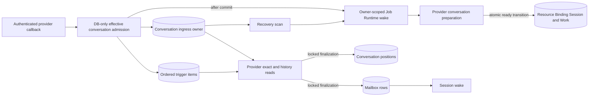

# Durable External Channel Conversation Provisioning Design

- Snapshot: `provisioning-260810`
- Document reference: `provisioning-260810/DESIGN`
- Requirements:
  [`provisioning-260810/REQ`](../requirements/provisioning-260810-durable-external-channel-conversation.md)
- Decisions:
  [`provisioning-260810/ADR`](../adr/provisioning-260810-durable-external-channel-conversation.md)
- Mode: Collaborative
- Decision owner: Requester
- Delivery shape: One focused pull request

## Summary

The active External Channel ingress queue becomes conversation-bound rather than
Session-keyed. An authenticated callback resolves the effective configured target
conversation entirely from PostgreSQL state, creates or reuses one active queue owner
for that target Resource, appends one independently deduplicated content-free trigger,
and acknowledges after the transaction commits. The owner may initially have no
Binding or AgentSession.

The first item wakes one owner-scoped drain immediately; there is no time or count
accumulation window. While the owner lacks a Session, the drain prepares the provider
conversation once for the owner. Discord per-thread preparation reconciles or creates
the actual Discord thread through the adopted public SDK and records its delivery
identity. Slack threads and parent-channel targets require no equivalent creation
mutation. Only after the provider conversation is usable does one transaction create
or reuse the target Resource, Binding, AgentSession, initial Channel Work, and control
plans, then record the resulting Binding and Session on the same owner.

The retained items never move to a second queue. Once the owner has a Session, the
existing ordered claim, provider-history, cursor, independent mailbox-row, retry-tail,
and Session-wake lifecycle processes its items. Source conversation identity remains
item-specific, so several physical Discord threads can feed one `location=channel`
parent owner while retaining independent provider-history positions.

## Current Behavior and Requirement Gaps

The current queue is described by
[External Channel Provider Ingress](../spec/flow/external-channel-provider-ingress.md)
and the implemented `channel-260810` snapshot. It has these relevant properties:

- `external_channel_ingress_sessions` is keyed by a non-null AgentSession ID;
- every item repeats non-null Session, Binding, Resource, and conversation-position
  identities;
- callback admission succeeds only when the exact source thread Resource already has a
  connected Binding and active Session;
- admission does not resolve a configured parent-channel Binding for a physical source
  thread in `location=channel` mode;
- if the configured target Resource exists without a Binding, or must first be created,
  admission returns to synchronous ingestion;
- synchronous ingestion can perform provider exact/history I/O and create the Session
  under the provider callback deadline; and
- Discord thread creation currently occurs lazily in outbound delivery after a Session
  and Binding may already exist.

These boundaries leave four gaps:

1. a configured first trigger has no durable queue identity before provider I/O;
2. several callbacks that will share one future Session have no common durable owner;
3. Discord may expose a Session before its required provider thread is usable; and
4. source-thread traffic in `location=channel` can miss the effective parent Binding and
   fall back to the synchronous path.

The existing provider-history, cursor, mailbox, batching, bounded item retry, and wake
mechanisms remain reusable after a Session is recorded on the owner.

## Requirement and Decision Traceability

| Authority | Design mechanisms | Verification |
| --- | --- | --- |
| `provisioning-260810/REQ-1` | DB-only effective-target resolution, owner/item admission transaction, owner-scoped wake and recovery | callback deadline E2E with blocked provider SDK; process-loss recovery |
| `provisioning-260810/REQ-2` | provider-conversation preparation phase before Binding/Session transaction; Discord reconcile-before-create policy | existing-thread reuse, uncertain-create reconciliation, thread-before-Session assertions |
| `provisioning-260810/REQ-3` | one active owner per effective target Resource, owner row locking, idempotent item insertion, unique connected Binding | concurrent callback and concurrent worker PostgreSQL tests |
| `provisioning-260810/REQ-4` | exact Binding fast path plus participation-derived target resolution for `channel` and `threads` | per-connection and source-thread fan-in regression matrix |
| `provisioning-260810/REQ-5` | same owner retains items across provisioning; atomic owner Session recording; existing final mailbox transaction | crash-boundary tests before and after Session creation |
| `provisioning-260810/REQ-6` | owner-level bounded preparation retry, item-level existing retry, sanitized logs, active-row deletion | retry, exhaustion, age, redaction, and unrelated-owner isolation tests |
| `provisioning-260810/ADR-D2` | exhausted owner and retained items are logged and removed; no durable terminal queue | repository and recovery tests |
| `provisioning-260810/ADR-D3` | generalized conversation owner with nullable resulting Session; no queue-to-queue handoff | migration, admission, and full lifecycle E2E |

## Architecture and Ownership

PostgreSQL owns active owner identity, trigger idempotency and ordering, lease fencing,
provider-preparation retry state, the resulting Binding/Session identity, item retry
state, and recovery discovery. Provider APIs own whether an external conversation
exists and is usable. Existing conversation positions own canonical provider-history
ordering. Mailbox rows own accepted Session input and wake recovery. Local Job Runtime
submission is a best-effort wake and never becomes durable authority.

## Effective Conversation Resolution

### Source and target identities

Every callback has two independently represented conversation identities:

- **source conversation**: the physical provider conversation from which provider
  history must be read for this trigger; retained on the item through its locator,
  source Resource, and conversation position; and
- **effective target conversation**: the Resource whose Binding and AgentSession receive
  the canonical messages; retained on the owner.

They are equal for exact thread conversations and `location=threads`. They differ when
a physical thread callback is configured to participate in `location=channel`: the item
keeps the thread source while the owner targets the parent-channel Resource.

### Resolution order

Admission locks the current connection and resolves one of these closed outcomes
without provider I/O:

1. **Exact connected Binding** — reuse its Resource, route, Binding, and active Session.
2. **Configured `location=channel`** — resolve the active participation setting and
   route, then create or reuse the parent-channel Resource as the effective target.
3. **Configured `location=threads`** — create or reuse the exact source/root thread
   Resource as the effective target. A Discord root message may still require a provider
   delivery thread; an already received Discord thread carries its usable delivery
   identity.
4. **Selected setup or allowed access replay** — retain the existing immutable replay
   authority and target Resource. These replay callers may use the same owner admission
   only after their current selection or access checks succeed.
5. **Unconfigured, unselected, access-pending, blocked, non-invoking, or otherwise
   ineligible traffic** — retain the existing setup/access/ignore outcome and do not
   create a provisioning owner.

Exact Binding selection is always connection-scoped. Participation selection must match
the active route and setting generation for the same connection and provider parent
channel. No source Resource or Binding from another connection may satisfy resolution.

### Stable owner identity

The target Resource is created or reused in the callback transaction before owner
admission. One active owner is uniquely identified by that target Resource. Resource
uniqueness already includes connection, Resource type, and provider resource key, so
this provides a stable connection-scoped effective-conversation key without a timing or
batch-size heuristic.

The owner also freezes the route, participation-setting identity and generation when
applicable, response mode for a future Binding, and provider-preparation projection.
A callback may append only when those immutable target fields still match. If an active
owner is stale under current route or participation authority, admission applies the
same bounded stale-authority terminal policy before establishing a new current owner;
it does not append new traffic to an obsolete future Binding.

## Persistence Model

### Conversation ingress owner

The current Session-keyed owner is replaced by a conversation owner containing:

- immutable owner ID and target Resource ID;
- connection, provider, tenant, route, and optional participation setting/generation;
- concrete response mode to use if a Binding must be created;
- provider-specific content-free preparation projection;
- nullable resulting Binding and AgentSession IDs, constrained to be both null or both
  present and compatible with the target Resource and route;
- provider-preparation attempt count and next-attempt time;
- current lease owner, generation, acquisition, and expiration;
- first-batch flag and current processing-batch fence; and
- creation/update timestamps.

There is at most one active owner for one target Resource. A ready owner has a connected
Binding and active AgentSession. A provisioning owner has neither. The row is removed
when it has no active items, including after bounded owner-level failure.

The owner retains no provider credentials, message bodies, raw callbacks, interaction
tokens, signatures, or private URLs.

### Ingress item

Each item references the owner rather than repeating queue ownership through a Session
foreign key. It retains:

- immutable item ID, active deduplication key, provider event identity, and monotonically
  ordered queue key;
- the existing connection/configuration/ingress authority snapshot;
- physical source scope and provider trigger locator;
- source Resource and conversation-position IDs;
- principal, invocation, and initial-title identities; and
- the existing pending, processing, retry-waiting, attempt, due-time, batch, and
  processing-fence state.

Binding and Session are read from the locked owner during processing rather than copied
onto every item. This prevents items admitted before provisioning from requiring
placeholder identities and guarantees that all items under one owner use the same
resulting Binding and Session.

The owner target Resource and item source Resource are intentionally separate. This is
required for source-thread fan-in under `location=channel`.

### Constraints and indexes

Persistence enforces:

- unique active owner target Resource;
- unique active item `(owner_id, deduplication_key)` identity;
- unique queue key;
- source conversation scope shape (`parent_channel` has no thread key; `thread` has one);
- provider-preparation and item attempt bounds;
- valid lease and processing-batch shapes;
- all-null or all-present owner Binding/Session identity; and
- owner/item connection compatibility through repository validation and available
  composite foreign keys where the existing schema supports them.

## Callback Admission Transaction

For an authenticated original message trigger, the callback performs only bounded
normalization and PostgreSQL work:

1. lock and validate current connection and ingress authority;
2. resolve the exact route, participation setting, response mode, and effective target;
3. apply invocation/response-mode, principal, block, and currently decidable access
   checks;
4. create or reuse the physical source Resource and its conversation position;
5. create or reuse the effective target Resource;
6. create or lock the one matching conversation owner, pre-populated with an existing
   Binding/Session when they are current;
7. insert or reuse one item by active deduplication identity; and
8. commit before returning an acknowledgeable outcome.

After commit, admission submits an owner-scoped execution key built from the immutable
owner ID and owner creation timestamp. Submission failure is logged safely; recovery
will resubmit the active owner.

No provider login, exact-message fetch, history fetch, provider mutation, mailbox
write, Session wake, AgentRun, or control delivery occurs before provider
acknowledgement. A duplicate callback returns duplicate only after the existing active
item and compatible owner have been observed under lock.

Owner empty deletion and callback insertion serialize on the same owner/target Resource
boundary. A concurrent callback either appends before the empty check or recreates a new
owner after deletion; it cannot commit an orphan item.

## Owner Drain Lifecycle

### Lease and recovery

The existing lease becomes owner-scoped. The producer recovery loop lists bounded due
owners whose lease is absent or expired and whose provider preparation or item work is
due. It submits owner execution keys without claiming durable work.

A worker conditionally acquires the owner lease. Reclaim resets interrupted item batches
to pending and clears the previous batch fence. Only the current lease generation may
prepare a provider conversation, record a Session, claim items, finalize a batch, or
release the lease.

### Provider conversation preparation

If the locked owner has no Binding/Session, the worker runs one provider preparation
attempt outside a database transaction:

- **Discord thread target without a delivery thread** — fetch/reconcile an existing
  thread from the root message, create it only when absent, and reconcile once more after
  an indeterminate create result. The adopted public SDK client supplies the operation.
- **Discord target with a retained delivery thread** — validate the retained typed
  identity and perform no creation mutation.
- **Discord parent-channel target** — use the existing parent-channel identity and
  perform no thread mutation.
- **Slack thread or parent target** — use the provider identity already present in the
  authenticated locator and perform no Discord-style mutation.

The preparation result contains only the usable provider conversation identity and safe
failure classification. Provider credentials remain request-local to the worker.
Provider content is not read during this phase.

### Atomic ready transition

After preparation succeeds, one short transaction:

1. re-locks the owner under the same lease generation;
2. revalidates connection, route, participation setting, Resource, block/access replay
   authority where applicable, and provider preparation result;
3. records the usable Discord delivery thread on the Resource when needed;
4. reuses a compatible connected Binding and active Session if another valid path
   already established them;
5. otherwise creates one root AgentSession, connected Binding, active Channel Work, and
   current idempotent joined-presence/initial-progress control plans;
6. records the Binding and Session IDs on the owner; and
7. commits without moving or rewriting retained items.

The Resource unique identity, one-connected-Binding constraint, owner row lock, and
idempotent Session/Binding creation path prevent duplicate committed conversations. A
losing concurrent attempt re-reads and reuses the committed Binding/Session rather than
exposing another Session.

Provider thread creation and DB Session creation cannot be one distributed transaction.
If the process terminates after provider success but before DB commit, retry reconciles
the provider thread and repeats the idempotent ready transaction. It never deletes the
provider thread as rollback.

### Item batching after readiness

An owner cannot claim history items until it has a current Binding and active Session.
After readiness, the existing batching contract continues:

- first claim in the owner lifecycle: one due item;
- later claims: at most ten due items;
- queue-key order is authoritative;
- retry-waiting items do not block later due items; and
- callbacks arriving during preparation or a processing batch remain later items on the
  same owner.

Provider history uses each item's physical source scope and conversation position.
Mailbox projection uses the owner's target Resource, Binding, and Session. Same-batch
cursor views, active-trigger correlation, cursor compare-and-set, retry-tail movement,
bounded item deletion, independent mailbox rows, and one post-commit Session wake retain
the `channel-260810` behavior.

## Concurrency and Ordering

Admission serializes on the target Resource and owner. Concurrent callbacks for the same
future conversation therefore create at most one owner and append independently
ordered items. UUIDv7 queue keys preserve PostgreSQL receipt order without predicting
how many messages will arrive or delaying the first one.

Provider preparation is owner-level, not item-level. One leased worker performs it once
per owner attempt while callbacks may continue appending. Preparation failure does not
increment individual provider-history attempts.

Once ready, all items observe the same owner Binding and Session. Items retain separate
source positions, so `location=channel` can safely interleave several source threads
while each source cursor is advanced only by its own canonical provider-history result.
The final transaction locks affected positions deterministically and retains the
existing stale-cursor coordination retry.

## Failure, Retry, and Recovery

### Owner-level preparation failures

Provider preparation and ready-transition failures use the accepted bounded lifecycle:

- retryable results update only the owner's preparation attempt and due time, release the
  lease, and retain every item unchanged;
- attempt or age exhaustion, excessive provider retry delay, stale route/setting/access
  authority, terminal provider classification, unavailable Agent, or incompatible
  existing Binding emits one sanitized structured failure log and deletes the owner and
  its retained items;
- no failed, completed, dead-letter, or operator-retry owner remains; and
- a later provider redelivery or eligible callback may establish a new owner and retry
  budget when no current Binding/Session exists.

The concrete attempt count, age budget, and backoff may reuse the current ingress item
limits unless implementation evidence requires a smaller equivalent bound. They remain
validated code constants, not new runtime configuration.

### Item-level failures

After readiness, the existing item-level provider-history retry and bounded deletion
policy remains unchanged. A failed item does not revert or remove the established
Binding or Session. Queue-empty finalization deletes only the transient owner; the
Resource, Binding, Session, Channel Work, positions, and mailbox state retain their
existing lifecycle ownership.

### Lost wake and process termination

A failed or lost Job Runtime submission leaves the owner discoverable. Startup and
periodic producer scans submit due owners. Lease expiry recovers an interrupted provider
preparation or item batch. A process loss after the ready transaction but before the
next claim finds the Session recorded and proceeds directly to item processing. A
process loss after mailbox commit remains covered by the existing mailbox wake recovery.

## Provider Interfaces

A provider-neutral conversation preparation policy accepts the locked owner's safe
projection plus an operation deadline and returns one of:

- ready with a validated provider conversation result;
- retryable with a safe category and optional bounded retry delay; or
- terminal with a safe category.

The policy does not create Resources, Bindings, Sessions, mailbox rows, or queue state.
The drain service owns all PostgreSQL transitions. Discord reuses the existing
`DiscordDeliveryClient.ensure_thread` behavior or an extracted equivalent public-SDK
operation. Slack returns its existing thread or parent identity without a mutation.

Provider exact/history policies remain item-oriented and run only after the owner is
ready.

## Setup and Access Compatibility

This snapshot does not make ordinary unconfigured mentions silently create Sessions.
Setup-required, selector-required, access-pending, blocked, and denied paths retain
their existing authorities and user-visible outcomes.

A selected setup or allowed access continuation remains in its current synchronous
replay lifecycle because it is not a provider acknowledgement boundary. Before that
replay creates a new Discord per-thread Session, it invokes the same provider
conversation preparation policy outside the Session-creation transaction. Its existing
durable replay boundary makes interruption retryable, and a retry reconciles the
provider thread before repeating the existing idempotent Resource/Binding/Session
transaction. It does not create a second durable queue.

Existing connected Sessions always bypass provider conversation preparation. Settings
changes do not reroute already admitted items to another Agent; stale authority
terminalizes the obsolete owner according to the accepted failure policy.

## Security and Privacy

- Transport authentication and Discord lease fencing remain before admission.
- Connection, route, setting, Resource, Binding, Session, principal, grant, and block
  ownership is revalidated under PostgreSQL locks at the relevant transition.
- Provider credentials are decrypted only in the worker operation that needs them and
  are never persisted in owner/item projections.
- Durable owner/item state remains content-free and excludes raw callbacks, message
  bodies, attachment bytes, signatures, interaction tokens, private URLs, and raw
  provider errors.
- Diagnostics expose only bounded row IDs, provider kind, connection ID, lifecycle
  state, attempt counts, age, and sanitized category.

## Migration, Rollout, and Rollback

### Schema migration

A new forward migration transforms the active queue in place without modifying the
already executed `b53dacd10814` migration:

1. introduce the conversation-owner schema with an independent owner ID, target
   Resource/route identity, nullable Binding/Session result, preparation state, and the
   existing lease/batch fields;
2. create one ready owner for every current Session-keyed ingress row;
3. backfill each item with its owner ID and source Resource identity while preserving
   item ID, queue key, state, attempt count, due time, processing fence, and timestamps;
4. replace Session-keyed item uniqueness and foreign keys with owner-keyed constraints;
5. validate all backfilled owners as ready and compatible with their existing
   Resource/Binding/Session; and
6. remove obsolete Session-keyed owner/item columns or rename the tables and models to
   their conversation-owner meaning.

Migration must abort rather than guess if one current Session owner contains items with
incompatible target Resources or Bindings. Repository inspection indicates the current
admission path creates one Session owner from one connected Binding, so this is expected
to be a validation guard rather than a normal split path.

### Application rollout

The change ships as one focused PR containing schema, models, repositories, services,
provider policy, diagnostics, tests, and Specs. The database migration deploys with the
application version that reads the generalized schema; no mixed old/new queue writer
mode or compatibility fallback is added.

Existing ready owners continue directly into their current item drain. New
provisioning owners use the new preparation phase. No feature flag or second runtime
mode is introduced.

### Rollback

Application rollback across the migration is not supported while unresolved owners
without Sessions exist, because the old code cannot represent them. Operational
rollback is forward-fix: stop new producers, preserve PostgreSQL state, deploy corrected
new-schema code, and let recovery resume. The migration downgrade is suitable only when
all remaining owners are ready and its validation can restore the old non-null
Session-keyed shape without loss.

## Observability and Operations

Existing active queue diagnostics are generalized from Session counts to owner counts
and add:

- owner readiness (`provisioning` or `ready`);
- nullable Session ID;
- preparation attempt count and next-attempt time;
- owner age and item backlog count; and
- sanitized last active failure category only in logs/metrics, not retained terminal
  state.

Metrics distinguish owner admission, duplicate item admission, provider-conversation
preparation attempts/results, Session creation/reuse, item claims, history retries,
bounded owner/item failures, cursor suppression, mailbox rows, recovery submission, and
wake attempts.

Logs never include message bodies, provider user labels, credentials, private URLs, raw
provider exceptions, or Discord interaction tokens. Operator inspection remains
bounded and read-only.

## Test Strategy

### E2E primary verification matrix

| Scenario | Expected evidence |
| --- | --- |
| Discord first root message, configured `threads` | callback acknowledges before blocked SDK preparation; one actual thread precedes one Binding/Session; original message reaches mailbox |
| Discord existing inbound thread, configured `threads` | existing delivery thread is reused; no duplicate thread; one owner/Binding/Session |
| Discord parent or source-thread message, configured `channel` | parent Resource owner is selected; no thread creation; physical source history reaches parent Session |
| Several callbacks before Session creation | every callback commits one item immediately; one owner and one Session; mailbox order matches durable receipt/cursor rules |
| Existing Session | owner starts ready and performs no provider-conversation preparation |
| Two connections with identical provider channel/thread values | distinct owners, Bindings, and Sessions; no cross-connection reuse |
| Provider preparation timeout/rate limit/process loss | callback remains acknowledged; owner/items survive and recover; no premature Session |
| Indeterminate Discord create | retry reconciles existing thread before any second creation |
| Owner preparation exhaustion | one sanitized failure log; owner/items removed; unrelated owner proceeds |
| Process loss after Session commit | same owner resumes item processing without duplicate Binding/Session |

The E2E fake providers must support a controllable Discord ensure-thread operation,
blocking/retry/indeterminate outcomes, operation counters, and assertion that no
exact/history call occurred before callback acknowledgement. PostgreSQL fixture queries
provide owner/item/Resource/Binding/Session ordering evidence. Live-provider tests are
optional diagnostics only and must fail as skipped when credentials or provider
prerequisites are absent; deterministic fake-provider E2E is required in CI.

### Repository and service tests

PostgreSQL-backed repository tests cover concurrent owner creation, item deduplication,
append during preparation, queue-empty insertion races, lease reclaim, owner-level
retry, migration invariants, and ready-owner compatibility. Service tests cover closed
effective-target resolution, response mode, access/block checks, `channel` fan-in,
`threads` separation, provider policy mapping, ready transition, and sanitized failure
logging.

Existing queue tests continue to verify first-one/later-ten claims, same-batch cursor
semantics, retry-tail behavior, active correlation, atomic mailbox finalization, lost
wake recovery, and diagnostics with owner IDs replacing Session ownership where
necessary.

### Quality and acceptance gates

The focused PR must pass Python formatting/linting, configured type checking, focused
unit/repository tests, External Channel E2E, migration upgrade/downgrade validation where
safe, documentation validation, Spec review, pre-commit hooks, and GitHub CI. No test may
silently skip deterministic queue or fake-provider coverage.

## Removal and Replacement

| Existing unit or behavior | Removal authority | Replacement or remaining authority | Removal boundary | Absence verification |
| --- | --- | --- | --- | --- |
| Session-keyed `external_channel_ingress_sessions` identity | `provisioning-260810/ADR-D3` | conversation owner keyed independently from nullable resulting Session | forward migration and repository/model replacement | schema inspection finds no owner PK/FK requiring Session |
| Item-level required Session and Binding ownership | `provisioning-260810/ADR-D3` | owner-level Binding/Session result plus item `owner_id` | migration, typed contracts, finalization path | grep/schema tests find no pre-provision item constructor requiring Session/Binding |
| Exact-source-Binding-only callback admission | `provisioning-260810/REQ-4` | effective target resolution for exact, `channel`, and `threads` modes | admission service replacement | regression tests prove source-thread parent fan-in and first configured admission |
| Synchronous configured-first-message provider I/O fallback | `provisioning-260810/REQ-1` | durable owner/item commit then worker provider work | transport admission and ingestion routing | callback E2E blocks provider SDK and still acknowledges after DB commit |
| Discord lazy thread creation after Session exposure | `provisioning-260810/REQ-2` | worker preparation before ready transition; outbound delivery reuses retained thread | provider preparation and delivery reuse path | operation-order assertions and no duplicate ensure-thread mutation |
| Session-scoped Job Runtime execution key and recovery scan | `provisioning-260810/ADR-D3` | owner-scoped execution key and due-owner scan | job payload, handler, recovery service | tests and search find no ingress job payload keyed only by Session |
| Session-only active queue diagnostics | `provisioning-260810/REQ-6` | owner readiness and nullable Session diagnostics | repository/CLI projection | diagnostic contract tests |
| Existing provider-history, cursor, mailbox, item retry, and wake lifecycle | None; retained | `channel-260810` Requirements, ADR, Design, and current Specs | unchanged after owner readiness | focused regression suite remains green |
| Existing setup, selection, access, block, and response-mode product behavior | None; retained | current External Channel Specs and `provisioning-260810/REQ` non-goals | only internal admission/preparation integration may change | setup/access E2E remains behaviorally identical |

## Design Authority

- Design revision: `1`

| ID | Material design mechanism | Authority | Classification |
| --- | --- | --- | --- |
| `M1` | One PostgreSQL conversation owner retains all active triggers before and after Session creation | `provisioning-260810/REQ-1`, `REQ-3`, `REQ-5`; `provisioning-260810/ADR-D3` | `decided` |
| `M2` | Target Resource identifies the connection-scoped effective conversation; items separately retain physical source conversation identity | `provisioning-260810/REQ-3`, `REQ-4`; current Resource and conversation-position Specs | `derived` |
| `M3` | Callback admission commits owner/item state before acknowledgement and performs no provider or Session execution work | `provisioning-260810/REQ-1`; current transport authentication constraints | `required` |
| `M4` | Provider conversation preparation completes before the ready transaction creates or records a new Binding/Session | `provisioning-260810/REQ-2`; `provisioning-260810/ADR-D3` | `required` |
| `M5` | Provider preparation is owner-level while provider history, cursor, mailbox, and item retry remain item-level after readiness | `provisioning-260810/REQ-3`, `REQ-5`; `provisioning-260810/ADR-D3`; `channel-260810` authority | `derived` |
| `M6` | Exhausted or terminal provisioning logs a sanitized outcome and removes the active owner and items without durable terminal state | `provisioning-260810/REQ-6`; `provisioning-260810/ADR-D2` | `decided` |
| `M7` | Existing queue rows migrate in place to ready conversation owners without changing item order or retry state | `provisioning-260810/REQ-4`, `REQ-5`; `provisioning-260810/ADR-D3` | `derived` |
| `M8` | Recovery and Job Runtime coalescing use owner lifecycle identity rather than Session identity | `provisioning-260810/REQ-1`, `REQ-5`; `provisioning-260810/ADR-D3`; current Job Runtime constraint | `derived` |
| `M9` | Work ships as one focused PR with no compatibility mode, second queue, or feature flag | requester delivery constraint; `provisioning-260810/ADR-D3`; project compatibility policy | `required` |

## Authority Audit

- Every numbered Requirement maps to at least one mechanism and deterministic
  verification path.
- Every material mechanism is authorized by the confirmed Requirements, accepted D2/D3,
  retained `channel-260810` behavior, or the requester's single-PR delivery constraint.
- The Design introduces no second durable queue, placeholder Session, provider-content
  store, durable wake row, terminal queue, compatibility mode, or new product behavior.
- Source/target separation is necessary to satisfy both configured parent fan-in and
  source-specific provider-history authority; it does not introduce a new routing mode.
- Removal of Session-keyed queue identity and synchronous configured-first-message
  fallback is directly authorized by D3 and REQ-1/REQ-4.
- Existing setup/access behavior, provider-history authority, cursor ordering, mailbox
  input, and wake recovery remain authoritative.

Authority result: **pass for Design revision 1**.

## Feasibility Validation

| Area | Result | Repository evidence |
| --- | --- | --- |
| Effective target resolution | Feasible | participation settings already expose route, `channel`/`threads`, parent identity, and response mode; Resource creation is idempotent and connection-scoped |
| Conversation owner uniqueness | Feasible | Resource has unique `(connection_id, resource_type, provider_resource_key)` and Binding has one connected row per Resource |
| Session-late queue items | Feasible | current item provider locator, source position, principal, ordering, retry, and authority fields are independent of mailbox content; Binding/Session reads can move to owner finalization |
| Discord thread-before-Session | Feasible | `DiscordDeliveryClient.ensure_thread` already reconciles, creates through public SDK, and reconciles after create failure; Resource labels already retain delivery channel identity |
| Atomic ready transition | Feasible | root Session, Binding, Channel Work, and control-intent creation already run in one SQLAlchemy transaction in the ingestion store |
| Existing drain reuse | Feasible | history preparation is already outside DB transactions and final mailbox/cursor/queue transitions are atomic; only owner lookup and readiness gate change |
| Concurrent callback convergence | Feasible | PostgreSQL unique Resource/owner constraints plus row locks and existing connected-Binding uniqueness provide deterministic serialization |
| Migration | Feasible | all current owner/item rows have non-null Resource, Binding, and Session IDs; they can be backfilled as ready owners while preserving queue keys and processing state |
| Recovery | Feasible | current producer scan and lease reclaim are domain-row based and can substitute owner ID for Session ID without a new runtime backend |
| Deterministic verification | Feasible | existing Slack/Discord provider fakes, PostgreSQL repository tests, and External Channel E2E cover the affected boundaries; fake ensure-thread controls require extension |

No confirmed Requirement or accepted ADR is blocked. The migration requires a strict
precondition check for incompatible existing rows, and synchronous replay must call the
same preparation policy before Session creation, but both are local implementation
constraints with credible paths and no new material decision.

Feasibility result: **feasible for Design revision 1**.

## Assumptions and Non-Blocking Risks

- Existing active Session-keyed owners are internally compatible with one target
  Resource/Binding each; migration validates rather than assumes this.
- Discord provider thread creation is externally irreversible by the DB transaction.
  Reconciliation, not automatic deletion, is the approved recovery behavior.
- A configuration change can terminalize retained work whose immutable routing authority
  is stale. Sanitized logging and later provider redelivery are the accepted outcome;
  retained triggers are never silently rerouted.
- Owner-level preparation adds another retry phase before item history attempts. Metrics
  must distinguish them so operator diagnosis remains clear.
- No persistent SDK client cache is required. Per-operation login latency moves outside
  callback acknowledgement and remains a throughput optimization opportunity.

## Design Approval

- Mode: `Collaborative`
- Decision owner: Requester
- Approved on: `2026-08-10`
- Approved Design revision: `1`
- Approved authority IDs: `M1`, `M2`, `M3`, `M4`, `M5`, `M6`, `M7`, `M8`, `M9`
- Approved scope: Generalize the existing ingress queue into one conversation-bound
  owner that durably retains every eligible trigger, prepares any required provider
  conversation before creating or recording its Binding and AgentSession, then processes
  the retained items through the existing history, cursor, mailbox, and wake lifecycle;
  deliver the complete change as one focused pull request.
