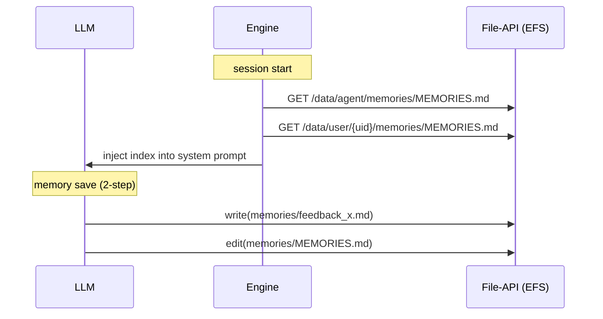
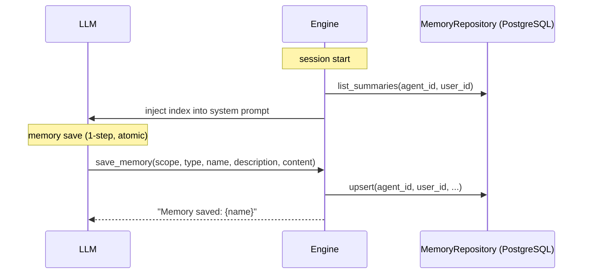
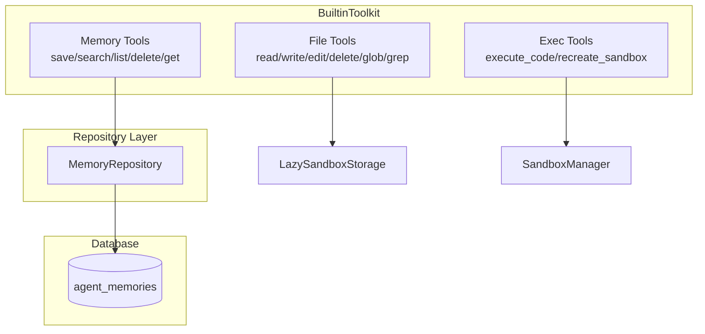

# Memory Redesign: Filesystem → DB + Tool Call

## Overview

Current Memory system stores markdown files in EFS filesystem, and model directly manipulates them with existing file tools (write/edit/read/delete).

Switch this to PostgreSQL DB based + dedicated tool calls to:

1. **Resolve concurrency issue** — when multiple sessions of same agent modify MEMORIES.md concurrently, last-write-wins can lose data
2. **First step toward removing EFS dependency** — prerequisite for SDK Workspace introduction (Discussion #3011)
3. **Atomicity of 2-step save** — currently file write + index edit are separate, creating orphan files if intermediate failure occurs

### User scenario

Agent's experience of storing/querying/deleting information learned during conversation remains same, but uses dedicated memory tools instead of file tools:

```
[Before]
Agent: write("/data/agent/memories/feedback_no_mock.md", content="---\n...")
Agent: edit("/data/agent/memories/MEMORIES.md", old_string="...", new_string="...")

[After]
Agent: save_memory(scope="agent", type="feedback", name="no-mock", description="...", content="...")
```

## Discussion Points and Decisions

### 1. DB schema: single table vs separate tables

**Options:**

A) **Single `agent_memories` table** — agent-level when `user_id = NULL`, user-level when non-null
B) **Separate tables** — `agent_memories` + `user_memories` respectively

**Decision: A (single table)**

Single table can query agent/user scopes together, and because schema is identical, there is no technical reason to separate. Distinguishing scope with `user_id` NULL semantics is sufficient.

This direction was already agreed in Discussion #3011 Comment 1.

### 2. Memory Tool implementation location: embedded in BuiltinToolkit vs separate Toolkit

**Options:**

A) **Add memory tools to BuiltinToolkit** — next to existing file tools
B) **Separate MemoryToolkit** — split as ToolkitType.MEMORY

**Decision: A (embedded in BuiltinToolkit)**

Memory is default feature of every agent and already controlled by `memory_enabled` flag in BuiltinToolkit. If split into separate toolkit, ToolkitConfig + AgentToolkit records are needed; memory is default feature without config, so this is over-abstracted.

Replace existing `collect_memory_prompt()` with DB query and add new memory tools to tools list in `update_context()`.

### 3. Search method: SQL LIKE vs PostgreSQL FTS vs pgvector

**Options:**

A) **SQL LIKE** — `WHERE name ILIKE '%keyword%' OR description ILIKE '%keyword%'`
B) **PostgreSQL Full-Text Search** — `tsvector`/`tsquery` index
C) **pgvector** — semantic search based on vector embeddings

**Decision: A (SQL LIKE) — Phase 1**

Current memory scale is under 50 per agent, and full index text is injected into system prompt. Search is auxiliary, so LIKE is sufficient.

BM25/FTS5 keyword search is considered enough step before vector search.

**Evolution path:**
```
Phase 1 (this issue)  Phase 2               Phase 3
SQL LIKE              PostgreSQL FTS         pgvector
full index injection  keyword search boost   semantic search
0~50 memories         50~200                 200+
```

Trigger: review Phase 2 when agent memory exceeds 50+ or cases occur where relevant memory is missed.

### 4. Memory content storage format: structured fields vs markdown raw text

**Options:**

A) **Structured fields** — store name, description, type, content in separate columns
B) **Markdown raw text** — store YAML frontmatter + body in one text column

**Decision: A (structured fields)**

To benefit from DB storage, type filtering and description-based search must be directly possible with SQL. Storing markdown raw text requires parsing and is no different from filesystem method.

### 5. Migration strategy: dual-write vs bulk cutover

**Options:**

A) **Dual-write period** — write both file + DB for some time, then remove file
B) **Bulk migration script + code deployment** — migrate existing data then immediately cut over

**Decision: B (bulk cutover)**

Memory is data managed autonomously by agent, and if migration fails, agent can accumulate again (not critical data). Dual-write complexity (consistency guarantee, rollback path) has no matching benefit.

**Execution order:**
1. Create DB table (Alembic migration)
2. Run migration script (existing EFS → DB)
3. Deploy new code (tool call method)
4. Preserve existing memory files for some time, then remove

### 6. Phase 2 automatic consolidation: include in this issue or not

**Options:**

A) **Include** — implement lesson extraction on session end + periodic consolidation together
B) **Separate issue** — this issue focuses on storage migration; consolidation follows later

**Decision: B (separate issue)**

Phase 2 consolidation is separate feature requiring LLM calls and independent from storage migration. This clarifies scope of this issue.

### 7. Scope specification in tool calls: explicit scope parameter vs automatic inference

**Options:**

A) **Explicit scope parameter** — `save_memory(scope="agent", ...)` or `save_memory(scope="user", ...)`
B) **Automatic inference** — rule-based, e.g., type `user` → user scope, `reference` → agent scope

**Decision: A (explicit scope)**

In existing Memory Rules, `feedback` and `project` are stored in agent or user scope depending on situation. There are cases where automatic inference is impossible, so model should decide explicitly.

However, prompt provides guidance for scope selection.

## Architecture

### Before (filesystem)



### After (DB + Tool Call)



### Component structure



## Data Model

### DB table: `agent_memories`

| Column | Type | Nullable | Default | Description |
|--------|------|----------|---------|-------------|
| `id` | `VARCHAR(32)` | NO | `uuid7().hex` | PK |
| `agent_id` | `VARCHAR(32)` | NO | — | FK → agents.id (CASCADE) |
| `user_id` | `VARCHAR(32)` | YES | NULL | NULL = agent scope, non-null = user scope |
| `scope` | `ENUM('agent', 'user')` | NO | — | explicit scope distinction (query convenience) |
| `type` | `ENUM('user', 'feedback', 'project', 'reference')` | NO | — | memory type |
| `name` | `VARCHAR(255)` | NO | — | memory identifier (unique in scope) |
| `description` | `TEXT` | NO | — | one-line summary (shown in index) |
| `content` | `TEXT` | NO | — | memory body (markdown) |
| `created_at` | `TIMESTAMPTZ` | NO | `now()` | creation time |
| `updated_at` | `TIMESTAMPTZ` | NO | `now()` | update time |

### Constraints

```sql
-- agent scope: (agent_id, name) unique where user_id IS NULL
CREATE UNIQUE INDEX uq_agent_memories_agent_scope
    ON agent_memories (agent_id, name) WHERE user_id IS NULL;

-- user scope: (agent_id, user_id, name) unique where user_id IS NOT NULL
CREATE UNIQUE INDEX uq_agent_memories_user_scope
    ON agent_memories (agent_id, user_id, name) WHERE user_id IS NOT NULL;

-- for index injection: agent scope query
CREATE INDEX ix_agent_memories_agent_id
    ON agent_memories (agent_id) WHERE user_id IS NULL;

-- for index injection: user scope query
CREATE INDEX ix_agent_memories_agent_user
    ON agent_memories (agent_id, user_id) WHERE user_id IS NOT NULL;
```

### Rationale for partial unique index

Single `(agent_id, user_id, name)` unique constraint cannot prevent duplicate names in agent scope because `NULL != NULL` when `user_id = NULL`. PostgreSQL partial unique index guarantees scope-specific uniqueness.

### Domain Model (Pydantic)

```python
class MemoryScope(enum.StrEnum):
    AGENT = "agent"
    USER = "user"

class MemoryType(enum.StrEnum):
    USER = "user"
    FEEDBACK = "feedback"
    PROJECT = "project"
    REFERENCE = "reference"

class Memory(BaseModel):
    id: str
    agent_id: str
    user_id: str | None
    scope: MemoryScope
    type: MemoryType
    name: str
    description: str
    content: str
    created_at: datetime
    updated_at: datetime

class MemoryCreate(BaseModel):
    scope: MemoryScope
    type: MemoryType
    name: str
    description: str
    content: str

class MemorySummary(BaseModel):
    """Lightweight model for index injection."""
    name: str
    type: MemoryType
    description: str
```

## Tool Implementation

### Tool list

| Tool | Description | Background |
|------|-------------|------------|
| `save_memory` | save memory (upsert by scope + name) | No |
| `list_memories` | list memories by scope (optional type filter) | No |
| `get_memory` | get individual memory detail | No |
| `search_memories` | keyword search (name + description + content) | No |
| `delete_memory` | delete memory | No |

### Tool input schema

```python
class SaveMemoryInput(BaseModel):
    scope: MemoryScope = Field(description=(
        "Where to save. 'agent' for team-wide knowledge (shared with all users), "
        "'user' for personal preference (only this user)."
    ))
    type: MemoryType = Field(description=(
        "Memory type: 'user' (role/expertise), 'feedback' (behavioral rules), "
        "'project' (ongoing work), 'reference' (external system pointers)."
    ))
    name: str = Field(description="Memory identifier. Used for upsert — same name overwrites.")
    description: str = Field(description="One-line summary. Always loaded in context for relevance judgment.")
    content: str = Field(description="Memory body in markdown.")

class ListMemoriesInput(BaseModel):
    scope: MemoryScope | None = Field(
        default=None, description="Filter by scope. None = both scopes."
    )
    type: MemoryType | None = Field(
        default=None, description="Filter by type. None = all types."
    )

class GetMemoryInput(BaseModel):
    scope: MemoryScope = Field(description="Memory scope.")
    name: str = Field(description="Memory name to retrieve.")

class SearchMemoriesInput(BaseModel):
    query: str = Field(description="Keyword to search in name, description, and content.")
    scope: MemoryScope | None = Field(
        default=None, description="Filter by scope. None = both scopes."
    )

class DeleteMemoryInput(BaseModel):
    scope: MemoryScope = Field(description="Memory scope.")
    name: str = Field(description="Memory name to delete.")
```

### Tool return examples

**save_memory:**
```json
{"status": "saved", "name": "no-mock", "scope": "agent", "type": "feedback"}
```

**list_memories:**
```
## Agent Memories

### Feedback
- **no-mock** — Don't mock DB in integration tests
- **terse-response** — Skip trailing summaries

### Reference
- **infra-topology** — EKS 3 clusters: prod-main, prod-gpu, staging

## User Memories

### User
- **profile** — Senior backend engineer, Go/Python
```

**get_memory:**
```
# no-mock (feedback, agent scope)

Don't mock the database in integration tests — use real DB instead.

**Why:** Last quarter, mocked tests passed but the prod migration failed.

**When to apply:** Writing or reviewing integration tests that touch the database.

---
Created: 2026-03-22 | Updated: 2026-04-10
```

**search_memories:**
```
Found 2 memories matching "integration test":

1. [agent/feedback] **no-mock** — Don't mock DB in integration tests
2. [agent/project] **test-migration** — Integration test suite migration to pytest
```

**delete_memory:**
```json
{"status": "deleted", "name": "no-mock", "scope": "agent"}
```

### DI chain: inject MemoryRepository + SessionManager

Existing `update_context()` is called per-turn, but has no `AsyncSession`. Follow `SlackToolkit`'s `SessionManager` pattern:

```
BuiltinToolkitProvider.__init__(session_manager)
  → resolve() → BuiltinToolkit(session_manager=session_manager)
    → update_context()
      → async with self._session_manager() as session:
          collect_memory_prompt(repo, session, agent_id, user_id)
          make_*_memory_tool(repo, session_manager, agent_id, user_id)
```

**Files changed:**

| File | Change |
|------|------|
| `engine/tools/deps.py` | add `session_manager` parameter to `get_builtin_toolkit_provider()` |
| `engine/tools/shell.py` | store `session_manager` in `BuiltinToolkitProvider.__init__` |
| `engine/tools/shell.py` | store `session_manager` in `BuiltinToolkit.__init__` |
| `engine/tools/shell.py` | use `async with self._session_manager()` in `update_context()` |

`MemoryRepository` is stateless, so instance creation cost is negligible. One index injection at session start + session creation per tool call is sufficient.

### Tool implementation pattern

Use existing `make_tool()` factory:

```python
# engine/tools/memory.py

def make_save_memory_tool(
    repo: MemoryRepository,
    agent_id: str,
    user_id: str | None,
    session_manager: SessionManager,
) -> FunctionTool:
    async def save_memory(args: SaveMemoryInput) -> str:
        """Save or update a memory. Same name in the same scope overwrites."""
        effective_user_id = user_id if args.scope == MemoryScope.USER else None
        if args.scope == MemoryScope.USER and not user_id:
            raise FunctionToolError("Cannot save user-scope memory: no user context")

        async with session_manager() as session:
            await repo.upsert(
                session,
                agent_id=agent_id,
                user_id=effective_user_id,
                create=MemoryCreate(
                    scope=args.scope,
                    type=args.type,
                    name=args.name,
                    description=args.description,
                    content=args.content,
                ),
            )
        return json.dumps({
            "status": "saved",
            "name": args.name,
            "scope": args.scope.value,
            "type": args.type.value,
        })

    return make_tool(save_memory)
```

### Memory index injection change

Replace `collect_memory_prompt()` with DB query based implementation:

```python
async def collect_memory_prompt(
    repo: MemoryRepository,
    session: AsyncSession,
    agent_id: str,
    user_id: str,
) -> str:
    """Query memory summaries from DB and build prompt string."""
    parts: list[str] = [
        "## Memories", "",
        "You have a persistent memory system. Memories persist across conversations.", "",
    ]

    agent_summaries = await repo.list_summaries(
        session, agent_id=agent_id, user_id=None,
    )
    user_summaries: list[MemorySummary] = []
    if user_id:
        user_summaries = await repo.list_summaries(
            session, agent_id=agent_id, user_id=user_id,
        )

    if agent_summaries:
        parts.extend(["### Agent Memories (shared with all users)", ""])
        parts.extend(_format_summaries(agent_summaries))
        parts.append("")

    if user_summaries:
        parts.extend(["### Your Memories about this User", ""])
        parts.extend(_format_summaries(user_summaries))
        parts.append("")

    parts.append(_MEMORY_RULES_PROMPT)
    return "\n".join(parts)


def _format_summaries(summaries: list[MemorySummary]) -> list[str]:
    """Group by type and create text similar to existing MEMORIES.md format."""
    by_type: dict[MemoryType, list[MemorySummary]] = {}
    for s in summaries:
        by_type.setdefault(s.type, []).append(s)

    lines: list[str] = []
    for mem_type in MemoryType:
        group = by_type.get(mem_type)
        if not group:
            continue
        lines.append(f"#### {mem_type.value.title()}")
        for m in group:
            lines.append(f"- **{m.name}** — {m.description}")
        lines.append("")
    return lines
```

### Memory Rules prompt change

Change existing file-tool based rules to tool-call based rules:

```python
_MEMORY_RULES_PROMPT = dedent("""\
    ### Memory Rules

    You have a persistent memory system with dedicated tools.
    Use `save_memory` to store, `list_memories` / `get_memory` / `search_memories`
    to retrieve, and `delete_memory` to remove.

    #### Types of memory

    **user** — User's role, expertise, preferences.
    - Scope: Always `user`.
    - Example: user says "I'm a product manager" → save_memory(scope="user", type="user", ...)

    **feedback** — Behavioral corrections AND confirmations.
    - Scope: Personal preference → `user`. Team rule → `agent`.
    - Body: Lead with the rule, then **Why:** and **When to apply:** lines.

    **project** — Ongoing work, decisions, deadlines.
    - Scope: Team context → `agent`. Personal work → `user`.
    - Convert relative dates to absolute dates.

    **reference** — Pointers to external systems.
    - Scope: Almost always `agent`.

    #### What NOT to save

    - Code patterns, architecture, file paths — read from code directly
    - Git history — use git log/blame
    - Ephemeral task details only useful in this conversation

    #### Scope selection

    - `agent` scope: shared with ALL users of this agent. Only save universally applicable knowledge.
    - `user` scope: only this specific user. Save personal preferences and context.

    #### Conflict resolution

    When agent and user memories conflict, follow user memory.

    #### Stale memories

    Verify memory claims against current state before acting. If stale, update or delete silently.""")
```

## Repository Implementation

### MemoryRepository

```python
class MemoryRepository:
    async def upsert(
        self,
        session: AsyncSession,
        *,
        agent_id: str,
        user_id: str | None,
        create: MemoryCreate,
    ) -> Memory:
        """Upsert by scope + name. update if exists, insert otherwise."""

    async def get_by_name(
        self,
        session: AsyncSession,
        *,
        agent_id: str,
        user_id: str | None,
        name: str,
    ) -> Memory | None:
        """Fetch one by scope + name."""

    async def list_summaries(
        self,
        session: AsyncSession,
        *,
        agent_id: str,
        user_id: str | None,
        type: MemoryType | None = None,
    ) -> list[MemorySummary]:
        """Lightweight list for index injection. type filter supported."""

    async def search(
        self,
        session: AsyncSession,
        *,
        agent_id: str,
        user_id: str | None,
        query: str,
    ) -> list[MemorySummary]:
        """Keyword ILIKE search (name, description, content)."""

    async def delete_by_name(
        self,
        session: AsyncSession,
        *,
        agent_id: str,
        user_id: str | None,
        name: str,
    ) -> bool:
        """Delete. True if existed, False otherwise."""

    async def count(
        self,
        session: AsyncSession,
        *,
        agent_id: str,
        user_id: str | None = None,
    ) -> int:
        """Count memories. Alternative for index truncation."""
```

### Index size limit

Keep existing 100-line limit from MEMORIES.md in DB too. Limit `list_summaries()` return count to 100 and add cleanup guidance to prompt when exceeded:

```python
_MAX_MEMORY_SUMMARIES = 100

if len(summaries) >= _MAX_MEMORY_SUMMARIES:
    parts.append(
        f"(Showing {_MAX_MEMORY_SUMMARIES} memories. "
        "Consider cleaning up old memories with delete_memory.)"
    )
```

## API

This change **does not affect public API**.

Memory is agent's internal tool and is not exposed as external API. Cases where admin needs to query/manage memory are reviewed in follow-up issue.

## Frontend (UI/UX)

This change **does not affect frontend**.

Only agent tool call changes from file tools to memory tools; user-visible conversation UI remains same.

## Infra

No change. Add table to existing PostgreSQL instance.

## Feasibility Verification

| Verification item | Status | Result |
|-----------|------|------|
| PostgreSQL partial unique index | ✅ | supported by PostgreSQL 9.5+, current version sufficient |
| inject DB session into make_tool | ✅ | session_factory can be captured by closure (same as existing LazySandboxStorage pattern) |
| inject repo into BuiltinToolkit | ✅ | possible in BuiltinToolkitProvider.resolve() DI |
| ILIKE performance (under 50) | ✅ | full scan negligible |
| existing test compatibility | ✅ | `collect_memory_prompt` signature changes → existing tests need update |

### Risks

| Risk | Impact | Mitigation |
|--------|------|------|
| data loss during migration | medium | dry-run mode + verification report in migration script |
| model fails to use new tool properly | medium | write detailed prompt rules + QA in testenv |
| attempts to access memory path with existing file tools | low | after memory path removed, inaccessible with file tools |
| DB transaction failure delays agent response | low | return tool error → agent retries or skips |

## testenv QA Scenarios

### Scenario 1: basic CRUD

```python
# seed
user = seed.auth.create_user()
ws = seed.workspace.create(user)
agent = seed.agent.create(ws, memory_enabled=True)

# save_memory
events = live.chat.collect(agent, user, "Remember that I'm a backend engineer")
assert has_function_call(events, "save_memory")
assert function_call_args(events, "save_memory")["scope"] == "user"
assert function_call_args(events, "save_memory")["type"] == "user"

# list_memories (in new session)
events = live.chat.collect(agent, user, "What do you know about me?")
# confirm index injection in system prompt
assert "backend engineer" in get_system_prompt(events)
```

### Scenario 2: Agent vs User scope isolation

```python
user_a = seed.auth.create_user()
user_b = seed.auth.create_user()
agent = seed.agent.create(ws, memory_enabled=True)

# user_a saves agent scope
live.chat.collect(agent, user_a, "Our team always uses pytest. Remember this for everyone.")

# confirm agent memory in user_b session
events = live.chat.collect(agent, user_b, "What testing framework should I use?")
assert "pytest" in get_system_prompt(events)

# user_a saves user scope
live.chat.collect(agent, user_a, "I prefer verbose output. Remember this just for me.")

# must not be visible to user_b
events = live.chat.collect(agent, user_b, "list your memories")
assert "verbose output" not in str(events)
```

### Scenario 3: Memory disabled

```python
agent = seed.agent.create(ws, memory_enabled=False)
events = live.chat.collect(agent, user, "Remember that I'm a designer")
assert not has_function_call(events, "save_memory")
assert "Memory Rules" not in get_system_prompt(events)
```

## testenv Impact

| Item | Impact |
|------|------|
| New seed block | unnecessary — use existing `seed.agent.create(memory_enabled=True)` |
| New scenario | needed — memory CRUD + scope isolation scenario |
| Existing scenario breakage | none — memory not directly tested in existing scenarios |
| docker-compose | no change — use existing PostgreSQL |
| .env.example | no change |
| preflight check | no change |

## Migration Script

### File → DB migration

```python
async def migrate_memories(
    file_client: FileApiClient,
    repo: MemoryRepository,
    session: AsyncSession,
    *,
    dry_run: bool = False,
) -> MigrationReport:
    """Migrate existing EFS memory files to DB.

    1. Query list of agents with memory_enabled=True from agents table
    2. Scan each agent's /data/agent/memories/ directory
    3. Parse YAML frontmatter of each .md file → DB insert
    4. Scan user-specific /data/user/{uid}/memories/ directory for each agent
    5. Parse same way → DB insert

    If dry_run=True, only parse and do not write to DB.
    """
```

### Migration report

```
Migration Report
================
Agents scanned: 15
Agent memories migrated: 42
User memories migrated: 18
Skipped (parse error): 3
  - agent abc123: feedback_old.md (missing frontmatter)
  - agent def456: project_.md (empty name)
  - user ghi789/user_profile.md (invalid type)
```

## Implementation Plan

### Phase 1: DB infra (PR 1)

- `RDBAgentMemory` model (`rdb/models/memory.py`)
- Alembic migration (table + indexes)
- `MemoryRepository` (`repos/memory/`)
- Domain models (`repos/memory/data.py`)
- Unit tests

### Phase 2: Memory Tools (PR 2)

- `make_save_memory_tool`, `make_list_memories_tool`, `make_get_memory_tool`, `make_search_memories_tool`, `make_delete_memory_tool` (`engine/tools/memory.py`)
- DB query version of `collect_memory_prompt()`
- Tool call version of `_MEMORY_RULES_PROMPT`
- Modify `BuiltinToolkit.update_context()` — add memory tools, inject DB session
- Unit tests + update existing `memory_prompt_test.py`

### Phase 3: Integration + Migration (PR 3)

- Migration script
- Modify `BuiltinToolkitProvider` DI (inject MemoryRepository)
- Add testenv QA scenario
- E2E tests

## Alternatives Considered

### A. S3 + distributed lock

Reviewed in Discussion #3011. Store in S3 but implement distributed lock with DynamoDB etc.

**Rejected because:** no benefit relative to infra complexity. PostgreSQL already exists, and DB transactions can simply resolve concurrency.

### B. Redis/Valkey cache layer

Cache memory query in Redis to reduce DB load.

**Rejected because:** caching unnecessary at current scale (under 50 per agent). Index injection happens once at session start, so load is extremely low.

### C. Keep file tools + add lock to MEMORIES.md

Keep existing file structure while resolving concurrency with S3 conditional PUT, etc.

**Rejected because:** File-API does not support conditional PUT, and this goes opposite direction from EFS dependency removal goal.

### D. Separate Memory microservice

Split dedicated service for Memory.

**Rejected because:** service split is over-abstracted at current scale. Adding table to existing NoIntern PostgreSQL is simplest.
