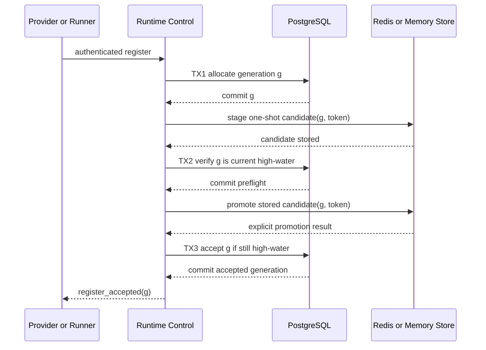

# Ephemeral Redis Coordination Authority Design

- Snapshot: `redis-260907`
- Document reference: `redis-260907/DESIGN`
- Requirements: [Ephemeral Redis Coordination Authority Requirements](../requirements/redis-260907-ephemeral-coordination-authority.md) (`redis-260907/REQ`)
- Decisions: [Ephemeral Redis Coordination Authority](../adr/redis-260907-ephemeral-coordination-authority.md) (`redis-260907/ADR`)
- Design mode: Autonomous
- Design revision: `2`

## Summary

Redis remains the distributed live-routing and bounded-operation store, but it no longer allocates or preserves Provider and Runner connection generations. PostgreSQL owns one durable per-subject generation row. Registration crosses the two stores through committed database transactions and one-shot volatile Redis candidates; no external call occurs inside a database transaction.

The migration gives only Provider and Runtime subjects that already exist at cutover a `2^48` floor sized for the single Home legacy deployment. Subjects created after migration start at generation one. PostgreSQL, Python, and protobuf retain integer generations through the positive signed `BIGINT` domain; Redis stores connection generations as canonical fixed-width decimal strings, while public/browser JSON uses canonical unpadded decimal strings and TypeScript treats them as opaque values. Runtime Control performs a strict non-rolling cutover into new Redis schemas, so legacy counters, numeric records, connections, streams, operations, metrics, and consumer groups are never read as new state.

All other Redis-backed features retain their existing ownership. Empty Redis loses in-flight coordination, fails it closed, and permits reconnect or reconciliation from PostgreSQL and existing object-storage authority. Provider enrollment rate limiting intentionally starts a fresh best-effort window.

## Current Behavior and Requirement Gaps

### Runtime connection authority

`RedisRuntimeCoordinationStore.register_connection()` currently increments a persistent subject-scoped Redis counter and installs the current connection in one Lua operation. The in-memory implementation owns an equivalent process-local counter. This makes retained coordination-store state the only generation issuer.

Provider accepted generations are subsequently recorded in `runtime_provider_connections`, but Runner registration has no equivalent durable history. `agent_runtimes.runner_generation` advances only after a later Runner state report. Rebuilding a counter from durable maxima can therefore miss a generation already returned to a Runner.

### Cross-store registration

Provider registration currently installs Redis current state before recording durable authenticated connection history. Runner registration has no durable acceptance boundary. There is no publication state that can distinguish a stale delayed publisher from a valid publisher after Redis is replaced empty.

### Rollout and namespace

Runtime Control defaults to two replicas. Its Kubernetes Deployment has no explicit replacement strategy, so normal image changes roll old and new replicas together. The Runtime Control entrypoint also upgrades the database before serving. The Redis Runtime coordination namespace is unversioned, and legacy generation keys do not expire.

### Other Redis-backed capabilities

Broker signals and ownership leases, Runtime operations and transfers, interactive Terminals, live projections, conversation locks, system metrics, and enrollment rate limits are already volatile. Durable Session, run, mailbox, Runtime, Provider, External Channel, Scheduled Task, result, and file metadata remain outside Redis. The missing design obligation is to make their empty-store outcomes explicit, test them, and remove deployment signals that imply Valkey retention is required.

## Requirement and Decision Traceability

| Requirement | Design mechanisms |
| --- | --- |
| `redis-260907/REQ-1` | Durable generation authority, reset-safe candidate publication, new namespace, empty-store recovery matrix |
| `redis-260907/REQ-2` | Per-subject high-water rows, acceptance CAS, legacy-safe migration floor, exact-generation fencing |
| `redis-260907/REQ-3` | One-shot publication, uncertain-outcome failure, no old-stream replay, existing durable reconciliation |
| `redis-260907/REQ-4` | PostgreSQL authority map, retained object-storage boundaries, Redis-only live routing |
| `redis-260907/REQ-5` | Explicit best-effort enrollment rate-limit reset semantics |
| `redis-260907/REQ-6` | Ephemeral reference Valkey configuration and operator contract |
| `redis-260907/REQ-7` | Living Spec and operator-document synchronization |
| `redis-260907/REQ-8` | Migration, registration-race, empty-store, fail-closed, and deployment verification |
| `redis-260907/ADR-D1` | Common durable generation relation |
| `redis-260907/ADR-D2` | One-shot Redis candidate plus DB-only preflight and acceptance transactions |
| `redis-260907/ADR-D3` | Existing-subject Home-bounded seed, new-subject generation one, strict namespace cutover |
| `redis-260907/ADR-D4` | Canonical string representation for Redis-internal and public/browser JSON connection generations |

## Architecture and Ownership

### Durable generation authority

A new PostgreSQL relation stores one row per connection subject:

- connection kind: the closed Provider or Runner kind;
- subject ID: Provider resource ID for Provider connections or Agent Runtime ID for Runner connections;
- allocated high-water generation;
- latest durably accepted generation; and
- ordinary creation and update timestamps.

The primary key is `(connection_kind, subject_id)`. The generation columns use PostgreSQL signed `BIGINT` and enforce:

```text
0 <= accepted_generation <= high_water_generation <= 9223372036854775807
```

The database uses signed `BIGINT`. The protobuf remains `uint64`, and the allocator intentionally uses its positive signed 64-bit subset. JSON precision is preserved through the string boundaries defined by ADR-D4.

The relation has no polymorphic foreign key. Existing authentication and registration services prove subject existence before allocation. The row is never deleted as a consequence of connection expiry, disconnect, Provider disablement, Runtime stop, Runtime removal, or related lifecycle cleanup. Provider and Runtime IDs are generated immutable identities; a later object receives a different identity and therefore a different high-water row.

`high_water_generation` records issued values, including abandoned publication attempts. `accepted_generation` records the latest registration that passed the final durable acceptance transaction. Neither field is a current live-connection record or a replacement for `agent_runtimes.provider_generation`, `agent_runtimes.runner_generation`, or Provider connection history.

### Volatile coordination authority

Redis continues to own only current connection routing and bounded generation-scoped operation transport. The in-memory adapter retains equivalent observable behavior for standalone and test use. Neither adapter allocates generations.

The coordination interface is divided into explicit operations:

1. stage a complete connection candidate for an externally allocated generation;
2. promote that exact candidate into the current connection record;
3. read, heartbeat, and revoke the current generation;
4. perform existing generation-fenced operation and stream mutations.

Candidate records use a generation- and publication-token-specific key and a short TTL. They are never returned by `get_connection()` and are never used for routing. Promotion must read and consume the stored candidate; a caller cannot recreate a missing candidate from arguments.

### Registration orchestration

A registration coordinator composes the durable generation repository, volatile coordination store, and existing Provider/Runner authentication persistence. It owns transaction boundaries explicitly. Repository methods receive a database session, while Redis calls occur only when no session transaction is active.

Provider and Runner protocol clients continue receiving the same positive numeric `generation` in the current protobuf response. They do not supply or choose it.

## Registration State Machine

The following sequence applies independently to each Provider or Runner subject.



### Phase 1: allocate

After existing identity, protocol, capability, configuration, and credential checks, a short database-only transaction locks the existing subject generation row, increments `high_water_generation`, and returns `g`. A missing row is an allocator integrity failure; allocation does not infer subject age or lazily create authority state. It rejects allocation at `2^63 - 1` rather than wrapping, resetting, changing representation, or reusing authority.

A failed or committed-but-abandoned allocation creates only a gap. Gaps are valid and never repaired downward.

### Phase 2: stage candidate

Outside every database transaction, Runtime Control writes the full proposed current-connection record to a candidate key containing the connection kind, subject, generation, and an unguessable publication token. The candidate TTL is bounded by the registration attempt deadline and is materially shorter than an accepted current-connection lease.

A timeout or ambiguous Redis result is not treated as success. Runtime Control does not retry the same stage or later publish from call arguments. It fails the stream; a reconnect allocates a new generation.

### Phase 3: durable preflight

A second short database-only transaction verifies that the subject row still has `high_water_generation == g`. If another registration has allocated a higher generation, the candidate is stale and cannot proceed. Candidate cleanup occurs only after the transaction ends.

This preflight reduces transient routing replacement by candidates that were already stale before promotion. The final acceptance transaction remains authoritative for races after preflight.

### Phase 4: volatile promotion

Outside the preflight transaction, one atomic store operation:

- loads the exact candidate key;
- rejects a missing, expired, malformed, or token-mismatched candidate;
- reads the current connection when present;
- rejects promotion when the current generation is higher;
- installs the candidate as the current connection with the normal connection TTL; and
- consumes the candidate key.

Redis implements this as one Lua operation. The in-memory implementation performs the same transition under its process-local lock.

The operation is one-shot. An uncertain promotion outcome is not replayed as success. The connection record may exist until TTL even though the client never received acceptance; it carries no usable client authority because the generation has not been returned and relay tasks have not started.

### Phase 5: durable acceptance

After explicit promotion success, a final short database-only compare-and-set transaction requires:

- the same subject and kind;
- `high_water_generation == g`;
- `accepted_generation < g`; and
- current Provider or Runner registration authorization.

The transaction advances `accepted_generation` to `g`.

For Provider registration, the existing authenticated connection-history mutation is part of this transaction. It disconnects older connected history, inserts the unique `(provider_id, generation)` record, updates credential usage and audit evidence, and fails atomically if the credential or binding is no longer authorized.

For Runner registration, the transaction revalidates current Runner credential and Runtime authority but does not create a second Runner history table. Later Runner reports continue projecting current observed state into `agent_runtimes` with monotonic predicates.

If acceptance loses a race or authorization has changed, Runtime Control ends the transaction, then attempts an exact-generation Redis revoke and rejects the registration. A failed cleanup is bounded by connection TTL and cannot delete a higher current generation.

Only a committed acceptance allows creation of relay tasks and emission of `register_accepted`.

### Replacement observation and close handling

Promotion returns the previous current record when one existed. After final acceptance and outside database transactions, Runner replacement observers invalidate generation-scoped Transfer and Terminal state using the existing best-effort observer boundary. Observer failure does not roll back connection acceptance and is handled by existing generation checks and TTL cleanup.

Heartbeat, message, operation, report, result, and close paths retain exact-generation fencing. A stale stream cannot refresh or revoke a newer current connection. Provider durable heartbeat additionally retains credential and active-history checks. Runner close updates observed disconnect state only if exact Redis revocation succeeds, as today.

## Generation Representation

### Migration-time subjects

After every legacy Runtime Control replica has stopped, the migration inserts generation-authority rows for all Provider resource IDs and Agent Runtime IDs present in PostgreSQL. Each inserted row has:

- `high_water_generation = max(281474976710655, accepted_generation)`; and
- `accepted_generation` equal to the best available durable accepted evidence, or zero when none exists.

Provider accepted evidence is the maximum Provider connection-history generation. Runner accepted evidence is the current `agent_runtimes.runner_generation` projection. This evidence is informational and monotonic; the high-water seed, not the evidence maximum, prevents collision with accepted-but-unreported legacy Runner registrations.

The first post-cutover allocation for a subject below the seed is `281474976710656` (`2^48`). The requester confirmed on 2026-09-07 that Home is the only legacy deployment. At one million successful registrations per second for one subject, reaching this floor would still require about 8.9 years, while the remaining positive signed `BIGINT` domain is operationally remote.

### Subjects created after migration

The migration installs `AFTER INSERT` triggers on `runtime_providers` and `agent_runtimes` while both subject tables remain locked. Each future subject creation transaction atomically inserts the corresponding generation row with `high_water_generation = 0` and `accepted_generation = 0`. The first later allocation advances that row to generation one. Because Provider and Runtime IDs are immutable generated identities, a post-migration subject has no legacy connection authority.

The seed and trigger installation occur in the same migration transaction. A subject-creation transaction that began earlier but blocks on the migration table lock resumes only after the trigger exists and therefore receives its zeroed row. No timestamp comparison participates in classification. A generation-authority row survives later deletion or lifecycle transition of its subject, and any missing row is a fail-closed integrity error rather than permission to initialize.

### PostgreSQL types

The new high-water fields and existing persisted Provider/Runner connection-generation fields use PostgreSQL signed `BIGINT`. At minimum this includes:

- generation-authority `high_water_generation` and `accepted_generation`;
- `runtime_provider_connections.generation`;
- `agent_runtimes.provider_generation`; and
- `agent_runtimes.runner_generation`.

Unrelated lifecycle desired generations, configuration sequences, owner generations, Terminal stream generations, and External Channel generations keep their current domains unless implementation inspection shows that they directly store a Provider or Runner connection generation.

### Redis encoding

Every Redis field whose semantic type is a Provider or Runner connection generation uses an exact 19-character zero-padded ASCII decimal string. The minimum is `0000000000000000001`, the migration-band first value is `0000281474976710656`, and the maximum is `9223372036854775807`.

Python validates the positive signed `BIGINT` range and converts to or from the fixed-width representation at the Redis store boundary. Lua never calls `tonumber()` for a connection generation, never depends on cjson numeric precision, uses direct string equality for equality fences, and uses validated fixed-width lexical comparison for ordering. Generation-derived Redis key and stream identity components use the same fixed-width representation.

The representation covers connection candidates and current records, Runtime operation metadata, request envelopes, reply events, nested Runtime coordination fields that repeat connection authority, Runtime Transfer `accepted_runner_generation`, and Runtime Terminal admission `runner_generation`. Unrelated desired, configuration, owner, attachment, sequence, revision, and Terminal stream generations retain their current domains.

### Public and browser JSON encoding

Every public or browser-facing Provider and Runner connection generation uses an unpadded canonical positive decimal string with no sign, whitespace, or leading zero. This includes Runtime raw-state diagnostics, Terminal WebSocket Runner authority, and every additional OpenAPI or JSON contract found by the implementation audit.

OpenAPI schemas and generated non-protobuf clients change from numeric to string fields in the same coordinated cutover. TypeScript treats the value as opaque and uses exact string equality without conversion to `number`; ordinary comparison does not require `BigInt`. Protobuf retains its existing `uint64` fields, and Python converts explicitly between protobuf integers, PostgreSQL `BIGINT`, Redis fixed-width strings, and public unpadded strings. No numeric/string union, duplicate legacy field, value-dependent encoding, or compatibility parser is added.

## Redis Namespace Cutover

The new store uses a versioned Runtime coordination namespace distinct from `azents:agent-runtime:coordination`. The namespace covers:

- connection candidates;
- current Provider and Runner connections;
- Provider and Runner request/reply/body streams;
- operation metadata;
- Runner system metrics;
- consumer groups, cursors, and indexes; and
- any generation-derived helper key.

There is no connection-generation counter in the new namespace.

New code never reads or deletes the legacy namespace during registration, dispatch, recovery, or cleanup. Legacy keys may expire, remain harmless until the Redis instance is replaced, or be removed by an operator as ordinary disposal of volatile state. Correctness and new-service readiness never depend on their presence or deletion.

Runtime Transfer and interactive Terminal retain their independent ownership and empty-store behavior, but their Redis schemas or namespaces advance wherever they store a Runner connection generation. Old numeric records become unreachable at the strict cutover; no numeric compatibility reader is added.

## Empty-Store Recovery by Capability

### Provider and Runner connections

An empty store contains no candidate, current connection, stream, operation, cursor, or metric record. Existing streams lose heartbeat/current-generation authority and reconnect. Each reconnect obtains a generation above its durable subject high-water and creates fresh namespace state. Old messages and close handlers fail exact-generation checks.

### Runtime operations

Lost request, reply, body-stream, and operation metadata is not reconstructed. Callers observe unavailable, timeout, cancellation, or existing durable operation recovery behavior. New operations require a newly accepted current connection. No missing Redis record is converted into success.

### Runtime Transfer

Lost Transfer coordination remains failed closed. Existing state-independent object-store cleanup removes old transfer objects and incomplete multipart uploads by the established bounded age rule. New transfers start from current durable intent and current Runner authority.

### Interactive Terminal

Lost Terminal coordination terminates the ephemeral Terminal and its replay tail. Durable Runtime and Workspace state is unchanged. A user may open a new Terminal only through current Runner and policy authority.

### Session broker and execution recovery

Lost wake-up signals, ownership leases, and routing lists do not become transcript or execution truth. Existing PostgreSQL Session/run/mailbox/action state and owner-generation recovery reconstruct required work and emit fresh wake-ups.

### Live chat projections and conversation locks

Lost live partials and locks are rebuilt or reacquired from current durable transcript and execution state according to existing flows. Missing projection state does not delete or complete durable messages or Runs.

### External Channels and Scheduled Tasks

PostgreSQL ordering, ingress, occurrence, and lifecycle state remains authoritative. Redis loss may lose a notification or transient lock, but current producer/recovery scans redispatch from durable state.

### Enrollment rate limiting

The Redis-backed active counting window may restart empty. Credential, grant, binding, expiry, consumption, and revocation checks remain PostgreSQL-backed and are always applied. Rate-limit loss cannot authorize enrollment.

## Database and External-Call Boundaries

The implementation treats a database transaction as a DB-only critical section. Redis, HTTP, gRPC, filesystem, object-storage, Provider, Kubernetes, Docker, and other external calls occur only before a transaction begins or after it commits or rolls back.

The registration coordinator uses separate session-manager scopes for allocation, preflight, and acceptance. It never passes an active session into the coordination store. Provider and Runner authorization methods needed by final acceptance are implemented as repository queries in that acceptance transaction, not as nested service calls that may perform external I/O.

Cleanup, observer notification, logging export, and metrics export occur after transaction completion. Transaction code may construct data for later publication but cannot perform the publication itself.

## Migration and Rollout

### Preconditions

- The confirmed Requirements and ADR/Design trio is approved for implementation.
- The migration is generated through the repository Alembic workflow.
- Runtime Control replacement can tolerate a bounded planned outage while Provider and Runner streams reconnect.
- PostgreSQL remains available throughout cutover; old Redis contents are not a precondition.
- The migration asserts that every observable durable Provider and Runner connection generation is at most `2^63 - 1`; a violation aborts before seeding or serving new Runtime Control.
- The migration serializes its seed snapshot against Provider and Runtime inserts, even though legacy Runtime Control is already stopped, so no migration-time subject can miss initialization.

### Strict cutover sequence

1. Temporarily disable Runtime Control HPA and PDB constraints, scale Runtime Control to zero, and verify that no legacy endpoint remains.
2. Apply the schema migration, table-locked existing-subject seed, future-subject insert triggers, and immutable cutover marker while no legacy allocator is running.
3. Deploy the new Runtime Control image configured only for the new Runtime coordination namespace.
4. Permit readiness only after the expected schema revision and allocator cutover marker are present.
5. Restore the desired Runtime Control replica count, HPA, and PDB. Provider and Runner reconnect loops establish fresh connections.
6. Verify new accepted generations and normal lifecycle reconciliation before considering the cutover complete.
7. Remove the reference Valkey persistence implication and retain old Redis data only as disposable, ignored state until it is naturally or operationally discarded.

The transition uses an explicit Home release procedure rather than a permanent Deployment strategy change. Later Runtime Control releases return to normal rolling behavior. The implementation plan must encode or document one deterministic chart-supported scale-to-zero/migrate/scale-up path and test the rendered HPA/PDB constraints.

The existing Runtime Control entrypoint schema check remains useful, but it is not sufficient by itself because it does not stop legacy replicas. Migration and deployment ordering must be explicit in the chart and operator documentation.

### Cutover marker

PostgreSQL stores or exposes an allocator-version marker established by the migration. New Runtime Control refuses readiness when the marker or schema is missing or incompatible. This prevents accidental startup against a pre-cutover database. Deployment controls, not legacy binary behavior, prevent an old image from returning after cutover.

### Rollback

Before any new Runtime Control replica accepts a connection, deployment may return to the legacy release only by also restoring the pre-cutover deployment plan. After the first new-band generation is accepted, Runtime Control is roll-forward-only: an old allocator must not be restarted because it would issue lower legacy generations and write the ignored namespace.

Operational recovery after that boundary redeploys or repairs the new version, preserves PostgreSQL high-water rows, and may replace Redis empty. Database restoration must not move generation-authority state backward relative to accepted connection history; normal database backup/restore policy must treat it as correctness-critical PostgreSQL state.

## Reference Deployment Contract

The local Compose Valkey service no longer mounts a named data volume. Its configuration disables snapshot and append-only persistence so container restart/replacement behavior visibly matches volatile coordination. PostgreSQL and object storage retain their current persistent volumes.

The Helm chart continues treating Redis as an external or separately managed service but documents that Azents requires availability for live coordination, not data retention, replication, or restoration. Redis HA may be deployed for availability objectives, but no correctness claim depends on it.

No startup check requires Redis to contain keys. Readiness requires connectivity and the PostgreSQL allocator schema, then permits an empty namespace.

## Observability and Operations

Structured logs and metrics distinguish the registration phases without logging credentials or arbitrary metadata:

- generation allocation success/failure and subject kind;
- candidate stage success, timeout, and ambiguous outcome;
- stale preflight rejection;
- promotion result: applied, missing candidate, stale generation, or unavailable;
- acceptance CAS success or race loss;
- exact cleanup result;
- new-namespace empty recovery and reconnect count;
- allocator exhaustion or integrity failure; and
- enrollment rate-limit reset only as an aggregate operational observation when detectable.

Provider/Runtime identifiers, generation, connection ID, owner replica ID, and bounded reason code are acceptable structured fields under existing logging policy. Tokens, credentials, payloads, Terminal bytes, file bytes, and raw Redis values are never logged.

Alerts should focus on sustained registration failure, repeated acceptance-race loss, allocator integrity errors, schema/cutover mismatch, and inability to reconnect after Redis recovery. A generation gap alone is expected and does not alert.

## Security and Permissions

The change does not alter Provider or Runner trust roots, gRPC TLS, Kubernetes TokenReview, enrollment grants, credentials, bindings, or Workspace authorization. Final acceptance revalidates the current durable credential/binding authority so a credential revoked during candidate publication cannot receive accepted connection authority.

The publication token is random, short-lived, scoped to one kind/subject/generation, stored only in volatile coordination, and never returned to the client. It prevents a caller or stale local task from promoting another candidate with the same numeric generation.

The generation table contains identifiers and counters only. It stores no credentials, connection metadata, user content, command payload, file data, or Terminal bytes.

## Failure, Retry, and Recovery Matrix

| Failure point | Durable result | Redis result | Client result | Recovery |
| --- | --- | --- | --- | --- |
| Before allocation commit | No generation issued | None | Registration fails | Retry may allocate next current value |
| After allocation commit, before stage | High-water advanced | None | No acceptance | Fresh registration consumes a higher value |
| Stage timeout or unknown result | High-water advanced | Candidate may or may not exist | No acceptance | Do not replay; TTL or fresh higher registration removes relevance |
| Candidate lost before promotion | High-water advanced | Candidate absent | No acceptance | Fresh registration |
| Higher allocation before preflight | Higher high-water | Lower candidate remains bounded | Lower registration rejected | Candidate cleanup after transaction |
| Promotion explicitly rejected by higher current | Generation remains issued | Higher current preserved | Lower registration rejected | No authority regression |
| Promotion succeeds, process dies before acceptance | High-water advanced | Unacknowledged current may live until TTL | No acceptance | Fresh higher registration replaces it |
| Acceptance CAS loses to higher allocation | Higher high-water | Lower current may exist briefly | No acceptance | Exact revoke after rollback; TTL fallback |
| Acceptance commits, response is lost | Accepted generation advanced; Provider history may exist | Current generation exists | Client reconnects without assuming success | Fresh higher generation replaces ghost connection |
| Redis becomes empty after acceptance | High-water and accepted evidence preserved | All volatile state lost | Existing stream becomes stale/unavailable | Reconnect with higher generation |
| Redis unavailable during DB transaction | Not called from transaction | N/A | Transaction completes or fails independently | External phase reports unavailable after transaction |
| DB unavailable during Redis phase | No open DB transaction | Candidate/current may be bounded | No inferred success | Exact cleanup when possible or TTL; fresh registration after DB recovery |

## Test Strategy

### E2E primary verification matrix

| Scenario | Primary evidence |
| --- | --- |
| Existing Provider across migration and empty Redis | First post-cutover generation is at least `2^48`; prior heartbeat/report/close cannot mutate or revoke it |
| Existing Runner across migration and empty Redis | First post-cutover generation is at least `2^48` even when legacy durable runner projection is lower |
| Post-migration Provider and Runtime identities | First accepted generation is one and later registrations increase monotonically |
| Concurrent registration with reset between candidates | Only a current high-water candidate can receive acceptance; lower cleanup cannot delete higher current state |
| Crash after each registration phase | No phase infers success; a later registration converges with a higher generation |
| Lost Runtime operation during Redis reset | No success is synthesized; new current-generation work starts after reconnect |
| Transfer and Terminal reset | Old volatile handle/PTY cannot resume; new operation can start from current authority |
| Broker and External Channel recovery | Durable pending work produces fresh wake-up/delivery without old Redis state |
| Enrollment limit reset | Counter window may restart while invalid/consumed/revoked grants remain rejected |
| Redis and public generation encoding | Redis fixed-width strings and public unpadded strings round-trip exact consecutive values through `2^63 - 1`; TypeScript performs no numeric coercion |
| Reference deployment | Valkey has no persistent volume or required persistence mode; PostgreSQL/object storage remain durable |

The primary end-to-end scenario runs real PostgreSQL, Valkey, Runtime Control, Provider, and Runner. It records an accepted connection, clears or replaces the Valkey instance without seeding keys, waits for reconnect, and proves both monotonic generation and successful new work. It then sends stale-generation heartbeat, report, result, and revoke attempts and verifies they cannot affect the new connection or durable state.

### Migration verification

The migration suite creates Provider and Runtime subjects plus representative Provider history and Runner projection before upgrade. After upgrade it verifies:

- exactly one generation-authority row per migration-time subject;
- high-water seed `max(2^48 - 1, accepted_generation)`;
- accepted evidence is bounded by the high-water;
- Provider and Runtime inserts blocked behind the migration lock resume through the installed trigger and receive a zeroed row;
- required generation columns preserve values and accept the new band;
- every subject inserted after migration receives `0/0` authority atomically and allocates generation one;
- allocation at `2^63 - 1` fails closed without changing representation or wrapping; and
- downgrade or rollback policy cannot silently restart the legacy allocator after new acceptance.

### Contract and race tests

The shared Redis/in-memory store contract covers candidate invisibility, exact token checks, canonical 19-digit Redis encoding, lexical higher-generation promotion fencing, exact revoke, TTL, and empty-store candidate invalidation. It verifies round trips and consecutive comparisons at `2^48 - 1`, `2^48`, `2^48 + 1`, `2^63 - 2`, and `2^63 - 1`. Deterministic synchronization controls every concurrency test; fixed sleeps are used only when testing an actual expiry contract.

Service tests inject failures after allocation, stage, preflight, promotion, acceptance, and response serialization. Tests assert transaction scopes are closed before each fake external call. Provider acceptance tests verify connection history and credential audit commit atomically with accepted generation. Runner tests verify no history table is introduced and later observed-state predicates remain monotonic.

### Testenv support and fixtures

Testenv adds a bounded Valkey reset/replacement fixture and a migration fixture capable of preparing pre-cutover rows. It does not preserve or reinsert old Redis keys. Provider and Runner fixtures expose accepted generations and allow exact stale-message injection without using production credentials.

Required CI tests use only local deterministic services and fail when prerequisites are unavailable. Optional live Provider tests may skip only under their existing explicit credential/prerequisite policy; the core empty-store proof never depends on a live external Provider or cloud Redis service.

Evidence includes pytest results, migration upgrade checks, Helm/Compose render assertions, and a recorded E2E sequence showing old generation, Redis reset, new generation, stale rejection, and successful new work.

## Removal and Replacement

| Existing unit or behavior | Removal authority | Replacement or remaining authority | Removal boundary | Absence verification |
| --- | --- | --- | --- | --- |
| Redis `INCR`/`PERSIST` connection-generation keys | `redis-260907/REQ-1`, `REQ-2`; ADR-D1 | PostgreSQL per-subject high-water relation | New Runtime Control cutover | No new-namespace generation-counter key or `INCR` path exists; empty-store E2E passes |
| Coordination store generation allocation method | ADR-D1, ADR-D2 | External allocation plus candidate stage/promotion contract | Backend service/store cutover | Store contract requires caller-supplied generation and contains no allocator state |
| In-memory process-local generation counters | `redis-260907/REQ-2`; ADR-D1 | Same PostgreSQL generation authority used with in-memory volatile routing | In-memory adapter cutover | Restarted in-memory store receives higher DB generation |
| Unversioned Runtime coordination namespace | `redis-260907/REQ-1`, `REQ-3`; ADR-D3 | New versioned namespace | Strict Runtime Control cutover | New code has no read/write reference to the legacy prefix except explicit test/removal assertions |
| Rolling mixed-version Runtime Control transition at the allocator boundary | ADR-D3 | One-time Home scale-to-zero/migrate/scale-up procedure; later releases retain normal rolling behavior | Deployment release boundary | Chart/render and rollout documentation prove old replicas stop before new readiness and HPA/PDB are restored afterward |
| Redis-retained generation requirement in Living Spec | `redis-260907/REQ-7`; ADR-D1 | Durable PostgreSQL issuance and volatile Redis publication | Spec synchronization after implementation | Current Spec contains no persistence requirement |
| Compose `valkeydata` volume and implied retention | `redis-260907/REQ-6` | Explicit ephemeral Valkey configuration | Reference deployment update | Compose render/config has no Valkey data volume or persistence mode |
| Redis counter import or compatibility fallback | `redis-260907/REQ-1`, fixed constraint; ADR-D3 | None | Migration and code cutover | No import job, fallback reader, dual write, or legacy namespace lookup exists |
| Existing durable Runtime, Provider, Session, External Channel, Scheduled Task, and file authorities | `redis-260907/REQ-4` | Remain unchanged | None | Feasibility and regression tests verify existing repositories remain authoritative |
| Numeric Runtime Transfer and Terminal Redis connection-generation fields | ADR-D4 | Versioned canonical fixed-width string schemas with unchanged volatile cleanup/reconnect authority | Strict Redis schema cutover | New readers accept only canonical strings; no numeric compatibility reader or relational replay authority exists |
| Provider enrollment Redis rate-limit window | `redis-260907/REQ-5` | Remains best-effort Redis state | Documentation/test update only | Reset test proves fresh window and unchanged durable grant rejection |
| Numeric public/browser JSON connection-generation fields | ADR-D4 | Canonical unpadded decimal strings; protobuf `uint64` remains unchanged | Coordinated application/client cutover | OpenAPI/generated clients and TypeScript contain no numeric connection-generation field or numeric/string union |

## Feasibility Validation

| Requirement | Result | Repository evidence and condition |
| --- | --- | --- |
| `redis-260907/REQ-1` | feasible | Runtime coordination keys are isolated behind store implementations; durable recovery paths already tolerate missing signals and volatile Transfer/Terminal state. New namespace can start empty. |
| `redis-260907/REQ-2` | feasible | Provider/Runtime subjects use generated immutable IDs; Provider history already enforces `(provider_id, generation)` uniqueness; protobuf generations are `uint64`. Existing connection-generation columns can widen from `INTEGER` to `BIGINT`, and Redis/public JSON boundaries can use canonical decimal strings. |
| `redis-260907/REQ-3` | feasible | Operation, Transfer, Terminal, broker, and live-state paths already use generation/owner/attempt fences and bounded TTL or durable reconciliation. Registration publication adds no success reconstruction. |
| `redis-260907/REQ-4` | feasible | PostgreSQL models already own Runtime desired/observed state, Provider history, Sessions, runs, mailboxes, External Channels, Scheduled Tasks, and results. Object-store orphan cleanup is state-independent where required. |
| `redis-260907/REQ-5` | feasible | Enrollment rate limiting is Redis-only while grants, credentials, bindings, consumption, expiry, and revocation are repository-backed. No schema change is required for rate limiting. |
| `redis-260907/REQ-6` | feasible | Compose currently isolates Valkey in one service and named volume; removing that volume does not affect PostgreSQL or RustFS volumes. Helm already treats Redis as a configurable service dependency. |
| `redis-260907/REQ-7` | feasible | The affected Runtime Control and recovery Living Specs are identifiable and current code paths are already linked through `code_paths`. Historical implemented documents remain untouched. |
| `redis-260907/REQ-8` | feasible | Redis/in-memory contract tests, migration tests, gRPC registration tests, chart tests, Compose validation, and E2E Runtime fixtures already exist and can be extended with deterministic reset/race controls. |

No requirement is blocked. The strict Runtime Control outage and roll-forward-only post-acceptance boundary are accepted operational consequences of `redis-260907/ADR-D3`, not feasibility blockers.

The main implementation risk is enforcing canonical connection-generation strings across Redis Lua/JSON, Runtime Transfer and Terminal Redis records, public JSON, TypeScript, protobuf conversion boundaries, and existing PostgreSQL `INTEGER` columns. The repository exposes all known connection-generation storage and comparison paths, and the Design requires a bounded audit for every `provider_generation`, `runner_generation`, operation generation, Transfer accepted Runner generation, Terminal Runner generation, raw Runtime response, and Terminal WebSocket field before implementation completes.

## Design Authority

- Design revision: `2`

| ID | Material design mechanism | Authority | Classification |
| --- | --- | --- | --- |
| M1 | One durable per-kind, per-subject generation high-water and accepted-evidence relation | `redis-260907/REQ-2`, `REQ-4`; ADR-D1 | `decided` |
| M2 | DB-only allocation, preflight, and acceptance transactions with no external calls | Requester fixed constraint; ADR-D2 | `decided` |
| M3 | One-shot volatile candidate capability and atomic Redis/in-memory promotion | `redis-260907/REQ-1`, `REQ-2`, `REQ-3`; ADR-D2 | `decided` |
| M4 | Provider history and authorization commit atomically with final accepted generation | `redis-260907/REQ-2`, `REQ-4`; ADR-D2; existing Provider history authority | `derived` |
| M5 | Runner acceptance uses the common relation without a new Runner history entity | `redis-260907/REQ-2`, `REQ-4`; ADR-D1, ADR-D2 | `derived` |
| M6 | Migration-time subjects seed at `max(2^48 - 1, accepted_generation)`; database insert triggers atomically create `0/0` authority for every later subject | `redis-260907/REQ-1`, `REQ-2`; ADR-D3 | `decided` |
| M7 | PostgreSQL/Python/protobuf retain positive signed-`BIGINT` connection generations; Redis-internal fields use canonical 19-digit strings, while public/browser JSON uses canonical unpadded strings and TypeScript uses opaque exact equality | Direct requester decision; ADR-D4; `redis-260907/REQ-2`, `REQ-7`, `REQ-8` | `decided` |
| M8 | Strict non-overlapping Runtime Control cutover and readiness marker | `redis-260907/REQ-1`, `REQ-2`, `REQ-6`; ADR-D3 | `decided` |
| M9 | Fresh Runtime coordination namespace with no legacy reader, writer, import, or fallback | `redis-260907/REQ-1`, `REQ-3`, `REQ-7`; ADR-D3 | `decided` |
| M10 | Existing Redis-backed capabilities fail closed and recover from their current durable authorities | `redis-260907/REQ-1`, `REQ-3`, `REQ-4`, `REQ-5`; current Specs | `existing` |
| M11 | Ephemeral reference Valkey and no retention/HA correctness contract | `redis-260907/REQ-6`; Redis optionality project convention | `required` |
| M12 | Deterministic migration, race, empty-store, fail-closed, and deployment verification | `redis-260907/REQ-8` | `required` |

## Assumptions and Non-Blocking Risks

- Provider resource IDs and Agent Runtime IDs continue using generated immutable identities. The design does not authorize reusing a deleted subject ID for a new object.
- Every subject visible to the migration seed is placed in the legacy-safe band. A subject insert that races the migration is serialized by the table lock and trigger installation, so it either appears in the seed snapshot or atomically receives a zeroed row after cutover.
- The provided Home read-only database credential reached PostgreSQL but failed password authentication, so live maxima were unavailable as supplementary evidence. The design does not depend on those maxima or on Redis contents; the conservative floor relies on the requester-confirmed single Home legacy deployment boundary.
- Generation exhaustion at signed `BIGINT` maximum `2^63 - 1` is practically remote but fails closed and requires a future protocol decision; wraparound and representation fallback are never allowed.
- A registration that is promoted but loses final acceptance can briefly replace routing before exact cleanup or TTL. The client has not received the generation and relay tasks have not started, so this is bounded fail-closed unavailability rather than published authority.
- Removing Valkey persistence may make local `docker compose restart` lose active coordination more visibly. This is intentional and exercises the supported recovery contract.
- Redis availability and HA may still be used to reduce disruption, but operators must not treat retained Redis data as backup or recovery authority.

## Living Spec Impact

After implementation verification:

- update `docs/azents/spec/flow/agent-runtime-control.md` to replace Redis-retained counters with PostgreSQL issuance, one-shot publication, exact string-safe fencing, strict cutover history, and empty-store reconnect behavior;
- update `docs/azents/spec/flow/run-resume.md` and `docs/azents/spec/flow/agent-execution-loop.md` where needed to state that missing broker state is reconstructed only from durable work;
- update `docs/azents/spec/flow/file-exchange-storage.md` and Terminal-related current Specs only where they need explicit empty-store and exact connection-generation wording;
- update External Channel, Scheduled Task, and enrollment documentation only where their Redis reset outcomes are not already explicit;
- update operator and chart documentation for volatile Valkey and the one-time strict Runtime Control cutover; and
- set matching `implemented` dates on the Requirements and Design only after code, migration, deployment, E2E, and Living Spec verification complete.

## Design Approval

- Mode: `Autonomous`
- Decision owner: `redis-design-interviewee`
- Approved on: `2026-09-07`
- Approved Design revision: `2`
- Approved authority IDs: `M1, M2, M3, M4, M5, M6, M7, M8, M9, M10, M11, M12`
- Approved scope: Durable PostgreSQL generation authority; DB-only allocation, preflight, and final acceptance; one-shot volatile candidate promotion; atomic Provider and repository-only Runner acceptance; trigger-safe migration-time and future-subject initialization; positive signed-`BIGINT` and protobuf integer authority; canonical 19-digit Redis connection-generation strings; canonical unpadded public/browser strings and opaque TypeScript equality; fresh Runtime, Transfer, and Terminal Redis schemas without compatibility readers; strict Home Runtime Control cutover and roll-forward boundary; existing durable recovery authorities; ephemeral reference Valkey; and deterministic migration, crash, reset, stale-authority, high-value string-boundary, deployment, and E2E verification.
