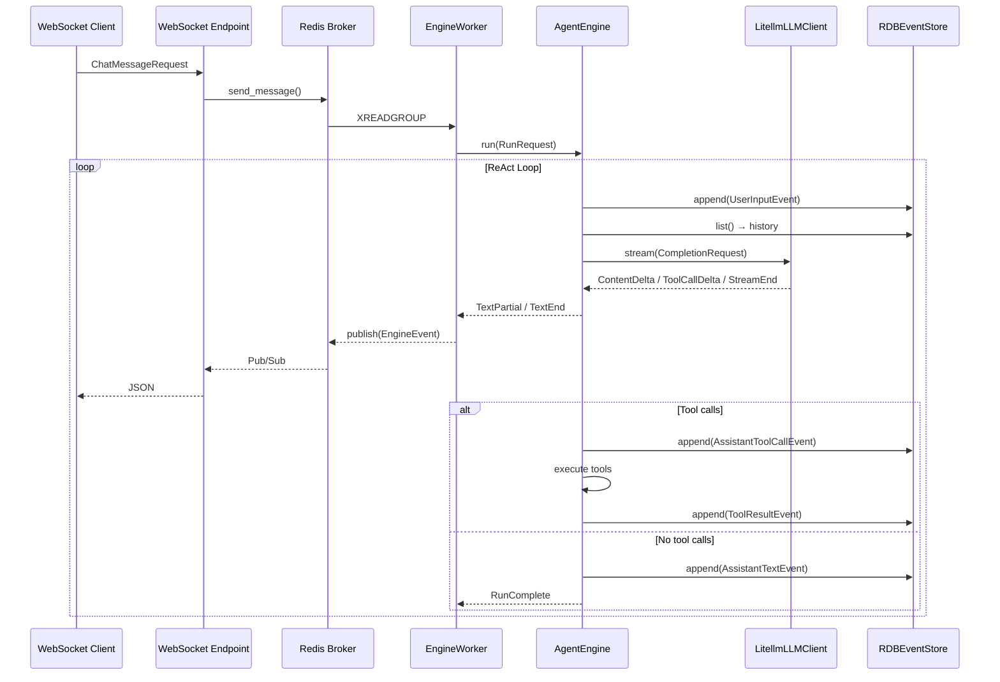
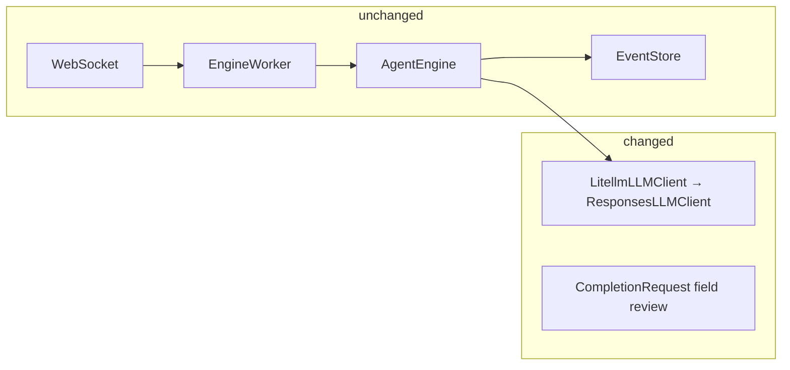
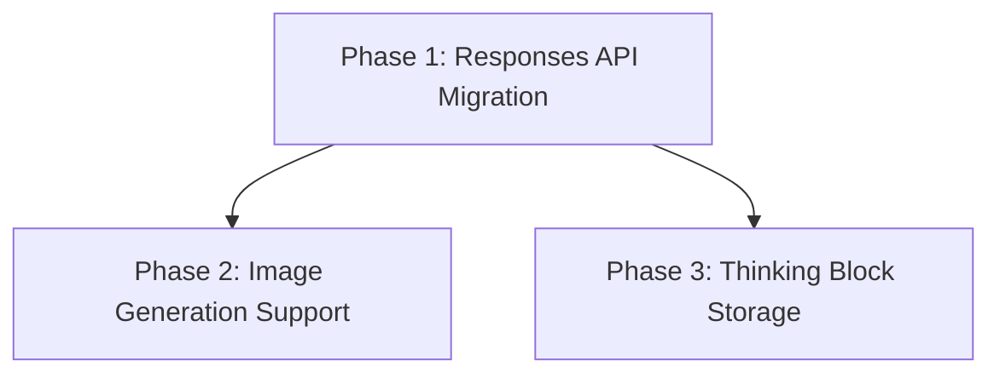

# Responses API Migration & Multimodal Support Plan

## Background

Current nointern runtime uses litellm Chat Completions API (`acompletion`). This API cannot do the following:

- **OpenAI image generation**: `modalities=["text", "image"]` is Gemini-only. OpenAI supports only Responses API `tools=[{"type": "image_generation"}]`.
- **Preserve reasoning tokens**: Chat Completions API does not include reasoning tokens in response, so reasoning context is lost in next turn.

litellm Responses API (`litellm.responses()`) supports OpenAI, Anthropic, Gemini, Vertex AI, and Bedrock in unified form, internally calling each provider native API and converting to Responses API format.

## Current Architecture



### Core Types

```
CompletionRequest → LLMClient.stream() → AsyncIterator[CompletionStreamEvent]
  - ContentDelta(delta)
  - ToolCallDelta(id, name, arguments_delta)
  - StreamEnd(content, tool_calls, usage, images)
```

### Storage Structure

`events` table: role(USER/ASSISTANT/TOOL), content, tool_calls(JSONB), attachments(JSONB)
- Images: not stored in DB, in-memory cache during engine execution
- Reasoning/Thinking: not stored, lost

---

## Phase 1: Migrate to Responses API

### Goal

Replace internal implementation of `LitellmLLMClient` with litellm Responses API based implementation. Keep external interface (`LLMClient` Protocol, `CompletionStreamEvent`) to avoid impact on engine/worker/WebSocket layers.

### Change Scope



### Detailed Tasks

1. **`runtime/llm.py`**: replace internal implementation of `LitellmLLMClient` with `litellm.aresponses()`
   - `_build_kwargs` → convert to Responses API input format
   - `_build_llm_messages` → convert to Responses API input items format
   - streaming: map `ResponseTextDeltaEvent` → `ContentDelta`, `ResponseFunctionCallArgumentsDoneEvent` → `ToolCallDelta`
   - change `StreamEnd` creation logic (extract from response.output)

2. **`engine/types.py`**: review `CompletionRequest` fields
   - conversion from `events` to Responses API input items is handled inside llm.py
   - no external interface change

3. **Tests**: update existing `llm_test.py`, `engine_test.py`

### Notes

- litellm Responses API [missing tool call delta bug](https://github.com/BerriAI/litellm/issues/20711)
  - No practical impact because full arguments can be received in done event.
  - Tool call argument streaming is not exposed to UI.
- For Anthropic/Gemini, litellm internally converts native API → Responses format.
  - Session management/compaction is OpenAI-specific and we do not use it.

---

## Phase 2: Image Generation Support

### Goal

Allow LLM to directly generate images on provider model where `image_generation=True`.

### Prerequisite

- Phase 1 complete (Responses API migration)

### Change Scope

1. **`engine/types.py`**: add `image_generation: bool = False` to `CompletionRequest`

2. **`runtime/llm.py`**: if `image_generation=True`, add `tools=[{"type": "image_generation"}]` to Responses API
   - Extract base64 image from `image_generation_call` output item in response
   - Include in `StreamEnd.images`

3. **`engine/engine.py`**: add `image_generation: bool = False` to `RunRequest`
   - Pass when creating `CompletionRequest`
   - Existing image storage logic (`_save_images_to_session_data`) continues to work

4. **`engine/run/resolve.py`**: set `RunRequest(image_generation=True)` when `provider_model.image_generation` is True

### Provider Behavior

| Provider | Mechanism |
|---|---|
| OpenAI | Responses API `tools=[{"type": "image_generation"}]` |
| Gemini | litellm internally uses `modalities` or native API conversion |
| Anthropic | image generation unsupported (ignore flag) |

---

## Phase 3: Store Thinking Block

### Goal

Store thinking/reasoning output from reasoning models (OpenAI o3, Anthropic extended thinking, etc.) to preserve reasoning context for next turn.

### Prerequisite

- Phase 1 complete (Responses API migration)

### Design: Add ReasoningEvent as Independent SessionEvent

In Responses API, reasoning is output item separate from message. It can appear before tool call and before text response, so model it as independent event instead of field on existing event.

```python
# Responses API output structure (reasoning + message are separate items)
output: [
    {"type": "reasoning", "id": "rs_...", "encrypted_content": "..."},
    {"type": "message", "content": [...]},
]

# Preserve order and pass as-is to next turn input
input: [
    ...previous output items (including reasoning),
    {"type": "message", "role": "user", "content": "next question"},
]
```

### Change Scope

1. **DB schema**: add `reasoning` column to `events` table (JSONB nullable)
   - Store encrypted reasoning item or thinking block opaquely

2. **`engine/types.py`**:
   - Add new SessionEvent: `ReasoningEvent(reasoning: object)`
   - Include `ReasoningEvent` in `SessionEvent` union
   - Add `reasoning: object | None = None` to `StreamEnd` of `CompletionStreamEvent`

3. **`runtime/llm.py`**: extract reasoning output item from Responses API response
   - Collect reasoning data from `ResponseReasoningSummaryTextDoneEvent`, etc.
   - Include in `StreamEnd.reasoning`

4. **`engine/engine.py`**: if reasoning exists, store separately as `ReasoningEvent`
   - Append in order before `AssistantTextEvent` / `AssistantToolCallEvent`
   - Preserve order on history restore and reflect as-is in next turn input

5. **input conversion in `runtime/llm.py`**: when encountering `ReasoningEvent` in history, convert to Responses API input item
   - OpenAI: pass encrypted reasoning item as-is
   - Anthropic: pass thinking block as-is

6. **`repos/message/store.py`**: RDBEventStore read/write reasoning column
   - `ReasoningEvent` → role=ASSISTANT, content=None, reasoning=JSONB
   - Sort with existing events by order (created_at, id)

7. **`api/public/chat/v1/`**: generalize reasoning in `GET /sessions/{session_id}/messages`
   - DB preserves provider-specific original format as-is (for passing to LLM next turn)
   - Message API response converts to one unified format (for rendering)
   - Current UI does not show thinking content, so UI can filter it

### Storage Strategy

**DB**: preserve provider-specific original format as opaque JSONB

```python
# OpenAI reasoning (encrypted, content not visible)
{"type": "reasoning", "id": "rs_...", "summary": [...], "encrypted_content": "..."}

# Anthropic extended thinking (content exposed)
{"type": "thinking", "thinking": "actual thought process...", "signature": "..."}

# Anthropic redacted thinking (safety filtered)
{"type": "redacted_thinking", "data": "..."}
```

**Message API response**: generalize to unified format

```python
# same format regardless of provider
{"type": "reasoning", "summary": "summary text or null"}
```

> **Note**: Exact response format of reasoning is finalized after checking actual response after Phase 1 (Responses API migration) completes.

### History Restore Example

```
events table (time order):
  1. UserInputEvent("question")
  2. ReasoningEvent({"type": "reasoning", "encrypted_content": "..."})
  3. AssistantToolCallEvent([{name: "search", ...}])
  4. ToolResultEvent("search result")
  5. ReasoningEvent({"type": "reasoning", "encrypted_content": "..."})
  6. AssistantTextEvent("final answer")
```

---

## Implementation Order Summary



Phase 2 and Phase 3 are independent and can proceed in parallel after Phase 1 completes.
