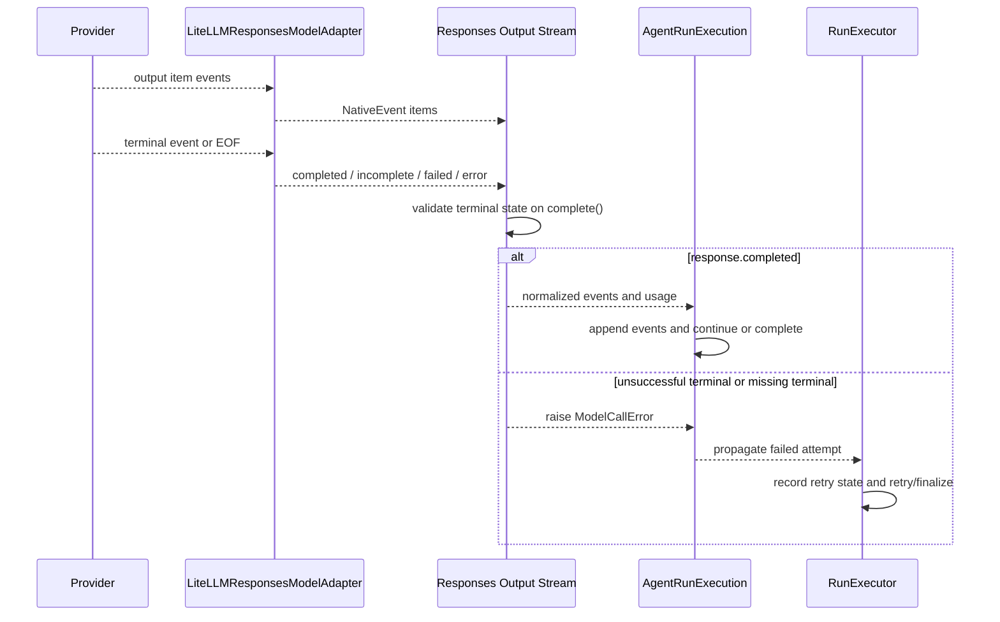

# Responses Stream Terminal Validation

## Summary

Azents will require an explicit native `response.completed` terminal event before a LiteLLM Responses stream can produce a successful normalized model step. Native `response.incomplete`, `response.failed`, and `error` outcomes, plus EOF without a recognized terminal event, will raise `ModelCallError` and flow through the existing failed-run retry/finalization boundary.

This phase intentionally does not change the successful-output policy. A reasoning-only response explicitly terminated by `response.completed` remains accepted by the current execution loop.

The durable decision is recorded in [ADR-0145](../adr/0145-require-explicit-responses-stream-completion.md).

## Problem

### User-visible goal

A model stream that did not complete successfully must not mark an Agent Run completed merely because the stream emitted a durable reasoning or tool output item before ending.

### Current behavior

`_LiteLLMResponsesOutputStream` accumulates output items from `OutputItemDoneEvent` and `ResponseOutputItemDoneEvent`. Its `complete()` method currently builds durable events from those items even when no `ResponseCompletedEvent` was observed.

`AgentRunExecution` then:

1. accepts non-empty reasoning as durable model output;
2. appends normalized events;
3. checks only for foreground `client_tool_call` events to decide whether another model turn is required;
4. marks the Run completed when no foreground client tool call exists.

This permits an unsuccessful stream to become a successful Run when it ends with reasoning but without assistant text or a client tool call.

### Confirmed production evidence

For Run `019f648bbfec75b6954bf95498eb7d0a` on 2026-07-15:

- the preceding model turn reported normal token usage;
- the final turn stored reasoning but no assistant message or foreground client tool call;
- the worker logged `usage_present=false` for the final model call;
- no turn marker was emitted;
- the Run was marked completed immediately afterward.

The missing usage and turn marker are consistent with the normalizer not observing a usable completed response payload.

## Goals

- Require explicit successful native Responses termination before normalized model output is admitted.
- Convert provider-reported incomplete, failed, and error terminal outcomes to `ModelCallError`.
- Convert unclassified stream EOF to `ModelCallError`.
- Reuse the existing worker-owned failed-attempt retry and terminal failure lifecycle.
- Prevent unsuccessful output items from entering durable transcript history.
- Preserve current user-stop partial assistant-text behavior.
- Implement the change without database, public API, or event schema changes.

## Non-goals

- Rejecting reasoning-only output when the provider explicitly sends `response.completed`.
- Defining which provider-hosted outputs qualify as a user-visible final answer.
- Adding reason-specific retryability for `response.incomplete`.
- Changing retry counts, backoff, or failed-run UI.
- Persisting partial output from provider failures or unclassified EOF.
- Supporting legacy adapter behavior that treats output-item completion as response completion.

## Constraints

- `AgentRunExecution` must continue to expose attempt failures as exceptions so `RunExecutor` owns retry and finalization.
- Durable transcript events must be appended only after successful model-step normalization.
- User cancellation must remain distinguishable from provider failure.
- No backward-compatibility fallback will accept EOF without `response.completed`.
- Error messages exposed through `ModelCallError` must be bounded and user-safe.

## Affected code

Primary implementation paths:

- `python/apps/azents/src/azents/engine/events/litellm_responses.py`
- `python/apps/azents/src/azents/engine/events/litellm_responses_test.py`
- `python/apps/azents/src/azents/engine/events/execution_test.py`
- `docs/azents/spec/flow/agent-execution-loop.md`

Validated but not expected to require contract changes:

- `python/apps/azents/src/azents/engine/events/protocols.py`
- `python/apps/azents/src/azents/engine/events/execution.py`
- `python/apps/azents/src/azents/engine/run/errors.py`
- `python/apps/azents/src/azents/worker/run/executor.py`

## Decision points

### 1. Terminal-state ownership

**Options**

- Validate in `LiteLLMResponsesModelAdapter` while transporting native events.
- Validate in `_LiteLLMResponsesOutputStream`, which already owns per-stream normalization state.
- Validate generically in `AgentRunExecution` after normalization.

**Decision**: Validate in `_LiteLLMResponsesOutputStream`.

**Rationale**: The normalizer understands adapter-native terminal event names and response payload shapes. Keeping validation there avoids adding Responses-specific state to the generic execution loop or transport-only adapter.

### 2. Failure representation

**Options**

- Extend `NormalizedAdapterOutput` with terminal status and let the execution loop interpret it.
- Introduce a new adapter failure result type.
- Raise `ModelCallError` from normalization completion.

**Decision**: Raise `ModelCallError`.

**Rationale**: The existing execution and worker boundaries already treat `ModelCallError` as a user-visible failed attempt and apply durable retry/finalization policy. No protocol, event, or database change is needed.

### 3. Proof of success

**Options**

- Continue accepting completed output items at EOF.
- Infer success from usage presence.
- Require `ResponseCompletedEvent`.

**Decision**: Require `ResponseCompletedEvent`.

**Rationale**: Output-item completion and usage are response data, not the authoritative response terminal state. The native protocol already provides an explicit successful terminal event.

### 4. Failed-attempt output persistence

**Options**

- Preserve reasoning and assistant items received before provider failure.
- Append an interrupted transcript event.
- Keep the failed attempt non-durable and let retry/finalization own user-visible history.

**Decision**: Keep failed-attempt model output non-durable.

**Rationale**: Replaying incomplete native items could corrupt tool continuity and same-native replay. Existing failed-run architecture intentionally keeps retry attempts out of durable transcript history.

### 5. Scope of reasoning-only responses

**Options**

- Reject all completed responses without assistant text or foreground tools now.
- Limit this phase to native terminal-state correctness.

**Decision**: Limit this phase to native terminal-state correctness.

**Rationale**: The requested first step is to prevent unsuccessful terminal states from being accepted. A complete user-visible terminal-output policy must separately account for provider-hosted image/file results and explicit reasoning-only completion.

## Proposed design

### Stream state

`_LiteLLMResponsesOutputStream` will track one response terminal outcome in addition to its existing completed output items and completed response payload.

Conceptually:

- `completed`: an explicit `ResponseCompletedEvent` was observed;
- `incomplete`: a `ResponseIncompleteEvent` was observed;
- `failed`: a `ResponseFailedEvent` was observed;
- `error`: a `ResponseErrorEvent` was observed;
- `None`: no recognized terminal event has been observed.

The implementation may use a private enum, literal, or private failure value. This state remains adapter-local and is not added to `NormalizedAdapterOutput`.

### Native terminal recognition

The normalizer will recognize the LiteLLM/OpenAI event wrapper names used by `LiteLLMResponsesModelAdapter`:

| Wrapper type | Native type | Outcome |
| --- | --- | --- |
| `ResponseCompletedEvent` | `response.completed` | success |
| `ResponseIncompleteEvent` | `response.incomplete` | `ModelCallError` |
| `ResponseFailedEvent` | `response.failed` | `ModelCallError` |
| `ResponseErrorEvent` | `error` | `ModelCallError` |

Completed response payload and usage extraction remain attached only to `ResponseCompletedEvent`.

Incomplete and failed response details will be read from their nested response payloads. Error-event details will be read from the event payload. Missing or malformed details fall back to a generic user-safe message.

### Completion validation

`complete()` will perform terminal validation before returning durable output:

1. If the terminal outcome is incomplete, failed, or error, raise `ModelCallError` with a bounded user-safe message.
2. If no terminal outcome exists when the native iterator reaches EOF, raise `ModelCallError` indicating that the stream ended before completion.
3. If the terminal outcome is completed, normalize output from the completed response payload, falling back to completed output items only for response payload reconstruction—not as proof of success.
4. Return usage only from the completed response payload under the existing normalization rules.

The existing output-item fallback remains useful when a valid `ResponseCompletedEvent` has an empty or malformed `output` field but prior completed output items were observed. It will no longer authorize completion by itself.

### Interruption path

`interrupt()` currently calls `complete()` to collect already completed output before adding partial assistant text. Strict terminal validation would break user stop because user cancellation normally occurs before `response.completed`.

The normalizer will therefore separate output construction from successful-terminal validation:

- a private builder constructs events from the completed response/output-item state without asserting success;
- `complete()` validates terminal success, then calls the builder;
- `interrupt()` calls the builder directly and applies the existing partial assistant-text preservation rule.

Only the explicit user-stop path may use this non-validating builder to durably preserve partial assistant text. Provider incomplete, failed, error, and EOF paths never call `interrupt()`.

### Failure propagation

`ModelCallError` raised by `complete()` occurs before `AgentRunExecution` advances to event appending. Existing exception handling will:

- invoke the turn-end callback with `error`;
- leave normalized model events and turn/run markers unappended;
- propagate the failed attempt to `RunExecutor`;
- publish retry state and retry according to current policy;
- finalize a durable failed Run only after retry policy decides to finalize.

No new worker branching is required.

### Error messages

Messages will expose only safe terminal information:

- incomplete: `Model response was incomplete` plus a normalized reason when available;
- failed: `Model response failed` plus a safe provider message/code when available;
- error: `Model call failed` plus the safe event message/code when available;
- missing terminal event: `Model response stream ended before completion.`

Dynamic message/code fields must be length-bounded. Raw serialized provider responses are excluded.

## API and data model changes

None.

The following contracts remain unchanged:

- `NormalizedAdapterOutput`;
- `NativeEvent`;
- durable event kinds and payloads;
- `agent_runs` schema;
- public REST and WebSocket schemas;
- retry-state schema.

## Runtime lifecycle

## Error handling and observability

- Native unsuccessful terminal outcomes become model-source failed attempts.
- Existing retry-state and failed-run logs remain the primary operational signal.
- The implementation should include the normalized terminal category in structured logs or failure classification when that can be done without changing durable contracts.
- A provider failure must never append its partial reasoning, assistant, or tool output as a successful model turn.
- A retry success clears live retry state through the existing worker lifecycle.
- Retry exhaustion produces the existing durable failed-run `system_error` and failed run marker.

## Security and permissions

No permission boundary changes are required.

Provider error details may contain internal or sensitive information. Only explicitly selected message, code, or incomplete-reason fields are allowed in `ModelCallError`, and each must be bounded. Full native event payloads remain observability-only and must not be copied to user-visible transcript history.

## Migration and rollout

- No database migration is required.
- No feature flag is required.
- Deploy as a backend behavior fix.
- Runs started before deployment continue under the worker version that owns them; newly executed model turns use the strict terminal policy after rollout.
- Rollback restores permissive EOF behavior but does not require data rollback.

## Test Strategy

### Verification matrix

| Scenario | Expected result | Primary verification |
| --- | --- | --- |
| `response.completed` with assistant output and usage | Existing normalized output succeeds | normalizer unit test |
| output item followed by `response.incomplete` | `ModelCallError`; no durable model events | normalizer and execution tests |
| output item followed by `response.failed` | `ModelCallError`; no durable model events | normalizer and execution tests |
| native `error` event | `ModelCallError`; no successful Run completion | normalizer unit test |
| output item followed by EOF without terminal event | `ModelCallError` | normalizer unit test |
| empty stream EOF | `ModelCallError` | normalizer unit test |
| user stop before terminal event with partial assistant text | existing interrupted partial-text behavior remains | normalizer and execution regression tests |
| explicit `response.completed` with reasoning only | existing behavior remains in this phase | scope-lock regression test |

### Unit and component tests

Required test changes:

- Replace the current test that accepts `OutputItemDoneEvent` followed by bare `complete()` with an EOF failure assertion.
- Add incomplete, failed, error, and missing-terminal tests with completed output items present to prove items cannot authorize success.
- Verify safe extraction and fallback messages for missing/malformed provider details.
- Refactor and retain the existing interruption test to prove `interrupt()` does not require `response.completed`.
- Add or extend `AgentRunExecution` coverage proving a `ModelCallError` from `output_stream.complete()` appends no model events, turn marker, or completed run marker and leaves terminal finalization to the worker.
- Retain existing worker tests that prove `UserVisibleRuntimeError` attempts enter retry/finalization.

### E2E plan

No new product E2E is included in this initial phase. The current deterministic Aimock fixture contract expresses assistant content and tool calls and synthesizes normal chat completion; it cannot script raw Responses terminal events or a terminal-less EOF. Live providers also cannot reliably reproduce these failure modes on demand, so a live E2E would be nondeterministic and would not provide trustworthy coverage.

The adapter normalizer and `AgentRunExecution` tests are the closest deterministic boundaries to the provider protocol and failed-run lifecycle. A future Aimock capability for raw native stream scripting should add one public-session E2E proving that an unsuccessful terminal state shows retry/failure instead of Run completed.

### Testenv and fixture requirements

- No new testenv fixture, seed, or direct database setup is required.
- No external credential or prerequisite snapshot is required.
- Existing dummy provider and Aimock fixtures remain unchanged.

### Evidence and CI policy

Implementation evidence must include:

- named passing normalizer tests for completed, incomplete, failed, error, EOF, and interruption cases;
- named passing execution test for non-durable failure propagation;
- Ruff, Pyright, and targeted Pytest output for the Azents backend;
- the updated Agent Execution Loop spec validation.

All new tests are deterministic and required in normal CI. No new test is optional, skipped, or gated by the `azents-live-e2e` label. There is no live/external verification path for this phase.

## Alternatives considered

### Validate in `AgentRunExecution`

Rejected because it would require generic execution code to understand Responses-specific terminal event semantics or a broader protocol change.

### Add terminal status to `NormalizedAdapterOutput`

Rejected for this phase because unsuccessful terminal states are failed attempts, and exception flow already integrates with the retry boundary. A structured terminal result would add contract surface without changing the desired lifecycle.

### Treat usage as proof of completion

Rejected because usage may be missing from otherwise completed responses and may be present in incomplete responses. Native terminal type is authoritative.

### Preserve partial provider-failed output

Rejected because failed-attempt transcript output can pollute retries and leave invalid native tool/reasoning history. User-requested interruption remains the only partial-output persistence path.

### Combine user-visible terminal-output validation

Deferred because it requires separate rules for assistant text, provider-hosted artifacts, and explicitly completed reasoning-only output.

## Risks and mitigations

### Provider does not emit `response.completed` on successful streams

**Risk**: Strict validation may expose an adapter/provider incompatibility that the current fallback hides.

**Mitigation**: Treat it as a failed attempt and retain provider/model identifiers in structured logs. Do not reintroduce an implicit EOF success fallback.

### Deterministic incomplete reason retries repeatedly

**Risk**: `max_output_tokens` or similar incomplete reasons may exhaust the common retry budget with identical attempts.

**Mitigation**: This phase prioritizes preventing false success. Reason-specific retryability is an explicit follow-up.

### User stop regression

**Risk**: Making `complete()` strict could accidentally prevent partial assistant-text persistence on user cancellation.

**Mitigation**: Separate non-validating output construction from strict normal completion and keep dedicated regression tests for `interrupt()`.

### Unsafe provider details reach the user

**Risk**: Provider messages can include raw request or internal details.

**Mitigation**: Extract only allowlisted fields, bound their lengths, and use generic fallback messages.

## Implementation plan

1. Add adapter-local terminal outcome tracking to `_LiteLLMResponsesOutputStream`.
2. Recognize completed, incomplete, failed, and error native Responses events.
3. Extract bounded safe failure detail into `ModelCallError` messages.
4. Split output construction from successful-terminal validation so `interrupt()` remains valid.
5. Make `complete()` require explicit successful termination and reject terminal-less EOF.
6. Update normalizer and execution tests.
7. Update `docs/azents/spec/flow/agent-execution-loop.md` to describe explicit terminal validation and retry propagation.
8. Run backend quality checks and documentation validation.

## Required spec updates

`docs/azents/spec/flow/agent-execution-loop.md` must be updated during implementation to state:

- `response.completed` is required for successful LiteLLM Responses normalization;
- `response.incomplete`, `response.failed`, native error, and terminal-less EOF become failed attempts;
- completed output items alone cannot complete a model step;
- user interruption remains the only partial assistant-output persistence path.

## Open questions

None for this phase.

Follow-up design topics, intentionally outside this document, are:

- terminal user-visible output requirements for explicit `response.completed`;
- reason-specific retryability and remediation for `response.incomplete`.
