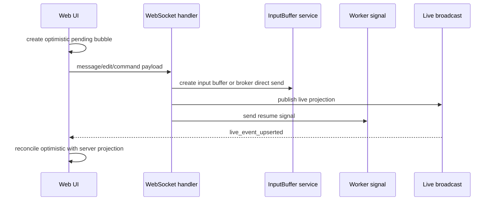
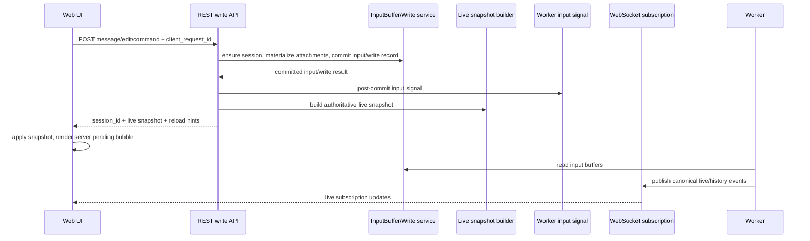

# REST Chat Write Boundary Design

## Overview

This design moves Web chat user write path from WebSocket to REST commit boundary. Goal is to change meaning of message send success from “sent payload through WebSocket” to “server committed user input to input buffer and returned authoritative live snapshot”.

Related decisions follow [rest-260605/ADR](../adr/rest-260605-rest-chat-write-boundary.md).

Core changes are as follows.

- message/edit/command writes are handled by REST endpoints.
- stop remains on WebSocket in first phase and is follow-up REST transition target.
- REST write success response returns only after input buffer commit.
- REST write response returns authoritative live snapshot.
- Every REST write is idempotent with `client_request_id`.
- First message of new session is handled by REST message contract without session id, and after session creation follows same buffer-first path.
- Frontend timeline optimistic pending bubble is removed.
- WebSocket message/edit/command write path is removed at same time as REST transition.

## Requirements

### REQ-1. Message/edit/command write uses REST commit boundary

#### Description
Normal message, user message edit, and slash command must be handled by REST endpoint, not WebSocket write. Stop remains on WebSocket in first phase.

#### Related decisions
- [rest-260605/ADR-D1](../adr/rest-260605-rest-chat-write-boundary.md)
- [rest-260605/ADR-D8](../adr/rest-260605-rest-chat-write-boundary.md)

#### Acceptance criteria
- message send REST endpoint exists and Web UI uses it.
- edit message REST endpoint exists and Web UI uses it.
- command REST endpoint exists and Web UI uses it.
- WebSocket handler does not process message/edit/command payload.
- WebSocket stop request continues to work in first scope.

### REQ-2. REST message success returns only after input buffer commit

#### Description
Message REST write must return success response only after committing user input to input buffer. After commit, it sends input signal to worker, but signal delivery success is not condition for REST success.

#### Related decisions
- [rest-260605/ADR-D2](../adr/rest-260605-rest-chat-write-boundary.md)

#### Acceptance criteria
- After message REST success response, input buffer row or live user_message projection for that input can be queried on server.
- If input buffer commit fails, REST write does not return success response.
- Worker input signal is sent after commit.
- Signal delivery failure does not roll back successful input buffer persistence.

### REQ-3. REST write response returns authoritative live snapshot

#### Description
REST write response must return current session's authoritative live snapshot, not one accepted item. Full durable history page is not included in default response.

#### Related decisions
- [rest-260605/ADR-D3](../adr/rest-260605-rest-chat-write-boundary.md)

#### Acceptance criteria
- message/edit/command REST response includes session id and live snapshot.
- live snapshot includes pending input buffer live projection, live events, run state or equivalent current state.
- Work that requires durable history reload such as edit/command returns hint like `history_reload_required`.
- Frontend replaces or authoritatively applies pending/live state based on REST response snapshot.

### REQ-4. REST write is idempotent with `client_request_id`

#### Description
Every REST write request must require `client_request_id`, and retrying same user intention must not create duplicate input buffer or duplicate command/edit work.

#### Related decisions
- [rest-260605/ADR-D4](../adr/rest-260605-rest-chat-write-boundary.md)

#### Acceptance criteria
- message/edit/command REST request schema requires `client_request_id`.
- Retry with same user/runtime/client_request_id does not create new input buffer or new write work.
- Retry response returns current authoritative live snapshot.
- Retrying with same client_request_id after timeout does not duplicate UI pending bubble.

### REQ-5. First message of new session is handled by REST message contract without session id

#### Description
First message of new session is handled by REST endpoint that does not receive session id. Server creates session and then creates input buffer through same buffer-first path.

#### Related decisions
- [rest-260605/ADR-D5](../adr/rest-260605-rest-chat-write-boundary.md)
- [rest-260605/ADR-D2](../adr/rest-260605-rest-chat-write-boundary.md)

#### Acceptance criteria
- New session message REST request can be called without session id.
- Server response includes created session id.
- First message of new session is also stored as input buffer.
- `/sessions/new` WebSocket first message write path is removed.

### REQ-6. Frontend timeline does not create optimistic pending bubble

#### Description
Frontend does not create optimistic pending bubble in timeline during REST write request and only shows sending state at composer/send button level. Pending bubble is rendered only after REST response snapshot.

#### Related decisions
- [rest-260605/ADR-D6](../adr/rest-260605-rest-chat-write-boundary.md)

#### Acceptance criteria
- No timeline pending input buffer is added while message REST request is in-flight.
- ChatInput or composer shows sending state.
- After REST success response, pending bubble is rendered from server snapshot.
- On REST failure, input and attachments are preserved and pending bubble is not added.

### REQ-7. REST write per Session is serialized in first phase

#### Description
For same session, only one message/edit/command REST write can be in-flight at same time. Additional input during run is possible, but write requests themselves are not sent in parallel.

#### Related decisions
- [rest-260605/ADR-D7](../adr/rest-260605-rest-chat-write-boundary.md)

#### Acceptance criteria
- If one of message/edit/command is in-flight, other write submit is disabled or blocked.
- Next write can be sent after in-flight write finishes.
- This serialization applies only to REST write request concurrency, separate from run pending state.

### REQ-8. E2E that cannot be verified is tracked with GitHub Issue, not replaced with PASS

#### Description
API E2E and browser E2E are primary QA targets. If Docker/testenv/browser execution is difficult in current environment, run possible verification and separately track non-executable items with GitHub Issue.

#### Related decisions
- [rest-260605/ADR-D9](../adr/rest-260605-rest-chat-write-boundary.md)

#### Acceptance criteria
- Design QA Checklist defines API E2E and browser E2E scenarios.
- Verification possible during implementation is actually executed.
- Difficult-to-run E2E/browser verification is not marked PASS.
- Non-executable items are tracked with GitHub Issue containing scenario, reason unavailable, required environment, expected result, related PR/document links.

## Decision Table

| ADR decision | Requirements |
| --- | --- |
| [rest-260605/ADR-D1](../adr/rest-260605-rest-chat-write-boundary.md). message/edit/command write moves to REST | REQ-1 |
| [rest-260605/ADR-D2](../adr/rest-260605-rest-chat-write-boundary.md). REST write success criterion is input buffer commit | REQ-2, REQ-5 |
| [rest-260605/ADR-D3](../adr/rest-260605-rest-chat-write-boundary.md). REST write response returns authoritative live snapshot | REQ-3 |
| [rest-260605/ADR-D4](../adr/rest-260605-rest-chat-write-boundary.md). Every REST write is idempotent with `client_request_id` | REQ-4 |
| [rest-260605/ADR-D5](../adr/rest-260605-rest-chat-write-boundary.md). New session write is handled by REST message contract without session id | REQ-5 |
| [rest-260605/ADR-D6](../adr/rest-260605-rest-chat-write-boundary.md). Remove Frontend timeline optimistic pending bubble | REQ-6 |
| [rest-260605/ADR-D7](../adr/rest-260605-rest-chat-write-boundary.md). REST write per Session is serialized in first phase | REQ-7 |
| [rest-260605/ADR-D8](../adr/rest-260605-rest-chat-write-boundary.md). WebSocket message/edit/command write path removed with REST transition | REQ-1 |
| [rest-260605/ADR-D9](../adr/rest-260605-rest-chat-write-boundary.md). Run possible verification and track hard-to-run E2E with GitHub Issue | REQ-8 |

## Problem Definition

Current Web chat write flow has WebSocket handler directly receive and process user input.



Problems with this structure:

- WebSocket send success and server DB commit success are separated.
- UI creates optimistic pending bubble before server ack, so it must dedupe with server projection.
- For attachment messages, optimistic `exchange://...` URI and server-materialized `model-file:...` representation differ, so payload-based dedupe can break.
- New session first message WebSocket special path can bypass input buffer.
- message/edit/command write responsibility is mixed with WebSocket live subscription responsibility.

## Goals

- Change user write success criterion to input buffer commit.
- Move message/edit/command to REST endpoints.
- Return authoritative live snapshot from REST response.
- Handle first message of new session with REST message endpoint without session id.
- Apply idempotency key to every REST write.
- Remove Frontend timeline optimistic pending bubble.
- WebSocket only handles live subscription and stop control.
- Actually run executable verification and track non-executable verification with GitHub Issue.

## Non-goals

- Do not convert Stop request to REST in first phase.
- Do not introduce snapshot revision based concurrent write ordering in first phase.
- Do not include full durable history page in every REST write response.
- Do not include outbox tying worker signal delivery atomically to API transaction in this scope.
- Chat timeline visual redesign is not in this scope.
- Do not make Upload API session-aware.

## Target Architecture



### Responsibility split

| Layer | Responsibility | Does not do |
| --- | --- | --- |
| REST write API | write request validation, session resolution/creation, idempotency, input buffer commit, snapshot response | wait for runner response completion, create optimistic UI state |
| Worker input signal | notify worker after commit that new input exists | replace input buffer source-of-truth, guarantee API transaction |
| Worker | detect/recover input buffer, flush at model-call boundary, progress run | determine REST response success |
| WebSocket | live canonical event subscription, first-phase stop control | handle message/edit/command write |
| Frontend composer | sending state, REST mutation serialization, preserve input on failure | create timeline optimistic pending bubble |
| Frontend timeline | render server snapshot/live/history | optimistic/server dedupe based on payload |

## API Design

Path names are finalized during implementation after checking conflicts with existing OpenAPI naming. Design contract is as follows.

### Existing session message write

`POST /chat/v1/sessions/{session_id}/messages`

Request:

```json
{
  "agent_id": "agent_...",
  "client_request_id": "018f...",
  "message": "Describe this image",
  "attachments": ["exchange://exchange/.../original"]
}
```

Response:

```json
{
  "session_id": "session_...",
  "client_request_id": "018f...",
  "accepted": {
    "type": "input_buffer",
    "id": "buffer_..."
  },
  "snapshot": {
    "live_events": [],
    "pending_input_buffers": [],
    "run": {
      "status": "running",
      "phase": "preparing_input"
    }
  },
  "history_reload_required": false
}
```

### New session message write

`GET /chat/v1/agents/{agent_id}/team-primary-session` followed by `POST /chat/v1/sessions/{session_id}/messages`

Request is same as existing session message write, but has no session id path parameter. Server creates session and includes `session_id` in response.

### edit message write

`POST /chat/v1/sessions/{session_id}/messages/{message_id}/edit`

Request:

```json
{
  "agent_id": "agent_...",
  "client_request_id": "018f...",
  "message": "Edited text",
  "attachments": []
}
```

Response includes live snapshot and returns `history_reload_required: true` when durable history reload is needed.

### command write

`POST /chat/v1/sessions/{session_id}/commands`

Request:

```json
{
  "agent_id": "agent_...",
  "client_request_id": "018f...",
  "command": "compact"
}
```

Response includes command accepted result and live snapshot.

### WebSocket write removal

Final WebSocket request handling keeps only:

- stop request
- subscription lifecycle

Message/edit/command payload is not processed. Implementation chooses safest method among explicit error/close or parse rejection based on existing UX, but in all cases must not create input buffer or command side effect.

## Data Model

### Idempotency

REST write idempotency needs stable storage. During implementation choose one of following.

1. Add `client_request_id` to `input_buffers` and directly guarantee message write idempotency.
2. Add common `chat_write_requests` table for message/edit/command recording request type, user/runtime/session, client_request_id, result reference.

Design requirements:

- `client_request_id` is required in REST write request.
- Same user/runtime/client_request_id is treated as same user intention.
- Retry does not repeat write side effect and returns current live snapshot.
- New session first message may not have session id in request, so idempotency scope is not defined only by session id.

Recommended scope is `agent_runtime_id + user_id + client_request_id`. After runtime ensure, agent runtime id is known and works same for new/existing session.

### Input buffer

Message write keeps input buffer as source of truth.

- content
- attachments snapshot
- file_parts snapshot
- metadata
- client_request_id or idempotency record reference

Attachment FilePart materialization follows [input-260604/ADR](../adr/input-260604-input-bound-filepart-materialization.md). Upload API is not session-aware, and REST message write boundary materializes exchange attachment according to current agent/session/user.

### Live snapshot

Response snapshot respects existing canonical history/live architecture. Reuse canonical event live projection from [chat-260604/ADR](../adr/chat-260604-chat-protocol-history-live.md) as much as possible.

Snapshot can include:

- pending input buffer live `user_message` projections
- Redis live events
- current run status/phase
- authorization request or other current UI live state through separate contract or live projection
- `history_reload_required` hint

Durable history page is not included by default.

## Frontend Design

### Write mutation state

Remove message/edit/command send responsibility from `useChatWebSocket`. WebSocket hook only handles subscription and stop.

`useChatSessionContainer` or separate write hook handles REST mutations.

- `sendMessage` becomes async REST mutation.
- `sendEditedMessage` becomes async REST mutation.
- `sendCommand` becomes async REST mutation.
- If write is in-flight in one session, block other write submit.
- Generate `client_request_id` for each request.
- timeout/unknown result retry must be able to keep same `client_request_id`.

### ChatInput UX

- Show sending state on send button/composer during REST request.
- Do not create Timeline optimistic bubble.
- On REST success, clear input and attachments and apply snapshot.
- On REST failure, preserve input and attachments and show error toast or inline error.

### New session UX

- In new chat, Web first resolves `/agents/{agent_id}/team-primary-session`, then sends to `/sessions/{session_id}/messages`.
- Reflect response session id to container state, URL, sidebar sync.
- Compose screen from response snapshot.
- Start WebSocket live subscription with confirmed session id afterward.

## Rollout / failure mode

- Remove WebSocket message/edit/command write path at same time as REST transition. No runtime fallback.
- If deployment mismatch occurs, combination of frontend without REST write or backend without WS write can fail writes. Rollback by previous deployment.
- Worker input signal failure does not roll back input buffer persistence. Worker must detect/recover from input buffer source-of-truth.
- Retry after REST timeout uses same `client_request_id` to prevent duplicate side effect.
- If Browser/testenv execution is impossible in current agent runtime, do not replace with QA PASS; track with GitHub Issue.

## Feasibility Verification

| Item | Current confirmation | Risk |
| --- | --- | --- |
| input buffer source | [chat-260519/ADR](../adr/chat-260519-chat-input-buffer.md) and current `input_buffers` repository/service exist | idempotency column/table addition needed |
| live snapshot source | after [chat-260604/ADR](../adr/chat-260604-chat-protocol-history-live.md), history/live canonical event API and frontend mapper exist | response model for REST write response needed |
| attachment materialization | [input-260604/ADR](../adr/input-260604-input-bound-filepart-materialization.md) helper defines user input boundary materialization | new REST endpoint must use same helper |
| frontend state mapping | `useChatSessionContainer` maps history/live events to view model | need split write mutation and WebSocket hook responsibility |
| WS write removal | current WS handler parses message/edit/command/stop all together | need redesign parse/receive loop to keep only stop |
| E2E execution | testenv E2E exists, but current runtime may not have Docker | track non-executable items with GitHub Issue |

## Test Strategy

Product behavior verification is E2E primary. Run possible verification directly; do not replace hard verification blocked by Docker/testenv/browser constraints with PASS. Track those with GitHub Issue.

### E2E primary verification matrix

| Behavior | Primary path | Expected result | Related requirement |
| --- | --- | --- | --- |
| New session message REST | testenv public REST → live snapshot query | session creation, input buffer creation, snapshot returned | REQ-2, REQ-3, REQ-5 |
| Existing session message REST | testenv public REST | snapshot returned after input buffer commit | REQ-1, REQ-2, REQ-3 |
| Attachment message REST + UI | browser E2E upload → send | one pending bubble, no optimistic duplicate | REQ-3, REQ-6 |
| idempotent retry | call REST twice with same `client_request_id` | no duplicate input buffer, snapshot returned | REQ-4 |
| edit REST | browser/API E2E edit submit | REST write, history reload hint, UI reload | REQ-1, REQ-3, REQ-4 |
| command REST | browser/API E2E slash command submit | REST write, live/run state reflected | REQ-1, REQ-3, REQ-4 |
| WS write removal | send message/edit/command payload through WS | no side effect, stop works | REQ-1 |
| REST failure UX | browser E2E forced failure | input/attachments preserved, no pending bubble added | REQ-6 |

### Supporting quality checks

- Backend targeted pytest for request schema/idempotency/input buffer service
- Frontend typecheck/lint for async ChatInput and WebSocket hook responsibility split
- OpenAPI generation and generated client update
- `git diff --check`

Supporting quality checks do not replace QA Checklist PASS evidence.

### Fixture / prerequisite

- testenv user/workspace/agent/session fixture
- upload endpoint fixture for attachment send
- WS ticket and live subscription fixture
- browser E2E runner for ChatInput UX
- failure injection or mock route for REST failure UX
- Docker/testenv runtime availability

### Evidence

- REST request/response JSON with `client_request_id`, `session_id`, live snapshot
- DB/read-model evidence that input buffer count does not duplicate on retry
- WebSocket trace showing absence of message/edit/command side effect and stop behavior
- Browser screenshot or trace showing single pending bubble after attachment send
- GitHub Issue links for any E2E/browser scenarios that cannot be run in current environment

## QA Checklist

### QA-1. First message of new session creates session and input buffer through REST

#### What to check
Verify new session message REST endpoint can be called without session id, creates session, commits input buffer, and returns live snapshot.

#### Why it matters
Removes existing `/sessions/new` WebSocket first message exception path and unifies every user input into buffer-first source of truth.

#### How to check
Call new session message write through testenv public REST and verify response session id, pending live projection, input buffer persistence.

#### Expected result
REST response includes created session id and snapshot, and same input exists exactly once in input buffer/live projection.

#### Execution result
BLOCKED for product E2E in this agent runtime. Attempted `cd testenv/azents/e2e && uv run pytest -q src/tests/azents/public/test_chat_input_buffer.py` during Phase 4 and failed before product execution because Docker/testcontainers could not connect to a Docker daemon. Phase 5 reconfirmed `/var/run/docker.sock` absent and `docker` CLI absent. Tracking Issue: [#4468](https://github.com/azents/azents/issues/4468).

Supporting verification PASS: `cd /workspace/agent/azents/python/apps/azents && uv run pytest -q src/azents/api/public/chat/v1/chat_api_test.py src/azents/repos/chat_write_request/repository_test.py src/azents/services/chat/input_buffer_test.py` → 12 passed, 7 skipped.

#### Fixes applied
None in Phase 5. Phase 4 added REST write E2E helper and new session message regression.

### QA-2. Existing session message REST returns snapshot after commit

#### What to check
Verify message REST called with existing session id returns authoritative live snapshot after input buffer commit.

#### Why it matters
REST write success must mean server persistence success to reduce states that look like message loss.

#### How to check
Call existing session message write through testenv public REST and compare response with server input buffer/live state.

#### Expected result
After success response, input buffer can be queried and matches pending input state in snapshot.

#### Execution result
BLOCKED for product E2E in this agent runtime. Existing session message REST E2E was blocked before testcontainers fixture start in environment without Docker daemon. Tracking Issue: [#4468](https://github.com/azents/azents/issues/4468).

Supporting verification PASS: backend targeted pytest `chat_api_test.py`, `repository_test.py`, `input_buffer_test.py` → 12 passed, 7 skipped.

#### Fixes applied
None in Phase 5. Phase 4 added existing session message REST helper and running follow-up buffer regression.

### QA-3. `client_request_id` retry does not create duplicate input buffer

#### What to check
Verify calling message REST twice with same `client_request_id` does not duplicate input buffer or write side effect.

#### Why it matters
If REST timeout/retry creates duplicate messages, REST transition stability goal fails.

#### How to check
Repeat same request through testenv public REST or targeted API E2E and verify input buffer count, accepted id, response snapshot.

#### Expected result
Same key retry returns same accepted input/write or current snapshot, and input buffer count does not increase.

#### Execution result
BLOCKED for product E2E in this agent runtime. Same `client_request_id` retry E2E cannot run in environment without Docker daemon. Tracking Issue: [#4468](https://github.com/azents/azents/issues/4468).

Supporting verification PASS: backend targeted pytest `chat_api_test.py`, `repository_test.py`, `input_buffer_test.py` → 12 passed, 7 skipped.

#### Fixes applied
None in Phase 5. Phase 4 added E2E assertion that same `client_request_id` retry converges to same accepted target.

### QA-4. Attachment message renders only one pending bubble

#### What to check
Verify browser file upload followed by message send does not render optimistic bubble and server pending bubble as duplicates.

#### Why it matters
Direct user-visible issue addressed by this change was attachment message appearing as if duplicated on screen.

#### How to check
Run browser E2E for file upload → REST send → snapshot apply → WS live update receive path.

#### Expected result
During REST request only composer sending state is visible, and after success exactly one pending bubble is visible. Subsequent WS live update does not duplicate it.

#### Execution result
BLOCKED for browser E2E. Could not identify canonical azents browser E2E entrypoint to run attachment send UX in current repo/runtime. Tracking Issue: [#4469](https://github.com/azents/azents/issues/4469).

Supporting frontend verification PASS: `cd typescript && corepack pnpm turbo run lint --filter=@azents/web`, `cd typescript && corepack pnpm turbo run typecheck --filter=@azents/web`.

#### Fixes applied
None in Phase 5. Phase 3 implemented optimistic pending bubble removal and REST snapshot apply.

### QA-5. edit/command operate as REST writes

#### What to check
Verify user message edit and slash command submit use REST write endpoint instead of WebSocket write.

#### Why it matters
If only some write paths move to REST, WebSocket write responsibility remains and same class of loss/duplication issues can repeat.

#### How to check
Run browser/API E2E for edit submit and slash command submit and inspect REST request, response snapshot, history reload hint.

#### Expected result
edit/command are processed through REST, and UI state reflects response snapshot plus history reload hint when needed.

#### Execution result
BLOCKED for product E2E in this agent runtime. edit/command REST E2E was blocked before testcontainers fixture start in environment without Docker daemon. Tracking Issue: [#4468](https://github.com/azents/azents/issues/4468).

Supporting verification PASS: backend targeted pytest `chat_api_test.py`, `repository_test.py`, `input_buffer_test.py` → 12 passed, 7 skipped. Frontend lint/typecheck also PASS.

#### Fixes applied
None in Phase 5. Phase 4 added edit/command REST accepted target and `history_reload_required` assertions.

### QA-6. WebSocket does not create message/edit/command write side effect

#### What to check
Verify sending legacy message/edit/command payload over WebSocket creates no input buffer, edit, command side effect. Stop must continue to work.

#### Why it matters
If hidden WebSocket write fallback remains after REST transition, single write boundary is broken.

#### How to check
Send legacy payload with testenv WS client and verify absence of input buffer/write side effect and stop request behavior.

#### Expected result
legacy write payload is not processed and has no side effect. Stop request works as run stop control.

#### Execution result
BLOCKED for product E2E in this agent runtime. legacy WebSocket write side effect absence E2E and stop behavior E2E cannot run in environment without Docker daemon. Tracking Issue: [#4468](https://github.com/azents/azents/issues/4468).

Supporting verification PASS: backend targeted pytest `chat_api_test.py`, `repository_test.py`, `input_buffer_test.py` → 12 passed, 7 skipped.

#### Fixes applied
None in Phase 5. Phase 4 added legacy WebSocket message write rejection and live side effect absence assertion.

### QA-7. Input and attachments are preserved on REST failure

#### What to check
Verify ChatInput text and attachments are preserved and no timeline pending bubble is added when REST write failure or network failure occurs.

#### Why it matters
Since optimistic bubble was removed, failure UX must recover safely at composer state.

#### How to check
Inject or mock write endpoint failure in browser E2E and inspect UI state after send failure.

#### Expected result
Input/attachments are preserved, pending bubble is not added, and user can retry.

#### Execution result
BLOCKED for browser E2E. Could not identify canonical azents browser E2E entrypoint/failure injection path for REST failure UX in current runtime. Tracking Issue: [#4469](https://github.com/azents/azents/issues/4469).

Supporting frontend verification PASS: `cd typescript && corepack pnpm turbo run lint --filter=@azents/web`, `cd typescript && corepack pnpm turbo run typecheck --filter=@azents/web`.

#### Fixes applied
None in Phase 5. Phase 3 implemented preserving composer input/attachments and displaying inline error on REST failure.

### QA-8. Hard-to-run E2E/browser verification is tracked with GitHub Issue

#### What to check
Verify QA items difficult to run due to Docker/testenv/browser constraints are tracked in separate GitHub Issue and not disguised as PASS.

#### Why it matters
Hiding unavailable verification means design/implementation completion does not actually guarantee user path.

#### How to check
Check execution attempt results in verification phase and confirm GitHub Issue created for each non-executable item.

#### Expected result
Executable items have evidence, and non-executable items are tracked with GitHub Issue that includes scenario/reason unavailable/required environment/expected result/related links.

#### Execution result
PASS. Non-executable verification was not replaced with PASS and is tracked with separate GitHub Issues.

- Docker/testcontainers blocker: [#4468](https://github.com/azents/azents/issues/4468)
- Browser runner blocker: [#4469](https://github.com/azents/azents/issues/4469)

Executable supporting verification in Phase 5 all PASS:

- `cd /workspace/agent/azents/python/apps/azents && uv run pytest -q src/azents/api/public/chat/v1/chat_api_test.py src/azents/repos/chat_write_request/repository_test.py src/azents/services/chat/input_buffer_test.py` → 12 passed, 7 skipped
- `cd /workspace/agent/azents/testenv/azents/e2e && uv run ruff check src/tests/azents/public/test_chat_input_buffer.py`
- `cd /workspace/agent/azents/testenv/azents/e2e && uv run pyright src/tests/azents/public/test_chat_input_buffer.py`
- `cd /workspace/agent/azents/typescript && corepack pnpm turbo run lint --filter=@azents/web`
- `cd /workspace/agent/azents/typescript && corepack pnpm turbo run typecheck --filter=@azents/web`
- `python scripts/gen_docs_index.py --docs-root docs/azents --project-name azents --check`
- `git diff --check`

#### Fixes applied
Created blocker issues [#4468](https://github.com/azents/azents/issues/4468), [#4469](https://github.com/azents/azents/issues/4469) in Phase 5 and recorded QA evidence.

## Implementation Plan Overview

Detailed multi-phase plan is written separately in next step of `/ship-feature`. This design document defines target state and contracts, not implementation order.

Expected implementation axes:

- REST write API and idempotency storage
- live snapshot response model
- frontend async REST write migration
- WebSocket write path removal
- E2E/browser verification and GitHub Issue tracking for non-executable items

## Alternatives Considered

### Keep WebSocket write + frontend only uses REST

Rejected. Hidden fallback remains and breaks single write boundary. Runtime fallback immediately reverting to WS when REST fails is also unreliable in real deployment.

### Return only accepted input buffer

Rejected. Frontend would need to merge local/server state again, and it is insufficient to reflect edit/command state.

### Keep timeline optimistic bubble

Rejected. Goal of this design is to make server commit state the timeline source. Keeping optimistic bubble reduces dedupe/reconcile issues but does not remove them.

### Convert stop to REST in first phase too

Rejected. stop is latency-sensitive signal that interrupts running run, so it remains on WS in first phase and becomes follow-up target.

### Guarantee signal through transactional outbox in API

Rejected. Maintain input buffer source-of-truth and worker recovery responsibility. API sends signal after commit, but signal delivery success is not persistence success condition.
