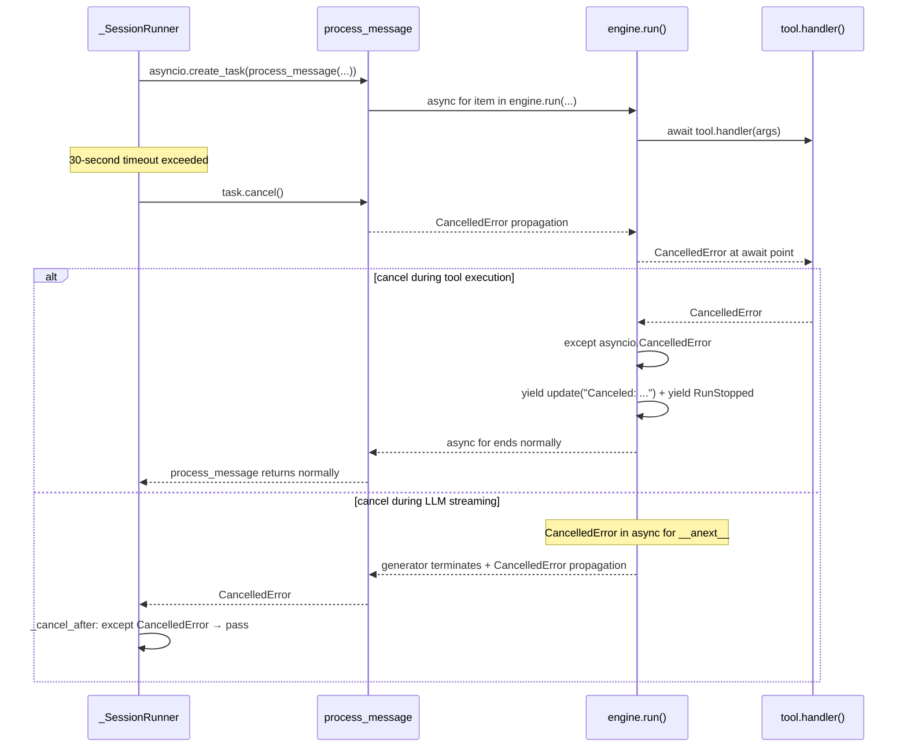

# Run Resume Phase 3 — Timeout + Cancel

[Design document](./failed-260716-failed-retry-to-turn.md) · [Implementation plan](./run-resume-impl-plan.md) · [Phase 1](./run-resume-phase1.md) · [Phase 2](./run-resume-phase2.md)

## Overview

Phases 1~2 built the path where check_stop detects shutdown between tools and stops cleanly. However, check_stop works only **between tools**. If LLM is streaming or a long-running tool is executing, check_stop itself is not called and engine.run() can wait indefinitely.

Phase 3 applies a **30-second timeout** after SIGTERM and forcibly stops engine.run() that does not complete in time with `asyncio.Task.cancel()`. For cancelled tools, save `"Canceled: ..."` output so that LLM can judge situation on resume.

### Change items

| # | Item | File |
|---|------|------|
| 1 | shutdown timeout mechanism in `_SessionRunner` | `worker/engine.py` |
| 2 | `except asyncio.CancelledError` in tool execution loop | `engine/engine.py` |
| 3 | verify LLM streaming cancel behavior (no change needed) | `engine/engine.py` |

## Target Files

| File (relative to nointern) | Absolute path |
|------|-----------|
| `worker/engine.py` | `python/apps/nointern/src/nointern/worker/engine.py` |
| `engine/engine.py` | `python/apps/nointern/src/nointern/engine/engine.py` |

---

## 1. Add shutdown timeout mechanism to `_SessionRunner`

### File: `worker/engine.py`

Change current structure directly awaiting `process_message` in `_SessionRunner._loop()` to wrap engine execution in `asyncio.Task` and switch to 30-second timeout when shutdown is detected.

### 1-1. Add constant

Add shutdown timeout constant immediately below `_MAX_BACKOFF` constant.

#### Current code

```python
_INITIAL_BACKOFF = 0.1  # seconds
_MAX_BACKOFF = 30.0  # seconds
```

#### After change

```python
_INITIAL_BACKOFF = 0.1  # seconds
_MAX_BACKOFF = 30.0  # seconds
_SHUTDOWN_TIMEOUT = 30.0  # seconds — wait time for engine.run() completion after SIGTERM
```

### 1-2. Add `_run_with_timeout` method to `_SessionRunner`

Place after `_make_check_stop_fn()` and before `shutdown()` method.

#### Code to add

```python
    async def _run_with_timeout(
        self,
        message: SessionMessage,
        adapter: InterfaceAdapter | None,
    ) -> None:
        """Wrap engine execution with shutdown timeout.

        Normal: wait for engine task completion
        After SIGTERM: 30-second wait_for → task.cancel() on timeout

        In most cases, check_stop detects shutdown between tools and exits
        normally within 30 seconds. This timeout is safety for edge cases
        during LLM streaming or long-running tool execution.
        """
        engine_coro = self._host.process_message(
            message,
            poll_fn=self._make_poll_fn(),
            check_stop=self._make_check_stop_fn(),
            adapter=adapter,
        )
        engine_task = asyncio.create_task(engine_coro)

        if self._host.shutdown_event.is_set():
            # Already shutting down — apply timeout immediately
            await self._cancel_after(engine_task, timeout=_SHUTDOWN_TIMEOUT)
        else:
            # Normal execution, switch to timeout when shutdown is detected
            shutdown_waiter = asyncio.create_task(
                self._host.shutdown_event.wait()
            )
            done, _ = await asyncio.wait(
                [engine_task, shutdown_waiter],
                return_when=asyncio.FIRST_COMPLETED,
            )

            if engine_task in done:
                # engine completed first — clean up shutdown waiter
                shutdown_waiter.cancel()
                # propagate engine task exception if any
                engine_task.result()
            else:
                # shutdown occurred — switch to 30-second timeout
                logger.info(
                    "Shutdown detected during engine run, applying timeout",
                    extra={
                        "session_id": message.session_id,
                        "timeout": _SHUTDOWN_TIMEOUT,
                    },
                )
                await self._cancel_after(
                    engine_task, timeout=_SHUTDOWN_TIMEOUT
                )

    async def _cancel_after(
        self, task: asyncio.Task[None], *, timeout: float
    ) -> None:
        """Apply timeout to task and cancel when exceeded.

        :param task: target asyncio task
        :param timeout: wait time (seconds)
        """
        try:
            await asyncio.wait_for(asyncio.shield(task), timeout=timeout)
        except asyncio.TimeoutError:
            logger.warning(
                "Engine task timed out after shutdown, canceling",
                extra={"timeout": timeout},
            )
            task.cancel()
            try:
                await task
            except asyncio.CancelledError:
                pass
```

### 1-3. Change `_loop()` — replace `process_message` call with `_run_with_timeout`

#### Current code — message handling inside `_loop()`

```python
                try:
                    if isinstance(message, SessionCommand):
                        await self._host.process_command(
                            message, adapter=self._current_adapter
                        )
                    elif isinstance(message, SessionStopRequest):
                        pass  # stop requests are handled through check_stop callback
                    else:
                        await self._host.process_message(
                            message,
                            poll_fn=self._make_poll_fn(),
                            check_stop=self._make_check_stop_fn(),
                            adapter=self._current_adapter,
                        )
```

#### After change

```python
                try:
                    if isinstance(message, SessionCommand):
                        await self._host.process_command(
                            message, adapter=self._current_adapter
                        )
                    elif isinstance(message, SessionStopRequest):
                        pass  # stop requests are handled through check_stop callback
                    else:
                        await self._run_with_timeout(
                            message, adapter=self._current_adapter
                        )
```

### Design decision: `asyncio.shield` + `wait_for` combination

Reason to use `asyncio.wait_for(asyncio.shield(task), timeout)` in `_cancel_after`:

1. Using only `wait_for` — on timeout, it immediately cancels task. But because we pass an **externally managed task**, if `wait_for` cancels internally, task reference and actual state can mismatch.
2. Wrapping with `shield` — even when `TimeoutError` occurs from `wait_for`, original task is not cancelled. Then explicitly clean up with `task.cancel()` → `await task`.
3. As a result, cancel timing can be fully controlled.

### Exception propagation in `_run_with_timeout`

`engine_task.result()` call is key:

- engine completes normally: `result()` returns None (return type of process_message is None)
- engine raises exception: `result()` re-raises that exception → caught by `_loop()`'s `except Exception`

In `_cancel_after` path:
- completes within 30 seconds: `wait_for` returns normally (propagates exception if any)
- cancel after 30-second timeout: `task.cancel()` → catch `CancelledError` from `await task` → normal exit. engine internally handles CancelledError (see change 2).

### Why timeout is not applied to `SessionCommand`

`SessionCommand` (slash command, e.g. `/compact`) has:

1. short execution time — compaction is max and completes with one LLM call
2. not subject to resume — command is not `SessionMessage`, so re-enqueue logic does not apply
3. no FC structure to store "Canceled: ..." output on cancel

Therefore command is directly awaited as before, waiting for natural completion. K8s `terminationGracePeriodSeconds: 60` is final safety net.

---

## 2. Add `except asyncio.CancelledError` to tool execution loop

### File: `engine/engine.py`

Catch `CancelledError` in tool execution loop, save `"Canceled: ..."` output, and yield `RunStopped`. Place immediately below `except ShutdownInterruptError` added in Phase 2.

### 2-1. Existing tool execution loop (around line 539)

#### Current code

```python
            # 5. Execute each tool → yield result as update Emit
            for fc_item in function_calls:
                # check interruption request between individual tool calls too
                if check_stop is not None and await check_stop():
                    yield ephemeral(RunStopped(usage=usage))
                    return
                tool = tool_map.get(fc_item.tool_call.name)
                tool_attachments: list[Attachment] = []
                tool_images: list[ImageSource] = []
                if tool is None:
                    result_text = f"Error: unknown tool '{fc_item.tool_call.name}'"
                else:
                    try:
                        raw_result = await tool.handler(fc_item.tool_call.arguments)
                    except ShutdownInterruptError:
                        # tool detected shutdown → do not save output → rerun on resume
                        yield ephemeral(RunStopped(usage=usage))
                        return
                    except FunctionToolError as exc:
                        raw_result = f"Error: {exc}"
                    except Exception:
                        logger.exception(
                            "Unhandled tool error",
                            extra={
                                "tool_name": fc_item.tool_call.name,
                                "session_id": sid,
                            },
                        )
                        raw_result = (
                            "Error: An unexpected error occurred"
                            f" while running '{fc_item.tool_call.name}'."
                        )
```

#### After change — add `except asyncio.CancelledError`

```python
            # 5. Execute each tool → yield result as update Emit
            for fc_item in function_calls:
                # check interruption request between individual tool calls too
                if check_stop is not None and await check_stop():
                    yield ephemeral(RunStopped(usage=usage))
                    return
                tool = tool_map.get(fc_item.tool_call.name)
                tool_attachments: list[Attachment] = []
                tool_images: list[ImageSource] = []
                if tool is None:
                    result_text = f"Error: unknown tool '{fc_item.tool_call.name}'"
                else:
                    try:
                        raw_result = await tool.handler(fc_item.tool_call.arguments)
                    except ShutdownInterruptError:
                        # tool detected shutdown → do not save output → rerun on resume
                        yield ephemeral(RunStopped(usage=usage))
                        return
                    except asyncio.CancelledError:
                        # canceled by 30-second timeout → record honestly
                        logger.warning(
                            "Tool execution canceled due to shutdown timeout",
                            extra={
                                "tool_name": fc_item.tool_call.name,
                                "session_id": sid,
                            },
                        )
                        result_text = (
                            "Canceled: tool execution was interrupted"
                            " by server shutdown. The operation may"
                            " have partially completed."
                        )
                        updated = dataclasses.replace(
                            fc_item,
                            output=FunctionCallOutput(content=result_text),
                        )
                        yield update(updated)
                        yield ephemeral(RunStopped(usage=usage))
                        return
                    except FunctionToolError as exc:
                        raw_result = f"Error: {exc}"
                    except Exception:
                        logger.exception(
                            "Unhandled tool error",
                            extra={
                                "tool_name": fc_item.tool_call.name,
                                "session_id": sid,
                            },
                        )
                        raw_result = (
                            "Error: An unexpected error occurred"
                            f" while running '{fc_item.tool_call.name}'."
                        )
```

### 2-2. Resume branch tool execution loop (around line 291)

Add identical `except asyncio.CancelledError` in resume branch.

#### Current code

```python
                    else:
                        try:
                            raw_result = await tool.handler(fc_item.tool_call.arguments)
                        except ShutdownInterruptError:
                            # subagent etc. detected shutdown → do not save output
                            yield ephemeral(RunStopped(usage=None))
                            return
                        except FunctionToolError as exc:
                            raw_result = f"Error: {exc}"
                        except Exception:
                            logger.exception(
                                "Unhandled tool error during resume",
                                extra={
                                    "tool_name": fc_item.tool_call.name,
                                    "session_id": sid,
                                },
                            )
                            raw_result = (
                                "Error: An unexpected error occurred"
                                f" while running '{fc_item.tool_call.name}'."
                            )
```

#### After change

```python
                    else:
                        try:
                            raw_result = await tool.handler(fc_item.tool_call.arguments)
                        except ShutdownInterruptError:
                            # subagent etc. detected shutdown → do not save output
                            yield ephemeral(RunStopped(usage=None))
                            return
                        except asyncio.CancelledError:
                            # canceled by 30-second timeout → record honestly
                            logger.warning(
                                "Tool execution canceled due to shutdown"
                                " timeout during resume",
                                extra={
                                    "tool_name": fc_item.tool_call.name,
                                    "session_id": sid,
                                },
                            )
                            result_text = (
                                "Canceled: tool execution was interrupted"
                                " by server shutdown. The operation may"
                                " have partially completed."
                            )
                            updated = dataclasses.replace(
                                fc_item,
                                output=FunctionCallOutput(content=result_text),
                            )
                            yield update(updated)
                            yield ephemeral(RunStopped(usage=None))
                            return
                        except FunctionToolError as exc:
                            raw_result = f"Error: {exc}"
                        except Exception:
                            logger.exception(
                                "Unhandled tool error during resume",
                                extra={
                                    "tool_name": fc_item.tool_call.name,
                                    "session_id": sid,
                                },
                            )
                            raw_result = (
                                "Error: An unexpected error occurred"
                                f" while running '{fc_item.tool_call.name}'."
                            )
```

### Add import

Add `asyncio` to import section of `engine/engine.py`.

#### Current code

```python
import base64
import dataclasses
import logging
from collections.abc import AsyncIterator
```

#### After change

```python
import asyncio
import base64
import dataclasses
import logging
from collections.abc import AsyncIterator
```

### Why except order matters

```
ShutdownInterruptError  ← first: do not save output (rerun on resume)
asyncio.CancelledError  ← second: save "Canceled: ..." output
FunctionToolError       ← third: deliver error to agent
Exception               ← last: generic error message
```

`CancelledError` is subclass of `BaseException` in Python 3.9+ and is **not** subclass of `Exception`. Therefore it is not caught by `except Exception`. But explicit order is kept because:

1. **Intent clarity** — reader can immediately see cancel handling exists
2. **Distinguish ShutdownInterruptError vs CancelledError** — both shutdown-related but handled differently:
   - `ShutdownInterruptError`: tool voluntarily detected → output=None (rerun)
   - `CancelledError`: externally forced by 30-second timeout → "Canceled: ..." (LLM judgement)

### "Canceled: ..." vs output=None — why handle differently

| | output=None (ShutdownInterruptError) | "Canceled: ..." (CancelledError) |
|---|---|---|
| Occurrence condition | tool voluntarily detects check_stop/shutdown | externally forced cancel by 30-second timeout |
| partial completion possibility | low — no side effect at detection point | high — cancel during execution, half-written file, etc. |
| Resume behavior | `_find_pending_function_calls` reruns | LLM sees cancel result and judges (retry/adapt) |
| Non-idempotent tool safety | safe — not executed, so rerun OK | risky — blind rerun can duplicate execution |

If a non-idempotent tool (e.g. `send_email`, `create_issue`) is half-executed and left with `output=None`, resume blindly reruns and can send email twice. Recording `"Canceled: ..."` output lets LLM understand it may have partially completed and respond appropriately.

---

## 3. LLM streaming cancel handling

### File: `engine/engine.py` (no change needed)

If `CancelledError` occurs during LLM streaming, current code handles it naturally. This section explains why no separate code change is needed.

### LLM streaming code analysis

```python
            try:
                stream_event: CompletionStreamEvent
                async for stream_event in self._llm.stream(
                    CompletionRequest(...)
                ):
                    match stream_event:
                        case FunctionCallItem() as item:
                            function_calls.append(item)
                            yield durable(item)
                        # ... other event handling
            except ContextWindowExceededError:
                # ...
            except OpenAIAPIError as exc:
                # ...
```

### Points where CancelledError occurs

In `async for` loop, `CancelledError` can occur at two points:

1. **During `__anext__()` call** — while waiting for next stream event from LLM
2. **During `yield durable(item)`** — yield point of async generator

In both cases:

1. `CancelledError` is **not** subclass of `Exception`, so it is not caught by `except ContextWindowExceededError` or `except OpenAIAPIError`
2. `CancelledError` terminates async generator
3. `engine.run()` async generator also terminates
4. `_cancel_after` catches `CancelledError` from `await task` and cleans up

### Why DB state remains clean

If cancel occurs during LLM streaming:

- cancel before `yield durable(item)` → durable item is not delivered to consumer (handle_engine_event) → not saved to DB
- cancel after `yield durable(item)` → already yielded item may have been saved by consumer to DB. But `TurnCompleteEvent` has not been yielded yet, so partially saved durable items are used as context in next LLM call (no information loss)

In both cases, because there is no **pending FC(output=None)** state, resume returns empty list from `_find_pending_function_calls` and restarts from LLM call.

### Cancel after `yield durable()` — TextItem/FunctionCallItem saved without TurnCompleteEvent

In this scenario, partial items exist but no `TurnCompleteEvent`:

```
DB state:
UserInputEvent("analyze it")
TextItem("Starting analysis.")
FunctionCallItem(read_1, output=None)
FunctionCallItem(read_2, output=None)
← TurnCompleteEvent not saved, but FCs saved as durable
```

On resume, `_find_pending_function_calls` detects `[FC(read_1), FC(read_2)]` and executes them. This is ideal outcome that continues accurately while saving LLM cost.

However, if cancel happens immediately after `yield durable(TextItem)` and before `FunctionCallItem` is yielded:

```
DB state:
UserInputEvent("analyze it")
TextItem("Starting analysis.")
← FunctionCallItem not saved
```

There is no pending FC, so LLM is called again. LLM sees previous TextItem in context and continues (or regenerates). There is some wasted cost, but data integrity is preserved.

---

## Scenario Behavior Verification

### Scenario 1: SIGTERM during tool execution — completes within 30 seconds (ideal case)

```
t=0   User: "Analyze 3 files"
t=1   LLM → TextItem + FC(read_1) + FC(read_2) + FC(read_3) → DB saved
t=2   read_1 execution starts

t=5   SIGTERM
      → shutdown_event.set()
      → _run_with_timeout: asyncio.wait → shutdown_waiter completes
      → 30-second timeout starts

t=8   read_1 execution completes → output saved
      → check_stop() → True (before read_2 execution)
      → engine: RunStopped
      → process_message returns normally
      → wait_for in _cancel_after completes normally

      elapsed: 3 seconds (within 30 seconds)
      DB: FC(read_1, ✅), FC(read_2, output=None), FC(read_3, output=None)

t=9   _loop: _shutdown_stopped=True → send_resume → break → release lock
t=11  Worker B: resume → execute only read_2, read_3 → LLM → complete
```

### Scenario 2: Long-running tool execution — cancel after 30-second timeout

```
t=0   User: "Process large data"
t=1   LLM → FC(process_data) → DB saved

t=5   SIGTERM
      → 30-second timeout starts
      → check_stop is not called (process_data is blocking)

t=35  30 seconds exceeded
      → task.cancel()
      → CancelledError occurs at await point in process_data
      → except asyncio.CancelledError:
         result_text = "Canceled: tool execution was interrupted..."
         yield update(FC(process_data, output="Canceled: ..."))
         yield RunStopped

      DB: FC(process_data, output="Canceled: tool execution was interrupted...")

t=37  Worker B: resume
      → _find_pending_function_calls → [] (output is "Canceled: ...", not None)
      → LLM call — LLM sees "Canceled: ..." output and judges situation
      → LLM: "Data processing was interrupted. I will retry." → FC(process_data)
      → process_data reruns → completes normally
```

### Scenario 3: SIGTERM during LLM streaming — completes within 30 seconds

```
t=0   User: "Write report"
t=1   LLM streaming starts (thinking...)

t=10  SIGTERM
      → 30-second timeout starts

t=25  LLM response completes (within 30 seconds)
      → TextItem + FC(write_report) → DB saved
      → check_stop → True → RunStopped

      DB: FC(write_report, output=None)

t=27  Worker B: detects pending FC → execute only write_report (save LLM cost)
```

### Scenario 4: SIGTERM during LLM streaming — cancel after 30-second timeout

```
t=0   User: "Do complex analysis"
t=1   LLM streaming starts (extended thinking...)

t=5   SIGTERM
      → 30-second timeout starts

t=35  30 seconds exceeded
      → task.cancel()
      → CancelledError in async for loop
      → engine.run() async generator terminates
      → _cancel_after: await task → catch CancelledError

      DB: clean because no durable item was saved (or partially saved)

t=36  _loop: _shutdown_stopped=True → send_resume
t=38  Worker B: resume
      → no pending FC → restart from LLM call
      (LLM cost duplicated, acceptable compared to spot savings)
```

### Scenario 5: CancelledError occurs during yield update

Extreme case where CancelledError occurs at `yield update(updated)`:

```
t=0   tool execution complete → result_text generated
t=1   yield update(updated) ← cancel at this point

      Possible outcomes:
      A) cancel before yield → output not saved → rerun on resume
      B) cancel after yield → output saved → resume from next tool
```

In either case, data integrity is preserved. `yield update` is atomically saved to DB, so "half-saved" is impossible.

---

## Interaction between asyncio.CancelledError and async generator

### CancelledError propagation path



### Caution: CancelledError occurring inside except block

CancelledError can also occur while executing tool execution `except` block (e.g., `except FunctionToolError`). But these blocks are synchronous code with no `await`, so CancelledError does not occur. CancelledError occurs only at `await` points.

---

## Test Plan

### Unit Tests

#### `_run_with_timeout` tests

| Test case | Scenario | Expected result |
|---|---|---|
| normal completion | engine completes before shutdown | returns normally, shutdown_waiter canceled |
| completion within 30 seconds after shutdown | SIGTERM → engine completes at 15 seconds | returns normally |
| exceed 30 seconds after shutdown | SIGTERM → engine does not complete | task.cancel() called |
| already shutdown state | shutdown_event already set | apply timeout immediately |
| engine exception propagation | RuntimeError from engine | RuntimeError propagates to _loop |

#### `_cancel_after` tests

| Test case | Scenario | Expected result |
|---|---|---|
| completion within timeout | task completes at 10 seconds (timeout=30) | returns normally |
| timeout exceeded | task does not complete (timeout=0.1) | task.cancel() + catch CancelledError |
| task exception | ValueError from task | ValueError propagates |

#### Tool `CancelledError` tests

| Test case | Scenario | Expected result |
|---|---|---|
| tool cancel — existing loop | CancelledError from handler | save "Canceled: ..." output + RunStopped |
| tool cancel — resume loop | CancelledError from handler during resume | save "Canceled: ..." output + RunStopped |
| cancel output contents | CancelledError occurs | output includes "Canceled: tool execution was interrupted..." |
| re-enqueue after cancel | CancelledError → RunStopped → _shutdown_stopped=True | send_resume called |

#### LLM cancel tests

| Test case | Scenario | Expected result |
|---|---|---|
| cancel during LLM streaming | CancelledError in async for | engine.run() generator ends, only partial items in DB |
| partial durable save | cancel after TextItem yield | TextItem in DB, no FunctionCallItem |

### Integration Tests

| Test case | Scenario | Expected result |
|---|---|---|
| full timeout flow | SIGTERM → 30 seconds → cancel → resume | stored as "Canceled: ..." output, new worker restarts from LLM |
| normal stop within timeout | SIGTERM → check_stop detected (5 seconds) | no cancel, resume with pending FC |
| repeated SIGTERM | Worker B receives SIGTERM again during resume → cancel after 30 seconds | Worker C continues processing |

---

## Timeline Summary — behavior within K8s 60-second grace period

```
t=0    SIGTERM
t=0    shutdown_event.set()
t=0    check_stop path: detect between tools → can stop immediately
       _run_with_timeout: 30-second timeout starts

t=0~30 wait for engine.run() completion
       - most cases: check_stop detects between tools → exits within ~seconds
       - during LLM streaming: if completes within 30 seconds → save FC + check_stop
       - long-running tool: if completes within 30 seconds → save output + check_stop

t=30   (if incomplete) task.cancel()
       - tool cancel: save "Canceled: ..." output
       - LLM cancel: DB clean

t=30~  send_resume + release_lock + exit
       - re-enqueue: ~1 second
       - lock release: ~1 second
       - process exits

t=60   K8s SIGKILL (should not be reached)
```

30-second timeout + 30-second margin = safely exits within K8s 60-second grace period.
