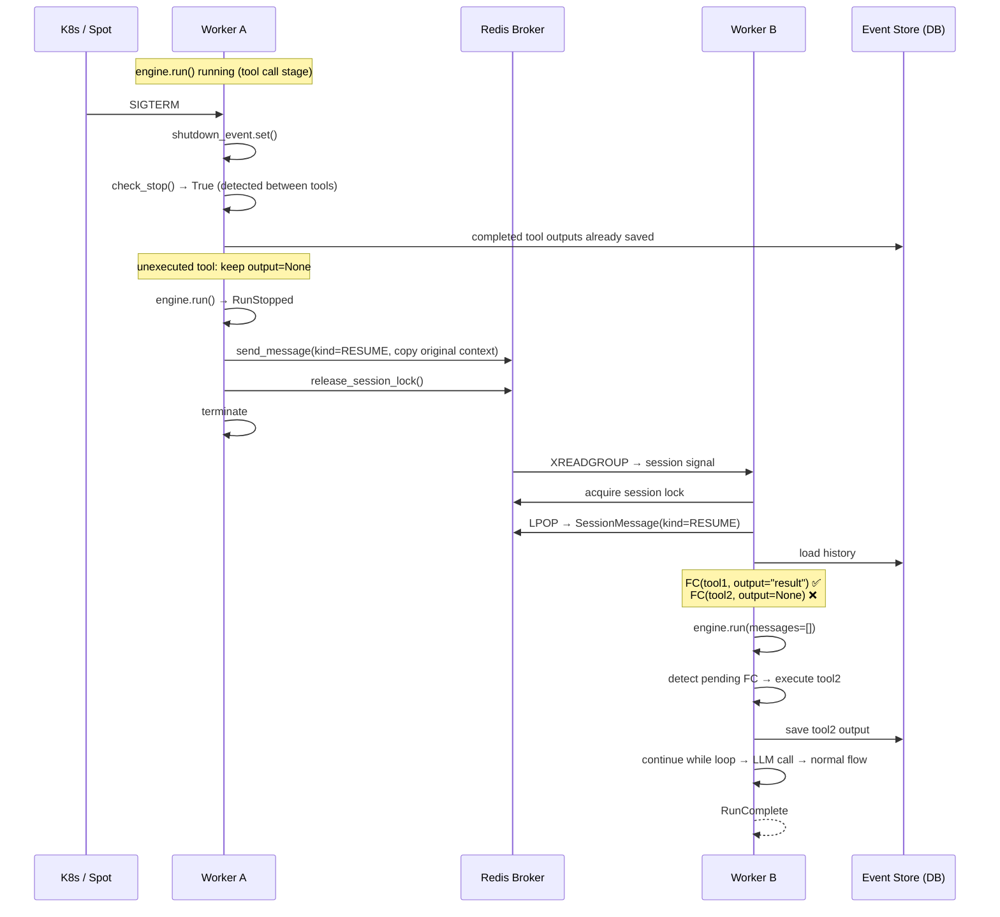
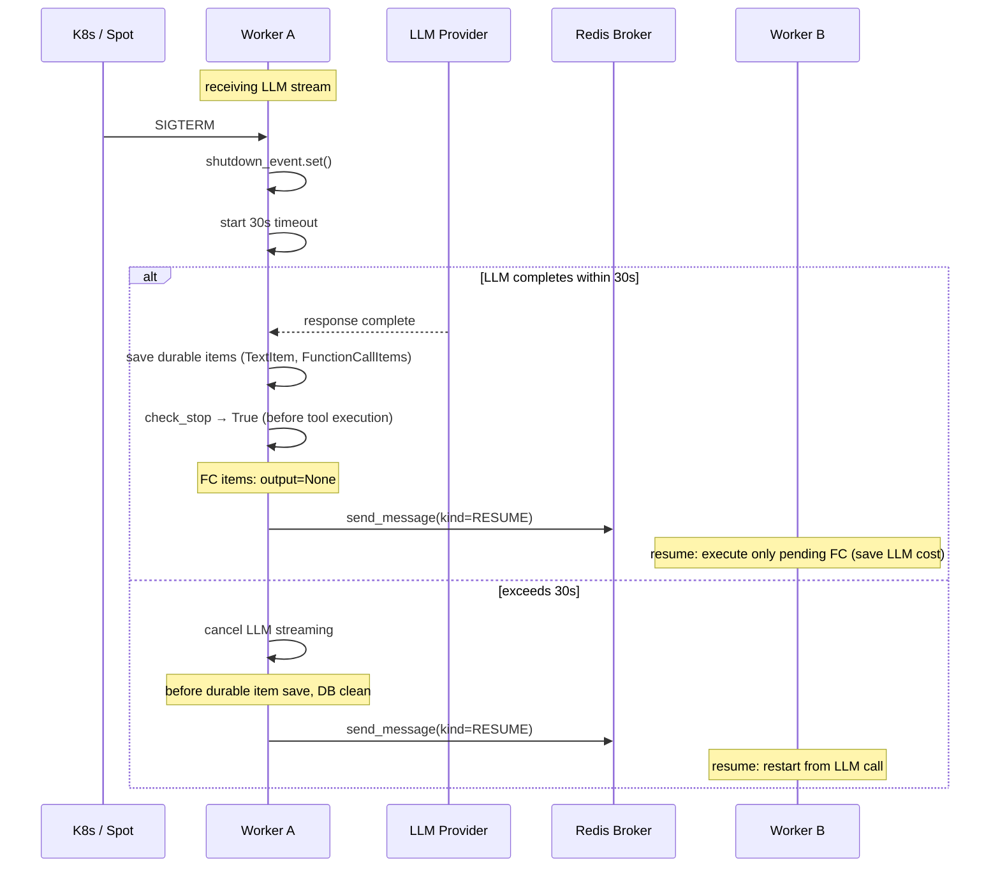
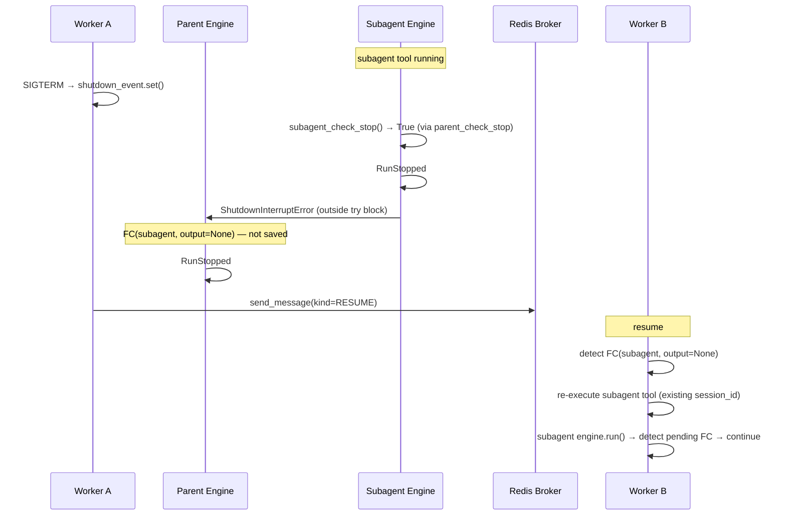

# Run Resume Design

## Overview

When SIGTERM occurs due to Worker deploy or spot instance reclamation, safely stop running agent run and let another worker resume processing.

### Motivation

In current architecture, if worker receives SIGTERM while running `engine.run()`:

1. **shutdown is not propagated to check_stop** — `_make_check_stop_fn()` checks only `SessionStopRequest` and ignores `shutdown_event`.
2. **Waits indefinitely until engine.run() naturally exits** — LLM call + tool execution can take several minutes.
3. **SIGKILL after K8s grace period expires** — data loss and interruption without notifying user.

Because worker runs on spot instances, **safe termination within 60 seconds must be guaranteed**.

### Change Summary

| | Current | Run Resume |
|---|---|---|
| engine.run() on SIGTERM | wait for natural completion (unbounded) | 30s timeout → cancel + resume |
| Interrupted run | lost | another worker resumes processing |
| check_stop | SessionStopRequest only | + shutdown_event detection |
| _SessionRunner → EngineWorker | direct dependency on concrete class | SessionHost Protocol |
| tool execution cancel | none | save "Canceled: ..." output |

## Discussion Points and Decisions

### 1. How to propagate shutdown through check_stop

**Decision: separate interface with `SessionHost` Protocol**

Clean up structure where `_SessionRunner` directly depends on concrete `EngineWorker` class into Protocol. Expose `shutdown_event` as Protocol property.

**Options:**
- A) Access private `worker._shutdown_event` → use existing structure, minimal change
- B) explicitly pass only shutdown_event → dependency is clearer but improvement is partial
- **C) Separate entire interface with SessionHost Protocol** → adopted

**Rationale:** `_SessionRunner` already depends on about 10 worker methods such as `process_message`, `create_adapter`, `dispatch_event`, `broker.*`. Splitting whole interface into Protocol naturally enables shutdown_event access and makes mock injection easier in tests.

### 2. Location of Engine resume logic

**Decision: inside engine.run() while loop**

Detect pending FC (`output=None`) at beginning of while loop in `engine.run()` and execute it.

**Options:**
- **A) inside engine.run()** → adopted
- B) worker runs external resume-only flow

**Rationale:** Detailed tool execution logic (truncation, FunctionToolError handling, image buffering, emit pattern) is already implemented inside engine.run(). Handling outside would require reimplementing this logic and maintaining two locations when tool execution logic changes later.

### 3. Subagent interruption handling

**Decision: generic `ShutdownInterruptError` pattern**

When subagent (or long-running tool) detects shutdown, it raises `ShutdownInterruptError` so parent engine does not save output.

**Options:**
- **A) ShutdownInterruptError** → adopted
- B) leave to LLM (return partial result)

**Rationale:** If partial result is returned, there is no guarantee LLM will call subagent again, causing nondeterministic loss of work. Keeping output as None through ShutdownInterruptError makes resume deterministically re-execute.

### 4. Resume message type

**Decision: add `kind: SessionMessageKind` enum to existing `SessionMessage`**

**Options:**
- A) new type `SessionResumeRequest` → almost same fields as SessionMessage, duplicate
- **B) add kind enum to SessionMessage** → adopted
- C) stream signal only → requires DB lookup, difficult to restore interface context

**Rationale:** Resume also needs all SessionMessage fields such as agent_id, session_id, interface context, so structure is same. Use enum rather than boolean for extensibility.

### 5. Adapter restoration

**Decision: naturally solved by reusing SessionMessage**

Because SessionMessage is reused, copying original message with `kind=RESUME` on interruption automatically carries interface context. No extra work.

### 6. LLM/tool interruption strategy

**Decision: 30-second timeout after SIGTERM, different handling by state**

| Situation | Behavior | DB state | Resume |
|------|------|---------|--------|
| LLM completes within 30s | save result → check_stop → stop | FC items saved (output=None) | execute only pending FC (save LLM cost) |
| LLM exceeds 30s and is canceled | no durable item saved, DB clean | before LLM call | restart from LLM call |
| Tool completes within 30s | save output → next tool check_stop | normal output | from next unexecuted tool |
| Tool exceeds 30s and is canceled | save `"Canceled: ..."` output | cancel result recorded | LLM sees cancel result and decides |
| check_stop before tool execution | keep output=None | unexecuted | resume executes |

**Options:**
- A) wait for LLM completion + grace period 120s → violates spot 60s constraint
- B) cancel immediately → throws away nearly finished LLM results
- **C) 30s timeout + state-specific handling** → adopted

**Rationale:** Spot instance must terminate within 60s. 30s covers most LLM responses and tool executions while leaving 30s for cleanup (re-enqueue, lock release). LLM cancel cost waste is small compared with spot savings and low frequency. Canceled tool is stored as `"Canceled: ..."` rather than output=None to avoid blind re-execution of non-idempotent tools.

### 7. K8s deployment setting

**Decision: `terminationGracePeriodSeconds: 60`, PDB `maxUnavailable: 25%`**

**Options:**
- A) PDB `maxUnavailable: 1` → slow deploy, inefficient as worker count increases
- **B) PDB `maxUnavailable: 25%`** → adopted

preStop hook is unnecessary because this is Redis consumer, not endpoint routing.

## Architecture

### Full SIGTERM → Resume Flow



### SIGTERM During LLM Call



### SIGTERM During Subagent



## SessionHost Protocol

Interface `_SessionRunner` depends on instead of concrete `EngineWorker`.

```python
class SessionHost(Protocol):
    """Worker interface depended on by _SessionRunner."""

    @property
    def shutdown_event(self) -> asyncio.Event:
        """Global shutdown event set by SIGTERM."""
        ...

    async def process_message(
        self,
        message: SessionMessage,
        *,
        poll_fn: PollMessages,
        check_stop: CheckStop,
        adapter: InterfaceAdapter | None,
    ) -> None:
        """Process message (resolve → engine.run → emit)."""
        ...

    async def process_command(
        self,
        command: SessionCommand,
        *,
        adapter: InterfaceAdapter | None,
    ) -> None:
        """Process slash command."""
        ...

    async def create_adapter(
        self, message: SessionMessage
    ) -> InterfaceAdapter | None:
        """Create interface-specific adapter."""
        ...

    async def dispatch_event(
        self,
        session_id: str,
        event: EngineEvent | DurableEvent,
        adapter: InterfaceAdapter | None,
    ) -> None:
        """Publish event."""
        ...

    async def save_error_message(
        self,
        session_id: str,
        error: str,
        *,
        model: str | None,
    ) -> None:
        """Save error message."""
        ...

    async def release_session_lock(self, session_id: str) -> None:
        """Release session lock."""
        ...

    async def clear_session_activity(self, session_id: str) -> None:
        """Delete session activity record."""
        ...

    async def record_discord_bot_messages(
        self, message: SessionMessage
    ) -> None:
        """Record Discord bot message IDs."""
        ...
```

`EngineWorker` implements this Protocol, and `_SessionRunner` depends only on `SessionHost`. Broker chaining (`worker.broker.release_session_lock`) is promoted to `SessionHost` method (`release_session_lock`) to hide internal structure.

## SessionMessageKind

```python
class SessionMessageKind(enum.StrEnum):
    """Kind of session message."""
    USER = "user"       # normal user message
    RESUME = "resume"   # resume after shutdown interruption


@dataclasses.dataclass(frozen=True)
class SessionMessage:
    agent_id: str
    session_id: str
    messages: list[InputMessage]
    # ... existing fields ...
    kind: SessionMessageKind = SessionMessageKind.USER
```

When `kind=RESUME`:
- `messages` is empty list.
- worker skips saving user messages and calls `engine.run(messages=[])`.
- engine detects pending FC and resumes.

## ShutdownInterruptError

```python
class ShutdownInterruptError(Exception):
    """Raised by tool when it detects shutdown to prevent output save.

    Caught in tool execution loop of engine.run() and emits RunStopped.
    Generic pattern, not subagent-specific — any tool raising this exception
    on shutdown is not saved as output and is re-executed on resume.
    """
```

## Engine Resume Logic

### pending FC detection

```python
# engine/engine.py — AgentEngine

def _find_pending_function_calls(
    self, history: list[SessionEvent],
) -> list[FunctionCallItem]:
    """Find FunctionCallItems with output=None at end of history.

    Returns only unexecuted tool calls from last turn.
    Reverse scan uses TurnCompleteEvent as boundary to determine current turn range.
    """
    pending: list[FunctionCallItem] = []
    for event in reversed(history):
        if isinstance(event, FunctionCallItem):
            if event.output is None:
                pending.append(event)
        elif isinstance(event, (TextItem, ReasoningItem)):
            continue  # text/reasoning from same turn
        elif isinstance(event, TurnCompleteEvent):
            break  # turn boundary
        else:
            break
    pending.reverse()
    return pending
```

### while loop change

```python
# engine/engine.py — AgentEngine.run()

async def run(self, request: RunRequest, ...) -> AsyncIterator[Emit]:
    sid = request.session_id
    tool_map = {t.spec.name: t for t in request.tools}

    # save user messages (skip if empty on resume)
    if request.messages:
        await self._store.append(sid, request.messages, model=request.model)

    while True:
        history = await self._store.list(sid)

        # ── pending FC resume ──
        pending_fcs = self._find_pending_function_calls(history)
        if pending_fcs:
            for fc_item in pending_fcs:
                if check_stop is not None and await check_stop():
                    yield ephemeral(RunStopped(usage=Usage.empty()))
                    return
                # tool execution (same logic as existing _execute_tool)
                result_text, attachments, images = await self._execute_tool(
                    fc_item, tool_map,
                )
                updated = dataclasses.replace(
                    fc_item,
                    output=FunctionCallOutput(
                        content=result_text,
                        attachments=attachments,
                        images=images,
                    ),
                )
                yield update(updated)

            if poll_messages:
                new_msgs = await poll_messages()
                if new_msgs:
                    await self._store.append(sid, new_msgs, model=request.model)
            continue  # → history reload → LLM call

        # ── existing logic ──
        # token estimation → compaction → LLM call → tool execution
        ...
```

## Shutdown Timeout Mechanism

### check_stop change

```python
# worker/engine.py — _SessionRunner

def _make_check_stop_fn(self) -> CheckStop:
    """check_stop callback injected into engine.run()."""

    async def check_stop() -> bool:
        # 1) drain SessionStopRequest from queue (existing)
        temp: list[BrokerMessage] = []
        while not self._queue.empty():
            try:
                msg = self._queue.get_nowait()
            except asyncio.QueueEmpty:
                break
            if isinstance(msg, SessionStopRequest):
                self._stop_requested.set()
            else:
                temp.append(msg)
        for msg in temp:
            self._queue.put_nowait(msg)

        if self._stop_requested.is_set():
            return True

        # 2) detect shutdown (new)
        if self._host.shutdown_event.is_set():
            self._shutdown_stopped = True
            return True

        return False

    return check_stop
```

### 30-second timeout + cancel

Wrap engine.run() with `asyncio.wait`, then apply 30-second timeout after shutdown detection.

```python
# worker/engine.py — _SessionRunner._loop()

# wrap engine.run() call with timeout
engine_task = asyncio.create_task(
    self._run_engine(message, poll_fn, check_stop, adapter)
)

if self._host.shutdown_event.is_set():
    # already shutting down — apply timeout immediately
    await self._cancel_after(engine_task, timeout=_SHUTDOWN_TIMEOUT)
else:
    # normal execution, switch to timeout when shutdown detected
    shutdown_task = asyncio.create_task(self._host.shutdown_event.wait())
    done, _ = await asyncio.wait(
        [engine_task, shutdown_task],
        return_when=asyncio.FIRST_COMPLETED,
    )
    if shutdown_task in done and not engine_task.done():
        # shutdown occurred — switch to 30s timeout
        await self._cancel_after(engine_task, timeout=_SHUTDOWN_TIMEOUT)

async def _cancel_after(self, task: asyncio.Task, *, timeout: float) -> None:
    """Apply timeout to task and cancel if exceeded."""
    try:
        await asyncio.wait_for(asyncio.shield(task), timeout=timeout)
    except asyncio.TimeoutError:
        task.cancel()
        try:
            await task
        except asyncio.CancelledError:
            pass
```

### Save output on tool cancel

```python
# engine/engine.py — tool execution loop

for fc_item in function_calls:
    if check_stop is not None and await check_stop():
        yield ephemeral(RunStopped(usage=usage))
        return

    try:
        raw_result = await tool.handler(fc_item.tool_call.arguments)
    except ShutdownInterruptError:
        # subagent etc. detected shutdown → do not save output
        yield ephemeral(RunStopped(usage=usage))
        return
    except asyncio.CancelledError:
        # canceled by 30s timeout → record honestly
        result_text = (
            "Canceled: tool execution was interrupted by server shutdown. "
            "The operation may have partially completed."
        )
        updated = dataclasses.replace(
            fc_item,
            output=FunctionCallOutput(content=result_text),
        )
        yield update(updated)
        yield ephemeral(RunStopped(usage=usage))
        return
    except FunctionToolError as exc:
        raw_result = f"Error: {exc}"
    except Exception:
        logger.exception("Unhandled tool error", ...)
        raw_result = "Error: An unexpected error occurred..."

    # save normal result (existing logic)
    ...
```

### Tool cancel vs unexecuted vs ShutdownInterruptError

| Situation | output value | resume behavior |
|------|-----------|-------------|
| unexecuted due to check_stop | `None` | `_find_pending_function_calls` detects → execute |
| ShutdownInterruptError | `None` | same — re-execute |
| 30s cancel | `"Canceled: ..."` | LLM sees cancel result and decides (retry/adapt) |
| normal completion | actual result | skip |

## Subagent Shutdown Handling

### SubagentToolContext change

```python
@dataclasses.dataclass(frozen=True)
class SubagentToolContext:
    # ... existing fields ...
    parent_check_stop: CheckStop | None = None
    shutdown_event: asyncio.Event | None = None  # new
```

### Handler change

```python
# engine/tools/subagent.py — handler

try:
    async for item in ctx.engine.run(
        run_request, check_stop=subagent_check_stop
    ):
        await handle_engine_event(item, ...)
        collect_event_result(item.event, result_texts, result_attachments)
except Exception:
    logger.exception("Subagent engine run failed", ...)
    result_texts.append("Error: ...")

# ── shutdown detection: outside try block (avoid except Exception) ──
if ctx.shutdown_event is not None and ctx.shutdown_event.is_set():
    raise ShutdownInterruptError(
        f"Subagent '{agent_name}' interrupted by worker shutdown"
    )

# normal: emit SubagentEnd + return (existing logic)
...
```

Because this is after `except Exception` block, it is not caught. When engine.run() stops by check_stop, async for exits normally (not exception), so it proceeds to shutdown_event check.

## Worker Shutdown Flow

### _SessionRunner._loop() change

```python
async def _loop(self) -> None:
    try:
        while True:
            # wait for message or shutdown (existing)
            ...

            # process message
            try:
                if isinstance(message, SessionCommand):
                    await self._host.process_command(message, adapter=...)
                elif isinstance(message, SessionStopRequest):
                    pass
                else:
                    await self._host.process_message(
                        message, poll_fn=..., check_stop=..., adapter=...,
                    )
            except ...:
                ...

            # ── interrupted by shutdown: re-enqueue ──
            if self._shutdown_stopped and isinstance(message, SessionMessage):
                resume_msg = dataclasses.replace(
                    message,
                    kind=SessionMessageKind.RESUME,
                    messages=[],
                )
                await self._host.send_resume(resume_msg)
                break
    finally:
        if self._current_session_id:
            await self._host.clear_session_activity(self._current_session_id)
            await self._host.release_session_lock(self._current_session_id)
```

## Timeline Examples

### SIGTERM during tool execution (ideal case)

```
t=0   User: "Analyze 3 files"
t=1   LLM → TextItem + FC(read_1) + FC(read_2) + FC(read_3) → DB save
t=2   TurnCompleteEvent → DB save
t=3   read_1 execution complete → save output
t=4   read_2 execution complete → save output

t=5   ⚡ SIGTERM
      → shutdown_event.set()
      → check_stop() True (before read_3 execution)
      → engine: RunStopped
      → re-enqueue(kind=RESUME) + release lock + terminate

      DB: FC(read_1, ✅), FC(read_2, ✅), FC(read_3, output=None)

t=7   Worker B: receive resume
      → engine.run(messages=[])
      → detect pending FC: [FC(read_3)]
      → execute read_3 → save output
      → LLM call → normal completion
```

### SIGTERM during LLM call (completes within 30s)

```
t=0   User: "Write a report"
t=1   LLM streaming starts (thinking...)

t=10  ⚡ SIGTERM
      → shutdown_event.set()
      → start 30s timeout

t=25  LLM response complete (within 30s)
      → TextItem + FC(write_report) → DB save
      → check_stop → True → RunStopped
      → re-enqueue(kind=RESUME) + terminate

      DB: FC(write_report, output=None)

t=27  Worker B: detect pending FC → execute only write_report
```

### SIGTERM during LLM call (exceeds 30s)

```
t=0   User: "Do complex analysis"
t=1   LLM streaming starts (extended thinking...)

t=5   ⚡ SIGTERM
      → start 30s timeout

t=35  timeout → cancel LLM
      → before durable item save, DB clean
      → re-enqueue(kind=RESUME) + terminate

t=37  Worker B: no pending FC → restart from LLM call
      (double LLM cost accepted compared with spot savings)
```

## Security

No impact on existing security model:
- On resume, Agent Home Pod remains with EFS, so sandbox state is consistent.
- Another worker takes over only after session lock is released → prevents concurrent execution.
- SessionMessage interface context is copied from original → cannot be tampered (broker internal communication).

## Monitoring

### Metrics

| Metric | Description | Alarm criterion |
|--------|------|-----------|
| `engine_run_resumed_total` | number of resumes (counter) | sudden spike (relative to deploy frequency) |
| `engine_run_llm_canceled_total` | LLM cancels due to shutdown | cost tracking |
| `engine_run_tool_canceled_total` | tool cancels due to shutdown | frequency tracking |
| `engine_run_resume_latency_seconds` | time from resume to continuation | p99 > 30s |

### Logs

```
# shutdown detected
logger.info("Shutdown detected, stopping engine run",
    extra={"session_id": sid, "pending_tools": len(pending)})

# resume start
logger.info("Resuming interrupted run",
    extra={"session_id": sid, "pending_fcs": len(pending_fcs)})

# LLM cancel
logger.warning("LLM streaming canceled due to shutdown timeout",
    extra={"session_id": sid, "elapsed_seconds": elapsed})
```

## Related Improvements (Separate Issue)

### General LLM timeout

Current litellm default timeout is 6000 seconds (100 minutes), effectively none. Provider failure may make streaming wait indefinitely. However, thinking models can intentionally take minutes until first token, so simple total timeout cannot solve it. Separate design such as first token timeout vs total timeout split is needed.

## Infrastructure

### K8s setting change

```yaml
# Worker Deployment
spec:
  template:
    spec:
      terminationGracePeriodSeconds: 60

---
# PodDisruptionBudget
apiVersion: policy/v1
kind: PodDisruptionBudget
metadata:
  name: engine-worker-pdb
spec:
  maxUnavailable: 25%
  selector:
    matchLabels:
      app: engine-worker
```

## Implementation Plan

### Phase 1: Core Mechanism

1. Define `SessionHost` Protocol + implement in `EngineWorker`.
2. Refactor `_SessionRunner` to depend only on `SessionHost`.
3. Add `shutdown_event` detection to `check_stop`.
4. Add `SessionMessageKind` enum + `SessionMessage.kind` field.
5. Re-enqueue logic on shutdown (`kind=RESUME`).
6. Process `kind=RESUME` messages (skip user message save).

### Phase 2: Engine Resume

7. Implement `_find_pending_function_calls()`.
8. Add pending FC resume branch to `engine.run()` while loop.
9. Add `ShutdownInterruptError` + engine tool loop except branch.
10. Add `SubagentToolContext.shutdown_event` + subagent handler shutdown detection.

### Phase 3: Timeout + Cancel

11. Add 30-second shutdown timeout mechanism to `_SessionRunner`.
12. Save `"Canceled: ..."` output on `asyncio.CancelledError`.
13. Handle LLM streaming cancel.

### Phase 4: Infra + Monitoring

14. `terminationGracePeriodSeconds: 60`.
15. PDB `maxUnavailable: 25%`.
16. Add metrics + logs.

## Alternatives Considered

| Alternative | Rejection reason |
|------|-----------|
| resume outside engine.run() | duplicated tool execution logic, maintenance burden |
| new type SessionResumeRequest | almost same fields as SessionMessage, unnecessary duplication |
| allow Subagent partial result (leave to LLM) | no guarantee LLM recalls it, nondeterministic loss |
| wait until LLM completion (grace period 120s) | violates spot 60s constraint |
| cancel LLM immediately on SIGTERM | discards almost finished LLM, cost waste |
| directly reference worker._shutdown_event in check_stop | private access, strengthens _SessionRunner dependency on concrete EngineWorker |
| PDB maxUnavailable: 1 | slows deploy as worker count grows |
| preStop hook | unrelated to endpoint routing because Redis consumer, unnecessary |
