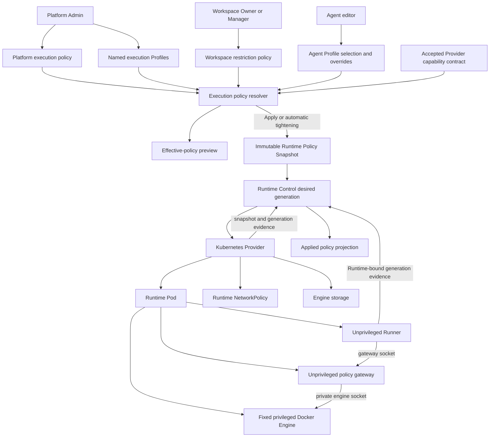

# Hierarchical Runtime Execution Profiles Design

- Snapshot: `runtime-260726`
- Requirements: [`runtime-260726/REQ`](../requirements/runtime-260726-hierarchical-execution-profiles.md)
- ADR: [`runtime-260726/ADR`](../adr/runtime-260726-hierarchical-execution-profiles.md)
- Document reference: `runtime-260726/DESIGN`

## Overview

Azents introduces a Provider-neutral Runtime execution-policy domain above the existing Runtime Provider contract, binding, configuration, and control domains. Platform policy defines the installation ceiling and publishes named Profiles. Workspace policy selects a permitted Profile subset and narrows module bounds. Agent intent selects one available Profile and adds supported restrictive overrides. Runtime application resolves these current resources into an immutable Runtime Policy Snapshot that is fenced by the existing Provider binding and desired generation.

The initial Kubernetes implementation adds a Provider-owned Docker Engine sidecar and an Azents container policy gateway to the Runtime Pod. The engine sidecar is a fixed privileged infrastructure component, while the Runner, gateway, and nested workloads remain unprivileged. The Runner sees only the gateway socket. Kubernetes NetworkPolicy is the authoritative egress boundary, and nested-engine storage is separate from the Agent Workspace.

This is a large cross-domain feature. It requires new backend policy persistence and APIs, Runtime Control protocol evidence, Kubernetes Provider resource translation, gateway and engine images, Admin and Workspace management surfaces, Agent pending/applied UX, migration, and deterministic security E2E coverage.

## Current Behavior and Gaps

The current system already provides:

- immutable Provider contract and configuration revisions;
- exact Provider selection and durable Runtime binding;
- one logical Runtime per Agent;
- immutable Runtime Policy Snapshots with source trace and application state;
- desired-generation and Provider-generation fencing;
- Provider and Runner authentication separated from Runtime payloads;
- Kubernetes Runtime Pods with no ServiceAccount token and one Agent Workspace PVC;
- stop/restart behavior that preserves the Workspace and reset behavior that may destroy it.

The current system does not provide:

- a Workspace execution-policy scope;
- named Provider-neutral execution Profiles;
- typed capability modules with monotone merge operators;
- current Platform, Workspace, and Agent execution-policy resources;
- configured, pending, target, and applied execution-policy projections;
- policy identity and digest evidence in Provider reports;
- multi-container Runtime Pod translation;
- a Docker-compatible authorization gateway;
- nested-engine storage or lifecycle;
- Runtime-specific NetworkPolicy ownership;
- execution-policy management audit.

The existing `RuntimeProviderConfigRevision` and `AgentRuntimeProviderOverride` remain Provider configuration mechanisms. They do not become the source of truth for product execution policy.

## Architecture

## Ownership Boundaries

### Product policy authority

The Azents server owns:

- capability module schemas and versions;
- validation and dependency rules;
- monotone restriction operators;
- Platform policy and named Profile definitions;
- Workspace policy and Profile availability;
- Agent intent and explicit Apply authorization;
- effective-policy resolution and change classification;
- application snapshot identity and audit.

### Provider authority

The bound Provider owns:

- declaring supported module versions and enforcement bounds;
- translating a validated effective snapshot into Provider resources;
- generating fixed implementation topology and resource names;
- observing and reporting exact applied snapshot evidence;
- lifecycle cleanup for Pod, NetworkPolicy, and engine storage.

Provider declarations cannot add product authority, reinterpret merge semantics, or accept unknown policy fields.

### Runtime boundaries

The Runner receives:

- its existing Runtime-bound Control credential;
- the effective gateway endpoint;
- Docker CLI and Compose client support when enabled;
- no Provider credential, Kubernetes token, private engine socket, or host socket.

The gateway receives:

- a Runtime-scoped gateway policy document or file generated from the applied snapshot;
- the private engine socket;
- no Provider credential or Kubernetes API authority.

The Docker Engine receives:

- its fixed Provider-owned startup configuration;
- engine-only storage and private socket volumes;
- no ServiceAccount token, Provider credential, Runner Control credential, or Agent Workspace mount.

Nested workloads receive only values, mounts, resources, and network behavior authorized by the gateway. They receive no host infrastructure or Azents control credential.

## Execution Capability Module Model

Capability definitions live in an application-owned typed catalog. Each module definition contains:

- stable module identifier;
- schema version;
- typed value schema;
- field-level validation;
- required Provider enforcement features;
- dependency rules;
- restrictive merge operator;
- authority-expansion comparison;
- application impact;
- canonical serialization and digest behavior;
- bounded user-facing descriptions and reason codes.

Unknown modules, unknown versions, extra fields, invalid dependencies, and unsupported enforcement features are rejected.

### Initial module catalog

| Module | Purpose | Restriction behavior |
| --- | --- | --- |
| `container.image_build/v1` | Permit Docker-compatible image build operations | Boolean intersection |
| `container.run/v1` | Permit creation and lifecycle of nested containers | Boolean intersection |
| `container.compose/v1` | Permit Compose project operations | Boolean intersection; requires `container.run/v1` |
| `container.resources/v1` | Bound aggregate engine, gateway, and nested-workload CPU, memory, PID, container-count, and ephemeral-storage use | Minimum applicable ceiling |
| `engine.storage/v1` | Select `none`, `ephemeral`, or bounded `persistent` engine state | More restrictive mode and minimum capacity |
| `network.egress/v1` | Define direct, restricted, proxy-required, or no optional egress and typed destination rules | Allow intersection, deny union, and no mode broadening |

A Provider may support only a subset. A Profile is available only when its required module versions and enforcement features are compatible with the Agent's selected and durably bound Provider.

### Container capability dependencies

- `container.compose/v1` requires `container.run/v1`.
- `container.run/v1` requires an enforceable resource envelope, network mode, and engine storage mode.
- `container.image_build/v1` requires an engine storage mode and resource envelope but does not imply `container.run/v1`.
- A build-only effective policy causes the gateway to reject container lifecycle and Compose endpoints even though the underlying engine implements them.

## Persistence Model

All new mutable resources use current-state rows with monotonic integer versions. They do not create an immutable revision for each edit.

### Platform execution policy

`runtime_execution_platform_policies`

- singleton stable ID;
- `version`;
- typed Platform ceiling document;
- canonical digest;
- actor and timestamps.

The Platform policy defines global module availability, maximum resource and storage bounds, allowed network policy forms, and whether privileged-engine and future rootless-engine Provider implementations are eligible.

### Execution Profiles

`runtime_execution_profiles`

- stable Profile ID;
- stable system key when reserved;
- display name and description;
- lifecycle state: active or retired;
- `version`;
- typed module document;
- canonical digest;
- reserved/system flags;
- actor and timestamps.

`system-standard` is seeded as a reserved Profile with all optional container modules disabled and no engine storage. Its authority-bearing content cannot be broadened, retired, or deleted.

Profile edits update current content in place. Restrictive changes automatically affect selected Agents. Expanding changes become pending for existing Runtimes until explicit Agent Apply.

### Workspace policy

`workspace_runtime_execution_policies`

- `workspace_id` primary key;
- `version`;
- typed Workspace restriction document;
- canonical digest;
- actor and timestamps.

`workspace_runtime_execution_profile_allowances`

- `workspace_id`;
- `profile_id`;
- composite primary key and restrictive foreign keys.

The policy and complete allowance set are replaced atomically under one expected version. A missing Workspace row resolves to the safe initial policy that allows only `system-standard`; it is materialized on the first management write or through migration/bootstrap.

### Agent intent

`agent_runtime_execution_settings`

- `agent_id` primary key;
- selected `profile_id`;
- `version`;
- typed restrictive override document;
- canonical digest;
- actor and timestamps.

Existing and new Agents receive an explicit `system-standard` row. Agent intent is independent of any physical Runtime and remains after stop, restart, reset, or Provider disconnection.

### Policy audit

`runtime_execution_policy_audit_events`

- immutable event ID and timestamp;
- event type and management layer;
- target identity and optional Workspace/Agent/Runtime IDs;
- actor user or Workspace user identity, or system authority;
- correlation ID;
- before and after canonical digests;
- changed module and field paths;
- expansion, restriction, metadata-only, or application classification;
- bounded impact counts;
- bounded reason and outcome codes;
- secret-safe metadata.

Audit events are not a rollback source and do not store credentials, tokens, private registry secrets, or complete sensitive configuration.

### Runtime Policy Snapshot extension

The existing `runtime_policy_snapshots` remains the immutable application evidence table. Add:

- `execution_profile_id`;
- Platform, Profile, Workspace, and Agent source versions;
- `resolved_execution_policy`;
- `execution_source_trace`;
- Provider module compatibility evidence;
- target and reported execution-policy digest fields when distinct from the existing aggregate digest.

The existing `agent_runtimes.runtime_policy_snapshot_id` becomes the target snapshot pointer. Add `applied_runtime_policy_snapshot_id` for the last Provider-acknowledged snapshot. Snapshot uniqueness must include target desired generation when the same effective policy is applied again; audit records individual requested and failed operations.

All migrations are additive Alembic revisions. Existing executed migrations are not modified.

## Resolution and Change Classification

### Inputs

The resolver locks or consistently reads:

1. the current Platform policy;
2. the selected current Profile;
3. the current Workspace policy and Profile allowance;
4. the current Agent restrictive overrides;
5. the Runtime's immutable Provider binding;
6. the Provider's accepted capability contract and active Provider configuration.

### Resolution algorithm

1. Validate that every input uses a known module version.
2. Validate that the Profile is active, Platform-permitted, and Workspace-allowed.
3. Apply the module-specific security meet across Platform ceiling, Profile values, Workspace restrictions, and Agent overrides.
4. Revalidate module dependencies and reject unsatisfiable results.
5. Validate the complete effective document against the bound Provider contract and enforcement bounds.
6. Produce canonical effective values, source versions, governing-layer trace, reduction reasons, Provider compatibility evidence, and digest.

The monotone operators are associative and cannot restore denied authority. A lower layer attempting expansion receives a bounded conflict identifying the governing layer and field.

### Change direction

The resolver compares the currently applied snapshot with newly resolved intent and classifies every changed field as:

- metadata-only;
- restrictive;
- authority-expanding;
- incompatible or unsatisfiable.

A mixed change automatically removes restrictive authority but does not grant any expanding field until explicit Agent Apply. Applied, pending, and unavailable projections are computed from canonical documents rather than UI heuristics.

## Management APIs

Execution policy is a separate API domain from Runtime Provider inventory.

### Admin API

System Admin routes own Platform policy and Profiles:

- get and replace Platform execution policy with `expected_version`;
- list, create, get, replace, and retire Profiles;
- preview validation, Provider compatibility, and impact before mutation;
- list metadata-only policy audit events;
- inspect affected Workspace, Agent, and Runtime counts with bounded pagination.

The Admin Web adds a `Runtime Execution` area adjacent to, but separate from, `Runtime Providers`. It presents Platform limits, Profile definitions, Provider support, change direction, impact, and convergence status.

### Workspace Public API

Workspace routes expose:

- current Workspace execution policy and version;
- compatible Platform Profiles and unavailability reasons;
- complete policy replacement with `expected_version`;
- Workspace policy audit scoped to authorized actors;
- impact preview for restrictions.

A new `runtime_execution_policy` permission resource grants read to members and write to `OWNER` and `MANAGER`. Backend authorization is mandatory; UI role checks are presentational only.

The main Web Workspace settings area presents allowed Profiles and narrower limits. It does not expose Provider credentials, implementation topology, raw NetworkPolicy, Kubernetes names, or privileged engine controls.

### Agent Public API

Agent execution settings use dedicated routes rather than the generic Agent patch:

- get configured Profile, restrictive overrides, version, effective preview, pending diff, Provider compatibility, and applied summary;
- replace Profile and overrides with `expected_version`;
- explicitly Apply current valid intent;
- inspect bounded execution-policy audit events when authorized.

Agent administrators and Workspace owners follow the existing Agent administration boundary. Saving intent never restarts the Runtime. Apply validates current intent again, creates the target snapshot, advances desired generation, and returns the resulting pending Runtime projection.

The Agent settings UI shows three separate views:

- **Configured:** current Profile and restrictive overrides;
- **Pending:** changes not yet applied or automatic convergence in progress;
- **Applied:** Provider-acknowledged snapshot and capability versions.

Unavailable Profiles remain visible only when needed to explain an existing selection; they cannot be newly selected.

### Runtime status API

The Agent Runtime response adds a safe execution-policy projection:

- configured and applied Profile identity;
- configured, pending, applied, unavailable, or divergent status;
- target and applied digests;
- desired generation;
- enabled capability names and versions;
- storage mode and bounded capacity;
- summarized network mode;
- per-field governing layer and bounded reason codes;
- restart or administrator-action requirement.

It does not expose engine credentials, private socket paths, Kubernetes resource names, secret values, or Provider implementation-sensitive diagnostics.

## Application and Convergence Lifecycle

### Agent intent save

1. Authorize Agent editor.
2. Compare `expected_version` and lock current settings.
3. Resolve and validate against current upper layers and Provider support.
4. Save current intent and increment version.
5. Append a metadata-only audit event.
6. Return configured, pending, and applied projections without dispatching lifecycle work.

An invalid expansion is rejected. An upper-layer restriction may reduce the submitted value and returns the governing reason rather than silently broadening it later.

### Explicit Agent Apply

1. Lock Agent intent, Runtime, Provider binding, and current policy inputs.
2. Resolve again to prevent time-of-check/time-of-use drift.
3. Reject unavailable or unsatisfiable intent.
4. Create the immutable target Runtime Policy Snapshot for the next desired generation.
5. Set the target snapshot pointer and advance desired generation atomically.
6. Append application audit and enqueue ordinary reconciliation.
7. Provider replaces or creates resources and reports exact policy evidence.
8. Control promotes the snapshot to applied only after Provider and Runner evidence match.

### Administrative restriction tightening

1. Mutate Platform, Profile, or Workspace current state under expected version.
2. Classify the change and append management audit.
3. Persist a durable convergence scan cursor or job in the same transaction.
4. Enumerate affected Agents in bounded pages.
5. For each Runtime, lock and re-resolve against its immutable Provider binding.
6. If valid but narrower, create a target snapshot and advance desired generation automatically.
7. If unsatisfiable, preserve Agent intent, mark it unavailable, fence and safely stop the Runtime.
8. Record convergence success or bounded failure without exposing secrets.

The scan is idempotent by policy target digest and Runtime desired generation. Reprocessing cannot create duplicate authority or reset storage.

### Administrative authority expansion

Expansion updates current Platform, Profile, or Workspace availability but does not alter applied Runtime snapshots. Agent views show the newly available configured result as pending only when their selected Profile and intent use the expansion. Explicit Agent Apply is required before new authority is granted.

### Replacement failure

A failed target remains pending or divergent. The Runtime is not reported compliant or ready for the target generation. A security-tightening operation fences or stops the old noncompliant generation before it can retain authority. Failure never invokes reset or terminal deletion and preserves Workspace and allowed persistent engine storage.

## Runtime Control Contract

The Provider capability contract adds typed execution-module support:

- module identifier and compatible versions;
- implementation feature flags;
- Provider enforcement bounds;
- application impact;
- supported engine implementation kinds;
- supported storage and network enforcement modes.

The contract remains immutable and Admin-accepted through the existing Provider contract lifecycle.

Provider commands add a typed execution-policy envelope to the existing command payload:

- Runtime Policy Snapshot ID;
- canonical execution-policy digest;
- target desired generation;
- validated effective module document;
- source-safe diagnostic labels;
- targeted secret references or material only when a future module requires them.

Provider reports add:

- applied snapshot ID and digest;
- applied execution-module versions;
- observed desired generation;
- Pod, NetworkPolicy, and engine-storage readiness summary;
- bounded incompatibility or enforcement reason codes.

Runner state reports include the applied snapshot identity received through Provider-created configuration. Runner identity and authority remain Runtime and desired-generation bound; policy fields do not replace authentication.

## Kubernetes Provider Design

### Resource model extensions

The Kubernetes Provider resource boundary must support:

- multiple Pod containers;
- command and arguments;
- per-container resources and security context;
- probes and lifecycle readiness;
- `emptyDir` and separate PVC volume variants;
- read-only and socket volume mounts;
- NetworkPolicy resources;
- engine PVC resources;
- complete serialization, observation, and reusable-resource comparison.

Provider RBAC adds Runtime namespace NetworkPolicy CRUD. It does not add Secret CRUD, TokenReview, arbitrary namespace authority, or user-provided resource application.

### Runtime Pod topology

The Profile-managed Runtime Pod contains:

- `runner`: unprivileged UID/GID, Workspace PVC, gateway socket, Runtime-bound Runner credential;
- `container-policy-gateway`: unprivileged, canonical policy file, gateway and private engine sockets;
- `container-engine`: fixed privileged image, private engine socket and engine storage only.

All containers have ServiceAccount token automount disabled. The Pod does not use host network, host PID, host IPC, hostPath, host Docker socket, host devices, or Provider credentials.

The Provider fully generates security contexts and volume paths. A Platform Profile cannot alter images, commands, security contexts, capabilities, node selectors, tolerations, ServiceAccounts, volumes, or resource names.

### Gateway authorization contract

The gateway exposes only the Docker-compatible operations needed by enabled modules. It validates every request against one immutable applied policy digest and Runtime identity.

It rejects or constrains:

- container creation and lifecycle when `container.run` is disabled;
- Compose project operations when `container.compose` is disabled;
- privileged mode and added capabilities;
- host paths, devices, host namespaces, arbitrary security options, and engine plugins;
- resource values beyond effective ceilings;
- unauthorized mounts outside Provider-owned engine volumes and approved Agent Workspace subpaths;
- external or host networking, arbitrary drivers, cross-Runtime networks, and unauthorized ports;
- build entitlements and secret forwarding outside the module contract;
- API extensions or versions not explicitly supported by the gateway.

The engine socket is never forwarded. Gateway logs contain Runtime identity, operation class, decision, reason code, policy digest, and correlation ID, but not registry credentials, build secrets, environment secrets, or request bodies containing sensitive values.

### Readiness

The Provider reports ready only when:

- the Pod matches the intended generation and topology;
- Runner, gateway, and engine containers are ready;
- the intended NetworkPolicy resources are observed;
- required engine storage is bound or mounted;
- the gateway acknowledges the intended snapshot digest;
- Runner registration matches the desired generation and snapshot identity.

A Pod running only the engine or only the Runner is not ready.

## Network Enforcement

The common Runtime NetworkPolicy permits mandatory platform destinations only. Profile-managed optional egress is represented by Provider-owned Runtime-specific NetworkPolicy resources.

The existing common public-egress allowance must be restructured because additional NetworkPolicies cannot subtract an already allowed path. Runtime-specific policy adds only the effective direct destinations or required proxy endpoint. Network changes are generated from typed policy and cannot contain raw selectors supplied by users.

The gateway restricts Docker networks to Provider-owned internal bridges. Nested traffic must leave through the Pod network boundary. Proxy configuration improves application compatibility but the CNI-enforced Pod boundary is the security control.

Provider observation and tests must prove that nested workloads cannot bypass no-network, restricted, or proxy-required policy with host networking, custom drivers, DNS changes, direct IP access, or Compose network definitions.

## Engine Storage Lifecycle

### Ephemeral

The default mode uses an engine-only ephemeral volume with an explicit size limit and Pod ephemeral-storage resource envelope. Physical Pod replacement removes images, containers, volumes, and build cache. Agent Workspace data remains on its independent PVC.

### Persistent

A qualified Provider may provision one engine PVC per logical Runtime. Stop, restart, recover, and compliant replacement reuse it. Reset and terminal deletion remove it. The Provider reports persistent support only when configured storage can enforce the resolved capacity.

The initial `home` Provider configuration reports ephemeral only. A Profile that requires persistent engine storage is unavailable there.

## Migration and Rollout

### Database migration

One or more additive generated Alembic revisions introduce the new execution-policy tables, snapshot extensions, audit enum and table, applied snapshot pointer, and required constraints and indexes. The migration seeds `system-standard`, creates Platform and Workspace safe defaults, and backfills every Agent with explicit Standard settings.

Existing Runtime Provider policy rows and bindings remain unchanged. Existing Runtime Policy Snapshots are retained. Baseline-equivalent existing Runtimes are not restarted by migration.

### Baseline observation

Existing single-Runner Kubernetes Runtimes have no nested engine authority and are equivalent to `system-standard`. Provider observation can report this safe baseline. The next natural lifecycle application attaches a fully acknowledged Standard snapshot. Any unexpected privileged, engine, network, or storage resource is divergent and follows normal failure or convergence handling.

### Feature rollout order

1. Capability domain, persistence, resolver, audit, and safe migration.
2. Admin and Public APIs with generated clients and read-only effective projections.
3. Runtime target/applied snapshot and Control protocol evidence.
4. Kubernetes resource models, NetworkPolicy ownership, and ephemeral engine storage.
5. Gateway and fixed engine images with build, run, and Compose authorization.
6. Admin, Workspace, and Agent UI surfaces.
7. E2E security matrix, rollout observation, living-spec updates, and cleanup.

Protocol and Provider rollout is fail closed. Server policy exposure remains unavailable until an accepted Provider contract declares the required module versions. Existing Standard Runtimes continue without DinD during mixed-version deployment.

### Rollback

Disabling Profile availability or the Platform privileged-engine capability triggers security convergence to Standard-compatible Runtimes or stops unsatisfiable Runtimes while preserving Workspace data. Code rollback must not interpret new policy as broader authority. Database rollback is not used after migrations have executed; forward fixes retain durable rows and snapshots.

## Observability

Metrics include:

- Profiles and Agents by configured, pending, applied, unavailable, and divergent state;
- resolution rejection counts by bounded reason and layer;
- automatic convergence queue depth, latency, success, and failure;
- Provider capability compatibility by module version;
- target-to-applied policy latency;
- gateway allow and deny counts by operation class and reason;
- Runtime-specific NetworkPolicy and engine-storage readiness;
- ephemeral and persistent engine storage pressure;
- stopped Runtimes caused by unsatisfiable policy.

Structured logs include stable identities, source versions, desired generation, policy digest, operation class, and bounded reason codes. Logs never include credentials, projected tokens, engine socket contents, registry secrets, or arbitrary Docker request bodies.

## Security Analysis

The initial privileged engine sidecar is a deliberate Provider implementation risk. It has more node-kernel authority than the future User Namespace/rootless engine. The design limits product exposure by keeping engine authority inaccessible to the Runner and by forcing all user Docker API operations through the unprivileged gateway.

Required controls are:

- immutable Provider-owned engine and gateway image digests;
- no user-controlled infrastructure fields;
- no host mounts, host socket, host namespaces, host devices, or ServiceAccount token;
- strict gateway endpoint and field allow-list;
- Pod resource envelope and nested resource validation;
- Pod-boundary egress policy;
- generation and digest-bound readiness;
- Provider labels and optional qualified-node scheduling;
- supply-chain scanning and image signature policy where available;
- explicit cluster capability advertisement so admission rejection fails closed.

A gateway defect may expose broader engine API authority, and an engine compromise may threaten the node because the engine is privileged. The verification plan therefore treats Docker API negative tests, image provenance, and live cluster isolation evidence as release blockers. The later rootless implementation retains the same policy and gateway contract so it can replace the engine without changing user-facing Profile semantics.

## Failure Handling

| Failure | Required behavior |
| --- | --- |
| Unknown module or version | Reject write or provisioning; do not ignore |
| Stale expected version | Return conflict with current safe projection |
| Profile retired or Workspace-disallowed | Preserve Agent intent as unavailable; stop or block Runtime without fallback |
| Provider lacks required module | Mark unavailable and fail provisioning closed |
| Gateway rejects policy | Provider reports bounded failure; Runtime not ready |
| Pod ready but NetworkPolicy missing | Runtime not compliant or ready |
| Engine PVC unavailable | Persistent Profile unavailable or Runtime pending; no fallback to Workspace storage |
| Replacement fails after tightening | Old authority fenced; Runtime remains not ready; Workspace preserved |
| Provider report digest mismatch | Ignore as applied evidence and retain pending/divergent state |
| Audit append failure in management transaction | Roll back policy mutation |
| Convergence retry | Idempotent by target digest and desired generation |

## Test Strategy

Product behavior verification is E2E-first because the defining security properties cross API, database, Control, Provider, Kubernetes, gateway, engine, storage, and network boundaries.

### E2E primary matrix

| Scenario | Expected evidence |
| --- | --- |
| Standard existing Agent migration | No new capability, no forced Runtime replacement, Workspace bytes preserved |
| Build-only Profile | Docker build succeeds; container create/start and Compose are denied by gateway |
| Run Profile | Allowed container operations succeed within resource and network limits |
| Compose Profile | Valid project succeeds; privileged, host mount, host network, device, and capability requests fail |
| Workspace restriction tightening | Affected Runtime automatically replaces or stops; old generation fenced; Workspace preserved |
| Agent expansion | Save shows pending; no capability until explicit Apply; applied digest changes only after Provider acknowledgement |
| Provider incompatibility | Profile unavailable; no weaker Runtime is provisioned |
| Network no-egress | Nested workload cannot reach denied public or private destinations |
| Proxy-required egress | Nested workload reaches allowed destinations only through the approved proxy path |
| Ephemeral engine storage | Images and cache disappear on physical replacement while Workspace data persists |
| Persistent unsupported | Profile is unavailable on `home`; no local-path fallback is used |
| Reset and terminal delete | Engine state follows selected lifecycle and Workspace deletion remains reset-only |
| Concurrent edits | Stale expected version fails without partial write |
| Applied evidence mismatch | Runtime remains pending or divergent and not ready |

### E2E plan

Tests use a dedicated test Workspace, Agent, accepted Kubernetes Provider, and known Profile fixtures. The suite records API projections, Runtime desired generations, Provider observations, Pod and NetworkPolicy manifests, gateway decisions, nested command results, PVC identities, and Workspace checksum evidence. It must not capture bearer tokens or projected ServiceAccount token contents.

Security-negative E2E directly exercises Docker-compatible requests for privileged mode, host paths, devices, host namespaces, added capabilities, arbitrary networks, and policy-over-limit resources. Success is a bounded gateway denial plus unchanged Kubernetes resources.

### Testenv and fixture support

Testenv provides deterministic setup and diagnostics but does not replace E2E assertions. Required fixture support includes:

- Platform policy and Profile seed helpers;
- Workspace policy and Agent intent helpers;
- Provider capability contract fixtures for compatible, incompatible, and storage-limited Providers;
- Runtime snapshot and desired-generation inspection;
- gateway and engine image prerequisites;
- test HTTP endpoints for allowed and denied egress;
- Workspace checksum and engine-state probes;
- cleanup that deletes test Runtime resources without reading secrets.

### Credential and prerequisite snapshot

A test run records secret-safe prerequisite metadata:

- Kubernetes server and container runtime versions;
- Provider implementation and accepted contract digest;
- gateway and engine image digests;
- StorageClass names and advertised engine-storage capabilities;
- NetworkPolicy enforcement prerequisite result;
- Runtime namespace admission result;
- feature flags and Profile IDs.

Credential values, projected tokens, Provider credentials, Runner credentials, registry passwords, and proxy secrets are excluded.

### CI policy

- Backend resolver, repository, service, and API tests are required on every relevant PR.
- Gateway unit and protocol conformance tests are required on every gateway change.
- Kubernetes render/resource-model tests are required on every Provider or chart change.
- A deterministic Kubernetes E2E subset for Standard migration, build-only enforcement, explicit Apply, and policy tightening is required before merge of the complete feature stack.
- Privileged-engine live isolation, network, and storage lifecycle tests run only on explicitly qualified CI infrastructure but are release blockers for enabling the capability in a deployment.

### Skip and fail criteria

An optional live test may skip only when the environment explicitly reports that the tested Provider capability is unsupported. A cluster that advertises privileged-engine, persistent-storage, network-proxy, or other capability support must fail, not skip, when its prerequisite or enforcement test fails. Missing secrets may skip external registry or proxy integration tests only when those integrations are not advertised by the fixture Profile.

## Traceability

| Requirement | ADR decisions | Feasibility | Design mechanisms and evidence |
| --- | --- | --- | --- |
| `runtime-260726/REQ-1` | D1, D3, D4, D8, D9, D11 | Conditional | Repository/service layering and optimistic concurrency are reusable; new first-class policy tables, Workspace permission, and module security-meet resolver are required. |
| `runtime-260726/REQ-2` | D1, D2, D3, D4, D6, D10, D11 | Conditional | Stable Profiles, Agent intent, Workspace allowances, and explicit Apply are new, while existing Agent-admin and lifecycle authorization paths are reusable. |
| `runtime-260726/REQ-3` | D1, D4, D5, D8, D9, D11 | Conditional | Existing Pydantic contract canonicalization is reusable, but the Azents-owned module catalog, dependency validation, and monotone operators are new. |
| `runtime-260726/REQ-4` | D1, D4, D5, D7 | Feasible | Accepted Provider contract revisions and selection validation can carry module support and reject incompatible provisioning after protocol extension. |
| `runtime-260726/REQ-5` | D7, D10 | Conditional, high risk | The gateway can separate build, run, and Compose, but the gateway, engine image, Docker-compatible endpoint contract, and Kubernetes topology are entirely new. |
| `runtime-260726/REQ-6` | D4, D5, D7, D8, D9 | Conditional, high risk | Pod resource envelopes and NetworkPolicy provide enforceable outer bounds; gateway completeness and privileged-engine isolation require release-blocking negative E2E evidence. |
| `runtime-260726/REQ-7` | D7, D9 | Conditional | Ephemeral engine storage is directly implementable; persistent mode is capability-gated and remains unavailable on `home` until bounded storage is qualified. |
| `runtime-260726/REQ-8` | D2, D4, D6, D8, D9, D10 | Feasible after state extension | Existing desired-generation fencing and lifecycle reconciliation are reusable; repeated target/applied snapshot attachment and convergence scanning are new. |
| `runtime-260726/REQ-9` | D1, D2, D3, D4, D5, D6, D8, D9, D10, D11 | Feasible | Existing audit patterns and snapshot source trace are reusable; execution-policy audit and safe configured/pending/applied projections are additive. |
| `runtime-260726/REQ-10` | D3, D5, D6, D7, D8, D10, D11 | Conditional, high risk | Existing Provider/Runner binding and token separation remain intact, but the fixed privileged engine and gateway must prove no host socket, credential, mount, namespace, or API-authority leakage. |

## Feasibility Summary

| Area | Status | Evidence and condition |
| --- | --- | --- |
| First-class policy persistence | Feasible | Existing repository/service/RDB layering and optimistic concurrency patterns are reusable; additive migration required |
| Workspace and Agent authorization | Feasible | Existing role and Agent-admin checks are reusable; a dedicated permission must be added and enforced server-side |
| Typed resolution and snapshots | Feasible | Existing Provider contract canonicalization and Runtime Policy Snapshot lifecycle provide a base; execution modules and applied pointer are new |
| Provider compatibility | Feasible | Existing accepted contract revision lifecycle can carry execution-module declarations after schema extension |
| Control application evidence | Feasible | Existing payload envelope and desired-generation fencing are reusable; report and Runner evidence fields are new |
| Multi-container Kubernetes Runtime | Feasible | Current Provider owns generated Pod topology; resource models, serializer, observation, and reconciliation need extension |
| Gateway-mediated privileged DinD | Conditional | Requires new gateway and engine images, strict API conformance, admission compatibility, and release-blocking isolation evidence |
| Runtime-specific NetworkPolicy | Conditional | Provider needs resource models and RBAC; current broad egress policy must be restructured and CNI enforcement verified |
| Ephemeral engine storage | Feasible | Provider can add an engine-only ephemeral volume and resource envelope |
| Persistent engine storage on `home` | Blocked for initial enablement | Current local-path storage lacks verified bounded capacity; the product capability remains modeled but unadvertised |
| Safe existing-Agent migration | Feasible | Reserved Standard Profile and explicit settings backfill avoid authority change; baseline Provider observation needs implementation |
| Admin, Workspace, and Agent UI | Feasible | Existing generated-client and settings-container patterns are reusable; all execution-policy surfaces are new |

## Remaining Non-Blocking Risks

- The gateway must implement enough Docker API and Compose behavior to remain compatible without forwarding unrestricted endpoints.
- Privileged engine compromise remains a node risk until the rootless or sandboxed Provider option is implemented.
- Profile impact scans may require a durable paginated job mechanism if affected Runtime counts are large.
- FQDN policy requires a proxy or CNI feature; Providers without it advertise only enforceable destination forms.
- Persistent engine storage remains unavailable on clusters without verified quota enforcement.
- Exact graceful-stop deadlines, retry backoff, bounded impact-count thresholds, and built-in display copy are implementation-time choices.

## Living Spec Impact

Implementation must update at least:

- `docs/azents/spec/domain/runtime-provider.md`;
- `docs/azents/spec/domain/agent.md`;
- `docs/azents/spec/domain/workspace.md`;
- `docs/azents/spec/flow/agent-runtime-persistence.md`;
- `docs/azents/spec/flow/agent-runtime-control.md`;
- a new execution-policy domain spec if the behavior cannot be kept legible in the existing Runtime Provider spec.

The Requirements and Design receive an `implemented` date only after the complete feature is implemented and verified. The ADR remains the accepted decision history, and current behavior belongs in living specs.
