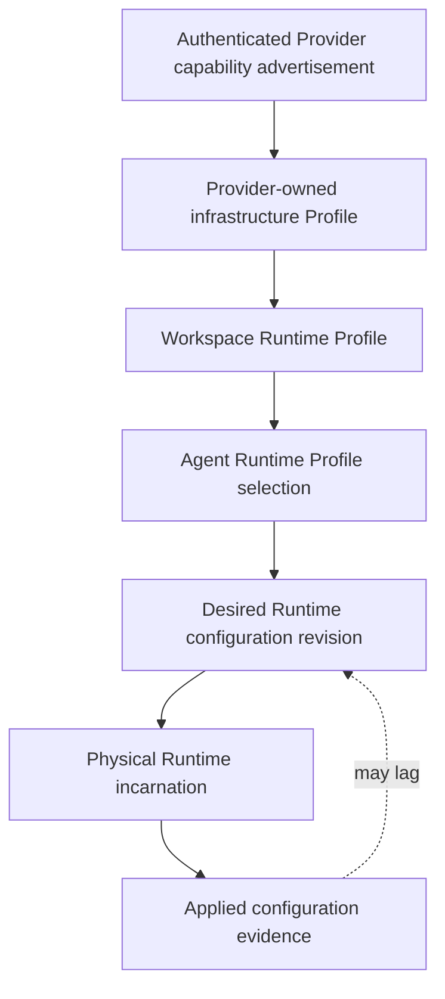
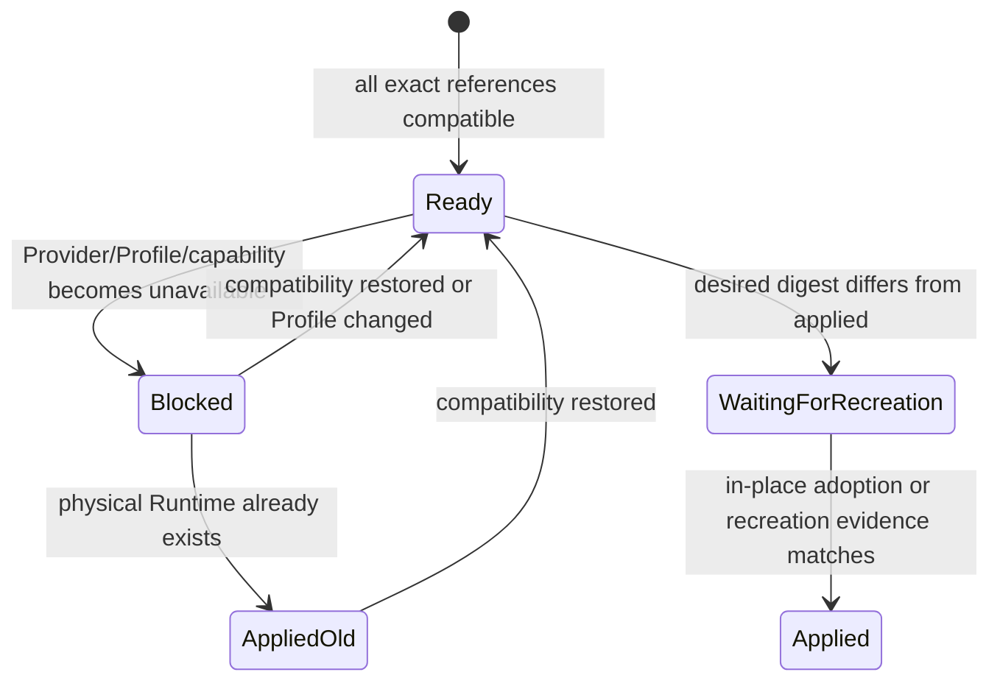

# Workspace-Owned Runtime Profiles Design

- Snapshot: `runtime-260730`
- Document reference: `runtime-260730/DESIGN`
- Requirements: [Workspace-Owned Runtime Profiles Requirements](../requirements/runtime-260730-workspace-owned-runtime-profiles.md) (`runtime-260730/REQ`)
- ADR: [Workspace-Owned Runtime Profiles](../adr/runtime-260730-workspace-owned-runtime-profiles.md) (`runtime-260730/ADR`)

## Summary

Replace the global execution Profile and restrictive Workspace/Agent hierarchy with three explicit
ownership layers:

1. an authenticated Provider advertises its current technical compatibility;
2. a Platform Provider owns typed infrastructure Profiles for its exact substrate; and
3. a Workspace owns complete Runtime Profiles that bind one Provider path and may add only
   Workspace-owned restrictions.

An Agent stores one Workspace Runtime Profile selection. Every source mutation produces a new
immutable desired Runtime configuration revision for affected logical Runtimes. The currently
running physical incarnation retains separate applied evidence until an in-place update or
recreation adopts the desired revision.

## Current Behavior and Gaps

The current implementation has useful operational foundations but the wrong configuration source
model:

- `runtime_execution_profiles` is global and stores complete Docker/resource policy.
- `workspace_runtime_execution_policies` and `agent_runtime_execution_settings` store restrictive
  overlays and Profile allowances.
- Agents separately store `runtime_provider_id`.
- Provider selection uses an Agent preference or Platform default and writes an immutable binding.
- Provider contracts use current and accepted pointers plus explicit Admin acceptance.
- Provider configuration and Runtime policy snapshots are immutable revisions.
- execution-policy changes classify expansion versus restriction and require Agent Apply for some
  changes.
- the Kubernetes Provider already creates one Pod, PVC, and NetworkPolicy per logical Runtime and
  reports exact application evidence.

The target Requirements remove global customer Profiles, resource-ceiling merging, Agent
restrictions, independent Provider selection, capability acceptance, and lower-level Apply. The
existing generation fencing, exact Provider binding, immutable evidence, Provider credentials, PVC
lifecycle, and Runtime observation remain reusable.

## Architecture

The source graph is referential, not inherited. A Workspace Runtime Profile stores exact foreign
keys to a Provider and infrastructure Profile. An Agent stores an exact foreign key to a Workspace
Runtime Profile. Resolution reads the current versions of those sources and creates immutable
configuration evidence; no lower source stores a copy that can override or pin an upstream version.

## Domain Model

### Provider capability revisions

Retain immutable Provider-local capability revisions for audit, but remove approval state.

`runtime_provider_capability_revisions`:

- `id`
- `provider_id`
- `digest`
- `implementation_version`
- `protocol_version`
- `contract_json`
- `advertised_at`
- `last_observed_at`

`runtime_providers` retains one nullable `current_capability_revision_id`. A successful authenticated
registration validates, canonicalizes, inserts or reuses the digest revision, and atomically moves
the current pointer. There is no accepted pointer, candidate status, accepted actor, or acceptance
API. Provider readiness requires a connected authenticated Provider and a valid current capability.

The capability contract contains:

- implementation and protocol identity;
- mandatory lifecycle operations;
- supported infrastructure Profile contract families and schema versions;
- supported typed module identifiers;
- supported module values and bounded implementation constraints;
- Workspace persistence and destructive lifecycle semantics; and
- optional operational capabilities that do not grant product authority.

Provider-global operational configuration revisions remain available for controller configuration,
credentials, namespaces, implementation images, and equivalent process-owned values. They do not
represent customer Runtime resource, Docker, storage, or network choices that belong to
infrastructure Profiles.

### Infrastructure Profiles

Use one durable aggregate table with a discriminated typed specification. Public and Admin APIs
remain Provider-kind-specific even though persistence and lifecycle machinery are shared.

`runtime_infrastructure_profiles`:

- `id`
- `provider_id`
- `profile_kind`: `kubernetes_pod` or `docker_container`
- `display_name`
- `description`
- `lifecycle`: `active` or `disabled`
- `contract_family`
- `schema_version`
- `spec_json`
- `required_capabilities_json`
- `version`
- `digest`
- `created_by_user_id`
- `updated_by_user_id`
- timestamps

Constraints:

- `(provider_id, id)` identifies one Provider-scoped resource.
- `profile_kind` must be supported by the owning Provider kind.
- the discriminated Pydantic model validates `spec_json`.
- required capabilities are derived from the typed spec, never accepted from the client.
- update uses optimistic `expected_version` concurrency.
- disabled Profiles remain referentially intact and are unavailable for new selection or
  incarnation creation.
- hard deletion is not exposed while any Workspace Runtime Profile or historical Runtime evidence
  references the Profile.

Compatibility is a derived projection, not a mutable lifecycle field. It contains `compatible`, a
bounded reason code, missing modules or values, and the Provider capability revision used for the
calculation.

### Kubernetes Pod Profile v1

`kubernetes.pod-profile` schema version 1 uses typed modules.

Core fields:

- Runner CPU request and limit;
- Runner memory request and limit;
- Workspace PVC storage class and requested capacity;
- Platform network policy preset;
- optional ServiceAccount selection;
- typed node selector and tolerations; and
- topology: Runner-only or Runner plus privileged DinD.

Each CPU and memory field is an explicit quantity or explicit omission. Omission emits no
Kubernetes resource field and never inherits a Provider default.

The DinD module adds:

- Docker engine CPU and memory requests and limits;
- ephemeral Docker data capacity;
- shared temporary-storage capacity; and
- the fixed Provider implementation of socket, security context, probes, and image.

Provider implementation images, immutable container commands, image pull credentials, required
Runtime labels and annotations, Pod security implementation, mount paths, Runtime Control
connectivity, and mandatory network communication remain Provider-global or implementation-owned.
A Pod Profile cannot supply arbitrary containers, volumes, PodSpec, security contexts, or images.

Workspace PVC semantics remain unchanged:

- one `ReadWriteOnce` PVC per logical Runtime;
- preserve on stop, start, restart, and ordinary recreation;
- delete and recreate on reset;
- delete on terminal deletion;
- never shrink an existing claim automatically.

### Docker Container Profile v1

`docker.container-profile` schema version 1 follows the same lifecycle and compatibility rules but
uses Docker-native fields:

- Runner CPU reservation and limit when enforceable;
- Runner memory reservation and limit;
- the existing persistent Workspace host-directory behavior;
- Provider-managed container network selection within the Provider hard boundary; and
- fixed non-privileged Runner security and mount topology.

The first version does not claim unsupported quota, NetworkPolicy, DinD, or arbitrary engine-access
controls. Such functionality is added later as typed capability-gated modules without changing
schema version 1 when existing Profile interpretation remains compatible.

### Workspace Runtime Profiles

`workspace_runtime_profiles`:

- `id`
- `workspace_id`
- `display_name`
- `description`
- `lifecycle`: `active` or `disabled`
- `provider_id`
- `infrastructure_profile_id`
- `workspace_policy_json`
- `version`
- `digest`
- `created_by_workspace_user_id`
- `updated_by_workspace_user_id`
- timestamps

The initial Workspace policy contains only an additive network restriction module. Its validation
proves that the restriction cannot widen the selected infrastructure Profile or Provider hard
boundary and cannot remove mandatory Runtime communication.

A Workspace Runtime Profile is available only when:

- it is active;
- the Provider is enabled, active, connected, and available to the Workspace;
- the infrastructure Profile is active and belongs to the selected Provider;
- the Provider's current capability supports every required Profile module and value; and
- Workspace policy is valid for the selected Profile.

Workspace stores `default_runtime_profile_id`. The target must belong to the Workspace and be active
when assigned. Availability may later become blocked without silently clearing the default; Agent
creation ignores an unavailable default and creates an unconfigured Agent with an explicit reason.

### Agent selection

Replace `agents.runtime_provider_id` and `agent_runtime_execution_settings` with nullable
`agents.runtime_profile_id`. The foreign key must point to a Profile in the Agent's Workspace; the
service enforces this invariant transactionally because a composite cross-table ownership check is
not expressible as one simple foreign key.

Agent creation resolves selection once:

1. use an explicit Runtime Profile when supplied;
2. otherwise use the Workspace default when currently available; or
3. store `null` and allow Agent creation without Runtime provisioning.

Changing an Agent selection immediately creates or reconciles its desired Runtime configuration. It
does not expose resource, Docker, network, Provider, or infrastructure Profile fields.

### Runtime configuration revisions

Replace policy-only snapshots with immutable full Runtime configuration revisions. The existing
snapshot table may be migrated and renamed if retaining identifiers is practical; otherwise a new
table is populated and old rows remain migration evidence until cleanup.

`runtime_configuration_revisions`:

- `id`
- `runtime_id`
- `provider_id`
- `provider_capability_revision_id`
- `infrastructure_profile_id` and version
- `workspace_runtime_profile_id` and version
- `agent_selection_version`
- `resolution_status`: `ready` or `blocked`
- `reason_code` and bounded details
- `required_capabilities_json`
- `missing_capabilities_json`
- `resolved_configuration_json`, nullable when blocked
- `source_trace_json`
- `digest`
- `target_desired_generation`
- Provider and Runner evidence digests
- application state and timestamps

`agent_runtimes` stores:

- immutable logical Provider binding;
- selected infrastructure and Workspace Profile identities for indexed impact queries;
- `desired_runtime_configuration_revision_id`;
- `applied_runtime_configuration_revision_id`; and
- existing desired and observed lifecycle generations.

A blocked desired revision is authoritative evidence that current sources cannot produce a new
incarnation. The applied revision remains unchanged while an existing physical Runtime continues.

## Configuration Resolution

Resolution is deterministic and fail-closed:

1. load the Agent selection;
2. load the Workspace Runtime Profile;
3. verify Workspace ownership and lifecycle;
4. load the exact Provider and infrastructure Profile;
5. load the Provider current capability revision;
6. derive required capabilities from the typed infrastructure spec;
7. validate Profile contract version, modules, constrained values, and Provider readiness;
8. compose Provider hard network boundary, Pod or Container Profile policy, and Workspace
   restriction;
9. lower the typed effective configuration to the Provider command dialect; and
10. create an immutable ready or blocked Runtime configuration revision.

The product status projection distinguishes:

- `profile_required`;
- `configuration_blocked`;
- `configured_not_created`;
- `waiting_for_recreation`;
- `applying`;
- `applied`; and
- existing operational Provider or Runner failures.

## Authoritative Propagation

Every mutable source has a monotonic version and canonical digest. A successful mutation writes an
audit event and enqueues durable reconciliation in the same database transaction.

`runtime_configuration_reconcile_tasks`:

- source type and source ID;
- source version or capability digest;
- cursor for bounded fan-out;
- status and retry metadata;
- timestamps.

Workers claim tasks with PostgreSQL `FOR UPDATE SKIP LOCKED`, enumerate affected logical Runtimes in
bounded pages, and create a new immutable desired revision. Attachment uses optimistic source
versions and the prior desired pointer so a stale task cannot overwrite newer resolution. Redis is
not required for correctness.

Reconciliation triggers include:

- Provider capability advertisement change;
- Provider enabled, lifecycle, availability, or hard-boundary change;
- infrastructure Profile create, update, enable, or disable;
- Workspace Runtime Profile create, update, enable, disable, or default change where applicable;
- Agent Runtime Profile selection; and
- migration or repair operations.

Pure NetworkPolicy changes may be applied in place when the Provider reports exact evidence. PodSpec,
container resource, ServiceAccount, scheduling, topology, and storage changes remain waiting for
recreation. Each typed module declares its application impact; lower actors do not approve either
path.

## Runtime Command Guarding

Before create, start, restart, reset, or recreation, the lifecycle service locks the Runtime and
requires the latest desired revision to be `ready`. The command carries the exact revision ID,
digest, resolved configuration, and desired generation. Provider and Runner acknowledgement must
match this evidence before the applied pointer advances.

Stop and terminal delete remain available for a blocked Runtime. Reset is blocked because it
requires creating a new PVC and possibly a new Pod from current desired configuration.

Existing running Runtimes are not automatically stopped when desired resolution becomes blocked.
Their applied evidence remains visible until stop, deletion, compatibility restoration, or an
explicit future safety policy requires termination.

## Scoped Recreation Operations

Use a durable PostgreSQL operation rather than a synchronous API loop.

`runtime_recreation_operations`:

- `id`
- authority scope and actor;
- target type: Provider, infrastructure Profile, or Workspace Runtime Profile;
- target ID and target source version;
- operation status;
- total, pending, running, succeeded, skipped, and failed counts;
- concurrency limit;
- created, started, and completed timestamps.

`runtime_recreation_operation_items` stores one Runtime ID, expected desired revision, attempt,
status, bounded failure code, and timestamps. Item creation uses an impact-query snapshot so the
operation has a stable target set. Workers claim items with `SKIP LOCKED`, revalidate authority and
current desired state, and dispatch a generation-fenced restart that preserves Workspace storage.

A changed desired revision supersedes the item's expected revision; the item refreshes to the newest
ready revision before dispatch. A blocked Runtime is recorded as failed or skipped with an explicit
reason and is never recreated from stale configuration. Retry is bounded and idempotent. The API
returns operation progress and item failures without requiring Redis or one long-lived process.

## API Design

Exact OpenAPI naming may adjust during implementation, but resource boundaries are fixed.

### Admin API

Provider capability:

- remove contract acceptance routes;
- return current capability revision and audit history;
- expose compatibility impact counts after a capability change.

Provider infrastructure Profiles:

- list/create/get/replace/enable/disable Pod Profiles under one Kubernetes Provider;
- equivalent Container Profile routes under one Docker Provider;
- return current compatibility, required capabilities, version, digest, and impact counts;
- start Provider- or infrastructure-Profile-scoped recreation and read operation progress.

### Public Workspace API

- list/create/get/replace/enable/disable Workspace Runtime Profiles;
- set or clear the Workspace default;
- list selectable infrastructure Profiles exposed through eligible Platform Providers;
- start Workspace-Runtime-Profile-scoped recreation and read progress;
- return availability and bounded incompatibility reasons.

### Agent API

- Agent create and update accept nullable `runtime_profile_id`;
- Agent responses return the exact selection and derived availability;
- remove independent `runtime_provider_id` and execution restriction request fields;
- remove the Agent execution-policy Apply route;
- Runtime lifecycle responses expose desired and applied configuration status.

All mutations use optimistic versioning. Capability advertisement remains Provider-Control-only and
is not mutable through Admin HTTP APIs.

## Provider Control Protocol

Replace the accepted-contract assumption with current capability advertisement. Registration still
carries the complete canonical capability contract. Runtime Control validates it before connection
registration and records the current revision atomically.

Lifecycle commands carry a full typed Runtime configuration envelope rather than the legacy
hierarchical execution-policy document. The envelope includes:

- configuration revision ID and digest;
- Profile contract family and schema version;
- Provider-specific resolved spec;
- mandatory network and storage metadata; and
- desired generation.

Providers reject an unsupported contract or value explicitly. Provider evidence reports the exact
configuration revision and digest. Protocol additions remain backward-incompatible within this
unreleased feature and are regenerated from protobuf without a compatibility fallback.

## Kubernetes Provider Changes

Refactor `KubernetesRuntimeProviderConfig` into:

- Provider-global immutable or operational configuration; and
- per-command resolved Pod Profile configuration.

Keep Provider-global:

- Provider and namespace identity;
- Runtime Control endpoint and mandatory labels/port;
- implementation images and commands;
- image pull secrets and credential material;
- workspace mount path;
- Provider-wide network hard cap; and
- implementation-owned security contexts.

Move to Pod Profile input:

- Runner CPU and memory requests and limits;
- Workspace PVC storage class and request;
- Platform network preset;
- ServiceAccount selection;
- node selector and tolerations;
- DinD topology, engine resources, and ephemeral capacities.

The Provider lowers the typed configuration into the existing Pod, PVC, and NetworkPolicy resource
models. Observation and equality checks compare the expected revision digest and rendered resources.
Existing PVC non-shrink, reset, and terminal-delete behavior remains unchanged.

## Docker Provider Changes

Add typed Container Profile support without claiming Kubernetes-specific behavior. Move enforceable
Runner resource and Provider-managed network choices from process-wide defaults into the command
configuration. Preserve host-directory Workspace identity and lifecycle. Keep daemon endpoint,
implementation image, host root, credentials, and unsafe host-level authority Provider-global.

Do not advertise DinD, quota, or network capabilities until the Docker Provider implements and
verifies them. Unsupported Profile modules produce compatibility failure before lifecycle dispatch.

## Authorization and Security

- System Admin manages Platform Providers, capability observation, Provider-global hard boundaries,
  infrastructure Profiles, and Platform-scoped recreation.
- Workspace runtime-policy read/write permissions manage Workspace Runtime Profiles, defaults,
  Agent selections, and Workspace-scoped recreation.
- Agent users cannot edit infrastructure values.
- Provider credentials authenticate only one durable Provider.
- Capability advertisements never create Provider identity or expand credentials.
- Infrastructure Profile APIs reject Provider-kind mismatches and derive required capabilities
  server-side.
- Workspace network restrictions are validated as narrowing transformations.
- audit events record actor, source versions, before/after digests, impact counts, and operation IDs
  without secret plaintext.

## Migration and Cutover

Use one linear Alembic migration sequence and no runtime compatibility fallback.

1. Create capability, infrastructure Profile, Workspace Runtime Profile, configuration revision,
   reconciliation, and recreation operation structures.
2. For every legacy Agent with an effective execution policy, resolve its current global Profile,
   Workspace restriction, Agent restriction, and Provider choice using the pre-migration resolver.
3. Deduplicate effective infrastructure configurations by Provider and canonical digest, then create
   generated Provider-owned infrastructure Profiles.
4. Create generated Workspace Runtime Profiles for each Workspace and effective infrastructure
   configuration, and assign each existing Agent its exact generated Profile.
5. Preserve existing logical Runtime Provider bindings. Create new desired configuration revisions
   from generated Profiles while retaining the old applied snapshot as historical applied evidence
   until recreation.
6. Leave Workspace defaults unset unless a deterministic existing Workspace-wide default can be
   derived without changing any Agent selection.
7. Convert the latest valid current Provider contract, or the accepted contract when no current
   revision exists, into the current capability revision. Remove acceptance authority and routes.
8. Remove legacy global Profile, allowance, Workspace restriction, Agent restriction, Apply, and
   independent Agent Provider-preference structures after all references are converted.
9. Regenerate Admin and Public OpenAPI clients and remove legacy UI flows in the same cutover.

Generated migration Profile names include a stable short digest and provenance metadata. They are
ordinary mutable current resources after migration; no legacy resolver remains.

## Frontend Design

### Admin Web

Provider detail replaces contract acceptance with current capability and history. It adds
Provider-kind-specific infrastructure Profile management, compatibility status, affected Runtime
counts, and scoped recreation controls.

Pod Profile forms expose typed sections for resources, Workspace PVC, network, ServiceAccount,
scheduling, and DinD. They never expose raw YAML. Container Profile forms show only enforceable
Docker Provider fields.

### Main Web

Workspace Runtime settings become a Profile catalog rather than one Workspace restriction editor.
Workspace managers create Profiles, select exact Provider infrastructure Profiles, add network
restrictions, set a default, inspect availability, and trigger scoped recreation.

Agent Runtime settings become a single Runtime Profile selector with availability details. Resource,
Docker, network, Provider, and Apply controls are removed. An unconfigured Agent shows a clear
`Runtime Profile required` state and can still be edited.

Runtime status presents configured sources, desired revision, applied revision, waiting-for-
recreation state, and bounded blocked reason. Bulk operation pages show aggregate progress and
failed Runtime details.

Responsive and Storybook coverage must include active, unavailable, blocked, waiting, operation-in-
progress, partial-failure, and no-Profile states.

## Observability

Structured logs and metrics include:

- capability revision changes and affected Profile counts;
- reconciliation task lag, retries, and stale-fence discards;
- desired resolution result and reason code;
- desired-versus-applied age;
- recreation operation progress, duration, retries, and failures; and
- Provider configuration evidence mismatch.

Runtime code relies on logging integration for Sentry delivery. Audit history is PostgreSQL-backed
and independent of Redis availability.

## Failure Handling

- Invalid capability advertisement rejects the Provider connection without moving the current
  pointer.
- Provider disconnect makes Profiles unavailable for new incarnation but does not erase capability
  history or stop running Runtimes.
- Concurrent source mutation creates a newer reconciliation task; stale attachment fails its
  optimistic fence.
- Profile disable or capability loss preserves references and writes blocked desired revisions.
- A failed recreation item retains failure evidence and can be retried without duplicating Runtime
  generation.
- Provider or Runner evidence with the wrong revision, digest, or generation cannot advance the
  applied pointer.
- PVC resize failure leaves the old PVC and applied Runtime intact and reports a bounded storage
  incompatibility; automatic shrink is never attempted.

## Test Strategy

### E2E primary verification matrix

| Scenario | Primary evidence |
| --- | --- |
| Admin creates a Kubernetes Pod Profile | Admin UI and API show typed values and compatible status |
| Workspace creates and defaults a Runtime Profile | Workspace catalog and creation-time Agent selection |
| Agent without a Profile | Agent remains editable; Runtime start is blocked with bounded reason |
| Agent selects a Profile | Exact Provider/Profile binding and desired revision are visible |
| Pod Profile resource change | Desired revision changes immediately; running Pod remains applied-old |
| Workspace network restriction change | Effective network narrows without Agent Apply |
| Workspace bulk recreation | New Pod adopts desired revision and existing PVC data remains |
| Provider capability removal | Profiles become blocked; running Runtime remains; restart is blocked |
| Capability restoration | Profiles automatically unblock without Admin acceptance |
| Provider-scoped recreation | Only impacted Runtimes are targeted and progress is reported |
| DinD Pod Profile | Runner and engine resources/storage render from the Profile |
| Docker Container Profile | Docker-native supported settings provision without Kubernetes fields |
| Migration | Existing Agents retain an equivalent generated selection and Runtime binding |

### Testenv and fixtures

The E2E environment needs:

- one connected Platform Kubernetes Provider with two Pod Profiles;
- optional Docker Provider coverage where the Docker daemon fixture is available;
- a Workspace with Manager permissions;
- Agents in configured, unconfigured, running, stopped, and blocked states;
- deterministic capability-advertisement fixtures that can remove and restore DinD support;
- PVC test data written before recreation and verified afterward; and
- a bulk recreation fixture with at least one injected failure.

Provider-live tests fail rather than skip when the corresponding CI prerequisite is declared.
Optional Docker tests may skip only when the job explicitly omits the Docker Provider prerequisite.
Evidence includes API assertions, rendered Provider resource inspection, UI screenshots for key
states, operation progress, and persisted desired/applied revision IDs.

### Component and integration checks

- Pydantic contract canonicalization and compatibility tests;
- repository ownership, optimistic concurrency, impact queries, and `SKIP LOCKED` claims;
- service authorization and blocked-state transitions;
- migration tests with representative legacy hierarchy combinations;
- protobuf round-trip and stale evidence rejection;
- Kubernetes Pod/PVC/NetworkPolicy rendering and lifecycle tests;
- Docker lowering tests for only advertised capabilities;
- Admin and Public route tests plus generated-client drift checks;
- frontend container/component tests, Storybook states, localization, and responsive behavior; and
- backend Ruff, Pyright, Pytest plus TypeScript format, lint, typecheck, and build.

## Implementation Phases

This feature requires stacked delivery because schema, protocol, providers, APIs, frontends, and
migration have sequential dependencies.

1. Design baseline: confirmed Requirements, ADR, and Design.
2. Implementation plan: workstreams, phase plans, ownership, validation matrix, and fixtures.
3. Capability and domain foundation: direct advertisement, typed contracts, persistence, and
   migration scaffolding.
4. Profile APIs and resolution: infrastructure Profiles, Workspace Runtime Profiles, Agent
   selection, reconciliation, and desired/applied revisions.
5. Provider protocol and implementations: protobuf, Kubernetes lowering, Docker lowering, and
   evidence.
6. Runtime lifecycle and bulk recreation: command guards, operations, progress, and retries.
7. Frontend: Admin infrastructure Profiles, Workspace catalog/default, Agent selector, and Runtime
   status.
8. E2E and integration validation.
9. Spec promotion.
10. Cleanup of implementation plans and obsolete legacy code.

## Traceability

| Requirements | ADR decisions | Design mechanisms |
| --- | --- | --- |
| `REQ-1`, `REQ-2`, `REQ-6`, `REQ-23` | `ADR-D1`, `ADR-D2` | Workspace Profile and Agent selection tables, creation-time default |
| `REQ-3`, `REQ-4`, `REQ-5`, `REQ-6`, `REQ-7`, `REQ-8` | `ADR-D2`, `ADR-D7`, `ADR-D8` | Provider-scoped infrastructure Profiles and authority checks |
| `REQ-9`, `REQ-10` | `ADR-D1`, `ADR-D2` | removal of hierarchy; future selection authorization boundary |
| `REQ-11`, `REQ-12`, `REQ-13`, `REQ-14` | `ADR-D6` | durable reconciliation, desired/applied revisions, recreation operations |
| `REQ-15`, `REQ-16` | `ADR-D3`, `ADR-D4` | current capability pointer, blocked resolution, command guards |
| `REQ-17`, `REQ-18`, `REQ-19` | `ADR-D5`, `ADR-D8` | compatibility-bound schemas and typed modules |
| `REQ-20`, `REQ-21`, `REQ-22` | `ADR-D7` | Pod resources, preserved PVC, layered network boundaries |

## Feasibility Matrix

| Requirement group | Result | Repository evidence and implementation path |
| --- | --- | --- |
| Workspace ownership and Agent selection | Feasible | Workspace and Agent ownership already exist; replace policy setting and Provider preference columns with exact Profile foreign keys. |
| Provider-scoped infrastructure Profiles | Feasible | Provider aggregate, Admin authorization, optimistic repositories, and Provider-kind identity already exist. |
| Typed Pod and Container modules | Feasible | Current execution-policy Pydantic modules and Provider resource models provide reusable validation and lowering patterns. |
| Direct capability advertisement | Feasible | Registration already validates, canonicalizes, and stores current revisions before connection; remove acceptance state and update readiness. |
| Capability-loss blocking | Feasible | Current compatibility resolver, immutable snapshots, and lifecycle guards provide the required transition points. |
| Authoritative propagation | Conditional | Snapshot and generation fencing exist; durable source-impact fan-out and blocked desired revisions must be added. |
| Scoped bulk recreation | Conditional | Runtime restart and PostgreSQL `SKIP LOCKED` worker patterns exist; operation and item persistence are new. |
| Kubernetes resources, PVC, and network | Feasible | Provider already renders and reconciles Pod resources, one PVC, and NetworkPolicy; inputs move from process/policy configuration to Pod Profiles. |
| Docker Container Profiles | Conditional | Docker lifecycle and persistent host workspace exist; enforceable resource/network lowering must be added without claiming unsupported controls. |
| Migration | Conditional | Legacy effective resolution is deterministic and can run inside migration tooling; generated Profile volume and migration runtime must be bounded and tested. |
| Admin and Main Web | Feasible | Existing Runtime Provider and Runtime Execution feature surfaces, generated clients, localization, and Storybook patterns are reusable. |
| E2E verification | Conditional | Kubernetes testenv exists; capability mutation, bulk operation, and PVC preservation fixtures must be added. |

No confirmed Requirement is blocked. The highest implementation risks are migration fan-out,
durable reconciliation correctness, protocol cutover breadth, and keeping generated API clients and
both frontends synchronized across the stack.

## Remaining Non-Blocking Assumptions

- `Infrastructure Profile` remains an internal umbrella term while UI uses Pod Profile or Container
  Profile.
- Workspace policy v1 contains network restriction only.
- automatic deadlines and staged rollout remain future extensions.
- Profile disable uses the same reference-preserving unavailable behavior as capability loss.
- the implementation may rename the existing snapshot table or introduce a replacement table based
  on migration complexity, provided desired/applied evidence and identifiers remain durable.
