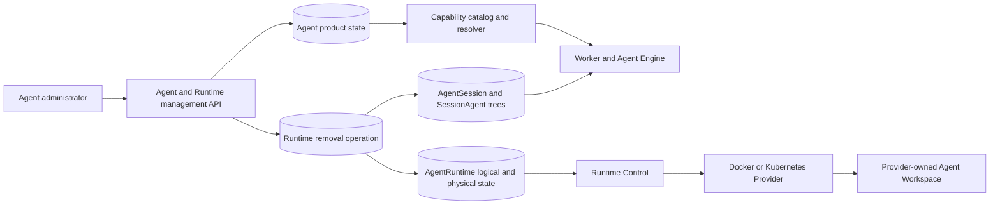
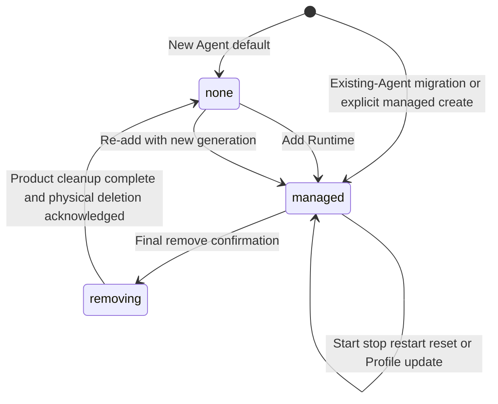

# Optional Managed Runtime for Agents Design

- Snapshot: `runtime-260803`
- Requirements: [`runtime-260803/REQ`](../requirements/runtime-260803-optional-managed-runtime.md)
- ADR: [`runtime-260803/ADR`](../adr/runtime-260803-optional-managed-runtime.md)
- Design reference: `runtime-260803/DESIGN`

## Summary

A managed Runtime becomes an optional Agent capability rather than an implicit property of every Agent. The Agent owns the product state that grants or revokes Runtime capability. `AgentRuntime` continues to own the logical execution-environment identity and its generation-fenced physical Provider, Runner, Workspace, configuration, and deletion evidence. A PostgreSQL-backed removal operation coordinates the irreversible cross-system transition without depending on Redis availability or Provider availability for correctness.

New Agents default to Runtime-free operation. They can execute model turns and compatible server-executed or remote capabilities without creating an `AgentRuntime`. Existing Agents migrate to managed capability without changing their current Runtime Profile, Workspace, shell setting, Toolkit attachments, or physical Runtime. Administrators add Runtime through an explicit Profile-backed action that configures but does not start compute. Permanent removal fences all Agent work, interrupts active and queued work across Team and private User Session trees, removes Runtime-owned product state, requests terminal physical deletion, and completes only after exact acknowledgement. Re-addition reuses an existing logical Runtime identity only after that acknowledgement, advances the physical generation, and starts with an empty Workspace and no automatic restoration of shell or Runtime credential exposure. Retained Session contexts preserve conversation history, product mode, pin state, and owner privacy but never preserve or regain a prior Agent Workspace binding: Runtime-free contexts have no Session folder, removal invalidates every prior folder binding, and only a newly created post-addition context may bind to the new Runner-reported Workspace.

## Current Behavior and Requirement Gaps

The current behavior is defined by the Agent, Workspace, Toolkit, Runtime Control, Runtime Persistence, and execution-loop Specs. In particular, Agent creation copies a Workspace Runtime Profile default, human input ensures a logical Runtime row, the Worker binds the built-in Runtime Toolkit from `shell_enabled`, a missing Runtime row is rendered as `NOT_STARTED`, and terminal delete is currently reserved for Agent decommission.

| Current behavior | Required change |
| --- | --- |
| `agents.runtime_profile_id` is nullable, but null means an unconfigured Runtime-capable Agent. | Add a distinct Agent-owned Runtime capability state; Profile nullability must not represent Runtime absence. |
| Agent creation resolves explicit Profile, then Workspace default, then unconfigured. | New Agents use Runtime-free by default; only explicit Profile selection grants Runtime capability. |
| Human input admission calls `AgentRuntimeRepository.ensure_for_agent()` and returns a required Runtime ID. | Runtime-free input and model execution must accept an absent Runtime identity and must not create one. |
| `shell_enabled` controls only built-in Runtime Toolkit binding. | A shared capability resolver must cover every Runtime-dependent projection and authoritative operation. |
| Runtime GET ensures/resolves `AgentRuntime`; Workspace maps a missing row to `NOT_STARTED`. | Runtime-free, managed-unconfigured, stopped, failed, and removing states must be normal distinct read-model states. |
| Workspace, Project, Git, filesystem Skill, transfer, and credential paths have independent Runtime assumptions. | Every such path must declare and enforce its required capability through the common resolver. |
| Every Team or private User root Session context currently requires one unique non-null working-folder path under the current Runner-reported Agent Workspace, and setup/adoption/retry can materialize that stored path through Runner operations. | A Runtime-free Session context must exist without a folder binding; removal must terminally invalidate every retained bound or pending context independently of archive cleanup, product mode, pin state, or active/archive state; only new contexts created after a later add may bind to the new Workspace. |
| The Project browser prepends the stored Session files path, while archived-session cleanup and explicit repair can still operate from the persisted context path. | Browser, archive, setup, Project, worktree, and Runner-operation paths must distinguish an active binding from a historical invalidated path and must never recreate or operate on an invalidated binding. |
| Terminal deletion prevents later lifecycle mutation and is used to finish Agent decommission. | Agent-scoped removal must retain the Agent and support a generation-advancing exact-acknowledgement rearm transition. |
| Provider terminal delete already removes Docker Runtime roots or Kubernetes Pod, NetworkPolicy, and PVC idempotently. | Reuse the physical deletion contract and add Agent-level fencing, product-state cleanup, durable retry, and finalization. |

## Requirement and ADR Traceability

| Requirement | Design mechanisms | ADR authority |
| --- | --- | --- |
| `runtime-260803/REQ-1` | Agent capability state, Runtime-free create default, explicit managed create choice, compact Agent projection | D1, D5, D6 |
| `runtime-260803/REQ-2` | Server-owned capability guidance, creation/settings presentation, Workspace empty state | D4, D5, D6 |
| `runtime-260803/REQ-3` | Runtime-free input path, capability-filtered Toolkits and Skills, authoritative rejection without Runtime ensure | D1, D4 |
| `runtime-260803/REQ-4` | Dedicated add action, explicit Profile confirmation, contextual setup guidance | D1, D4, D5 |
| `runtime-260803/REQ-5` | Configuration-only add/rearm transition and existing lazy start semantics | D3, D5 |
| `runtime-260803/REQ-6` | Agent-owned grant, Agent-wide Session/subagent admission, shared resolver | D1, D4 |
| `runtime-260803/REQ-7` | Existing stop lifecycle preserved; remove is a separate irreversible operation | D2, D5, D6 |
| `runtime-260803/REQ-8` | Durable removal operation, immediate fence, work interruption, cleanup, terminal acknowledgement | D1, D2, D3, D4, D5, D6 |
| `runtime-260803/REQ-9` | Exact-acknowledgement rearm, higher generation, empty Workspace, disabled shell/credential projection | D3, D4, D5 |
| `runtime-260803/REQ-10` | Existing-Agent managed backfill, feature-gated rollout, new-Agent Runtime-free default | D1, D5 |

## Architecture and Ownership

### Source-of-truth boundaries

- **Agent** owns Runtime capability state, its optimistic version, current Runtime Profile selection, `shell_enabled`, and the permission ceiling inherited by every Session and subagent.
- **Runtime removal operation** owns irreversible progress, confirmation and actor evidence, target logical Runtime and deletion generation, interruption and cleanup progress, retry timing, bounded error details, and terminal completion evidence.
- **AgentRuntime** owns one stable logical Runtime identity per Agent and all physical state: Provider binding, immutable desired/applied configuration revisions, desired generation, Provider and Runner observations, Workspace path, lifecycle commands, failures, and current terminal-delete request/acknowledgement.
- **Capability catalog and resolver** owns the code-defined mapping from product operations to required capabilities and computes effective grants from Agent state and operation context. It is not persisted as a second authority.
- **AgentSession and SessionAgent** continue to own transcript, Run, subagent, Goal, Todo, product mode, private User ownership, pin state, and shared Session context. A root context owns its Session working-folder binding lifecycle and historical path evidence, but cannot select, add, remove, or replace Agent Runtime capability. Runtime removal may coordinate every tree by Agent identity without granting the requesting administrator read access to private User Session metadata.
- **Runtime Control and Provider** retain generation-fenced command dispatch and physical resource mutation. Once physical creation or dispatch was possible, exact Provider acknowledgement is the only deletion proof. The server may prove absence locally only while a locked Runtime record shows that no physical binding or dispatch authority ever existed.

## Data Model

### Agent Runtime capability

Add a non-null PostgreSQL enum field to `agents`:

- `none` — no managed Runtime capability;
- `managed` — Runtime capability is granted, with either a selected Profile or an allowed migrated-unconfigured state; and
- `removing` — the irreversible removal fence is active.

Add `runtime_capability_version`, a non-null monotonically increasing integer used by add/remove actions and read-model action availability. Generic Agent updates do not change capability state.

`runtime_profile_id` and `runtime_profile_selection_version` remain separate configuration state. For a `managed` Agent, a null Profile continues to mean managed-unconfigured. For `none` and `removing`, no Profile is selected. The removal transaction clears the selection and advances its version so a stale generic Profile update cannot restore it.

`AgentRuntime` remains optional. A Runtime-free Agent may have no row. A removed Agent may retain a terminally deleted row so its logical identity, configuration history, and deletion relationship remain available for re-addition. Existing uniqueness of one Runtime per Agent remains valid. Terminal deletion evidence adds a bounded acknowledgement kind: `provider_report` for the existing exact-generation Provider result, or `no_physical_binding` when a locked repository check proves the logical Runtime never obtained any authority or evidence capable of creating physical resources.

### Runtime removal operation

Add one durable operation table with at most one non-terminal operation per Agent. The operation stores:

- operation ID, Agent ID, Workspace ID, and requester Workspace User ID;
- expected and committed Agent capability versions;
- optional logical Runtime ID, target terminal-delete generation, and deletion-evidence kind;
- status and current stage;
- confirmation timestamp and immutable destructive-scope version;
- privacy-safe aggregate counts needed to report interrupted active root Sessions, subagents, Runs, and queued Runtime actions across all Session product modes;
- product cleanup completion evidence;
- physical deletion requirement, request, and acknowledgement evidence;
- attempt count, next retry time, bounded error kind/summary, lease owner, and lease expiry;
- created, updated, and completed timestamps.

The operation contains no conversation content, Session titles, associated User identities, credentials, Runtime file paths beyond internal identifiers needed for safe cleanup, or recoverable Workspace payload. Internal cleanup cursors are never part of the public impact projection. PostgreSQL rows, versions, leases, and acknowledgement evidence are sufficient for correctness; Redis may only wake work and may be empty or unavailable.

Operation stages are an operator and UI projection, not independent authorities:

1. `fencing`
2. `interrupting_work`
3. `cleaning_product_state`
4. `deleting_runtime`
5. `finalizing`
6. `completed`

Retry wait is represented through retry metadata while the durable stage remains unchanged.

### Session working-folder binding

`SessionAgentContext` remains the durable root-tree context even when an Agent has no managed Runtime. Its Session working-folder binding becomes a separate lifecycle from the existing archive-owned `working_folder_cleanup_status`; cleanup status must not be overloaded as Runtime-removal authority.

The binding records a nullable historical folder path, the associated logical Runtime when one exists, and a binding state with bounded invalidation evidence:

- `none` — created while the Agent is Runtime-free. It has no Agent Workspace path and is never eligible for later automatic binding.
- `pending` — created while the Agent is managed but no current Runner-reported Workspace path is available yet. It may bind exactly once after an authorized Runtime-dependent operation has current Runner evidence; pending state alone never starts compute or dispatches a Runner operation.
- `bound` — owns one exact unique path below the current Runner-reported Agent Workspace. Folder setup, Session files projection, Project validation, Session-scoped worktree operations, and Engine Runtime prompt/default-workdir construction may use this binding only while Agent capability and the binding are both authorized.
- `invalidated` — a durable removal operation terminalized the binding. The historical path, Runtime relationship, removal operation ID, and invalidated timestamp remain auditable, but no setup, retry, archive cleanup, browser-open, Project, worktree, Engine prompt/workdir, Runner operation, or later re-addition may use that path.

The existing exact-path uniqueness remains across every non-null historical path, including an invalidated binding, so a later incarnation cannot reuse the old exact path. New root-context creation does not derive a path from a server default, Provider mount, or a prior Runtime value. A `bound` transition uses current-generation Runner workspace evidence, and a `pending` or `none` context is not silently rebound by an Agent Profile update, Runtime reset, or re-addition.

Removal cleanup processes every retained Team or private User root context for the Agent in bounded, locked batches, including active, archived, restored, pinned, and unpinned roots. It changes each `pending` or `bound` binding to `invalidated`, records the removal operation as the terminal reason, and terminalizes or cancels queued folder-setup and worktree actions under the same Agent work fence. It does not individually recreate or delete Session folders through Runner: the terminal Runtime delete is the physical Workspace deletion authority. Finalization requires a durable cursor/count proof that no pre-removal context remains `pending` or `bound`.

Archive and retention remain distinct. The existing archive-owned cleanup enum remains exactly `not_attempted`, `pending`, `succeeded`, or `failed`; it is not extended with a Runtime-removal terminal state and is never used as deletion acknowledgement. An invalidated context may still be archived, restored before ordinary retention fencing, or retained for transcript history, but archive skips Runner folder cleanup because removal already records the terminal absence boundary. A cleanup already recorded as `pending` is allowed to finish only if it was admitted before the removal fence; the coordinator drains that exact-generation Runner work before invalidation, then terminalizes any abandoned pending attempt as `failed` with a bounded removal-superseded summary. Existing `not_attempted`, `succeeded`, and `failed` values remain historical. The ordinary archive cleanup state is operationally actionable only for a currently bound context.

## Capability Catalog and Resolution

Define stable server capability identifiers for material Runtime boundaries, including process execution, Runtime filesystem access, Workspace browsing and mutation, Project validation/registration, Git and worktree operations, filesystem Skill discovery/materialization, Runtime transfer materialization/publication, Runtime settings, and Runtime credential exposure.

Each model-visible tool, Toolkit contribution, API mutation, background action, and UI projection declares its required capabilities. The resolver combines:

- Agent Runtime capability state;
- `shell_enabled` and other existing feature settings;
- current actor authorization for management operations;
- the operation's Session/Agent context; and
- physical Runtime readiness when an operation actually requires a Runner.

Product grant and physical readiness remain distinct. A managed but stopped Agent is authorized for Runtime capability but may need lazy start. A Runtime-free or removing Agent is not authorized, so the operation fails before any `AgentRuntime` ensure, Profile resolution, start, credential collection, or Runner dispatch.

Every admitted Runtime-dependent operation snapshots the Agent capability state and `runtime_capability_version`. Before an external Provider or Runner dispatch, the authoritative boundary rechecks that the Agent is still `managed`, the version is unchanged, the Session binding remains eligible when applicable, and the existing exact Runtime operation target still matches desired/applied configuration revision and digest, desired and Runner generation, current Provider connection authority, and current Runner-reported Workspace path. Work already dispatched before the removal commit is treated as in-flight work and must be interrupted or drained; it cannot authorize a later retry after the version changes.

For Session-folder, Project, and worktree work, Agent capability is necessary but not sufficient. The resolver also requires a current `bound` Session working-folder binding. A `pending` binding may become bound only through the one authorized current-Runner-evidence transition; `none` and `invalidated` bindings fail closed. This second check prevents a retained historic path from becoming a valid path merely because a later Runtime reuses the same logical Runtime ID or reports the same absolute mount string.

Projection and authoritative admission both use the resolver:

- projection omits or explains unavailable tools, prompts, Skills, Workspace actions, and settings;
- execution and mutation repeat the check to reject stale clients, cached schemas, queued actions, and indirect calls;
- Runtime-free prompts never claim shell, local filesystem, Project, build, test, or credential-injection authority;
- managed VFS Skills and compatible remote Toolkit operations remain eligible independently;
- mixed Toolkits retain remote operations while Runtime environment projection is suppressed;
- peer Toolkit `expose_env()` collection is permitted only when the effective Runtime credential-exposure capability is granted.

The current `shell_enabled` setting remains one input, not the complete authority. Runtime removal sets it to false. Re-addition does not set it back to true, so shell tools and the current peer-Toolkit Runtime environment injection path require a later explicit administrator update. Compatible remote Toolkit bindings are retained.

## API and Read Models

### Agent create and summary

Agent create accepts the Runtime choice in the existing creation transaction:

- omitted or null Runtime Profile means `runtime_capability=none` and does not consult the Workspace default;
- an explicit available Runtime Profile means `runtime_capability=managed`;
- existing Workspace defaults remain visible as picker assistance but never silently grant the capability.

New Runtime-free Agents store `shell_enabled=false` regardless of a legacy client default that would otherwise grant Runtime tools. An explicit managed creation may persist the administrator's explicit shell choice. The response includes a compact server projection with capability state, Profile configuration state, and the contextual availability of add/remove management.

### Unified Runtime read model

Runtime GET becomes read-only and never ensures a Runtime. It combines:

- Agent capability state and version;
- optional Runtime Profile selection and availability;
- authorized, privacy-safe removal-impact projection with aggregate active root Session, subagent, Run, and queued Runtime-action counts across Team and private User modes, without Session titles, owners, paths, or private identifiers;
- optional active or completed removal projection;
- optional `AgentRuntime` physical/configuration state; and
- server-computed action availability for add, remove, start, stop, restart, reset, observe, and Runner-backed use.

Normal product states include Runtime-free with no Runtime row, managed-unconfigured, managed-configured/not-started, managed-running or failed, removing with deletion pending, and removed with retained terminal evidence. A missing physical row is never sufficient to infer `NOT_STARTED`.

### Dedicated add action

The add action requires Agent-settings authorization, an expected capability version, an explicit available Workspace Runtime Profile, and an idempotency key. It is accepted only from `none` with no active removal operation.

For an Agent with no historical Runtime row, the transaction creates the logical row and a desired configuration revision in stopped state. For a retained terminally deleted row, it requires exact acknowledgement for the current deletion generation and performs the rearm transition described below. The selected Workspace Runtime Profile, infrastructure Profile, Provider capability revision, Agent selection version, and current Runtime generation are resolved from versioned snapshots and attached through the current compare-and-set rules; a concurrent source change retries from fresh authority rather than attaching stale configuration. The action sets Agent capability to `managed`, selects the Profile, advances both optimistic versions, and leaves physical desired state stopped. It does not allocate active compute.

### Dedicated remove action

The remove action requires Agent-settings authorization, expected capability version, an idempotency key, and explicit final destructive confirmation. The commit transaction locks the Agent, rejects stale or non-managed state, creates or returns the durable operation, changes capability to `removing`, advances the capability version, and immediately makes every ordinary work and Runtime admission fail closed.

A repeated request with the same idempotency identity returns the same operation. Another request cannot create a competing operation. There is no cancellation endpoint or rollback transition.

### Generic Agent patch

Generic Agent patch cannot change Runtime capability. `runtime_profile_id` remains a managed-only partial update: omission leaves it unchanged, explicit null means managed-unconfigured, and a non-null value selects another available Profile. For `none` or `removing`, Profile mutation and enabling Runtime-only settings fail with a stable action-required or removal-in-progress error. Runtime add/remove must use their dedicated actions.

## State Transitions and Concurrency

All capability transitions lock the Agent row and compare `runtime_capability_version`. Removal also locks or creates the single operation and, when present, locks the logical Runtime before requesting deletion. Lifecycle mutations and configuration reconciliation require `managed` and reject `removing` even if they hold a stale Runtime ID.

Session-folder binding transitions lock the root context. `none` is terminal for contexts born Runtime-free. A context born while managed moves from `pending` to `bound` only with current Runner workspace evidence. Final removal moves every pre-existing `pending` or `bound` context to `invalidated`; no transition leaves `invalidated`, including after rearm. New root contexts created after a successful add are the only contexts that can enter `pending` and later `bound`.

The final confirmation transaction is the irreversible commit point. After it commits, Provider outage, Worker restart, Scheduler restart, Redis loss, or ambiguous dispatch cannot restore capability. The operation retries from PostgreSQL until every required condition is proven.

### Removal coordinator

The coordinator performs idempotent steps:

1. **Fence admission.** The committed Agent state and changed capability version already reject new human input, external-channel input, scheduled execution, Session recovery, subagent spawn/wake, Toolkit execution, Workspace/Project/Git mutations, folder setup/adoption/retry, archive cleanup dispatch, Runtime lifecycle actions, and stuck-run recovery across Team and private User Session trees.
2. **Interrupt work.** Lock all Agent Session trees without projecting private User Session metadata, advance the existing execution ownership/stop fences, terminalize queued Runtime-dependent actions and unprepared input safely, request stop for active Runs and subagents, interrupt or drain current-generation Runner operations and background cleanup admitted before the fence, send best-effort broker/Runner wake-up signals, and retry until no active Run, action execution, or admitted Runtime operation remains. Sessions and transcripts remain.
3. **Clean Runtime-owned product state.** In bounded transactions, terminalize every retained root Session context's `pending` or `bound` working-folder binding as `invalidated` with the removal operation evidence; terminalize an abandoned archive cleanup `pending` state as bounded removal-superseded `failed`; remove Session Project registrations and managed worktree allocation metadata; clear Agent automatic/default/preset/catalog Project state; clear filesystem Skill and Runtime-instruction projections; remove pending Runtime action state; and invalidate Runtime-only credential projection caches. The coordinator terminalizes queued folder-setup/retry and worktree actions before they can dispatch, and releases or terminalizes associated path claims. It records a cursor/count proof covering every Team and private User root, including active and archived retained contexts, while publicly exposing only aggregate counts. Preserve Agent identity, Agent admins, conversations, product mode, private ownership, pin state, Memory, compatible Toolkit attachments and remote state, external-channel configuration, Exchange attachments, ModelFiles, Artifacts, Goals, Todos, and ordinary settings.
4. **Request physical deletion.** If a logical Runtime has a durable Provider binding or any evidence that physical creation or dispatch could have occurred, call the existing idempotent terminal-delete request and record its target desired generation on the operation even when the Provider is disconnected. Runtime Control dispatches only through the current connected Provider generation and retries after reconnect or leader recovery; it never uses a stale connection or treats disconnection as absence. If no Runtime row exists, record that physical deletion was not required. If a logical Runtime exists but a locked check proves that it never acquired a Provider binding, configuration capable of physical dispatch, Workspace path, or physical observation, advance it to a terminal-delete generation and record a `no_physical_binding` acknowledgement without dispatch.
5. **Wait for authority.** Require exact `terminal_delete_requested_generation == desired_generation == terminal_delete_acknowledged_generation` for the operation's recorded generation. The acknowledgement kind is either a current-binding, current-Provider-generation `provider_report` or the narrowly proven `no_physical_binding` case. An absent, disconnected, ambiguous, or stale acknowledgement remains pending. Provider-reported already-absent resources may acknowledge success.
6. **Finalize.** Re-lock Agent, operation, and Runtime; revalidate product cleanup, complete Session-folder invalidation coverage, and exact deletion evidence; clear Profile selection, keep shell disabled, set capability to `none`, advance the version, and complete the operation.

If product cleanup succeeds but Provider deletion is unavailable, capability remains fenced and Workspace remains inaccessible. Retry never recreates cleaned product state or exposes a partially deleted Workspace.

### Rearm after removal

Rearm is allowed only while the Agent is `none`, the removal operation is completed, and the retained Runtime's current terminal-delete request and acknowledgement exactly match its desired generation.

The repository transition:

- increments desired generation;
- sets desired state to stopped;
- clears current terminal request/acknowledgement fields after their evidence is retained by the completed removal operation;
- clears Provider/Runner observation, Workspace path, failure, applied-revision pointer, and incarnation-scoped dispatch state;
- attaches a newly resolved desired configuration revision for the explicitly selected Profile through the current source-snapshot compare-and-set rules; and
- causes all newly issued Runner and transfer credentials to bind to the new generation.

It does not restore an old Workspace path, Project rows, worktree rows, processes, active filesystem Skill state, shell setting, credential projection, Runtime-only settings, or any historical Session working-folder binding. Only a root Session context created after the add action may enter `pending` and bind to current Runner workspace evidence. Late Provider or Runner reports from the prior generation fail existing generation fences.

## Runtime-Free Execution

Input result and internal execution contracts make Runtime ID optional. Model target resolution, transcript preparation, model/provider invocation, Memory, Goal, Todo, subagent collaboration, managed VFS Skills, compatible attachments, and supported remote Toolkits proceed without Runtime creation.

Team and private User root Session creation accepts an explicitly empty Workspace intent without Runtime and creates a `none` working-folder binding without an Agent Workspace path or setup action. A root Session created while the Agent is managed creates a `pending` binding when current Runner path evidence is unavailable and may bind only through the authorized current-Runner-evidence transition. Requests containing Project paths, Git worktree setup, filesystem Skill actions, or another Runtime-dependent action are rejected by capability admission before Session or filesystem side effects. Existing Session Project snapshots are not exposed after removal because the cleanup step removes their Runtime-backed registrations, and retained pre-removal or Runtime-free contexts cannot acquire a folder binding during a later add.

Workers load Agent capability into the canonical execution snapshot and revalidate it at Run activation and each material Runtime/tool boundary. A Worker that observes `removing` stops rather than treating missing tools as a reason to continue an already admitted Runtime action.

## UI and Product Guidance

### Agent creation and settings

The Runtime selector remains visible with `No managed Runtime` as the default. The surface explains representative Runtime-free work and the additional code execution, persistent Agent Workspace, Project, Git, build, test, storage, cost, and credential exposure associated with Runtime. Selecting a Profile is an explicit authority change before submission.

Settings use the unified read model. Runtime-dependent controls on a Runtime-free Agent explain the requirement and open the add flow for authorized Agent administrators. Unauthorized members receive the explanation without a mutation control.

### Workspace entry

Workspace navigation remains visible in every capability state:

- `none` shows a capability-aware empty state and contextual Add Runtime action where authorized;
- `managed` shows the existing stopped/starting/running/failure Workspace projection;
- `removing` shows durable removal progress, revoked access, retained-state guidance, and no cancel or add action.

Clients render server-computed actions and reason codes rather than recreating the capability matrix locally.

For a retained Session whose folder binding is `none` or `invalidated`, the Project browser may present an explanatory historical Session-files state but must not expose that path as an Agent Workspace root or an open, prepare, Project, file-mutation, or worktree action target. A pending binding is shown as waiting for the current Runtime only when the Agent remains managed; it is not a retry control for a removed or Runtime-free Agent.

### Destructive confirmation

Before final confirmation, the UI displays privacy-safe aggregate active Session/subagent/Run impact and separates deleted state from retained state. It does not reveal private User Session titles, owners, paths, or content to an Agent administrator who is not the Session owner. Deleted scope includes Agent Workspace bytes, registered Projects, managed Git worktrees, processes, filesystem Skill state, and Runtime-only projection state. Retained scope includes Agent identity, conversations, Session scope and pin state, private ownership, Memory, general settings, compatible Toolkit connections, external channels, Exchange attachments, ModelFiles, and Artifacts.

## Security and Authorization

- Add and remove use the existing Agent settings authorization boundary and require an explicit Agent administrator.
- Agent-settings authorization permits the destructive Agent-wide transition but does not grant read access to private User Session metadata; impact and progress responses remain content-free aggregates.
- Session participants, models, subagents, external-channel principals, Workspace defaults, stale clients, and compatibility paths cannot grant or revoke Runtime capability.
- Capability checks occur before Profile resolution, Runtime ensure/start, Runner dispatch, file or Git mutation, and credential collection.
- `removing` is a deny-all Agent work fence until finalization; it is not merely a UI or Runtime-tool flag.
- Raw credentials are never persisted in removal operations, logs, progress responses, or evidence.
- Generation-bound Runner credentials, transfer capabilities, and late reports from the deleted incarnation remain invalid after rearm.
- Remote Toolkit mutations remain possible when independently authorized; Runtime-free does not imply read-only behavior outside managed Runtime.

## Migration and Rollout

### Schema and data migration

A generated Alembic migration adds the Agent capability enum/version and removal operation schema. It backfills every existing Agent to `managed` and preserves `runtime_profile_id`, Profile selection version, `shell_enabled`, Toolkit attachments, Runtime rows, Workspace data, and physical state. No existing Agent becomes Runtime-free during migration.

The same additive migration makes the Session working-folder path nullable and adds the independent binding state/evidence. It backfills existing Team and private User root contexts as `bound` without changing their stored path, archive-cleanup status, Runtime relationship, filesystem bytes, product mode, owner, pin state, or queued work. It does not bind a previously unbound context, create missing AgentRuntime rows, enqueue folder setup, or dispatch lifecycle work.

New columns initially use compatibility-safe defaults while the feature is disabled.

### Deployment order

1. Deploy additive schema and code that can read/write all capability states while creation/removal feature flags remain disabled.
2. Backfill and validate every existing Agent as `managed`.
3. Deploy API, Worker, Scheduler, Runtime resolver, generated clients, and web surfaces.
4. Drain older Workers, Schedulers, and API replicas that still ensure Runtime on input or infer missing Runtime as not-started.
5. Enable Runtime-free creation, then enable add/remove actions.

Old code must not process Runtime-free or removing Agents because it can recreate a logical Runtime, project unavailable tools, or admit fenced work. After either state exists, rollback to code that does not understand it is unsupported; recovery is roll-forward. Database downgrade or manual state rewriting is not an operational rollback.

## Failure, Retry, and Recovery

- Coordinator claims use expiring PostgreSQL leases and bounded batches; an expired owner can be reclaimed safely.
- Redis or broker failure can delay wake-up but cannot lose state or change the committed fence.
- Provider disconnect keeps the operation at physical deletion with bounded failure reason and retry schedule. Reconnect or Provider leader recovery resumes dispatch only from the current connection generation and the same recorded terminal-delete generation.
- A dispatch whose outcome is unknown is retried idempotently and never treated as success without exact acknowledgement.
- Already-absent Docker/Kubernetes resources acknowledge terminal deletion successfully.
- Active work that does not stop keeps removal pending; ownership fences prevent takeover from resuming it as ordinary work.
- Partial product cleanup is safe to repeat and remains inaccessible behind `removing`.
- API and UI reads remain available throughout removal, including when no Provider is connected.
- Operators may inspect and trigger retry scheduling but cannot cancel removal, clear the fence, fabricate acknowledgement, or add a replacement Runtime.

## Observability and Operations

Structured logs and metrics include operation ID, Agent ID, Workspace ID, stage, attempt, lease age, target generation, acknowledgement state, elapsed time, privacy-safe interrupted-work counts, cleanup category counts, and bounded failure code. They exclude prompts, transcript content, Session titles, associated User identities, private Session identifiers, file paths where not required, credentials, tokens, and raw Provider payloads.

Operational views distinguish:

- removal operations pending on active work;
- product cleanup failures;
- Provider disconnected or deletion dispatch pending;
- stale-generation acknowledgement rejection;
- exact deletion acknowledged but finalization retrying; and
- completed removals and successful rearms.

Alerts target prolonged stage age and retry exhaustion trends rather than treating Provider unavailability as deletion success. Runtime Sentry delivery, where configured, continues through structured logging integration rather than direct SDK calls.

## Test Strategy

### E2E primary verification matrix

| Scenario | Primary evidence |
| --- | --- |
| Create a Runtime-free Agent and run a model-only conversation | Public API plus deterministic E2E; assert no AgentRuntime is created and transcript persists |
| Runtime-free remote Toolkit and managed Skill use | Deterministic E2E; compatible operation succeeds while Runtime-only projection is absent |
| Stale Runtime tool, Workspace, Project, Git, Skill, transfer, and credential attempts | API/engine E2E; stable rejection and no Runtime ensure/start or authority expansion |
| Explicit add with Profile | Public API and Web Surface E2E; managed/not-started read model and no active compute |
| Lazy first Runtime use | Focused Runtime Provider E2E; first authorized operation starts normal compute |
| Stop versus remove | Runtime Provider and Web Surface E2E; stop preserves Workspace, remove enters irreversible progress |
| Removal with active root/subagent work and queued action | Deterministic/focused E2E; work is fenced/interrupted and cannot resume during removal |
| Provider outage during deletion | Focused Runtime Provider E2E; operation stays pending and UI/read model remains available |
| Provider reconnect or leader recovery during deletion | Focused Runtime Provider E2E; only the current connection generation dispatches and the same terminal-delete generation converges |
| Idempotent repeated deletion and already-absent resources | Provider contract and E2E evidence; one operation and exact acknowledgement |
| Re-add after removal | Runtime Provider E2E; same logical Runtime ID, higher generation, empty Workspace, stale credentials/reports rejected |
| Runtime-free Session and later Runtime add | Deterministic plus focused Runtime Provider E2E; Runtime-free Session has no folder path/setup action, and that retained context stays unbound after later add |
| Removal/re-add with retained Session folders | Focused Runtime Provider E2E; active and archived pre-removal contexts become invalidated, stale queued/retry setup and worktree actions cannot recreate paths, and only a newly created post-add Session may bind under the new Runner-reported Workspace |
| Private User Session removal impact | API and Web Surface E2E; every User Session tree is fenced while non-owner administrators receive only aggregate impact and no private metadata |
| Archive cleanup racing with removal | Focused Runtime Provider E2E; pre-fence work drains or is interrupted, abandoned pending cleanup terminalizes as removal-superseded failure, and no post-fence Runner dispatch occurs |
| Existing-Agent migration | Migration tests and API E2E; all pre-rollout Agents remain managed including null-Profile Agents |
| Runtime-free/removing Workspace UX | Web Surface E2E using real server projections and authorization variants |

### Test layers and fixtures

- Backend repository/service tests cover enum transitions, optimistic conflicts, idempotency, operation leases, cleanup boundaries, Session-folder binding transitions and archive separation, unified actions, exact acknowledgement, rearm, and Redis absence.
- Engine/Worker tests cover capability projection and repeated admission for root Sessions, subagents, stale schemas, Tool Search, managed Skills, mixed Toolkits, and peer credential collection.
- Runtime Control and Provider tests retain generation fencing and idempotent terminal delete; add rearm and stale-report cases.
- Migration tests prove all existing Agents become `managed`, new schema invariants hold, and no Runtime row or lifecycle command is synthesized.
- Generated public clients and TypeScript consumers are regenerated from OpenAPI and compiled rather than edited manually.

The existing credential-free Docker Runtime Provider fixture is sufficient for required physical lifecycle coverage. Testenv needs fixture updates for explicit Runtime-free/managed Agent creation and safe operation-state inspection, but product state must be created through public/admin APIs rather than direct feature-test DB writes. No external credential is required for deterministic and focused Docker lanes.

### Evidence and CI policy

Required CI records pytest results and bounded API/state assertions without Workspace content or credentials. Deterministic E2E, focused Runtime Provider E2E, and Web Surface E2E remain part of the stable required aggregate gate according to path filtering. Kubernetes-specific PVC deletion/rearm evidence may run in the existing optional/live prerequisite lane; when explicitly requested and prerequisites are missing it fails, while nightly optional execution may report a structured skip. Docker evidence is not presented as Kubernetes live evidence.

## Feasibility Validation

| Requirement | Verdict | Repository evidence and implementation consequence |
| --- | --- | --- |
| REQ-1 | `feasible` | Agent create already centralizes Profile resolution; replacing default precedence and adding Agent state is localized and migration-safe. |
| REQ-2 | `feasible` | Agent and Workspace responses already expose server-computed Profile/runtime availability and actions; the projection can be extended rather than duplicated in UI. |
| REQ-3 | `feasible` | Model execution, Memory, Goal/Todo, managed VFS Skills, and remote Toolkit resolution are independent of physical Runner work. Current root-context creation and input admission require a Runtime folder path and setup action, so they need the explicit `none`/`pending` binding lifecycle rather than a Runtime fallback. |
| REQ-4 | `feasible` | Existing Agent-admin authorization and Profile availability services can back dedicated add admission and contextual UI. |
| REQ-5 | `feasible` | AgentRuntime defaults to stopped and physical startup is already an explicit/lazy desired-state transition. |
| REQ-6 | `feasible` | Agent is loaded at input and Worker boundaries and Session/subagent execution already inherits Agent configuration. Agent decommission already enumerates every root tree without filtering product mode, so one shared resolver and coordinator can cover Team and private User trees while preserving owner-only public reads. |
| REQ-7 | `feasible` | Runtime Specs and both Providers already preserve Workspace across stop/restart and reserve deletion for reset/terminal delete. |
| REQ-8 | `feasible` | Agent decommission supplies PostgreSQL job/lease and Session stop patterns; Runtime repository/control/providers already supply fenced terminal deletion, Provider reconnect recovery, and exact acknowledgement. Current Session folder setup/adoption/retry, direct archive cleanup, Project browser, and worktree paths prove that removal also needs a durable per-context invalidation pass plus capability-version fencing and drain of already admitted Runner work before finalization. |
| REQ-9 | `feasible` | Desired generation and generation-bound Runner credentials already fence incarnations. A new exact-acknowledgement rearm mutation, product-state cleanup, and permanent invalidation of pre-removal Session folder bindings provide fresh reuse without historical-path revival. |
| REQ-10 | `feasible` | Existing Agents can be backfilled to managed without touching Profile/runtime state. Safe rollout requires draining old executors before enabling new states. |

No confirmed Requirement or accepted ADR is blocked. The work is cross-cutting and should ship in reviewed phases, but no additional material product or architecture choice is required.

## Assumptions and Non-Blocking Risks

- The current Session stop/ownership fence can be reused without archiving or deleting retained conversations; implementation must add bounded cleanup for queued inputs/actions.
- Runtime-only Toolkit State namespaces and filesystem Skill projections need a complete inventory during implementation. Missing an item is a security and stale-state defect, not a reason to broaden deletion to all Toolkit state.
- Large Agents may require batched product cleanup and progress counters; batch size and repository decomposition are agent-owned details.
- Public API enum and response changes require synchronized OpenAPI/client/web delivery.
- Provider deletion latency may keep an Agent unusable for an extended period by design; operational guidance must emphasize retry and observation rather than cancellation.
- Session working-folder invalidation touches active, archived, restored, retry, browser, and Git-cleanup paths. The implementation must treat the binding state as the one authority and must not infer validity from a non-null historical path or reused logical Runtime ID.
- Private User Sessions share Agent Runtime resources without granting Agent administrators access to their content. Removal inventory and observability must therefore use content-free internal coordination and aggregate public projections.
- Archive cleanup currently runs as a best-effort direct post-commit Runner operation. The removal implementation must include it in the Agent capability/version admission and in-flight operation drain instead of treating only queued TurnActions as Runtime work.

## Design Authority

- Design revision: `3`

| ID | Material design mechanism | Authority | Classification |
| --- | --- | --- | --- |
| M1 | Agent owns `none`, `managed`, and `removing`; AgentRuntime remains optional physical/logical state | `runtime-260803/REQ-1`, REQ-3, REQ-6, REQ-8, REQ-10; `runtime-260803/ADR-D1` | `decided` |
| M2 | Final removal confirmation creates an irreversible PostgreSQL-backed operation and Agent work fence | `runtime-260803/REQ-8` and Fixed Constraints; `runtime-260803/ADR-D1`, ADR-D2 | `decided` |
| M3 | Re-add reuses a terminally acknowledged logical Runtime through a higher-generation rearm with empty state | `runtime-260803/REQ-5`, REQ-9; `runtime-260803/ADR-D3` | `decided` |
| M4 | One server capability catalog governs both projection and authoritative admission at capability granularity | `runtime-260803/REQ-2`, REQ-3, REQ-4, REQ-6, REQ-8, REQ-9; `runtime-260803/ADR-D4` | `decided` |
| M5 | Unified Runtime read model and dedicated idempotent add/remove actions replace physical-row inference and generic capability patching | `runtime-260803/REQ-1`, REQ-4, REQ-5, REQ-7, REQ-8, REQ-9; `runtime-260803/ADR-D5` | `decided` |
| M6 | Workspace entry remains visible with Runtime-free and removal-progress states | `runtime-260803/REQ-1`, REQ-2, REQ-4, REQ-7, REQ-8; `runtime-260803/ADR-D6` | `decided` |
| M7 | Removal preserves non-Runtime Agent state while deleting Runtime-owned physical and product state before finalization | `runtime-260803/REQ-8`, REQ-9 and Fixed Constraints | `required` |
| M8 | Runtime addition configures a stopped logical Runtime and physical compute remains lazily started | `runtime-260803/REQ-4`, REQ-5; [`agent-runtime-control`](../spec/flow/agent-runtime-control.md) and [`agent-runtime-persistence`](../spec/flow/agent-runtime-persistence.md) | `derived` |
| M9 | Removal clears Profile selection, disables shell/runtime credential projection, and re-add does not restore Runtime-only grants | `runtime-260803/REQ-8`, REQ-9; `runtime-260803/ADR-D3`, ADR-D4 | `derived` |
| M10 | Existing Agents backfill to managed; old executors drain before new states are enabled; rollback after state creation is roll-forward | `runtime-260803/REQ-10`; `runtime-260803/ADR-D1`, ADR-D5; [`agent`](../spec/domain/agent.md), [`workspace`](../spec/domain/workspace.md), and [`agent-execution-loop`](../spec/flow/agent-execution-loop.md) | `derived` |
| M11 | Exact version locks, one active operation, idempotency, and exact-generation acknowledgement serialize concurrent transitions | `runtime-260803/REQ-4`, REQ-8, REQ-9; `runtime-260803/ADR-D2`, ADR-D3, ADR-D5 | `derived` |
| M12 | E2E-first validation uses deterministic, focused Runtime Provider, and Web Surface lanes | Project documentation constraint and [`test-strategy-e2e-primary`](../spec/flow/test-strategy-e2e-primary.md) | `existing` |
| M13 | Session working-folder binding is independent of archive cleanup; Runtime-free contexts remain unbound, removal permanently invalidates all existing bindings, and re-add binds only newly created contexts through current Runner evidence | `runtime-260803/REQ-3`, REQ-6, REQ-8, REQ-9; `runtime-260803/ADR-D1`, ADR-D3, ADR-D4; [`workspace`](../spec/domain/workspace.md) and [`agent-runtime-persistence`](../spec/flow/agent-runtime-persistence.md) | `derived` |
| M14 | Removal coordinates every Team and private User Session tree while exposing only privacy-safe aggregate impact and preserving owner-only Session metadata boundaries | `runtime-260803/REQ-6`, REQ-8 and Fixed Constraints; [`conversation`](../spec/domain/conversation.md) and [`user-auth`](../spec/domain/user-auth.md) | `derived` |
| M15 | Runtime-dependent work and terminal deletion are fenced by Agent capability version plus exact current Runtime, Provider-connection, Runner-generation, and Workspace evidence; reconnect resumes the recorded deletion without fallback authority | `runtime-260803/REQ-3`, REQ-8, REQ-9; `runtime-260803/ADR-D2`, ADR-D3, ADR-D4; [`agent-runtime-control`](../spec/flow/agent-runtime-control.md), [`agent-runtime-persistence`](../spec/flow/agent-runtime-persistence.md), and [`workspace`](../spec/domain/workspace.md) | `derived` |

## Removal and Replacement

| Existing unit or behavior | Removal authority | Replacement or remaining authority | Removal boundary | Absence verification |
| --- | --- | --- | --- | --- |
| New-Agent explicit Profile → Workspace default → unconfigured precedence | REQ-1, REQ-10 | Runtime-free default; explicit Profile grants managed | Agent create service/API/web | E2E proves omitted/null choice creates no Runtime capability or row |
| Human input always ensures AgentRuntime and returns required Runtime ID | REQ-3; ADR-D1 | Optional Runtime identity and capability-aware input admission | Input result schemas, service, worker callers, generated clients | Model-only E2E plus DB/API evidence of no Runtime row |
| `shell_enabled` as the complete Runtime-tool authority | REQ-3, REQ-6, REQ-8; ADR-D4 | Shared capability resolver; `shell_enabled` remains one grant input | Worker/toolkit/API/Workspace/Project/Skill/transfer boundaries | Static inventory test and stale-operation E2E cover every declared capability |
| Missing AgentRuntime projected as `NOT_STARTED` | REQ-1, REQ-2; ADR-D5, ADR-D6 | Unified Agent/removal/physical Runtime read model | Runtime and Workspace service responses plus web state unions | Contract tests contain distinct Runtime-free, managed-not-started, and removing fixtures |
| Generic Agent patch implicitly changes Runtime capability through Profile selection | REQ-4, REQ-8; ADR-D5 | Dedicated add/remove actions; Profile patch remains managed-only configuration | Agent API/service/client/UI | API tests reject capability transition through patch and preserve null-as-unconfigured |
| Terminal delete as a permanent logical dead end | REQ-9; ADR-D3 | Exact-acknowledgement higher-generation rearm | AgentRuntime repository, configuration resolver, Control credentials | Repository/Control/E2E assert same Runtime ID, higher generation, stale report rejection |
| Mandatory non-null Session working-folder path and path-only setup/adoption/retry authority | REQ-3, REQ-6, REQ-8, REQ-9; ADR-D1, ADR-D3, ADR-D4 | Explicit `none`/`pending`/`bound`/`invalidated` Session binding lifecycle separate from the unchanged archive cleanup enum | Root-context creation, input admission, setup/retry action, Project browser, archive cleanup, Project/worktree services, Engine Runtime prompt/default-workdir, removal coordinator | Migration plus E2E prove Runtime-free contexts have no path, removal invalidates every historical binding, stale retries never dispatch, pending archive cleanup is terminalized safely, and only post-add contexts bind to current Runner evidence |
| Runtime-dependent dispatch that qualifies only physical Runtime revision/generation after admission | REQ-3, REQ-8, REQ-9; ADR-D2, ADR-D4 | Agent capability/version and Session-binding fence composed with the existing exact Provider/Runner operation target | Worker, background cleanup, Workspace/Project/Git/Skill/transfer services, Runtime Control dispatch | Race tests change capability after admission and prove no new Provider/Runner dispatch or retry; reconnect tests prove current-generation convergence only |
| Agent-wide removal impact assembled from ordinary Session detail projections | REQ-6, REQ-8 and existing private User Session authority | Content-free internal enumeration and aggregate public impact | Removal repository/service/read model and Web confirmation | Authorization E2E proves non-owner administrators receive counts but no User Session title, owner, path, identifier, or content |
| Session Project registrations and managed worktree metadata that reference deleted Workspace state | REQ-8, REQ-9 | None after removal; conversations and Session identity remain | Removal product cleanup | Cleanup tests and post-removal API E2E find no Project/worktree registration |
| Agent automatic/default/preset/catalog Project state tied to deleted paths | REQ-8, REQ-9 | Empty Agent Project state | Removal product cleanup | Repository tests query zero retained runtime-path projections |
| Filesystem Skill, Runtime instruction, pending Runtime action, and credential projection state | REQ-8, REQ-9; ADR-D4 | Managed VFS/remote state remains; Runtime-only state is absent | Capability-tagged cleanup and cache invalidation | Targeted state tests plus re-add E2E prove no old projection returns |
| Provider-owned Docker Runtime root and Kubernetes Pod/NetworkPolicy/PVC | REQ-8; current Runtime Control/Persistence Specs | None until an explicit later add creates a new incarnation | Existing terminal-delete command | Existing Provider idempotency tests plus exact Control acknowledgement |
| Pre-feature tests, stories, fixtures, and generated clients that assume every Agent has Runtime | REQ-1, REQ-3, REQ-10 | Explicit Runtime-free/managed fixtures and regenerated contracts | Backend tests, E2E, Storybook, OpenAPI clients | Repository search, compile/typecheck, E2E matrix, generated diff review |
| Living Specs that state Workspace defaults, input ensure, missing-row `NOT_STARTED`, or decommission-only terminal delete | Snapshot implementation authority after verification | Updated Agent, Workspace, Toolkit, Runtime Control/Persistence, and execution-loop Specs | Spec-review phase before QA | Spec code paths and `last_verified_at` updated; spec review reports no drift |

## Design Approval

- Mode: `Collaborative`
- Decision owner: `Requester`
- Approved on: `2026-08-10`
- Approved Design revision: `3`
- Approved authority IDs: `M1, M2, M3, M4, M5, M6, M7, M8, M9, M10, M11, M12, M13, M14, M15`
- Approved scope: `Optional Agent-scoped managed Runtime capability; Runtime-free creation and execution; explicit lazy addition; irreversible PostgreSQL-backed removal across Team and private User Session trees; privacy-safe impact projection; independent Session working-folder binding invalidation; exact-generation Provider deletion acknowledgement and reconnect recovery; fresh higher-generation rearm; unified server-owned capability and Runtime read models; compatibility migration, rollout, and E2E-first verification.`
