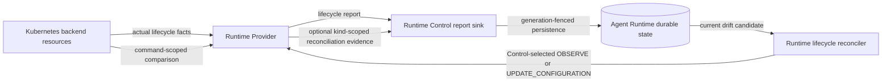

# Runtime Deployment Continuity Design

- Snapshot: `runtime-260804`
- Document reference: `runtime-260804/DESIGN`
- Requirements: [Runtime Deployment Continuity Requirements](../requirements/runtime-260804-deployment-continuity.md)
- ADR: [Runtime Deployment Continuity](../adr/runtime-260804-deployment-continuity.md)

## Current Behavior and Gaps

The Kubernetes Runtime Provider stores verified NetworkPolicy state in the
process-local `_verified_command_policies` dictionary. The verification identity
includes the Provider connection generation, desired generation, configuration
revision ID, and digest.

An explicit command can verify the current NetworkPolicy and populate this cache.
Pod watch and leader-failover reports then require a matching cache entry before
they preserve `running`. When a Provider process restarts, the cache disappears,
so a healthy Ready Pod is rewritten to `starting` with
`network_policy_not_ready`. Runtime Control persists that fabricated lifecycle
state and the Runtime becomes unavailable until later lifecycle convergence or a
user Force Restart.

The report protocol has lifecycle, reason, diagnostic, and configuration evidence
but no structured reconciliation evidence. Runtime Control persists lifecycle and
generation fields while discarding Provider reason and diagnostic fields. Returning
truthful `running` without adding another evidence path would therefore remove the
incident but also remove durable NetworkPolicy drift repair.

## Requirement and Decision Traceability

| Requirement | ADR decisions | Design mechanisms |
| --- | --- | --- |
| `runtime-260804/REQ-1` | D1, D3, D7 | M1, M4 |
| `runtime-260804/REQ-2` | D6, D7 | M4, M7 |
| `runtime-260804/REQ-3` | D1, D2, D3, D4, D5 | M1, M2, M3, M5 |
| `runtime-260804/REQ-4` | D1, D2, D4, D5 | M2, M3, M5 |
| `runtime-260804/REQ-5` | D2, D3, D4, D6, D7 | M2, M3, M4, M5, M7 |
| `runtime-260804/REQ-6` | D4, D5 | M5, M6 |

## Architecture and Ownership



- Kubernetes owns actual Pod, PVC, and NetworkPolicy resources.
- Provider owns backend inspection and application of an explicit command.
- Provider lifecycle reports describe backend lifecycle without consulting
  Provider process history.
- Provider reconciliation observations describe one named managed-resource
  comparison and contain no repair command.
- Runtime Control owns the durable observation projection, freshness fences,
  retry claims, precedence, and repair-command selection.
- Existing Runtime configuration revisions remain the desired/applied
  configuration authority.
- Provider and Runner connection generations remain transport freshness fences.

## Provider Report Contract

`RuntimeProviderReport` adds protobuf field 12:

```proto
message RuntimeProviderReconciliationObservation {
  string kind = 1;
  string status = 2;
  string reason = 3;
  map<string, string> diagnostic = 4;
}

message RuntimeProviderReconciliationEvidence {
  repeated RuntimeProviderReconciliationObservation observations = 1;
}

message RuntimeProviderReport {
  // Existing fields 1-11 remain unchanged.
  RuntimeProviderReconciliationEvidence reconciliation = 12;
}
```

The shared Python library defines:

- `RuntimeProviderReconciliationStatus` with `IN_SYNC` and `DRIFTED`;
- frozen `RuntimeProviderReconciliationObservation`;
- frozen `RuntimeProviderReconciliationEvidence`; and
- required nullable `RuntimeProviderReport.reconciliation`.

The outer protobuf message provides presence:

- field absent: no authoritative reconciliation update;
- field present: one or more authoritative kind-scoped observations.

Each kind appears at most once. Empty evidence, empty kind, unsupported status, an
empty reason, or duplicate kinds is a protocol error. The initial Provider emits
only kind `network_policy`. `in_sync` means the NetworkPolicy comparison is in
sync, not that the complete Runtime is globally in sync.

The Provider reason and diagnostic map remain bounded evidence and operator
context. Runtime Control persists the recognized kind, status, and reason but does
not parse diagnostic values as action authority.

Control uses protobuf `HasField("reconciliation")` to distinguish current
lifecycle-only v2 reports from authoritative evidence. Absence is not interpreted
as an old Provider or compatibility mode.

The Kubernetes Provider advertises
`agent-runtime-provider-kubernetes-v2` and advances its implementation version.
Before Provider connection registration, Runtime Control requires that exact
protocol for Provider kind `kubernetes`. A Kubernetes v1 Provider is rejected
before it can receive a connection generation or command authority. Docker retains
its unchanged protocol.

## Kubernetes Observation Behavior

### Explicit command-scoped reports

`KubernetesRuntimeProvider.observe(command)` continues validating the complete
Runtime configuration envelope. It reads Pod, PVC, and NetworkPolicy resources
without mutation.

- Missing Pod reports `stopped` using the existing PVC-aware reason and emits no
  NetworkPolicy observation.
- Present Pod lifecycle always comes from `_observed_state(pod)`.
- Exact actual and expected NetworkPolicy emits
  `network_policy:in_sync`.
- Missing NetworkPolicy emits `network_policy:drifted` with bounded reason
  `network_policy_missing`.
- Unequal NetworkPolicy emits `network_policy:drifted` with bounded reason
  `network_policy_mismatch`.
- Pod deletion, terminal phase, readiness, or failure remains the lifecycle
  authority even when NetworkPolicy drift is attached.

`start` and `update_configuration` already apply the explicit expected
NetworkPolicy and then call `observe`; their completion reports therefore produce
fresh evidence. `stop`, terminal delete, and absent-resource reports do not claim
NetworkPolicy convergence.

### Watch and failover reports

`observe_known_runtimes()` and `watch_known_runtimes()` retain their actual
Pod/PVC lifecycle reports and configuration metadata. They emit
`reconciliation=None` because resource labels and annotations identify applied
metadata but do not reconstruct the complete expected Profile.

Pod watch remains Pod-only. NetworkPolicy drift is detected through periodic
explicit observation rather than a new NetworkPolicy watch.

### Removed Provider authority

The Kubernetes Provider removes:

- `_CommandPolicyKey`;
- `_VerifiedCommandPolicy`;
- `_verified_command_policies`;
- every cache clear/pop branch;
- the asynchronous and module-level
  `_fail_closed_without_command_policy()` helpers; and
- cache-specific tests and Spec text.

Docker Provider keeps its existing truthful lifecycle observation and supplies
`reconciliation=None` until it implements a complete command-scoped managed
resource comparison.

## Durable Runtime Reconciliation Projection

The `agent_runtimes` table adds:

| Column | Type | Meaning |
| --- | --- | --- |
| `provider_reconciliation_status` | nullable PostgreSQL enum | `in_sync`, `drifted`, or no evidence when null |
| `provider_reconciliation_kind` | nullable text | recognized provider observation kind |
| `provider_reconciliation_reason` | nullable text | bounded current observation reason |
| `provider_reconciliation_provider_generation` | nullable integer | Provider stream generation that carried the evidence |
| `provider_reconciliation_observed_generation` | nullable integer | Runtime desired generation observed by Provider |
| `provider_reconciliation_configuration_revision_id` | nullable Runtime configuration revision FK | exact comparison revision |
| `provider_reconciliation_observed_at` | nullable timezone timestamp | authoritative evidence time |
| `provider_reconciliation_requested_at` | nullable timezone timestamp | last atomic repair request claim |

Null status means that no actionable recognized evidence has been persisted. An
`in_sync` row retains its kind and fences so Control can distinguish verified
kind-scoped convergence from missing evidence.

`AgentRuntime` repository data mirrors these fields. No public API field is added
in this focused PR.

## Evidence Persistence

`RuntimeProviderReportRepositorySink` processes a report in one database
transaction:

1. validate the immutable Runtime Provider binding;
2. process existing terminal-delete and configuration evidence;
3. persist generation-fenced lifecycle state;
4. when reconciliation evidence is present, select the recognized
   `network_policy` observation and persist it with the report's Provider
   generation, observed desired generation, exact runtime-configuration revision
   ID, and report time; and
5. persist connected transport state.

Evidence persistence requires:

- report desired generation exactly equals current Runtime desired generation;
- report Provider generation is not older than current durable Provider
  generation;
- report configuration revision ID equals the Runtime's current desired revision;
- the revision belongs to the Runtime and immutable Provider binding; and
- terminal delete is not already acknowledged.

An absent evidence message does nothing to the reconciliation columns. A present
recognized `in_sync` observation replaces drift and clears its repair-request
marker. A fresh `drifted` observation replaces the prior projection and clears the
marker when the evidence timestamp or fences changed.

The current v2 contract accepts only kind `network_policy`. An unsupported kind,
invalid observation, or duplicate kind rejects the complete report before
persistence. Runtime Control never ignores or stores uninterpreted reconciliation
semantics.

## Reconciliation Candidate and Atomic Claim

The repository selects NetworkPolicy repair candidates only when:

- desired state is running;
- Provider observed lifecycle is running;
- reconciliation status is drifted;
- reconciliation kind is `network_policy`;
- evidence desired generation equals current desired generation;
- evidence configuration revision equals both current desired and applied
  revision;
- no terminal deletion is active; and
- the bounded repair retry interval is eligible.

Before claim, the reconciler reads the current Provider connection from the
Coordination Store. If it is absent, ordinary route-unavailable handling records
transport disconnection. If its generation differs from the evidence Provider
generation, Control dispatches or waits for fresh `OBSERVE` instead of repair.

The repository then atomically claims the exact evidence tuple:

- Runtime ID;
- kind and status;
- Provider generation;
- desired generation;
- configuration revision;
- evidence observation time; and
- repair retry eligibility.

The claim sets `provider_reconciliation_requested_at`. Concurrent replicas or
later stale candidates cannot claim the same evidence during the retry interval.
A failed dispatch becomes eligible again after the existing Provider command
deadline. A fresh observation can become immediately eligible because its
observation time is newer than the previous request.

## Reconciler Precedence and Actions

One reconciliation pass uses this order:

1. ordinary lifecycle commands and lifecycle retries;
2. current desired-configuration in-place adoption;
3. current NetworkPolicy drift repair;
4. periodic read-only observation; and
5. existing start-timeout evaluation.

A Runtime handled by an earlier lane is skipped by later lanes for that pass.

Current exact `network_policy:drifted` maps to
`UPDATE_CONFIGURATION`. The Provider applies the current authoritative
NetworkPolicy and returns fresh observation. Control does not change desired
generation, recreate the Pod, or clear evidence on dispatch.

Missing, absent, stale, or Provider-generation-mismatched evidence maps to fresh
`OBSERVE`, subject to the existing periodic throttle. It never maps to `START`
solely because reconciliation evidence is unavailable.

The existing lifecycle rule may still use `START` for an actually `stopped` or
`unknown` backend when desired state is running. This is driven by truthful
lifecycle evidence, not drift or connection history.

## Configuration Transition Boundary

Authoritative drift repair requires:

```text
desired_runtime_configuration_revision_id
==
applied_runtime_configuration_revision_id
==
provider_reconciliation_configuration_revision_id
```

When desired and applied revisions differ, existing configuration adoption or
explicit recreation remains authoritative and periodic drift repair stays
excluded. Runtime Control does not:

- compare the pending desired revision as though it were applied;
- send an older applied revision under the current desired generation;
- clone applied configuration into a comparison revision; or
- introduce a comparison-generation protocol.

Removing the Provider cache still keeps lifecycle truthful during this transition.
Only automatic NetworkPolicy drift repair waits until configuration convergence.

## Failure, Retry, and Recovery

- Invalid command configuration remains a Provider command failure, not drift.
- Unsupported reconciliation kinds fail report validation before persistence or
  command selection.
- Report loss leaves the previous generation-fenced evidence durable.
- Control restart reloads current evidence and may claim it after the retry fence.
- Provider reconnect invalidates old evidence for action because the live
  connection generation differs. Fresh observation establishes current evidence.
- Route-unavailable and command failure retain drift and retry after the bounded
  deadline.
- An in-sync report clears current drift but does not alter Runtime desired state.
- Watch and failover reports cannot clear current evidence.
- Reset and terminal delete retain their existing destructive boundaries.

## Security and Data Preservation

No new Provider credential, permission, Kubernetes RBAC, NetworkPolicy authority,
or public administrative control is introduced.

Observation performs Kubernetes GET/LIST/WATCH only. Repair uses the existing
NetworkPolicy application boundary. It does not delete the Runtime Pod or PVC.
Agent Workspace PVC and Docker host-directory semantics remain unchanged.

Diagnostics remain bounded strings and exclude credentials, tokens, raw policy
documents, and complete resolved configuration.

## Migration

Generate one Alembic revision through the repository command, never by manually
creating a migration file. The migration:

1. creates `runtime_provider_reconciliation_status`;
2. adds the nullable reconciliation columns and named configuration-revision
   foreign key;
3. adds a named candidate index covering status/kind and current evidence fences
   only if query validation shows it is necessary;
4. leaves existing rows with null evidence; and
5. supports downgrade by dropping the foreign key, columns, and enum type.

Update `python/apps/azents/db-schemas/rdb/revision` to the generated revision ID.
No data backfill asserts in-sync or drift.

## Deployment and Recovery

Deployment order:

1. drain and stop old Runtime Control command authority;
2. apply the database migration;
3. deploy current Runtime Control with the Kubernetes v2 registration gate;
4. deploy the Kubernetes v2 Provider from the same release;
5. allow periodic explicit observations to populate current evidence; and
6. verify existing Running Runtimes remain Running through Provider replacement.

There is no supported old/new Provider-Control mixed mode. A reconnecting
Kubernetes v1 Provider is rejected. Within the current v2 contract, absent evidence
means the report source did not authoritatively compare a managed resource and
never means Runtime failure.

Cross-version rollback is unsupported. Recovery uses roll-forward to matching
current Control and Kubernetes Provider versions. Existing backend Pods remain
untouched during the bounded Provider disconnect.

## Observability

Structured logs record:

- Runtime ID, Provider ID, Provider generation, desired generation, configuration
  revision, reconciliation kind, status, and reason when evidence is persisted;
- repair claim, command type, request ID, and retry age;
- stale desired/configuration/provider-generation evidence rejection;
- fresh-observation fallback after Provider reconnect; and
- Provider explicit observation source without raw policy contents.

Existing lifecycle and Provider connection logs remain separate so operators can
distinguish backend state, transport availability, and managed-resource drift.

## Test Strategy

### E2E primary verification matrix

| Scenario | Expected evidence |
| --- | --- |
| Coordinated Provider replacement with healthy Runtime | Pod and Runner remain healthy; Runtime lifecycle remains running; operations resume after route reconnection without Force Restart |
| Missing or modified NetworkPolicy | Runtime lifecycle remains running; explicit observation persists `network_policy:drifted`; Control dispatches `UPDATE_CONFIGURATION`; later evidence becomes in-sync |
| Runtime Control restart after drift persistence | Current evidence survives; one generation-fenced repair claim resumes |
| Provider reconnect after old drift | Old Provider-generation evidence cannot repair; fresh observation precedes action |
| Configuration desired/applied mismatch | Existing adoption/recreation path retains precedence; no comparison-generation repair occurs |
| Repair with persisted Workspace data | PVC and workspace sentinel bytes remain unchanged |

The preferred integration coverage is the credential-free runtime-provider E2E
with a real Provider. A Kubernetes-specific live lane may be optional when the CI
environment cannot mutate a real NetworkPolicy, but deterministic Provider,
repository, sink, and reconciler coverage is mandatory.

### Protocol and shared-library tests

- absent field round-trip produces `reconciliation=None`;
- present in-sync and drifted observations round-trip;
- empty, duplicate, invalid-status, empty-kind, and unsupported-kind evidence is
  rejected;
- generated provider-control protobuf and type stubs are current;
- no OpenAPI or TypeScript client changes are produced.

### Provider and registration tests

- Kubernetes Provider v1 registration is rejected before connection authority;
- Kubernetes Provider v2 registration is accepted;
- Provider restart watch of a Ready Pod remains running;
- watch/failover reports omit reconciliation evidence;
- exact explicit observation reports NetworkPolicy in-sync;
- missing or broadened NetworkPolicy reports drift while lifecycle remains running;
- observation does not mutate NetworkPolicy, Pod, or PVC;
- deleting, failed, pending, PVC-only, and absent-resource lifecycle remains
  truthful;
- Docker reports explicitly use absent reconciliation evidence.

### Repository and sink tests

- current exact evidence persists;
- stale Provider or desired generation is rejected;
- incorrect configuration revision is rejected;
- absent evidence does not clear current evidence;
- in-sync evidence clears drift and repair marker;
- Provider reconnect makes old evidence action-ineligible;
- concurrent claims produce one repair request per retry window;
- a fresh observation is immediately claimable;
- migration upgrade/downgrade and model metadata agree.

### Reconciler tests

- lifecycle and configuration adoption retain precedence;
- current NetworkPolicy drift dispatches `UPDATE_CONFIGURATION`;
- drift never dispatches `START`;
- stale/unknown evidence dispatches or waits for `OBSERVE`;
- desired/applied mismatch is excluded;
- route failure retains evidence and retries after the deadline.

### Commands and evidence

- regenerate protobuf through
  `cd python/libs/azents-runtime-control && uv run python scripts/generate_proto.py`;
- run focused Ruff, configured type checking, and Pytest in the shared library,
  Kubernetes Provider, Docker Provider, and Azents backend projects;
- run migration validation and relevant deterministic E2E;
- retain CI job links and E2E observations in the PR.

Tests fail rather than skip when deterministic prerequisites are available.
Optional live Kubernetes evidence may skip only when its declared cluster
prerequisite is unavailable.

## Alternatives and Non-Blocking Risks

- A separate NetworkPolicy watch could reduce detection latency but adds another
  resource stream and does not change the authority model. The periodic observation
  cadence is sufficient for this correction.
- The v2 contract accepts only `network_policy`. A new reconciliation kind requires
  a new Requirements/ADR/Design snapshot and coordinated protocol version.
- Operational recovery must restore the coordinated current protocol; the
  cache-based v1 Provider is not a rollback target.

## Design Authority

- Design revision: `3`

| ID | Material design mechanism | Authority | Classification |
| --- | --- | --- | --- |
| M1 | Add optional `network_policy` reconciliation observations with explicit absence, strict unsupported-kind rejection, and no repair action. | `runtime-260804/REQ-1`, `REQ-3`, `REQ-4`, `runtime-260804/ADR-D1`, `ADR-D8` | `decided` |
| M2 | Persist the current recognized observation and exact Provider, desired-generation, and configuration-revision fences on Agent Runtime. | `runtime-260804/REQ-3`, `REQ-4`, `REQ-5`, `runtime-260804/ADR-D2` | `decided` |
| M3 | Atomically claim current drift with bounded retry while comparing the live Provider connection generation. | `runtime-260804/REQ-3`, `REQ-4`, `REQ-5`, `runtime-260804/ADR-D2`, `ADR-D5` | `derived` |
| M4 | Remove Provider-local verification authority and keep explicit, watch, and failover lifecycle observation truthful. | `runtime-260804/REQ-1`, `REQ-2`, `REQ-5`, `runtime-260804/ADR-D3`, `ADR-D7` | `decided` |
| M5 | Give lifecycle and configuration adoption precedence, repair only exact desired/applied revision drift, and map NetworkPolicy drift to Control-selected `UPDATE_CONFIGURATION`. | `runtime-260804/REQ-3`, `REQ-4`, `REQ-5`, `REQ-6`, `runtime-260804/ADR-D4`, `ADR-D5` | `decided` |
| M6 | Preserve the existing non-destructive NetworkPolicy application and Workspace storage boundaries. | `runtime-260804/REQ-6`, current Runtime Persistence Spec | `existing` |
| M7 | Advance Kubernetes Provider to protocol v2 and reject v1 before connection registration or command authority, with no mixed-version or rollback compatibility mode. | `runtime-260804/REQ-2`, `REQ-5`, `runtime-260804/ADR-D6` | `decided` |
| M8 | Replace cache-specific tests and Specs with protocol, persistence, Provider, reconciler, deployment, and E2E verification. | `runtime-260804/REQ-1` through `REQ-6`, `runtime-260804/ADR-D7` | `required` |

## Removal and Replacement

| Existing unit or behavior | Removal authority | Replacement or remaining authority | Removal boundary | Absence verification |
| --- | --- | --- | --- | --- |
| `_CommandPolicyKey`, `_VerifiedCommandPolicy`, and `_verified_command_policies` | M4 | Command-scoped structured evidence plus Control persistence | Kubernetes Provider source and tests | Production source contains no verified-command-policy cache |
| `_fail_closed_without_command_policy()` method/helper and cache invalidation branches | M4 | Actual Pod lifecycle plus optional reconciliation observation | Explicit observe, failover, and watch report conversion | Ready Pod restart/watch tests remain running |
| `STARTING/network_policy_not_ready` as a policy-drift representation | M1, M4, M5 | `RUNNING` lifecycle plus `network_policy:drifted` | Provider reports, sink, repository, reconciler, projections | No policy mismatch test expects lifecycle starting |
| Cache-authority Living Spec paragraph | M4, M8 | Provider fact and Control reconciliation boundary | Runtime Control and Runtime Provider Specs | Spec review finds no process-local lifecycle authority |
| Cache-specific fixtures and assertions | M8 | Protocol presence, stale-fence, claim, and repair tests | Shared library, Provider, backend, E2E | Focused test suites and CI pass |
| Kubernetes Provider v1 registration and report authority | M7 | Exact Kubernetes Provider v2 registration gate and current field 12 contract | Provider identity, Control registration, proto, tests | v1 registration rejection and v2 acceptance tests |
| Absence of durable drift state | M2, M3 | Nullable current reconciliation projection and atomic claim | Agent Runtime schema/model/repository | Migration and repository tests prove persistence across Control restart |

## Feasibility

- M1 is feasible because protobuf message presence provides
  absent-versus-present semantics and the shared gRPC conversion is centralized.
- M2 and M3 are feasible through nullable Agent Runtime columns and an atomic
  conditional update; no new distributed store or scheduler is required.
- M4 is feasible because `_observed_state(pod)` already provides truthful lifecycle
  and Provider tests identify every cache-dependent branch.
- M5 is feasible through the existing `UPDATE_CONFIGURATION` command and
  reconciliation ordering. Exact desired/applied revision exclusion preserves the
  current generation contract.
- M6 retains existing Provider storage behavior and requires no new destructive
  permission.
- M7 is feasible because Provider kind and protocol version are available before
  connection registration; an exact Kubernetes v2 gate can reject v1 without a
  legacy parser or command-route fallback.
- M8 has deterministic unit and repository coverage; live Kubernetes mutation is
  supplementary rather than the only evidence.

No implementation blocker or unresolved material decision remains.

## Design Approval

- Mode: `Autonomous`
- Decision owner: `runtime-design-owner`
- Approved on: `2026-08-04`
- Approved Design revision: `3`
- Approved authority IDs: `M1, M2, M3, M4, M5, M6, M7, M8`
- Approved scope: truthful Provider lifecycle observation, kind-scoped structured
  NetworkPolicy evidence, durable generation- and revision-fenced Control
  reconciliation, in-place repair, cache removal, exact Kubernetes Provider v2
  admission, coordinated deployment, and complete verification without
  comparison-generation or compatibility authority.
