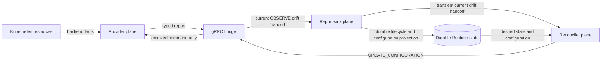

# Runtime Bounded Drift Re-observation Design

- Snapshot: `runtime-260805`
- Document reference: `runtime-260805/DESIGN`
- Requirements: [Runtime Bounded Drift Re-observation Requirements](../requirements/runtime-260805-bounded-drift-reobservation.md)
- ADR: [Runtime Bounded Drift Re-observation](../adr/runtime-260805-bounded-drift-reobservation.md)

## Current Behavior and Gap

The current v2 Provider contract correctly separates truthful Pod lifecycle from
NetworkPolicy drift. However, Runtime Control persists the latest drift on the
Runtime row and uses a separate candidate/claim lane to repair it. This makes
transient comparison output durable Runtime authority even though periodic
explicit observation can rediscover the same idempotent condition.

## Requirement and ADR Traceability

| Requirement | ADR decisions | Design mechanisms |
| --- | --- | --- |
| `runtime-260805/REQ-1` | D3, D4 | M1, M2 |
| `runtime-260805/REQ-2` | D1, D2 | M2, M3, M4 |
| `runtime-260805/REQ-3` | D1, D2, D3 | M3, M4 |
| `runtime-260805/REQ-4` | D3, D4 | M1, M2, M3 |

## Architecture and Ownership

### Provider plane

Provider owns Kubernetes inspection and applying a command received from Runtime
Control. It reports Pod lifecycle directly and may attach typed
`network_policy` comparison results only when a command supplies the complete
expected configuration.

Provider must not:

- use process-local command history, drift, or prior repair results to alter
  lifecycle;
- choose `UPDATE_CONFIGURATION`, `START`, or any repair command;
- persist Runtime or repair authority; or
- retry a repair independently.

### Report-sink plane

The report sink owns validation and durable projection at the Control boundary. It
checks stream generation, immutable Provider binding, and current configuration
evidence, then persists lifecycle, configuration acknowledgement, and connection
state.

The report sink must not:

- persist reconciliation/drift state;
- infer backend state from lifecycle reasons or diagnostics;
- turn watch/failover reports into repair requests; or
- schedule retries.

It may hand one validated drift observation to the Reconciler only when the bridge
identifies the originating command as `OBSERVE`.

### Reconciler plane

The Reconciler owns Control-selected command dispatch. It reads durable desired
state and configuration state, checks the current Provider connection generation,
and dispatches existing command types.

The Reconciler must not:

- call Kubernetes APIs or reconstruct expected policies;
- reinterpret Provider lifecycle;
- persist a drift queue, retry marker, or repair claim; or
- retry a failed drift repair until a later `OBSERVE` handoff arrives.

## Transient OBSERVE Repair Handoff

The active gRPC Provider stream records each relayed request ID and command type in
memory until its completion is processed. The mapping is intentionally lost when
the stream or Control process ends.

For a successful completion:

1. the bridge validates the current stream generation and Provider identity;
2. the report sink validates and persists ordinary lifecycle/configuration state;
3. only if the correlated command type is `OBSERVE`, lifecycle is `running`,
   configuration evidence is current, and typed `network_policy` status is
   `drifted`, the sink invokes the Reconciler handoff;
4. the Reconciler rechecks current Provider connection generation and exact
   desired/applied configuration revision, then dispatches one
   `UPDATE_CONFIGURATION`; and
5. no state records that repair request.

`START` and `UPDATE_CONFIGURATION` completion reports can carry typed evidence but
do not invoke the handoff. This prevents immediate recursion after an unsuccessful
repair. A periodic `OBSERVE` later provides the only retry opportunity.

The bridge removes request correlation after processing completion. Unknown,
late, or post-restart completions still contribute valid ordinary report
projections when generation checks pass, but they cannot issue repair.

## Failure and Recovery

- Losing an OBSERVE report, handoff, dispatch, or Control process loses that one
  repair opportunity.
- The existing periodic observation cadence discovers remaining drift and repeats
  the bounded handoff.
- Provider reconnect creates a new transport generation; only an observation from
  the current generation may dispatch repair.
- Desired/applied configuration mismatch, lifecycle dispatch, reset, terminal
  delete, and configuration adoption retain existing precedence.
- `UPDATE_CONFIGURATION` remains non-destructive and preserves Agent Workspace
  storage.

## Data and Migration

Remove the reconciliation status enum, all reconciliation columns, foreign key,
candidate index, domain fields, repository methods, and Alembic revision introduced
by `runtime-260804`. The migration head returns to the predecessor revision because
the introduced migration is unmerged and has not been executed by this work.

No drift data migration or backfill is needed because the durable projection is
removed before deployment.

## Observability

Structured logs retain Runtime ID, Provider ID, Provider generation, desired
generation, configuration revision, reconciliation kind, and reason at the
transient handoff and dispatch boundary. They do not expose raw NetworkPolicy
documents or create a durable repair history.

## Test Strategy

### E2E primary verification matrix

| Scenario | Expected evidence |
| --- | --- |
| Healthy Pod through Provider replacement | Lifecycle remains `running`; no repair originates from watch/failover reports |
| Periodic OBSERVE finds missing NetworkPolicy | One current `UPDATE_CONFIGURATION` is dispatched |
| Control loss after OBSERVE completion | No persisted drift state; later periodic OBSERVE can rediscover and dispatch repair |
| Failed `UPDATE_CONFIGURATION` completion | No immediate second repair; a later OBSERVE is required |
| Provider generation changes before handoff | No repair dispatch from the stale observation |

### E2E plan and CI policy

Existing deterministic E2E validates Control/Provider command routing. Extend it
when its fixture can exercise an OBSERVE completion and later retry boundary;
otherwise use focused deterministic repository, gRPC bridge, and Reconciler tests
as diagnostic coverage. CI must run affected Python test suites, type checks,
protobuf generation, migration-head verification, and existing deterministic E2E.
Optional live Kubernetes testing remains skipped unless an explicitly provisioned
cluster is available.

## Design Authority

- Design revision: `1`

| ID | Material design mechanism | Authority | Classification |
| --- | --- | --- |
| M1 | Strict Provider, report-sink, and Reconciler responsibility/prohibition boundaries | `runtime-260805/REQ-4`, `ADR-D4` | `decided` |
| M2 | Retain typed v2 NetworkPolicy comparison while lifecycle remains truthful | `runtime-260805/REQ-1`, `REQ-4`, `ADR-D3` | `decided` |
| M3 | OBSERVE-completion-only transient drift handoff and fenced one-shot repair dispatch | `runtime-260805/REQ-2`, `REQ-3`, `ADR-D2` | `decided` |
| M4 | Periodic OBSERVE as the sole retry after loss or failed repair | `runtime-260805/REQ-2`, `ADR-D1`, `ADR-D2` | `decided` |
| M5 | Remove durable reconciliation schema and repair projection introduced by `runtime-260804` | `runtime-260805/REQ-2`, `ADR-D1` | `decided` |

## Removal and Replacement

| Existing unit or behavior | Removal authority | Replacement or remaining authority | Removal boundary | Absence verification |
| --- | --- | --- | --- | --- |
| Reconciliation enum, Runtime row columns, migration, and repository fields | `ADR-D1`, M5 | None; periodic observation is the retry mechanism | Database/model/repository | Search finds no reconciliation persistence identifiers or migration revision |
| Reconciliation candidate/claim Reconciler lane | `ADR-D1`, `ADR-D2`, M3-M4 | OBSERVE-completion handoff | Reconciler | Tests prove no durable drift candidate or immediate repair loop |
| Repair dispatch from non-OBSERVE reports | `ADR-D2`, M3 | None | gRPC bridge/report sink | Tests prove watch, START, and UPDATE_CONFIGURATION reports cannot dispatch repair |
| Provider-local command-history authority | Existing `runtime-260804/ADR-D7`, M2 | None | Kubernetes Provider | Search and Provider tests prove cache helpers are absent |

## Feasibility

Feasible. The current gRPC bridge already sees both relayed command request IDs and
their completions within one stream. A stream-local request-to-command mapping can
identify OBSERVE completion without a protocol, database, or cross-replica state
change. Existing periodic observation already supplies bounded rediscovery.

## Design Approval

- Mode: `Requester-directed`
- Decision owner: requester
- Approved on: 2026-08-05
- Approved Design revision: `1`
- Approved authority IDs: `M1, M2, M3, M4, M5`
- Approved scope: remove durable drift repair state; use fenced transient
  OBSERVE-completion repair with periodic re-observation; establish plane
  ownership boundaries.
