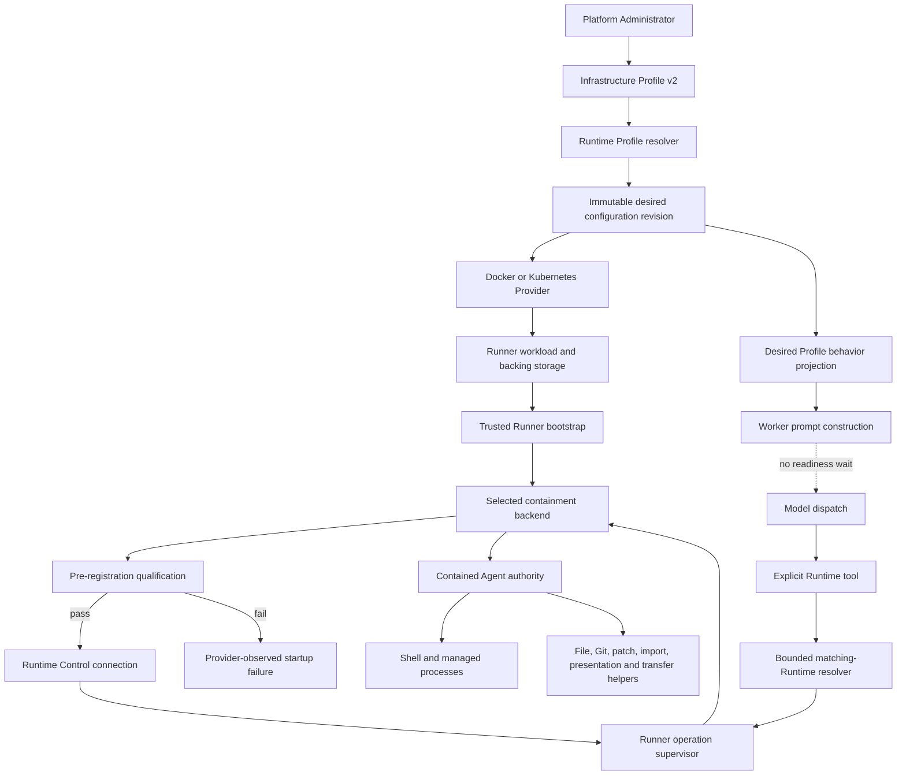

# Provider-Owned Runtime Process Containment Design

- Snapshot: `runtime-260808`
- Document reference: `runtime-260808/DESIGN`
- Requirements: [Provider-Owned Runtime Process Containment Requirements](../requirements/runtime-260808-provider-process-containment.md) (`runtime-260808/REQ`)
- ADR: [Provider-Owned Runtime Process Containment](../adr/runtime-260808-provider-process-containment.md) (`runtime-260808/ADR`)
- Design revision: `1`
- Mode: Collaborative
- Decision owner: requester

## Summary

Contained Runtime Profiles add a Provider-owned Agent process boundary inside the
existing Runner workload. The trusted Runner remains the operation supervisor, but no
Agent-selected process, path, repository, import, presentation, or transfer operation
uses the Runner's broader operating-system authority. One pluggable containment backend
creates the Agent filesystem, process, environment, privilege, and socket view for every
Agent-facing operation.

The initial backend adapter uses `bwrap`, but Runner operation code depends only on a
backend-neutral interface. A contained Runner qualifies that backend locally before its
normal Runtime Control connection. The existing Provider/Runner configuration evidence
and desired/applied revision fences remain authoritative; no containment-specific
lifecycle state is persisted.

The Worker renders bounded Runtime behavior from the resolved desired Profile without
waiting for Runner readiness. Explicit Runtime TurnActions and tools use one shared,
bounded matching-Runtime resolver before dispatching their Runner operation.

## Current Behavior and Gaps

### Runtime authority

- Kubernetes and Docker Providers create one Runner workload whose process environment,
  root filesystem, Workspace mount, and Runtime Control credentials belong to the
  trusted Runner.
- `bash` and managed-process operations call `asyncio.create_subprocess_shell()` directly
  and construct their child environment from `os.environ.copy()`.
- Native file, patch, search, Git, worktree, import, presentation, and transfer path
  access executes in trusted Runner Python code or a trusted Runner subprocess.
- `Workspace.resolve()` intentionally accepts absolute Runtime filesystem paths, so
  application path normalization is not a containment boundary.

### Configuration and readiness

- Immutable resolved Runtime configuration revisions already contain the typed effective
  Profile and canonical digest.
- Provider and Runner reports already carry `RuntimeConfigurationEvidence` containing
  revision ID, digest, and desired generation. Runtime Control generation-fences those
  reports and promotes the applied revision only after matching Provider and Runner
  evidence.
- Toolkit Runtime operations have an existing bounded readiness polling path, but
  TurnActions such as Session working-folder and worktree creation perform an
  instantaneous `runner_state == READY` check and fail when startup is still converging.
- `BUSY` is already treated as retained Runner qualification in the Control state sink,
  but several callers still require literal `READY`.

### Prompt and Session coupling

- `RuntimeToolkit.get_static_prompt()` currently loads Workspace, working-folder, and
  Project data and describes `/tmp`, but it has no resolved Profile behavior input.
- Toolkit context creation itself does not wait for Runner readiness.
- Prompt assembly uses frozen toolkit prompt fragments and performs no Runner request.
- Session context and setup paths can still fail or block model-eligible work when the
  Runner-reported Workspace path or an explicitly ordered Runtime action is unavailable.

### Provider gaps

- Profile contracts have only Kubernetes Pod v1 and Docker Container v1 schemas and no
  portable containment module.
- Docker container creation does not yet model the complete security options needed by
  a contained backend.
- Kubernetes creates a separate shared `/tmp` volume only for DinD, while contained
  Profiles require Agent temporary storage without DinD.
- Child processes inherit Runner Control and authentication environment variables.
- No Runner-local containment backend or pre-registration qualification exists.

## Requirement and ADR Traceability

| Requirement | Design mechanisms |
| --- | --- |
| `runtime-260808/REQ-1` | Profile v2 containment module, Provider capability advertisement, compatibility evaluation |
| `runtime-260808/REQ-2` | Runner-local backend, contained operation routing, allowlisted environment, hidden Runner projection |
| `runtime-260808/REQ-3` | Backend identity/privilege policy, startup qualification, conformance tests |
| `runtime-260808/REQ-4` | Preserved absolute Agent Workspace mount and unchanged intra-Workspace access |
| `runtime-260808/REQ-5` | Positive read-only system toolchain projection and hidden Runner installation |
| `runtime-260808/REQ-6` | Dedicated Runtime-scoped Agent `/tmp`, `/tmp/agent` compatibility, separate Runner temporary storage |
| `runtime-260808/REQ-7` | Provider network namespace/policy retained, no Agent infrastructure credentials or sockets |
| `runtime-260808/REQ-8` | Profile v2 validation rejects containment with DinD; no Docker socket projection |
| `runtime-260808/REQ-9` | Kubernetes and Docker Provider preparation plus one shared backend contract |
| `runtime-260808/REQ-10` | Pre-registration qualification, Provider-observed startup failure, no fallback |
| `runtime-260808/REQ-11` | Portable Profile module and pluggable backend interface |
| `runtime-260808/REQ-12` | Positive projection and portable modules permit later restrictive composition |
| `runtime-260808/REQ-13` | v1 preservation, explicit v2 adoption, recreation classification, Workspace preservation |
| `runtime-260808/REQ-14` | Process, file, Git, import, presentation, and transfer parity through contained execution |
| `runtime-260808/REQ-15` | Desired-Profile prompt renderer and existing-state-derived product projections |
| `runtime-260808/REQ-16` | Prompt/readiness separation and shared bounded Runtime operation target resolution |

## Architecture

## Ownership and Source of Truth

| Concern | Authority |
| --- | --- |
| Portable containment intent | Typed effective Runtime Profile v2 |
| Provider support | Provider profile capability contract |
| Desired physical configuration | Immutable desired Runtime configuration revision |
| Applied physical configuration | Existing matching Provider and Runner configuration evidence |
| Concrete backend selection | Trusted Provider/Runner deployment configuration |
| Backend qualification | Runner-local pre-registration qualification |
| Runtime lifecycle and generations | Existing Runtime Control state and reconciliation |
| Agent filesystem and process authority | Selected qualified containment backend |
| Model-visible Runtime behavior | Code-owned projection of resolved desired Profile |
| Current product status projection | Desired Profile, desired/applied revision, and current Runner authority |

No Profile, Runner diagnostic, or Provider diagnostic carries arbitrary prompt text.
No new containment boolean, lifecycle enum, or durable qualification authority is
introduced.

## Profile and Capability Contracts

### Profile schema version 2

Both existing contract families accept a new schema version while preserving version 1
unchanged:

- `kubernetes.pod-profile`, schema version 2
- `docker.container-profile`, schema version 2

Version 2 adds one shared portable process-containment module. The initial module has no
backend-specific knobs. Its presence means that the complete containment behavior in
`runtime-260808/REQ` is required. Absence means that the Profile does not claim this
capability.

The parser dispatches by Profile kind and schema version, canonicalizes the module into
the effective Profile, and includes it in the immutable configuration digest. Workspace
policy composition may retain or further restrict the effective Profile but cannot
remove or weaken the Provider module.

Profile validation rejects containment with a non-null DinD module. The compatibility
classifier adds the portable `runtime.process-containment` capability requirement when
the module is present. Provider contracts advertise schema version 2 and that capability
only when their deployment can prepare the containment backend class.

A version change or any containment-module adoption/removal is classified as physical
Runtime recreation. Existing version 1 Profiles, revisions, and Runtimes remain valid
and unchanged.

### Provider capability diagnostics

Provider capability advertisement remains a compatibility statement, not proof that a
particular Runtime is qualified. Safe Provider metadata may identify the supported
backend family and version for administrators, but backend identity is not Profile input
and does not enter the configuration digest.

## Provider Preparation

### Shared preparation contract

For a contained Profile, each Provider supplies the Runner with trusted bootstrap input
that identifies:

- containment required;
- the deployment-selected backend adapter;
- the Agent Workspace mount root;
- the backing path for Agent temporary storage;
- the Runner-private paths that must be absent from the Agent projection; and
- safe backend qualification limits.

This bootstrap input is trusted Runner configuration, not Agent environment and not
model context. It contains no Profile-authored command-line arguments.

Both Providers preserve the existing Runner UID/GID 1000 identity and avoid
Agent-accessible infrastructure sockets. Under `runtime-260808/ADR-D11`, the production
Runner image contains a root-owned set-user-ID bwrap executable, while the Provider
workload grants only the bounded bootstrap capability set required by bwrap. The Runner
process remains non-root; bwrap temporarily uses effective UID 0 only for namespace
construction. Before Agent code starts, bwrap returns to UID/GID 1000, drops every
capability, sets no-new-privileges, loads the Runner-owned user-namespace-denial seccomp
program, and masks its own privileged inode from the Agent filesystem view.

### Kubernetes Provider

A contained Kubernetes Profile:

- has no DinD sidecar or Docker socket volumes;
- keeps `automountServiceAccountToken=false`;
- creates one Runtime-scoped `emptyDir` for Agent temporary storage;
- mounts that backing storage at a Runner-private bootstrap path, not at the Runner's
  own `/tmp`;
- keeps the Agent Workspace PVC mounted at the Runner-reported absolute path;
- retains the Profile NetworkPolicy and ordinary allowed egress;
- runs the Runner as UID/GID 1000 with `runAsNonRoot=true`, permits only the trusted
  set-user-ID bwrap transition, grants the bounded bootstrap capability set, uses an
  unconfined workload seccomp profile, and exposes an unmasked process mount; and
- reports Pod/container termination as a bounded qualification/startup failure when the
  Runner exits before registration.

The backend maps the hidden temporary backing path to `/tmp` inside contained execution.
The Runner container's own `/tmp` remains private.

### Docker Provider

A contained Docker Profile:

- has no host Docker socket or nested daemon authority;
- creates separate Runtime-specific Workspace, Agent temporary, and Runner-private
  storage paths;
- mounts Agent temporary storage at a Runner-private bootstrap path and projects it to
  `/tmp` only inside containment;
- runs the Runner as UID/GID 1000, drops all workload capabilities, adds only the
  bounded bwrap bootstrap set, and applies unconfined seccomp and system-path
  preparation plus the dedicated enforcing AppArmor profile;
- does not set Docker no-new-privileges on the trusted Runner because that would disable
  the supported set-user-ID bwrap bootstrap; bwrap sets `NoNewPrivs=1` before the Agent
  child starts;
- retains the Provider-managed network and existing external connectivity contract; and
- inspects stable Runner container termination data so pre-registration qualification
  failure becomes a bounded Provider report.

Docker does not claim Kubernetes NetworkPolicy-equivalent enforcement. Local filesystem,
process, privilege, credential, and socket containment remains equivalent.

## Runner Bootstrap and Qualification

Runner bootstrap performs these steps before constructing the normal Control client or
starting the Control run loop:

1. Parse existing Runtime identity and `RuntimeConfigurationEvidence` from trusted
   bootstrap input.
2. Parse the Provider-supplied containment bootstrap configuration.
3. Select exactly one registered containment backend adapter.
4. Build the positive Agent filesystem and environment specification.
5. Run the backend qualification probe through the same execution entry point used by
   Agent operations.
6. On success, construct the existing `RunnerRegistration` and connect to Control.
7. On failure, emit a bounded structured log, terminate with a stable qualification
   failure category, and never open the normal Runner connection.

The qualification probe verifies at minimum:

- UID/GID 1000 and no effective, permitted, inheritable, ambient, or bounding
  capabilities;
- no privilege escalation, set-user-ID elevation, or child-created user namespace;
- Agent Workspace and Agent `/tmp` are writable;
- system toolchain paths are readable/executable and not writable;
- Runner-private canary paths, environment values, process identities, and sockets are
  absent;
- the contained process view exposes only its contained process tree;
- descendants retain the same authority; and
- cancellation/termination can remove the complete contained descendant group.

Qualification uses local deterministic probes and has no dependency on public internet,
Runtime Control, Redis, or external credentials. A physical Runner process restart or
Runtime recreation repeats qualification. A transport reconnect by the same already
qualified Runner process does not.

The successful Runner continues registering with existing configuration evidence. The
existing Control sink rejects stale generation or digest reports and continues treating
`BUSY` as retained current Runner qualification. No extra qualification table or Control
state machine is added.

## Pluggable Containment Backend

The Runner owns one backend-neutral interface with these conceptual operations:

- qualify one immutable contained-execution specification;
- start a bounded contained process;
- stream input and output;
- observe process state and terminal result;
- cancel or terminate the complete descendant group; and
- close backend-owned resources on Runner shutdown.

The interface consumes a generic contained-execution specification rather than backend
arguments. The specification contains the command or bundled contained helper, working
directory, safe environment, filesystem projection, standard streams, deadline, and
managed-process requirements.

The initial `bwrap` adapter is the only backend-specific owner of namespace and mount
arguments, process-view construction, child seccomp policy, and bwrap error translation.
Runner operation handlers contain no direct bwrap command construction. A new adapter
must pass the same conformance suite and can be selected only by trusted deployment
configuration at Runner startup. There is no per-operation selection or fallback.

## Contained Operation Execution

### Process operations

`bash` and `process.start` submit their shell command through the selected backend.
Runner-owned quotas, operation IDs, session ownership, output limits, idle/lifetime
limits, deadlines, and event publication remain unchanged. Managed process records store
a backend process handle rather than assuming a trusted Runner subprocess PID/PGID.
`process.write`, cancellation, Session termination, Runner generation replacement, and
shutdown terminate the contained descendant group through the backend.

### File, patch, and Git operations

Agent-selected filesystem and Git semantics move into a bundled contained-operation
helper. The Runner validates the typed operation envelope and bounds, then starts the
helper through the backend using pipes for structured request, data, and result flow.
The helper performs path resolution and operating-system access inside the projected
filesystem, so an absolute path outside that view is absent rather than filtered by a
parallel trusted path policy.

The helper covers:

- read, read-text, write, upload/download path access;
- list, glob, grep, stat, delete, mkdir, move, and bulk variants;
- exact edit and strict apply-patch behavior;
- Git ref, worktree, discovery, removal, and branch operations; and
- import, presentation, image-read, and provider-delivery source/destination path access.

Existing typed Runner operation envelopes and final result contracts remain stable unless
a field is required for bounded contained execution. Existing file bounds, patch
atomicity, operation ownership, and cancellation semantics remain Runner-owned and are
preserved.

For transfer and presentation, the trusted Runner may transport opaque bytes after the
contained helper has opened and read the Agent-selected path. The trusted Runner never
opens that path with its broader filesystem authority. Server-to-Runtime imports stream
data to a contained helper that commits the destination inside the Agent projection.

The initial Design uses containment for current product-owned Workspace and worktree
filesystem operations as well. It does not introduce a trusted filesystem exception.
The narrow typed-system-operation allowance remains available only for a future mechanism
with separate authority.

## Filesystem Projection

The backend constructs a positive Agent view:

- the exact Runner-reported Agent Workspace absolute path, read-write;
- one Runtime-scoped Agent temporary backing store projected at `/tmp`, read-write;
- `/tmp/agent` as a compatible path inside that same temporary store;
- the bundled system and development toolchain, libraries, certificates, and required
  operating-system data, read-only;
- a bounded device view; and
- a fresh process view containing only the contained operation and descendants.

The projection excludes the Runner application and virtual environment, trusted Runner
state, Runner-private temporary storage, Provider and Control credentials, infrastructure
sockets, host storage, unrelated Runtime storage, and host/Runner process state. Exact
system path manifests are owned by the Runner image and backend adapter and are verified
by conformance tests.

`HOME` continues to resolve to the Agent-controlled Workspace location used by current
Runtime behavior. `TMPDIR` resolves to `/tmp`. Package and tool caches therefore remain
Agent-controlled when they use HOME or `/tmp`; attempts to modify the system toolchain
fail read-only.

## Environment and Credentials

The Runner replaces child `os.environ.copy()` with a code-owned environment builder.
The safe base contains only required execution values such as `PATH`, locale, HOME,
temporary paths, and bounded Agent/Session identity where needed.

Runner-reserved names include Runtime Control/transfer endpoints, authentication token
and credential ID, TLS material, Provider identifiers and configuration, configuration
evidence, backend bootstrap values, and future names under reserved Runtime prefixes.
Operation and Toolkit environment input cannot set or override reserved names.

The Worker continues collecting only credentials explicitly exposed by enabled Toolkits.
Those values travel in the existing operation-scoped environment payload and are merged
only into the contained environment. They are not installed into the Runner process
environment.

GitHub Toolkit and EnvVar Toolkit behavior remains compatible. The Git credential helper
runs inside containment and may read Agent-authorized GitHub environment variables. A
compromised Agent process can read credentials intentionally granted to it; this feature
prevents expansion into trusted Runtime infrastructure authority rather than redefining
Agent credential semantics.

## Prompt Construction

The Runtime Profile repository adds an immediate read projection for the current desired
configuration resolution. The projection returns only:

- resolved or blocked status;
- the validated typed effective Profile when resolved; and
- no Provider/Runner diagnostics or physical readiness data.

`RuntimeToolkit.get_static_prompt()` renders a code-owned behavior fragment from that
projection. For a contained Profile it states the stable behavioral contract: writable
Agent Workspace, Runtime-scoped temporary storage, read-only system toolchain, non-root
execution, unavailable nested Docker, and Provider-bounded ordinary outbound
connectivity. It never states that containment is currently active or that a Runner is
ready.

A blocked or unavailable desired Profile produces only a generic Runtime-dependent
operations unavailable fragment. An uncontained v1 Profile retains the existing Runtime
workspace guidance without adding a containment claim.

Workspace, working-folder, and Project prompt fragments use only already persisted
context. They do not query or wait for Runner readiness. Missing Runner-reported Workspace
information no longer prevents construction of an otherwise valid model prompt; path-
specific guidance is omitted until evidence exists. Runtime state changes invalidate the
Toolkit prompt context for a later turn but do not block the current model dispatch.

## Runtime-Dependent Readiness

A shared Runtime operation target resolver replaces caller-specific readiness logic. It
is used by Runtime tools, Runtime file storage, Workspace browsing, Session working-folder
TurnActions, worktree TurnActions, and transfer target resolution.

The resolver:

1. reads the current desired configuration revision;
2. ensures the logical Runtime and requests start when lifecycle policy permits;
3. waits until the exact desired revision is also the applied revision;
4. accepts a current qualified Runner in `READY` or `BUSY` state with valid Workspace
   evidence;
5. returns an immutable operation target containing Runtime ID, Runner generation,
   configuration revision, and Workspace path; and
6. fails with a bounded timeout, cancellation, terminal lifecycle failure, blocked
   Profile, or superseded generation.

Every wait is initiated by and attributed to an explicit TurnAction or tool operation.
TurnActions publish a waiting step and preserve FIFO ordering. Model-requested tools
return their own bounded error. Prompt construction, input admission, and ordinary model
dispatch never call the resolver.

A dispatched mutation is not retried automatically against a replacement Runner
generation. Callers preserve existing exact-generation operation behavior. Read-only
callers may retry only through their existing explicit retry contract.

## Derived Product Projections

No database column or lifecycle enum stores containment status. Existing APIs and service
summaries derive it from:

- containment presence in the resolved desired Profile;
- exact desired/applied configuration revision equality; and
- current qualified Runner authority and availability.

Administrative projections may include compatibility, recreation impact, application,
current availability, and bounded backend diagnostic category. Workspace and Agent
projections expose effective capability, recreation requirement, nested-Docker
availability, Runtime availability, and safe bounded reasons. Frontends consume these
server projections and do not recompute them from raw Provider/Runner states.

The model prompt is not one of these operational projections and remains desired-Profile
based.

## API, Client, and Frontend Impact

- Admin Infrastructure Profile schemas and forms support Profile v2 and the portable
  containment module.
- Workspace Runtime Profile APIs and forms preserve exact Profile binding and expose
  compatibility/recreation projections.
- Agent Runtime and Profile response summaries derive containment capability and
  adoption from existing authoritative state; no raw backend arguments are returned.
- OpenAPI specifications and Python/TypeScript clients are regenerated for changed
  Profile and response schemas.
- Existing Runtime status and Profile surfaces receive the derived fields or bounded
  summary needed by their current responsibility. Exact labels, component layout, and
  visual treatment are frontend Design details, not new state authority.

## Failure, Retry, and Recovery

| Failure | Behavior |
| --- | --- |
| Provider lacks Profile v2/capability | Profile compatibility fails before Runtime creation |
| Containment conflicts with DinD | Typed Profile validation fails |
| Provider cannot prepare backend | Provider reports bounded startup/configuration failure; no downgrade |
| Runner backend missing or qualification fails | Runner does not connect; Provider observes bounded startup failure |
| Runner process restarts | Qualification repeats before the new registration |
| Control transport reconnects in the same Runner process | Existing qualified backend is retained; generation fencing still applies |
| Desired/applied revision mismatch | Explicit operations wait or fail bounded; model dispatch continues |
| Runner unavailable | Explicit operation owns the timeout/failure; model-independent work continues |
| Runner generation changes during operation | Existing generation fence terminates/fails the operation; mutations do not replay |
| Backend operation fails | Typed Runner operation failure is returned; no direct-execution fallback |
| Agent temporary storage is lost on recreation | Expected non-durable behavior; durable Workspace remains |
| Toolkit credential expires | Existing Toolkit/command failure semantics apply; no Runner credential fallback |

## Migration, Rollout, and Rollback

There is no required relational schema migration for containment state. Profile documents
and resolved configuration JSON gain version 2 support, while version 1 remains valid.
No existing Profile or Runtime is rewritten.

Rollout order:

1. Ship Profile v2 parsing, capability compatibility, and generated clients without
   changing defaults.
2. Ship Provider preparation and Runner image containing the backend interface, initial
   bwrap adapter, contained helper, and qualification probes.
3. Enable Provider capability advertisement only for deployments using the compatible
   Runner image and preparation configuration.
4. Publish separate contained Infrastructure Profiles explicitly.
5. Select a contained Workspace Runtime Profile for opt-in Agents; Runtime Control
   classifies and performs recreation while preserving durable Workspace storage.
6. Expand availability only after Docker and Kubernetes conformance/E2E evidence passes.

Rollback selects an explicit non-contained v1 or v2 Profile and recreates the physical
Runtime. Workspace storage remains. Rollback never mutates the contained Profile or
silently downgrades a failed contained Runtime. Making containment the bundled default is
outside this snapshot.

## Security Analysis

The trusted computing base contains Runtime Control, Provider lifecycle logic, the
trusted Runner supervisor, the selected containment backend, the bundled contained
helper, and container/kernel isolation. The Agent process, Agent-selected commands,
Skills, repositories, files, and Agent-authorized credentials are untrusted.

The design prevents an Agent process from:

- inheriting Runner authentication or Provider configuration;
- observing or signaling trusted Runner processes;
- opening Runner-private paths or infrastructure sockets;
- writing system toolchain paths;
- obtaining Linux capabilities, privilege escalation, synthetic root, or a new user
  namespace;
- bypassing confinement through native file/Git/transfer tools; or
- causing a contained Profile to fall back to direct execution.

The design does not claim to protect credentials intentionally granted to Agent commands,
prevent prompt injection, provide kernel-exploit resistance beyond the selected Provider
and container boundary, hide authenticated network endpoints at the network layer, or
isolate Sessions within one Agent Workspace.

## Observability

Structured logs and metrics include only safe identifiers and bounded categories:

- backend selection and version;
- qualification start, duration, success, and failure category;
- Runtime/configuration revision and generations;
- contained operation start, duration, cancellation, and backend error category;
- explicit readiness wait duration and terminal reason;
- Profile compatibility and recreation classification; and
- Provider-observed pre-registration startup failure.

Secret values, environment contents, raw sandbox arguments, complete mount inventories,
and credential locations are never logged. Runtime code relies on normal structured
logging integration for error delivery rather than direct Sentry SDK calls.

## Test Strategy

### E2E primary verification matrix

| Journey | Docker | Kubernetes | Required evidence |
| --- | --- | --- | --- |
| Publish/select contained Profile and recreate Runtime | Always-on Linux CI | Linux cluster CI | Profile compatibility, recreation, Workspace preservation |
| Pre-registration qualification success | Always-on | Always-on | Runner registers only after probe success |
| Qualification failure | Always-on injected broken backend | Always-on injected broken backend | No Runner registration, bounded Provider failure, no fallback |
| Shell/process containment | Always-on | Always-on | UID/GID, capabilities, privilege, PID/process isolation |
| Native file/Git parity | Always-on | Always-on | Same allowed/denied paths through shell and typed operations |
| Workspace and Project compatibility | Always-on | Always-on | Existing paths and read/write behavior preserved |
| Agent `/tmp` sharing and recreation loss | Always-on | Always-on | Sequential operation visibility, Runner tmp absence, reset loss |
| Runner environment isolation | Always-on | Always-on | Injected Runner canaries absent; Agent Toolkit variables present |
| System toolchain read-only | Always-on | Always-on | Tools execute; mutation fails |
| Docker/DinD exclusion | Always-on | Provider contract test | Conflicting Profile rejected; socket absent |
| Ordinary outbound connectivity | Deterministic local HTTP/Git fixture | Deterministic in-cluster fixture | Provider-bounded egress works without public dependency |
| Model dispatch without Runner readiness | Always-on product E2E | Shared backend-independent E2E | Initial response proceeds; explicit tool/action owns wait |
| Desired prompt versus physical readiness | Always-on | Shared backend-independent E2E | Stable Profile wording, no active-enforcement claim |
| Profile rollback | Always-on | Linux cluster CI | Recreation, Workspace preservation, no stale contained projection |

### E2E plan

The Docker journey uses the real Docker Provider and production Runner image. The
Kubernetes journey uses a deterministic disposable Linux cluster fixture and the real
Kubernetes Provider, Pod, PVC, EmptyDir, NetworkPolicy, Runner image, and backend. Neither
journey uses external credentials or public internet.

A test-only Runner bootstrap can select a deliberately failing backend adapter to verify
pre-registration failure without weakening production fallback rules. Test-only Runner
private environment and filesystem canaries prove absence from both shell and native
operations. The same target paths are exercised through shell, file tools, Git helpers,
imports, and presentations to prove parity.

### Backend conformance suite

Every backend implementation runs one shared contract suite covering:

- qualification pass/fail and stable categories;
- positive filesystem projection;
- process and descendant isolation;
- environment allowlist and reserved-name rejection;
- UID/GID, capabilities, no-new-privileges, and user-namespace denial;
- standard-stream bounds and binary transfer;
- cancellation, timeout, Session termination, and Runner shutdown;
- file and Git helper behavior; and
- absence of direct-execution fallback.

The initial bwrap adapter runs this suite both in the Docker Runner image and the
Kubernetes Runner Pod environment.

### Unit and integration coverage

- Profile v1/v2 parsing, canonicalization, capability derivation, DinD rejection, digest,
  composition, and recreation classification.
- Provider contract advertisement and Provider resource/spec rendering.
- Runner environment builder, backend registry, bootstrap, qualification, and failure
  exit categories.
- Existing Control evidence/generation fencing with delayed pre-qualified registration.
- Contained helper typed operations and current patch/file/Git result compatibility.
- Shared matching-Runtime resolver across tools and TurnActions, including `BUSY`,
  timeout, cancellation, blocked Profile, and generation replacement.
- Desired-Profile prompt mapping, generic unavailable wording, and proof that no Runner
  repository or readiness wait is called during prompt construction.
- Server-derived capability/application/availability projections.

### Fixtures and prerequisites

Testenv adds:

- Profile v2 builders for contained Docker and Kubernetes Profiles;
- a contained-capable Runner image fixture;
- deterministic Workspace, Runner-private, and environment canaries;
- local Git and HTTP egress fixtures;
- a deliberately failing backend adapter available only in tests; and
- disposable Docker and Kubernetes Runtime fixtures with captured safe Provider/Runner
  diagnostics.

Prerequisite snapshots record image digest, kernel/platform capability checks, Provider
contract version, backend version, and cluster/runtime class without secret values.

### CI policy and evidence

Docker containment E2E, backend conformance, Profile contract tests, and Worker
readiness/prompt E2E are required on every relevant pull request. Kubernetes containment
E2E is required in the Linux cluster job before merge; absence of the cluster fixture is
a CI failure rather than a skip for changes affecting the Kubernetes Provider, Runner
backend, Profile contract, or containment helper.

Optional live-provider tests may skip only when their documented external prerequisite
is absent and are not substitutes for the deterministic Docker/Kubernetes matrix.
Evidence consists of JUnit results plus safe structured qualification and operation logs.
No test captures credential values or raw environment dumps.

## Removal and Replacement

| Existing unit or behavior | Removal authority | Replacement or remaining authority | Removal boundary | Absence verification |
| --- | --- | --- | --- | --- |
| Direct trusted `create_subprocess_shell()` for Agent bash/process | `runtime-260808/ADR-D3`, `ADR-D4`, `ADR-D10` | Backend-neutral contained process execution | Runner bash and managed-process launch paths | Grep/code review plus shell/process E2E proves backend invocation |
| `os.environ.copy()` for Agent child environment | `runtime-260808/ADR-D7` | Safe base plus explicit Agent operation/Toolkit environment | All Agent process launch paths | Static absence check and Runner-secret canary E2E |
| Trusted native file/edit/patch/search implementation as Agent path authority | `runtime-260808/ADR-D4` | Bundled helper executed inside containment | Runner file operation handlers and transfer path access | Shell/native parity and Runner-private path denial E2E |
| Trusted Runner Git subprocesses for Agent-selected repositories | `runtime-260808/ADR-D4` | Contained Git helper execution | All Runner Git/worktree operation handlers | Static absence check and Git parity E2E |
| Shared/insufficiently separated Agent and Runner temporary view | `runtime-260808/ADR-D8` | Provider-backed Agent `/tmp` plus private Runner `/tmp` | Docker binds and Kubernetes volumes/mounts | Sequential tmp, private-canary, and recreation E2E |
| Instantaneous TurnAction `runner_state == READY` failure | `runtime-260808/ADR-D2` | Shared bounded matching-Runtime resolver | Session folder/worktree and related Runtime TurnActions | Slow-start success, timeout, cancellation E2E |
| Caller-specific literal READY checks for usable qualified Runner | `runtime-260808/ADR-D2` | Shared target resolver accepting current qualified READY/BUSY | Runtime tools, file storage, Workspace browser, transfer resolution | Unit coverage and concurrent-operation E2E |
| Runtime prompt without typed Profile behavior | `runtime-260808/ADR-D1` | Desired-Profile bounded behavior renderer | Runtime Toolkit static prompt construction | Prompt snapshot tests and no-readiness-call assertion |
| Profile v1 as the only contract | `runtime-260808/ADR-D5` | Retained v1 plus explicit v2 portable module | Profile models, APIs, clients, Provider contracts | v1 compatibility and v2 E2E |
| Containment-specific persisted status proposal | `runtime-260808/ADR-D9` | None; derive from existing authoritative state | Persistence and API service design | Schema migration absence and projection tests |
| Backend-specific calls in operation handlers | `runtime-260808/ADR-D10` | Shared containment backend interface and adapter | Runner operation modules | Static import/grep boundary and conformance tests |
| Existing Git credential helper behavior | Not removed | Retained inside contained Agent environment under `runtime-260808/ADR-D7` | Runner image system Git configuration | Authenticated Git E2E and Runner-secret absence |
| Existing absolute Runtime path contract | Not removed | Retained under `runtime-260808/REQ-4`, `ADR-D8` | Workspace, Session, Project, file/Git protocols | Existing path suites plus containment E2E |
| Existing Runtime configuration evidence and applied-revision promotion | Not removed | Retained under `runtime-260808/ADR-D6`, `ADR-D9` | Provider/Runner reports and Control sinks | Existing fencing tests plus delayed-registration coverage |

## Design Authority

- Design revision: `2`

| ID | Material design mechanism | Authority | Classification |
| --- | --- | --- | --- |
| M1 | Version 2 portable containment Profile module with v1 preservation and DinD exclusion | `runtime-260808/REQ-1`, `REQ-8`, `REQ-13`; `runtime-260808/ADR-D5` | `decided` |
| M2 | Provider preparation for contained Docker and Kubernetes Runtimes | `runtime-260808/REQ-9`, `REQ-10`; `runtime-260808/ADR-D3`, `ADR-D5` | `derived` |
| M3 | One Runner-local pluggable backend with initial bwrap adapter | `runtime-260808/REQ-11`, `REQ-14`; `runtime-260808/ADR-D3`, `ADR-D10` | `decided` |
| M4 | Pre-registration local qualification and fail-closed startup | `runtime-260808/REQ-10`; `runtime-260808/ADR-D6` | `decided` |
| M5 | Positive Workspace/system/tmp/process filesystem projection | `runtime-260808/REQ-4`, `REQ-5`, `REQ-6`; `runtime-260808/ADR-D8` | `decided` |
| M6 | Safe Agent environment separated from Runner infrastructure credentials | `runtime-260808/REQ-2`, `REQ-7`; `runtime-260808/ADR-D7` | `decided` |
| M7 | Unified contained process and helper execution for every Agent-selected operation | `runtime-260808/REQ-14`; `runtime-260808/ADR-D4`, `ADR-D10` | `decided` |
| M8 | Shared bounded matching-Runtime resolver for explicit operations only | `runtime-260808/REQ-16`; `runtime-260808/ADR-D2` | `decided` |
| M9 | Immediate desired-Profile behavior projection for model prompt | `runtime-260808/REQ-15`, `REQ-16`; `runtime-260808/ADR-D1` | `decided` |
| M10 | Containment status derived from Profile, desired/applied revision, and Runner authority | `runtime-260808/REQ-13`, `REQ-15`; `runtime-260808/ADR-D9` | `decided` |
| M11 | Explicit opt-in recreation rollout with Workspace-preserving rollback | `runtime-260808/REQ-13`; `runtime-260808/ADR-D5`, `ADR-D9` | `required` |
| M12 | Deterministic Docker and Kubernetes E2E plus shared backend conformance | `runtime-260808/REQ-9`, `REQ-10`, `REQ-14`; `runtime-260808/ADR-D3`, `ADR-D6`, `ADR-D10` | `derived` |
| M13 | Non-root UID/GID 1000 Runner with bounded set-user-ID bwrap bootstrap and capability-free UID/GID 1000 Agent children across both Providers | `runtime-260808/REQ-2`, `REQ-3`, `REQ-5`, `REQ-9`, `REQ-10`, `REQ-11`, `REQ-14`; `runtime-260808/ADR-D3`, `ADR-D6`, `ADR-D11` | `decided` |

## Assumptions and Non-Blocking Risks

- The production Runner image contains bwrap 0.11.0 in its supported set-user-ID mode.
  Real Docker qualification proved a UID/GID 1000 Runner can produce a UID/GID 1000
  Agent child with all five capability sets zero, `NoNewPrivs=1`, nested user namespaces
  denied, and ordinary process creation preserved when the Provider supplies the M13
  bootstrap contract. Historical repository evidence still shows that bwrap is
  incompatible with a gVisor RuntimeClass. The Kubernetes Provider must prove the same
  runc/container contract before advertising capability; incompatibility fails
  qualification rather than weakening the boundary.
- Exact positive system path manifests may require iterative additions for bundled tools;
  conformance and E2E evidence, not fallback to the Runner filesystem, resolves gaps.
- Per-operation contained helper startup adds overhead. It is preferred over a persistent
  Agent-accessible daemon in the initial Design; performance may be optimized without
  changing authority if measurements require it.
- Provider-observed pre-registration diagnostics require Docker and Kubernetes container
  termination inspection extensions. The diagnostic remains bounded and non-authoritative.
- User-authorized Toolkit credentials remain accessible to a compromised Agent process.
  A credential broker would require a separate Requirements snapshot.

## Authority Audit

Result: **Passed for Design revision 2.**

- Every `runtime-260808/REQ-1` through `REQ-16` has at least one concrete Design
  mechanism in the traceability table.
- Every material mechanism `M1` through `M13` cites confirmed Requirements, accepted
  ADR decisions, or both.
- No mechanism introduces a second Profile, application, qualification, prompt, or
  lifecycle authority.
- Backend selection, positive path manifests, internal helper protocol, identifiers,
  timeout plumbing, and exact UI wording remain local implementation details within the
  approved contracts.
- The contained helper and backend interface synthesize `ADR-D4` and `ADR-D10`; they do
  not create a trusted Agent path exception.
- Desired-Profile prompt behavior and physical application status remain deliberately
  separate under `ADR-D1` and `ADR-D9`.
- Every authoritative removal has an approved replacement or explicit retained
  authority in the Removal and Replacement table.
- No compatibility fallback, legacy containment mode, or optional weaker execution path
  remains.
- M13 grants bootstrap authority only to the trusted set-user-ID bwrap executable while
  preserving non-root Runner identity and the capability-free UID/GID 1000 Agent-child
  contract required by M3, M4, M5, and M7.

## Feasibility Validation

Overall result: **Feasible with implementation-time qualification gates; no Design
blocker found.**

| Mechanism | Status | Repository-grounded evidence |
| --- | --- | --- |
| M1 Profile v2 module | Feasible | `runtime_profile.py` already owns typed Profile parsing, capability derivation, canonicalization, composition, and recreation classification; Provider contracts already advertise schema versions and capabilities. |
| M2 Provider preparation | Feasible | Both Providers centrally build Runner environment, mounts/volumes, security context, and lifecycle observations. Docker API boundary can add security fields; Kubernetes resource models already represent EmptyDir and container security settings. |
| M3 pluggable backend | Feasible with qualification gate | Runner operation dispatch is centralized in `RunnerOperations`; the Runner image is controlled and can add an adapter/package. Current image lacks bwrap and historical gVisor/seccomp conflicts require real environment conformance before advertisement. |
| M4 pre-registration qualification | Feasible | `run_runtime_runner()` reads trusted bootstrap environment and constructs registration before entering the Control client loop, leaving a direct pre-connection qualification boundary. |
| M5 filesystem/tmp projection | Feasible | Docker already provisions Runtime-specific Workspace and temporary host directories; Kubernetes already provisions PVC and EmptyDir volumes. Contained Profiles can mount Agent temporary backing at a Runner-private path and project it through the backend. |
| M6 environment separation | Feasible | Both direct shell paths currently merge `os.environ.copy()` with a typed operation environment, so one shared replacement builder can preserve explicit Toolkit values while denying Runner variables by default. |
| M7 unified operation routing | Feasible, broad refactor | All process, file, patch, Git, import, presentation, and transfer operations already cross typed Runner operation envelopes. Their operating-system kernels can move behind a contained helper while retaining public protocol/result contracts. |
| M8 shared readiness resolver | Feasible | `_ready_runtime_for_agent()` already provides bounded tool-side polling, while TurnActions expose the exact single-check gaps. Existing desired/applied revisions, Runner generation, state, and Workspace evidence provide all required fences. |
| M9 desired Profile prompt | Feasible | Immutable configuration revisions already persist `resolved_configuration`; Runtime static prompt construction already has a frozen DB-only toolkit prompt path and tests proving no readiness wait. |
| M10 derived status | Feasible | `agent_runtimes` already stores selected Profile, desired/applied revision, Provider state, Runner state/generation, and Workspace evidence. Existing server summaries establish the rule that frontends consume server projections rather than recomputing raw state. |
| M11 rollout/recreation | Feasible | Current application-impact classification already recreates on schema/provider/non-network Profile changes and preserves durable Workspace storage through Runtime recreation. |
| M12 E2E/conformance | Feasible with new Kubernetes fixture | Docker Runtime product E2E and Runner operation E2E already exist. Helm rendering covers the Kubernetes Provider, but a disposable real Kubernetes Runtime fixture must be added for required backend qualification evidence. |
| M13 non-root bwrap bootstrap | Feasible | The production image installs root-owned mode-4755 bwrap and a Runner-owned seccomp launcher. Real Docker qualification with a UID/GID 1000 Runner, the bounded seven-capability set, unconfined workload seccomp, unconfined system paths, and the dedicated AppArmor boundary produced a UID/GID 1000 Agent child with all capability sets zero, `NoNewPrivs=1`, nested user namespaces denied, ordinary fork preserved, and the privileged bwrap inode masked from the Agent view. |

### Feasibility conditions

- Provider capability advertisement remains disabled until the corresponding real Docker
  or Kubernetes backend conformance run succeeds.
- If bwrap cannot satisfy one Provider environment, another adapter may implement the
  already approved backend interface; direct execution is not an acceptable workaround.
- Kubernetes containment support must run on a compatible RuntimeClass/security policy.
  Supporting a gVisor-incompatible bwrap adapter on gVisor is not required.
- The new Kubernetes Runtime E2E fixture is implementation scope and a merge gate for
  Kubernetes capability advertisement, not a reason to weaken or defer the Provider
  contract.

## Design Approval

- Mode: `Collaborative`
- Decision owner: requester
- Status: Pending renewed approval
- Previous approval: Design revision `1`, authority IDs `M1` through `M12`, approved
  on 2026-08-08
- Pending Design revision: `2`
- Pending authority IDs: `M1`, `M2`, `M3`, `M4`, `M5`, `M6`, `M7`, `M8`, `M9`, `M10`, `M11`, `M12`, `M13`
- Pending scope delta: Both Providers retain a non-root UID/GID 1000 Runner and use
  the bounded set-user-ID bwrap bootstrap in M13 while preserving the previously
  approved capability-free UID/GID 1000 Agent-child contract.
