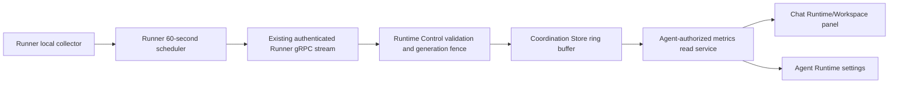

# Runtime System Metrics Overview Design

- Snapshot: `runtime-260824`
- Document reference: `runtime-260824/DESIGN`
- Requirements: [runtime-260824/REQ](../requirements/runtime-260824-system-metrics-overview.md)
- Decisions: [runtime-260824/ADR](../adr/runtime-260824-system-metrics-overview.md)

## Current Behavior and Gaps

The authenticated Runner already registers capabilities, receives a connection
generation, heartbeats, reports lifecycle state, and sends operation and transfer
results over one bidirectional Runtime Control stream. It does not collect or report
system metrics. Runtime Control fences Runner messages by the current generation,
but `RuntimeCoordinationStore` has no bounded metrics-series contract.

The Public Agent Runtime API exposes durable lifecycle, configuration, and action
state under the existing Agent access boundary. The chat Runtime/Workspace panel and
Agent Runtime settings consume that lifecycle response. Neither surface has a metric
query or overview component, and the existing lifecycle query polls only during
Runtime transitions.

The implementation gap is therefore a bounded informational path:

Providers, PostgreSQL, lifecycle reconciliation, Agent Workspace storage, and the
existing lifecycle response are outside this data path.

## Requirement and Decision Traceability

| Requirement | ADR decisions | Design mechanisms |
| --- | --- | --- |
| `runtime-260824/REQ-1` | `ADR-D1`, `ADR-D2`, `ADR-D3`, `ADR-D6`, `ADR-D7` | Runner collector and scheduler, normalized sample, current read projection |
| `runtime-260824/REQ-2` | `ADR-D3`, `ADR-D5`, `ADR-D7` | Generation-scoped 60-sample ring, one-hour filtering, API series |
| `runtime-260824/REQ-3` | `ADR-D1`, `ADR-D3`, `ADR-D4` | Runner-observable scope, normalized scope enum, generation fence |
| `runtime-260824/REQ-4` | `ADR-D7` | Existing Agent access service and privacy-safe response mapping |
| `runtime-260824/REQ-5` | `ADR-D4`, `ADR-D5`, `ADR-D6`, `ADR-D7` | Server time, sequence fence, lifecycle overlay, stale projection |
| `runtime-260824/REQ-6` | `ADR-D7` | Shared overview component in chat panel and Runtime settings |

## Architecture and Ownership

### Runner collection ownership

The Runner application owns environment-specific collection because it is the only
reporter authorized by `runtime-260824/ADR-D1`. A small injected collector boundary
returns the normalized shared-library sample model. The shared Runner run loop owns
registration-relative scheduling because it already knows when a connection has
been accepted and which generation is current.

The initial implementation uses standard-library and Linux kernel interfaces rather
than adding a monitoring agent or a mandatory third-party dependency:

- container CPU and memory use the current cgroup v2 or v1 boundary when readable;
- host or VM CPU uses successive `/proc/stat` snapshots;
- host or VM memory uses `/proc/meminfo`;
- disk uses the root filesystem's used and total bytes through filesystem statistics;
- reliable container or VM evidence selects `container` or `vm`; otherwise the
  non-container environment is reported as `host`.

The collector never scans processes, mount inventories, Agent Workspace contents, or
Provider resources. It returns `unsupported` when the operating environment lacks a
meaningful source and `unavailable` for a bounded transient read failure. Expected OS
read and parse failures are handled per metric so one failure does not discard the
other observations.

CPU requires two cumulative-counter reads. The immediate post-registration report
therefore may contain available memory and disk with CPU `unavailable`; the first
one-minute CPU average is produced by the next scheduled report. Reconnection creates
another baseline and a new generation-scoped series.

### Shared Runner protocol

The shared runtime-control library adds:

- capability constant `runtime.system-metrics.v1`;
- closed scope and availability enums;
- normalized CPU, byte-usage, and complete sample models;
- a `report_runner_system_metrics` client operation; and
- protobuf conversion and validation helpers.

`RunnerMessage` receives one additive `system_metrics` payload. The outer message
continues to carry the authenticated connection ID, request ID, and Runner generation.
The metrics payload carries the Runtime ID, sample sequence, scope, and three metric
observations. It does not carry a timestamp, path, hostname, Provider identity, raw
cgroup fields, or diagnostic strings.

The existing Runner protocol version and required transfer capability remain
unchanged. Older Runners register normally without the metrics capability. New
Runners advertise the capability in their existing capability list.

### Runtime Control admission

`RuntimeRunnerControlGrpcServicer` recognizes the new payload and delegates admission
to `RuntimeControlProtocolService`. Admission performs one bounded sequence:

1. load the current Runner connection for the Runtime;
2. require the message generation to equal the current connection generation;
3. require the stored registration capabilities to contain
   `runtime.system-metrics.v1`;
4. validate the closed enum and numeric invariants;
5. assign the UTC server acceptance time; and
6. atomically append only when the sample sequence is higher than the stored sequence.

Stale, duplicate, capability-mismatched, or invalid metrics reports are dropped with
bounded structured warning evidence and do not close the Runner stream. A narrow
metrics-store-unavailable error is logged with a stack trace and drops that sample
without terminating Runner operations or lifecycle heartbeats. Successful samples do
not emit one log line per minute.

Metrics admission does not call the durable Runner state sink and cannot acknowledge
Runtime configuration, change lifecycle state, or dispatch operations.

### Coordination Store ownership

`RuntimeCoordinationStore` gains typed append and read methods for one series keyed by
Runtime ID and Runner generation. The append operation owns sequence comparison,
maximum length 60, and one-hour expiry as one atomic store contract.

- Redis uses one atomic operation to compare the last sequence, append the encoded
  sample, trim to 60 entries, and refresh the one-hour key expiry.
- The in-memory implementation uses its existing lock, a bounded per-key sequence,
  and explicit time-based pruning on append and read.
- Both implementations filter by server-assigned measurement time when reading so
  no sample older than one hour is returned even if backend expiry is delayed.

No generic metrics database, separate latest key, background cleanup worker, or
PostgreSQL model is introduced. The last retained entry is the latest observation.

### Public read service

A dedicated service-layer metrics reader receives the existing `AgentRuntimeService`
and `RuntimeCoordinationStore`. It first calls the existing Agent Runtime read with
Workspace ID, Workspace user ID, and role. The existing read result remains the
Agent-access and Runtime-lifecycle authority; the metrics service does not query
repositories or SQLAlchemy directly.

When the Agent has no managed Runtime, the response is `unsupported` with an empty
series. Otherwise the service uses the durable Runtime's last known
`runner_generation`, current Runner state, Provider connection projection, and
desired state to select the one permitted series and derive presentation states.
It never searches other generations for a fresher value.

The service computes current state independently per metric:

- `fresh`: latest observation is available and at most three minutes old;
- `stale`: the latest available observation is older than three minutes;
- `unavailable`: no sample has arrived for a capable current generation or the
  latest observation is unavailable;
- `unsupported`: the current Runner lacks the capability or the latest observation
  is unsupported;
- `stopped`: the Runtime lifecycle is stopped or hibernated; and
- `disconnected`: the last known Runner is not currently connected.

`stopped` and `disconnected` override freshness for the current value while the
retained series remains visible. Percentage is computed only for an available
observation with a total. Values and totals remain integers in the API; percentages
are bounded decimal projections and are not persisted.

## Public API Contract

Add one route beside the existing Agent Runtime routes:

`GET /agent-runtime/v1/workspaces/{handle}/agents/{agent_id}/runtime/system-metrics`

The response contains:

- one overall Runtime metrics availability summary;
- the latest known scope or `null`;
- current CPU, memory, and disk projections with state, measurement time, normalized
  used value, optional total, and optional percentage; and
- ordered recent samples, each containing measurement time, scope, and the three
  normalized observations.

The response contains no Runtime ID, Runner generation, connection ID, Runner ID,
Provider ID, host name, path, mount name, device name, process data, or diagnostic
payload. Unauthorized and cross-Workspace reads retain the existing Agent-not-found
404 behavior. The route is added to the generated public OpenAPI clients and the web
tRPC router through the normal client-generation workflow.

A Coordination Store read failure may fail this metrics endpoint, but it does not
change or fail the existing Agent Runtime lifecycle endpoint. The web surface maps a
query failure to a metrics-only error state.

## Frontend Design

Introduce one pure `RuntimeSystemMetricsOverview` component with colocated stories.
It renders three compact metric cards:

- current value and optional total;
- percentage only when supplied by the response;
- scope and freshness text; and
- a dependency-free SVG sparkline over the returned one-hour samples, preserving
  missing intervals as gaps.

The chat Runtime/Workspace panel renders the overview above its Runtime/Workspace
content when a managed Runtime exists. The existing `autoRefreshVisible` input gates
the metrics query, so a closed mobile drawer does not poll while a docked or open
panel does. Agent Runtime settings renders the same component near the current
Runtime status and polls while the page is mounted. Both queries use a fixed
60-second refetch interval and invalidate naturally when the Agent changes or a
lifecycle mutation completes.

Desktop lays the cards in one compact row when space permits. Narrow and mobile
surfaces stack them without horizontal scrolling. `unsupported`, `unavailable`,
`stale`, `stopped`, `disconnected`, empty-series, partial-series, loading, and
metrics-only error states use explicit localized text rather than zero values.

The browser does not accumulate samples, interpolate gaps, choose a different time
range, or open an Admin surface.

## Lifecycle and State Transitions

- **Runner registration:** capability is stored with the connection generation; the
  collector records its CPU baseline and sends the immediate partial sample.
- **Steady running:** one report attempt occurs every 60 seconds; accepted samples
  append to the current generation's ring.
- **Transient metric read failure:** the affected metric reports unavailable while
  other metrics remain usable.
- **Missed reports:** after three minutes the last available metric becomes stale;
  no synthetic samples are added.
- **Stop or disconnect:** current projections change to the lifecycle overlay and
  the last generation's trend remains until expiry.
- **Reconnect, restart, reset, or replacement:** a new Runner connection generation
  creates a new empty series. The prior series cannot become current.
- **Coordination Store loss:** the endpoint returns an empty/unavailable overview;
  Runner and Runtime operations continue.
- **Capability rollback:** the current Runner appears unsupported; previously stored
  series expires normally and is not selected for a new generation.

## Security and Permissions

The metrics message is accepted only on the existing Runtime-bound authenticated
Runner stream and current connection generation. It has fixed numeric fields,
closed enums, a bounded message size, and no free-form metadata. Metrics do not alter
any authorization, lifecycle, configuration, scheduling, billing, or destructive
operation decision.

The Public API reuses the existing Workspace membership and Agent access boundary.
No separate metrics role is introduced. Privacy-sensitive Runtime and infrastructure
identifiers stay inside Control and service-layer lookups and are excluded from the
response and logs. Runtime code relies on normal structured logging integration for
error delivery and does not call Sentry directly.

## Failure, Retry, and Recovery

- Expected collector read failures become per-metric unavailable observations.
- Unexpected collector defects are logged by the supervised metrics task; the
  Runner operation loop remains active and later scheduled collection may continue
  after a task-local recovery boundary.
- A metrics send on a closed Control stream follows the existing Runner reconnect
  path. Metrics add no independent connection or retry queue.
- Invalid, stale, duplicate, or unsupported reports are dropped and cannot close an
  otherwise valid Runner stream.
- A narrow Coordination Store append failure drops one sample and is logged without
  failing Runner liveness or operations.
- A Public metrics read failure is isolated to the metrics query and may be retried
  by the next 60-second web poll.
- No recovery job reconstructs lost trend data.

## Migration, Rollout, and Rollback

No database migration, Provider rollout, RBAC change, Profile change, Helm setting,
or persistent-data backfill is required.

Recommended rollout order is Control/API/web first and Runner second, but the
additive contract tolerates either order:

- old Runner with new server: Runtime remains operational and metrics are
  unsupported;
- new Runner with old server: registration remains valid and the old server ignores
  the unknown additive metrics payload;
- mixed Runner generations: each Runtime independently reports capability and state.

Rolling back the Runner removes the capability for newly connected generations and
shows unsupported. Rolling back the server or web removes the read surface while
Runtime operations remain compatible. Any already stored Redis series expires after
one hour and requires no cleanup migration.

## Observability and Operations

Add structured warning logs for invalid report shape, stale generation, missing
capability, sequence rejection when diagnostically useful, and metrics store
unavailability. Avoid logging raw samples or one success event per minute. Existing
Runner registration logs may include a boolean metrics-capable field, not the full
capability list or environment identity.

The feature adds no configuration knob, health-check dependency, alert, dashboard,
SLO, billing signal, or deployment readiness gate. Metrics collection and storage
failure cannot make Runtime Control, Provider reconciliation, or Runner readiness
unhealthy.

## Test Strategy

### Primary E2E verification matrix

| Scenario | Expected evidence |
| --- | --- |
| Running Docker Runtime | Chat Runtime/Workspace panel shows CPU, memory, disk, scope, freshness, and a compact trend from the real Runner |
| Secondary entry point | Agent Runtime settings shows the same metric values and state contract |
| Panel reopen | Closing and reopening the panel shows server-retained samples rather than starting an empty browser history |
| Partial first sample | Memory and disk may be visible while initial CPU is unavailable; the UI does not show zero |
| Runtime stop or disconnect | Current state changes explicitly while the retained trend remains visible |
| Agent access boundary | Another Workspace user without Agent access receives the existing not-found behavior |
| Capability absence | An older/non-capable Runner remains usable and the overview shows unsupported |

### E2E plan

Extend the existing Runtime web E2E journey that uses the real Docker Provider and
Runner image. Start a managed Runtime through product APIs/UI, open the chat
Runtime/Workspace panel, assert the three metric labels and a non-empty privacy-safe
fresh response, then open Runtime settings and assert the equivalent overview. Use
product lifecycle controls for stopped-state evidence. Do not assert exact host
values or compare percentages across CI machines.

Generation fencing, three-minute staleness, duplicate sequence rejection, and
one-hour expiry are deterministic backend integration or store-contract tests with
injected clocks; they must not use fixed sleeps. Pure UI stories and component tests
cover unsupported, unavailable, stale, disconnected, stopped, partial, empty, and
metrics-query error states that are expensive or nondeterministic to force in a
browser E2E.

### Fixtures and prerequisites

Reuse the existing Docker Runtime Provider, managed Runtime Profile helper, Runtime
Runner image, authenticated Workspace/Agent setup, and browser fixture. No new live
credential, Kubernetes cluster, Metrics API, privileged collector, database seed,
or direct database write is required.

Collector unit tests use injected filesystem readers and temporary proc/cgroup
fixtures for cgroup v1, cgroup v2, host, unlimited-total, malformed, and missing-file
cases. Coordination Store contract tests run against both in-memory and Redis
implementations.

### Evidence and CI policy

Required evidence includes:

- protobuf/shared-library format, lint, type, and unit checks;
- Runner collector and scheduler tests;
- Runtime Control gRPC admission and generation-fencing tests;
- Redis/in-memory Coordination Store contract tests;
- Public API authorization and state-projection tests;
- generated OpenAPI client consistency;
- frontend format, lint, typecheck, component stories/tests, and build;
- required Docker Runtime web E2E; and
- documentation and Living Spec validation.

Deterministic tests may not skip. The required E2E uses repository-owned Docker
fixtures and has no optional live prerequisite. Failure to obtain a first metrics
sample within the normal bounded Runtime readiness window fails the scenario rather
than silently skipping it.

## Removal and Replacement

| Existing unit or behavior | Removal authority | Replacement or remaining authority | Removal boundary | Absence verification |
| --- | --- | --- | --- | --- |
| No existing Runtime system-metrics protocol, store, API, or UI | `runtime-260824/REQ`; `runtime-260824/ADR-D1` through `ADR-D7` | New bounded overview mechanisms | None; this is additive | Pre-implementation source and schema search |
| Existing Runner protocol version and required transfer capability | `runtime-260824/ADR-D2` | Retained unchanged with one optional capability/message | No protocol-version removal | Registration compatibility tests and constant comparison |
| Existing Provider implementations, capability contracts, and Kubernetes RBAC | `runtime-260824/ADR-D1` | Retained unchanged | No Provider or chart metrics path | Provider/chart diff and source search |
| Existing `AgentRuntimeResponse` lifecycle contract | `runtime-260824/ADR-D7` | Retained unchanged beside the dedicated metrics endpoint | No field replacement | OpenAPI diff and existing route tests |
| Existing PostgreSQL Runtime schema | `runtime-260824/ADR-D5` | Retained unchanged; metrics remain volatile | No migration or table | Migration-directory and model diff absence |
| Existing Workspace panel and Runtime settings shells | `runtime-260824/REQ-6`, `ADR-D7` | Retained and extended with one shared overview component | No navigation or layout replacement | Browser E2E and component source review |

## Feasibility

- **REQ-1 — feasible.** The Runner has a long-lived accepted-generation run loop,
  an extensible capability tuple, and an existing outbound client queue. Linux
  procfs, cgroup, and filesystem sources can produce the selected normalized values
  without Provider access.
- **REQ-2 — feasible.** Both Coordination Store implementations already support
  bounded short-lived state patterns and contract tests. A typed generation key,
  atomic append, explicit memory pruning, and 60-entry read are bounded additions.
- **REQ-3 — feasible.** The narrowed Runner-observable scope matches what the
  Runner process can inspect. The design no longer depends on Pod or sidecar
  aggregation that the current security boundary cannot provide.
- **REQ-4 — feasible.** The existing Agent Runtime route already applies Workspace
  membership and Agent access through `AgentRuntimeService`; the dedicated service
  can reuse that exact authority before reading volatile state.
- **REQ-5 — feasible.** Current Runner generation is durable on `AgentRuntime`,
  current connection generation is available in the Coordination Store, and the
  server owns an authoritative UTC clock. No new lifecycle identity is required.
- **REQ-6 — feasible.** The chat panel already receives a visibility input, and
  Runtime settings already has its own container query. Both can consume one
  generated client contract and one pure component.

No requirement is blocked. The only conditional implementation detail is Linux
source variability: an unreadable or semantically unavailable source maps to the
already authorized unavailable or unsupported state rather than requiring a new
collector or Provider integration.

## Design Authority

- Design revision: `1`

| ID | Material design mechanism | Authority | Classification |
| --- | --- | --- | --- |
| M1 | Runner-owned local collector and fixed immediate/60-second scheduler | `runtime-260824/REQ-1`, `REQ-2`, `REQ-3`; `runtime-260824/ADR-D1`, `ADR-D3`, `ADR-D6` | `decided` |
| M2 | Optional `runtime.system-metrics.v1` capability and dedicated additive Runner message | `runtime-260824/ADR-D2` | `decided` |
| M3 | Current Runner generation, monotonic sequence, and server-assigned time as the complete admission fence | `runtime-260824/REQ-3`, `REQ-5`; `runtime-260824/ADR-D4` | `decided` |
| M4 | One generation-scoped Coordination Store ring with maximum 60 samples and one-hour expiry in Redis and memory | `runtime-260824/REQ-2`, `REQ-5`; `runtime-260824/ADR-D5`; Redis optionality project constraint | `decided` |
| M5 | Server-derived per-metric freshness and lifecycle projection with fixed three-minute staleness | `runtime-260824/REQ-1`, `REQ-5`; `runtime-260824/ADR-D6` | `decided` |
| M6 | Dedicated Agent-authorized Public metrics endpoint isolated from `AgentRuntimeResponse` | `runtime-260824/REQ-4`, `REQ-5`, `REQ-6`; `runtime-260824/ADR-D7` | `decided` |
| M7 | One shared panel/settings overview component with visibility-scoped 60-second polling and server-owned history | `runtime-260824/REQ-2`, `REQ-6`; `runtime-260824/ADR-D7` | `decided` |
| M8 | Preserve Provider, PostgreSQL, lifecycle reconciliation, and Agent Workspace authority unchanged | `runtime-260824/REQ` fixed constraints; `runtime-260824/ADR-D1`, `ADR-D5`, `ADR-D7`; current Agent Runtime Persistence Spec | `derived` |

## Authority Audit

- Every `runtime-260824/REQ-1` through `REQ-6` row has one or more concrete
  mechanisms in the traceability and authority tables.
- Every material mechanism M1 through M8 is authorized by confirmed Requirements,
  accepted ADR decisions, the Redis optionality project constraint, or the unchanged
  current Agent Runtime Persistence Spec.
- M8 combines the explicit Runner-only, volatile-storage, and dedicated-endpoint
  decisions with current authority boundaries and introduces no optional mode.
- Collector parsing helpers, protobuf field numbers, Redis key spelling, component
  file placement, SVG point calculation, test fixture names, and exact internal
  class names remain agent-owned local details and create no additional authority.
- The removal table identifies no obsolete authoritative system-metrics path because
  none exists, and it verifies that adjacent Provider, database, lifecycle, and UI
  shell authorities remain intact.

## Assumptions and Non-Blocking Risks

- Current production Runner environments are Linux. A future non-Linux Runner uses
  the same collector boundary and may report unsupported without changing the wire
  or API contract.
- Container filesystem totals can reflect the container root filesystem rather than
  Agent Workspace or every mounted volume. The API exposes the `container` scope and
  does not imply per-volume aggregation.
- CI machine load makes exact metric values nondeterministic. Tests assert contract,
  bounds, state, and presence rather than specific percentages.
- A benign Runner reconnect clears visible history. This is an accepted best-effort
  consequence of the generation fence, not a feasibility blocker.

## Living Spec Impact

After implementation verification, update `docs/azents/spec/flow/agent-runtime-persistence.md`
to document the additive Runner metrics capability, generation-scoped volatile
series, and Provider/database non-ownership. Update the Workspace domain or flow
Spec covering the Runtime/Workspace panel if its current behavior section owns that
surface. Set the Requirements and this Design `implemented` date only after code,
generated clients, E2E, and Specs are verified.

## Design Approval

- Mode: `Collaborative`
- Decision owner: `건우`
- Approved on: `2026-08-24`
- Approved Design revision: `1`
- Approved authority IDs: `M1`, `M2`, `M3`, `M4`, `M5`, `M6`, `M7`, `M8`
- Approved scope: Implement the minimal Runner-only CPU, memory, and disk overview
  through one additive Runner capability, generation-scoped volatile series,
  dedicated Agent-authorized read endpoint, and shared chat/settings UI without
  Provider metrics, PostgreSQL persistence, infrastructure collectors, or new
  configuration modes.
