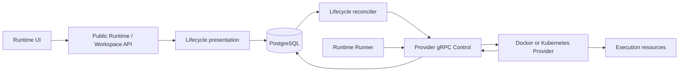

# Clear and Reliable Runtime Lifecycle Design

- Snapshot: `runtime-260825`
- Document reference: `runtime-260825/DESIGN`

## Scope

This Design implements the confirmed
[runtime-260825/REQ](../requirements/runtime-260825-reliable-lifecycle.md)
through the accepted
[runtime-260825/ADR](../adr/runtime-260825-reliable-lifecycle.md).

It unifies the user-visible lifecycle projection, changes Restart to a bounded
execution-resource deletion followed by normal Start convergence, tightens
Recreation completion, and applies the same presentation to Agent Runtime settings
and Workspace surfaces.

## Current Behavior and Gaps

### Durable lifecycle authority

`agent_runtimes` already stores desired state and generation, last lifecycle
command, Provider connection and observation, Runner state, current failure, and
terminal-delete evidence. `runtime_configuration_states` already stores one current
desired/applied configuration tuple. These satisfy the required durable authority
and fencing inputs.

### Current presentation gap

`AgentRuntimeService.calculate_state()` produces one `RuntimeSummary` plus action
booleans, while the public response also exposes raw Runtime fields. The Agent
Runtime settings UI does not render the summary or separate Provider and Runner
facts. The Workspace service independently maps raw Runtime fields to another
runtime union. The two surfaces therefore lack one complete presentation contract.

### Current Restart gap

Both Providers currently perform replacement inside `restart()`:

- Docker removes, creates, and starts the container.
- Kubernetes deletes/replaces resources and then observes the recreated Runtime.

Control stores Restart as the current generation's lifecycle command. There is no
durable handoff from completed deletion to ordinary Start convergence.

### Current Recreation gap

Recreation operations already snapshot an exact target version and stable Runtime
set and claim items under a concurrency limit. A running item currently succeeds
when exact applied configuration matches, even when the Provider resource or Runner
has not returned to usable service.

### Current recovery behavior

Provider and Runner connection generations, resource and desired generations,
configuration evidence, leader election, watch recovery, and periodic observation
already provide the required stale-result and failover boundaries. This Design
reuses those mechanisms rather than adding another recovery channel.

## Requirements and ADR Traceability

| Requirement | Design mechanisms | ADR authority |
| --- | --- | --- |
| `runtime-260825/REQ-1` | M1, M2, M4 | D1, D2 |
| `runtime-260825/REQ-2` | M1, M5, M6 | D1, D6 |
| `runtime-260825/REQ-3` | M2, M4, M7 | D2, D3, D4 |
| `runtime-260825/REQ-4` | M2, M3, M5 | D2 |
| `runtime-260825/REQ-5` | M3, M4, M6 | D3 |
| `runtime-260825/REQ-6` | M1, M4, M7 | D1, D3, D4 |
| `runtime-260825/REQ-7` | M7, M8 | D4, D6 |
| `runtime-260825/REQ-8` | M2, M5, M9 | D2, D5 |
| `runtime-260825/REQ-9` | M1, M3, M8 | D1, D2, D6 |

## Architecture

PostgreSQL remains the source of truth. The lifecycle presentation is a pure
server-side composition over current durable state and configuration status.
Providers own backend resource mutation. Runner owns execution readiness and
Workspace path evidence. Frontends render the presentation and never recompute
availability from raw evidence.

## M1. Unified Lifecycle Presentation

Add a typed `AgentRuntimeLifecyclePresentation` to the Agent Runtime service output
and public API.

The presentation contains:

- `target`: `running` or `stopped`;
- `convergence`: `stable`, `starting`, `stopping`, `resetting`, `recovering`,
  `blocked`, or `failed`;
- `provider.connection`: current Provider connection state;
- `provider.resource`: current Provider observed resource state;
- `runner.state`: current Runner state;
- `availability`: `ready`, `stopped`, `transitioning`,
  `provider_disconnected`, `runner_unavailable`, `configuration_blocked`,
  `failed`, or `removing`;
- `reason_code`: one bounded safe reason code or `null`; and
- `desired_generation`: the current lifecycle freshness identity.

The existing raw Runtime object remains available for diagnostics. The existing
single summary is removed from public presentation and internal UI use. Internal
callers that only need stopped/ready checks use the unified availability value.

### Derivation order

Presentation precedence is:

1. active terminal removal;
2. current-generation failure or Provider failure;
3. blocked or unconfigured desired configuration;
4. Provider disconnection that prevents current convergence;
5. desired/observed convergence;
6. Provider running with Runner not ready;
7. ready or stopped stable state.

The Provider connection fact is still shown when another higher-precedence
availability result applies. Provider resource and Runner values are direct current
facts and are never rewritten to match availability.

### Shared Workspace projection

The Workspace bootstrap response includes the same lifecycle presentation. Its
existing runtime/access union remains a file-browser layout projection derived from
the same Runtime evidence, not independent authority. The Workspace UI renders the
common lifecycle facts in transition and unavailable views.

## M2. Restart Completion Handoff

Add `AgentRuntimeRepository.complete_restart_handoff(...)`.

The update succeeds only when:

- Runtime ID matches;
- desired generation equals the completed command generation;
- `last_lifecycle_command` is `restart`;
- desired target remains running;
- terminal deletion is not active; and
- the Provider report generation is not older than current Provider generation.

The atomic update:

- sets `last_lifecycle_command` to `start`;
- sets `last_lifecycle_dispatch_generation` to one less than the current positive
  desired generation so immediate lifecycle reconciliation can claim Start;
- clears current-generation failure produced by an uncertain earlier dispatch; and
- updates `last_state_change_at`.

It does not advance desired generation or configuration sequence and does not alter
desired/applied configuration.

The Provider gRPC bridge invokes the handoff only for a correlated successful
Restart completion after validating Provider stream generation and report identity.
It persists the completion report and then performs the handoff. A stale or
superseded completion is ignored.

If completion is lost, the Restart generation can be retried idempotently. If the
handoff succeeds but the process stops before dispatch, the durable rearmed Start is
found by the next reconciler.

## M3. Provider Restart Boundaries

### Docker

`DockerRuntimeProvider.restart()`:

1. validates the complete current configuration and ownership;
2. issues container removal;
3. preserves the Provider-owned Runtime root and Workspace directory; and
4. returns a stopped report for the same desired generation.

It does not create or start a replacement container.

### Kubernetes

`KubernetesRuntimeProvider.restart()`:

1. validates current configuration and existing execution-resource ownership;
2. requests deletion of the Runtime Pod and execution-scoped policy/proxy
   resources;
3. preserves the Workspace PVC/PV and stable Runtime CA;
4. does not create or apply replacement resources; and
5. returns `STOPPING` with a bounded `restart_deletion_requested` reason.

Deletion API acknowledgement is the Restart completion boundary. Kubernetes
asynchronous absence is observed later. Start reconciliation tolerates terminating
resources and retries through the existing cadence.

Provider Stop, Reset, update, and terminal-delete behavior retain their existing
boundaries.

## M4. Recreation Availability Completion

Keep the current operation and item persistence model.

A dispatched item succeeds only when:

- applied configuration sequence and digest match the item's exact expected target;
- applied target generation matches the expected configuration generation;
- Runtime desired generation equals the dispatched Restart generation;
- Provider observed state is running at that generation;
- Provider connection is connected;
- Runner state is ready;
- Runner generation is positive; and
- Runner-reported Workspace path is present.

The item remains `running` otherwise. Current-generation failure continues through
the bounded retry/failure path. Changed target, configuration, desired generation,
terminal deletion, or capability produces explicit skip/failure as already defined.

Aggregate counts and UI progress continue using pending, running, succeeded,
skipped, and failed item states. The concurrency query therefore naturally counts
all Runtimes that have begun disruption but have not returned to service.

## M5. Lifecycle Action UX

Agent Runtime settings add:

- a lifecycle status card showing target, convergence, Provider resource, Provider
  connection, Runner, configuration, and overall availability;
- bounded reason and recovery copy selected from `reason_code`;
- a Restart confirmation modal explaining temporary unavailability and preserved
  Workspace data; and
- distinct Reset copy and destructive styling.

The Workspace panel uses the same lifecycle labels and adds the same Restart
confirmation before submitting the existing action.

Mutation loading represents request submission only. After a successful Restart
submission it closes, and query polling/rendering shows ordinary lifecycle
convergence.

Responsive layouts use stacked cards on narrow screens and a compact grid on wider
screens without changing meaning.

## M6. Polling and Operation Progress

Runtime settings poll while lifecycle convergence is non-stable, removal is active,
or configuration is waiting for recreation. Workspace polling keeps its existing
transition behavior and also follows the unified lifecycle convergence.

Runtime Profile Recreation UI continues polling the durable operation until a
terminal aggregate status and renders exact counts and bounded failure/skip items.
No browser-owned operation state is authoritative.

## M7. Reconnect and Failover Safety

Retain current mechanisms:

- Provider connection epochs and authenticated stream generations;
- Runner desired-generation credentials and accepted Runner generations;
- exact Provider binding checks;
- desired generation and configuration sequence/digest evidence;
- Kubernetes Lease optimistic concurrency;
- watch continuity recovery through complete observation;
- periodic observation after missed completion; and
- PostgreSQL state surviving Control or Provider process restart.

The new Restart handoff adds its own exact command and Provider-generation
conditions. It never uses Redis or process-local command history as correctness
authority.

## M8. Coordinated Delivery

Change Control, both Provider implementations, public OpenAPI schemas, generated
Python/TypeScript clients, and web UI in one release.

No database migration is required because all durable inputs and the Restart
handoff state fit existing columns. No protobuf field is required because the
Provider completion already carries request correlation, Runtime ID, Provider
generation, success, and report.

Deployment order remains the existing coordinated application release. There is no
feature flag or alternative lifecycle mode. Rollback is a coordinated image
rollback before new Restart operations are accepted; partially completed Runtimes
remain safe because desired running state and ordinary Start convergence are
durable.

## M9. Destructive Operations

Reset keeps explicit final desired state and is the only lifecycle operation that
may delete Agent Workspace data. Permanent removal keeps product-state fencing,
terminal Provider deletion, and authoritative absence verification.

Restart and Recreation tests must verify preservation of the Docker Workspace root
and Kubernetes PVC/PV. Recovery paths must never call Reset or terminal removal.

## API and Generated Clients

The public Agent Runtime response and lifecycle mutation response expose the unified
lifecycle presentation. The Workspace response includes the same presentation.

Generated OpenAPI clients are regenerated from the backend schema. Frontend code
imports generated types and does not declare a divergent lifecycle union.

Action errors remain typed product errors. Bounded presentation reason codes are
safe identifiers; raw Provider error text is not exposed as lifecycle guidance.

## Security and Permissions

Existing Workspace membership and Agent administrator checks remain unchanged.
Restart and Reset remain available only through existing authorized Agent Runtime
routes. Provider reports and completions remain authenticated and generation
fenced.

No credentials, Provider diagnostics, raw backend error text, or Workspace contents
are added to lifecycle presentation or logs.

## Failure, Retry, and Recovery

| Condition | Behavior |
| --- | --- |
| Restart dispatch route unavailable | Current generation remains pending and retries after current Provider authority returns. |
| Restart completion failure | Current-generation failure is shown; retry is safe. |
| Successful completion lost | Provider deletion is idempotently retried; no Reset occurs. |
| Handoff persisted, Control restarts | Rearmed Start is selected from PostgreSQL and dispatched. |
| Kubernetes resource still terminating | Start/observe reconciliation retries until replacement can be created. |
| Provider disconnect | Durable resource facts remain; availability shows Provider disconnected when convergence is blocked. |
| Runner disconnect after Provider running | Provider remains running; availability shows Runner unavailable. |
| Recreation target changes | Item is skipped with the existing bounded reason. |
| Current-generation Runtime failure | Item follows bounded retry and terminal failure policy. |

## Observability

Add structured logs for:

- successful or stale Restart handoff;
- Provider Restart deletion request completion;
- lifecycle presentation reason only where existing request logs need it; and
- Recreation items waiting for Provider or Runner availability through aggregate
  counters, without per-loop warning spam.

Existing Provider command request IDs, Runtime IDs, generations, configuration
sequences, and operation IDs remain the correlation fields.

## Test Strategy

### E2E primary verification matrix

| Scenario | Required evidence |
| --- | --- |
| Start from stopped | UI/API show running target, starting convergence, then Provider running, Runner ready, availability ready. |
| Stop from ready | Stopped target, stopping convergence, stopped availability, Workspace data preserved after next Start. |
| Restart from ready | Confirmation states preservation; submission completes before readiness; ordinary starting convergence follows; Workspace file survives. |
| Runner unavailable | Provider resource remains running, Runner is unavailable, overall availability is not ready, lifecycle actions remain truthful. |
| Provider reconnect | Disconnected state does not infer absence; reconnect observation resumes convergence. |
| Profile Recreation | Exact stable set, bounded running count, item success only after Provider and Runner readiness, Workspace data preserved. |
| Reset | Explicit destructive confirmation; Workspace data is removed; final desired target is observed. |
| Permanent removal | Separate irreversible workflow and authoritative absence completion. |

### E2E plan

Extend required Runtime Profile/optional Runtime E2E coverage where current fixtures
already provision the Docker Provider. Use a deterministic sentinel Workspace file
to prove Stop/Restart/Recreation preservation and Reset destruction. Poll
authoritative API states with bounded deadlines; do not use fixed sleeps to
establish ordering.

Kubernetes-specific asynchronous deletion remains covered in Provider unit tests
because required CI does not provision a live Kubernetes cluster. The same product
contract is verified through shared backend/API tests and Docker E2E.

### Testenv and fixtures

Reuse the existing `agent-basic` and Runtime Profile prerequisites. No new
credentials are required. Add fixture support only if the current Runtime Profile
test cannot create a deterministic Workspace sentinel through the public Runtime
file path.

### Evidence and CI policy

- Backend repository, service, gRPC bridge, reconciler, and API tests are required.
- Docker and Kubernetes Provider unit tests are required.
- Generated client drift checks are required.
- TypeScript lint, typecheck, component tests/stories where configured, and build
  are required.
- Required Docker E2E is required.
- Live Kubernetes verification is optional and must skip only when the cluster
  prerequisite is absent; a configured live prerequisite failure is a test
  failure.

## Migration, Rollout, and Rollback

There is no relational migration or backfill. Existing rows map directly to the new
presentation. An in-flight Restart from an older process remains generation fenced;
after rollout its completion is normalized through the handoff or the command is
idempotently retried.

Generated clients and frontend deploy with the backend schema. Rollback is
coordinated. Durable desired state remains valid across rollback, and Provider Start
is idempotent.

## Removal and Replacement

| Existing unit or behavior | Removal authority | Replacement or remaining authority | Removal boundary | Absence verification |
| --- | --- | --- | --- | --- |
| Public single `RuntimeSummary` as UI lifecycle meaning | `runtime-260825/REQ-2`, ADR-D1 | Unified lifecycle presentation | API/client cutover | No frontend lifecycle view reads or translates `RuntimeSummary`. |
| Workspace-independent raw-state lifecycle mapping | `runtime-260825/REQ-2`, ADR-D1 | Shared presentation derivation plus layout-only Workspace mapping | Workspace service/API cutover | Tests prove settings and Workspace expose equal target/resource/Runner/availability meaning. |
| Docker Provider restart delete-and-create | `runtime-260825/REQ-4`, ADR-D2 | Bounded container deletion plus Control Start handoff | Docker Provider deployment | Restart test records removal and no create/start before later Start. |
| Kubernetes Provider restart replacement | `runtime-260825/REQ-4`, ADR-D2 | Bounded execution-resource deletion requests plus Control Start handoff | Kubernetes Provider deployment | Restart tests record deletion requests and no ensure/create calls. |
| Recreation success on configuration metadata alone | `runtime-260825/REQ-5`, ADR-D3 | Exact configuration plus Provider/Runner availability completion | Reconciler deployment | Tests hold item running for disconnected/unready states and complete only when ready. |
| Restart action without confirmation | `runtime-260825/REQ-4`, ADR-D2 | Explicit preservation/unavailability confirmation | Frontend deployment | Component interaction tests require confirmation before mutation. |
| Database schema/state | Existing Spec and ADR-D1/D2 | Existing columns remain authoritative | None | Schema diff and migration directory remain unchanged. |

## Feasibility Validation

| Requirement | Result | Repository evidence |
| --- | --- | --- |
| `runtime-260825/REQ-1` | feasible | `AgentRuntimeRepository`, lifecycle reconciler, and Provider Start/Stop already implement desired-state convergence. |
| `runtime-260825/REQ-2` | feasible | Public Runtime and Workspace responses already carry all raw axes; one service projection and generated schema update are sufficient. |
| `runtime-260825/REQ-3` | feasible | Provider/Runner generations, exact report sinks, configuration sequence/digest fencing, and resource ownership checks already exist. |
| `runtime-260825/REQ-4` | feasible | Existing correlated Provider completion plus current lifecycle columns can implement handoff without schema/protobuf changes. |
| `runtime-260825/REQ-5` | feasible | Durable operations/items and concurrency claims already exist; success predicate can add current availability checks. |
| `runtime-260825/REQ-6` | feasible | One bounded desired/applied configuration row and application-impact classification already exist. |
| `runtime-260825/REQ-7` | feasible | Periodic observation, startup scan, watch recovery, and Kubernetes Lease fencing are current mechanisms. |
| `runtime-260825/REQ-8` | feasible | Reset and terminal removal already have distinct persistence and Provider paths. |
| `runtime-260825/REQ-9` | feasible | Both supported Providers implement the same lifecycle interface and can adopt the bounded Restart boundary. |

No requirement is blocked. The main non-blocking risk is Kubernetes resource
termination latency after bounded Restart completion; existing idempotent Start and
observation retry provide a credible recovery path.

## Design Authority

- Design revision: `1`

| ID | Material design mechanism | Authority | Classification |
| --- | --- | --- | --- |
| M1 | Unified lifecycle presentation from current durable axes | `runtime-260825/REQ-1`, `REQ-2`, `REQ-6`; ADR-D1 | `decided` |
| M2 | Restart completion handoff to Start in the same generation | `runtime-260825/REQ-4`; ADR-D2 | `decided` |
| M3 | Provider Restart deletes execution resources only | `runtime-260825/REQ-4`, `REQ-9`; ADR-D2 | `decided` |
| M4 | Recreation succeeds only after exact configuration and full availability | `runtime-260825/REQ-5`; ADR-D3 | `decided` |
| M5 | Lifecycle status and explicit Restart/Reset UX | `runtime-260825/REQ-2`, `REQ-4`, `REQ-8`; ADR-D1, ADR-D2, ADR-D5 | `derived` |
| M6 | Server-authoritative polling and durable operation progress | `runtime-260825/REQ-2`, `REQ-5`; ADR-D1, ADR-D3 | `derived` |
| M7 | Current generation and observation fencing | `runtime-260825/REQ-3`, `REQ-6`, `REQ-7`; current Agent Runtime Control Spec; ADR-D4 | `existing` |
| M8 | Coordinated backend/provider/client/frontend cutover without fallback mode | Fixed constraints; ADR-D6 | `decided` |
| M9 | Reset and terminal removal remain separately destructive | `runtime-260825/REQ-8`; current Agent Runtime Control Spec; ADR-D5 | `existing` |

## Design Approval

- Mode: `Collaborative`
- Decision owner: `requester`
- Approved on: `2026-08-25`
- Approved Design revision: `1`
- Approved authority IDs: `M1, M2, M3, M4, M5, M6, M7, M8, M9`
- Approved scope: The requester confirmed the Requirements and existing decision
  direction, asked for any remaining material question to be checked, and then
  explicitly instructed the Agent to continue through implementation. The decision
  map contains no unresolved requester-owned material choice.
