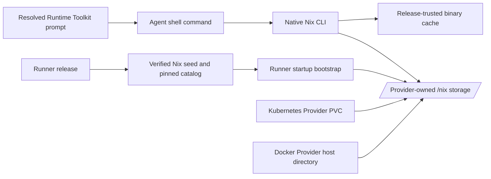

# Persistent Runtime System Tools Design

- Snapshot: `runtime-260831`
- Document reference: `runtime-260831/DESIGN`
- Requirements: [`runtime-260831/REQ`](../requirements/runtime-260831-persistent-system-tools.md)
- Decisions: [`runtime-260831/ADR`](../adr/runtime-260831-persistent-system-tools.md)
- Mode: Collaborative
- Decision owner: Requester

## Current Behavior and Gaps

The bundled Runner image contains a fixed set of operating-system and language tools. The non-root Runner can execute arbitrary shell commands, but there is no supported package interface whose installed dependency closure survives compute replacement.

Kubernetes currently owns one durable Agent Workspace PVC per logical Runtime and mounts it at the configured Runner home path. Docker owns one per-Runtime host root containing a durable Workspace directory and an incarnation-scoped temporary directory. Neither Provider owns a separate system-tool store.

The existing Runtime prompt says that packages may be installed but gives no supported command, persistence location, Project-dependency boundary, or privileged-package-manager prohibition. Package data placed in the Agent Workspace would become part of Workspace browsing and download semantics, contrary to `runtime-260831/REQ-5`.

The current Kubernetes Runner security context is non-root, drops all capabilities, disables privilege escalation, and uses RuntimeDefault seccomp. Live verification showed that unprivileged user and mount namespaces are unavailable inside this boundary, so Nix's user-local chroot store cannot replace a normal `/nix` store without relaxing the sandbox.

## Requirement and Decision Traceability

| Requirement | Design mechanisms | ADR authority |
| --- | --- | --- |
| `runtime-260831/REQ-1` | Native Nix CLI, direct single-user store, release-pinned catalog | D1, D2, D3, D4, D5 |
| `runtime-260831/REQ-2` | Provider-owned durable `/nix` storage mounted into every bundled Runner | D2, D3 |
| `runtime-260831/REQ-3` | Store preservation for ordinary lifecycle; exact reset and terminal deletion | D2, D3 |
| `runtime-260831/REQ-4` | Compact Runtime Toolkit prompt using native Nix commands | D2, D5 |
| `runtime-260831/REQ-5` | Dedicated Kubernetes PVC and Docker host directory outside Agent Workspace | D2, D3 |
| `runtime-260831/REQ-6` | Existing Runner security context, signed substitution only, existing network policy | D3, D4 |
| `runtime-260831/REQ-7` | Offline bootstrap, transactional profile/store behavior, bounded GC and explicit failures | D3, D4 |
| `runtime-260831/REQ-8` | Common Runner contract, Kubernetes E2E, targeted Docker parity tests | D2, D4, D5 |

## Architecture



The common Runner owns Nix behavior, release inputs, bootstrap logic, environment, and prompt commands. Providers own only substrate-specific durable storage creation, mounting, preservation, and deletion.

No Runtime capability, infrastructure-Profile field, Workspace setting, database row, public API, or Admin package configuration is introduced.

## Runner Release and Package Source

Each Runner release contains a verified Nix bootstrap bundle outside `/nix`. The bundle includes:

- one Nix CLI closure;
- one pinned Nixpkgs source path used by the `nixpkgs` registry alias;
- the release-owned Nix registry document;
- substituter URLs and trusted public keys;
- an export suitable for reconciling release paths into an existing store;
- an initial empty-store snapshot; and
- a manifest containing the release generation, logical store paths, and content digests.

The final Runner filesystem does not depend on an image-layer `/nix` store because the Provider mount hides that path. Bootstrap code and seed artifacts live outside `/nix` and remain executable before the store exists.

The default Nix configuration enables the release-supported `nix-command` and flakes interfaces, disables local builds, rejects fallback source realization, and uses only the release-pinned default registry and trusted substituters. The Agent retains ordinary shell authority and may pass Nix options, but this does not grant network, host, or container authority beyond the existing Runtime boundary.

## Runner Bootstrap and Environment

Runner startup acquires one store bootstrap lock before Runtime Control registration.

For an empty store, the bootstrapper verifies the image-bundled manifest and unpacks the complete initial store snapshot, including the Nix database and release profile, into the mounted `/nix` volume. The operation writes to a staging directory or generation marker and exposes the initialized store only after the complete seed passes verification.

For an existing valid store, the bootstrapper uses the currently installed Nix closure to import any missing release paths from the image-bundled export. The import is trusted because the export and manifest are covered by the immutable Runner image digest. Normal Agent substitution continues to require trusted cache signatures. The bootstrapper then atomically advances the managed Nix CLI profile to the release path and records the applied seed generation. Existing Agent-installed store paths and profile roots are retained.

A missing external catalog or binary cache never blocks startup because the Nix CLI closure and pinned catalog source are local release artifacts. Invalid seed content, an unreadable store database, or an incomplete prior bootstrap fails Runner readiness with explicit logs rather than registering a partially usable Runtime. Recovery retries the same idempotent bootstrap; an irrecoverably corrupt store is cleared by explicit Runtime reset.

The Runner-managed environment sets Nix state, cache, log, and default profile locations under `/nix`, and places the managed Nix CLI and Agent package profile `bin` directories on the shell execution path. The separate PATH defect remains an independent implementation item, but the completed Runtime must expose both preinstalled and Nix-installed commands through the corrected shell path contract.

## Agent-Facing Package Interface and Prompt

Agents use the native commands:

```console
nix search nixpkgs <name>
nix profile add nixpkgs#<package>
```

The existing resolved Runtime Toolkit prompt adds this exact text:

```text
For missing system tools, use `nix search nixpkgs <name>` and `nix profile add nixpkgs#<package>`. Do not use sudo or OS package managers. Use the Project's package manager for Project dependencies.
```

The block is 30 English words excluding command placeholders and remains below the 50-word requirement. Runtime-free and shell-disabled Agents continue to receive no Runtime Toolkit prompt.

The prompt does not describe Nix internals, storage, caches, garbage collection, or Provider topology.

## Kubernetes Provider Storage

The Kubernetes Provider creates a second per-Runtime PVC dedicated to the Nix store. It has deterministic Provider ownership metadata and a distinct resource role from the Agent Workspace PVC. The PVC is mounted read-write at `/nix` only in the Runner container; it is not mounted into the DinD engine, proxy resources, or other Runtimes.

Nix-store StorageClass and requested capacity are required bundled-Provider deployment settings exposed through Helm values and Provider environment. They are not capability, Profile, Workspace, or Agent settings. Increasing the configured capacity may expand existing claims when supported. A smaller configured request does not shrink an existing claim; reset creates the replacement claim from the then-current deployment setting. StorageClass changes apply to new or reset stores and never replace an existing store implicitly.

Start and restart ensure both durable PVCs before creating or replacing the Runtime Pod. Pod equivalence includes the Nix PVC volume and `/nix` mount. Stop, observation, failover recovery, network-policy reconciliation, and ordinary Pod recreation preserve the Nix PVC.

Reset deletes the Runtime Pod and execution resources, deletes both the Agent Workspace and Nix-store PVCs, recreates both empty claims, and then converges to the requested final desired state. Terminal deletion removes both claims. Every operation is idempotent; partial deletion or creation is retried from observed ownership evidence without treating absence as proof that another resource was deleted.

Provider observation recognizes a stopped Runtime when either or both owned PVCs remain without a Pod. Unknown, foreign, or incompletely labelled PVCs never become cleanup authority.

## Docker Provider Storage

The Docker Provider adds a durable `nix` child directory under the existing per-Runtime host root, ensures it is writable by Runner UID/GID 1000, and bind-mounts it at `/nix` in the Runner container.

Container stop, restart, recovery, and replacement retain the directory. Existing reset and terminal deletion remove the entire per-Runtime host root, so Workspace and Nix storage retain the same destructive boundary without a second cleanup authority. Docker host filesystem capacity remains the storage limit; exhausted space produces the same native Nix command failure as other store-capacity failures.

Docker exposes the same Runner image, Nix release inputs, environment, commands, and Runtime prompt as Kubernetes.

## State and Lifecycle

No package inventory is persisted in PostgreSQL, Redis, Runtime configuration, Toolkit State, or Provider reports. Nix store paths and the Agent package profile are the physical source of truth.

| Operation | Nix store behavior |
| --- | --- |
| Start | Create storage if absent, bootstrap release paths, preserve installed profile |
| Stop | Preserve storage |
| Restart | Preserve storage and reconcile release seed |
| Recovery | Reuse observed owned storage and retry bootstrap if necessary |
| Ordinary recreation | Preserve storage, import current release seed, retain installed paths |
| Reset | Delete and recreate empty storage, then seed the current release baseline |
| Terminal delete | Delete storage without recreation |
| Runner release update | Import new release closure/catalog, retain Agent-installed profile roots |

Installed commands remain executable without package-source connectivity because their closures are already in the store. Discovery or installation that requires unavailable network access fails through the ordinary Nix command exit and output.

## Store Reclamation and Capacity Failure

The release Nix configuration uses bounded native free-space reclamation. Only unreferenced store paths and disposable cache data may be collected. The managed Nix CLI profile, Agent package profile, release-pinned catalog source, and their closures are garbage-collection roots.

Package-profile mutation is serialized by the Nix profile/store locking contract; Runner-local locking may be added around bootstrap and maintenance boundaries but does not create a new Agent command.

If reclamation cannot free sufficient space, the installation fails explicitly. Existing profiles remain unchanged and previously installed commands remain executable. The system does not automatically remove installed packages, reset storage, expand beyond operator configuration, or fall back to Workspace storage.

## Security and Network Boundaries

- The Runner remains UID/GID 1000 with no added capabilities or privilege escalation.
- No Nix daemon, root sidecar, Kubernetes ServiceAccount mount, host package database, or host root filesystem is exposed.
- Local source builds are disabled; missing trusted binary artifacts fail.
- Release seed trust derives from the immutable Runner image digest and verified seed manifest.
- Normal substitutions require the release-owned trusted public keys.
- Direct, proxy-required, and no-network modes remain authoritative. Nix uses the Runner's effective HTTP/TLS environment and cannot bypass NetworkPolicy or proxy policy.
- Installing a package grants the resulting executable the same Runtime user, filesystem, environment, and network authority as any other shell command, and no more.
- The Nix store is not part of Agent Workspace authorization, Project paths, file publication, or Workspace download.

## Failure, Retry, and Recovery

- **Package absent or invalid attribute:** native Nix non-zero exit; no profile change.
- **Trusted binary absent:** fail without local build.
- **Network blocked or cache unavailable:** native Nix non-zero exit; existing store and profile remain usable.
- **Store full:** collect unreferenced data within configured bounds, then fail if capacity remains insufficient.
- **Pod/container interruption during install:** Nix store/profile transactional behavior and locks retain the previous valid profile; a later command may retry.
- **Bootstrap interruption:** generation marker remains incomplete; next Runner start repeats bootstrap before registration.
- **PVC unavailable:** Kubernetes Provider reports lifecycle/storage failure and retries through the existing lifecycle path; it does not delete the Workspace PVC.
- **Store corruption:** Runner fails bootstrap readiness; explicit reset is the destructive recovery boundary.

## Migration and Rollout

No database, OpenAPI, generated-client, Toolkit attachment, Runtime Profile, or Provider capability migration is required.

Rollout is staged to avoid a prompt or Runner claiming Nix before Providers can mount durable storage:

1. Deploy Kubernetes and Docker Provider versions that create, preserve, mount, and delete Nix storage while remaining compatible with the preceding Runner image.
2. Deploy the Nix-enabled Runner image and Server Runtime prompt together.
3. Reconcile running Runtimes through ordinary image replacement while preserving Agent Workspace storage.
4. Verify bootstrap and Nix-store creation before broadening rollout.

Before step 2, Provider rollback is safe because no Nix-enabled Runner has written package state. After Nix-store resources exist, rollback keeps the Nix-aware Provider and may roll back only the Runner/Server layer. A full Provider rollback would orphan Kubernetes Nix PVC cleanup authority and is therefore replaced by forward recovery or a Nix-aware corrective Provider release. Docker's existing runtime-root deletion remains cleanup-safe across rollback.

Existing Runtimes receive an empty Nix package profile on their first Nix-enabled recreation. Existing Agent Workspace bytes are unchanged. Reset behavior remains explicitly destructive for both stores.

## Observability

Provider and Runner logs expose only bounded operational facts: Nix seed generation, bootstrap outcome, store initialization/reconciliation result, PVC identity/status, and error category. They do not enumerate installed package names or command history.

Agent package command stdout/stderr and exit status remain visible through existing `exec_command` results. No package inventory API, metric series, or durable audit table is introduced.

Kubernetes operators continue to observe PVC capacity and events through cluster tooling. Docker operators observe host filesystem capacity through existing infrastructure monitoring.

## Test Strategy

### E2E primary verification matrix

A new Kubernetes Runtime E2E lane is the primary product verification path.

- **Install and execute:** start a direct-network Runtime, search for a small pinned fixture package, install it, and execute its command.
- **Pod recreation persistence:** recreate the Runtime Pod through the public lifecycle path and execute the installed command without reinstalling.
- **Reset deletion:** reset the Runtime, verify the installed command is absent, and verify native Nix search/install remains available.
- **Network boundary:** install one package in direct mode, recreate into no-network mode while preserving storage, verify the installed command still executes, and verify a new uncached install fails.
- **Prompt:** inspect the real composed Runtime Toolkit prompt and verify the exact guidance, word bound, and absence for Runtime-free/shell-disabled Agents.
- **Workspace separation:** verify Workspace list/download surfaces cannot observe `/nix` contents.

The lane uses an ephemeral Kubernetes cluster with dynamic PVC provisioning, locally loaded immutable Azents images, and no external credentials. Required package artifacts are selected from the release-trusted public cache and pinned in the fixture snapshot. A missing mandatory cache or cluster prerequisite fails the lane rather than skipping it.

### Docker parity verification

Docker verification is intentionally narrower:

- Provider tests prove the Nix host directory and `/nix` bind mount are created, preserved, and deleted with the required lifecycle.
- Runner integration tests use a Docker-backed persistent directory to prove bootstrap, install, container replacement persistence, and reset cleanup.
- Common Server prompt tests prove identical Agent-visible commands; a duplicate full Docker E2E matrix is not required.

### Unit and integration coverage

- Runner bootstrap: empty initialization, existing-store reconciliation, seed digest failure, interrupted generation retry, catalog availability without network, and corrupt-store failure.
- Kubernetes Provider: deterministic Nix PVC ownership, ensure/observe/expand/preserve/delete, Pod mount comparison, partial cleanup retry, and foreign-resource rejection.
- Docker Provider: directory ownership, bind specification, replacement preservation, and root deletion.
- Nix configuration: pinned registry, trusted keys, no local builds, state/profile paths outside Workspace, and GC roots.
- Runtime prompt: exact text and under-50-word assertion.

### Evidence and CI policy

The Kubernetes journey publishes Runtime lifecycle evidence, package command output, Pod/PVC state, and prompt analysis as CI artifacts. Runner image, Provider, Runtime persistence, prompt, or Helm changes trigger the required lane. Docker parity tests remain required focused tests in their existing project jobs.

## Alternatives

The accepted and rejected package-manager, capability, daemon, source-build, catalog-authority, and wrapper alternatives are recorded in `runtime-260831/ADR` and are not reopened here.

A Workspace-subdirectory store was rejected by `runtime-260831/REQ-5`: it would consume and expose user Workspace semantics. User-local chroot Nix was rejected by current security feasibility because unprivileged namespace creation is denied.

## Assumptions and Non-Blocking Risks

- The release-selected Nixpkgs revision has sufficient signed binary coverage for common Agent tools; unsupported packages fail explicitly.
- Initial store creation and release-catalog seeding add bounded startup latency and image size.
- Kubernetes Nix PVC capacity is deployment-wide rather than Profile-specific and may need later operational tuning.
- A short rollout window can exist while old Runner Pods await ordinary image reconciliation; rollout sequencing and post-deploy verification bound this risk.
- Raw Nix CLI output can be verbose, but a wrapper is not justified by the confirmed interface.

## Design Authority

- Design revision: `1`

| ID | Material design mechanism | Authority | Classification |
| --- | --- | --- | --- |
| M1 | Native Nix search and profile-add interface in every bundled managed shell Runtime | runtime-260831/REQ-1, REQ-4, REQ-8; ADR-D1, D2, D5 | `decided` |
| M2 | Release-owned Nix closure, pinned Nixpkgs source, substituters, and trust keys | runtime-260831/REQ-6, REQ-7; ADR-D3, D4 | `decided` |
| M3 | Direct single-user, binary-substitution-only execution without daemon or added privilege | runtime-260831/REQ-1, REQ-6, REQ-7; ADR-D3 | `decided` |
| M4 | Provider-owned durable Nix storage outside Agent Workspace with existing destructive boundaries | runtime-260831/REQ-2, REQ-3, REQ-5; Agent Runtime Persistence Spec | `derived` |
| M5 | Dedicated Kubernetes Nix PVC controlled by bundled Provider deployment configuration | M4; ADR-D2; Runtime Provider Spec | `derived` |
| M6 | Docker per-Runtime Nix host directory and `/nix` bind mount | M4; runtime-260831/REQ-8; Agent Runtime Persistence Spec | `derived` |
| M7 | Offline Runner bootstrap and release-seed reconciliation before Runner registration | runtime-260831/REQ-7; ADR-D3, D4 | `derived` |
| M8 | Exact compact guidance in the existing resolved Runtime Toolkit prompt | runtime-260831/REQ-4; ADR-D2, D5 | `decided` |
| M9 | GC preserves profile/release roots and low capacity fails without removing installed tools | runtime-260831/REQ-7; ADR-D3 | `derived` |
| M10 | Kubernetes E2E primary matrix and targeted Docker parity matrix | runtime-260831/REQ-8 | `required` |

## Removal and Replacement

| Existing unit or behavior | Removal authority | Replacement or remaining authority | Removal boundary | Absence verification |
| --- | --- | --- | --- | --- |
| Fixed-image-only system-tool availability | runtime-260831/REQ-1 and ADR-D1 | Preinstalled baseline remains; Nix adds persistent Agent-installed tools | Nix-enabled Runner rollout | E2E installs a non-image fixture and survives recreation |
| Generic Runtime prompt claim without installation commands | runtime-260831/REQ-4 and ADR-D5 | Exact compact Nix guidance | Server prompt rollout | Prompt analysis asserts exact text and word bound |
| Kubernetes Runtime resource set with only Workspace durable storage | runtime-260831/REQ-2, REQ-3, REQ-5 | Workspace PVC remains; dedicated Nix PVC joins the owned set | Nix-aware Provider rollout | Provider tests and live E2E show two isolated durable stores |
| Docker Runtime host root without Nix directory | runtime-260831/REQ-2, REQ-3, REQ-8 | Existing Workspace/tmp behavior remains; Nix directory is added | Nix-aware Provider rollout | Docker provider and Runner integration tests |
| Runtime Profile and Provider capability schemas | None | Remain unchanged under ADR-D2 | None | Schema/client diffs contain no Nix enablement or capability field |
| Package inventory database/API/UI | None | Remains absent under Non-Goals | None | Migration, OpenAPI, generated-client, and UI searches remain unchanged |

## Feasibility

- **REQ-1 — Feasible:** a direct UID/GID 1000 Nix 2.35.2 store was seeded into a separate mounted path and successfully installed and executed a signed-cache package without a daemon or added privilege.
- **REQ-2 — Feasible:** Kubernetes already owns per-Runtime PVC lifecycle and Docker already owns per-Runtime host directories/binds; each can add one isolated store without changing server persistence.
- **REQ-3 — Feasible:** both Providers have explicit reset and terminal-delete code paths and idempotent resource cleanup boundaries.
- **REQ-4 — Feasible:** RuntimeToolkit already owns resolved Runtime prompt construction and can add one bounded block without a new prompt source.
- **REQ-5 — Feasible:** `/nix` is outside the Runner-reported Agent Workspace and existing file/publication APIs remain rooted only at the reported Workspace path.
- **REQ-6 — Feasible:** current security context supports direct writes to an owned volume; live `unshare` denial confirms the design does not depend on relaxed namespaces. Existing NetworkPolicy/proxy environment remains in path.
- **REQ-7 — Feasible:** Nix store/profile transactions, release-local bootstrap inputs, binary-only configuration, and explicit reset provide credible recovery boundaries. Store-corruption recovery remains destructive by explicit reset.
- **REQ-8 — Conditional:** Provider and Runner parity are feasible, but the repository currently lacks a live Kubernetes Runtime package-installation E2E lane. Implementation must add the specified ephemeral-cluster lane before verification can complete.

No authority blocker was found. The only feasibility condition is the new Kubernetes E2E substrate required by the confirmed verification scope.

## Design Approval

- Mode: `Collaborative`
- Decision owner: Requester
- Approved on: 2026-08-31
- Approved Design revision: `1`
- Approved authority IDs: `M1, M2, M3, M4, M5, M6, M7, M8, M9, M10`
- Approved scope: Nix-based persistent system-tool installation for bundled Kubernetes and Docker Runtimes, including direct non-root binary-only operation, release-owned catalog trust, Provider-owned durable storage, compact native-CLI guidance, lifecycle semantics, rollout, and verification.
