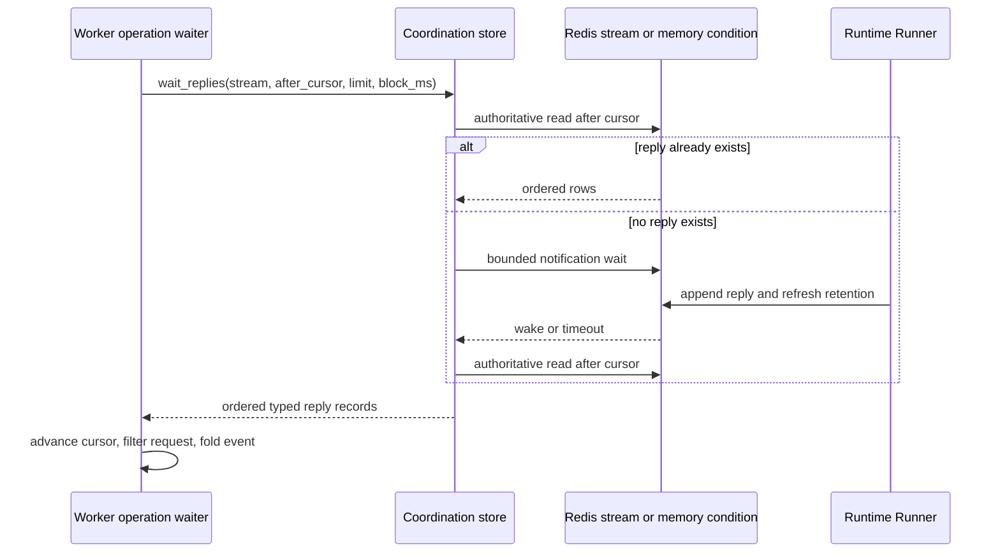

# runtime-260910/DESIGN: Responsive Runtime Operation Delivery

This design implements the confirmed
[Responsive Runtime Operation Delivery Requirements](../requirements/runtime-260910-responsive-operation-delivery.md)
(`runtime-260910/REQ`) according to the accepted
[Responsive Runtime Operation Delivery ADR](../adr/runtime-260910-responsive-operation-delivery.md)
(`runtime-260910/ADR`).

## Current Behavior and Gaps

`RuntimeRunnerOperationClient` waits for foreground operation completion by
performing a non-blocking reply read, sleeping for the configured polling interval
when no row exists, and repeating until a reply, cancellation, or deadline.
Production evidence showed Runner completion preceding Worker observation by about
ten seconds during Worker CPU saturation.

The Redis reply read refreshes the stream TTL before every range read even though
all reply append paths already refresh the same retention. The in-memory store
holds reply lists under one lock but has no append notification mechanism.

Worker replica count is fixed in the Helm template. Runner reconnect creates new
gRPC clients with the bearer token captured once at process startup, including
after Control rejects that token as `UNAUTHENTICATED`.

The gaps are:

- idle reply waiting produces repeated coordination and scheduling work;
- reply observation mutates Redis retention;
- operators cannot separate Runner execution, reply observation, and Worker
  event-loop delay with bounded process evidence;
- Worker capacity is not a chart value; and
- stale Runner authority enters a non-recovering reconnect loop.

## Requirement and Decision Traceability

| Requirement | Decisions | Primary mechanisms |
| --- | --- | --- |
| `runtime-260910/REQ-1` | `ADR-D1` | Bounded cursor wait in the store and foreground client |
| `runtime-260910/REQ-2` | `ADR-D1` | Opaque cursor replay, one-second reconciliation bound, unchanged filtering/final folding |
| `runtime-260910/REQ-3` | `ADR-D2` | Reply read/wait omits TTL refresh; append keeps retention |
| `runtime-260910/REQ-4` | `ADR-D3` | Process recorder, fixed buckets/outcomes, structured snapshot log, event-loop sampler |
| `runtime-260910/REQ-5` | `ADR-D4` | `server.worker.replicas` value and render coverage |
| `runtime-260910/REQ-6` | `ADR-D5` | Terminal `UNAUTHENTICATED` classification and Provider-mediated reprovisioning |

## Architecture and Ownership



Ownership remains:

- the reply stream is the volatile source of truth for ordered reply events;
- the operation client owns deadline/cancellation checks and per-request folding;
- each coordination adapter owns cursor interpretation and wake implementation;
- append paths own reply stream liveness and TTL refresh;
- the Runtime observability recorder owns bounded process-lifetime aggregates;
- Worker health lifecycle owns periodic event-loop sampling and snapshot logging;
- Helm values own desired Worker replica count; and
- the Provider lifecycle owns issuance and injection of current Runner credentials.

Wake notifications are hints only. Every event or timeout returns through an
authoritative cursor read.

## Coordination Store Contract

`RuntimeCoordinationStore` adds:

```text
wait_replies(
  stream_id,
  *,
  after_cursor: opaque string or none,
  limit: positive integer,
  block_ms: non-negative integer,
) -> ordered RuntimeReplyRecord list
```

`read_replies` remains non-blocking for replay and tests. `wait_replies` returns:

- immediately when rows already exist after the cursor;
- rows after a notification and authoritative reread; or
- an empty list when the bounded wait elapsed without an observable row.

A non-positive limit returns no rows. A zero block performs only the authoritative
read. Cursors are never parsed by the service or operation client.

## Redis Runtime Behavior

The Redis adapter:

1. resolves the generation reply stream key;
2. performs `XRANGE` strictly after `after_cursor`, limited to the requested count;
3. returns typed rows immediately when present;
4. otherwise calls ordinary `XREAD` using `after_cursor` or `0-0`, with
   `block=block_ms` and `count=1`;
5. rereads through `XRANGE` after the original cursor and returns typed rows.

The pre-read covers rows appended before wait entry. `XREAD` covers rows appended
after the cursor while the caller is blocked. The post-read keeps typed parsing,
ordering, batching, and cursor advancement on one authoritative path.

Neither `read_replies` nor `wait_replies` calls `EXPIRE`. `append_reply`, fenced
reply append, and operation-aware reply append retain their current append-side
TTL refresh. Redis socket timeout remains unset so the explicit block is the only
I/O deadline. No automatic retry is added around `XREAD` or append operations.

## In-Memory Runtime Behavior

The in-memory adapter retains the existing store lock and adds one condition per
reply stream using that lock. A shared locked append helper:

- creates the next numeric-string cursor;
- appends the typed record; and
- notifies all waiters for the stream.

All four append surfaces use the helper:

- general reply append;
- fenced reply append without operation metadata;
- fenced operation reply append; and
- local operation-aware reply append.

`wait_replies` acquires the condition, checks rows after the cursor, and only then
waits. Append and notification occur while the same lock is held, so an append
cannot occur between the empty check and waiter registration. Timeout returns an
empty list. Cancellation propagates without altering reply state.

Unused conditions may remain for the process lifetime because stream IDs and
operation state are already process-lifetime volatile state in this adapter.

## Foreground Operation Wait

The operation client replaces the empty-read sleep loop with `wait_replies`.
Before every wait it:

1. evaluates the existing cancellation predicate;
2. computes remaining deadline duration;
3. enters the existing timeout failure path when no duration remains; and
4. sets `block_ms` to the smaller of one second and the remaining duration,
   rounded up to preserve a positive bounded block.

After an empty wait result, the loop reevaluates cancellation and deadline. After
records arrive, it advances the cursor for every record, filters unrelated request
IDs, folds matching records, and returns or raises on the same final event types as
today.

`asyncio.CancelledError` remains a separate path. It requests Runner cancellation,
appends the current local final cancellation event when identities are available,
and re-raises. The store wait itself does not create a detached task, so task
cancellation directly cancels the Redis or condition await.

## Observability

`RuntimeReplyDeliveryMetrics` is an AppContext-owned, process-local recorder guarded
by a synchronous lock. It exposes an immutable snapshot containing:

- current and maximum active waiter count;
- fixed wait-duration buckets;
- wait outcomes: `event`, `timeout`, `cancel`, and `error`;
- total rows examined and rows filtered because another operation owned them;
- fixed reply append-to-observation latency buckets; and
- latest, maximum, and sampled Worker event-loop lag.

Duration buckets use fixed boundaries and a terminal overflow bucket. They do not
allocate values from request data. Recorder methods clamp negative durations to
zero and saturate no identifier-derived dimension.

The operation client records waiter entry and exit in `try`/`finally`, the wait
outcome at the handling boundary, rows examined/filtered, and each matching
record's non-negative `observation_time - event.created_at`.

`HealthServer` starts one periodic sampler after the HTTP site starts. The sampler
uses loop monotonic time, schedules one-second ticks against the prior target, and
records non-negative drift. At a low fixed cadence it emits one structured
`Runtime reply delivery metrics` log containing only snapshot aggregate fields.
`stop()` cancels and awaits the sampler before cleaning up the HTTP runner.
`/healthz` and `/readyz` response contracts do not change.

Request-scoped diagnostic logs may retain request, operation, Runtime, and cursor
fields in structured `extra`, but the aggregate snapshot contains none of those
values and never includes payload or file content.

## Worker Replica Configuration

`infra/charts/azents/values.yaml` adds:

```yaml
server:
  worker:
    replicas: 1
```

The Worker Deployment renders `.Values.server.worker.replicas`. No autoscaling
resource, PodDisruptionBudget, or default scale change is introduced.

The existing Redis broker consumer group, Session ownership lease/heartbeat, and
generation fencing remain the multi-replica processing authority. In-memory broker
deployments remain single-process development behavior and do not claim
cross-replica correctness.

## Runner Credential Rejection and Recovery

The Runner reconnect boundary separates authentication and accepted-authority
rejection from transient reconnect exceptions.

When `error.code()` is `grpc.StatusCode.UNAUTHENTICATED`, the Runner:

1. logs one bounded warning identifying credential rejection by status code,
   without the token or raw metadata;
2. returns from `run_runtime_runner`;
3. executes the existing connection cleanup and execution-backend cleanup; and
4. leaves Provider observation/reconciliation to issue a current lifecycle command
   and replace or restart the Runtime workload with a newly minted credential.

`RunnerConnectionRejected`, raised when an accepted connection's heartbeat is no
longer authorized, follows the same terminal path. For other gRPC statuses and
closed streams, the existing delayed reconnect behavior remains. Small pure
classification helpers provide deterministic unit coverage without parsing error
text.

No refresh credential is persisted, no stale credential is accepted, and no
fallback authentication method is added. Existing Kubernetes replacement preserves
the PVC, and Docker replacement preserves the Workspace volume.

Recovery is eventual rather than immediate: Provider observation detects the
stopped workload, and a subsequent lifecycle reconciliation dispatches a current
`START`. Existing bounded Provider observation and lifecycle retry intervals own
that delay.

## Failure, Retry, and Recovery

- A reply wait timeout is normal reconciliation, not an operation failure.
- Redis connection failure propagates through the existing foreground failure
  boundary; the store does not infer completion or retry non-idempotent appends.
- Task cancellation propagates after existing Runner cancellation and local final
  handling.
- A reply key expiring during a wait yields no authority. A later append may create
  a new stream, while an unrecoverable in-flight operation reaches its deadline.
- In-memory wake notification loss is prevented by the shared lock/condition
  boundary.
- Recorder failure is prevented from affecting operation correctness by using
  allocation-bounded synchronous updates without I/O.
- Event-loop sampler shutdown is cancellation-safe and does not hold readiness
  shutdown open.
- Runner credential or accepted-heartbeat authority rejection terminates the stale
  process. Provider lifecycle report/reconcile failures remain visible through
  existing Provider and Runtime lifecycle evidence and are not hidden as Runner
  reconnect success.

## Migration, Rollout, and Rollback

There is no persistent schema, Redis namespace, protobuf, OpenAPI, or generated
client migration.

Rollout order is compatible across one application/chart release because the new
store method is internal and both adapters and their only caller change together.
Worker replicas stay at one unless a deployment explicitly overrides the value.
No live deployment modification is part of this PR.

Rollback restores polling and read-side TTL writes but does not require data
conversion. The existing reply payloads, cursors, operation metadata, and Helm
default remain readable by the prior version. A Runner image rollback restores the
old reconnect loop without changing credential format.

## Security and Privacy

- Runtime-bound desired-generation credentials continue failing closed.
- Provider lifecycle remains the only current credential delivery path.
- Bearer values and credential metadata are never logged.
- Generation fencing and registration identity checks remain unchanged.
- Metrics and periodic logs contain aggregate counts/durations only.
- Reply payloads, file contents, command output, and user text never enter the
  recorder.

## Test Strategy

### Primary verification matrix

| Scenario | Expected result |
| --- | --- |
| Reply exists before wait | Returned immediately in cursor order |
| Reply appended while Redis wait is blocked | Wait wakes and returns authoritative rows |
| Reply appended through each in-memory append path | Matching condition waiter wakes |
| No reply before block bound | Empty result and caller rechecks deadline/cancellation |
| Foreground task is cancelled during wait | Runner cancellation path runs and `CancelledError` propagates |
| Shared stream contains interleaved requests | Cursor advances for all rows and only matching events fold |
| Redis reply read/wait | No read-side `EXPIRE`; append still refreshes TTL |
| Concurrent foreground operations | Waiter count is bounded, no fixed read loop, completion latency stays near append |
| Worker event loop is delayed | Lag snapshot increases without changing health response |
| Helm default and explicit replica override | Renders one and configured multiple replicas respectively |
| Runner registration receives `UNAUTHENTICATED` | Cleans up and exits instead of retrying the same token |
| Accepted Runner heartbeat is rejected | Cleans up and exits instead of retrying the same token |
| Runner receives transient gRPC failure | Retains delayed reconnect behavior |
| Provider reprovisions current generation | Fresh credential connects and Workspace storage identity is preserved |

### E2E plan

The existing required Runtime operation fixture executes representative file and
process operations through the real Worker, Control, Provider, and Runner. Add or
extend a focused concurrent-operation scenario to capture Runner completion,
Worker observation, and user-visible completion timestamps. Evidence records the
maximum and percentile append-to-observation latency, waiter/timeouts, and Worker
event-loop lag without request IDs as metric dimensions.

Kubernetes credential-reprovision validation advances a test Runtime desired
generation, verifies the old Runner is rejected and exits, observes Provider
replacement with a current credential, confirms the Runner reconnects, and verifies
the same PVC identity and data sentinel. This live Kubernetes scenario is optional
only when the cluster prerequisite is explicitly unavailable; an authentication or
storage mismatch fails.

### Unit and integration coverage

- store protocol delegation and operation-client block calculation;
- Redis pre-read, bounded `XREAD`, post-read, timeout, cursor order, and TTL calls;
- memory check-before-wait and all append notification paths;
- cancellation and existing timeout/final-error behavior;
- fixed metric buckets, outcomes, filtered rows, latency clamping, and snapshot
  privacy;
- event-loop sampler scheduling and cancellation with deterministic clock/control;
- Helm default and explicit multi-replica rendering;
- gRPC status classification, accepted-heartbeat rejection, and Runner
  reconnect/exit branches; and
- existing Provider replacement tests for new credential plus Workspace/PVC
  preservation.

No fixed sleep establishes test ordering. Tests use events, conditions, fake Redis
responses, controlled clocks, or authoritative state checks. Wall-clock waits are
limited to the bounded-timeout contract itself.

### Fixtures and evidence

Existing Redis/in-memory store fixtures, Runtime operation fixtures, Provider fake
Kubernetes/Docker APIs, and Helm render helpers are reused. No new durable seed or
credential snapshot is required. Test credentials remain generated fixtures and
must not be logged or committed.

Required CI runs targeted unit/integration/render tests followed by the configured
Python Ruff, type checker, and pytest suites for changed subprojects. Live optional
tests skip only for an explicitly absent environment prerequisite.

## Removal and Replacement

| Existing unit or behavior | Removal authority | Replacement or remaining authority | Removal boundary | Absence verification |
| --- | --- | --- | --- | --- |
| Empty reply read followed by fixed sleep | `runtime-260910/REQ-1`, `ADR-D1` | Bounded cursor-based store wait | Foreground reply wait loop and polling-only tests | Search shows no reply-loop sleep or poll-interval fallback |
| Reply read-side Redis TTL refresh | `runtime-260910/REQ-3`, `ADR-D2` | Append-side retention refresh | Redis `read_replies` and `wait_replies` only | Tests assert no `EXPIRE` on reply observation and one on append |
| Hard-coded Worker `replicas: 1` | `runtime-260910/REQ-5`, `ADR-D4` | `server.worker.replicas` defaulting to one | Worker Deployment template | Render tests cover default and explicit override |
| Indefinite same-token reconnect after registration or heartbeat authority rejection | `runtime-260910/REQ-6`, `ADR-D5` | Process exit and Provider-mediated current credential reprovisioning | Runner outer reconnect exception handling | Tests distinguish both authority rejection paths from transient reconnect |
| External scrape/export for the new metrics | None | Existing structured logging infrastructure | No removal; no prior Runtime reply exporter exists | Dependency and chart searches remain free of a new scrape contract |

## Feasibility

| Requirement | Status | Repository evidence |
| --- | --- | --- |
| `REQ-1` | `feasible` | Redis client and Terminal coordination already support bounded `XREAD`; memory has a shared async lock suitable for conditions |
| `REQ-2` | `feasible` | Current cursor/filter/final folding remains in the operation client; only empty-wait behavior changes |
| `REQ-3` | `feasible` | Reply append paths already refresh Redis TTL independently of reads |
| `REQ-4` | `feasible` | Existing process-local bounded recorder and structured logging patterns require no new service dependency |
| `REQ-5` | `feasible` | Worker broker consumer group, ownership lease, and generation fencing support multiple Redis-backed replicas |
| `REQ-6` | `feasible` | Provider lifecycle command issuance already mints the current credential and Provider tests cover storage-preserving workload replacement |

No feasibility blocker or unresolved product decision remains. Redis pool occupancy,
shared-stream wake amplification, event-loop sampling overhead, and Provider
recovery delay are measurable non-blocking operational risks.

## Design Authority

- Design revision: `1`

| ID | Material design mechanism | Authority | Classification |
| --- | --- | --- | --- |
| M1 | Separate opaque-cursor bounded reply-wait contract with authoritative replay | `runtime-260910/REQ-1`, `runtime-260910/REQ-2`, `runtime-260910/ADR-D1` | `decided` |
| M2 | Redis `XRANGE`/bounded `XREAD`/`XRANGE` and memory lock/condition equivalence | `runtime-260910/REQ-1`, `runtime-260910/REQ-2`, `runtime-260910/ADR-D1`, Redis-optional project constraint | `decided` |
| M3 | One-second maximum reconciliation bound combined with operation deadline and cancellation | `runtime-260910/REQ-2`, `runtime-260910/ADR-D1`, current cancellation contract | `decided` |
| M4 | Reply retention refresh only on append | `runtime-260910/REQ-3`, `runtime-260910/ADR-D2` | `decided` |
| M5 | Process-local fixed-cardinality recorder and periodic structured snapshot log | `runtime-260910/REQ-4`, `runtime-260910/ADR-D3` | `decided` |
| M6 | Worker lifecycle event-loop drift sampler with unchanged health payloads | `runtime-260910/REQ-4`, `runtime-260910/ADR-D3` | `decided` |
| M7 | Explicit Worker replica value defaulting to one without HPA | `runtime-260910/REQ-5`, `runtime-260910/ADR-D4` | `decided` |
| M8 | Terminal Runner process handling for `UNAUTHENTICATED` and Provider-owned current credential reprovisioning | `runtime-260910/REQ-6`, `runtime-260910/ADR-D5`, `runtimeauth-260723/ADR-D5` | `decided` |
| M9 | Preserve reply ordering, request filtering, final authority, generation fencing, and optional-Redis failure semantics | `runtime-260910/REQ-2`, current Agent Runtime Control Spec, project constraints | `existing` |

## Assumptions and Non-Blocking Risks

- The existing reply retention exceeds foreground operation deadlines and completion
  grace; append-side refresh preserves that relationship.
- Redis connection-pool capacity must be observed under expected concurrent waiter
  load before a deployment raises Worker or operation concurrency materially.
- Shared generation streams may produce unrelated wakeups; filtered-row metrics
  reveal when per-operation reply streams merit a future snapshot.
- Provider observation and lifecycle reconciliation intervals determine eventual
  credential recovery latency after the stale Runner exits.
- A future repository-wide Prometheus scrape contract may export the recorder, but
  that is outside this snapshot.

## Design Approval

- Mode: `Autonomous`
- Decision owner: `design-interviewee delegated by the requester`
- Approved on: `2026-09-10`
- Approved Design revision: `1`
- Approved authority IDs: `M1, M2, M3, M4, M5, M6, M7, M8, M9`
- Approved scope: `Bounded event-driven Runtime reply delivery, append-owned retention, process-local delivery and event-loop observability, configurable fixed Worker replicas, and fail-closed stale Runner credential recovery through Provider reprovisioning.`
