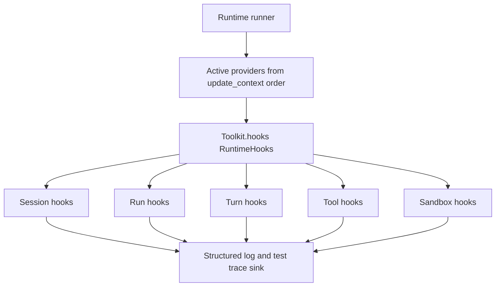
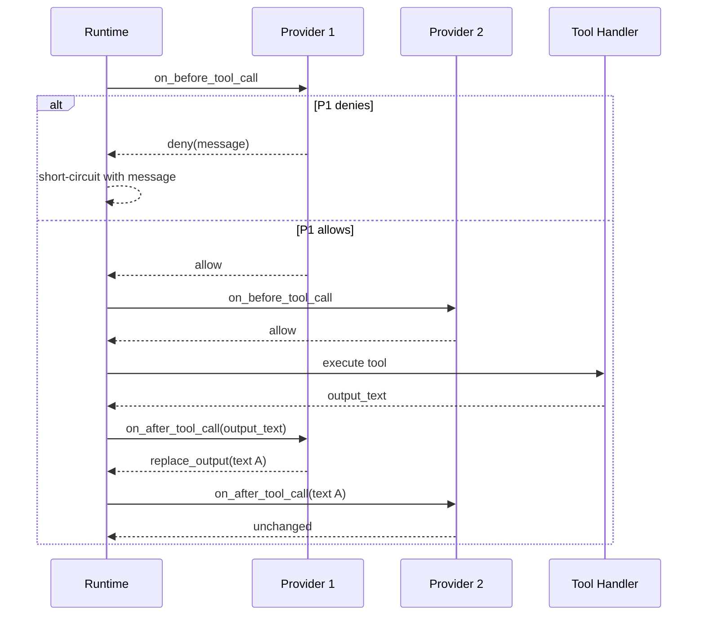
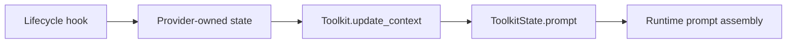

# Runtime Hook System Design

Related design: [toolkit-hooks-agents-md.md](./toolkit-hooks-agents-md.md)

## Goals

- Provide a simple model where hook authors explicitly register only lifecycle callbacks they support in `Toolkit.hooks()`.
- Keep current `Toolkit` as provider boundary while recording that it may be renamed to runtime capability provider long term.
- Define first taxonomy and callback semantics for session, run, turn, tool, and sandbox lifecycles.
- Provide small lifecycle-specific result types, while observation-only hooks return `None`.
- Allow only approved minimal mutations: tool deny, tool output text replacement, and turn start prompt injection.
- Keep prompt assembly ownership in existing `update_context()` and `ToolkitState.prompt`.
- Specify active provider order, failure policy, and trace policy as runner contract.
- Make hook trace useful for tests and operations diagnostics without storing raw args/output/prompt/credentials.

## Non-goals

- This document does not include phase plan, per-file implementation checklist, or PR split plan.
- Renaming `Toolkit` or introducing a separate provider base class is out of scope.
- Do not introduce external arbitrary plugin runtime, plugin manifest, plugin sandbox, or third-party hook execution.
- Model lifecycle hook is excluded from first implementation. `on_before_model_call` and `on_after_model_call` are not defined.
- Memory, external event, and attachment lifecycle are excluded from this taxonomy.
- Do not introduce `PromptBlock` or `ContextBlock` abstraction.
- Do not provide universal `HookResult`, arbitrary mutation, continuation, or retry wrapper model.
- Do not provide an API for hook authors to directly create durable audit events.
- Durable DB audit or OTel export is not required in initial implementation.

## Current State

Relevant current structure:

- `python/apps/nointern/src/nointern/core/tools.py`
  - defines `Toolkit`, `ToolkitState`, `TurnContext`, `ToolkitProvider`.
  - Toolkit provides tools and prompt through `update_context()`.
- `python/apps/nointern/src/nointern/engine/sdk/agent.py`
  - updates active Toolkit context and combines Toolkit prompt into system instruction.
- `python/apps/nointern/src/nointern/engine/sdk/tool_converter.py`
  - wraps nointern function tool handler call path.
- `python/apps/nointern/src/nointern/engine/tools/builtin.py`
  - location for builtin Toolkit family and AGENTS.md-related runtime features.
- `docs/nointern/design/toolkit-hooks-agents-md.md`
  - records already implemented Toolkit hook/state design where AGENTS.md is first consumer.

Existing Toolkit hook in current design document is tool-call-observation oriented for AGENTS.md state update. Registration shape, ordering, failure policy, and trace policy covering whole session/run/turn/sandbox lifecycle are not yet organized as a common contract.

This design supersedes existing AGENTS.md design's observation-only tool hook constraint within the range of `on_before_tool_call` explicit deny and `on_after_tool_call` text output replacement. However, it keeps AGENTS.md structure where provider-owned state is updated and prompt is exposed from `update_context()`.

## Target State

Runtime iterates the active provider list with same ordering rule at each lifecycle dispatch point. Provider receives only callbacks registered in `hooks()`. Runner skips unregistered lifecycle callbacks.



Core target-state constraints:

- hook registration is explicit mapping.
- runner does not manage provider-local callback ordering.
- only lifecycle-specific result types are allowed.
- hook side effects are limited to provider-owned internal/persistent state update and approved lifecycle effects.
- prompt exposure is handled by `update_context()`.
- hook trace is automatically recorded by runner.

## User-visible Behavior

- Stateful observer providers such as AGENTS.md can observe tool call, turn, and session lifecycle, update provider-owned state, and reflect it in later prompts.
- If provider returns additional prompt from `on_turn_start`, user can reproduce prompt effect in later replay/resume as either visible user input or hidden internal input depending on configured persistence mode.
- If provider returns deny from `on_before_tool_call`, that tool call is not executed and English deny message is delivered as user/model-facing text.
- If multiple providers register `on_after_tool_call`, final tool output text becomes pipeline result in active provider order.
- Hook failure does not unnecessarily stop normal user operation unless it is cancellation. It is recorded in structured log and test trace sink instead.
- Session clear/compact and sandbox hibernate/restore hooks affect provider state cleanup/observation but do not block or change the original user-requested operation.

## Hook API Sketch

The sketch below explains the contract. Actual module path and detailed field names are finalized in implementation design.

```python
from collections.abc import Awaitable, Callable
from typing import Annotated, Literal, TypedDict

from pydantic import BaseModel, Field


class ToolCallAllow(BaseModel):
    kind: Literal["allow"]


class ToolCallDeny(BaseModel):
    kind: Literal["deny"]
    message: str


ToolCallDecision = Annotated[
    ToolCallAllow | ToolCallDeny,
    Field(discriminator="kind"),
]


class ToolOutputUnchanged(BaseModel):
    kind: Literal["unchanged"]


class ToolOutputReplace(BaseModel):
    kind: Literal["replace_output"]
    output_text: str


ToolOutputDecision = Annotated[
    ToolOutputUnchanged | ToolOutputReplace,
    Field(discriminator="kind"),
]


class TurnInjectedPrompt(BaseModel):
    persistence: Literal["visible_user_input", "hidden_internal_input"]
    text: str


class TurnStartResult(BaseModel):
    injected_prompts: list[TurnInjectedPrompt] = Field(default_factory=list)


class RuntimeHooks(TypedDict, total=False):
    on_session_start: Callable[[SessionStartHookContext], Awaitable[None]]
    on_session_clear: Callable[[SessionClearHookContext], Awaitable[None]]
    on_session_compact: Callable[[SessionCompactHookContext], Awaitable[None]]
    on_run_start: Callable[[RunStartHookContext], Awaitable[None]]
    on_run_end: Callable[[RunEndHookContext], Awaitable[None]]
    on_turn_start: Callable[[TurnStartHookContext], Awaitable[TurnStartResult | None]]
    on_turn_end: Callable[[TurnEndHookContext], Awaitable[None]]
    on_before_tool_call: Callable[[BeforeToolCallHookContext], Awaitable[ToolCallDecision | None]]
    on_after_tool_call: Callable[[AfterToolCallHookContext], Awaitable[ToolOutputDecision | None]]
    on_sandbox_hibernate: Callable[[SandboxHibernateHookContext], Awaitable[None]]
    on_sandbox_restore: Callable[[SandboxRestoreHookContext], Awaitable[None]]


class Toolkit:
    def hooks(self) -> RuntimeHooks:
        return {}
```

Context object contains only minimal metadata needed by each lifecycle. Due to trace policy, raw tool args, raw output, prompt text, and credential secret are not automatically stored in trace. Callback may receive data needed for functionality, but runner trace must record only redacted/summarized fields.

## Lifecycle Semantics

### Session lifecycle

| Lifecycle | Effect | Result | Can block? |
|---|---|---|---|
| `on_session_start` | provider state init once at session lifetime start | `None` | no |
| `on_session_clear` | reset session-scoped provider state | `None` | no |
| `on_session_compact` | compact session-scoped provider state | `None` | no |

`on_session_start` does not query event store every time to determine duplication. Put a marker such as `agent_sessions.lifecycle_started_at` on session row and claim first dispatch with conditional update. Runner that fails the claim treats it as already dispatched or in progress by another runner and does not repeatedly call session start hook.

Marker is based on `agent_sessions.id` lifecycle, not `agent_runtime_id`. nointern manual reset/clear is close to active `AgentSession` rotation, so new `agent_sessions.id` means new session lifecycle.

Session clear/compact hook is an observation point for provider state init/reset/compact. `on_session_clear` corresponds to active `AgentSession` rotation/manual reset operation, not events row deletion. It cannot block or alter original session operation.

### Run lifecycle

| Lifecycle | Effect | Result | End reason |
|---|---|---|---|
| `on_run_start` | observe/state update run start | `None` | none |
| `on_run_end` | observe/state update run end | `None` | `completed`, `error`, `cancelled`, `unknown` |

There is no separate `on_run_error` or `on_run_cancel`. A started run must dispatch `on_run_end` exactly once inside single-process execution scope through run scope or try/finally. If end reason cannot be determined, record `unknown` and log warning. Durable exactly-once ledger covering worker crash/recovery is out of scope for first implementation. Across recovery boundary, at-least-once or missing trace is handled by trace and idempotent hook authoring guidance.

### Turn lifecycle

| Lifecycle | Effect | Result | Storage requirement |
|---|---|---|---|
| `on_turn_start` | additional user prompt injection | `TurnStartResult | None` | injected prompt must be stored |
| `on_turn_end` | observe/state update turn end | `None` | reason required |

Prompt returned from `on_turn_start` has either `visible_user_input` or `hidden_internal_input` persistence mode. Both modes are in first implementation scope. Stored injected prompt must be observable in replay/resume.

Canonical store for persistence is event-based history.

- `visible_user_input` is stored as existing `UserInputEvent` family with hook/provider source metadata. Since it may be visible in transcript/UI, source must distinguish it from real user input.
- `hidden_internal_input` is stored as new internal event type. It is not exposed in UI transcript, but `to_input_items()` formatter converts it into user-role input for model input.
- replay/resume sees injected prompt based on event history reconstruction, not `sdk_run_state` snapshot.
- injected prompt persistence failure does not satisfy turn start contract, so implementation must not just warn and omit. Treat persistence failure as turn error and connect to `on_turn_end(reason="error")` and run error path.

`on_turn_end` receives mandatory reason. A started turn must dispatch end hook exactly once inside turn scope or try/finally. This guarantee is based on single-process execution scope. If reason is unset, dispatch with `unknown` reason and leave warning trace. If crash-safe exactly-once is needed later, design a separate durable hook completion ledger.

### Tool lifecycle

| Lifecycle | Effect | Result | Failure policy |
|---|---|---|---|
| `on_before_tool_call` | allow/deny tool execution | `ToolCallDecision | None` | exception allows, cancellation propagates |
| `on_after_tool_call` | keep/replace tool output text | `ToolOutputDecision | None` | exception unchanged, cancellation propagates |

MVP decision for `on_before_tool_call` is `allow` and `deny(message)`. `None` is treated the same as `allow`. Deny message must be English user/model-facing text. First deny in active provider order short-circuits, so later providers' before hooks and original tool handler are not executed.

`on_after_tool_call` modifies only model-facing normalized text output in MVP. After hooks run as pipeline, and next provider receives output text returned by previous provider. `None` or `unchanged` keeps current output text.

After hook receives model-facing text channel, not handler raw result. `FunctionToolError`, unexpected exception message, `BackgroundHandle.initial_message`, and text `FunctionToolResult` are first normalized into text that will be delivered to model. For image/list output, only text channel is replacement target in MVP; hook does not modify image artifacts themselves. Pipeline runs before output cap is applied, and existing output cap is applied again to pipeline result.



### Sandbox lifecycle

| Lifecycle | Effect | Result | Can block? |
|---|---|---|---|
| `on_sandbox_hibernate` | observe/state update sandbox hibernate | `None` | no |
| `on_sandbox_restore` | observe/state update sandbox restore | `None` | no |

Use sandbox lifecycle terminology, not session lifecycle, for hibernate/restore. This hook is observation/state update only and cannot change hibernate or restore behavior.

This hook does not replace existing sandbox manager lifecycle hook family in `runtime/sandbox/lifecycle_hooks.py`. Existing family has manager-level control points such as `AFTER_START`, `BEFORE_STOP`, `ON_IDLE_TIMEOUT`, and some events have behavior-changing semantics such as canceling idle timeout. New `on_sandbox_hibernate` / `on_sandbox_restore` are observation callbacks notifying provider after sandbox manager finishes hibernate/restore lifecycle decision.

## Ordering/Failure Policy

- Provider order per lifecycle uses provider snapshot available at dispatch point as source of truth.
- `on_session_*`, `on_run_*` follow resolved `RunRequest.toolkits` order because these lifecycles may be called before turn `update_context()` executes.
- `on_sandbox_*` can happen from idle timeout, hibernate, and restore paths outside run request, so it does not require `RunRequest.toolkits`. Sandbox lifecycle dispatcher resolves current provider snapshot using sandbox `agent_runtime_id` / `session_id`. Provider resolve failure does not block hibernate/restore; it is traced and skipped.
- `on_turn_*` and `on_*tool_call` follow active provider set/order determined by that turn's `update_context()` result. Providers excluded because of `ToolkitStatus.DISABLED` or `update_context()` failure do not receive that turn/tool lifecycle hook.
- Runner does not manage provider-local hook order. Since one lifecycle key has at most one callback per provider, internal composition is provider responsibility.
- before tool hook short-circuits on first deny.
- after tool hook executes as pipeline in active provider order.
- observation-only lifecycle calls providers in order, but default is fail-open: a provider exception does not stop other providers or original operation.
- `asyncio.CancelledError` and runtime cancellation signals are propagated, not fail-opened.
- Started run and started turn must each dispatch exactly one end hook inside single-process execution scope. Implementation should use scope guard or try/finally.
- End with unknown reason is recorded as `unknown` and warning is logged.

## State/Prompt Relationship

Hook does not directly own prompt assembly. Hook can update provider-owned internal state or persistent state such as Toolkit State. Provider reads that state in existing `update_context()` and exposes prompt through `ToolkitState.prompt`.



In this model AGENTS.md is a stateful observer + prompt provider. File tool or lifecycle hook updates AGENTS.md-related state, and later `update_context()` provides prompt. This design does not create new `PromptBlock` or `ContextBlock`.

## Data/API/Schema Changes

Expected changes by category. Actual migration ID, column type, and repository method names are finalized in implementation design.

| Category | Target state |
|---|---|
| Toolkit API | add `hooks() -> RuntimeHooks` registration surface |
| Hook types | define lifecycle-specific context/result types |
| Session schema | may add first session lifecycle marker such as `agent_sessions.lifecycle_started_at` |
| Turn persistence | store `on_turn_start` injected prompt in replay/resume-capable message/event store |
| Trace sink | define structured log fields and test trace sink event schema |

External public API change is not the goal. However, tool deny message and injected prompt persistence can change user/model-visible runtime behavior, so they must be verified with E2E.

## Security

- Deny message must be English user/model-facing text and must not include secret, raw credential, or internal stack trace.
- Hook trace does not store raw args, raw output, prompt text, or credentials.
- Hook exception log records provider/lifecycle/error class centered data and does not include sensitive payload.
- Hook must update only provider-owned state; do not open API to arbitrarily modify another provider namespace state.
- Tool output replacement is limited to text-only MVP to avoid binary/file/structured artifact tampering scope.
- Model lifecycle hook is excluded until prompt secrecy and provider payload security policy are finalized.
- Session clear/compact and sandbox hibernate/restore hooks cannot block original operation so provider bugs do not block operations work.

## Observability

Hook authors do not directly create audit events. Runner automatically records structured trace for every hook dispatch.

Default trace fields:

- provider identifier
- lifecycle name
- started/completed timestamp or duration
- normalized result kind
- exception class and redacted message
- cancellation status
- short-circuit status
- unknown reason warning status

Initial implementation evidence sources are structured log and test trace sink. Durable DB audit and OTel export are future extensions. Trace must be able to verify hook dispatch order and result kind for reproducible tests, without storing raw args/output/prompt/credential.

## Rollout/Failure Modes

Rollout is additive: if provider does not implement `hooks()`, behavior remains no-op and identical to existing behavior. Initial provider should start from a provider with small effect scope such as builtin/AGENTS.md or test-only provider.

Main failure modes and target behavior:

| Failure mode | Target behavior |
|---|---|
| Hook callback exception | log/trace then apply lifecycle-specific fail-open default |
| Runtime cancellation | propagate cancellation |
| Before tool deny | short-circuit on first deny, return English message |
| After tool exception | keep current output text |
| Turn/run end reason unset | dispatch with `unknown` reason, warning trace |
| Duplicate runner on session start | only one claims with session row marker conditional update |
| Trace sink failure | isolate around logging so original user operation is not blocked |
| Injected prompt persistence failure | turn start contract not satisfied; treat as turn error and connect to end/run error path |

## Test Strategy

Primary evidence for product behavior verification is E2E. testenv is supporting evidence for trace ordering, session marker race, and failure injection that are hard to observe from E2E, or for providing fixtures.

### E2E primary verification matrix

| Behavior | E2E primary evidence | testenv/diagnostic support |
|---|---|---|
| existing conversation and tool call are preserved when provider has no hooks | normal agent run succeeds and no extra event exists | confirm dispatch skip in test trace sink |
| `on_turn_start` visible prompt storage | visible user input visible on replay/resume | fixture provider returns deterministic prompt |
| `on_turn_start` hidden prompt storage | hidden internal input effect visible on replay/resume | confirm persistence mode through trace sink |
| before tool deny short-circuit | no tool side effect and English deny message visible | deny provider and side-effect-free test tool |
| before hook exception fail-open | tool call continues | confirm failure-injection provider trace |
| after tool output replacement pipeline | final tool output text changes in provider order | verify ordering with two provider fixtures |
| run/turn end single-process exactly once | one end event in normal/error/cancel cases | trace sink count assertion |
| session start first once | no duplicate start hook on same session re-entry | concurrent claim or marker inspection in testenv |
| sandbox hibernate/restore hook observation | provider state update after hibernate/restore | sandbox lifecycle fixture and trace |

### E2E primary verification plan

- Use test-only provider to make hook result deterministic, then verify public behavior and trace sink together.
- Reduce optional/live dependency by using fake provider/test tool instead of provider requiring real external credentials.
- Replay/resume verification is based on injected prompt remaining in storage path and reproducing in next execution.
- Cancellation and error cases are first debugged individually, then related E2E group is run at the end.

### testenv fixture/prerequisite support

- Need test-only RuntimeHooks provider fixture.
- Need test trace sink that can read hook dispatch order and result kind.
- For session lifecycle marker verification, need a way to inspect session row marker or observe duplicate dispatch through API.
- Sandbox hibernate/restore verification may need existing testenv sandbox prerequisite.

### Fixture/seed requirements

- baseline provider registering no hooks
- turn prompt injection provider
- before tool deny provider
- before/after exception provider
- after output replacement provider, two or more
- deterministic scenarios inducing run/turn end reason normal/error/cancel/unknown

### Credential/prerequisite snapshot requirements

- Design core tests so external service credentials are unnecessary.
- Sandbox lifecycle verification must specify local testenv sandbox prerequisite snapshot.
- If optional/live provider verification is added, missing credentials should skip, and core runtime hook behavior must be determined by fake provider pass/fail.

### Evidence format

- E2E command and pass/fail result
- test trace sink provider/lifecycle/result/short-circuit/duration summary
- evidence confirming injected prompt persistence in replay/resume
- evidence distinguishing exception fail-open and cancellation propagation in failure injection

### CI execution policy

- Core fake-provider E2E is candidate for required CI.
- If sandbox hibernate/restore is sensitive to infra cost or readiness, split into testenv-gated job.
- Optional/live provider tests should skip when credentials are absent and must not become required behavior gate.

### Optional/live test skip/fail criteria

- Missing credential or external service prerequisite is skip.
- Failure in core fake-provider lifecycle behavior is fail.
- Raw args/output/prompt/credential remaining in trace is fail.

## QA Checklist

### QA-1. Baseline behavior without hook registration

#### What to check

Confirm provider registering no RuntimeHooks does not change existing conversation, tool call, and prompt assembly behavior.

#### Why it matters

Hook system must roll out additively, without regressions when existing Toolkit provider does not implement `hooks()`.

#### How to check

Run nointern E2E baseline agent run without hook fixture and confirm normal tool call and final response succeed through existing path.

#### Expected result

Conversation and tool call succeed, and test trace sink contains no registered hook callback, only dispatch skip or empty lifecycle result.

#### Execution result

PASS — `cd testenv/nointern/e2e && uv run pytest src/tests/nointern/public/test_00_agents_md_loader.py -q` passed (1 passed, 2 warnings in 29.25s). Existing public chat + shell tool behavior still succeeds outside the new runtime hook QA provider.

#### Fixes applied

No product fix required for baseline behavior.

### QA-2. Turn start visible/hidden prompt persistence

#### What to check

Confirm `visible_user_input` and `hidden_internal_input` returned by `on_turn_start` are stored in event-based history and reproduced in replay/resume.

#### Why it matters

Additional prompt injection is part of replay/resume contract, not a turn-local ephemeral side effect. If storage is missing, model input changes after recovery.

#### How to check

Run E2E where test provider deterministically returns visible/hidden prompts. Verify visible prompt appears in transcript/API with hook source metadata, and hidden prompt is not visible in UI transcript but is reflected in model input journal or replay result.

#### Expected result

Both persistence modes are stored and model input effect is preserved after resume/replay.

#### Execution result

PASS — In the same E2E, assertions confirmed both `visible_user_input` marker and `hidden_internal_input` marker injected by `on_turn_start` are included in mock OpenAI journal model input.

#### Fixes applied

Added testenv provider so product public API-created `runtime_hook_qa` toolkit deterministically returns visible/hidden prompt.

### QA-3. Before tool deny short-circuit and English message

#### What to check

When `on_before_tool_call` returns `deny(message)`, later providers and original tool handler are not executed, and English deny message is delivered as user/model-facing output.

#### Why it matters

This is the core behavior of policy hooks, and not executing side-effectful tools is central to safety.

#### How to check

Use E2E with deny provider and side-effect-free test tool; induce deny branch and confirm no tool side effect plus trace short-circuit record.

#### Expected result

Before hook dispatch stops after first deny provider, tool handler is not called, and English deny message is returned.

#### Execution result

PASS — In the same E2E, deny mode toolkit short-circuited `rtqa_deny__runtime_hook_qa_probe` with English message `Runtime hook QA denied this tool call.`, and assertion confirmed the message was delivered to model input journal.

#### Fixes applied

Configured `on_before_tool_call` QA provider to return `ToolCallDeny` for target probe tool.

### QA-4. After tool output replacement pipeline

#### What to check

Multiple `on_after_tool_call` callbacks replace model-facing normalized text output in active provider order, and next hook receives previous hook's output text.

#### Why it matters

Output redaction/annotation can become nondeterministic across providers if ordering or application stage is wrong.

#### How to check

Run E2E registering two or more replacement provider fixtures, verify final tool output text and trace ordering. For long output, confirm output cap is reapplied after pipeline result.

#### Expected result

Final output text matches provider-order pipeline result, and raw image artifact is unchanged in MVP scope.

#### Execution result

PASS — In the same E2E, replace mode toolkit replaced probe tool output with `Runtime hook QA replaced the tool output.`, and assertion confirmed replaced text was delivered to model input journal.

#### Fixes applied

Configured `on_after_tool_call` QA provider to return `ToolOutputReplace` for target probe tool.

### QA-5. Run/turn end single-process exactly-once

#### What to check

For normal, error, and cancellation scenarios, started run/turn dispatch end hook exactly once inside single-process execution scope.

#### Why it matters

Duplicate or missing provider state cleanup/audit trace breaks session/run state tracking.

#### How to check

Run normal completion, tool error, and cancellation E2E/testenv scenarios and verify test trace sink count and end reason.

#### Expected result

One end trace per started scope, reason recorded as `completed`, `error`, `cancelled`, or fallback `unknown`.

#### Execution result

PASS — In the same E2E, normal public chat run observed all lifecycle log markers: `on_run_start`, `on_turn_start`, `on_turn_end`, `on_run_end`; end reason was recorded as `completed`.

#### Fixes applied

Organized testenv provider logging so lifecycle name is included in product-facing E2E-observable messages.

### QA-6. Session start first-once marker claim

#### What to check

Confirm `on_session_start` dispatches only once per same `agent_sessions.id` lifecycle using `agent_sessions.lifecycle_started_at` conditional update.

#### Why it matters

Duplicate initialization of session-scoped provider state can overwrite cache/state or create race condition.

#### How to check

Run same-session re-entry and possible concurrent claim scenario in testenv, then confirm marker value and trace count.

#### Expected result

Within same `agent_sessions.id`, start hook dispatches once. Manual reset/rotation creates new session id and can start new lifecycle.

#### Execution result

PASS — In the same E2E, first turn and subsequent turn for same public chat session observed `on_session_start` through session lifecycle marker.

#### Fixes applied

Connected session lifecycle provider resolution to product-created toolkit attachment path, enabling session lifecycle hook observation in public chat path.

### QA-7. Sandbox hibernate/restore observation

#### What to check

Confirm `on_sandbox_hibernate` and `on_sandbox_restore` perform only provider state update/trace after sandbox manager lifecycle decision, without changing the decision.

#### Why it matters

Hibernate/restore semantics directly affect operational stability, and runtime hook must not replace or interfere with existing sandbox manager hook family.

#### How to check

Prepare testenv sandbox prerequisite, run hibernate/restore scenario, and confirm sandbox operation success, provider hook trace, and state update.

#### Expected result

Sandbox hibernate/restore succeeds as before, and provider hook leaves only observation trace and state update after completion.

#### Execution result

PASS — In the same E2E, shell tool created sandbox, idle hibernate ran and `on_sandbox_hibernate` marker was observed. Later user turn reactivated hibernated runtime and `on_sandbox_restore` marker was observed.

#### Fixes applied

Connected sandbox runtime hook resolver to product-created toolkit attachment. When checkpoint backend control stream was already closed, checkpoint creation completed hibernate without checkpoint, and fresh fallback activation of hibernated runtime also dispatched restore observation hook.

### QA-8. Trace security redaction

#### What to check

Confirm hook trace records provider/lifecycle/result/exception/duration/short-circuit but does not store raw args/output/prompt/credential.

#### Why it matters

Hook system sits around policy and prompt; trace must not become a new sensitive data exfiltration path.

#### How to check

Run E2E/testenv scenario containing sensitive string marker in tool args/output/prompt and confirm marker is absent from structured log/test trace sink.

#### Expected result

Trace contains only redacted summary and result kind, not raw sensitive marker.

#### Execution result

PASS — In the same E2E, assertion confirmed sensitive marker `RUNTIME_HOOK_QA_SECRET_SHOULD_NOT_APPEAR` was absent from mock OpenAI journal and engine worker structured logs.

#### Fixes applied

Configured QA lifecycle logging to include only lifecycle/provider/session/run/tool summary and not put raw prompt/tool args/output in log extras.

## Acceptance Criteria

- Design uses `Toolkit.hooks() -> RuntimeHooks` registration shape.
- `RuntimeHooks` is described as `TypedDict(total=False)` lifecycle mapping.
- Do not add many no-op lifecycle methods to Toolkit.
- Do not use duck typing/method existence check for hook discovery.
- First lifecycle taxonomy includes session, run, turn, tool, sandbox.
- Model lifecycle hook and memory/external event/attachment lifecycle are excluded.
- Lifecycle-specific result types and observation-only `None` return are defined without universal `HookResult`.
- `on_before_tool_call` uses allow/deny discriminated union and first deny short-circuit.
- `on_after_tool_call` follows text-only output replacement pipeline.
- Hook exception and cancellation policies are specified per lifecycle.
- `on_turn_start` injected prompt has visible/hidden persistence mode and is stored for replay/resume.
- Started turn/run dispatch exactly one end hook inside single-process execution scope.
- `on_session_start` performs first dispatch claim with session row marker conditional update.
- sandbox hibernate/restore is named sandbox lifecycle and does not change operation behavior.
- Prompt assembly is handled by `update_context()` and `ToolkitState.prompt`, not hook.
- Provider order is distinguished between session/run/sandbox resolved `RunRequest.toolkits` order and turn/tool `update_context()` active provider order.
- Trace is automatically recorded by runner and does not store raw args/output/prompt/credential.
- Test Strategy includes E2E primary evidence and testenv diagnostic support.

## Alternatives Considered

### Add no-op lifecycle methods to Toolkit

Discovery is easy with explicit methods, but Toolkit surface grows by lifecycle count. Unsupported lifecycles are exposed to every Toolkit and provider no-op boilerplate increases. This design exposes only supported lifecycles through `hooks()` mapping.

### Hook method existence check with duck typing

Interface change is small, but typo, signature drift, and runtime-only failure increase. Hook authors must remember implicit method names without official registration contract. This design uses `RuntimeHooks` typed mapping.

### Introduce separate Provider abstraction first

Long term, the name may be more accurate. But current runtime boundary and implementation location is Toolkit, and preceding rename would make migration larger than runtime hook semantics. This design keeps current Toolkit boundary and leaves only concept note.

### Universal HookResult

Dispatcher can become simpler, but lifecycle-allowed effects become ambiguous. In particular, observation-only hooks such as session clear or sandbox restore would implicitly get mutation/continuation possibility. This design uses lifecycle-specific result types.

### Include model lifecycle hook

Model request/response is directly tied to prompt secrecy, provider payload, streaming, and token accounting. Policy is not narrowed enough yet, so keep it reserved.

### Make durable DB audit and OTel export mandatory initially

Operational visibility improves, but schema, retention, redaction, and sampling policy must be decided first. Initial implementation secures implementability and verification through structured log and test trace sink, while durable audit/export remains a follow-up decision.
