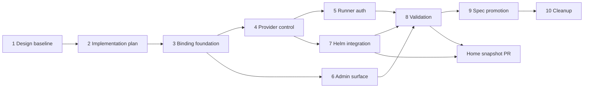

# Bound Runtime Control Connections Implementation Plan

## Feature Baseline

- Requirements: [runtimeauth-260723/REQ](../requirements/runtimeauth-260723-bound-runtime-control-connections.md)
- ADR: [runtimeauth-260723/ADR](../adr/runtimeauth-260723-bound-runtime-control-connections.md)
- Design: [runtimeauth-260723/DESIGN](runtimeauth-260723-bound-runtime-control-connections.md)
- Stack prefix: `Runtime control authentication`

The feature replaces deployment-created Provider and shared Runner secrets with a complete authentication-binding domain. Provider authentication supports Kubernetes ServiceAccount workload identity and Azents-issued tokens through one normalized, no-fallback verifier contract. Runtime Runners authenticate with Runtime-bound credentials. Platform Admins can inspect and manage Provider bindings without viewing credential plaintext.

## Delivery Shape

This work uses stacked PRs because schema, runtime protocol, Admin surfaces, deployment packaging, validation, and spec promotion have sequential dependencies and independent review boundaries.

1. **Design baseline** — confirmed Requirements, accepted ADR, and primary Design.
2. **Implementation plan** — this stack plan and validation matrix.
3. **Phase 1: Authentication binding foundation** — durable binding aggregate, ownership/lifecycle/audit model, migrations, repositories, services, and bootstrap declaration contract.
4. **Phase 2: Provider authentication and control** — explicit method dispatch, TokenReview, issued-token binding, connection authority/expiry, Provider clients, and Kubernetes Provider integration.
5. **Phase 3: Runtime Runner authentication** — Runtime-bound credentials, durable Runtime/generation validation, expiry/refresh, Provider injection, and Runner stream fencing.
6. **Phase 4: Admin product surface** — Admin APIs, schemas, generated clients, Admin Web inventory/detail/actions, and audit/health presentation.
7. **Phase 5: Helm integration** — projected ServiceAccount token, TokenReview RBAC, bootstrap binding declaration, obsolete Secret/bootstrap removal, and chart tests.
8. **Validation** — E2E, migration, fixture, security invariant, chart, and regression validation with recorded evidence.
9. **Spec promotion** — living specs, implemented dates, and generated documentation indexes.
10. **Cleanup** — remove this implementation plan and recovery-only scaffolding after the specs become authoritative.

Home deployment changes use a separate Home PR after the compatible immutable Azents snapshot exists.

## Phase Dependencies

## Phase 1: Authentication Binding Foundation

### Scope

- Add the durable Provider authentication-binding aggregate.
- Define method, lifecycle, ownership source, normalized subject, method configuration, optimistic version, health timestamps, and revocation metadata.
- Attach issued credentials and Provider connections to a binding.
- Add binding audit event types and safe projections.
- Extend trusted bootstrap declarations with a typed authentication binding and reconcile source ownership/conflicts.
- Generate forward-only Alembic revisions and update `db-schemas/rdb/revision`; do not modify executed migrations.

### Validation

- Repository/service unit tests for create, get, list, source ownership, uniqueness, optimistic mutation, revoke, and audit.
- Migration upgrade/downgrade tests and one-head validation.
- Bootstrap reconciliation tests for create, idempotency, source conflict, withdrawal, and stable `system-kubernetes` identity.

## Phase 2: Provider Authentication and Control

### Scope

- Add explicit authentication method metadata with no method inference or fallback.
- Implement normalized verifier composition.
- Resolve Azents-issued credentials through their durable binding.
- Implement Kubernetes TokenReview with exact audience, subject, binding, lifecycle, and evidence-expiry validation.
- Persist binding-backed Provider connections and enforce binding/credential/evidence validity on heartbeat and command authority.
- Update shared Provider clients and the Kubernetes Provider projected-token rotation loop.

### Validation

- Method dispatch and no-fallback tests.
- TokenReview authenticated/audience/subject/expiry failure matrix.
- Registration identity mismatch tests.
- Issued-token rotation/revocation regression tests.
- Connection expiry and binding-revocation authority tests.
- Kubernetes Provider reconnect-on-token-rotation tests.

## Phase 3: Runtime Runner Authentication

### Scope

- Derive a domain-separated Runner credential key from the existing credential-encryption root.
- Bind credentials to Runtime ID, desired generation, validity window, and non-secret credential identifier.
- Validate durable Runtime existence, current desired generation, and credential expiry before registration.
- Remove the shared Runtime Control token path.
- Refresh credentials before expiry through the Provider lifecycle/observe channel without changing logical Runtime identity.
- Keep Runner connection generation fencing independent from credential generation.
- Update Kubernetes and Docker Provider Runtime environments and Runner clients.

### Validation

- Signing, tamper, root mismatch, expiry, Runtime mismatch, and stale desired-generation tests.
- Stream expiry/refresh and reconnect tests.
- Provider environment contract tests proving the shared token is absent.
- Runner operation regression tests across reconnect and generation replacement.

## Phase 4: Admin Product Surface

### Scope

- Add Admin binding inventory/detail, create, rotate, revoke, and audit routes under Runtime Provider management.
- Enforce Platform Admin authorization, optimistic versions, bootstrap ownership restrictions, and one-time secret return behavior.
- Regenerate Python and TypeScript Admin clients from OpenAPI.
- Add an Authentication section to Runtime Provider detail UI with method, subject, owner, lifecycle, health, timestamps, and safe actions.
- Keep secret plaintext, verifiers, projected tokens, and encrypted values out of responses and logs.

### Validation

- API authorization, validation, conflict, one-time-secret, and redaction tests.
- Generated client drift checks.
- Admin Web component, interaction, loading, failure, and accessibility tests.
- TypeScript format, lint, typecheck, and build.

## Phase 5: Helm Integration

### Scope

- Remove Provider credential/bootstrap and shared Runner auth values, Secrets, volumes, Jobs, and RBAC.
- Add explicit projected Provider ServiceAccount token with fixed audience and rotation.
- Add Runtime Control TokenReview ClusterRole/Binding only when required.
- Render typed bootstrap authentication binding declarations.
- Preserve Runtime Control TLS, Provider workload RBAC, stable Provider ID, and no Secret-write permission for the long-running Provider.

### Validation

- Helm schema and lint.
- Render assertions for projected token, TokenReview RBAC, typed binding declaration, TLS, and obsolete Secret absence.
- Negative render tests for disabled Provider/RBAC combinations.

## Validation PR

### Primary E2E Matrix

| Scenario | Required result |
| --- | --- |
| Helm bootstrap creates `system-kubernetes` binding | Admin inventory shows one bootstrap-owned active Kubernetes SA binding |
| Valid projected token | Provider connects through the exact binding |
| Wrong audience, subject, binding, or method | Connection fails closed without fallback |
| Workspace/manual Provider enrollment | Token binds to an `azents_issued_token` binding and connects |
| Binding rotation | New evidence connects before old binding/credential loses authority |
| Binding revocation | Existing and new connection authority ends |
| Runner start | Runner connects through Runtime/generation-bound credential |
| Runner stale/expired/mismatched credential | Registration or retained authority fails closed |
| Admin actions | Inventory, health, audit, rotate, and revoke remain consistent and secret-safe |
| Secret-free chart | No Provider/shared Runner auth Secret is required or rendered |

### Fixture and Prerequisite Support

- PostgreSQL fixture must include the new binding schema and migration coverage.
- E2E requires a Kubernetes API with TokenReview and ServiceAccount projected-token support.
- Deterministic TokenReview service tests use injected clients; live TokenReview tests run only where the Kubernetes prerequisite exists.
- No real credential values enter fixtures, snapshots, logs, or evidence.

### Evidence

Record commands, environment, pass/fail/skip counts, migration head, rendered resource assertions, E2E binding IDs/methods without secret values, and strict Requirements/ADR/Design comparison.

### CI Policy

Deterministic authentication, migration, API, UI, and chart tests are required and cannot skip. Live Kubernetes tests may skip only when the job explicitly lacks the prerequisite. A present but rejected token, mismatched binding, or failed deployment must fail.

## Spec Impact Candidates

- `docs/azents/spec/domain/runtime-provider.md`
- `docs/azents/spec/flow/agent-runtime-control.md`
- Runtime Provider Admin API and UI specs if separated during implementation
- Helm packaging/deployment specs covering Runtime Control and Kubernetes Provider authentication

Run `/spec-review` in the spec-promotion phase.

## Rollout

1. Create the complete Azents PR stack before monitoring CI.
2. Rebase the full stack sequentially onto the latest `origin/main` using the stacked rebase workflow.
3. Verify ancestry and diff boundaries, then push rewritten branches only with `--force-with-lease`.
4. Resolve all local and GitHub CI failures across the stack.
5. Produce one immutable compatible Azents snapshot from the final stack result.
6. Update Home chart revision and all image tags/digests atomically.
7. Use ArgoCD prune-last ordering so new workloads become healthy before obsolete Secret resources are pruned.
8. Perform live-cluster writes only after explicit requester approval.

## Known Blockers and External Actions

- Home cannot safely deploy until the compatible immutable Azents snapshot is published.
- Live TokenReview/E2E requires an available Kubernetes test environment.
- GitHub merge remains blocked until the requester explicitly approves each merge.
- No new Infisical value is required.

## Cleanup

After validation and spec promotion, remove this plan and any recovery-only adapter or metadata bridge. The final sources of truth are the implemented Requirements/ADR/Design snapshot, living specs, migrations, code, generated clients, and chart/Home manifests.
