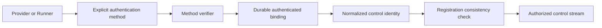
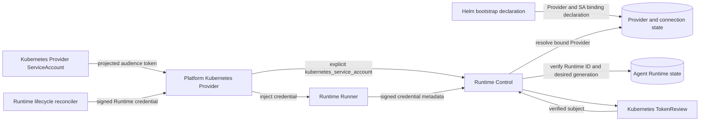

# runtimeauth-260723/DESIGN: Bound Runtime Control Connections

## Overview

This design implements the confirmed [Bound Runtime Control Connections Requirements](../requirements/runtimeauth-260723-bound-runtime-control-connections.md) (`runtimeauth-260723/REQ`) according to the accepted [Bound Runtime Control Connections ADR](../adr/runtimeauth-260723-bound-runtime-control-connections.md) (`runtimeauth-260723/ADR`).

The current delivery removes the authentication Secret dependencies blocking the Home deployment and completes the durable, extensible authentication-binding model. Authenticated bindings, not registration payloads, determine Provider and Runner identity.

## Ideal Goal

The final authentication architecture treats method selection, evidence verification, durable identity binding, lifecycle, revocation, audit, and Admin management as one extensible domain.

The normalized result contains the authenticated subject, method, bound resource identity, method-specific lifecycle reference, and authorization validity. Adding another method does not change Provider or Runtime identity and never introduces method fallback.

The delivered model includes:

- first-class durable Provider authentication bindings;
- Workspace and Platform ownership rules for binding management;
- Admin API and UI for lifecycle, audit, revocation, and health;
- reusable authentication method registration;
- Kubernetes ServiceAccount and Azents-issued token implementations with an extension contract for additional workload identities;
- explicit long-stream token expiry and reauthentication behavior; and
- bootstrap reconciliation into the same durable binding aggregate used by Admin management.

## Implementation Scope

The implementation includes:

1. explicit `azents_issued_token` and `kubernetes_service_account` Provider authentication methods;
2. a first-class durable Provider authentication-binding aggregate with ownership, lifecycle, audit, health, and revocation;
3. Kubernetes TokenReview and bootstrap reconciliation of a ServiceAccount binding for the Helm Platform Provider;
4. Azents-issued credential lifecycle attached to an issued-token binding;
5. binding-backed Provider connection persistence and expiry;
6. Admin API/UI management and generated clients;
7. Runtime-bound signed Runner credentials validated against durable Runtime desired generation;
8. removal of active Provider credential bootstrap and shared Runner token configuration;
9. coordinated Helm and Home rollout with immutable chart and image pins; and
10. E2E validation and living-spec promotion.

Additional workload identity implementations and cross-cluster trust policy are outside this delivery but use the completed method and binding contracts.

## Recovery Architecture

## Provider Authentication

### Explicit method transport

Provider gRPC metadata carries an explicit authentication method and bearer evidence. Supported recovery values are:

- `azents_issued_token`
- `kubernetes_service_account`

The server selects exactly one verifier. Unknown methods and verification failures are rejected without fallback.

The shared runtime-control client library exposes method-specific authentication configuration rather than treating every bearer value as a Provider credential. Existing Provider enrollment callers use `azents_issued_token`; the Kubernetes Provider uses `kubernetes_service_account`.

### Kubernetes projected token

The Kubernetes Provider Deployment mounts an explicit projected ServiceAccount token with a Runtime Control-specific audience and bounded expiration. The Provider reads the token from the projected file and watches the file for rotation, reconnecting when the value changes.

The default auto-mounted Kubernetes API token is not the authentication contract. An explicit projected volume makes audience, path, and rotation behavior reviewable.

### TokenReview verification

Runtime Control loads in-cluster Kubernetes configuration and submits the presented token to the TokenReview API with the required audience. Verification succeeds only when:

- TokenReview reports `authenticated: true`;
- the required audience is present;
- the username has exact `system:serviceaccount:<namespace>:<name>` form; and
- one active bootstrap-owned Provider binding matches that exact subject.

Runtime Control's ServiceAccount receives only `create` on `authentication.k8s.io/tokenreviews`. The Provider ServiceAccount keeps only workload Pod/PVC and leader Lease permissions.

### Durable binding representation

The Helm bootstrap declaration includes a typed authentication binding containing:

- method: `kubernetes_service_account`;
- normalized ServiceAccount subject;
- namespace;
- ServiceAccount name;
- audience; and
- bootstrap ownership identity.

Bootstrap reconciliation creates or reconciles the binding in the durable Provider authentication-binding aggregate. Source ownership and declaration identity prevent a conflicting bootstrap source or Admin operation from silently replacing the subject. Authentication queries the binding aggregate by method, normalized subject, audience, lifecycle, and Provider state and requires exactly one result.

Registration claims are checked against the resolved Provider and cannot select another Provider.

### Existing issued token

The existing verifier-backed Provider credential service remains unchanged as the method implementation for `azents_issued_token`. It resolves the credential to one durable Provider and enforces credential state and expiration.

## Provider Authentication Binding Domain

`runtime_provider_auth_bindings` stores:

- stable binding ID;
- Provider ID;
- authentication method;
- normalized subject;
- lifecycle state;
- ownership source and source reference;
- method-specific non-secret configuration;
- version for optimistic mutation;
- last authentication and connection health timestamps;
- revocation metadata; and
- creation/update timestamps.

Active subject uniqueness is method-scoped. One Provider may own multiple bindings for rotation, but one connection authenticates through exactly one binding.

`runtime_provider_credentials` references an `azents_issued_token` binding. Enrollment grants resolve the target binding before issuing a credential. Kubernetes bindings have no credential row.

Binding audit events record creation, update, rotation, authentication, revocation, conflict, and connection lifecycle using metadata only.

## Provider Connection Persistence

Forward database migrations add the binding aggregate and change Provider connection persistence so authentication is not synonymous with an enrollment credential.

The connection projection stores:

- `auth_binding_id`;
- `authentication_method`;
- `authenticated_subject`;
- authentication evidence expiry;
- nullable `credential_id`;
- Provider ID, connection ID, generation, state, protocol information, and timestamps.

For `azents_issued_token`, `credential_id` is required and heartbeat/command authority continues to require an active unexpired credential.

For `kubernetes_service_account`, `credential_id` is null. Heartbeat and command authority require the same active binding, Provider, subject, and unexpired workload evidence. No synthetic grant or credential row is created.

Existing migration files are not modified. A new Alembic revision updates the schema and `db-schemas/rdb/revision`.

## Admin API and UI

Admin routes under the Runtime Provider resource expose:

- binding inventory and detail;
- method, normalized subject, owner, lifecycle, health, and timestamps;
- creation of Admin-owned bindings where the method permits it;
- issued-token enrollment and rotation against one binding;
- revocation with optimistic version checks; and
- binding audit history.

Responses never expose bearer tokens, verifiers, projected token content, or encrypted secret plaintext. One-time issued enrollment and credential values retain their existing one-time-return contract.

The Runtime Provider detail UI adds an Authentication section with status-oriented binding rows, method and subject labels, ownership, last authentication, active connection state, rotation/revocation actions, and bounded failure messages. Bootstrap-owned fields are read-only unless the source is withdrawn.

## Runtime Runner Authentication

### Signed credential

A new Runtime Runner credential primitive derives a domain-separated HMAC key from the existing credential-encryption root. No new operator secret is introduced.

The signed credential contains:

- format version;
- logical Runtime ID;
- durable desired generation; and
- an integrity signature.

The plaintext token is delivered only in the Provider lifecycle command and the Runtime container environment. It is never persisted or logged. The deterministic credential identifier recorded for diagnostics is a one-way fingerprint, not the token.

The token remains valid only while the durable Runtime has the same desired generation and the token validity window has not elapsed. Lifecycle changes that advance desired generation invalidate the previous token. Long-running Runners receive a refreshed token through the controlled Provider lifecycle/observe channel before expiry and reconnect without changing logical Runtime identity.

### Connection validation

The Runner sends the signed credential as bearer metadata when opening `ConnectRunner`. Runtime Control verifies it before reading registration authority.

The server then:

1. verifies the signature and parses the bound Runtime ID and desired generation;
2. loads the durable Agent Runtime;
3. rejects an absent Runtime or desired-generation mismatch;
4. rejects a registration payload claiming a different Runtime ID; and
5. registers a connection using the authenticated Runtime ID and a non-secret credential fingerprint.

Coordination-store Runner connection generation remains separate and continues to fence replaced physical Runner streams.

### Provider and Runner changes

The Provider command keeps one Runner credential field and removes the shared control-token field. Kubernetes and Docker Providers inject the credential as `AZ_RUNTIME_RUNNER_AUTH_TOKEN`. The Runner no longer reads `AZ_RUNTIME_CONTROL_AUTH_TOKEN` or requires a payload-supplied `AZ_RUNTIME_RUNNER_AUTH_CREDENTIAL_ID`.

## Helm Changes

The Azents chart:

- removes `server.runtimeControl.auth.*` values and Secret injection;
- removes `runtimeProviderKubernetes.credential.*` values;
- deletes the credential bootstrap Job, staging Secret, bootstrap ServiceAccount, Role, and RoleBinding;
- removes the Provider credential Secret volume and environment variable;
- adds the projected Provider ServiceAccount token volume, audience, and token path;
- adds Runtime Control TokenReview ClusterRole and ClusterRoleBinding;
- renders the bootstrap authentication subject metadata;
- preserves mandatory Runtime Control TLS and Provider workload RBAC; and
- keeps the opaque `system-kubernetes` Provider ID.

## Home Recovery Rollout

The Azents PR is merged and its immutable compatible snapshot is produced before Home references change.

The Home recovery PR updates the chart revision and all server, Provider, Runner, Web, and Admin Web image tags/digests atomically. It removes active Helm references to the Runtime Control auth Secret and Provider credential/bootstrap Secret.

Home also removes the obsolete ExternalSecret and PushSecret resources. The ArgoCD Application enables prune-last behavior so replacement workloads using the new authentication path must become healthy before obsolete resources are pruned.

No Infisical values are added. Existing stale values, if any, are not part of the deployment contract and may be deleted operationally after recovery.

No live-cluster write occurs without explicit requester approval.

## Failure Handling

- Missing or unknown authentication method: `UNAUTHENTICATED`.
- TokenReview failure, rejected token, audience mismatch, malformed subject, or missing/ambiguous binding: `UNAUTHENTICATED`.
- Authenticated Provider whose registration claims conflict with its binding: `PERMISSION_DENIED`.
- Missing, malformed, or tampered Runner credential: `UNAUTHENTICATED`.
- Runner credential for an absent or stale desired generation: `UNAUTHENTICATED`.
- Authenticated Runner whose registration claims another Runtime: `PERMISSION_DENIED`.

Errors remain bounded and never include raw tokens.

## Extension Contract

Additional methods implement one verifier interface that accepts only method-specific evidence and returns a normalized binding authentication result with binding ID, Provider ID, subject, evidence expiry, and method-safe audit metadata.

Method registration is explicit at Runtime Control startup. Unknown or unavailable methods fail closed. Additional methods may add typed configuration records or validators, but they cannot change Provider registration authority, connection persistence semantics, or fallback behavior.

## Test Strategy

### Primary verification matrix

| Scenario | Expected result |
| --- | --- |
| Trusted Helm Kubernetes Provider with valid projected token | Resolves the bootstrap binding and connects as `system-kubernetes` |
| Valid token with forged Provider registration ID | Rejected before Provider registration |
| Invalid Kubernetes token, audience, subject, or ambiguous binding | Rejected without issued-token fallback |
| Workspace/manual Provider with active Azents-issued token | Existing enrollment method connects successfully |
| Revoked or expired issued token | Rejected and cannot retain command authority |
| Admin creates, rotates, or revokes a binding | Inventory, audit, connection authority, and optimistic version update consistently |
| Conflicting bootstrap/Admin subject ownership | Reconciliation reports conflict and preserves the existing binding |
| Runner with valid signed credential and current desired generation | Connects as the bound Runtime |
| Runner token replayed for another Runtime, expired, or stale desired generation | Rejected before registration or stream authority expires |
| Helm render with Kubernetes Provider enabled | Contains projected token and TokenReview RBAC; contains no Provider/shared Runner Secret dependency |
| Home render with compatible snapshot | Contains no obsolete auth Secret references and preserves TLS |

### E2E plan

The primary E2E verification starts an Azents environment with Kubernetes Provider bootstrap, verifies the Admin binding inventory, connects through workload identity, creates one logical Runtime, observes the Runner connection, and executes one Runner operation. Negative E2E cases present a mismatched Provider or Runner identity, revoke a binding, and verify fail-closed behavior.

If CI cannot provide a Kubernetes TokenReview API, deterministic server tests use an injected TokenReview client and the chart render tests verify real RBAC and projection manifests. Live TokenReview validation is optional and must skip only when the Kubernetes prerequisite is explicitly unavailable; an authentication mismatch must fail rather than skip.

### Unit and integration coverage

- method selection and no-fallback dispatch;
- Kubernetes TokenReview response validation and subject binding resolution;
- issued-token regression coverage;
- Provider connection persistence for both methods;
- binding creation, bootstrap reconciliation, ownership conflict, optimistic mutation, rotation, revocation, audit, and Admin projection;
- Runner credential signing, tamper rejection, Runtime binding, and stale-generation rejection;
- evidence and Runner stream expiry;
- Kubernetes and Docker Provider Runner environment changes;
- Runtime Control startup without the old shared token;
- Helm schema, lint, and render tests;
- Home pre-commit and Kustomize rendering.

### Fixtures and evidence

Tests use synthetic tokens and injected verifier responses; no live credential value is committed or printed. Evidence records only method, resource ID, expected result, and bounded error code. Snapshot image digests and rendered resource names are recorded in the Home PR after Azents CI publishes the compatible build.

### CI policy

All affected Python subprojects run Ruff, Pyright, and focused Pytest suites. OpenAPI clients are regenerated and TypeScript format, lint, typecheck, and build checks are required. Backend migration tests and Alembic head validation are required. Helm lint/render tests and Home pre-commit/Kustomize validation are required. Optional live tests may skip only for explicitly absent external prerequisites; all deterministic authentication, Admin surface, and render tests are required.
