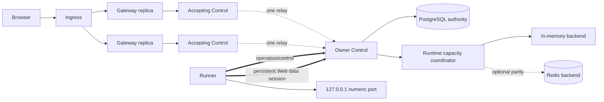

# Heavy-Workload Runtime Web Services Design

- Snapshot: `runtimeweb-260914`
- Requirements: [runtimeweb-260914/REQ](../requirements/runtimeweb-260914-heavy-workload-services.md)
- Decisions: [runtimeweb-260914/ADR](../adr/runtimeweb-260914-heavy-workload-services.md)
- Document reference: `runtimeweb-260914/DESIGN`

## Current Behavior and Requirement Gaps

The current Runtime Web implementation binds one browser HTTP, SSE, or WebSocket
exchange to one Gateway Proxy RPC, one PostgreSQL tunnel route, one Control admission
lease, one Gateway admission lease, one Runner open intent, one Runner ConnectWeb
RPC, and, when the Runner reaches a non-owner Control, one request-scoped relay RPC.
The Runner also creates a gRPC channel and loopback `aiohttp.ClientSession` for every
exchange.

Application data is encoded into fixed 64 KiB typed frames. Gateway, Owner Control,
Runner, and relay queues each hold four maximum-sized frames. Queue blocking gives
hop-local backpressure, but there is no receiver-issued byte credit, aggregate
session window, or fair writer scheduler. The configured Gateway frame size does not
control the hard-coded request, response, and WebSocket chunk paths.

The current path preserves strong security properties: every exchange carries the
exact endpoint, cycle, revision, close barrier, Runtime, desired generation, Runner
generation, numeric port, nonce, and deadlines; PostgreSQL validates current
authority; Runner connects only to numeric loopback; trusted Gateway and relay RPCs
use role-specific mTLS; application bytes are process-local and non-persistent; and
transport ambiguity terminates work without unsafe replay.

The gaps against [runtimeweb-260914/REQ](../requirements/runtimeweb-260914-heavy-workload-services.md)
are:

- request setup, route state, channel creation, and loopback session creation scale
  linearly with asset count;
- a 1 GiB body requires 16,384 data frames;
- long-lived exchanges create per-stream periodic database work;
- HTTP and SSE inherit a ten-minute transport window;
- endpoint, user, and Agent limits are the current capacity keys instead of Runtime;
- Gateway HPA observes CPU only, readiness does not validate dependencies, and drain
  is not explicit;
- transport pressure, bytes, time to first byte, flow-control stalls, relay use,
  capacity backend state, and close reasons are not measured; and
- functional E2E proves a sequential response slightly above 64 MiB but not the
  confirmed asset fan-out, upload, one-hour, mixed-load, scale, or fault envelope.

## Requirements and Decision Traceability

| Requirement | Design mechanisms |
| --- | --- |
| REQ-1 Asset-heavy HTTP | M1 persistent sessions, M4 pooled logical streams, M5 fair scheduling, M12 load evidence |
| REQ-2 Large streaming | M3 typed opaque DATA, M5 hierarchical credit, M6 balanced profile, M12 1 GiB evidence |
| REQ-3 Bounded buffering | M5 stream/session credit, M7 Owner capacity coordinator, M9 hard process ceilings |
| REQ-4 Mixed fairness | M5 control reserve and weighted fair scheduler, M9 pressure metrics, M12 mixed-load gate |
| REQ-5 Long-lived streams | M3 SSE/WebSocket semantics, M8 deadlines and drain, M12 one-hour evidence |
| REQ-6 Independent authority | M2 Owner epoch, M3 per-stream state, M10 retained approval and generation authority |
| REQ-7 Isolation and destination safety | M1 Control-routed reverse data plane, M10 Gateway and Runner policy, M11 network boundaries |
| REQ-8 Fail-closed cleanup | M2 lease fencing, M8 no-resume lifecycle, M10 revocation, M12 fault evidence |
| REQ-9 Horizontal Gateway | M1 Gateway session pool, M2 owner routing, M9 HPA/readiness/drain |
| REQ-10 Runtime limits | M7 Runtime capacity coordinator, M5 grants and windows, M9 hard local ceilings |
| REQ-11 Overload and recovery | M7 Redis/in-memory parity, M9 hard fallback, M8 bounded lifecycle |
| REQ-12 Observability | M9 OpenMetrics and diagnostics, M12 machine-readable evidence |
| REQ-13 Clean cutover | M13 fingerprint-fenced maintenance replacement, M14 authoritative removal |
| REQ-14 Complete evidence | M12 E2E/load/fault matrix, M14 absence verification |

## Architecture Overview



The public Gateway remains the browser policy and authentication boundary. Runtime
Control remains the trusted routing, Owner lease, generation, and multiplexed data
boundary. The Runner remains the final loopback destination boundary. PostgreSQL
retains durable product authority but does not store logical-stream data or Runtime
capacity counters. Capacity is ephemeral Owner-scoped operational state with
interchangeable in-memory and Redis implementations.

## Ownership and Source-of-Truth Boundaries

### Durable product authority

PostgreSQL continues to own:

- stable Session-and-port endpoints;
- exposure requests, current cycles, approval deadlines, revision and close barrier;
- browser identity hashes, authentication configuration, broker bindings, and
  tickets;
- Runtime desired generation, Provider-observed generation, Runner generation and
  current readiness evidence; and
- the one current Runtime Web Owner-session route lease for a Runtime generation.

No durable record grants application access without the existing Session, identity,
cycle, close, and generation checks.

### Owner Control authority

One Owner Control boot owns the live Web data session for the exact `(runtime_id,
desired_generation, runner_generation)` tuple. It owns:

- the process-local Runner session object;
- current logical-stream registry and tombstones;
- the fair schedulers and hop windows connected to that Runner session;
- Runtime soft-capacity decisions and current usage publication;
- coalesced long-lived authority watchers; and
- graceful refusal, drain, and session termination.

Owner process state is not recoverable application state. Owner loss terminates its
streams and the replacement starts a new epoch.

### Gateway ownership

Each Gateway replica owns its browser sockets, policy state, hard local buffers,
Control session pool, per-request identity/access watcher attachment, and response
streaming. Gateway replicas do not own shared Runtime capacity, Owner selection, or
application outcome.

### Runner ownership

The Runner owns one current-generation persistent Web session, one pooled loopback
HTTP client session and connector, exact loopback sockets, request/response tasks,
and Runner-local hard buffers. It never owns approval, browser identity, shared
capacity configuration, or an externally reachable application listener.

## Persistence and Data Model

### Retained tables

`runtime_web_endpoints`, `runtime_web_requests`, `runtime_web_cycles`, authentication
configuration, identities, bindings, tickets, operation receipts, and request-policy
quota scopes remain. Their product semantics do not change.

### New Owner-session route

A forward migration creates `runtime_web_session_routes` with one current row per
Runtime. The row contains only metadata required for exact ownership:

- `runtime_id` primary key;
- `desired_generation` and `runner_generation`;
- `owner_replica_id`, random `owner_boot_id`, and configured trusted owner address;
- random `session_lease_id` and monotonic `lease_generation`;
- random session join nonce hash;
- exact replacement protocol fingerprint;
- `lease_expires_at`, `created_at`, and `updated_at`; and
- a bounded `draining_at` marker used only during D7 planned drain.

Acquisition locks the Runtime row and current endpoint/Runtime generation evidence,
rejects a live incompatible Owner, and writes the new epoch. Renewal requires exact
Runtime, generations, Owner boot, lease ID, lease generation, fingerprint, and
non-expired Runner evidence. Release uses the same exact tuple. The row is deleted
when its session ends; no history is retained.

### Removed transport tables

The clean-cutover migration drops:

- `runtime_web_tunnel_routes`;
- `runtime_web_admission_leases`; and
- `runtime_web_gateway_admission_leases`.

The maintenance preflight requires these tables to contain no live rows before the
destructive migration. Their old application-tunnel, endpoint/user/Agent admission,
and route-lease semantics have no compatibility reader in the replacement release.

### Ephemeral capacity data

`RuntimeWebCapacityCoordinator` stores, per Owner session epoch:

- active and pending stream counts by HTTP, SSE, and WebSocket;
- buffer grants by participant boot and direction;
- outstanding inbound and outbound bandwidth grants;
- current hard and soft profile;
- degraded backend and convergence state; and
- aggregate content-free counters needed for metrics.

The in-memory backend uses one Owner-local locked state machine. The Redis backend
uses the same typed commands and revision rules, bounded TTLs, and a backend epoch.
Redis keys contain internal Runtime/session identifiers and aggregates only, never
application data, URL material, headers, cookies, credentials, or raw errors.

The Owner always retains its live local stream registry and outstanding D4 credit.
On Redis loss it reconstructs the backend view from that registry and continues
under local hard limits. On Redis recovery it publishes a new backend epoch and
current aggregate usage; it never trusts stale keys as active work.

## Trusted Protocol Surfaces

The current request-scoped protobuf services and messages are deleted. The
replacement protocol defines three persistent bidirectional RPCs under the existing
Runtime Control protobuf package:

- `RuntimeWebGatewaySession.Connect`: Gateway role to accepting Control;
- `RuntimeWebControlSession.Relay`: Control role to exact Owner Control; and
- `RuntimeRunnerWebSession.Connect`: authenticated Runner to its offered Owner.

Gateway and Control sessions use the existing dedicated trusted listener and
role-specific mTLS. Runner Web sessions use the existing Runner-authenticated Control
listener and exact Runtime credential. Local development may retain its explicit
insecure listener configuration; deployed insecure fallback remains forbidden.

The Runner receives an Owner-specific Web session offer through its ordinary
operation connection after that Control boot acquires the Owner lease. The offer
contains a direct Runner-reachable Control pod address on the existing
Runner-authenticated port, the stable TLS server name used by the current Control
certificate, Owner boot and lease tuple, nonce, fingerprint, and handshake deadline.
The connection address and TLS name are separate so direct pod routing does not
require a per-pod certificate identity. Kubernetes execution policy permits egress
only to matching Runtime Control pods on the existing Runner Control port; it does
not expose the trusted Gateway/relay port to Runtime pods. This keeps the Runner Web
session logically and physically attached to the Owner. A Gateway may reach another
Control and consume one Control-to-Control relay, but application data never
traverses more than that one relay.

Gateway replicas maintain a small bounded pool of persistent sessions to the Control
Service. Accepting Controls maintain at most one persistent relay session per remote
Owner epoch and multiplex all local Gateway streams for that Owner over it. A stale
relay pool entry is keyed by and rejected against Owner boot, session lease ID,
lease generation, and fingerprint.

## Protocol Fingerprint and Envelopes

Build tooling generates one SHA-256 protocol fingerprint from the canonical protobuf
descriptor, typed state-machine schema, mandatory numeric constants, and capability
name. The replacement capability is unversioned. Peers compare exact fingerprint
equality; they do not advertise or negotiate a supported-version list.

A session envelope contains exactly one typed frame plus:

- protocol fingerprint;
- Owner-session epoch where applicable;
- sender boot identity;
- stream ID when stream-scoped;
- direction and monotonic frame sequence when data-scoped; and
- bounded correlation data for metrics without application content.

Session frames are `HELLO`, `SESSION_ACCEPTED`, `HEARTBEAT`, `HEARTBEAT_ACK`,
`GOAWAY`, and `SESSION_ERROR`.

Stream frames are `OPEN`, `ACCEPT`, `REJECT`, `REQUEST_HEAD`, `RESPONSE_HEAD`,
`DATA`, `WINDOW_UPDATE`, `DIRECTION_END`, `WEBSOCKET`, `CANCEL`, `RESET`, and
`STREAM_END`.

Unknown frame kinds, oversized envelopes, fingerprint mismatch, reused stream IDs,
invalid epoch, or session-level sequence ambiguity close the session. A frame that is
invalid but exactly attributable to one stream resets that stream.

## Session Lifecycle

The Runner Web session state machine is:

```text
DISCONNECTED
  -> CONNECTING
  -> HELLO_SENT
  -> ACTIVE
  -> GOAWAY_SENT | GOAWAY_RECEIVED
  -> DRAINING
  -> CLOSED
```

The Owner accepts the session only when the ordinary Runner connection, credential,
Runtime and both generations, Owner lease, nonce, fingerprint, and ten-second
registration deadline are current. A second session for the same epoch is rejected.

While active, both peers send heartbeat every five seconds. Two missed intervals or
an observed RPC failure closes the session within ten seconds. Heartbeat uses the
reserved control lane and is independent of application traffic and application idle
state.

`GOAWAY` carries the last accepted stream ID, reason, and drain deadline. New stream
IDs above the boundary are rejected. Planned Owner drain renews the exact lease with
`draining_at` while existing work completes, then releases it before session close.
An unexpected close releases process-local state and lets the lease expire if an
exact release cannot be completed.

## Logical Stream Lifecycle

The per-stream state machine is:

```text
IDLE
  -> OPEN_SENT
  -> ACCEPTED | REJECTED
  -> REQUEST_OPEN | REQUEST_ENDED
  -> RESPONSE_HEAD
  -> RESPONSE_OPEN | RESPONSE_ENDED
  -> STREAM_ENDED

Any attributable active state -> RESET
```

`OPEN` carries the complete immutable authority snapshot:

- tunnel correlation ID and non-reusable stream ID;
- endpoint, cycle, endpoint authority revision, and close barrier;
- user/authentication identity references needed for Gateway watchers, without the
  identity secret;
- Runtime, desired generation, Runner generation, and numeric port;
- HTTP or WebSocket protocol, method, normalized origin-form target, and deadlines;
- normalized request headers within the existing policy boundary; and
- Gateway boot and Control-session correlation.

The Gateway completes exact public authority checks before sending `OPEN`. The Owner
performs one exact PostgreSQL validation of current endpoint/cycle/close/Runtime
state, then applies D5 capacity. `ACCEPT` returns the effective frame size, directional
credit, and terminal deadline. The Gateway does not consume the browser body beyond
a small hard pre-admission parser allowance before acceptance.

Stream IDs are unsigned 64-bit monotonic values scoped to the peer session. They are
never reused. Bounded tombstones retain the terminal state until every earlier frame
sequence is impossible or the session ends.

## HTTP, SSE, and WebSocket Translation

### HTTP

Gateway retains current host, target, origin, CORS, cookie, reserved-header,
hop-by-hop, redirect, security-header, and error-page behavior. It sends normalized
ordered header pairs and streams browser body bytes only after `ACCEPT`.

Runner owns one `aiohttp.ClientSession` per accepted Runner generation with
`auto_decompress=False`, no implicit `Accept-Encoding` or `User-Agent`, a connector
bounded by Runner hard stream capacity, and redirect following disabled. Every
request uses `http://127.0.0.1:<port><origin-form-target>`. Connections may be reused
only within the same Runner generation and destination policy.

Response heads return before response body data. Gateway never follows an
application redirect and applies the existing loopback redirect, cookie, CORS, and
security response rules.

### SSE

SSE is detected from the normalized response content type. It uses ordinary response
DATA and credit but receives long-lived lifecycle classification. It cannot use the
finite-HTTP replaced-cycle completion allowance. No event cursor, replay buffer, or
automatic reconnect is created.

### WebSocket

Gateway and Runner continue to terminate WebSocket semantics rather than tunnel raw
TCP. Compression and autoping remain disabled. Typed frames preserve text, binary,
fragment continuation, ping, pong, and close. Text is validated as UTF-8 and an
assembled application message is limited to 1 MiB. Gateway parser and trusted
transport use the same limit.

## Flow Control and Fair Scheduling

Credit uses absolute monotonic consumed-byte totals, not additive deltas. For each
direction, the sender may send at most:

```text
initial_window + peer_consumed_total - locally_sent_total
```

The same calculation applies to stream and session windows. A DATA frame requires
positive credit in both. The receiver publishes consumed totals after half-window
consumption or ten milliseconds with pending credit. Duplicate totals are harmless
only when exactly equal; decreasing, overflowing, cross-epoch, or post-terminal
values are protocol violations.

Mandatory profile:

- 256 KiB DATA frames;
- optional 512 KiB DATA when every configured hop advertises it;
- 1 MiB envelope maximum;
- 1 MiB directional stream windows;
- 8 MiB directional hop-session windows;
- 2 MiB combined outstanding bytes per full-duplex stream;
- 16 MiB combined outstanding bytes per hop session; and
- 256 KiB session control reserve outside application windows.

Each writer has three bounded queues:

1. control: cancel, reset, heartbeat, credit, generation invalidation, and GOAWAY;
2. latency: heads, ends, bounded SSE events, and WebSocket control frames; and
3. data: ordinary request, response, and WebSocket application bytes.

Control is serviced first but has an independent rate and byte ceiling. Latency is
serviced next within a bounded quantum. Data uses weighted deficit round-robin over
active stream IDs. A stream becomes schedulable only when it has both stream and
session credit. Queue admission never exceeds the process hard envelope or an Owner
buffer grant.

## Runtime Capacity Coordination

The installation supplies one Runtime capacity profile that is applied independently
to every Runtime. Enabling Runtime Web requires explicit positive values for:

- total active logical streams;
- active SSE and active WebSocket subsets;
- pending opens;
- Runtime soft buffered bytes, with the reference profile fixed at 64 MiB;
- inbound and outbound bytes per second; and
- bounded burst bytes.

The chart does not invent universal bandwidth or concurrency defaults without load
evidence. E2E supplies a checked reference profile that admits the confirmed
concurrency-64 asset workload and separately supplies low limits for deterministic
overload tests.

The Owner calls the backend-neutral coordinator for open admission, release, buffer
grant, bandwidth grant, snapshot, backend reset, and current-usage publication.
Redis and in-memory implementations share typed inputs, results, revision rules, and
one parametrized conformance suite.

Redis loss does not change the session or stream epoch. The Owner switches to its
in-memory state initialized from the live registry and credit accounting, records a
degraded metric, and continues. Redis recovery creates a new backend epoch, replaces
stale ephemeral keys, publishes current usage, and converges new soft admission.
Existing streams are not killed. Temporary aggregate skew is accepted, while local
hard limits remain exact.

## Authority Revalidation and Database Load

New opens perform exact Gateway and Owner database validation. Long-lived validation
is coalesced without weakening the ten-second boundary:

- Gateway groups watchers by identity, authentication Session, user, and target
  Session-access tuple and refreshes each tuple at most once per five-second period;
- Owner groups watchers by endpoint, cycle, revision, close barrier, Runtime, desired
  generation, and Runner generation and refreshes each tuple at most once per
  five-second period; and
- the Owner-session route lease is renewed once per Runtime session, not once per
  logical stream.

Invalidation events close affected streams immediately. Five-second polling is the
fallback. Failures to query durable authority fail new opens and cancel attached
long-lived streams within the existing ten-second bound. Capacity backend failure is
not treated as durable-authority failure.

Finite HTTP that already has a response classification may retain the existing
replaced-cycle completion allowance only while close barrier, generations, transport
deadline, and explicit-close checks remain valid. SSE and WebSocket never receive
that allowance.

## Security and Permissions

Every browser exchange starts at the Gateway's existing exact endpoint-host,
identity-cookie, authentication Session, user, target Session access, cycle, close,
and Runtime-generation checks. Persistent peer authentication is not browser
authority and cannot be reused as one. The full immutable stream authority is
validated again by the Owner before loopback traffic.

Gateway-to-Control and Control-to-Control sessions stay on the dedicated trusted
listener with separate mTLS roles. A Gateway certificate cannot establish a relay,
and a Control certificate cannot originate a public Gateway session. Runner Web
sessions use the existing Runner-authenticated listener, Runtime credential, desired
generation, and Runner generation. The Owner offer binds the direct connection to
the exact Owner boot, lease, nonce, and TLS server name.

NetworkPolicy continues to deny Runtime ingress. Runner egress permits only DNS,
the existing authenticated Runtime Control port on matching Control pods, and the
Runtime's separately approved execution-policy destinations. The trusted Gateway and
relay port is not added to Runtime egress.

Gateway strips platform credentials and reserved cookies before `OPEN`. Ordered
application headers remain bounded and normalized. Control and Runner never receive
the Runtime Web identity secret, Main Web credentials, broker tickets, or storage
credentials. Runner repeats origin-form and numeric-loopback validation before each
socket operation and never follows redirects.

Application body, path, query, cookie, authorization, WebSocket payload, and raw
upstream error values are absent from PostgreSQL, Redis, Session events, Chat, audit
history, traces, metric labels, and ordinary logs. Protocol errors expose only a
bounded reason and non-secret stream/session correlation.

## Failure, Retry, and Recovery

- Browser disconnect: cancel the exact stream, stop loopback I/O, release credit and
  capacity, and never infer an application outcome.
- Stream protocol violation: reset the exact stream when attribution is unambiguous.
- Session framing, fingerprint, epoch, or credit ambiguity: close the whole session.
- Owner, relay, or Runner session loss: terminate attached streams without migration
  or replay; a new browser request may use the replacement epoch.
- Desired or Runner generation replacement: reject new old-generation opens and
  immediately cancel old-generation streams.
- Explicit close, approval expiry, or identity/access revocation: cancel affected
  streams within ten seconds.
- PostgreSQL durable-authority outage: fail new opens and bounded-close long-lived
  work whose authority cannot be refreshed.
- Redis outage: continue through the in-memory capacity implementation and report
  degraded soft accounting.
- Runtime application unreachable: return the existing bounded application
  unavailable result without changing approval.
- Local hard resource exhaustion: reject before body admission or apply backpressure;
  do not wait for HPA to preserve safety.

The Gateway never automatically retries an admitted exchange on another Control,
Owner, session, or protocol. Safe browser behavior may issue its own new request,
which receives fresh authority and capacity checks.

## Drain and Deadlines

Registration and open acceptance each have a ten-second deadline. Finite HTTP has a
default 30-minute transport deadline configurable downward and bounded by approval
expiry. SSE and WebSocket have no separate application-idle deadline and remain
bounded by approval expiry, session health, authority, and drain.

Gateway and Owner drain make readiness false before refusing new streams. Finite HTTP
receives at most 120 seconds to complete. SSE and WebSocket receive five seconds for
graceful closure. Remaining work is reset. Kubernetes termination grace is 150
seconds.

Owner handoff is not overlapping. After the old Owner releases its lease, the Runner
establishes a new epoch. New requests during the bounded gap receive content-free
unavailability and are not replayed.

## Gateway Scaling, Probes, and Ingress

Gateway uses a bounded persistent Control session pool. Pool size is process
configuration and does not alter Runtime capacity. Failed sessions reconnect with
bounded jittered backoff and do not resume active stream IDs.

HPA v2 uses CPU and memory by default. When a compatible custom-metrics adapter is
configured, it additionally targets `runtime_web_gateway_pressure=0.7`. Pressure is
the maximum of active local exchange, local application buffer, scheduler wait,
event-loop lag, and RSS ratios. Runtime soft quota rejection is excluded.

Gateway readiness requires valid configuration, no maintenance/drain, reachable
PostgreSQL durable authority, at least one exact-fingerprint Control, and acceptable
local hard pressure. Redis is not a readiness input. Liveness checks process and
event-loop progress only. Control exposes Runtime Web sub-readiness separately from
general Runtime Control readiness.

Ingress validation covers wildcard routing, HTTPS and secure cookies, WebSocket
upgrade, SSE streaming, disabled buffering where required, one-GiB request support,
and timeouts beyond the approved long-lived path. Operator-supplied Ingress remains
supported only when it satisfies the same declared contract.

## Observability

Gateway and Control expose internal OpenMetrics endpoints on a non-public port.
Runner records the same typed counters and sends bounded aggregate snapshots through
the operation/control path for Control export; Runtime application content and raw
errors never enter snapshots.

Metrics cover session and stream counts, protocol/path/direction, open outcomes,
setup phases, TTFB, duration, bytes, goodput, frames, credit, stalls, scheduler wait,
queue occupancy, heartbeat, GOAWAY, drain, reset, authority cancellation, Owner
epoch, capacity backend/reset/degraded/convergence, event-loop lag, RSS, buffer use,
maintenance, and fingerprint mismatch.

Labels are bounded. Exact Runtime capacity may use an active-only Runtime gauge that
is removed at zero or an authorized diagnostic projection. User, Session, endpoint,
path, query, headers, cookies, authorization, tickets, nonces, credentials, body, and
raw upstream errors are excluded from metric labels and logs. Sentry delivery relies
on normal logger integration rather than direct SDK calls.

Access logs add total request bytes, response bytes, TTFB, local/relay path, terminal
class, and bounded close reason. They retain no application path or query.

## Configuration and Generated Surfaces

The clean replacement removes endpoint/user/Agent HTTP and WebSocket connection-limit
settings and the ineffective configurable 64 KiB frame field.

New validated settings cover:

- replacement protocol fingerprint and fixed numeric profile;
- Gateway Control session-pool and hard process ceilings;
- Runtime capacity profile and `memory|redis` backend selection;
- Redis fallback and convergence timing without HA assumptions;
- finite HTTP, drain, heartbeat, and handshake deadlines;
- maintenance and Runtime Web sub-readiness;
- CPU, memory, pressure HPA, scale behavior, and resources;
- metrics port and scrape annotations; and
- Ingress body, buffering, upgrade, and timeout contract.

Public endpoint, request, cycle, identity, and management APIs do not change. Runtime
Control protobufs and generated Python surfaces are regenerated as a destructive
replacement. No compatibility alias remains for deleted RPCs or messages.

## Clean Cutover and Migration

Cutover is an explicit operator workflow:

1. verify the replacement images, forward migration, protocol fingerprint, and full
   performance evidence in staging;
2. enable Runtime Web maintenance and wait for Gateway readiness to become false;
3. drain old finite HTTP for 120 seconds and old SSE/WebSocket for five seconds;
4. verify old active tunnel, route, admission, Runner ConnectWeb, and relay counts are
   zero;
5. run the forward migration that creates `runtime_web_session_routes` and drops the
   three old transport tables;
6. deploy replacement Control, Runner image/configuration, and Gateway while Runtime
   Web remains unavailable;
7. verify exact fingerprint, Owner session establishment, both capacity backends,
   local-owner and relay smoke traffic, probes, metrics, and absence scans;
8. reopen Runtime Web admission; and
9. observe load, memory, error, session, and capacity convergence gates.

Stable endpoints, pending requests, active cycles, browser identities, and deadlines
remain. Old active application transport does not. Before step 5 the workflow may be
aborted. After step 5, recovery is fix-forward; no old schema, image, RPC, or fallback
is restored.

## Implementation Decomposition

The implementation should be delivered as reviewable phases derived from this Design:

1. replacement protobuf, generated fingerprint, state-machine primitives, credit,
   scheduler, and Redis/in-memory conformance;
2. Owner-session route migration/repository, Owner manager, direct Runner offer,
   persistent Runner session, and pooled loopback client;
3. persistent Gateway session pool, relay pool, browser streaming integration,
   authority watcher coalescing, and Runtime admission;
4. probes, OpenMetrics, HPA, Ingress, process hard limits, and drain wiring;
5. deterministic integration, browser E2E, load/fault harness, and cutover tooling;
6. destructive removal of old RPCs, tables, clients, settings, tests, fixtures, and
   documentation with absence verification; and
7. Living Spec synchronization and staged clean-cutover evidence.

Implementation plans may split these phases further but cannot introduce a protocol
version, compatibility branch, persistent capacity authority, direct Gateway-to-
Runner path, stream resumption, or different numeric profile without returning to
Requirements or ADR.

## Test Strategy

### E2E primary verification matrix

The primary E2E uses the real Docker Runtime Provider, Runner, two Runtime Control
replicas, Gateway replicas, PostgreSQL, optional Redis, local TLS wildcard edge,
Main Web approval, and both authentication modes.

It verifies:

- stable endpoint and existing approval/identity behavior;
- local Owner and one-hop relay;
- POST, redirect non-following, chunked and Content-Length upload, streamed response,
  SSE, and WebSocket;
- Owner session establishment and exact fingerprint rejection;
- Gateway horizontal routing without affinity;
- Runtime-scoped admission and process hard rejection;
- identity, close, approval, desired generation, and Runner generation cancellation;
- Redis loss, memory fallback, empty recovery, and convergence;
- Gateway and Owner planned drain plus unexpected termination; and
- clean maintenance cutover and absence of old active state.

### Required pull-request CI

Required CI uses deterministic bounded workloads:

- protocol/state/sequence/fingerprint property tests;
- credit arithmetic, overflow, duplicate, reset, half-close, and scheduler fairness;
- Redis/in-memory shared conformance;
- capacity fallback and current-usage reconstruction;
- 64 MiB upload and download with checksum;
- concurrent reduced asset fan-out;
- slow sender and receiver memory bounds;
- short SSE and full-duplex WebSocket;
- local and relay integration;
- probe, HPA render, Ingress, PDB, preStop, and termination-grace assertions;
- forward migration from the previous head; and
- repository-wide absence checks for removed transport names and settings.

### Scheduled and release performance gate

A dedicated controlled runner executes the full profile:

- 2,000 assets at concurrency 64;
- warm 64 KiB TTFB thresholds;
- 1 GiB upload and download for direct, local-owner, and relay paths;
- producer ten times faster than consumer for ten minutes;
- one-hour SSE and WebSocket workloads;
- bulk plus small HTTP, SSE, and WebSocket fairness;
- Gateway scale from two to four and scale-in drain;
- Owner, relay, Gateway, Runner, Redis, and PostgreSQL faults; and
- process RSS, CPU seconds per GiB, event-loop lag, scheduler wait, credit stalls,
  frame count, goodput, DB transactions, and cleanup time.

Results are JSON plus JUnit and bounded human-readable summaries. The gate records
hardware, image digests, protocol fingerprint, capacity profile, direct baseline,
and five-run distributions. It fails when confirmed absolute or ratio thresholds are
missed; results are not waived by increasing unbounded resources.

### Fixture and prerequisite policy

The test fixture app provides deterministic assets, checksummed upload/download,
controlled read/write rates, SSE heartbeat, WebSocket echo/control, redirect, and
failure endpoints. It never writes product state directly to PostgreSQL. Product
state is created through public/admin APIs and Runtime Terminal as in current E2E.

Redis-enabled and Redis-disabled lanes run the same capacity scenarios. Redis absence
is not a skip reason. Optional live-cluster performance tests skip only when their
explicit dedicated-runner prerequisite is absent; required protocol, conformance,
migration, and bounded E2E never skip because Redis, monitoring adapter, or external
Ingress is unavailable.

## Alternatives, Assumptions, and Non-Blocking Risks

- Control remains on the byte path. The 256/512 KiB profile and fair scheduler are
  expected to meet the ratios, but full performance remains conditional on measured
  Python gRPC and protobuf cost.
- One Owner gives clear fencing and complete in-memory capacity parity but creates a
  Runtime-specific transport blast radius. D7 no-resume behavior is explicit.
- A custom-metrics adapter is optional. CPU and memory HPA remain available without
  it, while pressure metrics remain observable.
- Clean cutover creates planned Runtime Web downtime and fix-forward recovery. It
  does not interrupt unrelated Runtime operations by design, but staging must prove
  that separation.
- Capacity is a soft operational limit during Redis degradation. Hard local limits
  are the safety boundary.
- Runtime capacity count and bandwidth values are explicit installation inputs until
  benchmark evidence authorizes recommended defaults.

## Authority and Feasibility Audit

| Requirement | Status | Evidence and condition |
| --- | --- | --- |
| REQ-1 | `conditional` | Persistent pooling removes per-asset setup; full TTFB and 2,000-asset thresholds require the scheduled benchmark |
| REQ-2 | `conditional` | Incremental 1 GiB path is implementable with aiohttp/gRPC streaming; throughput ratios require benchmark evidence |
| REQ-3 | `feasible` | Absolute credit arithmetic and hard process windows bound buffering independently of body size |
| REQ-4 | `conditional` | Scheduler mechanism is credible; latency and jitter thresholds require mixed-load evidence |
| REQ-5 | `feasible` | SSE ordinary streaming and typed WebSocket state remove the ten-minute limit while approval remains authoritative |
| REQ-6 | `feasible` | Full authority tuple remains per stream and generation/Owner epochs remain exact |
| REQ-7 | `feasible` | Existing Gateway policy, role mTLS, one relay, Runner numeric loopback, and Control-pod port-8030 egress are retained; the Owner offer separates direct address from TLS server name |
| REQ-8 | `feasible` | Existing no-replay behavior is strengthened by explicit reset/session states and bounded heartbeat/revalidation |
| REQ-9 | `feasible` | Gateway sessions are independent replicas; HPA, readiness, and D7 drain define scale behavior |
| REQ-10 | `feasible` | Single Owner observes every Runtime stream and grants all shared soft capacity; local ceilings remain hard |
| REQ-11 | `feasible` | Live Owner registry permits Redis-to-memory fallback without terminating streams; parity suite is explicit |
| REQ-12 | `feasible` | OpenMetrics and bounded diagnostic projection fit existing content-free telemetry policy |
| REQ-13 | `feasible` | Gateway can disable only Runtime Web, old ephemeral rows can drain, and durable endpoint/cycle state is separate |
| REQ-14 | `feasible` | Existing real-runtime E2E substrate already supplies TLS, two Controls, Runner, auth modes, and artifact collection; load fixtures are additive |

No authority blocker or repository feasibility blocker remains. Performance-sensitive
requirements are conditional on the required empirical gates, not on an unresolved
architecture choice.

## Design Authority

- Design revision: `1`

| ID | Material design mechanism | Authority | Classification |
| --- | --- | --- | --- |
| M1 | Persistent Gateway, relay, and Runner Web sessions through Runtime Control | REQ-1, REQ-2, REQ-7, REQ-9, ADR-D1 | `decided` |
| M2 | Single lease-fenced Owner session per current Runner generation | REQ-6, REQ-8, REQ-9, ADR-D2 | `decided` |
| M3 | Typed HTTP/SSE/WebSocket logical-frame protocol and strict per-stream state | REQ-1, REQ-5, REQ-6, REQ-7, ADR-D3 | `decided` |
| M4 | Exact fingerprint with one unversioned replacement protocol | REQ-13, ADR-D8 | `decided` |
| M5 | Hierarchical absolute byte credit, control reserve, and fair scheduler | REQ-3, REQ-4, REQ-5, ADR-D4 | `decided` |
| M6 | 256/512 KiB uncompressed numeric transport profile | REQ-2, REQ-3, ADR-D6 | `decided` |
| M7 | Owner-scoped ephemeral Runtime capacity with Redis/in-memory parity | REQ-9, REQ-10, REQ-11, ADR-D5 | `decided` |
| M8 | Explicit handshake, heartbeat, deadlines, GOAWAY drain, and no resumption | REQ-5, REQ-8, REQ-13, ADR-D7 | `decided` |
| M9 | OpenMetrics, hard local ceilings, probes, HPA, Ingress, and drain contract | REQ-3, REQ-9, REQ-11, REQ-12, ADR-D9 | `decided` |
| M10 | Existing browser, Session, approval, close, generation, mTLS, and loopback authority | REQ-6, REQ-7, fixed constraints, current Specs | `existing` |
| M11 | Pooled Runner loopback HTTP client and exact byte-preserving translation | REQ-1, REQ-2, REQ-5, ADR-D1, ADR-D3 | `derived` |
| M12 | E2E-first functional, load, fault, scale, and parity evidence | REQ-14, ADR-D9 | `required` |
| M13 | Coordinated maintenance cutover with fix-forward recovery | REQ-13, ADR-D8 | `decided` |
| M14 | Complete old transport, state, configuration, test, and documentation removal | REQ-13, REQ-14, ADR-D8 | `required` |
| M15 | Coalesced authority watchers and one Owner lease renewal per Runtime session | REQ-1, REQ-5, REQ-6, REQ-8, M2, M10 | `derived` |

## Removal and Replacement

| Existing unit or behavior | Removal authority | Replacement or remaining authority | Removal boundary | Absence verification |
| --- | --- | --- | --- | --- |
| `RuntimeWebProxy.Proxy` request-scoped RPC and Gateway `RuntimeWebProxySession` | REQ-13, ADR-D8 | M1, M3 | Protobuf, generated client, Gateway transport | Protobuf/API/source symbol scan and Gateway session tests |
| `RuntimeRunnerWeb.ConnectWeb` per-request RPC/client/channel | REQ-1, REQ-13, ADR-D1, ADR-D8 | M1, M2, M11 | Runner client, Control server, Runner manager | Source scan, channel-count load assertion |
| `RuntimeWebRelay.RelayWeb` request-scoped relay | REQ-13, ADR-D8 | M1 persistent Owner relay | Trusted Control service and pool | Source scan and one-relay integration |
| `web_open_intent` and `web_cancel_intent` ordinary Runner operations | ADR-D1, ADR-D8 | M2 session offer and M3 stream control | Runner operation protobuf/dispatcher | Generated descriptor and source scan |
| Per-request Runner `aiohttp.ClientSession` | REQ-1, ADR-D1 | M11 generation-scoped pooled session | Runner Web transport | Connector reuse and generation invalidation tests |
| `runtime_web_tunnel_routes` | REQ-13, ADR-D8 | M2 `runtime_web_session_routes` | Forward migration/model/repository | Migration schema assertion |
| `runtime_web_admission_leases` | REQ-10, REQ-13, ADR-D5, ADR-D8 | M7 Owner capacity | Forward migration/repository | Table absence and capacity conformance |
| `runtime_web_gateway_admission_leases` and endpoint/user/Agent connection keys | REQ-10, REQ-13, ADR-D5, ADR-D8 | M7 Runtime key and M9 hard local limits | Migration, Gateway repository/settings/Helm | Table/settings/source absence |
| Hard-coded 64 KiB chunking and ineffective `frame_bytes` configuration | REQ-2, REQ-3, ADR-D6 | M6 fixed profile | Shared library, Gateway, Runner, Helm | Constant/settings scan and 256/512 KiB tests |
| Four-frame queue-only flow control | REQ-3, REQ-4, ADR-D4 | M5 credit and scheduler | Gateway, Control, relay, Runner registries | Slow-peer memory and fairness evidence |
| Ten-minute SSE transport deadline | REQ-5, ADR-D7 | M8 approval-bounded long-lived deadline | Gateway authority/deadline code | One-hour SSE test |
| CPU-only Gateway HPA, unconditional readiness, and implicit shutdown | REQ-9, REQ-12, ADR-D9 | M9 | Helm templates and server lifecycle | Chart render, probe, scale/drain tests |
| Old capability `runtime-web-http.v1`, compatibility paths, and fallback | REQ-13, ADR-D8 | M4 single fingerprinted capability | Runner capability, Gateway/Control checks, docs | Repository-wide absence scan |
| Old transport tests and fixture assertions | REQ-13, REQ-14, ADR-D8 | M12 replacement evidence | Python unit/integration, E2E, Helm tests | Test inventory and old-symbol scan |
| Existing endpoint, approval, identity, Session, origin, generation, and loopback policy | None | M10 | No replacement | Existing regression and new E2E suites |

## Design Approval

- Mode: `Collaborative`
- Decision owner: `requester`
- Approved on: `2026-09-14`
- Approved Design revision: `1`
- Approved authority IDs: `M1, M2, M3, M4, M5, M6, M7, M8, M9, M10, M11, M12, M13, M14, M15`
- Approved scope: Cleanly replace request-scoped Runtime Web transport with one
  fingerprint-fenced persistent multiplexed Control data plane; preserve exact
  browser, approval, generation, mTLS, relay, loopback, non-persistence, and
  no-replay boundaries; enforce Runtime soft capacity through Redis/in-memory parity
  and hard local ceilings; add bounded flow control, drain, metrics, scale, and
  full-profile evidence; and remove all old transport compatibility surfaces in one
  coordinated fix-forward cutover.
