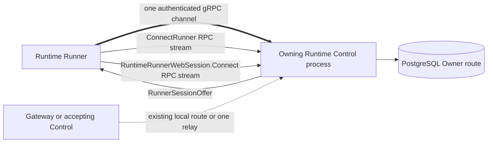

# Runtime Web Owner Session Routing Design

- Snapshot: `runtimeweb-260915`
- Requirements: [runtimeweb-260915/REQ](../requirements/runtimeweb-260915-owner-session-routing.md)
- Decisions: [runtimeweb-260915/ADR](../adr/runtimeweb-260915-owner-session-routing.md)
- Document reference: `runtimeweb-260915/DESIGN`

## Current Behavior and Requirement Gaps

The Runner creates one `GrpcRunnerControlClient` and ordinary `ConnectRunner` stream
for registration, lifecycle, operations, and delivery of a `RunnerSessionOffer`. The
Control process sending the offer has already acquired the exact Runtime Web Owner
lease for that Runner generation.

`RunnerWebSessionManager` nevertheless creates a second gRPC channel. In the original
implementation its destination came from the offer; Phase 1 temporarily uses the
ordinary stable Control endpoint but still takes the TLS server name from the offer.
A stable Service can select another replica, so the receiving replica must relay back
to the Owner even though the Runner already has an authenticated channel to that
Owner. The protocol and deployment also retain destination fields and configuration
with no remaining authority purpose.

The gap is structural rather than a missing address-selection rule: the existing
channel already carries the authenticated remote endpoint and failure lifecycle that
the Runner Web session needs.

## Requirements and Decision Traceability

| Requirement | Design mechanisms |
| --- | --- |
| `runtimeweb-260915/REQ-1` | M1 shared-channel client creation, M2 connection-scoped manager lifecycle, M5 owner-side admission retention |
| `runtimeweb-260915/REQ-2` | M3 authority-only offer, M4 configuration removal |
| `runtimeweb-260915/REQ-3` | M2 ordered teardown, M5 unchanged session validation and transport state |
| `runtimeweb-260915/REQ-4` | M3 reserved protobuf fields, M6 exact fingerprint cutover and absence checks |

## Architecture and Ownership

The two Runner RPC streams remain independent protocol sessions but share one
underlying authenticated gRPC channel. `GrpcRunnerControlClient` owns that channel.
`GrpcRunnerWebSessionClient` borrows a generated `RuntimeRunnerWebSession.Connect`
callable created from the channel and receives `channel=None`, so its shutdown closes
only its RPC task and queues.

The Owner offer remains the source of join authority. Channel identity establishes
where the join request is delivered; it does not replace Owner boot, lease, nonce,
generation, deadline, or fingerprint checks.

## M1. Shared-channel Runner Web client creation

`GrpcRunnerControlClient` adds a factory method that creates a
`GrpcRunnerWebSessionClient` from its owned gRPC channel. The method:

- rejects clients constructed without an owned channel, preserving injected-stream
  unit-test behavior;
- creates `RuntimeRunnerWebSessionStub(channel).Connect` on the same channel;
- reuses the already bound Runner authentication metadata;
- passes the Runner outbound resource accountant; and
- does not transfer channel ownership to the Web client.

The Control client retains its authentication token or equivalent metadata in a form
that allows the Web client to emit the same bearer credential. The Web client endpoint
factory and connect-address validation are removed because production composition no
longer creates an independent channel.

## M2. Connection-scoped Runner manager lifecycle

`RunnerWebSessionManager` receives one required zero-argument Web-client factory. It
no longer receives a Control endpoint, TLS configuration, insecure-mode flag, Runner
auth token, or offer-dependent client factory.

The manager continues to:

- reject offers outside the current Runtime, desired generation, Runner generation,
  deadline, fingerprint, and nonce-consumption rules;
- close a prior persistent Web session before activating a replacement;
- validate the session-accepted envelope against the exact Owner epoch and negotiated
  profile; and
- close loopback and session resources on failure or Control reconnection.

`run_runtime_runner` constructs the manager inside the ordinary Control reconnect
loop and binds its factory to that iteration's `GrpcRunnerControlClient`. Cleanup
continues in this order: dispatcher, Web manager, then ordinary Control client. Thus a
borrowed Web RPC ends before the owning channel closes.

## M3. Authority-only offer contract

The protobuf `RunnerSessionOffer` removes:

- field 4 `owner_replica_id`;
- field 8 `connect_address`; and
- field 9 `tls_server_name`.

The field numbers and names are reserved. Remaining field numbers do not change.
Generated Python modules and stubs are regenerated by the repository generator.

The frozen Python `RunnerSessionOffer` contains:

- `OwnerSessionEpoch owner`;
- `session_nonce`;
- `protocol_fingerprint`; and
- `deadline_at`.

Offer validation retains nonce, deadline, Owner epoch, and exact fingerprint checks.
The connect-address validator is deleted when no other source or test uses it.
Serialization maps only the remaining fields. Round-trip tests assert the exact
remaining authority and explicitly verify that the removed protobuf names are absent.

## M4. Backend and deployment configuration removal

`WebSessionOwner` stops accepting, validating, and storing Runner connect-address and
TLS-server-name inputs. `acquire` creates the authority-only offer while keeping the
persisted route's `owner_replica_id` and `owner_address` unchanged for Gateway and
Control relay routing.

Runtime Control settings remove:

- `runtime_control_runner_web_connect_address`; and
- `runtime_control_runner_web_tls_server_name`.

Composition, configuration validation, Helm deployment environment variables, chart
render assertions, and local E2E fixture environment values remove the matching
settings. Ordinary Runner Control endpoint and TLS configuration remain unchanged.

## M5. Preserved Owner admission and data-plane semantics

No change is made to:

- the persisted `runtime_web_session_routes` schema or repository;
- Owner acquisition, renewal, release, relay lookup, or trusted Owner address;
- Runner bearer authentication on `RuntimeRunnerWebSession.Connect`;
- exact Owner epoch, join nonce hash, fingerprint, registration deadline, and profile
  validation;
- logical stream framing, flow control, scheduler, heartbeat, GOAWAY, failure, or
  capacity behavior;
- Gateway browser authority or the optional one-hop Control relay; or
- Runner numeric `127.0.0.1` application destination policy.

Control-side tests continue to construct route owner identifiers where those values
belong to persisted routing. Only `RunnerSessionOffer` construction loses the copied
replica and destination values.

## M6. Fingerprint-fenced clean cutover

The Runtime Web fingerprint is derived from the canonical protobuf descriptor and
other fixed protocol inputs. Regenerating the descriptor after removing offer fields
changes the fingerprint automatically. Existing exact-equality checks reject a
mixed-version session before logical application traffic is accepted.

No compatibility parser, deprecated dataclass fields, optional aliases, feature flag,
or address fallback is added. Deployment rollback requires returning Control and
Runner to the same prior build, consistent with the existing replacement-protocol
cutover policy.

## Security and Permissions

The shared channel is already authenticated with the exact Runtime Runner credential
and terminates at the Control process that issued the offer. The separate Runner Web
RPC continues to send bearer metadata and passes the existing server interceptor and
Owner join validation. Sharing the channel does not grant browser authority, bypass
PostgreSQL checks, or expose a new Runtime listener.

Removing offered addresses narrows the protocol input accepted by the Runner and
eliminates a destination-injection surface. The Runner still cannot connect to an
arbitrary offer-selected host, while loopback application access remains restricted
to the requested numeric port on `127.0.0.1`.

## Failure, Retry, Rollout, and Recovery

- Ordinary Control channel loss terminates both RPC streams. The reconnect loop closes
  the Web manager before the Control client and creates a new connection-scoped
  manager afterward.
- Runner Web RPC failure closes only the borrowed RPC and its logical streams; it does
  not close the ordinary Control channel.
- Owner loss, generation replacement, nonce replay, deadline expiry, and protocol
  mismatch keep their existing fail-closed behavior.
- A mixed Control/Runner build cannot join because the fingerprint differs. Operators
  use the existing coordinated Runtime Web rollout and fix-forward or whole-build
  rollback policy.
- No database migration, data backfill, persisted compatibility state, live cluster
  write, or runtime retry is required.

## Observability and Operational Risks

Existing content-free session, stream, failure, resource, and transport metrics remain
unchanged. No address label is added. Logs retain Runtime, Runner, connection, Owner
epoch, and bounded reason correlation without application content.

Primary risks and controls:

- **Accidental shared-channel close:** the Web client receives no channel ownership;
  lifecycle tests assert the ordinary channel remains usable after Web client close.
- **RPC concurrency assumption:** a focused integration test opens ordinary Control
  and Runner Web RPCs through one channel against the same test server.
- **Reconnect race:** composition keeps the manager inside one reconnect iteration and
  closes it before the Control client.
- **Incomplete contract removal:** repository-wide absence checks cover protobuf,
  generated code, source, settings, Helm, fixtures, and tests.

## Test Strategy

### E2E primary verification matrix

- HTTP through an approved Runtime Web endpoint reaches the Runtime application.
- WebSocket traffic remains bidirectional through the same endpoint.
- Runtime Web works with the fixture's ordinary Control endpoint and no
  Runner-Web-specific destination environment variables.
- Runtime/Runner generation replacement still invalidates obsolete sessions.

The existing required Runtime Web Gateway E2E suite is the primary product-behavior
verification. It runs in local Docker topology or CI, not against the live cluster.
The fixture removes the obsolete environment values so startup itself verifies the
configuration contract.

### Focused integration and unit verification

- `GrpcRunnerControlClient` creates a Runner Web client from its owned channel and the
  Web client does not own or close that channel.
- Runner manager offer acceptance creates no endpoint-based channel and retains
  current generation, deadline, nonce replay, acceptance-authority, and replacement
  behavior.
- Offer protobuf round trip preserves all remaining authority and has no removed
  fields.
- Backend Owner acquisition emits an authority-only offer while persisted Owner route
  data remains unchanged.
- Runtime Control settings/composition and Helm render tests prove obsolete variables
  are absent.
- Existing shared-library, Runner, and backend Runtime Web suites provide regression
  coverage for transport and lifecycle semantics.

No new credential snapshot is needed. Existing test credentials and generated Runtime
fixtures are sufficient. Evidence consists of exact test commands, pass counts, type
checks, Ruff results, pre-commit output, and follow-up PR CI checks. Optional live
tests are not run; a live-cluster prerequisite must skip rather than mutate
infrastructure.

## Alternatives and Non-Blocking Risks

The rejected stable-Service, direct-Pod, multiplex-inside-`ConnectRunner`, and separate
router alternatives are recorded in `runtimeweb-260915/ADR`. Terminal and transfer
channels still use their existing independently pooled topology and are intentionally
outside this snapshot.

A shared HTTP/2 connection can couple transport-level failure and flow-control
implementation details across RPC streams. That coupling already exists at the
ownership lifecycle level, while gRPC maintains independent RPC stream flow control.
Current hard message limits and Runtime Web application-level credit remain in force.

## Feasibility Evidence

- The generated Runtime Runner services share one gRPC server listener and Python gRPC
  channels support multiple generated stubs and concurrent RPC streams.
- `GrpcRunnerWebSessionClient` already supports `channel=None`, which represents a
  borrowed or externally managed transport in unit tests and shutdown.
- Runner cleanup already closes the Web manager before `GrpcRunnerControlClient`.
- The offering Control acquires the Owner lease before delivering the offer on that
  Runner's ordinary stream, so no additional Owner discovery is required.
- The persisted route retains all fields needed by Gateway-side relay resolution.
- Protocol generation and fingerprint derivation are repository-controlled and have
  focused tests.

No unresolved material feasibility blocker remains.

## Design Authority

- Design revision: `1`

| ID | Material design mechanism | Authority | Classification |
| --- | --- | --- | --- |
| M1 | Create Runner Web RPCs from the ordinary Control client's owned gRPC channel | `runtimeweb-260915/REQ-1`; `runtimeweb-260915/ADR-D1` | `decided` |
| M2 | Scope the Web manager to one ordinary Control connection and close it before the channel owner | `runtimeweb-260915/REQ-1`, `REQ-3`; `ADR-D1` | `derived` |
| M3 | Remove and reserve offered replica/address/TLS fields while retaining join authority | `runtimeweb-260915/REQ-2`, `REQ-4`; `ADR-D2` | `decided` |
| M4 | Remove Runner-Web-specific backend, Helm, and fixture destination configuration | `runtimeweb-260915/REQ-2`; `ADR-D2` | `required` |
| M5 | Preserve Owner epoch, lease, authentication, relay, transport, and loopback semantics | `runtimeweb-260915/REQ-3`; current Agent Runtime Control Spec | `existing` |
| M6 | Use the existing exact fingerprint boundary with no compatibility path | `runtimeweb-260915/REQ-4`; `ADR-D2` | `decided` |

## Removal and Replacement

| Existing unit or behavior | Removal authority | Replacement or remaining authority | Removal boundary | Absence verification |
| --- | --- | --- | --- | --- |
| Offer-selected Runner connection destination | `runtimeweb-260915/REQ-1`, `REQ-2`; `ADR-D1`, `ADR-D2` | M1 shared ordinary channel | Runner manager and client composition | No endpoint/TLS inputs or endpoint client creation in Runner Web manager/client path |
| Protobuf fields 4, 8, and 9 | `runtimeweb-260915/REQ-2`, `REQ-4`; `ADR-D2` | Reserved numbers/names; M3 remaining authority | Source proto and generated Python surfaces | Descriptor and generated stubs omit names; numbers/names are reserved |
| `RunnerSessionOffer` replica/address/TLS fields and validation | `runtimeweb-260915/REQ-2`; `ADR-D2` | M3 authority-only dataclass | Shared runtime-control model, serialization, tests | Repository search and offer round-trip tests |
| Backend Owner Runner destination inputs | `runtimeweb-260915/REQ-2`; `ADR-D2` | Persisted route Owner fields remain for Gateway relay under M5 | `WebSessionOwner`, Control composition and validation | Constructor/composition tests and repository search |
| Runtime Control Runner-Web destination settings | `runtimeweb-260915/REQ-2`; `ADR-D2` | Ordinary Runner Control endpoint/TLS configuration | Settings, Helm template/tests, E2E fixtures | Render tests and repository search |
| Phase 1 spec wording that describes a separately addressed Runner Web channel | `runtimeweb-260915/REQ-1`; `ADR-D1` | M1/M2 current shared-channel behavior | Agent Runtime Control living spec | Spec review and targeted text search |
| Persisted Owner replica/address route fields | None | M5 Gateway and relay routing authority | No removal | Route repository and relay tests remain unchanged |

## Design Approval

- Mode: `Autonomous`
- Decision owner: `Agent under requester-delegated technical correction authority`
- Approved on: `2026-09-15`
- Approved Design revision: `1`
- Approved authority IDs: `M1, M2, M3, M4, M5, M6`
- Approved scope: `Reuse the ordinary authenticated Runner Control gRPC channel for the distinct Runner Web RPC, remove offer-selected destination authority and obsolete configuration, and preserve all existing Owner, security, relay, protocol, and application semantics.`
