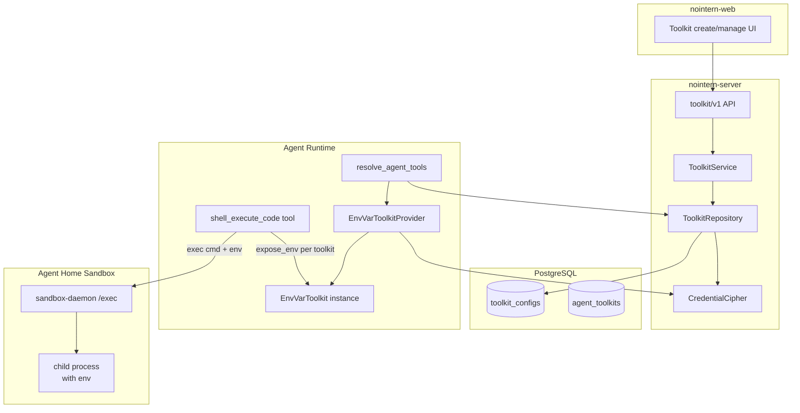

## Implementation Complete Status (2026-04-24)

Implemented as stacked PR series according to design. Related PRs:

| Stack | PR | Scope |
|---|---|---|
| 1/8 | #2912 | design document (original of this file) |
| 2/8 | #2913 | Phase 1 — `Toolkit.expose_env()` protocol + sandbox-daemon `/exec env` plumbing |
| 3/8 | #2914 | Phase 2 — `EnvVarToolkit` implementation + `ToolkitType.ENVVAR` registry + `BuiltinToolkit.set_peer_toolkits` wiring |
| 4/8 | #2915 | Phase 3 — `validate_credentials` (POSIX regex, size/count limits) + resolve audit log |
| 5/8 | #2918 | Phase 4 — `nointern-web` admin UI (`EnvVarConfigFields.tsx` + i18n 4 locales) |
| 6/8 | #2933 | Phase 5 — testenv QA (TC-CRED-ENVVAR-001 + TC-WEB-ENVVAR-001) |
| 7/8 | _this PR_ | Spec Promotion — confirm design `implemented` + spec update |
| 8/8 | _next PR_ | Cleanup |

### Main changes from design

- TC-002~005 in **Point 9 (verification)** were testenv scenarios in the specification, but actual coverage is 15 unit test cases (`envvar_test.py`, `executor_test.py`) + 3 docker integration test cases (`executor_docker_integration_test.py`) + 1 new shell peer integration test case in `shell_test.py`. TC-CRED-ENVVAR-001 is blocked on marker assertion due to LLM baseline issue (same symptom as TC-SHELL-001, orthogonal issue).
- **regex (POSIX variable name)** changed from first design `^[A-Z_][A-Z0-9_]*$` to case-allowing `^[a-zA-Z_][a-zA-Z0-9_]*$` (reflecting PR #2913/#2915/#2918 review feedback).
- **Phase 1 discussion contents** are archived in `docs/nointern/discussion/sandbox-credential-injection.md`.

# Generalized Sandbox Credential Injection Design

> Basis issue: [#2873](https://github.com/azents/azents/issues/2873)
> Phase 1 discussion: [Discussion #2875](https://github.com/azents/azents/discussions/2875)
> Parent context: [Discussion #2833 — Coding capabilities](https://github.com/azents/azents/discussions/2833)

## Overview

Build a generalized framework for delivering credentials to shell tools executed inside Sandbox. Complete isolation is assumed impossible; practical defenses are **short-lived TTL + egress allowlist + audit**.

First target is **EnvVarToolkit** — a general-purpose tool where workspace manager registers arbitrary environment variables (API key, token, etc.), and they are injected into child process env when `shell()` executes in agent session. This establishes toolkit state machine and `shell()` env injection path together, and later can extend dynamic renew paths such as GitHub installation token.

## User Scenario

**EnvVarToolkit usage flow** (workspace manager):
1. UI `/w/[handle]/toolkits/new` → select "Environment variables" type
2. enter name "My Notion Creds", add entry: `NOTION_TOKEN=secret_xxx`
3. confirm Warning modal (acknowledge leakage risk)
4. Save Toolkit → bind that toolkit from agent edit screen

**shell execution in agent session** (LLM):
1. Agent calls `shell_execute_code(command="curl -H 'Authorization: Bearer $NOTION_TOKEN' https://api.notion.com/v1/users/me")`
2. shell tool collects `expose_env()` result from active toolkits → passes as env to sandbox daemon
3. Child process env inside Sandbox has `NOTION_TOKEN`, curl succeeds

**Token rotation/delete** (manager):
- Overwrite Entry value → new value applies from next shell call (state machine reflects immediately)
- Delete Toolkit → injection into agent stops

## Discussion Points and Decisions

Phase 1 completed in [Discussion #2875](https://github.com/azents/azents/discussions/2875). Core decision summary:

| # | Decision | Rationale |
|---|---|---|
| 1 | MCP first, sandbox shell last resort. Exceptions require justification document | reduce attack surface |
| 2 | Delivery is **env-only** (Phase 1). tmpfs/file out-of-scope | HTTP scripting reality; delivery form difference has little effect in threat model |
| 3 | allow all credential types, no separate admin approval. 2-step Info/Warning UI | toolkit configuration permission itself is manager/admin-or-above and acts as gate |
| 4 | Toolkit owns state machine — inject fresh env through `expose_env()` at `shell()` call time | no separate rotator/sidecar needed; extends existing ToolkitProvider pattern |
| 5 | Snapshot cleanup hook unnecessary | env naturally cleans up with process lifetime |
| 6 | Egress allowlist outside this design scope → [Discussion #2833 Thread 18](https://github.com/azents/azents/discussions/2833#discussioncomment-16654211) | coding agent profile design |
| 7 | UI 2-step (Info/Warning), prefilled safe TTL, default 3-month reminder | hard warning unnecessary, separate user responsibility |
| 8 | Audit: issue/use/revoke events + mitmproxy outbound (host+path, query string excluded), retention 90 days | essential for estimating damage after leakage, privacy protection |
| 9 | Docker local allows weakened profile, show K8s-only protection warning at registration | local dev convenience |

**First implementation order**: EnvVarToolkit → GitHub (installation token, dynamic renew) → AWS STS / GCP WIF

## Architecture

### Runtime structure



### Toolkit state machine (Phase 1)

EnvVarToolkit is static state — env does not change unless config changes. However, `expose_env()` decrypts DB at call time and returns **latest value on every call** (automatically reflected from next shell call after config modification).

Later dynamic toolkits such as GitHub installation token add expiry check + renew logic inside `expose_env()`. Same protocol is used, so shell tool requires no change.

## Data Model

### Reuse existing tables

**No change** — use existing `toolkit_configs`, `agent_toolkits` tables:

```
toolkit_configs:
  id, workspace_id, toolkit_type="envvar", slug, name
  config: JSONB            # plain text (entry name list, masked flag)
  encrypted_credentials: TEXT  # encrypted JSON (entry values)
  enabled: bool
  created_at, updated_at

agent_toolkits:
  id, agent_id, toolkit_id, toolkit_type="envvar"
  UQ(agent_id, toolkit_id)
```

### Data schema

**config (plain text)** — only entry metadata:
```python
class EnvVarToolkitConfig(BaseModel):
    """EnvVarToolkit configuration. Metadata stored in plaintext."""

    entries: list[EnvEntryMeta]

class EnvEntryMeta(BaseModel):
    """Environment variable entry metadata."""

    name: str                       # e.g. "NOTION_TOKEN"
    masked: bool = True             # whether to mask value in logs (default true)
```

**credentials (encrypted)** — entry values:
```python
class EnvVarToolkitSecrets(BaseModel):
    """EnvVarToolkit encrypted secret."""

    values: dict[str, str]          # name -> value
```

Variable names are plaintext; values are serialized to JSON in `encrypted_credentials` field then encrypted with `CredentialCipher.encrypt()`.

### Migration

**None** — reuse existing `toolkit_configs`, `agent_toolkits` structure. `ToolkitType` enum is string-based, so adding `"envvar"` value requires no DB change.

## Provider / Toolkit Implementation

### Toolkit protocol extension

Add `expose_env` method to `nointern.core.tools.Toolkit`. Default implementation returns empty dict — no existing toolkit change.

```python
class Toolkit(ABC, Generic[ConfigT]):
    # ... existing methods ...

    async def expose_env(self) -> dict[str, str]:
        """Return env var dict to inject into sandbox during shell execution.

        Return fresh value on every call (static toolkit returns captured value,
        dynamic toolkit performs expiry check + renew).

        Default implementation is empty dict. Only toolkits exposing credentials
        to sandbox override this.

        Note: `make_tool` handler receives only JSON args and cannot access
        `TurnContext`. Therefore `expose_env()` has no-arg signature, and
        toolkit instance must already capture required context (user_id, etc.)
        from `ResolveContext` at `resolve()` time.

        :return: env var dict to inject (key -> value)
        """
        return {}
```

### EnvVarToolkitProvider

```python
# python/apps/nointern/src/nointern/engine/tools/envvar.py

class EnvVarToolkitProvider(ToolkitProvider[EnvVarToolkitConfig]):
    """General-purpose toolkit provider for environment variable injection.

    When workspace manager registers arbitrary environment variables, they are
    injected into child process env on agent shell execution.
    """

    slug = "envvar"
    name = "Environment Variables"
    description = (
        "Arbitrary environment variables injected into sandbox shell commands. "
        "Useful for long-lived API tokens (Notion, Slack, OpenAI, etc)."
    )
    system_prompt = (
        "You have access to environment variables configured in the "
        "'{toolkit_name}' toolkit. Reference them in shell commands "
        "(e.g., $NOTION_TOKEN). Do not echo or log their values."
    )
    config_model = EnvVarToolkitConfig

    def __init__(self, cipher: CredentialCipher) -> None:
        """Initialize.

        :param cipher: credential encryption/decryption instance
        """
        self._cipher = cipher

    async def resolve(
        self,
        config: EnvVarToolkitConfig,
        context: ResolveContext,
    ) -> Toolkit[EnvVarToolkitConfig]:
        """Return EnvVarToolkit instance from config + credentials."""
        values: dict[str, str] = {}
        if context.credentials_json:
            secrets = EnvVarToolkitSecrets.model_validate_json(
                context.credentials_json
            )
            values = secrets.values
        return EnvVarToolkit(
            config=config,
            values=values,
            toolkit_name=context.toolkit_name,
        )

    async def validate_credentials(
        self,
        config: EnvVarToolkitConfig,
        credentials: dict[str, Any],
    ) -> str | None:
        """Validate credentials schema.

        :return: error message or None
        """
        try:
            secrets = EnvVarToolkitSecrets.model_validate(credentials)
        except ValidationError as e:
            return f"Invalid credentials: {e}"

        # verify entry names match config
        config_names = {e.name for e in config.entries}
        cred_names = set(secrets.values.keys())
        missing = config_names - cred_names
        if missing:
            return f"Missing values for: {sorted(missing)}"
        extra = cred_names - config_names
        if extra:
            return f"Extra values not in config: {sorted(extra)}"
        return None
```

### EnvVarToolkit

```python
class EnvVarToolkit(Toolkit[EnvVarToolkitConfig]):
    """Environment variable injection toolkit instance.

    Exposes no tools (user does not need to read env values directly),
    and supplies env through expose_env() on shell execution.
    """

    def __init__(
        self,
        *,
        config: EnvVarToolkitConfig,
        values: dict[str, str],
        toolkit_name: str,
    ) -> None:
        """Initialize.

        :param config: toolkit configuration (entry metadata)
        :param values: decrypted env values dict
        :param toolkit_name: human-readable toolkit name (for logs/prompt)
        """
        self._config = config
        self._values = values
        self.display_name = toolkit_name

    async def update_context(self, context: TurnContext) -> ToolkitState:
        """Return current turn state. EnvVarToolkit exposes no tools."""
        entry_names = [e.name for e in self._config.entries]
        prompt = ""
        if entry_names:
            prompt = (
                f"Environment variables available in shell commands via '{self.display_name}': "
                + ", ".join(f"${name}" for name in entry_names)
            )
        return ToolkitState(
            tools=[],
            prompt=prompt,
            status=ToolkitStatus.READY,
        )

    async def expose_env(self) -> dict[str, str]:
        """Return env filtered to names declared in config.

        Values present in credential store but absent from config are excluded
        (config is authorization boundary).
        """
        config_names = {e.name for e in self._config.entries}
        return {k: v for k, v in self._values.items() if k in config_names}
```

### Registry registration

```python
# python/apps/nointern/src/nointern/engine/tools/deps.py

def get_toolkit_registry(
    cipher: CredentialCipher,
    # ... existing dependencies ...
) -> dict[str, ToolkitProvider[Any]]:
    return {
        # ... existing ...
        "envvar": EnvVarToolkitProvider(cipher),
    }
```

### ToolkitType enum update

```python
# python/apps/nointern/src/nointern/core/tools.py

class ToolkitType(enum.StrEnum):
    # ... existing ...
    ENVVAR = "envvar"
```

## Shell tool integration

### Env collection path

Shell tool collects env from **current agent's active toolkits** at execution time. Because `make_tool` handler is constrained to JSON args only, `make_execute_code_tool` factory **captures** `resolved_toolkits` list in closure and iterates inside handler.

```python
# make_execute_code_tool signature change
def make_execute_code_tool(
    sandbox_manager: AgentHomeSandboxManager,
    agent_id: str,
    domain_config: SandboxDomainConfig,
    publish_event: Callable[[EngineEvent], Awaitable[None]],
    *,
    user_id: str,
    resolved_toolkits: Sequence[Toolkit[Any]] = (),
) -> FunctionTool:
    """...

    :param resolved_toolkits: current agent's active toolkit instances.
        On shell execution, call each toolkit's `expose_env()` and collect env.
    """

    async def handler(args: ExecuteCodeInput) -> str:
        # collect env — merge env exposed by active toolkits
        secret_env: dict[str, str] = {}
        for tk in resolved_toolkits:
            env_part = await tk.expose_env()
            for key, val in env_part.items():
                if key in secret_env:
                    logger.warning(
                        "Env var overridden by later toolkit",
                        extra={"var_name": key, "agent_id": agent_id},
                    )
                secret_env[key] = val

        # ... existing sandbox allocation ...
        result = await sandbox.exec(
            args.command,
            timeout=timeout,
            env=secret_env,  # ← NEW
        )
        # ...
```

### Passing resolved_toolkits from agent-runtime

`engine/run/resolve.py::resolve_agent_tools` already builds active toolkit list, so pass to `make_execute_code_tool(resolved_toolkits=resolved_toolkits)` from same point. Share existing list without separate callback layer.

### sandbox-daemon `/exec` API extension

Current `ExecRequest` accepts only `command`, `user_id`, `timeout`. Add optional `env: dict[str, str]`, and executor prepends to `bash -c` in form `export K=$(printf '%q' V); ...; cmd`:

```python
# routes.py — ExecRequest
class ExecRequest(BaseModel):
    command: str
    user_id: str = ""
    timeout: int = 30
    env: dict[str, str] = Field(default_factory=dict)


# executor.py — extend _build_exec_command
def _build_exec_command(
    command: str,
    *,
    user_id: str,
    env: dict[str, str],
) -> list[str]:
    """bash -c wrapping + env export prefix.

    :param env: env variables to inject. Safely export with shlex.quote.
    """
    parts: list[str] = []
    for key, val in env.items():
        _validate_env_name(key)  # validate ^[A-Z_][A-Z0-9_]*$
        parts.append(f"export {key}={shlex.quote(val)}")
    if user_id:
        parts.append(f"export USER_DIR=/data/user/{shlex.quote(user_id)}")
    parts.append(command)
    wrapped = "; ".join(parts)
    return ["bash", "-c", wrapped]
```

**Security notes**:
- Env name is validated by POSIX variable regex (`^[A-Z_][A-Z0-9_]*$`) — prevents injection
- Env value escaped with `shlex.quote` — safe with spaces/special chars
- When logging command, **exclude env values** — record only `env_keys` in `extra` dict, and `command` field is original command only (no export prefix)

### AgentHome interface extension

All three implementations add `env: dict[str, str] | None = None` to `exec()` signature:
- `runtime/sandbox/agent_home.py` (abstract method)
- `runtime/sandbox/agent_home_k8s.py` (pass env to `SandboxDaemonClient.exec`)
- `runtime/sandbox/agent_home_docker.py` (same)
- `services/sandbox_daemon_client.py::SandboxDaemonClient.exec` — add `env` field in POST body

Backward compat: default `env=None` → no impact on existing callers.

## API

### Reuse existing endpoint

No new endpoint for EnvVarToolkit. Use existing toolkit CRUD endpoint in `api/public/toolkit/v1/`:

- `POST /toolkit/v1/configs` — create
- `GET /toolkit/v1/configs` — list
- `GET /toolkit/v1/configs/{id}` — details
- `PATCH /toolkit/v1/configs/{id}` — update
- `DELETE /toolkit/v1/configs/{id}` — delete

### Request / Response examples

**Create request**:
```json
POST /toolkit/v1/configs?handle=my-workspace
{
  "toolkit_type": "envvar",
  "name": "My Notion Creds",
  "slug": "notion-creds",
  "config": {
    "entries": [
      {"name": "NOTION_TOKEN", "masked": true}
    ]
  },
  "credentials": {
    "values": {
      "NOTION_TOKEN": "secret_xxxxx"
    }
  },
  "enabled": true
}
```

**Response (no value exposure)**:
```json
{
  "id": "tk_abc123",
  "toolkit_type": "envvar",
  "name": "My Notion Creds",
  "config": {"entries": [{"name": "NOTION_TOKEN", "masked": true}]},
  "has_credentials": true,
  "enabled": true
}
```

### Validation

- `EnvVarToolkitProvider.validate_credentials` checks config and credentials entry names match
- Name rule: `^[A-Z_][A-Z0-9_]*$` (POSIX env var name), max 64 chars
- Value size limit: 4KB per entry, 100KB per toolkit total
- Max entry count: 50

## Frontend (UI/UX)

### List screen

Show envvar type card in existing list on `/w/[handle]/toolkits` page:

```
┌───────────────────────────────────────────────────────────┐
│ Toolkits                                      [+ Add tool] │
├───────────────────────────────────────────────────────────┤
│ ┌────────────────────────────────────────────────────────┐│
│ │ [envvar] My Notion Creds                  Active ⚙ 🗑  ││
│ │ 2 entries · ⚠ Warning (long-lived)                     ││
│ │ Last used 2 hours ago                                  ││
│ └────────────────────────────────────────────────────────┘│
│ ┌────────────────────────────────────────────────────────┐│
│ │ [github] Main GitHub App                  Active ⚙ 🗑  ││
│ │ ℹ Info (short-lived, auto-revoke)                      ││
│ └────────────────────────────────────────────────────────┘│
└───────────────────────────────────────────────────────────┘
```

### Create / edit screen

When selecting "Environment variables" on `/w/[handle]/toolkits/new`:

```
┌─────────────────────────────────────────────────────────┐
│ New Toolkit                                             │
├─────────────────────────────────────────────────────────┤
│ Tool      [Environment variables ▼]                     │
│ Name      [My Notion Creds_________________]            │
│ Slug      [notion-creds_____________________]           │
│                                                         │
│ ⚠ Warning · long-lived credential                       │
│ Env values stored here are injected into sandbox shell  │
│ commands as child process env. Leakage cannot be fully  │
│ prevented.                                             │
│ □ I understand the leakage risk                         │
│                                                         │
│ ── Entries ─────────────────────────────────            │
│ Name              Value                Action           │
│ [NOTION_TOKEN__]  [••••••••••__]       🗑               │
│ [SLACK_WEBHOOK_]  [••••••••••__]       🗑               │
│                   [+ Add entry]                         │
│                                                         │
│ Scope                                                   │
│ ● Workspace   ○ Team [Select...]                        │
│                                                         │
│ [Cancel]                                  [Save]        │
└─────────────────────────────────────────────────────────┘
```

**Core rules**:
- risk acknowledgement checkbox required on save (unchecked → disabled)
- value field uses `PasswordInput` (Mantine) for masking
- edit screen uses value placeholder "leave blank to keep existing value" pattern (same as existing GitHub PAT management)

### Risk level badge

```tsx
// src/features/toolkits/components/ToolkitRiskBadge.tsx
<Badge color="orange" variant="light">
  ⚠ Warning
</Badge>
```

- all envvar are Warning (long-lived assumption)
- future dynamic toolkit (GitHub App installation) is Info (blue)

### Reminder

Top banner for long-lived toolkit used for 3+ months:

```
┌──────────────────────────────────────────────────────┐
│ ⏰ "My Notion Creds" has been used for over 3 months.│
│    Consider rotation. [Settings] [Dismiss]           │
└──────────────────────────────────────────────────────┘
```

### Delete confirmation modal

Reuse existing ToolkitList delete modal. For envvar, add text:

```
Delete this toolkit?
Env values in this toolkit are not automatically revoked externally.
If there is leakage risk, revoke token directly at issuer (Notion, etc.).
```

## Infra

**No change** — use existing Agent Home, sandbox daemon, K8s resources as-is. Only extend sandbox-daemon `/exec` API to accept env parameter (backward compatible, default empty dict).

## Feasibility Verification

| Item | Result | Note |
|---|---|---|
| Add `expose_env` to `Toolkit` protocol | ✅ | `nointern.core.tools.Toolkit` is ABC; default implementation avoids impact on existing implementations |
| Extend `ToolkitType` enum | ✅ | StrEnum, string-based storage, no DB change |
| Reuse existing `toolkit_configs`/`agent_toolkits` | ✅ | config JSONB + encrypted_credentials sufficient |
| Reuse `CredentialCipher` | ✅ | Fernet based, encrypt after JSON serialization |
| Add env to sandbox-daemon `/exec` | ✅ | safe injection with `export` prefix + shlex.quote in `bash -c` |
| Pass env through AgentHome backends (k8s/docker) | ✅ | pass from one point `SandboxDaemonClient.exec`, backward-compatible |
| TurnContext access from Shell tool | ✅ | **unnecessary** — no-arg `expose_env()`, capture `resolved_toolkits` list in closure |
| Frontend Mantine PasswordInput + dynamic entries add/delete | ✅ | existing GithubConfigFields pattern + `useFieldArray` style |
| OpenAPI client auto-generation | ✅ | use `/openapi-client-gen` skill |
| Add i18n messages | ✅ | messages/ko-KR.json plus 3 languages |

### Risks

| Risk | Mitigation |
|---|---|
| Env var name collision (same name from multiple toolkits) | deterministic override order by toolkit ID, `logger.warning` on collision |
| Environment variable exposure (leaking `$NOTION_TOKEN` value in logs) | sandbox daemon `/exec` response passes stdout/stderr as-is, env value itself not logged. LLM prompt instructs "do not echo env value" |
| huge env payload | limit 50 entries, 4KB value, 100KB total |
| existing toolkit lacks `expose_env` | ABC default implementation (empty dict), no breaking change |
| env disappears during sandbox-daemon restart | re-pass env on every `exec()` call (daemon stateless) |

## testenv QA Scenarios

> testenv basics: `python testenv/nointern/devserver.py up`

**Coverage distinction**:
- Only **TC-CRED-ENVVAR-001** implemented as testenv scenario file + handler. Single smoke of end-to-end path: Toolkit state machine → `expose_env()` → `peer_toolkits` collection → `sandbox.exec(env=)` → sandbox-daemon `export` prefix.
- **TC-CRED-ENVVAR-002~005** covered by unit tests (`envvar_test.py`) — repeated E2E path verification unnecessary, and edge cases of token injection logic can be sufficiently checked in Python units:
  - `TC-002` (env disappears after delete) → allowlist filter test of `expose_env`
  - `TC-003` (reflected after config edit) → fresh value load test at resolve time
  - `TC-004` (env outside config not exposed) → `test_filters_values_not_in_config`
  - `TC-005` (name validation failure) → regex / size tests of `validate_credentials`

Each TC description below remains as logical unit specification, but only TC-001 runs in actual runner.

### TC-CRED-ENVVAR-001: shell execution after EnvVarToolkit registration

```python
# scenario
user = seed.auth.create_user()
ws = seed.workspace.create(user)
toolkit = seed.toolkit.create_envvar(
    ws,
    name="test-envs",
    entries=[{"name": "MY_TOKEN", "value": "secret-xyz"}],
)
agent = seed.agent.create(ws, toolkits=[toolkit])
session = seed.session.create(agent)

result = live.chat.collect(session, "run: echo $MY_TOKEN")
assert "secret-xyz" in extract_tool_output(result, "shell_execute_code")
```

### TC-CRED-ENVVAR-002: env disappears after delete

```python
# same setup
seed.toolkit.delete(toolkit)
agent = seed.agent.reload(agent)
session2 = seed.session.create(agent)

result = live.chat.collect(session2, "run: echo '[$MY_TOKEN]'")
assert "[]" in extract_tool_output(result, "shell_execute_code")  # empty
```

### TC-CRED-ENVVAR-003: reflected from next call after config edit

```python
# overwrite value
seed.toolkit.update_envvar(
    toolkit,
    entries=[{"name": "MY_TOKEN", "value": "new-value"}],
)

result = live.chat.collect(session, "run: echo $MY_TOKEN")
assert "new-value" in extract_tool_output(result, "shell_execute_code")
```

### TC-CRED-ENVVAR-004: env absent from config is not exposed

```python
# rename MY_TOKEN to SOME_OTHER in entries but DB values not restored
seed.toolkit.update_envvar(
    toolkit,
    entries=[{"name": "SOME_OTHER", "value": "v2"}],
)

result = live.chat.collect(session, "run: echo '[$MY_TOKEN]'")
assert "[]" in extract_tool_output(result, "shell_execute_code")
```

### TC-CRED-ENVVAR-005: Entry name validation

```python
# API error on invalid name registration
with pytest.raises(ApiError) as e:
    live.toolkit.create_envvar(ws, entries=[{"name": "lowercase", "value": "x"}])
assert e.value.status == 400
```

## testenv Impact

| Impact | Content |
|---|---|
| **New seed block** | `seed.toolkit.create_envvar()`, `seed.toolkit.update_envvar()` (same pattern as existing `seed.toolkit.create_github_pat`) |
| **New scenarios** | 5 scenarios TC-CRED-ENVVAR-001~005 above |
| **Existing scenarios** | **not broken** — compatibility retained by adding Toolkit ABC default implementation |
| **docker-compose / .env** | no change |
| **preflight** | no change |

## Implementation Plan (Phase Breakdown)

Split as stacked PRs in Ship-feature:

### Stack 1. Design document (this document)
- Branch: `docs/sandbox-credential-injection`
- PR 1: `docs/nointern/design/sandbox-credential-injection.md`

### Stack 2. Backend — Toolkit protocol + sandbox-daemon env
- Branch: `feat/envvar-toolkit-backend` (Stack 1 base)
- PR 2a: add `Toolkit.expose_env` protocol + default implementation
- PR 2b: add `env` parameter to `sandbox-daemon /exec` API + extend AgentHome backends
- PR 2c: inject `collect_env` callback into Shell tool + env merge in `resolve_agent_tools`

### Stack 3. Backend — EnvVarToolkit
- Branch: `feat/envvar-toolkit-provider` (Stack 2 base)
- implement `EnvVarToolkit`, `EnvVarToolkitProvider`
- register `ToolkitType.ENVVAR`
- register Provider in Registry
- basic unit tests

### Stack 4. Backend — API validation + audit logging
- Branch: `feat/envvar-toolkit-api` (Stack 3 base)
- implement `validate_credentials` (name rule, size limit)
- Audit events — issue/use/delete logging (existing logger + structured extra. separate table follow-up phase)

### Stack 5. Frontend
- Branch: `feat/envvar-toolkit-frontend` (Stack 4 base)
- add `EnvVarConfigFields.tsx`
- Risk badge component
- Warning checkbox modal
- i18n labels (ko/en/ja/fr)
- regenerate `@azents/public-client`

### Stack 6. Testenv seed + QA scenario
- Branch: `feat/envvar-toolkit-testenv` (Stack 5 base)
- `seed.toolkit.create_envvar` block
- TC-CRED-ENVVAR-001~005 scenarios

Each PR uses previous PR as base with `/ship-pr`; create all stacked PRs at once and proceed without waiting for review.

## Alternatives Considered

### File-based delivery (tmpfs, ~/.aws/credentials)

**Rejected because**: Phase 1 out-of-scope decision. In threat model, isolation level difference between env/file/helper is not practically meaningful, and file path management requires supporting each tool-specific convention (`AWS_SHARED_CREDENTIALS_FILE`, `KUBECONFIG`), sharply increasing complexity. Tools needing file-based delivery (kubectl, gcloud ADC) get separate design in step 2.

### Broker socket (Unix domain socket helper)

**Rejected because**: explicitly excluded in Point 2 discussion. Effective "attacker" inside sandbox is agent itself, so broker does not isolate either. Not worth complexity.

### Dedicated `envvar_toolkit_entries` table

**Rejected because**: existing `toolkit_configs.config` JSONB + `encrypted_credentials` is sufficient. Adding table only adds migration burden. Entry count limit (50) is also manageable with JSONB.

### Env collection with toolkit-internal cache

**Rejected because**: config changes must reflect immediately, and stale cache causes confusion. Clearer to return latest state on each `expose_env()` call.

### Tool-call-level logging default on (coding agent)

**Rejected because**: Point 8 discussion decided default off. Privacy/cost concerns, opt-in via workspace setting when needed.

## References

### Code
- `python/apps/nointern/src/nointern/core/tools.py` — `Toolkit`, `ToolkitProvider`
- `python/apps/nointern/src/nointern/engine/tools/github.py` — Provider pattern reference
- `python/apps/nointern/src/nointern/engine/tools/deps.py` — `get_toolkit_registry`
- `python/apps/nointern/src/nointern/core/crypto.py` — `CredentialCipher`
- `python/apps/nointern/src/nointern/rdb/models/toolkit.py` — `RDBToolkitConfig`, `RDBAgentToolkit`
- `python/apps/nointern/src/nointern/services/toolkit/__init__.py` — `ToolkitService`
- `python/apps/nointern/src/nointern/engine/tools/shell.py` — `make_execute_code_tool`
- `python/apps/nointern/src/nointern/runtime/sandbox/agent_home*.py` — `AgentHome` backends
- `python/apps/nointern-sandbox-daemon/` — daemon `/exec` endpoint
- `typescript/apps/nointern-web/src/features/toolkits/` — UI

### Design documents
- `docs/nointern/design/agent-home.md`
- `docs/nointern/design/phase3-snapshot-hibernation.md`
- `docs/nointern/design/github-260313-github-toolkit.md`

### Discussion / Issues
- [#2873](https://github.com/azents/azents/issues/2873) — this design issue
- [#2875](https://github.com/azents/azents/discussions/2875) — Phase 1 discussion
- [#2833](https://github.com/azents/azents/discussions/2833) — parent context for coding capability
