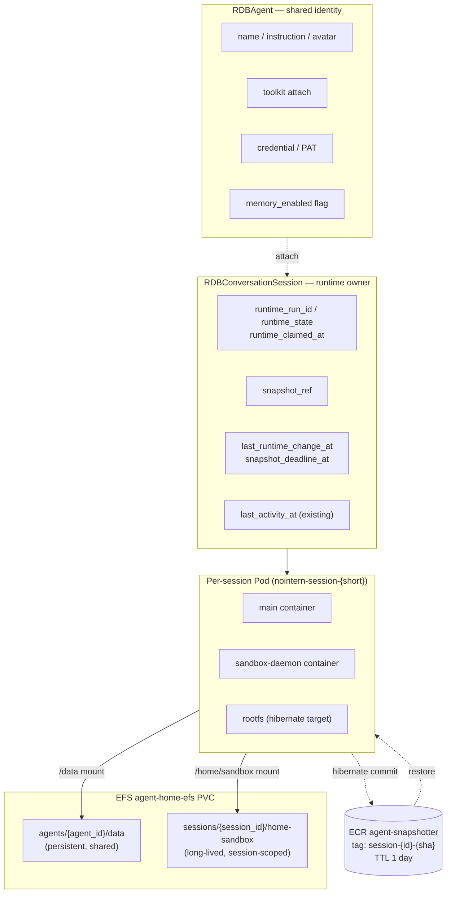
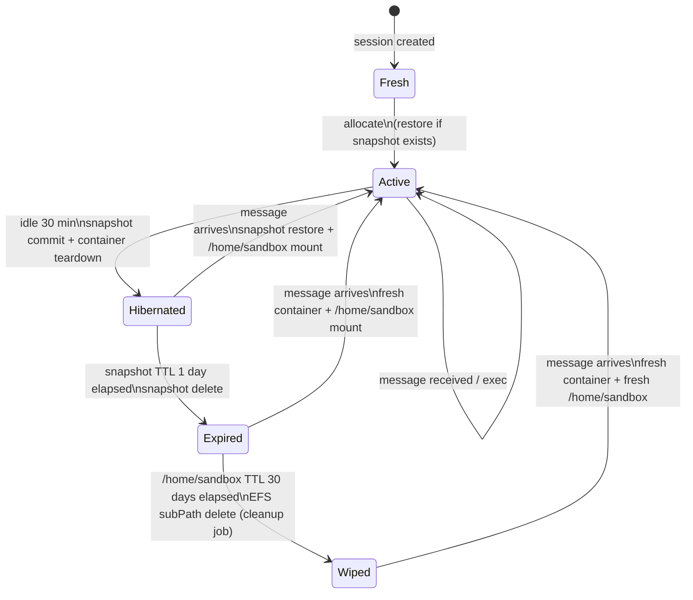

# Per-session Sandbox Design

## Overview

Switch nointern sandbox scope **from per-agent to per-session**. Current structure keeps one persistent container per `RDBAgent` and shares it across multiple sessions. This changes each `RDBConversationSession` to have its own independent container. Agent shared identity, toolkit, credentials, memory, and skills remain in `RDBAgent` DB layer.

### Problems solved

1. **Runtime contention between sessions**: currently multiple sessions can stream exec into one container simultaneously, creating possible file conflicts and process interference.
2. **No failure isolation**: runaway process / OOM / filesystem contamination from one session can propagate to other sessions of same agent.
3. **Awkward billing unit**: agent-level container stays alive even while idle, creating mismatch between real usage value and cost unit.
4. **Rootfs preservation for coding sessions**: CLI/deps installed during long coding session should not be affected by other sessions' work.

### Non-goals

- Change shared Agent identity/settings/memory/skill system (keep as-is).
- Split background jobs (Slack/Discord event poller, etc.) into agent-level daemon — background jobs also belong to session(system-type).
- Telemetry / actual billing logic — only declare measurement fields; emission handled in separate telemetry work ([Issue #2685](https://github.com/azents/azents/issues/2685), [PR #2762](https://github.com/azents/azents/pull/2762)).
- Introduce `shared:///` URI scheme — already implemented with absolute-path-based approach (documentation aligned by PR [#2970](https://github.com/azents/azents/pull/2970)).

### Background discussions

- Research Discussion [#2968](https://github.com/azents/azents/discussions/2968) — product/policy decisions
- Design Discussion [#2971](https://github.com/azents/azents/discussions/2971) — implementation-level decisions (A~G 7 items)
- Original issue [#2837](https://github.com/azents/azents/issues/2837)

## Discussion Points and Decisions

### Product / Scope

| Question | Decision | Rationale |
|---|---|---|
| Value of team-shared agent? | Keep in `RDBAgent` DB layer | identity/toolkit/credential must be shared across sessions |
| Agent persistent files? | Keep (`/data/agent`, `/data/user/{user_id}`) | There are “team assets” shared between sessions |
| Background job handling? | Integrate as system-type session | no need to operate separate resident sandbox |

### 3-layer filesystem

| Layer | Path | Scope | Retention | Primary medium | Secondary medium (persistence) |
|---|---|---|---|---|---|
| persistent | `/data/agent`, `/data/user/{user_id}`, `/platform` | agent / user / platform | until deletion | EFS (`agent-home-efs` PVC subPath `agents/{agent_id}/data`) + sandbox-daemon File-API facade | no change |
| long-lived | `/home/sandbox` | session | idle 30 days | EFS session subPath `sessions/{session_id}/home-sandbox` | S3 path-scoped tar snapshot |
| volatile | rest of rootfs (`/tmp`, installed system packages, etc.) | session | idle 1 day (snapshot TTL) | hibernate snapshot (reuse Phase 3 infra) | no change |

### Session Lifecycle

- No limit on number of sessions.
- `session_id = sandbox identity`: while sandbox is alive, same session reuses same sandbox.
- **session-scoped hibernate** (same meaning/behavior as Phase 3: snapshot commit + container teardown + restore).
- Idle timeout: **hibernate 30 min · snapshot TTL 1 day · EFS subPath TTL 30 days**.
- Commit trigger: on hibernate + periodic debounce (reuse Phase 3 debounce logic).

### Migration

- **Big-bang cutover**. No feature flag dual-mode.
- Existing `/data/agent/{agent_id}` EFS subPath is preserved. New model mounts it as-is.
- Reuse Phase 3 snapshot infrastructure (agent-snapshotter DaemonSet + ECR `agent-snapshotter` repo). Only image tag becomes session-based.

### Implementation detail decisions (Discussion #2971)

| | Decision | |
|---|---|---|
| A | A2 — class rename | `AgentHomeSandboxManager` → `SessionSandboxManager`, update files/tests/comments throughout |
| B | B1 + label | Pod name `nointern-session-{session_short}`, expose agent/workspace through labels |
| C | C-path-1 + C-ttl-A | subPath `sessions/{session_id}/home-sandbox`, application-level cleanup job (Temporal/cron) |
| D | D1 | reuse existing `agent-snapshotter` ECR repo, only tag becomes session-based |
| E | E1 | rename clients too (`SessionSandboxClient`, etc.) |
| F | F1 | 8 sequential stacked PRs |
| G | G2 | update e2e tests in parallel with implementation phases |

## Architecture



### Session Lifecycle State Machine



## Data Model

### Additional columns on `RDBConversationSession`

```python
runtime_run_id: Mapped[str | None]            # current lifecycle loop run ID (UUID)
runtime_state: Mapped[SessionRuntimeState | None]
                                              # active | hibernated | expired | wiped
runtime_claimed_at: Mapped[datetime | None]   # time current run claimed lease
last_runtime_change_at: Mapped[datetime | None]
                                              # last state change such as exec/write
snapshot_deadline_at: Mapped[datetime | None] # scheduled debounce snapshot time
```

**SessionRuntimeState enum:**
```python
class SessionRuntimeState(str, Enum):
    ACTIVE = "active"              # container alive
    HIBERNATED = "hibernated"      # snapshot exists, no container
    EXPIRED = "expired"            # snapshot TTL elapsed, only /home/sandbox remains
    WIPED = "wiped"                # /home/sandbox also deleted
```

**New indexes:**
- `IX_SESSION_RUNTIME_STATE_DEADLINE` partial index on `(runtime_state, snapshot_deadline_at)` WHERE `runtime_state = 'active'` — for lifecycle loop scan.
- `IX_SESSION_RUNTIME_CLAIMED_AT` on `runtime_claimed_at` WHERE `runtime_run_id IS NOT NULL` — for stale lease detection.

### Removed columns from `RDBAgent` (big-bang)

```python
# remove all:
lifecycle_run_id, lifecycle_state, lifecycle_claimed_at
last_state_change_at, last_snapshot_at, snapshot_deadline_at
```

### `RDBAgentSnapshot` → `RDBSessionSnapshot` (rename + FK change)

```python
class RDBSessionSnapshot(Base):
    __tablename__ = "session_snapshots"

    id: Mapped[str] = mapped_column(primary_key=True)
    session_id: Mapped[str] = mapped_column(
        ForeignKey("conversation_sessions.id", ondelete="CASCADE"),
        index=True,
    )
    image_ref: Mapped[str]
    base_image_ref: Mapped[str]
    kind: Mapped[SnapshotKind]                # hibernate | debounce
    size_bytes: Mapped[int | None]
    digest: Mapped[str | None]
    created_at: Mapped[datetime]

    __table_args__ = (
        Index("IX_SESSION_SNAPSHOT_ID_CREATED", "session_id", "created_at"),
    )
```

### Migration order (internal steps of Phase 1 PR)

1. **Revision N**: create `session_snapshots` table + add `conversation_sessions.runtime_*` columns (nullable without backfill).
2. **Revision N+1**: discard existing data in `agent_snapshots` and drop table (force wake-up all hibernated agents before cutover).
3. **Revision N+2**: drop all `agents.lifecycle_*` columns.

**Data migration strategy**: existing active agents use “wake-up only” strategy. At cutover, terminate all active agents (delete containers), and incoming sessions use session-scoped model. User receives fresh sandbox when resuming session (conversation context remains in DB).

This data migration is possible because rootfs has **no** preservation target at level of “my assistant’s desk” UX (decided toward thin side in discussion #2968 Q2). Persistent `/data/*` remains on EFS.

## Core Implementation Change Points

### 1. Rename `runtime/sandbox/` directory (Phase 2, 3)

| Current | After |
|---|---|
| `agent_home_manager.py` | `session_sandbox_manager.py` |
| `agent_home.py` | `session_sandbox.py` (Protocol) |
| `agent_home_docker.py` | `session_sandbox_docker.py` |
| `agent_home_k8s.py` | `session_sandbox_k8s.py` |
| `*_test.py` | corresponding rename |

### 2. Allocator signature change

```python
# Before
class AgentHomeSandboxManager:
    async def get_or_allocate(self, agent_id: str) -> AgentHomeHandle: ...

# After
class SessionSandboxManager:
    async def get_or_allocate(
        self, *, session_id: str, agent_id: str
    ) -> SessionSandboxHandle: ...
```

**Internal changes**:
- Cache key and per-key `asyncio.Lock`: `agent_id` → `session_id`.
- DB lease query: `RDBAgent.lifecycle_*` → `RDBConversationSession.runtime_*`.
- Snapshot lookup/restore: based on `session_id` instead of `agent_id`.
- Snapshot storage FK on `_hibernate`: `agent_id` → `session_id`.

### 3. K8s Pod Spec (Phase 3)

```python
# session_sandbox_k8s.py — pod spec summary
metadata = V1ObjectMeta(
    name=f"nointern-session-{session_short}",
    namespace=namespace,
    labels={
        "app.kubernetes.io/name": "nointern-session",
        "nointern/session-id": session_id,
        "nointern/agent-id": agent_id,
        "nointern/workspace-id": workspace_id,
    },
)

volumes = [
    V1Volume(
        name="agent-home-efs",
        persistent_volume_claim=V1PersistentVolumeClaimVolumeSource(
            claim_name="agent-home-efs"
        ),
    ),
]

volume_mounts = [
    V1VolumeMount(
        name="agent-home-efs",
        mount_path="/data",
        sub_path=f"agents/{agent_id}/data",   # shared persistent
    ),
    V1VolumeMount(
        name="agent-home-efs",
        mount_path="/home/sandbox",
        sub_path=f"sessions/{session_id}/home-sandbox",  # new: session long-lived
    ),
]
```

Optional `nointern/agent-name-slug` label controlled by config flag (default off — avoid slugify cost).

### 4. Docker Pod (development/testenv)

```python
# session_sandbox_docker.py
binds = [
    f"{data_dir}:/data",                            # existing
    f"{session_home_dir}:/home/sandbox",            # new
]
```

`session_home_dir` is host path like `/tmp/nointern/sessions/{session_id}/home-sandbox` in testenv.

### 5. Snapshot path (Phase 4)

- ECR repo: keep `agent-snapshotter`.
- Image tag: `session-{session_short}-{yyyymmddHHMMSS}-{random8hex}`
  (common format for `session_snapshot_docker.py` / K8s snapshotter DaemonSet).
  session prefix allows filtering while random suffix prevents collision.
- Snapshotter DaemonSet identifies target by container label, so it works as-is if label includes `nointern/session-id`.
- Reuse Phase 3 logic for `RDBSessionSnapshot.base_image_ref` drift check.

### 6. Worker / Engine (Phase 2~3)

- `session_id` already flows in `worker/engine.py`. Change `notify_activity(agent_id)` to `notify_activity(session_id=..., agent_id=...)` or session_id only.
- Inject sandbox manager in `worker/deps.py` — replace with renamed manager.

### 7. Lifecycle Loop (Phase 5)

Rewrite existing agent lifecycle loop (Temporal workflow or asyncio task) at session unit:

```python
async def session_lifecycle_loop():
    while True:
        # 1. hibernate candidates: active + snapshot_deadline_at <= now
        candidates = await session_repo.find_hibernate_candidates(now)
        for session in candidates:
            if await session_repo.claim_runtime_lease(session.id, run_id):
                await manager.hibernate(session.id)

        # 2. snapshot expire: hibernated + snapshot TTL elapsed
        expired = await session_repo.find_snapshot_expired(now, snapshot_ttl_days=1)
        for session in expired:
            await snapshot_client.delete(session.snapshot_ref)
            await session_repo.mark_expired(session.id)

        # 3. EFS wipe: expired + 30 days elapsed
        wiped = await session_repo.find_efs_wipe_candidates(now, efs_ttl_days=30)
        for session in wiped:
            await efs_cleanup_job.schedule(session.id)

        await asyncio.sleep(LOOP_INTERVAL_SECONDS)
```

EFS cleanup is separate Temporal activity / cron — alert on job failure (Sentry).

### 8. Testenv (Phase 8)

- Redefine session fixture as sandbox allocator unit in `conftest.py`.
- Additional scenarios:
  - `test_session_hibernate_after_30min_idle`
  - `test_session_restore_from_snapshot_within_ttl`
  - `test_session_fresh_rootfs_after_snapshot_ttl`
  - `test_session_full_wipe_after_efs_ttl`
  - `test_concurrent_sessions_isolated_rootfs`
  - `test_agent_scope_files_shared_across_sessions`
- Time-related tests use `freezegun` + short-circuit TTL option.

## API

**No change**: session creation and message send APIs remain same. Sandbox allocator working by session_id is unrelated to API contract.

Internally, only timing of `POST /conversation_sessions` calling `SessionSandboxManager.get_or_allocate` changes.

## Infrastructure Changes

| Item | Change |
|---|---|
| EFS PVC | none. Continue using existing `agent-home-efs` (only add subPath mount) |
| ECR repo | none. Continue using existing `agent-snapshotter` (only tag naming changes) |
| ECR lifecycle policy | review. Reflect snapshot TTL 1 day (check current Phase 3 policy then adjust) |
| K8s RBAC / ServiceAccount | none |
| NetworkPolicy | only pod name pattern change (`nointern-session-*`) |
| Temporal workflow | new — session lifecycle loop, EFS cleanup activity |
| Sentry alert | new — EFS cleanup job failure alert |
| Metrics dashboards | update filters (grouping by `nointern/agent-id` label) |

## Feasibility Verification Result (summary)

| Area | Reuse | Change size | Risk |
|---|---|---|---|
| Phase 3 snapshot/restore (client API) | high | M | medium (FK change) |
| K8s Pod spec (label/volume expansion) | high | S-M | low |
| DB migration (big-bang) | medium | L | high (1:N complexity) |
| Add `RDBConversationSession` runtime_* | new | M | medium |
| E2E test refactor | needed | M | low |
| Worker / Engine (`session_id` already flows) | high | S | low |
| Engine Event Stream (already session-scoped) | unchanged | none | low |

**Verdict: GO-WITH-CAVEATS.** Implementation is feasible, but Phase 1 (DB migration) requires additional design care — existing hibernated agent handling (adopt wake-up only strategy), and finer lease management.

## testenv QA Scenarios

### 1. Basic session isolation behavior

```python
# seed
user = seed.auth.create_user()
ws = seed.workspace.create(user)
agent = seed.agent.create(ws, name="coder")

# scenario
s1 = live.chat.create_session(agent)
s2 = live.chat.create_session(agent)

live.chat.collect(s1, "echo 'session 1' > /tmp/marker")
live.chat.collect(s2, "ls /tmp/marker 2>&1")

# expect: s2 does not see marker file (rootfs isolation)
assert "No such file" in s2.last_shell_output
```

### 2. Shared `/data/agent`

```python
s1 = live.chat.create_session(agent)
s2 = live.chat.create_session(agent)

live.chat.collect(s1, "echo 'shared' > /data/agent/note.txt")
live.chat.collect(s2, "cat /data/agent/note.txt")

# expect: s2 reads "shared" (EFS persistent shared)
assert "shared" in s2.last_shell_output
```

### 3. Hibernate → Restore

```python
s1 = live.chat.create_session(agent)
live.chat.collect(s1, "echo 'before' > /home/sandbox/note.txt && pip install cowsay")
pod_before = live.sandbox.get_pod(s1.id)

# simulate 30 min+1 min idle
live.time.advance(minutes=31)

# lifecycle loop tick
live.sandbox.tick_lifecycle()
assert live.sandbox.get_pod(s1.id) is None  # container destroyed
assert live.snapshot.latest(s1.id) is not None

# new message
live.chat.collect(s1, "cat /home/sandbox/note.txt && cowsay hello")
pod_after = live.sandbox.get_pod(s1.id)

# expect: restore. both note.txt and cowsay survive
assert pod_after.name != pod_before.name
assert "before" in s1.last_shell_output
assert "hello" in s1.last_shell_output
```

### 4. Fresh Rootfs after Snapshot TTL elapsed

```python
s1 = live.chat.create_session(agent)
live.chat.collect(s1, "pip install cowsay && echo 'homefs' > /home/sandbox/note.txt")
live.time.advance(minutes=31)
live.sandbox.tick_lifecycle()     # hibernate

live.time.advance(days=1, minutes=1)
live.sandbox.tick_lifecycle()     # snapshot expired

live.chat.collect(s1, "cat /home/sandbox/note.txt && cowsay hello || echo NOPE")

# expect: note.txt survives (EFS), cowsay absent (rootfs volatile)
assert "homefs" in s1.last_shell_output
assert "NOPE" in s1.last_shell_output
```

### 5. Full Fresh after EFS TTL elapsed

```python
# continuation of above scenario
live.time.advance(days=30)
live.sandbox.tick_lifecycle()
live.efs_cleanup.run()            # force cleanup job

live.chat.collect(s1, "ls /home/sandbox/note.txt 2>&1")

# expect: note.txt absent
assert "No such file" in s1.last_shell_output
```

## testenv Impact

- **conftest change**: replace `sandbox_manager` fixture with `SessionSandboxManager`; `session` fixture explicitly calls sandbox allocator.
- **New seed block**: none. Existing `seed.agent.create` + session creation API as-is.
- **New live helper**: `live.time.advance`, `live.sandbox.tick_lifecycle`, `live.sandbox.get_pod`, `live.efs_cleanup.run` (may already exist; if not, add in Phase 8).
- **docker-compose**: none. testenv uses docker backend (`SessionSandboxDocker`).
- **.env.example**: add hibernate/snapshot/EFS TTL environment variables (can set short values in development):
  ```
  NOINTERN_SESSION_HIBERNATE_IDLE_SECONDS=1800
  NOINTERN_SESSION_SNAPSHOT_TTL_SECONDS=86400
  NOINTERN_SESSION_EFS_TTL_SECONDS=2592000
  ```
- **Existing scenario impact**: update tests assuming per-agent behavior — update related area tests in each Phase PR ([G] G2 decision).

## Implementation Phases

8 stacked PRs ([F] F1 decision). Each PR rebases on previous PR.

### Phase 1: DB schema migration

- New `RDBSessionSnapshot` table + migration.
- Add `runtime_*` + `snapshot_deadline_at` columns to `RDBConversationSession` + migration.
- Define `SessionRuntimeState` enum.
- Do not remove existing `RDBAgentSnapshot` in this Phase (Phase 7).
- New repository methods (`ConversationSessionRepository.claim_runtime_lease`, `find_hibernate_candidates`, etc.).

### Phase 2: Allocator / Manager refactor

- Rename `agent_home_manager.py` → `session_sandbox_manager.py`.
- Change `get_or_allocate` signature.
- Change internal cache/lock key and DB lease path.
- Update Worker/Engine call sites.

### Phase 3: K8s / Docker client

- Rename `agent_home.py` / `agent_home_k8s.py` / `agent_home_docker.py`.
- Pod naming (`nointern-session-{short}`) + labels (`nointern/agent-id`, `nointern/workspace-id`, optional `nointern/agent-name-slug`).
- Two volume mounts (`/data` + `/home/sandbox`).

### Phase 4: Snapshot restore / commit

- Session-based ECR tag naming.
- Keep base image drift check.
- Store snapshot metadata in `RDBSessionSnapshot`.

### Phase 5: Lifecycle loop (TTL)

- New Session lifecycle loop (hibernate 30 min → snapshot TTL 1 day → EFS TTL 30 days).
- EFS cleanup job (Temporal activity or cron) + Sentry alert.
- `notify_state_change` path reuses existing debounce logic.

### Phase 6: Declare measurement fields

- Define metric fields such as session compute time, hibernate count, snapshot size.
- Mark emission as TODO at telemetry integration point — actual wiring in [Issue #2685](https://github.com/azents/azents/issues/2685).

### Phase 7: Remove existing agent lifecycle

- Migration dropping all `RDBAgent.lifecycle_*` columns.
- Migration dropping `RDBAgentSnapshot` table.
- Remove 6 lifecycle methods from Agent repository.
- Merge point of this Phase is cutover — only new code from previous phases is used.

### Phase 8: Testenv / e2e rewiring

- Add above QA scenario tests.
- Update existing tests assuming per-agent behavior.
- devserver.py · conftest · time mock helper.

## Alternatives Considered

### A1: Minimal change (only extend signature)
Add only `AgentHomeSandboxManager.get_or_allocate(agent_id, session_id)`. No rename.
**Rejected**: docstrings/comments would keep “agent-per-pod” assumption and hurt readability/long-term maintainability. Misaligned with big-bang policy.

### A3: Keep both in parallel (deprecate pattern)
Create `SessionSandboxManager` and leave existing as wrapper.
**Rejected**: inconsistent with big-bang ([discussion 6] Q14). Maintaining duplicate code is burdensome.

### B2: Include agent prefix in Pod name (`nointern-agent-home-{agent}-{session}`)
**Rejected**: insufficient margin under K8s 63-character limit, and “agent-home” terminology mismatches per-session reality.

### C-path-2: monthly partition subPath
**Rejected**: increases first implementation complexity. Defer to secondary refactor if session count becomes problem.

### C-ttl-B: EFS lifecycle policy
**Rejected**: EFS does not support official file TTL (only IA tier transition).

### D2: new ECR repo `session-snapshotter`
**Rejected**: additional Terraform/IAM burden. Zero infra change prioritized over naming consistency.

### E2: keep client names (scope-neutral primitive)
**Rejected**: insufficient consistency with [A2]. One-time naming cleanup is worth review burden.

### F2: bundled PRs (compress into 4)
**Rejected**: even though big-bang, diff per PR likely exceeds review limit.

### F3: intermediate milestone
**Rejected**: prolongs big-bang transition period — dual-mode operation complexity.

### G1: rewrite tests all at once in Phase 8
**Rejected**: e2e green state not secured during intermediate phase merges — reduced rollback room.

### Concern about per-user PAT / credential redistribution (raised in Discussion #2968 Q1)
**Rejected rationale**: recent main `sandbox-credential-injection` / `github-toolkit-shell-env` series organized credentials as agent-level while dynamically capturing user context at call time. Orthogonal to per-session transition; no redistribution issue.

## Risks and Mitigations

| Risk | Impact | Mitigation |
|---|---|---|
| In-flight sessions of active agents break during big-bang cutover | medium | pre-cutover notice + session auto-restart guidance message. Conversation context remains in DB |
| Data loss in DB migration `RDBAgentSnapshot` | low | snapshot is 1-day TTL cache. persistent data `/data/*` is separately preserved in EFS |
| Explosion of EFS subPath count (unlimited sessions) | medium | cleanup job deletes idle 30-day subPath. monitoring: EFS usage + cleanup job failure rate |
| Increased cold start frequency (frequently opened/closed sessions) | low~medium | hibernate restore ~5s (based on Phase 3). measure then consider TTL/warm pool strategy secondarily |
| Explosion of ECR image count (session snapshot × N) | medium | adjust D1 ECR lifecycle policy to snapshot TTL 1 day before Phase 4 merge |
| Unlimited sessions create noisy sessions | low | hibernate covers it (idle 30 min → container destroyed). cost is storage only while hibernated |
| Phase 1 migration complexity (1:N) | high | “wake-up only” strategy — terminate all existing agent containers then start in new model. User view keeps conversation |
| Missing testenv e2e time mock | medium | introduce `freezegun` + TTL env var short-circuit helper in Phase 8 |

## Follow-up Work

- After merging this document, **add ADR** (`docs/nointern/adr/sandbox-260424-sandbox.md`).
- Create stacked PR chain (8 phases) with `/ship-feature`.
- On implementation completion, move this document to `design/`, create `spec/domain/session-sandbox.md`.
