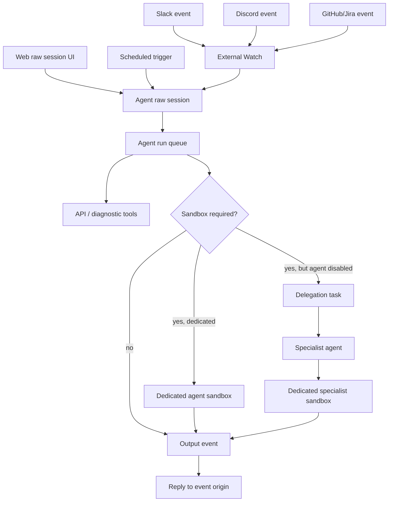
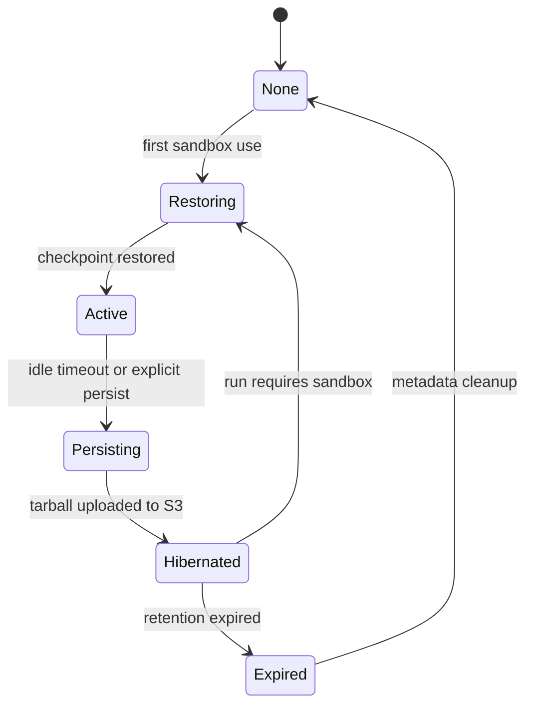

# Agent Session / Sandbox Architecture

## Overview

This document redefines NoIntern's existing per-conversation-session runtime/sandbox structure into agent-centered structure, and covers EFS removal, S3-based sandbox persistence, file exchange, file upload, external channel watch, and task delegation together.

Core decisions are as follows.

```text
1 Agent = 1 raw session
Agent = 0 or 1 dedicated sandbox
High-cardinality spawned agent = sandbox disabled by default
Heavy sandbox-needed work = task delegation to specialist agent
```

External platforms such as Slack/Discord/GitHub/Jira already provide their own channel/thread/ticket/issue as conversation/work unit. NoIntern does not keep separate `ConversationSession` as common runtime domain, and routes external events to agent raw session through watches. Web UI directly accesses raw session.

## User Scenarios

Scenario-specific requirement analysis and required technical spec are separated into documents below.

- [Professional coding agent](agent-session-sandbox-scenarios/professional-coding-agent.md)
- [Routine scheduler agent](agent-session-sandbox-scenarios/routine-scheduler-agent.md)
- [Personal agent](agent-session-sandbox-scenarios/personal-agent.md)
- [Support agent team](agent-session-sandbox-scenarios/support-agent-team.md)
- [On-call agent](agent-session-sandbox-scenarios/oncall-agent.md)

### Professional coding agent

- Long-running IC responsible for specific product area.
- Keeps one long raw session and dedicated sandbox.
- Watches Jira ticket, GitHub PR/issue, Slack thread, etc.
- Human can directly enter Web raw session and pair program.
- sandbox has repo checkout, build/test cache, artifacts, and long-running work files.

### Routine scheduler

- Periodically posts weather, lunch menu, today's schedule, etc. to Discord channel.
- Mostly needs only API/search/calendar tools, so sandbox disabled or on-demand is appropriate.
- scheduled trigger puts event into raw session, and agent posts to configured Discord channel with explicit output tool.

### Personal agent

- Private agent accessible only by specific user.
- In Web, raw session is exposed only to owner; in Slack, only DM is allowed.
- Performs personal schedule, Slack search, document work, development/automation work with owner's delegated OAuth credential.
- skill belongs to agent, and skill list/body is stored in DB. sandbox filesystem is used as materialized/editing workspace for skill files and resources.

### Support agent team

- Thread is created for each question in Slack IT channel, and ephemeral support agent is spawned per thread.
- support agent handles only that thread and defaults to sandbox disabled.
- Difficult work is delegated to sandbox-enabled specialist agent.
- manager agent summarizes daily work log and suggests template/team skill improvements.

### On-call agent

- Slack thread and alert agent are created per alert.
- alert agent has independent raw session per thread but does not have sandbox by default.
- read-heavy diagnosis is handled with logs/metrics/traces/k8s read API tools.
- heavy/stateful/write work needing sandbox is delegated to specialist agent.
- Same-day alert knowledge is stored in IncidentLog/ShiftLog, not per-alert sandbox snapshot.

## Target Architecture



## Core Concepts

### Agent

Agent is basic unit of execution and permission. Every agent has exactly one raw session. Agent can be persistent, or ephemeral spawned agent created per Slack thread or alert.

### Raw session

Raw session is agent's long-term conversation/work context. Web UI directly accesses raw session. Slack/Discord/GitHub/Jira/Scheduler events enter same raw session through watch/trigger.

### Sandbox policy

Sandbox is optional dedicated resource.

| Policy | Meaning | Representative scenario |
|---|---|---|
| `disabled` | sandbox creation impossible | support/alert spawned agent, routine scheduler |
| `on_demand` | create/restore when needed | personal agent, some automation agents |

Always-running (`always`) policy is not kept as separate sandbox policy. Professional coding agent also has default policy `on_demand`; if latency optimization is needed, discuss prewarm or keep-warm operational policy separately as implementation detail.

Team sandbox and per-thread/per-alert sandbox are not adopted. Read-heavy work is handled by API tools, and work needing sandbox is delegated to specialist agent.

### External Watch

Watch routes external target to agent raw session.

```text
source: slack | discord | github | jira | web
target identifiers: channel/thread/message/issue/pr/ticket
agent_id
policy: whether inbound/outbound is allowed, personal DM only, thread exclusive, etc.
```

In multi-turn agent, "reply" is hard to automatically map to one target. Watch only delivers event origin to raw session, and outgoing messages to Slack/Discord/GitHub/Jira are determined as target of tool when agent calls explicit output tool call. Detailed target selection rules for each output tool are designed separately in corresponding feature implementation task.

### Scheduled Trigger

Scheduled trigger is timer-based event source. Routine scheduler and manager agent daily reports use this structure.

### Task Delegation

Task delegation is durable queue for sandbox-disabled or lightweight agent to hand off heavy work to sandbox-enabled specialist agent.

```text
DelegationTask
  source_agent_id
  target_agent_id or target_capability
  origin
  summary
  instructions
  context
  attachments/artifacts
  priority
  status
  result
```

Basic result flow is that specialist returns result to source agent, and source agent explains it in user-facing thread. If needed, specialist can directly leave progress update on origin.

### Skill

Skill is agent-scoped work guide. It belongs to agent, not session or conversation.

- DB has skill index and body snapshot.
- System prompt and `load_skill` reference DB.
- Sandbox filesystem is materialized/editing workspace of skill file/resource.
- On sandbox persist/reload, filesystem changes are synced to DB.

## Sandbox S3 Persistence and EFS Removal

Remove EFS. Durable state of dedicated sandbox is stored in S3 object storage as tarball checkpoint.



### Persist Unit

- Only dedicated sandbox is persist target.
- spawned support/alert agent has sandbox disabled, so per-thread/per-alert tarball is not created.
- specialist agent has dedicated sandbox, but number of agents is limited so tarball count is bounded.
- Git workspace is stored as tarball snapshot, not object-per-file sync.

### Canonical State

- active state: `/home/sandbox` is canonical.
- hibernated state: S3 checkpoint is canonical.
- If file API or skill filesystem access requires active filesystem, restore sandbox.
- System prompt skill list/body uses DB snapshot, so it can be composed without sandbox restore.

## File Exchange and File Upload

Files are divided into three types.

| Type | Canonical store | Sandbox relationship |
|---|---|---|
| Agent workspace files | active sandbox or S3 checkpoint | inside dedicated sandbox `/home/sandbox` |
| Uploaded attachments | object storage | can materialize into sandbox at run start |
| Durable artifacts | object storage + metadata | optionally exported from sandbox |

### Upload

User upload is immediately stored in object storage. Run input includes attachment URI and metadata. Agent requiring sandbox materializes only needed attachments into `/home/sandbox/.nointern/attachments/{attachment_id}/` at run start.

### File Download/Exchange

Durable artifact generated by agent exports sandbox file to object storage and records metadata in DB. UI and Slack/Discord provide this artifact as link or platform attachment.

### File API

File API works for dedicated sandbox-backed agent.

- active: read/write `/home/sandbox` through sandbox daemon.
- hibernated: restore if needed and then access.
- sandbox disabled agent: does not provide workspace File API. Provides only uploaded attachment/artifact API instead.

## Access Policy and Delegated Credential

Agent access policy applies to every entrypoint.

- Web raw session access
- Watch creation and event routing
- File API
- Tool execution
- Delegated OAuth credential use
- Skill access

Personal agent is private agent with `owner_user_id` and applies Slack DM-only policy. Delegated credential is stored by user_id, and agent can use only owner's credential.

## Implementation Plan

1. Introduce External Watch / event origin / explicit output target.
2. Clean up Agent raw session / sandbox policy domain.
3. Introduce Task Delegation durable queue.
4. Introduce Skill DB snapshot + sandbox materialization/sync.
5. Implement Dedicated sandbox S3 persist/restore.
6. Redefine file upload / file exchange / File API by sandbox policy.
7. Remove EFS PV/PVC, init/chown, wipe job, file-api EFS mount.
8. Remove and migrate existing ConversationSession runtime ownership.
9. Clean up testenv/e2e/operational runbook per work item.

Each item is large work that can itself split into multiple phases. Testing/QA is not pushed to final integration stage; design, implementation, verification phases are performed independently inside each sub-issue. Final item handles common testenv helper and cross-cutting spec/runbook cleanup.

## Alternatives Considered

### Keep ConversationSession

Rejected. Slack/Discord already have channel/thread as chat room, and Web directly accesses raw session. If ConversationSession owns runtime, routing, and sandbox owner at same time, it conflicts with 1-agent-1-session model.

### Per-thread/per-alert sandbox

Rejected. In high-cardinality workloads such as alert/support, tarball/checkpoint count explodes.

### Team sandbox

Rejected. API tools are enough for read-heavy work, and work needing sandbox is close to heavy/write. Shared sandbox has large resource overuse, cleanup, and isolation problems.

### S3 object-per-file live filesystem

Rejected. To support shell write as first-class feature, active filesystem must be canonical as sandbox. S3 is used as checkpoint/artifact backend, not live mutable filesystem.

## Feasibility Verification Points

- Can existing `ConversationSession` runtime columns and broker routing migrate to agent basis?
- Can sandbox daemon/file API route by agent_id?
- Is restore latency of S3 tarball checkpoint within acceptable UX range?
- Is auth boundary between upload/object storage and sandbox materialization safe?
- Can source agent consume specialist delegation queue result again and, when needed, post to origin thread through explicit output tool call?

## testenv QA Scenarios

1. Create sandbox disabled spawned support agent and deliver Slack thread event. Workspace File API must be disabled and only diagnostic API tool must work.
2. Create skill on personal agent and verify `load_skill` works from DB skill body. Skill list must enter system prompt even if sandbox is inactive.
3. Create file in coding agent sandbox and persist. After terminating sandbox, restore and verify file is restored.
4. Store uploaded attachment in object storage and materialize it in sandbox run. Artifact export link must be created after run.
5. support/alert agent creates delegation task to specialist, source agent receives specialist result, then posts to original thread with explicit Slack output tool call.

## testenv Impact

- agent sandbox policy seed helper needed
- watch/trigger/delegation seed helper needed
- S3/object storage fake or local backend needed
- Slack/Discord event origin and explicit output tool fake needed
- existing session-centric chat scenario must be updated to agent raw session basis
