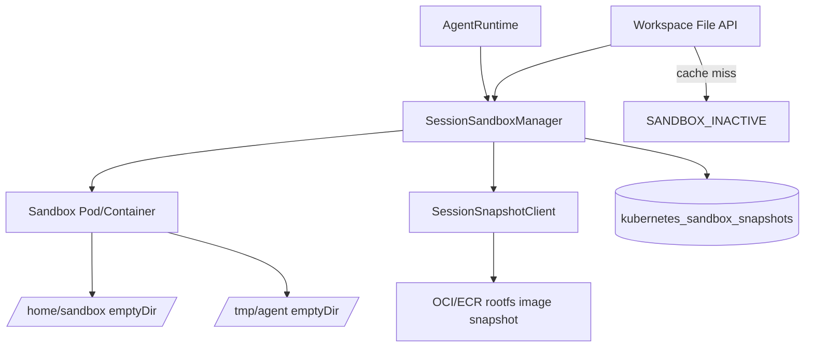
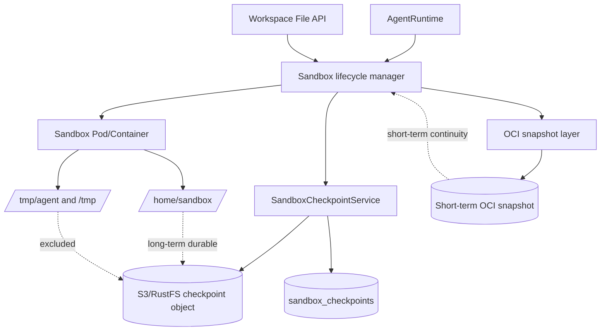
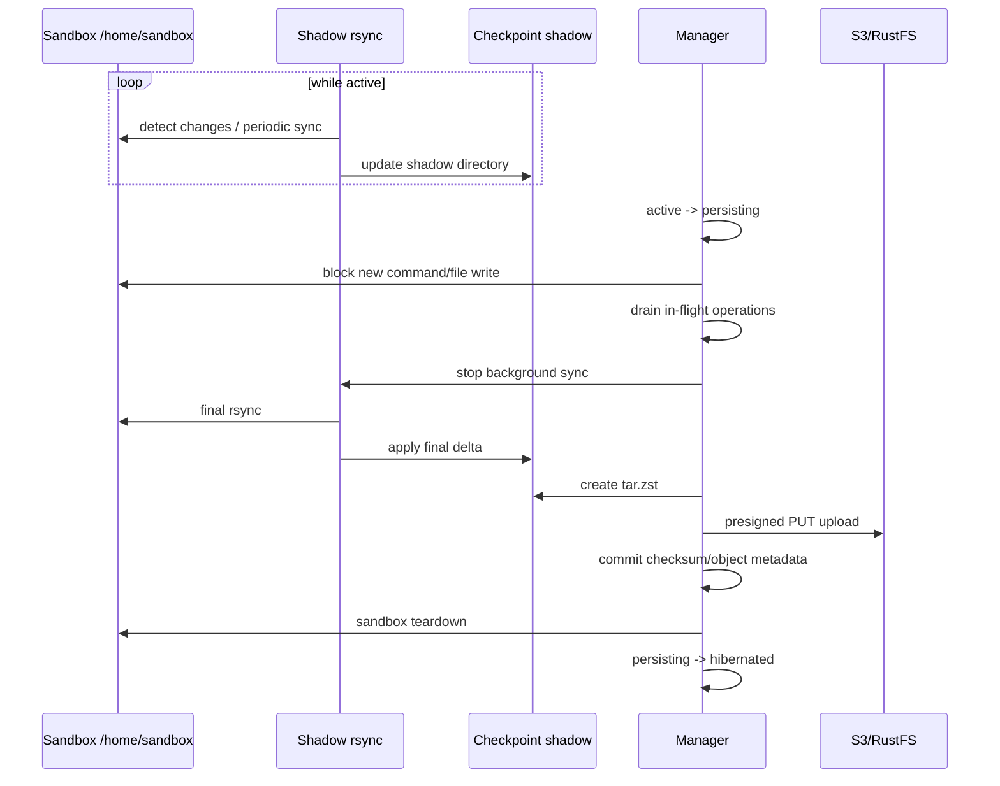
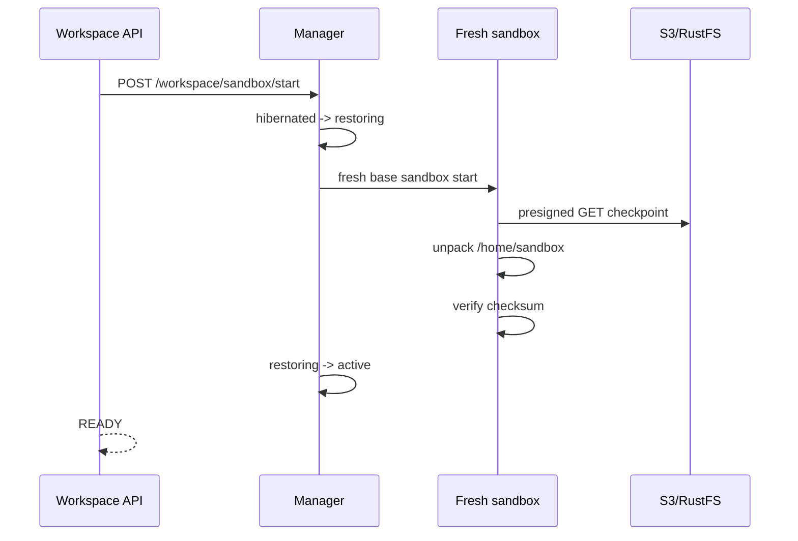
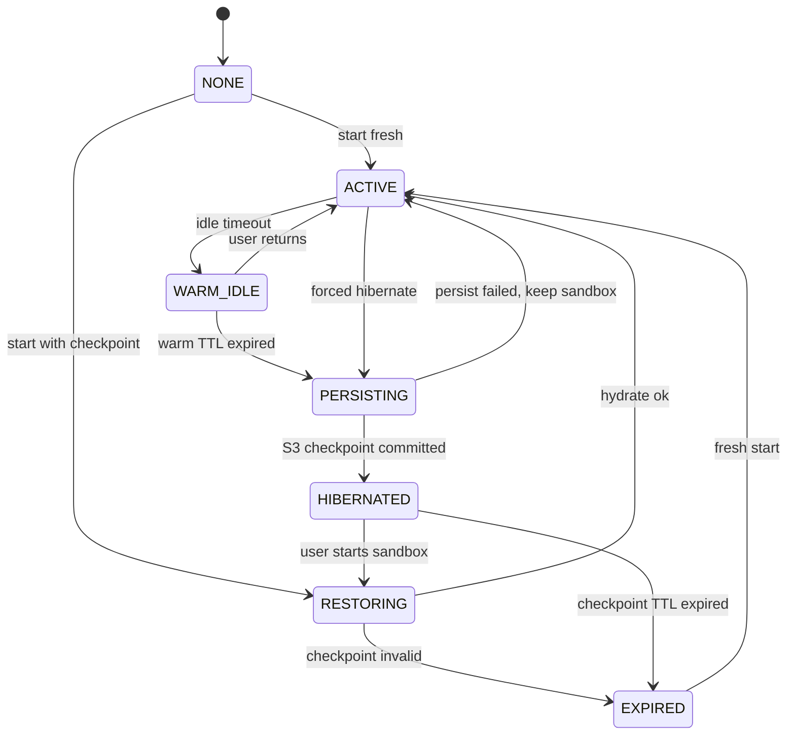

# Dedicated Sandbox Checkpoint Lifecycle Design

Original issue: [#3335](https://github.com/azents/azents/issues/3335)
Design discussion: [Discussion #3478](https://github.com/azents/azents/discussions/3478)

Implementation spec: [spec/flow/sandbox-checkpoint-lifecycle.md](./sandbox-260521-sandbox-control.md)

## Overview

Redefine durable workspace of dedicated agent sandbox around `/home/sandbox`. If user returns within short time, runtime continues almost as-is; after long time, system gives up compute/rootfs continuity but restores `/home/sandbox` files from S3/RustFS checkpoint.

There are three core goals.

1. Preserve `/home/sandbox/**` as long-term durable workspace contract.
2. Treat warm runtime and OCI snapshot as short-term continuity layer to preserve user experience.
3. Prevent data loss by forbidding sandbox teardown before checkpoint persist succeeds.

## User Scenarios

### Return after short time

User briefly leaves during work and returns. In this case, sandbox pod/container remains as-is, and installed packages, running dev server, and cache are preserved. User continues without waiting for separate restore.

### Return after medium time

Warm runtime TTL passed and compute is gone, but short-term OCI snapshot remains. System restores runtime continuity as much as possible with OCI snapshot, and corrects it not to conflict with authoritative checkpoint of `/home/sandbox`.

### Return after long time

OCI snapshot TTL also passed. System starts fresh base sandbox and hydrates `home-sandbox.tar.zst` from S3/RustFS into `/home/sandbox`. System install, running service, and cache are not guaranteed, but workspace files are preserved.

## Current Structure

Current sandbox lifecycle owner is `AgentRuntime.id`. Name `SessionSandboxManager` remains, but cache key and DB runtime owner operate based on `agent_runtime_id`.



Current limitations:

- runtime state is expressed only as `active | hibernated | expired` and `NULL`; there is no `persisting/restoring`.
- hibernate/restore is centered on OCI rootfs image snapshot.
- `/home/sandbox` and `/tmp/agent` are `emptyDir`, so they have no own durable storage after pod deletion.
- Workspace File API does not express hibernated runtime as DB state and returns cache miss as `SANDBOX_INACTIVE`.
- Flow that may proceed to teardown after snapshot failure does not fit `/home/sandbox` durable contract.

## Target Structure



Authority is separated as below.

| Layer | Purpose | Preserved target | Authority |
|---|---|---|---|
| Warm runtime | immediate resume UX | running process, install, cache, `/home/sandbox` | running sandbox |
| OCI snapshot | short-term runtime continuity/restore acceleration | rootfs diff | optional continuity layer |
| S3 checkpoint | long-term workspace durability | `/home/sandbox/**` | authoritative long-term source |

## Decisions

### 1. Checkpoint target and format

Only `/home/sandbox/**` is included in checkpoint. `/tmp/agent/uploads/**` and `/tmp/**` are excluded.

Format is fixed to `tar.zst`. Object file name uses `home-sandbox.tar.zst`. Future format migration is handled by extending `format` enum of new checkpoint row, but initial implementation of this design creates only `tar_zst`.

### 2. Upload/download boundary

apiserver issues presigned PUT/GET URL and sandbox worker directly uploads/downloads to S3/RustFS. Long-term S3 credential is not injected into sandbox.

### 3. Runtime state machine

runtime state expresses following states as DB-persisted enum.

```text
none -> active
none -> restoring -> active
active -> persisting -> hibernated
persisting -> active
hibernated -> restoring -> active
restoring -> expired
hibernated -> expired
expired -> active
```

`none` can be compatible with existing `runtime_state = NULL`, but API/state transition layer treats it as first-class state.

Because `persisting` and `restoring` are in-flight states remaining in DB, stuck recovery policy is needed. manager records transition owner with `runtime_claimed_at`, `runtime_run_id`, or same lease field, and next lifecycle loop recovers in-flight state exceeding timeout. If `persisting` becomes stale and sandbox is alive, return to `active`; if sandbox already disappeared but no checkpoint commit exists, leave as operator-visible failure instead of `expired`. If `restoring` becomes stale, clean partial sandbox and return to `hibernated` or record checkpoint invalidation reason.

### 4. Persist method

Persist assumes quiesce. However, instead of stopping and compressing entire `/home/sandbox` every time, default design is `continuous shadow sync + final quiesced rsync + shadow tarball`.



Do not delete sandbox when checkpoint persist fails. Failed runtime returns to `active` or remains in retryable state. Presigned PUT is retried idempotently with object key based on checkpoint id. DB metadata commit happens only after object upload, size/sha256 verification, and object existence check. If partial upload remains, it must be overwritable with same checkpoint id or removable by cleanup job.

### 5. Hydrate method

Hydrate is restore gate, not active container pause.



Before restore completes, do not expose as `READY` to Workspace API and tooling.

Restore precedence is `warm runtime -> valid OCI snapshot -> fresh base + S3 checkpoint`. Even if OCI snapshot restores rootfs continuity, long-term authority for `/home/sandbox` is S3 checkpoint, so if checkpoint metadata is newer after OCI restore, reconcile `/home/sandbox` with S3 hydrate. If S3 checkpoint is missing/corrupt, return `RESTORE_FAILED` API status and DB state does not remain `restoring`. Implementation chooses either transition to `expired` or separate failure metadata, but must clearly expose fresh start availability and possible data loss to user.

### 6. Metadata model

Separate S3 checkpoint into new `sandbox_checkpoints` table/model/repository/service. Existing `kubernetes_sandbox_snapshots` is OCI snapshot metadata, so do not mix with S3 checkpoint.

Recommended fields:

```text
sandbox_checkpoints
- id
- agent_runtime_id
- workspace_id
- object_key
- kind: hibernate | debounce | manual
- format: tar_zst
- size_bytes
- sha256
- created_at
- restored_at nullable
- invalidated_at nullable
- invalidation_reason nullable
```

object key:

```text
sandbox-checkpoints/{workspace_id}/{agent_runtime_id}/{checkpoint_id}/home-sandbox.tar.zst
```

Latest lookup uses DB row as authority. Do not infer latest by S3 prefix listing.

### 7. Workspace File API UX

Workspace File API does not create automatic restore side effect with GET request in hibernated state.

- `GET /workspace`: returns `READY`, `SANDBOX_INACTIVE`, `HIBERNATED`, `RESTORING`, `RESTORE_FAILED`. `RESTORE_FAILED` is user-facing API status, not DB enum; DB stores cause through `expired` transition or checkpoint invalidation metadata.
- file list/read/download: if not active, return state response with restore/start action.
- `POST /workspace/sandbox/start`: entrypoint of restore orchestration for hibernated runtime.
- If restore is quick, return `READY` synchronously; if beyond threshold, continue with `RESTORING` + polling.
- `exchange://...` download is independent of sandbox restore.

### 8. Hierarchical lifecycle



`WARM_IDLE` is API/UX concept; implementation plan decides whether it becomes DB enum or `active + idle timestamp`. Important product policy is keeping sandbox as-is during warm TTL.

## API Changes

### Workspace manifest

Workspace manifest reflects runtime state based on DB.

```json
{
  "status": "HIBERNATED",
  "restore_action": {
    "method": "POST",
    "path": "/chat/v1/sessions/{session_id}/workspace/sandbox/start"
  },
  "checkpoint": {
    "format": "tar_zst",
    "created_at": "2026-05-07T14:00:00Z",
    "size_bytes": 12345678
  }
}
```

### Start sandbox

`POST /workspace/sandbox/start` behaves differently by state.

| Current state | Behavior |
|---|---|
| `none` | fresh sandbox start |
| `active` | return existing sandbox |
| `hibernated` | start restore |
| `restoring` | return current restore status |
| `expired` | fresh sandbox start possible |

## Infrastructure Changes

- S3/RustFS bucket/prefix reuses existing nointern S3 settings.
- sandbox pod must be able to access S3/RustFS endpoint with presigned URL.
- sandbox image or checkpoint runner must be able to use `rsync`, `tar`, `zstd`.
- OCI snapshot layer remains as short-term continuity layer, not long-term authority.

## Feasibility Verification

| Item | Judgment | Rationale |
|---|---|---|
| AgentRuntime-based owner | possible | current manager/repo uses `agent_runtime_id` |
| S3/RustFS storage | possible | Exchange file storage and S3 DI already exist |
| presigned URL | needs addition | current S3 helper needs streaming/presign API enhancement |
| tar.zst | needs addition | sandbox worker command and image dependency needed |
| DB state extension | possible | enum/migration/repo transition addition needed |
| Workspace UX | possible | extend existing manifest/start API |

## Testenv QA Scenarios

1. `TC-SC-CHK-001`: create `/home/sandbox` file → hibernate → restore → verify file preserved.
2. `TC-SC-CHK-002`: create `/tmp/agent/uploads` file → hibernate → restore → verify file not preserved and re-import guidance.
3. `TC-SC-CHK-003`: inject checkpoint persist failure → verify sandbox is not torn down and remains `active`.
4. `TC-SC-CHK-004`: query hibernated workspace manifest → verify `HIBERNATED` and start action.
5. `TC-SC-CHK-005`: query workspace manifest during restore → verify `RESTORING` polling.
6. `TC-SC-CHK-006`: reconnect within warm runtime TTL → verify existing sandbox reused without checkpoint.

## Implementation Plan

1. State/model foundation: enum extension, `sandbox_checkpoints` metadata, repository/service skeleton.
2. Presigned checkpoint transfer: S3 presign helper, sandbox-control checkpoint command, tar.zst upload/download.
3. Lifecycle integration: hibernate persist, restore hydrate, failure semantics, warm/OCI/S3 precedence.
4. Workspace API integration: extend manifest/start/file operation UX.
5. QA/spec promotion: testenv scenarios, living spec update, design archive.

## Alternatives Considered

### Include `/tmp/agent` in checkpoint

Rejected because transient import cache and user-facing Exchange Storage contract become mixed.

### apiserver tar creation

S3 credential boundary becomes simple, but large workspace creates file API fan-out and memory/streaming burden.

### Remove OCI snapshot

Rootfs snapshot can be removed long-term, but product intent is to provide short-term runtime continuity. Therefore OCI snapshot remains as TTL-based continuity layer, not long-term authority.

### Automatic restore on GET file operation

User experience is simple, but GET request creates expensive side effect, so restore is explicit through start endpoint.
