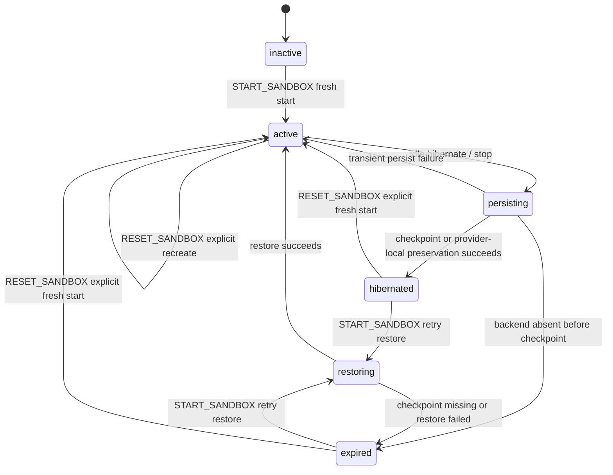

# Sandbox Restore Retry and Explicit Reset

## Problem / Background

Session Workspace sandbox treats `/home/sandbox/**` as user-visible durable workspace. In K8s provider, S3/RustFS checkpoint is durable source; in Docker/provider-local home preservation provider, provider-local home directory is durable source.

Production incident revealed these problems.

1. Runtime could be recorded as `HIBERNATED` even when K8s Pod already disappeared and checkpoint could not be created.
2. When `HIBERNATED` runtime had no checkpoint or restore failed, API returned 200 response but UI did not sufficiently communicate failure state and options.
3. After failure, it was ambiguous whether `Start Sandbox` meant restore retry or empty sandbox initialization.
4. Even without failure, user should be able to explicitly reset Agent sandbox.

If generic start/resume API such as `Start Sandbox` implicitly creates empty sandbox, data loss can look like "successful recovery." Therefore, restore retry and reset must be separated as different user choices.

## Goals

- `START_SANDBOX` performs only idempotent start/resume/retry-restore.
- `RESET_SANDBOX` discards `/home/sandbox` durable state and creates fresh sandbox only when explicitly chosen by user.
- `RESTORE_FAILED` UI shows "retry" and "reset" as separate actions.
- Agent settings also provides sandbox reset button.
- K8s checkpoint provider and Docker/provider-local home preservation provider have same reset semantics.
- If backend is already `ABSENT`/`TERMINATING` before checkpoint creation, record `EXPIRED` instead of recording `HIBERNATED` without checkpoint.

## Non-goals

- Do not handle checkpoint object recovery, user-facing backup selection, or checkpoint history browser.
- Do not extend AgentRuntime schema with new state enum.
- reset confirmation phrase, audit event, and RBAC enhancement are not required scope of this PR.
- Do not add new protobuf command to provider protocol. Use existing delete command's `preserve_home=false` semantics for reset.

## State Contract

`EXPIRED` means the current durable source is missing, invalid, or unavailable for restore. It does not authorize automatic fresh allocation. Only `RESET_SANDBOX` may discard the failed durable state and create a new empty `/home/sandbox`.

## API Contract

Session Workspace actions expose separate action types:

- `START_SANDBOX`: start fresh if no durable state exists, attach active runtime, or retry restore.
- `STOP_SANDBOX`: persist/hibernate an active sandbox.
- `RESET_SANDBOX`: discard current sandbox durable state and start an empty sandbox.

`GET /chat/v1/sessions/{session_id}/workspace`:

- `SANDBOX_INACTIVE` includes `start_action`.
- `HIBERNATED` includes `start_action` and `reset_action`.
- `RESTORE_FAILED` includes `start_action` and `reset_action`.
- `READY` includes `stop_action` and `reset_action`.

`POST /chat/v1/sessions/{session_id}/workspace/sandbox/start`:

- idempotently attaches/starts/resumes the AgentRuntime.
- may retry restore for `HIBERNATED` or `EXPIRED`.
- must not create an empty fresh sandbox for a `HIBERNATED` runtime whose checkpoint is missing.
- must not create an empty fresh sandbox after restore corruption/failure.

`POST /chat/v1/sessions/{session_id}/workspace/sandbox/reset`:

- requires the same session access check as start/stop.
- resets the AgentRuntime-owned sandbox, not only the current AgentSession view.
- removes local manager cache for the runtime.
- invalidates latest S3/RustFS checkpoint metadata if a checkpoint service is configured.
- deletes provider compute with `preserve_home=false`, even when the provider normally supports home preservation.
- starts a fresh empty sandbox and marks runtime `ACTIVE`.

Agent settings exposes the same reset operation by active session lookup:

- Web resolves the team primary session for the agent, then calls `resetSessionWorkspaceSandbox(sessionId)`.
- This keeps backend authorization/session ownership checks centralized in the Session Workspace API.

## Backend Design

`SessionSandboxClient` gains `reset_session(session_id)` as a lifecycle method. Default implementation delegates to `delete_session` for backends without provider-local home preservation. Provider-control overrides it to send `RuntimeDeleteCommand(preserve_home=false, reason="reset")`.

`SessionSandboxManager.reset_runtime(...)` performs the explicit reset sequence:

1. Resolve/create AgentRuntime for the Agent.
2. Remove process-local handle and current-session mapping for the runtime.
3. Invalidate latest checkpoint metadata with reason `manual_reset` when checkpoint service exists.
4. Call `client.reset_session(runtime_id)`.
5. Call provider allocation/readiness for a fresh sandbox.
6. Install a new local handle for the current session and mark runtime `ACTIVE`.

`get_or_allocate_runtime(...)` keeps start/resume semantics. It may call restore for `EXPIRED`, but if checkpoint is missing or restore fails, it returns `RESTORE_FAILED` rather than falling back to fresh allocation.

## Frontend Design

Workspace panel:

- inactive/hibernated: one start button.
- restore failed: primary retry restore button, plus a smaller subtle reset button below it with a confirmation modal.
- ready: existing file browser and stop control; reset is intentionally not exposed in the normal workspace panel.

Agent settings:

- Add a sandbox reset action in the danger section.
- The action is available independent of current restore failure state.
- Confirmation copy must say that `/home/sandbox` files and provider-local sandbox state are discarded.

## Test Strategy

Primary unit tests:

- hibernate with backend already absent expires instead of hibernating.
- hibernated checkpoint missing marks runtime expired and does not allocate fresh sandbox.
- start from `EXPIRED` retries restore and does not create fresh sandbox when checkpoint remains missing.
- explicit reset invalidates checkpoint, deletes provider with `preserve_home=false`, allocates fresh sandbox, and marks runtime active.
- Session Workspace service returns `RESTORE_FAILED` with both start/reset actions.

Frontend checks:

- nointern-web typecheck validates generated response shape.
- Workspace panel story covers restore-failed two-action UI.
- Agent settings renders reset action and calls the reset mutation.
