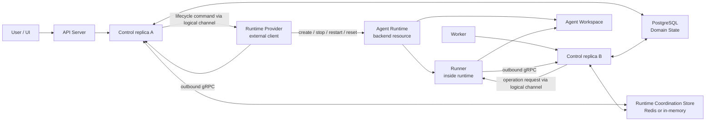

# Agent Runtime System Redesign

## Status

Implemented. This document is a design record that translated agreements from [sandbox-260525/ADR: Sandbox System Redesign](../adr/sandbox-260525-sandbox-redesign.md) into Agent Runtime stacked PR implementation. Current system behavior should be verified against Living Specs, especially [Agent Runtime Control](../spec/flow/agent-runtime-control.md) and [Agent Runtime Persistence](../spec/flow/agent-runtime-persistence.md).

## Background

Legacy Sandbox system repeatedly changed scope and mixed boundaries between `runtime`, `sandbox`, `session workspace`, `provider`, `sandbox-control`, and `sandbox daemon`. This caused recurring problems:

- Runtime backend was alive while UI thought Sandbox was off, or Runner was not attached while UI thought file/command operations were usable.
- API/Worker/UI inferred Runtime lifecycle and in-Runtime operation from same state.
- Non-durable states such as `handle`, process-local cache, and active session lookup were used like source of truth in distributed system.
- Query APIs caused state changes, or user start/reset was treated as immediate side effect success instead of idempotent desired state change.
- `/home/sandbox` path and S3 checkpoint/restore implementation leaked into upper domain.
- Kubernetes Provider, Docker Provider, Runner, and Control were coupled as if they were same-process internals, making rollout, reconnect, Pod eviction, and Worker move fragile.

Goal of this redesign is not to preserve legacy data and API, but to redefine system as new domain: Agent-scoped stateful runtime with stable control plane.

## Goals

- Remove Sandbox from user/domain concept and make Agent Runtime top-level execution abstraction.
- Clearly separate responsibilities of Runtime Provider, Runner, Control, and Agent Workspace.
- Make all Runtime lifecycle changes idempotent desired-state changes.
- Keep Control replicas stateless and store domain state durably in PostgreSQL.
- Separate active coordination needed for cross-Control routing, in-flight operations, and Worker resume into Runtime Coordination Store abstraction.
- UI displays server-calculated summary/actions instead of defining Provider/Runner state combinations itself.
- Treat Agent Workspace path as Runtime metadata and remove `/home/sandbox` hardcoding.
- Split Kubernetes Provider and Docker Provider into external components, not NoIntern server internals.
- Remove legacy sandbox/session workspace/checkpoint by clean-state migration.

## Non-goals

- Backward compatibility for legacy Sandbox data and APIs.
- Support every Provider type in first implementation.
- Complete productization of workspace-provided Provider credentials.
- Allow external absolute path access by default.
- Store full stdout/stderr as long-term durable history.
- Fix Control routing store implementation to Redis only.

## Terminology

### Agent Runtime

Agent Runtime is stateful execution abstraction per agent. It enables agent to use code execution, file persistence, file transfer, and other runtime-protocol-defined features. Legacy Sandbox remains an implementation detail of Runtime.

### Runtime Provider

Runtime Provider is an external component that provides backend resource for Agent Runtime. Provider creates, starts, stops, restarts, resets, and observes Runtime. Code execution and file transfer are not Provider responsibility.

Provider is divided into system-provided Provider and workspace-provided Provider. System-provided Provider is shared provider available to all workspaces. Workspace-provided Provider supplies Runtime only for Agents belonging to specific Workspace.

### Runner

Runner runs inside Runtime and connects to Control. Runner proves which Agent Runtime it belongs to and performs bash execution, file listing, file read/write, and streaming responses according to Control requests.

### Control

Control is NoIntern Runtime control plane. It accepts Provider and Runner connections, durably manages Runtime state, and provides state/actions to API/Worker/UI.

### Agent Workspace

Agent Workspace is file workspace shared by Agent and user inside Runtime. Provider guarantees persistence of Agent Workspace. Agent Workspace is not necessarily `/home/sandbox`; absolute path reported by Provider as Runtime metadata is the single standard.

### Project

Project keeps previous definition. Project is repo or folder unit inside Agent Workspace, not Runtime lifecycle unit.

## Architecture

Core topology:

- Provider and Runner are both external clients connecting to Control. NoIntern does not outreach to Provider or Runner.
- Provider path and Runner path are separated. Provider path handles lifecycle/observe/event; Runner path handles in-runtime operation.
- Control replica is stateless process that can be replaced anytime. Source of truth for Runtime state is PostgreSQL, not process memory.
- Provider, Runner, and Worker requests for same Runtime may be attached to different Control replicas, so routing between Control replicas is required.
- Routing does not target a specific Control replica. Publisher does not know consumer replica and publishes request to Runtime logical channel.
- Connection registry is used only for generation fencing, connection availability, duplicate registration judgment; not for routing target lookup.

## Component Design

### Control

Control separately manages:

- desired state: final Runtime state wanted by user.
- provider observed state: state Provider observed from backend resource.
- provider connection state: connection state between Provider client and Control.
- runner state: whether in-Runtime operation can be performed.

Control does not directly perform lifecycle command on backend. Control sends command to Provider, receives Provider event, stores durable state, and reconciles desired/observed mismatch.

Query APIs do not create side effects. Runtime query, workspace query, and UI summary query only read stored durable state. State changes happen only from user lifecycle command, Provider event, Provider reconnect, Runner reconnect, and periodic reconciliation tick.

### Runtime Provider

Provider does not import or share NoIntern server internal module, DB session, repository, or process-local manager. Provider communicates with Control only through Provider Protocol.

Provider responsibilities:

- Create, start, stop, restart, reset Runtime backend resource.
- Guarantee Agent Workspace persistence.
- Report Runtime backend observed state.
- Report Provider capability and Agent Workspace path.
- Inject Runner auth material into Runtime.

Provider non-responsibilities:

- bash/file/code operation processing.
- final Agent permission decision.
- session/message storage.
- Runner operation result storage.
- direct access to NoIntern DB.

### Runner

Runner owns in-Runtime operations. Runner connects with runtime-scoped auth material generated by Control and is fenced by Runtime id and Runner generation.

Runner responsibilities:

- bash execution.
- Agent Workspace file list/read/write/upload/download.
- send operation heartbeat/progress/final events.
- report active operation set on reconnect.
- report Agent Workspace path consistency.

Runner generation change is a failure boundary for running operations. If Runner restarts and reconnects with new generation, operations from previous generation are not resumed and instead finish as lost or failed.

### Runtime Coordination Store

Runtime Coordination Store is abstraction for active coordination among Control replicas. Distributed deployment can use Redis Streams; standalone deployment must be able to use in-memory implementation.

Stored in Coordination Store:

- Provider command request stream.
- Runner request stream.
- request body stream.
- reply stream.
- active operation metadata.
- operation heartbeat / last event timestamp.
- connection registry and generation fencing token.
- routing grace period state.
- background completion claim state.

Coordination Store is not domain state storage. After operation ends and foreground response completes, or background completion is published to Worker input queue, operation metadata and reply stream may be cleaned up.

### PostgreSQL Domain State

PostgreSQL stores values that remain system domain state even if Control replica dies:

- Agent Runtime settings.
- Runtime Provider registration and scope.
- Agent `runtime_provider_id`.
- provider-specific config.
- desired state and desired generation.
- provider observed state and observed generation.
- final provider/runner availability judgment.
- Agent Workspace path metadata.
- failure summary for current generation.
- parent session history.

### Worker Input Queue

Background Runtime operation result is not written directly to session history by Control. Control enqueues structured background completion event into Worker input queue with idempotency key. Worker handles this event through normal input dispatch path and converts it into parent session message.

## State Model

### Desired State

Desired state has only `running` and `stopped`. `restart` and `reset` are commands, not stable states. start/stop/restart/reset all increment desired generation. Therefore retry after failure is handled by calling same start/stop action again to change generation, not by separate retry command.

### Provider Observed State

Provider observed state: `unknown`, `stopped`, `starting`, `running`, `stopping`, `recovering`, `resetting`, `failed`.

`running` means backend resource is up. It does not mean Runner is usable.

### Provider Connection State

Provider connection state has only `connected`, `disconnected`. Missing provider config, permission failure, or capability mismatch is represented as separate domain error, not connection state.

### Runner State

Runner state: `unknown`, `disconnected`, `starting`, `ready`, `degraded`, `failed`. Normal Runner request is allowed at `ready`. Operations allowed in `degraded` are determined by Runner capability/health metadata.

### Summary and Actions

Server calculates UI summary/actions from raw state axes. UI does not define state combinations.

Summary has user meanings such as stopped, starting, running, stopping, resetting, recovering, provider disconnected, runner unavailable, failed.

Actions include can start, can stop, can restart, can reset, can use runner. If backend resource is running, stop/restart/reset must be exposed even if Runner is not attached. Runner operation availability is represented only by can use runner.

Failure summary is calculated only for current desired generation. Failure from past generation is not reflected in current summary.

## Lifecycle Semantics

### start

start sets desired state to `running` and increments desired generation. If Provider is connected, send start or recover command to Provider. Even if already running or starting, duplicate resource must not be created.

### stop

stop sets desired state to `stopped` and increments desired generation. Provider may stop or remove backend resource but must preserve Agent Workspace data.

### restart

restart keeps final desired state as `running`. If Provider supports native restart, use it; otherwise implement as stop+start orchestration. restart does not delete Agent Workspace.

### reset

reset is the only destructive command that may delete Agent Workspace. reset must receive final desired state as argument. If start/stop arrives during reset, do not interrupt current transition; only update latest desired state/generation. After reset completes, Control reconciles against latest desired state.

### command during transition

While Provider observed state is `starting`, `stopping`, `resetting`, or `recovering`, new lifecycle command does not interrupt current transition. New request only durably updates desired state and generation. When transition completes, Control compares latest desired state and observed state and performs next transition.

### command while provider disconnected

Even in Provider disconnected state, start/stop may be recorded as desired state change. Provider command dispatch is recorded as blocked; after reconnect, observed state is received again and reconciled. reset is destructive and is not queued while Provider disconnected.

## Protocol Design

### Transport

Transport between Provider/Runner and Control defaults to gRPC because it is favorable for auth, simplicity, generality, binary payload, and streaming. Control/API/Worker can use same protocol family unless there is separate reason. Bidirectional streams are used only where needed.

### Provider Protocol

Provider registration includes provider id, provider type, scope, workspace id, protocol version, capabilities, config schema version, metadata, auth credential.

Provider runtime report includes runtime id, provider id, provider generation, observed state, observed desired generation, Agent Workspace path, reason, diagnostic. On reconnect, Provider must re-report observed state of Runtime it can own.

Provider command is idempotent by runtime id + desired generation + command kind. Provider must tolerate duplicate delivery. Provider event includes provider generation to prevent stale event acceptance.

### Runner Protocol

Runner registration includes runtime id, runner generation, protocol version, Agent Workspace path, supported operation capabilities, health metadata.

Runner request includes operation id, runtime id, runner generation, deadline, request body reference or stream. Runner replies through reply stream with progress, stdout/stderr chunks if applicable, file payload references, final status, and diagnostic.

Runner must heartbeat active operations. Control treats heartbeat expiry as operation interrupted/lost depending on generation and connection state.

## Query and Operation Semantics

Query API does not create side effect. Operation API routes only when Runner state is usable. Lifecycle API is processed based on Provider state and Provider connection state.

## Frontend Design

Frontend displays server-provided summary/actions. FE does not directly combine Provider observed state, Provider connection state, and Runner state to define "starting", "restore failed", or "running".

UI principles:

- If Agent Runtime backend is running, show stop button even when Runner unavailable.
- Runner unavailable is problem of Agent Workspace/file/bash operation, not lifecycle.
- In Failed state, distinguish retrying same action from reset.
- Reset is destructive, so use confirm modal.
- Provider disconnected means "cannot perform lifecycle command through Provider", not "Runtime is off".
- Use Agent Workspace terminology and remove Session Workspace terminology.

## Kubernetes Provider Design

Kubernetes Provider is external component independent from NoIntern server. Whether it is deployed in same namespace or shares ServiceAccount is operator choice and does not change software boundary.

Kubernetes Provider allows replicas >= 2. Active owner is kept single through Kubernetes Lease-based leader election. Standby replica acquires Lease when leader is lost and reconnects to Control with new provider generation. Control generation fencing protects against stale event and split brain.

Kubernetes Provider provides one Runtime as bundle of Kubernetes backend resources. Initial persistence default is EBS-backed PVC per Runtime. EFS is excluded from default due to capacity limit and performance issues. S3 checkpoint is only archive/export/backup capability, not canonical persistence.

Kubernetes Pod/container condition can be input deriving backend runner condition, but final Runner usability is calculated together with Runner connection/generation from Control.

EBS PVC AZ pinning, idle cost, and quota issues are mitigated by Provider capacity reporting, workspace size limit, idle retention/archive, and StorageClass `WaitForFirstConsumer`. Optimization is handled in later implementation phase.

## Docker Provider Design

Docker Provider is also independent external component. It is defined for local/dev, single-host, small deployment on stable single Docker host. Multi-host HA, host failure recovery, and strong multi-tenant isolation are not default scope.

Docker Provider implements one Runtime as one Docker container. Runner runs inside container and connects outbound to Control.

Agent Workspace persistence is implemented as provider-managed host directory bind mount. stop deletes container but keeps host workspace directory. start creates container mounting existing directory. restart recreates container and preserves workspace directory. reset deletes container then deletes/recreates host workspace directory.

Docker Provider does not use S3 checkpoint/restore as canonical persistence. On Provider process restart, it scans Docker API, container labels, and host workspace directory and re-reports observed state to Control.

## Deployment and Delivery Design

New Runtime system separates artifact, registry, and GitOps deployment boundaries from legacy Sandbox system, not just code structure. Provider and Runner are external components and must be built, deployed, and versioned independently rather than implicitly bundled inside NoIntern server image.

### Container images and ECR

Initial production artifacts are split into images:

- `nointern-server`: existing server image containing API/Worker/Scheduler/Control server code.
- `nointern-runtime-runner`: Runner image executed inside Runtime. Kubernetes Provider and Docker Provider use this when creating Runtime.
- `nointern-runtime-provider-kubernetes`: external Provider controller image managing Kubernetes backend resources.
- `nointern-runtime-provider-docker`: local/dev/single-host Docker Provider image. Not default production multi-tenant Provider, but must be buildable as same protocol artifact.

ECR repositories are managed by Terraform/Terragrunt nointern infra. GitHub Actions workflow does not create ECR repository directly; it pushes image to already provisioned repository.

Image tag policy follows existing production server image policy:

- PR: build/test only, no production ECR push.
- main merge: push `${github.sha}` tag.
- If operators need stable tag, define separate `latest` or environment tag policy. ArgoCD production should use immutable sha tag when possible.

### GitHub Actions

Runtime system implementation must update GitHub Actions:

- Add jobs to build Runner image and Kubernetes Provider image.
- Docker Provider image is mainly for local/dev deployment, but same Dockerfile must be buildable in CI. ECR push can be main-only optional job if needed.
- PR runs Docker build, unit/static validation, Helm template validation only.
- After main merge, login to ECR and push sha tag.
- Build context is clearly fixed to repo root or package root, and `.dockerignore` excludes unnecessary context.
- Manual image push is not an operation path. Deployable image must be artifact created by GitHub Actions.

### Helm chart

NoIntern Helm chart must have values contract that can deploy Runtime system. Use `infra/charts/nointern/` as canonical chart surface to avoid drift with existing chart.

Helm values must at least express:

- Runtime settings env for Control/API/Worker:
  - Runtime Coordination Store endpoint.
  - Provider registry / auth secret reference.
  - Runner auth material signing/issuing secret reference.
- Kubernetes Provider component:
  - enabled flag.
  - image repository/tag/pullPolicy.
  - replicas, resources, nodeSelector/toleration/affinity.
  - ServiceAccount, RBAC, Pod Identity or IRSA settings.
  - leader election Lease namespace/name.
  - default StorageClass, PVC size, workspace retention policy.
  - Runner image repository/tag and Agent Workspace default path policy.
- Runner image reference:
  - image repository/tag injected by Provider when creating Runtime Pod/container.
  - Runner protocol version/capability metadata.

Runtime-specific Pod/PVC is not rendered directly by Helm chart. Kubernetes Provider dynamically creates those backend resources according to lifecycle command. Helm chart deploys Provider and gives Provider permissions, image, storage defaults, and secret references.

### ArgoCD

Production deployment must be included in ArgoCD GitOps path. Since Runtime Provider is independent component from NoIntern server, it should be managed as separate component/Application in ArgoCD by default.

Recommended structure:

- `nointern-server` Application deploys API/Worker/Scheduler/Control server.
- `nointern-runtime-provider-kubernetes` Application deploys Kubernetes Provider.
- `nointern-runtime-runner` is not directly deployed as Kubernetes workload when unnecessary; it is passed only as image reference in Provider values.
- Existing `nointern-sandbox` ArgoCD path is replaced or deleted by new Runtime system.

ArgoCD values are managed as complete `valuesObject`. Since overlay patches are not deep-merged under existing chart rules, do not scatter runtime provider values as patch fragments.

Image tag update method uses sha tag pushed to ECR by GitHub Actions after main merge and reflects it in GitOps manifest/values. Feasibility check decides whether to use automatic tag update or PR-based manifest update according to current repo operations.

### Done condition after final merge

Feature does not end at "code reached main". When all phase PRs merge, production must be automatically deployed to new Agent Runtime structure. Manual image push, manual `kubectl apply`, and manual ArgoCD values edits are not valid done condition.

Deployment contract after final phase merge:

- GitHub Actions pushes `nointern-server`, `nointern-runtime-runner`, `nointern-runtime-provider-kubernetes` images to ECR.
- GitOps manifest or Helm values points at image tag used in production.
- ArgoCD root/application graph includes Kubernetes Runtime Provider Application.
- Legacy `nointern-sandbox` provider-control deployment path is replaced or explicitly disabled/pruned.
- NoIntern server production env uses Runtime Coordination Store, Runtime Provider registry, Runner auth settings instead of legacy sandbox control settings.
- Kubernetes Provider is deployed in production namespace with replicas >= 2, PDB/HPA or equivalent availability settings, Lease leader election, required RBAC/ServiceAccount/Pod Identity.
- Runtime Pod created by Kubernetes Provider uses Runner image from ECR and uses EBS-backed PVC per Runtime as Agent Workspace persistence.
- Production UI/API uses Agent Workspace and Agent Runtime state summary/actions and does not depend on Session Workspace/Sandbox legacy branches.

Therefore implementation phases must finally connect these PR categories:

1. Artifact PR: Dockerfile, workflow, ECR repository contract, build/test/push job.
2. GitOps PR: Helm values/templates, ArgoCD Application/root registration, production overlay image reference, secret/IAM/RBAC contract.

Final cutover PR changes feature flag or config default to new Runtime path and includes production GitOps manifest in same PR. Therefore when final PR merges to main, ArgoCD deploys new structure, and old sandbox provider-control path must no longer receive production traffic.

### Infra / Secret / IAM

Runtime Provider deployment requires infra updates:

- ECR repositories:
  - `nointern-production-server/nointern-runtime-runner`
  - `nointern-production-server/nointern-runtime-provider-kubernetes`
  - optional `nointern-production-server/nointern-runtime-provider-docker`
- Kubernetes Provider ServiceAccount and Pod Identity/IRSA permissions:
  - required K8s resource permissions such as Pod, PVC, Secret or projected token, Lease, Event.
  - StorageClass access for EBS PVC managed by cluster storage policy.
- Provider credential / Runner auth signing material:
  - injected through ExternalSecret or SSM Parameter Store.
  - Provider must not have NoIntern DB credential.
- Runtime Coordination Store endpoint:
  - Redis/Valkey endpoint and auth secret injected into server/Control.

Infra changes share contracts such as Helm chart values, ArgoCD values, and GitHub Actions ECR repository names, so drift must be checked in same or adjacent phase.

## Data and Migration

New design does not treat legacy Sandbox system as compatibility target. Existing sandbox/session workspace data is deleted or reinitialized against new schema if needed.

Migration principles:

- Replace `session workspace` naming and API with Agent Workspace.
- Redefine Runtime API by Agent and remove active session lookup.
- Remove `/home/sandbox` hardcoding and use Agent Workspace path from Runtime metadata.
- Move checkpoint/restore responsibility to Provider implementation details.
- Remove process-local handle/cache based state judgment.
- Replace FE state branches with server summary/actions.

## Error Taxonomy and Observability

User-facing error code stays short and stable:

- provider_not_found
- provider_disconnected
- provider_capability_mismatch
- provider_config_invalid
- runtime_start_failed
- runtime_stop_failed
- runtime_reset_failed
- runner_unavailable
- operation_lost
- operation_interrupted
- operation_expired
- workspace_path_invalid
- workspace_path_mismatch

Expected domain failure is not sent as Sentry error. Provider disconnected, Runner unavailable, operation expired, and user cancel are domain states. Protocol violation, generation invariant violation, storage invariant violation are recorded as errors.

Logs/metrics/traces include agent id, runtime id, operation id, desired generation, provider generation, runner generation.

## Feasibility Check Result

On 2026-05-25, the draft was checked against actual code and operational constraints. Conclusion: no blocker was found that requires design change. However, existing code already partially uses AgentRuntime name while internal state/protocol/deployment boundary is still Sandbox-centered, so implementation should proceed as clean-state replacement rather than compatibility-wrapper refactor.

| Item | Question to verify | Method | Result |
| --- | --- | --- | --- |
| Sandbox clean-state removal | Can legacy Sandbox domain be removed and Agent Runtime become top-level concept? | explore backend API/RDB/runtime module surface | possible but large blast radius. Existing `runtime/sandbox/__init__.py`, `api/public/sandbox_setting/v1`, `rdb/models/sandbox_setting.py`, `rdb/models/sandbox_provider.py`, `rdb/models/sandbox_runtime_lease.py` still treat Sandbox as first-class domain. Keeping old name as compatibility alias blurs boundary, so create new runtime-control schema/service first and delete legacy sandbox surface in later phase. |
| Agent-based runtime API | Can Runtime be one per Agent and remove active session lookup? | compare AgentRuntime model/repository/API/worker paths | partial foundation exists. `agent_runtimes` has unique `agent_id` and `ensure_for_agent()`. But `current_session_id` remains in `agent_runtimes`, repository/worker/runtime manager resolve execution through current session, and public API now resolves team-primary sessions through `/agents/{agent_id}/team-primary-session`. Domain schema/API phase must keep `current_session_id`-based runtime lookup removed. |
| PostgreSQL Runtime state | Can desired/provider observed/provider connection/runner state be durable source of truth? | compare `agent_runtimes`, sandbox lease, registry storage | possible but extension-only is insufficient. Current `RDBAgentRuntime` has `run_state`, `runtime_state`, lease/snapshot fields but lacks desired generation, provider observed generation, provider connection state, runner state, workspace path, current-generation failure summary. provider observed-ish state is scattered in `sandbox_runtime_leases`; connection/runner availability is scattered in Redis registry, so schema clean slate is needed. |
| Dynamic Agent Workspace path | Can all `/home/sandbox` hardcoding be removed? | search prompt, builtin tool, file API, UI path usages | possible but broad. Backend file browser is tied to `/home/sandbox` and `/workspace/sandbox/*`; Project path validation tied to `SESSION_WORKSPACE_ROOT`; frontend combines `runtime.type`/`workspace.type`, WebSocket `sandbox_*` event state and REST workspace response as separate sources; stories/messages also mention `/home/sandbox`. No design change needed, but Agent Workspace path contract phase must switch API/FE fixtures together based on server metadata. |
| Provider lifecycle boundary | Can Provider be lifecycle/observe only? | compare provider controller service and manager/client contract | possible. Existing provider controller already points toward allocate/delete/observe, but `SessionSandboxManager` handles provider lifecycle, runner readiness, checkpoint restore like one sync operation. New Control should durably change lifecycle desired state and handle Provider command/event through separate protocol. |
| Runner cwd/path | Can existing Runner operation support cwd and absolute path contract? | compare existing sandbox-control command path and file operation path | existing command bus separates exec/file read/write/list/stat/delete, but lacks cwd/body stream/progress/final event cursor. sandbox-control connection uses in-memory pending futures/queue, Redis remote routing uses per-request pub/sub reply channel and timeout. New Runner operation protocol can replace it; extending old proto/pubsub wrapper does not match request/reply/body stream design. |
| Runtime Coordination Store | Does request/reply/body stream abstraction fit Redis and in-memory? | compare existing Redis command bus, provider command bus, connection store | possible. Existing Redis pub/sub + reply channel patterns prove distributed routing need. But implementation is tied to Redis concrete types, fire-and-wait RPC, owner lookup, and lacks stream cursor/resume/body stream/background claim. Build new abstraction first instead of porting legacy bus. |
| Worker resume | Can Worker resume with reply cursor after Worker-Control disconnect? | compare Worker/Control operation path and command bus | not possible with current structure. Redis pub/sub reply is received only while request caller subscribes, so no durable cursor. Operation Resume requires new Coordination Store metadata/reply stream; make it foundation phase acceptance criteria. |
| Background completion | Can completion go to Worker input queue without Worker-local listener? | inspect current background task path | design retained. Current reset uses process-local `asyncio.create_task` and `_BACKGROUND_RESET_TASKS`, conflicting with stateless Control replica. Remove in Worker input queue completion phase. |
| Kubernetes leader election | Is Lease-based leader/standby enough without external dependency? | compare existing Kubernetes provider helper and ArgoCD sandbox path | possible. Existing `session_sandbox_k8s.py` is server-internal and has no leader election. New Kubernetes Provider must be external app; include Kubernetes Lease/RBAC in Helm/ArgoCD delivery. |
| EBS PVC persistence | Is per-Runtime PVC viable as initial default within EKS quota/cost/AZ constraints? | compare existing sandbox persistence and infra deployment | design retained. Current implementation treats S3/rootfs snapshot as canonical; Kubernetes Provider v1 must implement PVC as canonical persistence and include quota/cost/AZ policy in phase plan. |
| Docker host directory | Does local/dev Provider provide enough persistence/idempotency? | compare existing Docker provider controller and docker compose | possible. Stable single Docker host + per-Runtime host directory bind mount is enough for local/dev v1; add tests that stop/restart preserve directory and reset deletes. |
| ECR repository contract | Can Provider/Runner image repos be managed by infra and referenced by workflow? | compare Terragrunt ECR output and docker workflow | possible. Existing infra module manages server/web/agent-runtime ECR. Add runner/provider repositories to same module. |
| GitHub Actions image build | Can Runner/Provider images split PR build and main push? | compare workflows | possible. Existing docker workflow pattern supports server and agent-runtime build/push. Add image jobs and trigger scopes. |
| Helm values contract | Can Provider/Runner image, secret, storage, RBAC be represented by chart values? | inspect `infra/charts/nointern` | possible but existing chart is sandbox-provider-controller-centered and image default coupled to server image. Add Runtime Provider component values. Production overlay must keep complete values object because ArgoCD `valuesObject` is not deep-merged. |
| ArgoCD GitOps rollout | Can Provider be separate Application and sha tag update path be defined? | inspect ArgoCD overlay structure | possible. Existing `nointern-sandbox` handles provider-control path. Add new Runtime Provider Application and disable/prune legacy with cutover plan avoiding ownership/name collision. |
| Final merge deployment | After all phase PRs merge, can production converge without manual work? | trace GitHub Actions → ECR → ArgoCD | possible but mandatory delivery/cutover done condition. Runtime Provider/Runner images and production values tag must enter same automated path; final transition PR must include config default, production GitOps manifest, deploy workflow/update script changes. |

Implementation constraints found by feasibility check do not alter design. Phase plan must reflect these principles:

- Replace legacy `SessionSandboxManager`, sandbox-control/provider-control, S3 checkpoint path with Agent Runtime Control/Provider/Runner path instead of gradually extending them.
- Redefine `agent_runtimes` schema with explicit desired/observed/connection/runner axes, not by incrementally adding fields to old schema.
- Dynamic workspace path conversion must happen in one phase across backend validation, prompt/tool context, generated client, frontend copy/story fixture.
- Frontend removes dual state source between REST runtime summary/actions and WebSocket sandbox status, keeping only API/network failure as FE-local state.
- Coordination Store interface must be small enough to force in-memory implementation even if Redis implementation is written first, and it must not expose caller-local reply limitation of old Redis pub/sub RPC.
- Delivery phase validates ECR, workflow, Helm, ArgoCD update script/root graph as one deployment contract.

## Test Strategy

Product behavior verification is E2E-primary. Unit/type/static checks assist contract and helper invariants.

### E2E Primary Matrix

| Scenario | Primary verification | Fixture / prerequisite | CI policy |
| --- | --- | --- | --- |
| Agent Runtime start/stop | after start Provider observed running and Runner ready; after stop backend stopped and Agent Workspace preserved | Docker Provider local fixture | required |
| restart persistence | Agent Workspace file remains after restart | Docker Provider local fixture | required |
| reset destructive semantics | Agent Workspace file deleted after reset and converges to final desired state | Docker Provider local fixture | required |
| failed state persistence | server summary remains failed after refresh following start failure | fault-injection Provider fixture | required |
| Provider disconnected | record start while Provider disconnected; reconcile after reconnect | fake Provider fixture | required |
| Runner unavailable | backend running + runner disconnected exposes stop/restart/reset and blocks file/bash | fake Runner disconnect fixture | required |
| Control rollout resume | Worker resumes during long-running foreground operation after Control replica replacement | distributed test fixture or integration E2E | required once fixture exists |
| Background completion | completion delivered to Worker input queue and triggers parent session run without Worker listener | background operation fixture | required once fixture exists |
| Runner restart lost | Runner generation change delivers operation lost/failure for running operation | fake Runner fixture | required |
| Dynamic workspace path | prompt/tool/file UI works consistently with path like `/workspace/custom` | Docker Provider custom path fixture | required |
| Kubernetes Provider leader failover | standby updates provider generation and re-reports state after leader Pod kill | live EKS fixture | optional/live |
| Kubernetes EBS PVC persistence | PVC Agent Workspace preserved after Pod recreation and deleted on reset | live EKS fixture | optional/live |
| Runtime image build | Runner/Provider Dockerfiles build in PR and push to ECR on main merge | GitHub Actions build evidence | required |
| Helm/ArgoCD render | Helm template and ArgoCD Application render work with Runtime Provider values | helm template / kustomize build | required |
| Final production rollout | after final cutover PR merge, ArgoCD deploys new Runtime Provider and legacy sandbox path no longer receives traffic | GitHub Actions run + ArgoCD app health + production runtime smoke | live required for release |

### Fixture and Credential Snapshot

- Deterministic CI uses Docker Provider or fake Provider/Runner.
- Live Kubernetes E2E records EKS credential, namespace, StorageClass, permission snapshot and skips when unavailable.
- ECR push verification is not performed in PR; only main merge or protected deployment workflow. PR verifies image build and tag calculation only.
- ArgoCD live sync verification requires production credential and is optional/live. Helm template and Kustomize/ArgoCD manifest render are required instead.
- Live test distinguishes environment readiness failure from product failure. Missing credential/cluster prerequisite means skip; lifecycle contract failure with prerequisite present means fail.

### Evidence

E2E evidence records at least:

- agent id, runtime id, desired generation.
- provider generation, runner generation.
- Provider observed state timeline.
- Runner state timeline.
- UI summary/actions response snapshot.
- Agent Workspace file listing before/after lifecycle action.
- operation request id and final status.

## QA Checklist

### QA-1. Lifecycle desired generation

What: confirm start/stop/restart/reset increments generation even when desired state is same.

Why: after failure, pressing same button again must push previous current-generation failure stale and retry.

How: inject start failure with fake Provider, call start again, and inspect DB state and UI summary.

Expected: desired generation increases and previous failure no longer remains in current summary.

Execution result: TBD

Fixes applied: TBD

### QA-2. Provider/Runner state separation

What: verify Provider observed running + Runner disconnected state.

Why: lifecycle action should remain possible if Runtime backend is up, but file/bash must be blocked.

How: disconnect Runner and inspect Agent Workspace UI and lifecycle button state.

Expected: stop/restart/reset actions are exposed; file/bash fail with runner_unavailable.

Execution result: TBD

Fixes applied: TBD

### QA-3. Agent Workspace persistence

What: confirm stop/restart/recover preserve Agent Workspace files and only reset deletes.

Why: data loss is the most critical regression in Runtime lifecycle.

How: create file, run stop/start, restart, reset in order, and compare listing.

Expected: files remain after stop/start and restart, deleted after reset.

Execution result: TBD

Fixes applied: TBD

### QA-4. Operation resume

What: confirm Worker continues receiving response through reply cursor even when Control replica changes during long-running foreground operation.

Why: rollout must not fail a five-minute build at four minutes thirty seconds.

How: run long-running bash fixture and restart Control replica in middle.

Expected: operation continues within deadline and final result is delivered to Worker.

Execution result: TBD

Fixes applied: TBD

### QA-5. Background completion delivery

What: confirm background operation completion is delivered to parent session even if Worker is not holding listener.

Why: Worker rollout must not lose background task completion.

How: start background operation, replace Worker, and inspect completion event.

Expected: parent session message is created exactly once through Worker input queue idempotency key.

Execution result: TBD

Fixes applied: TBD

### QA-6. Dynamic Agent Workspace path

What: verify prompt, bash cwd, file API, and UI use same path even when Provider reports path other than `/home/sandbox`.

Why: Agent Workspace path must be Provider metadata; hardcoding blocks new Provider implementation.

How: set custom workspace path in Docker Provider fixture and verify file creation/list/command execution.

Expected: custom path appears in LLM prompt and tool context, and file API uses same root.

Execution result: TBD

Fixes applied: TBD

### QA-7. Provider external boundary

What: confirm Kubernetes/Docker Provider does not import NoIntern server internal modules, DB sessions, repositories.

Why: Provider must be external component to clarify rollout/failover/deployment boundary.

How: add Provider package dependency graph or import lint.

Expected: Provider depends only on protocol/client/shared schema, not server internals.

Execution result: TBD

Fixes applied: TBD

### QA-8. UI server-owned state

What: confirm FE uses summary/actions instead of directly branching on runtime state combinations.

Why: duplicated FE state definitions cause failure propagation and action exposure drift again.

How: search UI code for raw Provider/Runner state condition branches and inspect E2E snapshot.

Expected: FE renders based only on API summary/actions and network/API error.

Execution result: TBD

Fixes applied: TBD

### QA-9. Runtime delivery pipeline

What: confirm Runner/Provider image build, ECR repository naming, Helm values, ArgoCD Application are connected as one deployment contract.

Why: if Provider is external but artifact deployment path is missing, it cannot reach production and manual image push workaround appears.

How: PR runs Docker build and Helm/Kustomize render; main merge workflow evidence confirms ECR sha tag push.

Expected: PR passes image build/render, main merge pushes immutable sha tag to ECR, and ArgoCD values use that image reference.

Execution result: TBD

Fixes applied: TBD

### QA-10. Final merge deploys new Runtime structure

What: confirm production automatically deploys new Agent Runtime structure when final main state after all phase PRs is merged.

Why: if GitOps cutover is missing, production still uses legacy sandbox path and future incident analysis splits between two systems.

How: after final cutover PR merge, verify GitHub Actions image push, ArgoCD sync, Kubernetes Provider replicas/Lease, Runner image reference, legacy sandbox provider-control disable/prune, and run production smoke test.

Expected: production Agent Runtime start/stop/file operation works through new Provider/Runner/Control path without manual image push or manual kubectl.

Execution result: TBD

Fixes applied: TBD

## Implementation Plan Draft

This section is draft implementation order to verify before `/ship-feature`.

1. Domain schema/API clean slate: add Agent-based Runtime settings, desired/observed/runner state, summary/actions API, and remove active session lookup.
2. Runtime Coordination Store interface: keep in-memory and Redis implementations behind same abstraction.
3. Control protocol foundation: implement Provider/Runner registration, generation fencing, request/reply stream, operation metadata.
4. Runner operation integration: move bash/file operation to Runner Protocol and connect Worker resume.
5. Agent Workspace path contract: remove `/home/sandbox` hardcoding from prompt/tool/file UI.
6. Docker Provider v1: implement local/dev Provider based on host directory bind mount.
7. Kubernetes Provider v1: implement external component, Lease leader election, EBS PVC persistence.
8. Delivery pipeline: add ECR repositories, GitHub Actions image build/push, Helm values, ArgoCD Application/overlay for Runtime Provider/Runner.
9. Production cutover: make final phase merge alone deploy new Runtime Provider/Runner/Control path through ArgoCD and disable/prune legacy sandbox provider-control path.
10. Background operation completion: remove Worker-local listener and switch to Worker input queue completion.
11. UI state cleanup: make FE state branches use server summary/actions.
12. Spec update: after implementation stabilizes, update domain/flow specs to new terminology and API.

## Alternatives and Rejections

### Keep existing Sandbox concept

Rejected. Sandbox is implementation detail, but it was used like top-level domain concept and kept blurring Provider, Runner, Workspace, lifecycle responsibility.

### Introduce Runtime Profile

Rejected. Introducing Profile at this stage adds depth: Agent setting → Runtime Profile → Provider setting. Put Provider id and provider-specific config directly on Agent settings.

### Provider fallback

Rejected. Automatically switching to another Provider when Agent-specified Provider is disconnected blurs incident analysis, data location, and network policy expectation.

### Direct Control replica routing

Rejected. Pattern "replica B reads registry and sends request to replica A" is vulnerable to stale registry, rollout, reconnect timing. Publisher must not know consumer location.

### Durable stdout/stderr storage

Rejected. Reply stream is active operation relay; session history stores final user-visible result. Stream output uses bounded retention per operation contract.

### Keep S3 checkpoint as Kubernetes canonical persistence

Rejected. S3 dump/restore is slow and repeatedly lost data when dump failed inside Pod termination window. Kubernetes Provider v1 uses EBS-backed PVC as default persistence.

### EFS default persistence

Rejected. EFS has capacity limit/accounting difficulty and performance issues for metadata-heavy workload such as git.

## Remaining Discussions

- Concrete issue/revoke UX for workspace-provided Provider credentials.
- Minimum common fields for Runtime capability schema.
- Output truncation/retention contract by operation type.
- PVC cleanup/archive policy and quota enforcement for Kubernetes Provider.
- Clear support boundary for in-memory Coordination Store in standalone deployment.
- Whether ArgoCD image tag update should be PR-based manifest update or image-updater-style automation.
