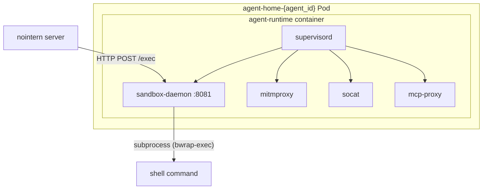
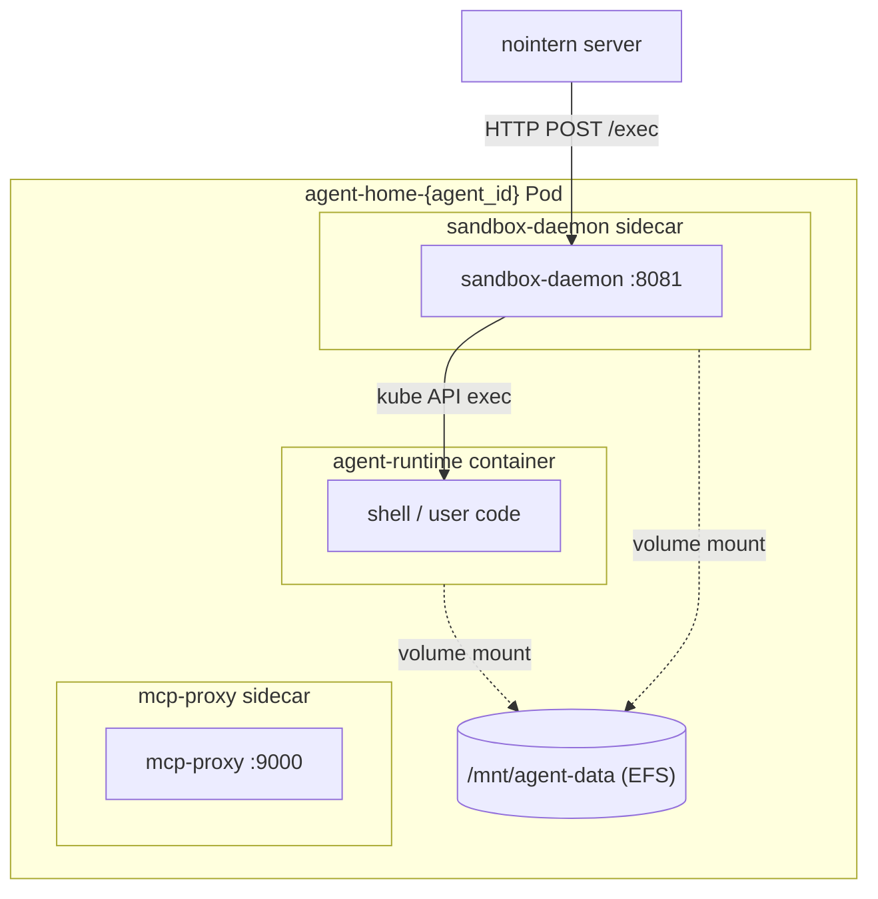

# sandbox-daemon Sidecar Separation Design

## Overview

Separate sandbox-daemon from agent-runtime container and operate it as separate Kubernetes sidecar container, changing structure so commands are executed in user container through kube API exec.

**Problems solved:**
- Updating sandbox-daemon requires rebuilding entire agent-runtime image.
- All processes run in single container → resource isolation impossible.
- supervisord manages process lifecycle → K8s native healthcheck/restart not used.

**Things not changed:**
- `SandboxDaemonClient` HTTP interface (keep nointern server → daemon communication path).
- File API path routing (direct access to shared volume `/mnt/agent-data`).
- Per-user isolation model (decided in separate discussion).

## Discussion Points and Decisions

Decisions from Discussion #2271:

| # | Discussion point | Decision | Rationale |
|---|-----------|------|------|
| 1 | executor execution model | kubernetes_asyncio stream exec | already used in codebase, no process overhead |
| 2 | sidecar container composition | build separate image | image separation is purpose of this work |
| 3 | file API path routing | direct shared volume access | target files are all under `/mnt/agent-data` |
| 4 | per-user isolation | out of scope | decided in existing discussion |
| 5 | communication path | keep existing HTTP, daemon calls kube exec | no `SandboxDaemonClient` change needed |
| 6 | migration strategy | 2-step transition | sidecar separation + exec transition together |

## Architecture

### Current Structure



### Target Structure



## Container Image

### sandbox-daemon Dedicated Image

Separate sandbox-daemon from agent-runtime image and build as separate image.

**Dockerfile location:** `docker/nointern/sandbox-daemon/Dockerfile`

```dockerfile
FROM python:3.14-slim

# install only sandbox-daemon package
COPY python/apps/nointern-sandbox-daemon /tmp/nointern-sandbox-daemon
RUN pip install --no-cache-dir /tmp/nointern-sandbox-daemon

# add kubernetes_asyncio (for kube exec call)
# add dependency to nointern-sandbox-daemon pyproject.toml

USER 1000
EXPOSE 8081
CMD ["python", "-m", "nointern_sandbox_daemon"]
```

**ECR repository:** `nointern-production-server/nointern-sandbox-daemon`

### agent-runtime Image Change

- Remove `[program:sandbox-daemon]` from `supervisord.conf`.
- Remove nointern-sandbox-daemon package install from Dockerfile.
- Programs remaining in supervisord: mitmproxy, socat, mcp-proxy (conditional)
  - If mitmproxy/socat are also sidecar separation targets, supervisord itself can be removed.

## Executor Change: subprocess → kube API exec

### Current (subprocess)

```python
proc = await asyncio.create_subprocess_exec(
    *cmd,
    stdout=asyncio.subprocess.PIPE,
    stderr=asyncio.subprocess.PIPE,
    env=env,
)
stdout, stderr = await proc.communicate()
```

### After Change (kube API exec)

Call `connect_get_namespaced_pod_exec` from kubernetes_asyncio with `_preload_content=False` and receive stdout/stderr separately by channel.

```python
from kubernetes_asyncio.client import CoreV1Api
from kubernetes_asyncio.stream.ws_client import (
    WsApiClient,
    STDOUT_CHANNEL,
    STDERR_CHANNEL,
    ERROR_CHANNEL,
)

async def execute_command(
    command: str,
    user_id: str,
    timeout: int,
    max_output_chars: int,
) -> ExecResult:
    """Execute command in user container through kube API exec."""
    max_bytes = max_output_chars * 4  # UTF-8 max 4 bytes

    async with WsApiClient() as ws_api:
        v1 = CoreV1Api(api_client=ws_api)

        # env var injection + command execution
        exec_command = [
            "/bin/bash", "-c",
            f"export DATA_USER=/data/users/{user_id}; {command}"
        ]

        websocket = await v1.connect_get_namespaced_pod_exec(
            name=pod_name,
            namespace=namespace,
            container="agent-runtime",
            command=exec_command,
            stderr=True,
            stdin=False,
            stdout=True,
            tty=False,
            _preload_content=False,
        )

        stdout_buf = bytearray()
        stderr_buf = bytearray()
        error_data = ""
        truncated = False

        async with asyncio.timeout(timeout):
            async with websocket as ws:
                async for msg in ws:
                    if msg.type in (WSMsgType.CLOSE, WSMsgType.CLOSING, WSMsgType.CLOSED):
                        break
                    channel = msg.data[0]
                    payload = msg.data[1:]

                    if channel == STDOUT_CHANNEL:
                        stdout_buf.extend(payload)
                        if len(stdout_buf) > max_bytes:
                            truncated = True
                            stdout_buf = stdout_buf[:max_bytes]
                    elif channel == STDERR_CHANNEL:
                        stderr_buf.extend(payload)
                        if len(stderr_buf) > max_bytes:
                            stderr_buf = stderr_buf[:max_bytes]
                    elif channel == ERROR_CHANNEL:
                        error_data += payload.decode("utf-8")

        exit_code = WsApiClient.parse_error_data(error_data)

        return ExecResult(
            stdout=_safe_decode(stdout_buf, truncated),
            stderr=_safe_decode(stderr_buf, False),
            exit_code=exit_code or 0,
        )
```

### Reuse Existing `_safe_decode`

Keep UTF-8 safe decode logic from current executor.py as-is:
- handle multibyte characters cut at byte boundary
- display `[output truncated]` when truncation detected

## Pod spec Change

### Modify `_build_pod_spec()`

```python
def _build_pod_spec(self, agent_id: str, ...) -> V1Pod:
    # existing agent-runtime container (user container)
    sandbox_container = V1Container(
        name="agent-runtime",
        image=self._agent_runtime_image,
        # ... (same as existing, no sandbox-daemon)
    )

    # NEW: sandbox-daemon sidecar
    daemon_container = V1Container(
        name="sandbox-daemon",
        image=self._sandbox_daemon_image,  # separate image
        ports=[V1ContainerPort(container_port=8081)],
        readiness_probe=V1Probe(
            http_get=V1HTTPGetAction(path="/health", port=8081),
            initial_delay_seconds=2,
            period_seconds=5,
        ),
        liveness_probe=V1Probe(
            http_get=V1HTTPGetAction(path="/health", port=8081),
            initial_delay_seconds=5,
            period_seconds=10,
        ),
        resources=V1ResourceRequirements(
            requests={"cpu": "100m", "memory": "128Mi"},
            limits={"cpu": "500m", "memory": "256Mi"},
        ),
        volume_mounts=[
            V1VolumeMount(
                name="agent-data",
                mount_path="/mnt/agent-data",
                sub_path=f"agents/{agent_id}",
            ),
        ],
        # ServiceAccount token mount (for kube exec call)
        env=[
            V1EnvVar(name="POD_NAME", value_from=V1EnvVarSource(
                field_ref=V1ObjectFieldSelector(field_path="metadata.name")
            )),
            V1EnvVar(name="POD_NAMESPACE", value_from=V1EnvVarSource(
                field_ref=V1ObjectFieldSelector(field_path="metadata.namespace")
            )),
        ],
    )

    containers = [sandbox_container, daemon_container]
    # ... add mcp-proxy sidecar same as existing
```

## RBAC

For sandbox-daemon sidecar to call kube exec into agent-runtime container in same Pod, ServiceAccount of Pod needs `pods/exec` permission.

### Add New Role

```yaml
# infra/argocd/nointern-sandbox/base/daemon-rbac.yaml
apiVersion: rbac.authorization.k8s.io/v1
kind: Role
metadata:
  name: sandbox-daemon-exec
  namespace: nointern-sandbox
rules:
  - apiGroups: [""]
    resources: ["pods"]
    verbs: ["get"]
  - apiGroups: [""]
    resources: ["pods/exec"]
    verbs: ["create"]
```

### RoleBinding

Bind to ServiceAccount used by sandbox Pod. Either create new ServiceAccount used by sandbox Pod, or bind to existing `default` ServiceAccount.

## CI/CD

### Docker workflow change (`.github/workflows/docker.yaml`)

Add sandbox-daemon image build job following existing multi-image build pattern:

```yaml
inputs:
  build_nointern_sandbox_daemon:
    type: boolean
    default: true

jobs:
  build-nointern-sandbox-daemon:
    if: ${{ inputs.build_nointern_sandbox_daemon }}
    runs-on: arc-medium-dind
    steps:
      # checkout, AWS credentials, ECR login (same existing pattern)
      - name: Build and push
        uses: docker/build-push-action@v6
        with:
          context: .
          file: docker/nointern/sandbox-daemon/Dockerfile
          push: true
          tags: |
            ${{ env.ECR_URI }}/nointern-sandbox-daemon:${{ github.sha }}
            ${{ env.ECR_URI }}/nointern-sandbox-daemon:latest
```

## Infra Change

| Item | Change |
|------|----------|
| ECR repository | create new `nointern-sandbox-daemon` |
| Dockerfile | add `docker/nointern/sandbox-daemon/Dockerfile` |
| CI workflow | add `build-nointern-sandbox-daemon` job |
| RBAC | add `sandbox-daemon-exec` Role + RoleBinding |
| Karpenter | no change (use existing sandbox NodePool) |
| ArgoCD | add sandbox-daemon image tag management |

## Feasibility Verification

| Verification item | Result | Note |
|-----------|------|------|
| kubernetes_asyncio stream exec | **verified** | already used in `kubernetes.py` (WsApiClient + connect_get_namespaced_pod_exec) |
| stdout/stderr separation | **possible** | channel-based separation with `_preload_content=False` |
| exit code reception | **possible** | ERROR_CHANNEL (channel 3) + `WsApiClient.parse_error_data()` |
| timeout handling | **possible** | use `asyncio.timeout()`, WebSocket connection auto-closes |
| output truncation | **implementation needed** | existing `_safe_decode` logic reusable |
| RBAC pods/exec | **needs addition** | `pods/exec` + `create` verb, add to existing RBAC file |
| multi-image CI | **pattern exists** | apply existing pattern in docker.yaml as-is |
| shared volume access | **verified** | accessible from sidecar with same volume mount |

### Risks

| Risk | Impact | Mitigation |
|--------|------|----------|
| kube exec latency | WebSocket connection overhead per exec (~50ms) | current subprocess also has process creation overhead, similar level |
| ServiceAccount permission exposure | daemon has pods/exec permission | scope limited with namespace Role |
| warm pool Pod recreation | Pod spec change requires existing Pod recreation | handle with warm pool refresh process during deployment |

## Implementation Plan

### Phase A: sidecar separation + kube exec transition (2 steps together)

1. Write sandbox-daemon Dockerfile + add CI job.
2. Convert `executor.py` from subprocess to kube API exec.
3. Add sandbox-daemon sidecar to `_build_pod_spec()`.
4. Remove `[program:sandbox-daemon]` from `supervisord.conf`.
5. Remove sandbox-daemon package from agent-runtime Dockerfile.
6. Add RBAC Role + RoleBinding.
7. Create ECR repository (Terraform).

### Phase B: Cleanup

1. Clean programs remaining in supervisord (if mitmproxy/socat are also sidecar separation targets).
2. Clean unnecessary settings/environment variables.
3. Update tests.

## Alternatives Considered

| Alternative | Rejection reason |
|------|----------|
| Same image + different entrypoint | invalid because image separation is the purpose of this work |
| nointern directly calls kube exec | requires SandboxDaemonClient interface change, scatters responsibilities |
| fully remove daemon | complex file API operations such as glob/grep/edit must be reimplemented with kube exec |
| 3-step gradual transition | unnecessary dual-running period, 2 steps are enough |
| feature flag based transition | no benefit compared to code complexity of maintaining two paths |
