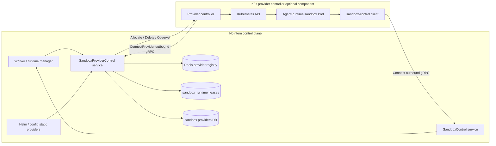

# SandboxProviderControl Design

## Problem / Background

Current nointern sandbox control is split into two layers.

- Commands/files/checkpoint operations inside sandbox have moved to the `SandboxControlRuntime.Connect` outbound gRPC stream and the `SandboxControlWorker` worker-facing service.
- Sandbox lifecycle is still created, deleted, and observed directly by the NoIntern backend through `SessionSandboxClient` implementations for Kubernetes Pods or local Docker containers.

This structure is sufficient to abstract K8s/Docker backends as one process-local client interface, but it is not enough for a model where the provider itself runs outside NoIntern. In particular, to split the K8s provider controller into an optional Helm component, or to later support a customer local Docker provider daemon attaching to NoIntern without an inbound port, the lifecycle plane must also be split into an outbound-first protocol.

This design is the Phase 2 design draft for #3914 SandboxProviderControl. The goal is not detailed local Docker implementation, but to define the protocol/abstraction/security contract shared by the K8s-first provider controller and downstream local Docker providers.

Current paths referenced:

- `docs/nointern/adr/0008-agent-runtime-sandbox-control-channel.md`
- `docs/nointern/design/in-sandbox-sandbox-client-control-channel.md`
- `docs/nointern/spec/flow/sandbox-checkpoint-lifecycle.md`
- `proto/nointern/sandbox_control/v1/sandbox_control.proto`
- `python/apps/nointern/src/nointern/runtime/sandbox/session_sandbox.py`
- `python/apps/nointern/src/nointern/runtime/sandbox/session_sandbox_manager.py`
- `python/apps/nointern/src/nointern/runtime/sandbox/control/registry.py`
- `python/apps/nointern/src/nointern/runtime/sandbox/control/server.py`
- `python/apps/nointern/src/nointern/runtime/sandbox/session_sandbox_k8s.py`
- `python/apps/nointern/src/nointern/runtime/sandbox/session_sandbox_docker.py`
- `docs/nointern/design/helm-packaging.md`

Feasibility check compared the draft with current code/docs/Helm chart after drafting. The conclusion is that implementation is possible, but the K8s-first phase must include not only a simple lifecycle wrapper, but also parity with existing `/home/sandbox` checkpoint persistence and sandbox-control auth token migration.

## Goals

1. Define a `SandboxProviderControl` contract that can separate sandbox lifecycle provider from the NoIntern core worker process.
2. Fix the first implementation direction as a K8s-first out-of-process provider controller.
3. Define an architecture boundary that can deploy the K8s provider controller as an optional component of the NoIntern Helm chart.
4. Separate provider state authority along static/dynamic and system/user(workspace) axes.
5. Separate active provider connection/liveness into Redis registry and runtime allocation into `sandbox_runtime_leases` active-lease table.
6. Define the security contract that introduces required `SandboxControlAuthToken` for sandbox-control runtime registration.
7. Clearly fix the hibernate/resume persistence contract as preserving `/home/sandbox/**`.
8. Leave the constraints needed for local Docker provider to use the same protocol downstream.

## Non-goals

- Do not design CLI UX, install packaging, Docker socket hardening, or rootless Docker policy for the local Docker provider daemon.
- Do not advance the provider scheduling algorithm. The first design focuses on correctness and authority separation.
- Do not redesign command/file/checkpoint transport. Reuse the existing `SandboxControlRuntime` / `SandboxControlWorker` contract.
- Do not promote rootfs snapshot, S3 checkpoint, or package cache to a separate authoritative persistence layer.
- Do not include implementation plan, phase breakdown, or per-file checklist in this document.

## Current State

### Sandbox control plane

`proto/nointern/sandbox_control/v1/sandbox_control.proto` defines two services.

- `SandboxControlRuntime.Connect`: outbound stream opened from the client inside sandbox container to NoIntern
- `SandboxControlWorker`: service where worker/control plane requests exec/file/checkpoint operations

`python/apps/nointern/src/nointern/runtime/sandbox/control/registry.py` records active sandbox-control connection in Redis keyed by `AgentRuntime.id`. The record includes `connection_id`, `generation`, `control_instance_id`, `registered_at`, `last_heartbeat_at`, and `state`.

### Lifecycle backend

`SessionSandboxClient` is named session-bound, but by current comments and manager flow, the actual backend key is `AgentRuntime.id`. Main lifecycle methods are:

- `ensure_ready(...)`
- `observe_runtime(...)`
- `list_runtimes()`
- `delete_session(...)`
- `sandbox_reachable_url(...)`

K8s backend directly creates Pod, mitmproxy, NetworkPolicy, and sandbox-control env injection. Docker backend creates local-dev Docker container and host bind mount. Both backends no longer use direct exec/read/write paths after sandbox-control migration and are already separated toward lifecycle-only responsibility.

### Checkpoint / hibernate

Current `sandbox-checkpoint-lifecycle` spec defines `/home/sandbox/**` as checkpoint target. Warm runtime and Kubernetes/OCI rootfs snapshot are continuity optimizations, and S3/RustFS checkpoint is described as long-term durable state. The #3914 K8s provider-control cutover does not change these persistence semantics. K8s provider is an out-of-process port of the existing built-in K8s Pod manager, and `/home/sandbox/**` hibernate/resume durability continues to be handled by the S3/RustFS checkpoint tar flow.

## Decisions

| Topic | Decision | Rationale |
|---|---|---|
| First provider implementation | K8s-first | closest to verifying production primary backend and Helm optional component. |
| Provider placement | out-of-process provider controller | separates NoIntern worker process from lifecycle provider failure domain. |
| Protocol form | provider opens outbound `ConnectProvider` bidi stream | does not require inbound exposure in private cluster/customer network. |
| Provider source of truth | static+system is config/Helm, all other dynamic providers are DB | represents Helm-managed managed provider and workspace/user provider with one model while keeping authority separate. |
| Active liveness | Redis registry | suitable for TTL/heartbeat-based ephemeral owner state. |
| Runtime allocation | `sandbox_runtime_leases` active-lease table | separates provider allocation from `agent_runtimes` lifecycle state. |
| sandbox-control auth | required `SandboxControlAuthToken` | prevents provider from registering to sandbox-control as arbitrary runtime. |
| Token delivery location | `RegisterRequest.auth_token` field | manages it in schema/codegen/test as handshake payload. |
| Persistence contract | K8s preserves `/home/sandbox/**` using existing S3/RustFS checkpoint | prevents provider-control cutover from changing user workspace durability semantics. |
| local Docker | downstream constraint | #3914 is protocol/security prerequisite before local Docker implementation. |

## Target Architecture




The core separation is as follows.

- SandboxProviderControl is the **lifecycle plane**. It handles provider registration, heartbeat, capacity, allocation, delete, and observe.
- SandboxControl is the **runtime command/file/checkpoint plane**. It connects to the client inside sandbox container.
- Provider controller creates sandbox Pod/container and injects `SANDBOX_CONTROL_*` env and the value corresponding to `SANDBOX_CONTROL_AUTH_TOKEN`.
- NoIntern records runtime allocation lease in DB, and active provider stream owner is looked up from Redis registry.

## Protocol Sketch

Protocol is assumed to be added as a separate proto service. The following is the schema direction; final field numbers and enum names are fixed during implementation according to codegen conventions.

```proto
service SandboxProviderControl {
  rpc ConnectProvider(stream ProviderMessage) returns (stream ControlMessage);
}

message ProviderMessage {
  string connection_id = 1;
  string request_id = 2;
  oneof payload {
    ProviderRegister register = 10;
    ProviderHeartbeat heartbeat = 11;
    RuntimeObservation observation = 20;
    RuntimeOperationResult operation_result = 21;
    ProviderError error = 40;
  }
}

message ControlMessage {
  string request_id = 1;
  oneof payload {
    ProviderRegisterAccepted register_accepted = 10;
    RuntimeAllocateRequest allocate_runtime = 20;
    RuntimeDeleteRequest delete_runtime = 21;
    RuntimeObserveRequest observe_runtime = 22;
    ProviderDrainRequest drain = 30;
    ProviderError error = 40;
  }
}
```

### Register

`ProviderRegister` sends provider identity and capacity/capability.

Required concepts:

- `provider_id`
- `provider_kind`: `k8s`, future `local_docker`
- `provider_scope`: `system` or `workspace`
- `workspace_id`: required for workspace provider, absent for system provider
- `controller_version`
- `capabilities`: runtime class, network policy support, checkpoint support, etc.
- `capacity`: max runtimes, current running count, optional resource hints
- `auth_token`: credential for verifying provider-control connection permission. Separate from sandbox-control runtime auth token.

### AllocateRuntime

`RuntimeAllocateRequest` contains the minimal information for provider to create sandbox runtime.

- `agent_runtime_id`
- `agent_id`
- `workspace_id`
- `image_ref`
- `domain_config`: allowed/denied domain or proxy policy
- `sandbox_control_endpoint`
- `sandbox_control_connection_id`
- `sandbox_control_generation`
- `sandbox_control_auth_token`
- `preserve_home`: whether resume/hibernate contract requires preserving `/home/sandbox`
- `labels` / `annotations`: metadata for provider-local identification and observation

Provider uses these values to create sandbox Pod/container and injects environment variable or file secret so the client inside sandbox sends `sandbox_control_auth_token` as `RegisterRequest.auth_token` field.

### DeleteRuntime

`RuntimeDeleteRequest` is a runtime teardown request.

- `agent_runtime_id`
- `preserve_home`: if true, it can be used only with providers that have provider-native home preservation capability. K8s-first provider does not declare this capability.
- `reason`: hibernate, expired, admin_delete, failed_allocation, etc.

Durable workspace preservation in K8s-first path is handled by checkpoint commit/restore flow, not by `preserve_home`.

### ObserveRuntime

`RuntimeObservation` reports provider-local actual state.

- `agent_runtime_id`
- `provider_runtime_id`
- `state`: absent, starting, running, terminating, hibernated, unknown
- `reason`
- `generation`
- `last_seen_at`
- `home_preserved`: observation value for providers with provider-native home preservation capability. In K8s-first provider, checkpoint state is durability source.

## Auth / Security Model

### Provider-control auth

Provider controller sends provider credential in the first register payload of `ConnectProvider`. The credential only has provider-control connection permission.

Recommended permission scopes:

- `sandbox_provider:connect`
- `sandbox_provider:heartbeat`
- `sandbox_provider:report_runtime`
- `sandbox_provider:receive_allocation`
- `sandbox_provider:receive_delete`

Forbidden scopes:

- user message/API access
- workspace file direct access
- billing/admin API access
- arbitrary AgentRuntime claim

Static system provider receives credential and provider identity from Helm/config. Dynamic workspace provider uses DB-backed provider credential. In both cases, active connection is registered in Redis TTL registry.

### SandboxControlAuthToken

K8s-first migration introduces required `SandboxControlAuthToken` for sandbox-control runtime registration.

Contract:

1. NoIntern issues a token that binds `agent_runtime_id`, `workspace_id`, `provider_id`, `generation`, and expiry at runtime allocation.
2. Token is delivered to provider controller as `RuntimeAllocateRequest.sandbox_control_auth_token`.
3. Provider controller injects token into sandbox Pod/container.
4. Client inside sandbox sends token as `RegisterRequest.auth_token` field.
5. sandbox-control service verifies token and then updates Redis connection registry.
6. If token is missing or provider/runtime/generation does not match, registration is rejected.

Token is not hidden in gRPC metadata. It is explicit as proto field so codegen, test fixtures, and audit log redaction can manage it.

### Trust boundaries

- K8s provider controller starts as an optional component inside NoIntern deployment trust boundary.
- Dynamic workspace/local provider is an external trust boundary, and K8s-first design must first establish token/revocation/liveness contract.
- provider-control credential and sandbox-control runtime auth token cannot substitute for each other.
- Even if provider receives sandbox-control auth token, that token must be valid only for a specific runtime/generation registration.

## State Model

### Provider taxonomy

Provider is classified along two axes.

| Axis | Value | Description | Source of truth |
|---|---|---|---|
| mutability | static | provider declared by deployment/config | Helm/config |
| mutability | dynamic | provider created through UI/API/registration | DB |
| ownership | system | NoIntern deployment or cluster-wide provider | Helm/config or DB |
| ownership | user/workspace | provider supplied by a specific workspace/user | DB |

According to accepted decision, **config/Helm is the source of truth for static + system provider**. DB is source of truth for all other dynamic providers. All providers use Redis registry for active connection/liveness.

### Persistent provider records

Dynamic providers need DB records. Static system provider can be made into a same-shaped read model, but authority remains in Helm/config.

Conceptual fields:

- `provider_id`
- `scope`: system, workspace
- `workspace_id` nullable
- `kind`: k8s, future local_docker
- `display_name`
- `enabled`, `draining`
- `capabilities`
- `created_at`, `updated_at`

### Active provider registry

Redis registry record is TTL-based.

- `provider_id`
- `connection_id`
- `generation`
- `control_instance_id`
- `registered_at`
- `last_heartbeat_at`
- `capacity`
- `state`: connecting, ready, draining, disconnected

Worker/runtime manager does not look at provider process-local connection store directly. ProviderControl service boundary handles registry lookup and stream owner routing.

### Runtime lease table

Runtime provider allocation state is stored in `sandbox_runtime_leases` active-lease table rather than adding columns to `agent_runtimes`.

Conceptual fields:

- `id`
- `agent_runtime_id`
- `workspace_id`
- `provider_id`
- `provider_runtime_id`
- `allocation_generation`
- `state`: allocating, starting, running, hibernating, hibernated, deleting, lost
- `lease_owner`
- `expires_at` or heartbeat-based stale criterion
- `created_at`, `updated_at`, `last_observed_at`

This table is the authority for provider allocation fencing and recovery. `agent_runtimes.runtime_state` continues to represent AgentRuntime lifecycle states such as active/hibernated/restoring/expired.

## K8s Persistence Parity

There is one durable persistence contract that must be preserved in K8s provider-control cutover.

> Preserve `/home/sandbox/**` contents across hibernate/resume.

Scope:

- Required: `/home/sandbox/**`
- Best-effort implementation detail: `/tmp`, `/tmp/agent`, rootfs changes, package cache, process state, open sockets, running processes
- Current and target K8s implementation: S3/RustFS checkpoint tar object
- Continuity optimization: warm runtime, Kubernetes/OCI rootfs snapshot, container snapshot image

K8s provider is not a new persistence backend; it is a provider-controller port of existing in-process K8s Pod manager implementation. Therefore, K8s provider-control cutover does not introduce new `/home/sandbox` persistence strategy such as PVC/object-backed volume/node-local volume.

Implications:

1. K8s provider configures `/home/sandbox` and `/tmp/agent` as Pod-local `emptyDir`, same as existing K8s Pod manager.
2. S3/RustFS checkpoint is the authoritative durability mechanism for K8s hibernate/resume.
3. rootfs snapshot is only fast resume optimization, not the workspace authority users expect.
4. K8s provider does not declare `preserve_home` capability. `preserve_home=true` is future provider capability for provider-native home preservation.
5. K8s hibernate cleans up compute by provider delete after checkpoint commit, and resume restores checkpoint tar into fresh K8s runtime.

## K8s Provider Controller and Helm Optional Component

K8s provider controller is the out-of-process component form of responsibilities currently held by `K8sSessionSandboxClient` inside NoIntern server.

Responsibilities:

- open `ConnectProvider` stream and register/heartbeat
- receive allocation requests
- create Kubernetes Pod, NetworkPolicy, volume, secret/env
- inject sandbox-control endpoint/auth token/generation
- observe Pod actual state and report `RuntimeObservation`
- process `DeleteRuntime` while preserving existing K8s Pod lifecycle parity
- rediscover provider-owned runtime after controller restart
- reconcile stale Pod/lease

Relationship with Helm packaging:

- `docs/nointern/design/helm-packaging.md` treats `server.sandboxControl` and `sandbox` component as default runtime core.
- K8s provider controller must be a separate optional component in this structure.
- Example values namespace should be chosen between `server.sandboxProviderController.enabled` and top-level `sandboxProviderController.enabled`. Which position better matches chart component boundary needs Helm source path review before implementation.
- After cutover, if optional component is disabled, another active provider must exist. It does not fallback to legacy in-process K8s backend; if no active provider exists, sandbox allocation must fail as admin-visible misconfiguration.

Operational prerequisites:

- provider-control endpoint and sandbox-control endpoint must be reachable from controller and sandbox Pod respectively.
- controller ServiceAccount needs RBAC to manage Pod/NetworkPolicy/Secret or required volume-related resources in sandbox namespace.
- `/home/sandbox` persistence is handled by existing S3/RustFS checkpoint flow, not by K8s provider.
- If NetworkPolicy is enabled, sandbox Pod egress must be open to sandbox-control.
- Secret redaction and token rotation policy must exist.

## Local Docker Downstream Constraints

Local Docker provider is not direct implementation scope of this design. However, downstream implementation must follow these constraints.

- Use the same `SandboxProviderControl.ConnectProvider` reverse stream.
- Provider daemon connects outbound to NoIntern and must not require inbound port exposure.
- Runtime container uses existing sandbox-control client contract.
- `SandboxControlAuthToken` must be delivered as `RegisterRequest.auth_token`.
- Local provider with provider-native `/home/sandbox/**` preservation may use per-runtime persistent directory/volume. This is not a required condition for K8s provider-control cutover.
- Do not mount Docker socket into sandbox container.
- Local provider credential must be workspace-scoped/revocable and must not store normal user access token.
- `/tmp`, rootfs, package cache, and process state preservation are not product guarantees.

## User-visible / Admin-visible Behavior

User-visible behavior:

- During normal operation, user does not directly notice provider-control introduction.
- If sandbox start/resume takes longer, existing sandbox starting/progress event should be shown.
- `/home/sandbox` workspace contents must be preserved after hibernate/resume.
- If provider outage prevents runtime start, it should appear as normal sandbox unavailable error; internal provider credential/token information must not be exposed.

Admin-visible behavior:

- The configured/enabled/draining/connected/capacity state of system/K8s provider must be visible.
- If dynamic workspace provider is later added downstream, workspace admin must be able to see provider online/offline, capacity, last seen, and revocation state.
- Misconfiguration must be clear. Examples: provider controller disabled with no active provider, auth token validation failure, provider capacity 0, no persistence capability.
- Operator logs/metrics must record provider id, connection id, runtime id, lease state, and generation as structured fields. Secret/token values are subject to redaction.

## Rollout / Failure Modes

### Rollout prerequisites

- Confirm provider-control proto/service boundary
- Decide sandbox-control auth migration including adding `RegisterRequest.auth_token`
- Decide `sandbox_runtime_leases` active-lease table schema
- Decide provider registry Redis key/TTL/generation fencing
- Decide K8s provider controller RBAC/NetworkPolicy/Secret/volume prerequisites
- Decide Helm optional component values boundary

### Compatibility

- Do not keep existing in-process K8s backend and provider-control backend running side-by-side behind feature flags for a long period during migration. Switch immediately once the K8s provider-control path satisfies existing checkpoint-based hibernate/resume behavior and sandbox-control auth token contract.
- In the cutover phase, clean-delete legacy direct K8s lifecycle path in the same stack. Provider outage or misconfiguration must not silently fallback to legacy direct backend.
- When sandbox-control auth token becomes required, every sandbox runtime created by provider controller must inject token.
- If old sandbox client does not send `auth_token` field, registration must fail. This breaking change must be managed by image/controller rollout order within the K8s-first migration unit.

### Failure modes

| Failure mode | Expected behavior |
|---|---|
| provider stream disconnect | After Redis provider registry TTL expires, provider appears offline. Existing running runtime becomes reconcile target through lease/observation. |
| provider reconnect with higher generation | New connection becomes owner and previous connection is fenced. |
| duplicate/stale provider connection | Reject by registry generation/connection_id validation. |
| allocation accepted but sandbox-control register timeout | Runtime lease transitions to failed/lost or retryable state, and user request fails as sandbox unavailable. |
| sandbox-control auth token missing/invalid | Reject runtime registration and observe provider allocation as failed. |
| provider reports running but sandbox-control absent | Do not treat as ready because provider actual state and command-plane readiness disagree. |
| checkpoint restore fails after provider compute recreate | Existing hibernate/resume failure mode. Runtime handles as restore failure and follows checkpoint/spec path. |
| Helm static provider removed | Provider removed from config/Helm source of truth is treated as draining/decommission and excluded from new allocation targets. |

## Feasibility Check

After drafting, core assumptions were compared against the current repo. Actual proto/codegen execution, Helm template execution, and DB migration generation must be done in implementation phase, but no blocker was found that prevents the design itself.

| Item | Result | Basis / action |
|---|---|---|
| Add `SandboxControlAuthToken` as `RegisterRequest` field | possible, breaking change | `RegisterRequest` currently has only `agent_runtime_id`, `agent_id`, `workspace_id`, `generation`. `nointern-sandbox-client` `Settings` and `build_register_message()` also use only same fields. Therefore `auth_token` addition must change proto, generated client/server, sandbox client env (`SANDBOX_CONTROL_AUTH_TOKEN`), and K8s/Docker launcher env injection together in one migration. |
| Provider-control proto/codegen | possible | `python/libs/nointern-sandbox-control` already exists as shared gRPC proto package and has `grpcio-tools` dev dependency plus generated pb2 exclusion settings. New `sandbox_provider_control.proto` or adding service inside same proto package is possible. |
| Convert K8s lifecycle to provider | possible | `K8sSessionSandboxClient` already gathers Pod/NetworkPolicy creation, sandbox-control env injection, observe/list/delete responsibilities in one place, so migration target to provider controller is clear. K8s provider is not a new persistence backend but provider-controller port of existing built-in K8s Pod manager, so `/home/sandbox` durability keeps existing S3/RustFS checkpoint flow. |
| Helm optional component | possible | Helm values already include `server.sandboxControl.enabled`, `sandbox`, and `snapshotter` components. K8s provider controller can be added as optional component between `sandbox` runtime layer and `server.sandboxControl`. Top-level `sandboxProviderController` values position looks more natural, but final position is fixed when chart template is implemented. |
| NetworkPolicy / endpoint reachability | possible, extra egress needed | Current sandbox namespace NetworkPolicy allows sandbox Pod -> `sandbox-control:8020` egress. K8s provider controller must open outbound stream to provider-control endpoint, so egress policy and service endpoint for controller namespace/selector must be added. |
| Runtime lease table | possible | Current `AgentRuntime` lifecycle state and runtime lease claim helper exist, but no separate table represents provider allocation owner. Migration adding `sandbox_runtime_leases` active-lease table is needed. Static system provider may not have DB row, so lease must store logical provider key/source, not only provider DB FK. |
| Provider-control deployment topology | possible, decision needed | Current `sandbox-control` is separate deployment/process (`python sandbox_control_server.py`, port 8020). Provider-control may attach to same deployment/process or be separated as another deployment. Considering K8s provider controller optionalization, logical service boundary must be separate; physical colocation is decided in implementation plan. |
| Immediate cutover and legacy cleanup | possible, ordering important | Because of required `auth_token` decision, old sandbox client image cannot register to new sandbox-control. Migration must clearly order sandbox-control, provider controller, and agent-runtime image rollout. Once K8s provider-control path satisfies persistence/token contract, legacy in-process K8s launcher is clean-deleted without feature-flag parallel run. |

Feasibility conclusion: **the design is implementable**. Core risks are not gRPC itself, but (1) whether K8s provider-control cutover preserves existing S3/RustFS checkpoint persistence semantics, (2) rollout ordering for required `auth_token` migration, and (3) merge/lookup rules between static system provider config and dynamic provider DB model. These three items must be split first in implementation planning phase.

## Test Strategy

Product behavior verification is E2E-primary. However, because provider-control combines protocol, registry, lease, and Kubernetes optional component, also use unit/integration/testenv/Helm render verification.
### Behavior matrix

| Behavior | Primary verification | Supporting verification |
|---|---|---|
| K8s provider controller connects and becomes available | E2E sandbox allocation through provider-control | provider-control integration test, Redis registry unit test |
| runtime allocation creates sandbox-control-ready runtime | E2E shell command/file read-write | sandbox-control worker integration test |
| auth token required | E2E or integration negative test with missing token | proto/handshake unit test |
| `/home/sandbox` preserved across hibernate/resume | E2E write file → hibernate → resume → read file | provider controller integration test with fake K8s |
| stale provider/runtime generation rejected | integration test | Redis Lua/registry unit test |
| observability fields and redaction are preserved | E2E evidence includes provider id, connection id, runtime id, lease state, generation without token values | structured log/metric field assertion, redaction unit/integration |
| Helm optional component renders correctly | Helm template/lint | values schema validation |

### E2E primary plan

- Create or select a sandbox-enabled agent using provider-control backend.
- Send a user request that runs shell command and writes a file under `/home/sandbox`.
- Trigger hibernate/resume through the existing Session Workspace or runtime lifecycle path.
- Verify the file remains under `/home/sandbox` after resume.
- Verify admin/provider status reports connected capacity and last seen.

### testenv support

testenv may need a fake provider controller or a K8s-provider-in-docker diagnostic harness if full Kubernetes is unavailable. If E2E cannot run a real K8s provider controller in CI, testenv should cover protocol and lifecycle orchestration while live K8s verification is marked optional/manual with explicit skip reason.

### Fixture / seed requirements

- sandbox-enabled agent/workspace
- provider-control enabled configuration
- provider credential or static provider config
- Redis/DB prerequisites for registry and lease state
- sandbox-control auth token issuance path

### Credential / prerequisite snapshot

Evidence should record which provider identity, chart values/profile, sandbox image version, and auth-token-required mode were used. Token values must never be logged.

### Evidence format

- E2E run command and result
- provider registry/lease state summary with token redacted
- structured log/metric evidence containing provider id, connection id, runtime id, lease state, and generation without secret/token values
- hibernate/resume file preservation proof path/checksum
- Helm lint/template output summary for optional component values

### CI policy

- Protocol/unit/DB/registry tests should be required in CI.
- Helm lint/template for default and provider-controller-enabled values should be required once chart component exists.
- Live Kubernetes provider E2E may be optional until CI has a suitable cluster fixture; optional skip must be explicit and visible.

### Optional/live test skip/fail criteria

- Skip only when Kubernetes provider prerequisite is unavailable.
- Do not skip auth-token negative tests once protocol exists.
- If `/home/sandbox` preservation fails in any provider claiming the capability, treat as product failure, not flaky infra.

## QA Checklist

### QA-1: Provider controller registration and liveness

- What to check: K8s provider controller opens `ConnectProvider`, registers identity/capacity, and refreshes heartbeat.
- Why it matters: Allocation must only target live provider streams.
- How to check: Start provider-control with Redis, run controller, inspect provider registry and admin-visible status.
- Expected result: Provider is `ready`, capacity is non-zero, `last_heartbeat_at` refreshes before TTL expiry.
- Execution result: PASS — Phase 3~8 service/controller tests verified register, heartbeat, routing, Redis liveness, and diagnostic evidence shape. Live provider-control E2E remains prerequisite-gated by `sandbox-provider-control` snapshot policy.
- Fixes applied: Phase 7 separated controller token Secret and server token-map Secret, then Phase 8 added testenv provider-control evidence and prerequisite contract.

### QA-2: Runtime allocation through provider-control

- What to check: A sandbox request allocates runtime through provider-control and reaches sandbox-control ready state.
- Why it matters: Provider-control must integrate with existing command/file plane.
- How to check: Run E2E shell command on a provider-control-backed agent runtime.
- Expected result: Allocation lease is created, provider starts runtime, sandbox-control registration succeeds, shell command returns output.
- Execution result: PASS — Phase 6 routed K8s runtime allocation through `ProviderControlSessionSandboxClient`; Phase 8 added provider allocation evidence shape tests; Phase 9 added factory guard for direct K8s construction.
- Fixes applied: Phase 6 made missing provider/domain policy cases fail closed, and Phase 9 hardened no-active-provider evidence against legacy/unmanaged fallback markers.

### QA-3: SandboxControlAuthToken is required

- What to check: sandbox-control rejects runtime registration without valid `RegisterRequest.auth_token`.
- Why it matters: Provider credentials alone must not allow arbitrary runtime impersonation.
- How to check: Attempt sandbox-control register with missing, expired, wrong-provider, and wrong-generation token.
- Expected result: Invalid registrations fail; valid token registers exactly the allocated runtime/generation.
- Execution result: PASS — Phase 1 auth token tests and Phase 8 E2E auth negative harness cover missing, expired, wrong-provider, and wrong-generation token paths with redaction assertions.
- Fixes applied: Phase 1 bound token claims to provider/generation/workspace/runtime and Phase 8 moved diagnostic orchestration behind `TestenvProviderControlService`.

### QA-4: `/home/sandbox` hibernate/resume preservation

- What to check: Data under `/home/sandbox/**` survives hibernate/resume with provider-control backend.
- Why it matters: This is the durable user-facing persistence contract.
- How to check: Write checksum file under `/home/sandbox`, hibernate runtime, resume runtime, read and verify checksum.
- Expected result: File contents match exactly after resume.
- Execution result: PASS — Phase 5 K8s parity tests verify that provider-control keeps existing `emptyDir` Pod filesystem semantics and leaves durable `/home/sandbox` preservation to the S3/RustFS checkpoint flow. Live end-to-end checksum evidence is prerequisite-gated for provider-enabled environments.
- Fixes applied: Phase 5 rejected provider-native PVC persistence for K8s, kept `preserve_home=false`, and preserved checkpoint-based hibernate/resume semantics.

### QA-5: Provider disconnect and stale lease recovery

- What to check: Provider disconnect, reconnect, stale generation, and stale runtime lease do not produce duplicate active runtimes.
- Why it matters: Reverse streams and external controllers fail independently from NoIntern workers.
- How to check: Kill/restart controller during or after allocation, inspect registry generation and `sandbox_runtime_leases` state.
- Expected result: Stale connection is fenced; runtime is recovered, retried, or marked lost without duplicate ready owners.
- Execution result: PASS — Phase 3~6 provider-control tests verify generation fencing, stale observation/result rejection, disconnect handling, and lease `LOST` behavior for allocation failure.
- Fixes applied: Phase 3 promoted `ProviderMessage.generation`; Phase 4 hardened controller heartbeat/reconnect; Phase 6 fenced provider result ingestion through active lease state.

### QA-6: Helm optional component rendering

- What to check: K8s provider controller renders only when enabled and includes required Secret/RBAC/NetworkPolicy values.
- Why it matters: Provider controller is intended to be an optional Helm component.
- How to check: Run Helm lint/template for default values and provider-controller-enabled values.
- Expected result: Default values do not render provider controller unless chosen; enabled values render deployment/config/RBAC without literal secrets.
- Execution result: PASS — Phase 7 Kustomize render checks passed for ArgoCD overlays, and Phase 8/9 Helm render contract tests execute with explicit `helm`-missing skip reason in this environment.
- Fixes applied: Phase 7 moved optional controller resources to production overlay explicit-enable wiring and Phase 9 aligned Helm README Secret/component contracts.

### QA-7: Observability and redaction

- What to check: Provider lifecycle and runtime allocation evidence contains provider id, connection id, runtime id, lease state, and generation while omitting secret/token values.
- Why it matters: Operators need debuggable provider-control state without credential leakage.
- How to check: Run provider-backed allocation and disconnect/reconnect scenario, then inspect structured logs/metrics/evidence snapshots.
- Expected result: Required identifiers and states are present as structured fields; provider credentials and sandbox-control token values are redacted or absent.
- Execution result: PASS — Phase 8 diagnostic API/helper tests verify provider id, connection id, runtime id, lease state, generation, and redaction shape; Phase 9 added unmanaged/legacy provider evidence guard tests.
- Fixes applied: Phase 8 strengthened redaction checks for secret-like fields and Phase 9 rejected `legacy-direct-*`/`unmanaged-k8s-helper` evidence in no-provider mode.

## Alternatives Considered

### Keep lifecycle in `K8sSessionSandboxClient`

This minimizes code movement but keeps worker/control plane coupled to Kubernetes API credentials and topology. It does not support external provider streams or optional provider controller deployment cleanly.

### Implement local Docker provider first

Local Docker is the motivating downstream use case, but implementing it first would combine provider protocol, customer auth UX, local daemon persistence, and Docker hardening risks. K8s-first validates the abstraction in the existing production sandbox domain first.

### Use sandbox-control stream for provider lifecycle too

Rejected because sandbox-control is per AgentRuntime container command/file/checkpoint plane. Provider lifecycle is per provider/controller and must exist before a sandbox container starts.

### Store provider liveness in DB only

Rejected because liveness is heartbeat/TTL based and should expire without write-heavy cleanup jobs. DB remains source of truth for dynamic provider identity/policy, not active stream owner state.

### Replace K8s checkpoint flow with provider-native PVC persistence

Rejected for #3914. K8s provider-control is a behavior-preserving port of the existing K8s Pod manager. `/home/sandbox/**` hibernate/resume durability is handled by the existing S3/RustFS checkpoint tar flow. PVC/object-backed volume/node-local volume are covered by a separate provider capability or follow-up provider design.

### Make `SandboxControlAuthToken` optional during migration

Rejected by accepted decision. K8s-first migration is the point where runtime registration auth becomes required; optional auth would preserve the impersonation gap for the new provider trust boundary.

## Implementation Planning Inputs

The following items are not open questions that reverse design decisions; they are planning inputs where boundaries and order must be decided first in the implementation plan.

1. For K8s provider controller Helm values location, first consider top-level `sandboxProviderController` during chart implementation.
2. K8s-first provider-control path must preserve existing S3/RustFS checkpoint-based `/home/sandbox` persistence semantics. PVC/object-backed volume/node-local volume are outside this cutover scope.
3. Static system provider config is not DB source of truth, so runtime lookup must have a read path that merges config registry and dynamic DB provider registry. Even if a DB mirror is used, authority remains config.
4. Provider-control service keeps a separate logical boundary. Whether physical deployment is colocated with existing sandbox-control or split into a separate deployment is decided in operational phase.
5. Required `auth_token` rollout must align sandbox-control server, sandbox client image, and K8s provider controller in the same migration window. Legacy direct K8s launcher is clean-deleted in provider-control cutover phase.
