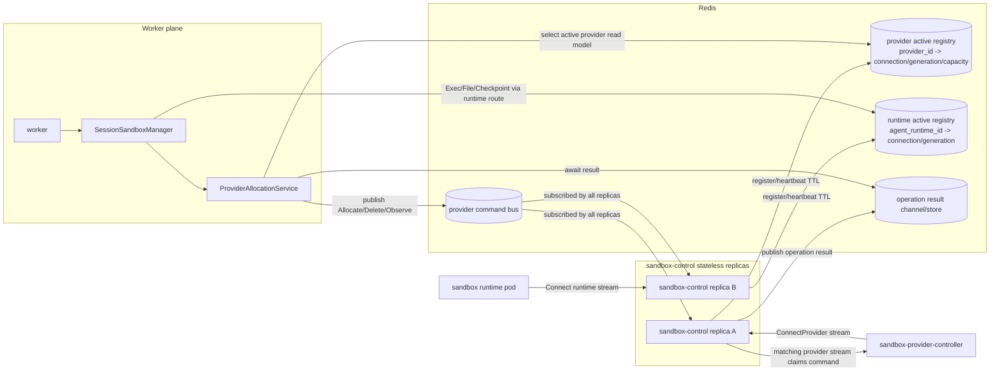
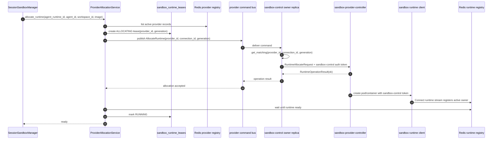
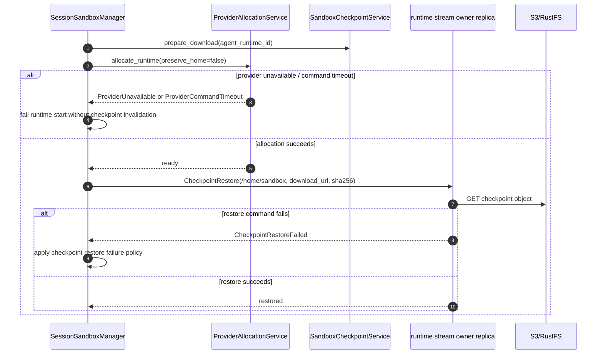

# Sandbox Provider Routing Simplification Design

## Overview

Production sandbox creation failures repeatedly occurred not primarily because of provider-control stream itself, but because **provider state and routing responsibility were scattered across multiple processes**. provider-controller opens outbound stream to `sandbox-control`, but worker directly handled provider registry and process-local router, attempting allocation from process that did not own the stream.

Core points of this design:

1. `worker` does not directly know provider selection, provider Redis registry, or provider stream ownership.
2. `sandbox-control` replica remains stateless.
3. provider-control stream is process-local resource of specific sandbox-control replica.
4. lifecycle command fans out through Redis pub/sub or Redis Streams based command bus.
5. All sandbox-control replicas subscribe to command bus, and only replica that has matching process-local provider stream claims command.
6. checkpoint restore failure and provider unavailable are separated as distinct failures.
7. Add fake provider server to E2E/testenv to verify routing contract without K8s external variables.

## Background

Existing SandboxProviderControl direction is correct.

- `sandbox-provider-controller` is client, not gRPC server.
- provider-controller does not open inbound port and opens outbound `ConnectProvider` stream toward `sandbox-control`.
- sandbox runtime also connects to `sandbox-control` through outbound `SandboxControlRuntime.Connect` stream.

Problem is implementation boundary.

- Actual provider stream is in process-local store of sandbox-control replica.
- worker reads Redis active provider registry and selects provider.
- provider router/connection store also appeared inside worker process.
- Redis liveness record and process-local stream ownership were used like different sources of truth.

Therefore, even if retry, heartbeat, and TTL are strengthened, structural problem remains: “worker is not owner of provider stream”.

## Constraints

### sandbox-control is stateless replica

`sandbox-control` is not singleton. It must remain scale-out stateless deployment. Each replica is only stream termination point and has no durable state.

### sender does not need to directly know owner endpoint

Stream owner is process-local, but caller does not need to directly find owner replica endpoint and send RPC. It is simpler to fan out via command bus and let owner replica claim by process-local store match.

### checkpoint authority is S3/RustFS checkpoint

Even in K8s provider-backed runtime, authority for `/home/sandbox/**` durable contract is `sandbox_checkpoints` row and S3/RustFS `home-sandbox.tar.zst` object. provider unavailable is not evidence of checkpoint corruption.

## Target Structure



Important point: provider stream owner and runtime stream owner can be different replicas. provider lifecycle command is delivered through provider command bus, while runtime command/file/checkpoint follows runtime stream registry and existing runtime routing boundary.

## Discussion Points and Decisions

### 1. provider selection location

#### Option A: worker business logic selects provider

Rejected. worker learns provider internals, and problem repeats where allocation is attempted from process that is not provider stream owner.

#### Option B: sandbox-control owner replica selects provider

Rejected. When multiple providers exist, routing problem occurs before selection because system must decide which owner replica to ask first.

#### Option C: `ProviderAllocationService` selects provider from provider read model

Adopted. `ProviderAllocationService` sees provider identity/policy/read-model and selects provider, but does not expose stream owner endpoint to caller. Selection result is published to command bus as command envelope including `provider_id`, `connection_id`, `generation`.

### 2. stream owner routing method

#### Option A: lifecycle RPC call to Kubernetes Service load-balanced endpoint

Rejected. There is no guarantee arbitrary replica has provider stream.

#### Option B: store owner endpoint in Redis registry and direct RPC call

Rejected. It can work, but sender must know replica topology. If sandbox-control is stateless replica and command bus can exist, this coupling is unnecessary.

#### Option C: fan-out with Redis pub/sub or Redis Streams command bus

Adopted. All sandbox-control replicas subscribe to command channel, and only replica that succeeds process-local `get_matching(provider_id, connection_id, generation)` processes command. Sender does not need owner endpoint.

### 3. command bus technology choice

#### Option A: Redis pub/sub

- Pros: simple and low latency.
- Cons: no message durability while subscriber is temporarily unavailable.

#### Option B: Redis Streams

- Pros: pending/ack/retry observable.
- Cons: needs consumer group and stale pending cleanup policy.

**Decision:** Initial design defines `CommandBus` abstraction, and implementation phase selects pub/sub or Streams based on existing sandbox-control routing structure and operational requirements. E2E fake provider verification is performed the same above abstraction.

### 4. checkpoint restore failure separation

Provider unavailable, command routing timeout, and runtime connect timeout are not wrapped as checkpoint restore failure.

Separated error categories:

- `ProviderUnavailable`: no active provider read model or command claim target
- `ProviderCommandTimeout`: no owner replica/result after command bus publish
- `RuntimeConnectTimeout`: provider allocation accepted but runtime stream did not register
- `CheckpointRestoreFailed`: checkpoint bytes restore command itself failed after runtime ready

provider unavailable family failure is not grounds for checkpoint invalidation.

## Command envelope

```json
{
  "request_id": "...",
  "provider_id": "system-k8s",
  "connection_id": "...",
  "generation": 123,
  "command": {
    "type": "allocate_runtime",
    "agent_runtime_id": "...",
    "workspace_id": "...",
    "image_ref": "...",
    "sandbox_control_auth_token": "..."
  },
  "reply_channel": "nointern:sandbox-provider-control:results:<request_id>"
}
```

Processing rules:

1. publisher includes selected `provider_id`, `connection_id`, `generation` from provider registry in envelope.
2. All sandbox-control replicas subscribe to command channel.
3. Each replica checks exact match in process-local provider store.
4. If no match, ignore.
5. If match exists, send control message to provider stream and record operation result in reply channel/store.
6. publisher waits for result with bounded timeout.

## Runtime allocation flow



## Restore flow



## Fake provider E2E

Verification with only K8s provider-controller mixes external variables such as Kubernetes API permission, image pull, Pod scheduling. provider-control routing contract is verified separately with fake provider.

### fake provider role

- Opens `ConnectProvider` stream and sends register/heartbeat.
- When allocation command is received, returns `RuntimeOperationResult(ok=true)`.
- If needed, starts lightweight fake runtime client and performs `SandboxControlRuntime.Connect` registration too.
- Returns deterministic response for delete/observe command too.
- Leaves command receiving replica and request_id as evidence.

### Verification goals

- command reaches provider stream owner replica even when worker or allocation service does not know owner endpoint.
- In multi-replica sandbox-control, command claim occurs exactly in one replica.
- provider command timeout and provider unavailable do not lead to checkpoint invalidation.

## Feasibility Verification

| Verification item | Result | Evidence |
|---|---|---|
| keep sandbox-control stateless | possible | stream is process-local and command fans out through bus, so replica has no durable state. |
| sender does not need owner knowledge | possible | owner routing hidden through all-replica subscription + exact match claim. |
| maintain provider-controller outbound model | possible | existing `ConnectProvider` stream is kept. |
| remove worker provider detail | possible | change boundary so `SessionSandboxManager` calls only `ProviderAllocationService`. |
| fake provider E2E | possible | routing contract can be verified without K8s by implementing provider-control proto stream only. |

## Test Strategy

Product behavior verification is E2E primary. unit/integration/static checks are supporting verification.

| Behavior | E2E primary verification | Supporting verification |
|---|---|---|
| fake provider allocation contract | fake provider + multi-replica sandbox-control + user path session start | command bus owner-claim unit/integration test |
| actual K8s provider allocation | confirm WebSocket `bash` tool stdout in production-like/testenv K8s | provider controller service test |
| checkpoint restore failure separation | inject provider unavailable during hibernated runtime restore | manager focused test |
| allocation after reconnect | fresh allocation after sandbox-control/provider-controller rollout | reconnect loop unit test |

### QA-1. fake provider E2E

#### What to check

After fake provider registers through `ConnectProvider` stream, user path sandbox allocation command reaches fake provider.

#### Why it matters

Removes K8s external variables and verifies provider-control routing contract itself reproducibly.

#### How to check

Start fake provider process and multi-replica sandbox-control in testenv. Run session start or `bash` tool call through public API/WebSocket user path.

#### Expected result

allocation command reaches fake provider exactly once, and fake runtime ready or fake allocation result leads to worker-visible ready state.

#### Execution result

TBD — record in implementation phase.

#### Fixes applied

TBD — record in implementation phase.

### QA-2. stateless replica command claim

#### What to check

Even if replica with provider stream and replica receiving lifecycle request differ, owner replica claims command through command bus.

#### Why it matters

If Kubernetes Service load balancing sends request to arbitrary replica, process-local stream miss must not lead to allocation failure.

#### How to check

Connect fake provider to replica A and send lifecycle request through replica B or load-balanced endpoint. Check command bus evidence that only replica A claimed.

#### Expected result

non-owner replica ignores command and only owner replica delivers it to provider stream.

#### Execution result

TBD — record in implementation phase.

#### Fixes applied

TBD — record in implementation phase.

### QA-3. prevent checkpoint invalidation

#### What to check

Verify provider unavailable or command timeout does not invalidate hibernated checkpoint.

#### Why it matters

provider outage is not evidence of checkpoint corruption and must not damage user workspace durability.

#### How to check

Prepare hibernated runtime fixture through user path, then stop fake provider and call restore start. Afterwards, confirm checkpoint row and object remain with read-only evidence.

#### Expected result

restore fails with provider unavailable family failure, but checkpoint remains active/available.

#### Execution result

TBD — record in implementation phase.

#### Fixes applied

TBD — record in implementation phase.

## Implementation Plan

### Phase 1. Provider command bus abstraction

- Define provider lifecycle command envelope and reply/result channel.
- sandbox-control replicas subscribe to command bus.
- owner replica claims command with process-local `get_matching(provider_id, connection_id, generation)`.
- publisher waits for result with bounded timeout and request_id correlation.

### Phase 2. Introduce ProviderAllocationService

- Remove direct provider registry/router dependency from `SessionSandboxManager`.
- Move provider selection, DB lease creation, command publish, runtime registry wait into service.
- Separate provider unavailable / command timeout / runtime connect timeout errors.

### Phase 3. Add fake provider E2E

- Add fake provider process/server to testenv.
- fake provider implements register/heartbeat/allocation/delete/observe response.
- Verify fake provider stream owner claim in multi-replica sandbox-control.

### Phase 4. Clean up restore/checkpoint failure boundary

- Do not wrap provider unavailable as checkpoint restore failure.
- Only restore command failure is passed to checkpoint policy.
- Checkpoint invalidation happens only when there is evidence about checkpoint itself, such as object missing/corruption.

### Phase 5. production-like K8s verification

- Verify allocation after actual K8s provider-controller reconnect.
- Confirm provider unavailable failure during rollout does not spread into checkpoint invalidation.

## Alternatives Considered

### sandbox-control singleton

Rejected. Breaks stateless replica constraint and rollout availability requirement.

### provider-controller connects stream to every sandbox-control replica

Rejected. provider-controller becomes sensitive to replica count changes, and stream fan-out/fencing becomes complex.

### sender directly finds owner endpoint and sends RPC

Rejected. It can work, but sender must know sandbox-control replica topology. command bus fan-out + owner claim is simpler.

### remove Redis and manage active stream in DB

Rejected. active stream ownership is TTL/heartbeat-based ephemeral routing state. Making it durable DB state is inappropriate due to stale owner cleanup and high-frequency heartbeat writes.

## Relationship with Existing Documents

- Outbound provider-control decision in `docs/nointern/adr/0035-sandbox-provider-control.md` remains.
- This document is follow-up design that supplements stateless replica routing problem exposed during implementation after ADR-0035.
- After implementation completes, current behavior is reflected in `docs/nointern/spec/flow/sandbox-checkpoint-lifecycle.md` and provider-control-related spec.
