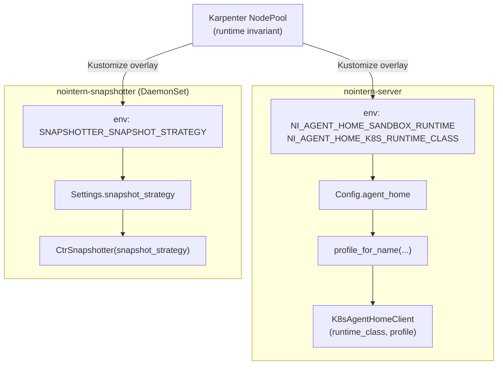

# Sandbox Runtime Profile Design

Bind policies by Agent Home sandbox container runtime (gVisor / runc / Kata) into a single abstraction. See [`../adr/0022-sandbox-runtime-profile.md`](../adr/0022-sandbox-runtime-profile.md) for discussion background and rejected options.

## 1. Scope

Runtime-specific decisions covered by abstraction:

| Concern | Concrete type | Use site |
|---|---|---|
| K8s Pod `runtimeClassName` | `str` (injected through config) | `K8sAgentHomeClient` |
| `securityContext` (seccomp, AppArmor, runAsNonRoot) | `SandboxRuntimeProfile` variant | `K8sAgentHomeClient._build_sandbox_security_context()` |
| Snapshotter commit strategy (`--pause=true` / `--pause=false` / VM checkpoint) | `SnapshotStrategy` | `CtrSnapshotter._commit()` |

nointern app uses full `SandboxRuntimeProfile`, and nointern-snapshotter uses only `SnapshotStrategy`. The two apps communicate by string wire (no shared library — code duplication is accepted).

## 2. Type Structure

### 2.1 `SandboxRuntimeProfile` (discriminated union)

`python/apps/nointern/src/nointern/runtime/sandbox/runtime_profile.py`

```python
@dataclass(frozen=True, kw_only=True)
class GVisorProfile:
    name: Literal["gvisor"] = "gvisor"
    snapshot_strategy: Literal[SnapshotStrategy.ROOTFS_PAUSE_FALSE] = ...

@dataclass(frozen=True, kw_only=True)
class RuncProfile:
    name: Literal["runc"] = "runc"
    snapshot_strategy: Literal[SnapshotStrategy.ROOTFS_PAUSE_TRUE] = ...
    seccomp_profile: Literal["RuntimeDefault", "Localhost"] = "RuntimeDefault"
    apparmor_profile: str | None = None

@dataclass(frozen=True, kw_only=True)
class KataQemuProfile:
    name: Literal["kata-qemu"] = "kata-qemu"
    snapshot_strategy: Literal[
        SnapshotStrategy.ROOTFS_PAUSE_TRUE,
        SnapshotStrategy.VM_CHECKPOINT,
    ] = SnapshotStrategy.ROOTFS_PAUSE_TRUE
    seccomp_profile: Literal["RuntimeDefault", "Localhost"] = "RuntimeDefault"
    apparmor_profile: str | None = None

SandboxRuntimeProfile = GVisorProfile | RuncProfile | KataQemuProfile
```

Each variant declares only fields meaningful to itself — gVisor is a userspace kernel, so seccomp itself is meaningless and no field is present. `match profile:` enables pyright exhaustive narrowing, forcing all use sites to update when a new variant is added.

### 2.2 `SnapshotStrategy` (duplicated on snapshotter side)

Place same enum in `python/apps/nointern-snapshotter/src/nointern_snapshotter/config.py`. Value strings must match exactly on both sides:

| Enum | Wire value | Commit cmd |
|---|---|---|
| `ROOTFS_PAUSE_FALSE` | `"rootfs_pause_false"` | `nerdctl commit --pause=false` |
| `ROOTFS_PAUSE_TRUE` | `"rootfs_pause_true"` | `nerdctl commit --pause=true` |
| `VM_CHECKPOINT` | `"vm_checkpoint"` | (unimplemented — `NotImplementedError`) |

### 2.3 `SnapshotRef` (forward-compatible union)

`python/apps/nointern/src/nointern/runtime/sandbox/agent_home_snapshot_ref.py`

```python
@dataclass(frozen=True, kw_only=True)
class RootfsSnapshotRef:
    kind: Literal["rootfs"] = "rootfs"
    image_ref: str
    base_image_ref: str
    digest: str | None
    size_bytes: int | None

SnapshotRef = RootfsSnapshotRef  # expand to Union when adding VM variant
```

Currently there is only one variant, but `kind` discriminator is included in wire in advance so it can be extended backward-compatibly when Kata+metal VM checkpoint is introduced.

## 3. Strategy Injection Path



Core premise — **one NodePool = one runtime**. To mix gVisor + Kata node groups in same cluster, deploy separate DaemonSet per NodePool (separate NodeSelector) and server side must also change profile depending on which NodePool it schedules onto. Per-request switching is not supported.

## 4. Deployment Manifests

### 4.1 nointern-server

`infra/argocd/nointern-server/overlays/production/base/patches/env.env`

```
NI_AGENT_HOME_SANDBOX_RUNTIME=gvisor
NI_AGENT_HOME_K8S_RUNTIME_CLASS=sandbox
```

### 4.2 nointern-snapshotter

`infra/argocd/nointern-snapshotter/overlays/production/patches/daemonset-env.yaml`

```yaml
env:
  - name: SNAPSHOTTER_SNAPSHOT_STRATEGY
    value: "rootfs_pause_false"
```

Both apps already have defaults matching gVisor, so behavior is same even if values are omitted. They are written explicitly so that (a) runtime switch only requires overlay changes, and (b) current actual runtime is visible from codebase alone.

## 5. New Runtime Addition Checklist

When adding a new runtime (e.g. gVisor sub-platform like `gvisor-ptrace`, firecracker, or Kata+metal) to production, follow this order. Automatic e2e runtime swap CI is not operated; this checklist replaces manual verification (discussion DP5).

1. **Commit/push live verification** — verify `nerdctl commit` on nodes for that runtime
   - Try both `--pause=true` and `--pause=false`, record exit code / unpause behavior
   - Verify push passes ECR auth (docker-credential-ecr-login path)
2. **Add Profile variant** — new dataclass in `runtime_profile.py`
   - Restrict `snapshot_strategy` with Literal (reflect live test result)
   - Extend all `match profile:` use sites without missing any, verified by pyright
3. **Synchronize `SnapshotStrategy` enum** — add enum on snapshotter side if needed
   - Match wire string value exactly with nointern side
   - Include regression test comparing string sets of enums on both sides in PR
4. **Define/deploy RuntimeClass** — add k8s RuntimeClass resource, map to containerd runtime handler
5. **Karpenter NodePool** — add runtime label/taint to node group (`azents.io/sandbox-runtime=<name>`)
6. **DaemonSet overlay** — inject `SNAPSHOTTER_SNAPSHOT_STRATEGY` into snapshotter overlay for that NodePool
7. **Security profile review** — decide whether seccomp / AppArmor profile is needed; if Localhost profile, pre-place on kubelet host
8. **nointern-server env** — update `NI_AGENT_HOME_SANDBOX_RUNTIME` / `NI_AGENT_HOME_K8S_RUNTIME_CLASS` (roll out deployment gradually)
9. **Confirm Manager drift verification path** — verify live that base image ref comparison works with new runtime too (§8.4)

## 6. Regression Tests

- `runtime_profile_test.py` — profile factory + `match` narrowing exhaustiveness
- `agent_home_k8s_test.py` — each profile → `securityContext` mapping (presence/absence of seccomp/apparmor)
- `test_ctr.py::test_commit_pause_flag_reflects_strategy` — each strategy → `--pause` flag mapping (parametrized)
- `test_ctr.py::test_vm_checkpoint_strategy_raises_not_implemented` — explicit failure of placeholder strategy

These 4 tests catch regressions in "profile → cmd/pod spec" mapping. Actual runtime bugs are covered by manual live verification in §5 checklist.

## References

- [`../adr/0022-sandbox-runtime-profile.md`](../adr/0022-sandbox-runtime-profile.md) — design decision background and rejected options
- [`phase3-snapshot-hibernation.md`](phase3-snapshot-hibernation.md) — original snapshot system
- [`gvisor-byoc-sandbox.md`](../adr/0014-gvisor-byoc-sandbox.md) — gVisor adoption background
