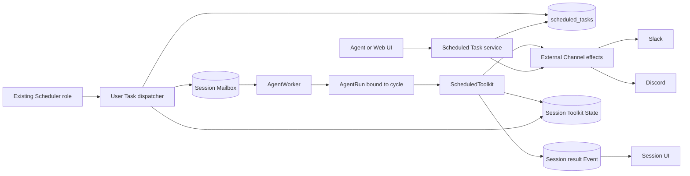

# Agent Scheduled Tasks Design

- Snapshot: `scheduled-260816`
- Document reference: `scheduled-260816/DESIGN`
- Requirements: [Agent Scheduled Tasks Requirements](../requirements/scheduled-260816-agent-scheduled-tasks.md) (`scheduled-260816/REQ`)
- ADR: [Agent Scheduled Tasks](../adr/scheduled-260816-agent-scheduled-tasks.md) (`scheduled-260816/ADR`)
- Design revision: `2`
- Mode: Collaborative
- Decision owner: requester

## Summary

Scheduled Tasks add one durable, Session-owned product object and reuse the current
Scheduler, Mailbox, AgentRun, Toolkit State, External Channel, and Session lifecycle
boundaries.

PostgreSQL stores each Task definition, schedule cursor, due-claim lease, active-cycle
fence, and at most one coalesced pending occurrence. The existing Scheduler runs one
code-registered dispatcher that atomically creates a cycle snapshot and a typed
`scheduled_task_trigger` Mailbox item, then sends the ordinary payload-free Session
wake. The AgentWorker starts the occurrence through the normal Session FIFO and binds
the resulting AgentRun to exactly one internal work-cycle identity.

The automatically connected `ScheduledToolkit` owns Agent management tools, current
cycle guidance, the terminal result tool, idle continuation, work-cycle Toolkit
State, and the release-bundled Scheduled Task Skill. A terminal result is committed
to the Session before any provider effect. Channel registration, progress, terminal
publication, exact-thread parent surfacing, and Tracker cleanup reuse the current
External Channel authorization and provider primitives without sharing canonical
Channel Work state.

## Current Behavior and Gaps

The current Scheduler manages only code-registered maintenance definitions. The
registry and `scheduled_task_states` table store one current state row per code-owned
task key and execute through the existing Job Runtime. They do not represent
user-defined schedules, Session targets, objectives, Bindings, UI CRUD, or
conversation results.

The current Session execution path already provides:

- durable FIFO Mailbox admission with `queue_only` and `wake_session` scheduling;
- payload-free broker wake-up and database-owned wake recovery;
- Session owner-generation fencing and recoverable AgentRuns;
- typed Mailbox and Event unions with exhaustive lowering;
- Session-scoped Toolkit State with schema versions and optimistic concurrency;
- idle-hook continuation through fresh AgentRuns;
- Session archive orchestration and execution-control fencing; and
- immutable run-scoped managed Skill VFS projections.

The current External Channel path already provides:

- opaque Binding handles and current Agent/Session/Binding authorization;
- provider-neutral Channel Action publication;
- Slack Block Kit and Discord Embed progress presentation;
- one-attempt, commit-before-provider-I/O effect execution;
- provider message splitting, file transfer, Session navigation, and interaction
  handling;
- binding, route, connection, App-uninstall, and Session-archive lifecycle fences;
  and
- current Binding context and active opaque handles in model-visible rendering.

There is no current Scheduled Task public API, generated client, Web feature, runtime
toolkit, Mailbox/Event kind, product table, or lifecycle participant. A historical
user-facing `scheduled_tasks` implementation was removed by migration
`9b9479c34ec7`; its Session-per-occurrence, owner-user, enabled/status, Redis,
provider-coordinate, retry-counter, and channel-scoped management model is not current
behavior or authority.

## Requirement and ADR Traceability

| Requirement | Design mechanisms | ADR authority |
| --- | --- | --- |
| `scheduled-260816/REQ-1` | Task table, canonical schedule validation, one Session and nullable Binding target | D1, D7 |
| `scheduled-260816/REQ-2` | Session-bound ScheduledToolkit management tools and fail-closed service lookup | D7 |
| `scheduled-260816/REQ-3` | Public API, generated clients, dedicated Web feature, existing Session create/select flow | D1, D7 |
| `scheduled-260816/REQ-4` | Typed schedule fields, `croniter`, `zoneinfo`, database cursor calculation | D1 |
| `scheduled-260816/REQ-5` | Session ownership columns, current execution snapshot, Binding authorization | D1, D2, D4 |
| `scheduled-260816/REQ-6` | Typed trigger/continuation events, AgentRun cycle binding, dynamic runtime guidance | D2, D3 |
| `scheduled-260816/REQ-7` | Run-bound `submit_scheduled_task_result` terminal tool | D3, D5, D7 |
| `scheduled-260816/REQ-8` | Dedicated Session result event, cycle-state removal, one-time Task deletion | D3, D5 |
| `scheduled-260816/REQ-9` | Existing External Channel flow and exact opaque Binding resolution | D6, D7 |
| `scheduled-260816/REQ-10` | Post-create registration effect and provider interaction controls | D5, D6 |
| `scheduled-260816/REQ-11` | Scheduled-owned Tracker projection and progress routing | D5, D6 |
| `scheduled-260816/REQ-12` | Per-part Slack broadcast or Discord native forward after thread publication | D5, D6 |
| `scheduled-260816/REQ-13` | Due cursor, active fence, pending coalescing, bounded Scheduler claims | D1, D2, D3 |
| `scheduled-260816/REQ-14` | Atomic Run-start boundary and deletion behavior split around that boundary | D1, D2, D4, D5 |
| `scheduled-260816/REQ-15` | Session lifecycle participant and Binding-terminalization integration | D3, D4, D6 |
| `scheduled-260816/REQ-16` | Management projection, current-cycle projection, canonical Session navigation | D1, D3, D5, D6 |
| `scheduled-260816/REQ-17` | Toolkit-owned VFS Skill package and provider-neutral creation workflow | D7 |

## Architecture and Ownership



### Source-of-truth boundaries

- `scheduled_tasks` is the durable authority for active Task definitions, future
  eligibility, due-claim leases, active-cycle fences, and one pending occurrence.
- Session-bound Toolkit State under namespace `scheduled` is the durable authority
  for admitted or started current work-cycle execution state and Scheduled-owned
  provider projection.
- `mailbox_items` is the durable authority for admitted trigger and continuation
  input waiting for Session FIFO execution.
- `agent_runs.scheduled_task_cycle_id` is the recovery-stable binding between one
  AgentRun and the one cycle its terminal tool may affect.
- The dedicated Scheduled Task result Event is the canonical conversational terminal
  result.
- Existing External Channel Connection, Route, Resource, Binding, credentials, and
  provider authorization remain authoritative for provider access.
- Provider messages are presentation records. They are not Task, cycle, terminal
  result, retry, or replay authority.
- `scheduled_task_states` remains exclusively the current-state table for
  code-registered system maintenance tasks.

## Persistent Data Model

### `scheduled_tasks`

Add one new product table named `scheduled_tasks`. Reusing the historical table name
is safe because the earlier table was dropped and no current model or API depends on
its old shape. The new migration must be a newly generated Alembic revision; no
executed migration is modified.

The table contains:

| Field | Contract |
| --- | --- |
| `id` | Immutable lowercase UUID7 hex string, primary key |
| `workspace_id` | Workspace snapshot and ownership fence |
| `agent_id` | Current Session Agent ownership fence |
| `session_id` | Required target AgentSession, restrictive during active lifecycle and cascade-safe at permanent purge |
| `binding_id` | Nullable exact External Channel Binding target |
| `title` | Non-empty bounded display title |
| `objective` | Non-empty bounded plain-text objective |
| `schedule_type` | PostgreSQL enum `once` or `cron` |
| `scheduled_at` | Nullable UTC instant for `once` |
| `cron_expression` | Nullable standard five-field expression for `cron` |
| `timezone` | Nullable IANA timezone for `cron` |
| `next_eligible_at` | Next instant the dispatcher must evaluate |
| `active_cycle_id` | Nullable current occurrence fence |
| `active_scheduled_for` | Nullable represented due instant for the active cycle |
| `pending_scheduled_for` | Nullable earliest due instant coalesced while a cycle is active |
| `lease_owner` | Nullable Scheduler claimant identity |
| `lease_until` | Nullable expiring claim boundary |
| `created_at`, `updated_at` | Audit timestamps, not Task history |

Database constraints require exactly one schedule shape:

- `once`: `scheduled_at` is present; cron and timezone are absent.
- `cron`: cron and timezone are present; `scheduled_at` is absent.
- active cycle ID and scheduled-for instant are both null or both non-null.
- a pending occurrence is allowed only for a recurring Task with an active cycle.

Explicit named indexes cover:

- bounded due scans ordered by `next_eligible_at` and `id`;
- Session list and exact Session-owned deletion;
- nullable Binding lifecycle cleanup; and
- active-cycle lookup.

An internal lease is not a user-visible Task revision. No status, soft-delete marker,
terminal result, last error, run history, creator permission owner, provider
coordinates, or provider delivery ledger is stored.

### Work-cycle Toolkit State

Each occurrence uses one state identity:

```text
agent_id
session_id
toolkit_namespace = "scheduled"
state_name = "cycle:{cycle_id}"
```

Schema version 1 contains:

- `cycle_id`;
- `task_id` as internal provenance;
- phase `admitted` or `started`;
- immutable admitted snapshots of title, objective, canonical schedule,
  `scheduled_for`, Workspace, Agent, Session, and nullable Binding;
- current started AgentRun ID when present;
- current provider-neutral progress title and ordered tasks;
- Scheduled-owned Activity Tracker desired revision and current provider projection
  parts; and
- start timestamp and optimistic state version.

The state contains no terminal result or prior-cycle history. The Task row may be
deleted after the phase becomes `started`; every terminal operation must therefore
operate from this snapshot and tolerate a missing Task row.

### AgentRun cycle binding

Add nullable `agent_runs.scheduled_task_cycle_id`. It is internal execution scope, not
a foreign key to the Task row and not model-visible. It is populated only for Runs
started from `scheduled_task_trigger` or `scheduled_task_continuation`.

This binding provides:

- exact terminal-tool scope;
- worker takeover and Run recovery;
- separation when several Tasks in one Session have admitted or started cycles; and
- a durable distinction between Scheduled Task Runs and unrelated human, Goal,
  External Channel, or subagent Runs in the same Session.

## Schedule Validation and Cursor Semantics

The service accepts one provider-compatible object rather than a root union.
`at`, `cron`, and `timezone` are required nullable fields and runtime validation
enforces the legal combinations.

- `at` is parsed as RFC 3339 and must include `Z` or an explicit offset.
- New one-time registration rejects an instant earlier than transaction time.
- Parsed one-time instants are stored as UTC and serialized as canonical RFC 3339.
- Cron input is accepted only when it has exactly five fields and `croniter` accepts
  it.
- `zoneinfo.ZoneInfo` validates the IANA timezone.
- Cron calculations occur in the named timezone and persist UTC due instants.
- Daylight-saving transitions follow `croniter` and `zoneinfo` calendar behavior;
  no fixed-offset substitute is stored.

For recurring Tasks, the dispatcher advances the cursor through all due instants in
one transaction:

- with no active cycle, all missed instants coalesce into one cycle represented by
  the earliest due instant, and the cursor advances to the first future instant;
- with an active cycle and no pending occurrence, the earliest newly due instant
  becomes `pending_scheduled_for`;
- with an active cycle and an existing pending occurrence, further due instants are
  coalesced without adding another pending item; and
- after terminalization, a pending occurrence becomes immediately eligible once,
  while the already advanced cron cursor retains the next future instant.

The dispatcher always uses a bounded row batch and a bounded cron-iteration guard.
An invalid persisted schedule is an operator-visible invariant failure and is not
silently repaired or disabled.

## Scheduler Dispatch and Mailbox Admission

Add one code-registered Scheduler definition, for example
`user_scheduled_task_dispatch`, to the existing registry. Its Job Runtime handler
invokes a bounded dispatcher service and returns only aggregate diagnostic counts.
The Scheduler's existing polling, timeout, retry, and PostgreSQL state machinery
remain unchanged.

For each due Task, one database transaction:

1. locks and leases the Task row using `SKIP LOCKED`;
2. revalidates the active Session, current Agent ownership, and nullable connected
   Binding;
3. computes missed or overlapping occurrence state;
4. when a new cycle is eligible, allocates a UUID7 cycle ID and writes the immutable
   schema-version-1 Toolkit State snapshot;
5. inserts one idempotent `scheduled_task_trigger` Mailbox item with
   `wake_session`;
6. records the Task active-cycle fence and advances its schedule cursor; and
7. clears the claim lease and commits.

The trigger uses a closed `ScheduledTaskTriggerMailboxPayload`. Its internal payload
contains the cycle ID and one system presentation item. The model-facing content is
rendered from the immutable cycle snapshot and contains:

- title;
- objective;
- complete canonical schedule;
- current `scheduled_for`;
- autonomous continuation and terminal-action guidance; and
- failure guidance for missing information, authority, or prerequisites.

It contains no Task, cycle, Session, or Binding identifier and no internal scheduler
state.

After commit, the dispatcher sends one ordinary `SessionWakeUp(session_id)`. Wake
failure is logged and counted but does not roll back the Mailbox item or create a
second wake record.

### Start boundary and Task deletion race

The Scheduled trigger processor performs one start-admission transaction immediately
before creating the AgentRun:

1. lock the cycle Toolkit State;
2. verify that the phase is `admitted`;
3. verify that the matching Task row and active-cycle fence still exist;
4. create the AgentRun with `scheduled_task_cycle_id`;
5. change the cycle phase to `started` and record the Run ID and start time; and
6. append the typed Scheduled Task trigger Event.

This transaction is the exact beginning-of-AgentRun-execution boundary.

If Task deletion committed first, the trigger and cycle state are absent or fail the
fence; the stale Mailbox input is consumed without creating a Run or transcript
result. If start admission committed first, later Task deletion cannot remove the
started cycle or request interruption.

The run-start transition also preclaims the Scheduled Activity Tracker projection as
an immediate process-local create plan when the snapshot has a Binding. The provider
attempt occurs after commit and its immediate outcome compare-and-sets only the
matching cycle and desired revision.

## Event and Model-Input Contracts

Extend every closed Mailbox, Event, public live-event, history, filtering, and model
lowering union with:

- `scheduled_task_trigger`;
- `scheduled_task_continuation`; and
- `scheduled_task_result`.

Trigger and continuation Events use one typed runtime payload but distinct kinds.
Every supported model lowerer renders them as system-owned user input with the same
self-contained Scheduled Task runtime message. They are not title-generation
eligibility, human provenance, or External Channel messages.

The result Event payload contains:

- title snapshot;
- `scheduled_for`;
- terminal status `finished` or `failed`; and
- non-empty result text.

It is rendered as Agent output in Session history and later model context. Public
live events and history projections use a dedicated presentation type so the Web UI
can label it as a Scheduled Task result without treating it as an ordinary human
message. Existing Session unread-terminal-Run behavior remains the unread authority.

All supported lowerers, filters, transcript mappings, live-event projections,
session-title exclusions, and exhaustive matches must be updated together.

## ScheduledToolkit

### Auto-binding

Add `ScheduledToolkitProvider` to Worker dependency composition and
`resolve_agent_tools`. It is:

- automatically connected for root Session execution;
- unprefixed;
- unavailable to subagents;
- independent of ToolkitConfig, credentials, and AgentToolkit attachment; and
- stable under session-managed Toolkit lifecycle reconciliation.

Its source revision is derived from its canonical Session/Agent scope and release
implementation revision so an incompatible Toolkit instance is replaced before a
Run starts.

### Tool contracts

`add_scheduled_task` accepts one object:

- required non-empty `title`;
- required non-empty `objective`;
- required nullable `at`;
- required nullable `cron`;
- required nullable `timezone`; and
- required nullable `channel_id`.

It derives Agent, Workspace, and Session from the execution context. A non-null
`channel_id` is passed unchanged to the current External Channel Binding resolver.
The service requires exactly one active Binding owned by the same Agent and Session.
After Task commit, a channel-bound creation returns the immediate registration
presentation outcome without rolling back on provider failure.

`list_scheduled_tasks` accepts an empty object and returns all active Tasks for the
current Session. Each item includes the complete definition, nullable target
presentation, future eligibility, and derived execution state:

- `idle`;
- `admitted`;
- `running`; or
- `running_with_pending`.

These values are response projections, not persisted Task statuses.

`delete_scheduled_task` accepts only exact `task_id`. It requires exact current
Session ownership. Before the start boundary it removes the Task, active or pending
cursor state, trigger Mailbox item, and admitted cycle state. After the start boundary
it removes only the Task and its future or pending schedule authority.

The shared Web/provider edit service locks the Task and applies edits only to work
that has not started:

- an idle Task replaces its editable definition and recalculates future eligibility;
- an admitted cycle is removed with its trigger before the edited definition
  recalculates eligibility;
- a recurring Task with a started cycle preserves that cycle snapshot, clears any
  coalesced pending occurrence from the old definition, and calculates future
  eligibility from the edited schedule; and
- a one-time Task with a started cycle rejects edit because it has no future
  occurrence to change and will be deleted when that cycle terminalizes.

`submit_scheduled_task_result` accepts:

- `status`: `finished` or `failed`; and
- required non-empty `result`.

It is exposed only when the current AgentRun has a valid started cycle binding. It
accepts no identity. The engine treats it as a run-terminal client tool: its durable
tool result is finalized, and the Run completes without requiring another model turn
or an additional assistant message.

### Runtime guidance and idle continuation

Scheduled-cycle-specific instructions are a dynamic prompt only when the current Run
is bound to a Scheduled cycle. Management tools retain concise descriptions suitable
for every Run.

The dynamic prompt:

- repeats the self-contained objective and schedule;
- states that ending one Run does not finish the cycle;
- requires autonomous work until terminal;
- requires `submit_scheduled_task_result` for finished or failed completion;
- explains when blocked work must fail;
- for a channel-bound cycle, limits `channel_action` to interim publication and
  progress; and
- for a Session-only cycle, states that no provider publication is required.

The idle hook queries started nonterminal cycles in the current Session. It returns one
`ScheduledTaskSessionContinuationInput` per eligible cycle in deterministic
`scheduled_for`, cycle-ID order. Each continuation becomes a typed
`scheduled_task_continuation` Mailbox item with an internal cycle ID and the same
model-facing runtime message. This also restores continuation after unrelated FIFO
human work ran between Scheduled Task Runs.

## Managed Scheduled Task Skill

The release package is rooted at:

```text
python/apps/azents/src/azents/resources/vfs/toolkits/scheduled/
```

and projects:

```text
azents://skills/scheduled/scheduled-task/SKILL.md
```

with its referenced creation-context and schedule-interpretation files.

`ScheduledToolkitProvider.vfs_resource_root` points to
`resources/vfs/toolkits/scheduled`. Because current VFS eligibility discovers only
DB-attached provider resources, `VfsProjectionService` must add a deterministic
required auto-bound provider source list. The Scheduled source is included in every
eligible root Agent preview and persisted Run projection without a ToolkitConfig.
The source remains immutable within an AgentRun and participates in normal content
hash and projection validation.

The Skill remains provider-neutral, preserves exact opaque channel handles, uses the
current Session, performs only necessary clarification, and implements replacement as
List, Delete, then Add.

## Terminal Result Transaction and Recovery

`submit_scheduled_task_result` first executes one PostgreSQL transaction:

1. lock the AgentRun and validate its cycle binding;
2. lock and validate the started cycle Toolkit State;
3. construct process-local terminal provider and Tracker cleanup plans from the cycle
   snapshot;
4. append one deterministic `scheduled_task_result` Event;
5. remove the completed cycle Toolkit State;
6. if the Task still exists and is one-time, hard-delete it;
7. if the Task still exists and is recurring, clear its active fence and expose its
   pending occurrence or future cursor; and
8. commit.

The deterministic result Event identity is also the crash fence. If recovery repeats
the same terminal Tool call after the canonical Event committed but before its Tool
result or provider effects completed, the service recognizes the existing Event,
does not append another result, and does not retry provider publication or Tracker
cleanup. It returns a recovered canonical outcome with provider effects reported as
not attempted because no durable provider outcome exists.

After a new canonical commit:

1. publish the result Event to live Session clients;
2. execute ordered channel terminal message parts once;
3. surface every exact-thread part to its parent in the same order;
4. attempt Tracker deletion regardless of terminal publication outcomes; and
5. return the immediate sanitized effect outcomes.

A crash before, during, or after provider I/O creates no outbox, retry, replay,
compensation, or Task recreation. Session resync recovers the canonical Event for Web
clients.

## Deletion and Lifecycle Semantics

### Explicit Task deletion

Task deletion is a Task-product operation only.

- An admitted cycle is removed before Run start.
- A started cycle remains active from its immutable snapshot.
- No AgentRun stop, Session stop, Toolkit State removal, Tracker deletion, or
  terminal suppression is requested for a started cycle.
- A deleted recurring Task is never recreated when its independent cycle ends.

### Session archive

Register `session.scheduled-task` as a required Session lifecycle participant. Its
archive transition, in the caller-owned transaction:

- deletes all Task rows in the Session subtree;
- deletes admitted Scheduled cycle Toolkit State and its trigger input before Run
  start;
- removes future and pending occurrence authority;
- preserves started Scheduled cycle Toolkit State, active AgentRuns, and their
  continuation authority; and
- captures Scheduled Tracker cleanup plans where current provider identity exists.

Archive sends no stop or interruption request for a started Scheduled Run. While a
pre-archive cycle remains active, the archived Session admission boundary accepts
only typed Scheduled Task continuations whose cycle state proves that start occurred
before archive. It rejects ordinary user input, new Task triggers, and unrelated
continuations without adding another Session status or reopening the Session.

The current blanket running-Session archive guard becomes Scheduled-aware. An active
Run permits archive only when it is bound to a valid started Scheduled cycle that the
archive transaction preserves. Any ordinary active Run, invalid or missing cycle
binding, or unrelated active work anywhere in the locked Session subtree retains the
existing `RunningSessionArchiveBlocked` result. The corresponding idle-continuation
consumer gains the same typed exception for preserved Scheduled cycles while keeping
its current rejection for every other archived-Session continuation.

The cycle can append its terminal result to the archived Session. Provider cleanup is
attempted once after archive commit. Restore never recreates removed Tasks or admitted
cycles. Permanent purge waits until every preserved started cycle terminalizes and
verifies that no Scheduled Task row or Scheduled namespace Toolkit State remains
before Session finalization.

### Binding termination

Every existing Binding-terminalization path calls the Scheduled Task lifecycle
collaborator inside the same database transaction that sets `disconnected_at`.
It removes Tasks targeted at the Binding, their future and pending occurrences, and
their admitted cycle state before Run start. It preserves every started cycle and
AgentRun, sends no stop or interruption request, and executes Scheduled Tracker
cleanup plans after commit.

The preserved cycle continues through normal Session continuations. Current Binding
authorization rejects later interim and terminal provider publication, so those
effects return unavailable or not attempted. The terminal Session result remains
required and no other Binding or Session-only provider behavior is substituted.

This applies to manual Binding disconnect, route removal, connection disconnect,
authenticated App uninstall, Agent decommission, and Session archive. Transient
connection health changes do not invoke this collaborator.

No lifecycle path moves a Task to another Binding, converts it to Session-only, or
restores it after reconnect or Session restore.

## External Channel Registration and Progress

### Registration presentation

After a channel-bound Task commits, the service builds one process-local registration
effect through the existing provider route and exact Binding target. Slack renders a
Block Kit message and Discord renders an Embed/component message containing:

- Task title;
- canonical one-time or recurring schedule;
- Edit control; and
- Delete control.

Control payloads carry only bounded internal action identity, Task ID, and Binding
context required for callback correlation. They contain no credentials, Session
transcript, objective body, provider access token, or Task revision.

Each control callback or modal submission:

1. claims the existing provider interaction idempotently;
2. reloads the current Task;
3. revalidates provider principal access, active Binding, Session, Agent, and
   current management authorization;
4. applies edit or hard delete through the same service contracts as the Web UI; and
5. returns an immediate provider-native acknowledgement.

A missing Task returns unavailable and performs no mutation. Provider rendering or
acknowledgement failure never rolls back the canonical Task and creates no durable
delivery state.

### Scheduled-owned Activity Tracker

The cycle Toolkit State owns its Tracker desired state and provider projection.
Neither the Task row nor Channel Work state owns it. Different Scheduled cycles and
ordinary Channel Work may coexist on one Binding without sharing work-cycle IDs,
desired revisions, provider message identities, or cleanup.

Tracker creation and updates reuse current Slack Block Kit and Discord compact Embed
renderers, but use a Scheduled-specific projection owner. Provider results settle only
the matching cycle and desired revision.

During a channel-bound Scheduled Run, `channel_action` resolves the Run's Scheduled
cycle context before canonical mutation:

- only the cycle's exact Binding may be used for Scheduled progress;
- `continue` may publish interim text or files and replace the Scheduled progress
  title and ordered task snapshot;
- `finish` and `ignore` are rejected for the Scheduled cycle because only
  `submit_scheduled_task_result` may terminalize it; and
- the canonical update is written to Scheduled cycle state, not Channel Work state.

The current Binding handle exposure and External Channel rendering remain the
model-visible source for the opaque handle; the Scheduled runtime message itself does
not contain a Binding identifier.

### Terminal publication and exact-thread surfacing

Terminal result text is lowered through the current provider splitting and
authorization boundary.

- A parent-channel Binding creates each part directly in the parent and does not
  duplicate it.
- A Slack exact-thread Binding creates each part as a thread reply with
  `reply_broadcast=true`.
- A Discord exact-thread Binding creates each part in the Thread, then forwards that
  exact created message to the parent channel through native message forwarding.
- Every part preserves order. No generated summary replaces split parts.
- Forwarding failure affects only that part's immediate parent-surfacing outcome and
  does not undo the thread message or Session result.

The current pinned `discord.py` version supports native message forwarding. The
Discord adapter must add a typed public-SDK forwarding operation and retain the
current one-attempt, nonce, deadline, permission, and ambiguity classification.

## Public API and Web UI

### Public API

Add a versioned Public API domain under `/scheduled-task/v1` with service-layer
authorization:

- list authorized Tasks for an Agent or selected Session;
- create a Task with required Session and nullable channel target;
- get one exact Task;
- replace editable definition fields for future work;
- hard-delete one exact Task; and
- read the current-cycle projection for management display.

The API uses the same schedule validator, Task repository, Binding resolver, deletion
boundary, and lifecycle rules as Agent tools. It does not expose leases, Toolkit State
versions, cycle IDs, provider message IDs, or a Task revision token.

UI create uses existing Chat APIs to create or select a persistent Session, then
passes that Session to the Scheduled Task create endpoint. The Scheduled Task API
does not create an implicit Session.

Regenerate:

- the public OpenAPI document;
- the Python public client; and
- the TypeScript public client.

Generated files are never edited manually.

### Web feature

Add a `scheduled-tasks` feature using the existing container/component/page split and
a dedicated Agent route such as:

```text
/w/{handle}/agents/{agentId}/scheduled-tasks
```

The feature includes:

- authorized Task list;
- create form with existing or newly created Session selection;
- one-time and recurring schedule assistance;
- optional authorized parent-channel or exact-thread Binding selection;
- details and edit form;
- permanent delete confirmation;
- derived current execution and future eligibility;
- current-cycle progress;
- explicit target type and provider conversation label; and
- navigation to the canonical Session.

The feature does not render another transcript, terminal history, Pause, Resume,
Rerun, or cancel-current-cycle controls. Pure UI states receive colocated Storybook
stories. tRPC calls the generated public client and invalidates list/detail queries
after mutation.

## Security and Authorization

- Agent tools derive Workspace, Agent, Session, Run, and resource authority from the
  current execution context.
- Public API requests reuse current Session access authorization and expose only
  Sessions and Bindings available to the requester.
- Provider controls reuse current External Channel principal and Binding
  authorization; a provider principal never becomes an Azents execution User.
- Binding handles are opaque and passed unchanged. Task rows store only the resolved
  Binding ID, not duplicated provider tenant, channel, thread, or message
  coordinates.
- Every mutation locks and revalidates the Task and its current Session/Binding
  authority.
- Exact-ID lookup is required; no prefix, slug, title, fuzzy, recent, or fallback
  lookup exists.
- Task title and objective are bounded at tool and API ingress using shared service
  constants selected within existing provider-schema and request-size limits.
- Cron iteration, Scheduler batch size, provider part count, and interaction payload
  size are bounded.
- Logs and metrics contain IDs, counts, phases, stable failure codes, and durations,
  but never objective text, result text, provider bodies, credentials, or raw
  interaction payloads.

## Failure, Retry, and Recovery

| Boundary | Recovery behavior |
| --- | --- |
| Invalid create input | Fail before mutation with a stable validation error |
| Scheduler failure before admission commit | Lease expires and the occurrence may be reclaimed |
| Failure after admission commit but before wake | Mailbox row remains; existing recovery wakes or drains it |
| Duplicate dispatcher execution | Task active fence and Mailbox idempotency key prevent a second cycle |
| Delete races with start | Start-admission transaction determines pre-start removal versus started independence |
| AgentWorker loss during Run | Existing AgentRun and Session recovery resume with persisted cycle binding |
| Run ends without terminal tool | Idle hook enqueues a typed continuation |
| Missing information or authority | Agent submits `failed` with reason and required remediation |
| Terminal transaction failure | Cycle remains active; normal Tool/Run recovery may retry the canonical transaction |
| Crash after terminal commit | Result Event remains canonical; provider effects are not replayed |
| Registration or Tracker create failure | Task or cycle remains active; no automatic replay |
| Interim publication failure | Immediate Tool outcome reports failed, unknown, or not attempted |
| Terminal publication failure | Session result remains terminal and Tracker deletion is still attempted |
| Tracker deletion failure | Cycle remains terminal; no retry or reopening |
| Session archive or Binding termination | Task, future, pending, and pre-start work are removed; started cycles continue without interruption; provider cleanup is one attempt |

## Migration, Rollout, and Rollback

### Migration

One generated linear Alembic revision adds:

- the new `scheduled_tasks` table and PostgreSQL schedule enum;
- the nullable AgentRun cycle-binding column;
- new persisted Mailbox and Event enum values as required by the current schema; and
- explicit named indexes and constraints.

There is no data backfill because no current user Scheduled Task product exists.
Historical dropped-table data is not restored.

### Rollout order

1. Deploy backward-readable schema and closed-union readers.
2. Deploy backend repositories, service, lifecycle participant, events, and Toolkit
   with dispatcher registration disabled by code order until all readers understand
   the new kinds.
3. Deploy regenerated clients and Web feature.
4. Enable Scheduler dispatch after Worker and API compatibility is present.
5. Verify no unknown Mailbox/Event kind errors and then expose provider registration
   controls.

The final implementation should use one coordinated release when independent
mixed-version compatibility cannot be guaranteed. No permanent feature flag,
fallback mode, legacy route, or duplicate scheduler remains after rollout.

### Rollback

Before any Task exists, application rollback may remove the new schema through the
generated migration downgrade in non-production test environments.

After Tasks exist, rollback is operationally destructive because an older Worker
cannot interpret new Mailbox/Event kinds. Production rollback therefore first stops
new creation and dispatch, waits for every started cycle to terminalize, deletes any
remaining Task and pre-start cycle state, and verifies no Scheduled Mailbox items
remain. Rollback never stops or deletes a started cycle. The database schema is
retained until compatible code is restored or an explicitly approved destructive
migration is performed.

## Observability and Operations

Structured logs and metrics cover:

- Task create, edit, list, and delete outcomes;
- due rows scanned, leased, reclaimed, coalesced, admitted, and skipped;
- schedule calculation failures and bounded-iteration failures;
- trigger and continuation Mailbox creation;
- start-admission success and pre-start deletion suppression;
- active cycle count and age;
- terminal finished and failed counts and latency from `scheduled_for`;
- Task-missing terminalization after independent deletion;
- registration, Tracker, interim publication, terminal publication, parent
  surfacing, and cleanup outcomes by provider and stable status;
- Session archive and Binding-terminalization removal counts; and
- stale cycle, Task-fence, AgentRun-scope, and provider-projection conflicts.

Scheduler health includes the existing code-registered task state plus dispatcher
summary counts. Alerts should cover persistent dispatcher failures, oldest overdue
eligible Task age, excessive admitted-without-start age, excessive started-cycle age,
and invariant violations. No alert depends on Redis durability or provider delivery
replay.

## Test Strategy

### E2E primary verification matrix

| Scenario | Session-only | Slack parent | Slack thread | Discord parent | Discord thread |
| --- | ---: | ---: | ---: | ---: | ---: |
| Create, list, inspect, edit, delete | Required | Required | Required | Required | Required |
| One-time due execution and terminal result | Required | Required | Required | Required | Required |
| Recurring continuation across Runs | Required | Representative | Representative | Representative | Representative |
| Registration controls | N/A | Required | Required | Required | Required |
| Activity Tracker and interim progress | N/A | Required | Required | Required | Required |
| Exact-thread parent surfacing | N/A | N/A | Required | N/A | Required |
| Provider failure without canonical rollback | N/A | Required | Representative | Required | Representative |

### E2E plan

Automated E2E tests use a deterministic test clock and testenv dispatcher control so
they never wait for wall-clock cron boundaries. They verify:

1. natural-language Agent creation loads the managed Skill and calls the exact
   management tool;
2. ordinary Session creation uses null channel target;
3. source External Channel and explicit alternate Binding selection preserve exact
   opaque handles;
4. invalid, stale, disconnected, unauthorized, and wrong-Session identifiers fail
   closed;
5. one-time and cron schedule validation;
6. same-Session context across recurring cycles;
7. multiple Runs continue until the terminal tool;
8. missed one-time recovery and cron coalescing;
9. one active plus at most one pending occurrence per Task;
10. pre-start deletion suppresses execution;
11. post-start deletion preserves continuation and terminal result;
12. Session archive and Binding disconnect delete associated Tasks and pre-start
    work while preserving started Run continuation and Session terminal results,
    including Scheduled-only archive admission and rejection of unrelated active
    Runs or archived-Session continuations;
13. canonical Session result survives provider failure;
14. Slack thread parts use broadcast and Discord Thread parts are forwarded in order;
15. UI CRUD, dedicated Session create/select, progress display, and Session
    navigation; and
16. no terminal history, pause, resume, rerun, or cancel-current-cycle UI appears.

### Testenv and fixtures

Testenv support is required because real-time scheduling, crash boundaries, and
provider failure classification are not deterministic through browser actions alone.
Add:

- clock-controlled Task creation and due-dispatch fixtures;
- explicit dispatcher tick and worker-drain controls;
- fake Slack and Discord provider adapters recording ordered operations;
- provider outcomes for delivered, failed, unknown, and not attempted;
- Session/Binding fixtures for parent and exact-thread targets;
- lifecycle fixtures for archive, disconnect, route removal, and App uninstall;
- worker crash points before admission commit, after admission commit, after start,
  after terminal commit, and during provider effects; and
- seeded Sessions containing multiple Tasks and unrelated FIFO input.

Real Slack and Discord credentials are optional live verification prerequisites.
CI-required product behavior uses deterministic fake providers. Live-provider suites
may skip only when their declared credential snapshot is absent; when credentials are
present, provider rejection or contract drift fails the suite.

### Evidence

CI evidence includes:

- API responses and generated-client type checks;
- Session history and live-event snapshots;
- Task/cycle/Mailbox database invariant assertions;
- ordered fake-provider operation records;
- Web E2E screenshots for list, create/edit, progress, and terminal navigation;
- exact-thread multipart ordering assertions; and
- crash-recovery and no-replay assertions.

Backend unit and integration tests additionally cover cron/DST calculation, SQL
constraints and leases, exhaustive unions and all model lowerers, Toolkit State
optimistic conflicts, terminal idempotency, provider projection fences, and lifecycle
registry ownership.

## Alternatives, Assumptions, and Non-Blocking Risks

Accepted and rejected material alternatives are recorded in
`scheduled-260816/ADR-D1` through D7.

Non-blocking implementation risks:

- Long-running started cycles can retain Toolkit State until the Agent terminalizes,
  including after Session archive or Binding termination. Archived Session purge may
  therefore remain blocked. Age metrics and operator inspection are required; no
  automatic product timeout or interruption is authorized.
- Discord native forwarding requires the App to read the source message and the
  source message to be forwardable. Provider rejection remains an immediate failed
  outcome and does not permit generated-summary fallback.
- DST behavior can surprise users even when cron semantics are correct. UI schedule
  preview and E2E DST fixtures should make the next instants visible.
- Provider interaction modals differ between Slack and Discord. Their local control
  layout is agent-owned as long as both reload and revalidate the same Task before
  mutation.
- Operational limits may be tightened only within the Requirements' abuse-control
  assumption and may not add a new lifecycle state or invalidate the primary
  scenarios.

## Feasibility Review

| Area | Result | Repository evidence |
| --- | --- | --- |
| PostgreSQL schedule authority | Feasible | Existing SQLAlchemy/Alembic conventions and Scheduler lease repository |
| Bounded Scheduler dispatcher | Feasible | Existing Scheduler registry, 10-second poll loop, Job Runtime, and leased state |
| Cron and timezone calculation | Feasible | `croniter==6.2.2` and Python `zoneinfo` are available |
| Typed Mailbox admission | Feasible | Closed payload registry, FIFO promotion, `wake_session`, and payload-free broker wake |
| Run-start deletion boundary | Feasible | Mailbox processor and AgentRun creation boundary can share a locking transaction |
| AgentRun recovery binding | Feasible | AgentRun is already durable and worker recovery resumes running Runs |
| Toolkit State cycles | Feasible | Session-bound namespaced state and optimistic handles already exist |
| Idle continuation | Feasible | Runtime hooks already emit multiple typed continuation inputs |
| Terminal Session Event | Feasible | Event transcript supports deterministic append and complete lowerer projection |
| Auto-bound ScheduledToolkit | Feasible | Goal, Todo, External Channel, and other auto-bound providers establish the pattern |
| Toolkit-owned managed Skill | Feasible | Provider release VFS roots exist; eligibility requires a bounded auto-source extension |
| Opaque Binding validation | Feasible | `channel_action.binding` resolution and active Binding context already exist |
| Provider registration controls | Feasible | Existing Slack/Discord interaction claims, components, modals, and authorization rechecks |
| Independent Tracker state | Feasible | Channel Work demonstrates provider-neutral desired state and projection fences without requiring reuse |
| Slack exact-thread surfacing | Feasible | Slack SDK `chat.postMessage` supports `thread_ts` plus `reply_broadcast` |
| Discord exact-thread surfacing | Feasible | Pinned `discord.py==2.7.1` exposes native message forwarding for forwardable messages |
| Session and Binding lifecycle | Feasible | The current archive service has a blanket active-Run guard and archived idle-continuation rejection; both are bounded extension points for a cycle-bound Scheduled exception while retaining ordinary rejection. Session participants can remove Task-owned pre-start state, and External Channel terminalization can remove associated Tasks and revoke provider authority |
| Public API and clients | Feasible | Versioned public routers, OpenAPI dump, and generated Python/TypeScript clients exist |
| Dedicated Web UI | Feasible | Existing App Router, generated-client tRPC, Session creation, and Session Channels patterns exist |
| Deterministic verification | Feasible | Testenv Scheduler controls, E2E substrate, fake provider patterns, and lifecycle fixtures exist |

No confirmed Requirement or accepted ADR is blocked. The auto-bound VFS source,
Run-start cycle binding, Scheduled-specific progress routing, and Discord forwarding
operation are required bounded extensions, not new authorities.

## Design Authority

- Design revision: `2`

| ID | Material design mechanism | Authority | Classification |
| --- | --- | --- | --- |
| M1 | One PostgreSQL Task row owns definition, schedule cursor, due lease, active fence, and one pending occurrence | `scheduled-260816/REQ-1`, `REQ-4`, `REQ-13`, `REQ-14`; `scheduled-260816/ADR-D1` | `decided` |
| M2 | Existing Scheduler role runs one bounded dispatcher and hands due work to durable FIFO Mailbox admission | `scheduled-260816/REQ-5`, `REQ-6`, `REQ-13`; `scheduled-260816/ADR-D1`, D2 | `decided` |
| M3 | Each cycle is Session-bound Scheduled Toolkit State and each Scheduled AgentRun has one internal cycle binding | `scheduled-260816/REQ-6`, `REQ-7`, `REQ-13`, `REQ-14`; `scheduled-260816/ADR-D2`, D3, D4 | `derived` |
| M4 | The start-admission transaction is the exact boundary between pre-start deletion and started-cycle independence | `scheduled-260816/REQ-14`; `scheduled-260816/ADR-D4` | `decided` |
| M5 | `submit_scheduled_task_result` commits one dedicated Session result Event and terminalizes the Run without another model turn | `scheduled-260816/REQ-7`, `REQ-8`; `scheduled-260816/ADR-D5`, D7 | `derived` |
| M6 | Canonical terminal commit precedes one-attempt provider publication, exact-thread surfacing, and Tracker cleanup with no replay | `scheduled-260816/REQ-8`, `REQ-11`, `REQ-12`, `REQ-14`; `scheduled-260816/ADR-D5` | `decided` |
| M7 | Task deletion, Session archive, and Binding termination remove associated scheduling authority and pre-start work without interrupting a started cycle; archived Sessions admit only its internal continuations and disconnected Bindings revoke provider effects | `scheduled-260816/REQ-6`, `REQ-14`, `REQ-15`; `scheduled-260816/ADR-D3`, D4, D5 | `decided` |
| M8 | Scheduled registration and cycle progress use Scheduled-owned projection state while reusing lower-level External Channel primitives | `scheduled-260816/REQ-10`, `REQ-11`, `REQ-12`; `scheduled-260816/ADR-D6` | `decided` |
| M9 | One unprefixed root-only auto-bound ScheduledToolkit owns management, execution, idle hooks, terminal action, and release Skill | `scheduled-260816/REQ-2`, `REQ-6`, `REQ-7`, `REQ-17`; `scheduled-260816/ADR-D7` | `decided` |
| M10 | The Toolkit Skill is projected as a required auto-bound `scheduled` VFS release source in every eligible root Run | `scheduled-260816/REQ-2`, `REQ-17`; `scheduled-260816/ADR-D7`; current managed Skill VFS contract | `derived` |
| M11 | Public API, generated clients, and dedicated Web UI manage the same Task rows and use existing Session creation/selection | `scheduled-260816/REQ-3`, `REQ-16`; current Public API, client-generation, and Session contracts | `required` |
| M12 | Exact Binding handles remain opaque and all Agent, Web, and provider mutations revalidate current Session/Binding authority | `scheduled-260816/REQ-1`, `REQ-2`, `REQ-5`, `REQ-9`, `REQ-10`, `REQ-15`, `REQ-17`; current External Channel authorization contract | `required` |
| M13 | New typed trigger, continuation, and result variants extend every closed Mailbox/Event/lowerer/public projection boundary | `scheduled-260816/REQ-6`, `REQ-8`; `scheduled-260816/ADR-D2`, D5; current exhaustive engine-union constraint | `derived` |
| M14 | Migration adds only new schema and no historical Task backfill, compatibility mode, or second scheduler | `scheduled-260816/REQ-13`, `REQ-14`; `scheduled-260816/ADR-D1`; historical removal evidence | `derived` |

## Removal and Replacement

| Existing unit or behavior | Removal authority | Replacement or remaining authority | Removal boundary | Absence verification |
| --- | --- | --- | --- | --- |
| Historical user `scheduled_tasks` product model with owner-user execution, enabled/status fields, provider coordinates, per-run Sessions, Redis leadership, and retry counters | `scheduled-260816/REQ` Fixed Constraints and Non-Goals; `scheduled-260816/ADR-D1`, D2, D3, D4 | New mechanisms M1-M8 | Do not restore old schema, APIs, tools, or runtime behavior | Migration `9b9479c34ec7` drops the table; source and Web searches find no current product implementation |
| Historical `schedule_create`, `schedule_list`, and `schedule_delete` contracts | `scheduled-260816/REQ-2`, `REQ-14` | Exact `add_scheduled_task`, `list_scheduled_tasks`, `delete_scheduled_task` and replacement flow | No alias, upsert, fuzzy lookup, or compatibility wrapper | Current source has no tool implementation; new tool catalog tests assert only required names |
| Historical Session-per-occurrence execution | `scheduled-260816/REQ-5`, `REQ-6`; `scheduled-260816/ADR-D2`, D3 | Existing target Session, Mailbox, AgentRun, and cycle Toolkit State | No new occurrence Session creation path | Repository search finds no current user Scheduled Task execution path; E2E asserts stable Session ID |
| Reusing `scheduled_task_states` for user Tasks | `scheduled-260816/ADR-D1` | Table remains for code-registered maintenance tasks only | No column or repository semantic change for product Tasks | Existing model docstring and Scheduler registry identify code-registered ownership |
| Reusing Channel Work state for Scheduled progress | `scheduled-260816/ADR-D6` | Existing Channel Work remains unchanged; Scheduled cycle projection is separate | No state migration or shared work-cycle identity | Toolkit State namespaces and provider projection tests assert independent owners |
| Current Public API, generated client, and Web Scheduled Task surface | None; no current surface exists | Add M11 | Addition only | TypeScript and Public API searches find no current Scheduled Task route or feature |
| Current durable provider delivery/replay path for Scheduled Tasks | None; no current path exists | Immediate process-local effects under M6 and M8 | Addition only; no outbox or replay worker | Repository search and current External Channel Spec confirm immediate-effect model |
| Legacy compatibility after rollout | `scheduled-260816/REQ` Non-Goals and Fixed Constraints; accepted ADR decisions | None | Remove temporary rollout guards after all readers support new kinds | Static route/tool/schema assertions and final repository search |

## Design Approval

- Mode: `Collaborative`
- Decision owner: `requester`
- Approved on: `2026-08-16`
- Approved Design revision: `2`
- Approved authority IDs: `M1`–`M14`
- Approved scope: All material mechanisms in revision 2, including PostgreSQL scheduling authority, FIFO Session admission, Scheduled-owned cycle state and provider projections, canonical Session terminal results before one-attempt provider effects, exact Binding preservation, lifecycle removal of Tasks and pre-start work without interruption of started cycles, Public API and Web management, release-bundled Agent guidance, new typed protocol variants, and additive migration without legacy compatibility.
