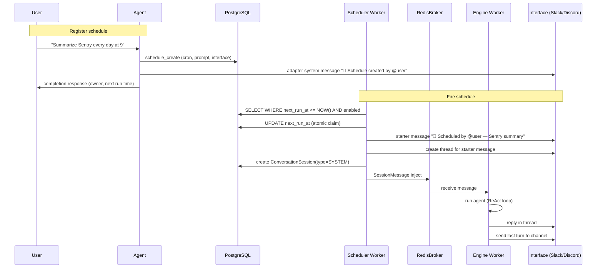
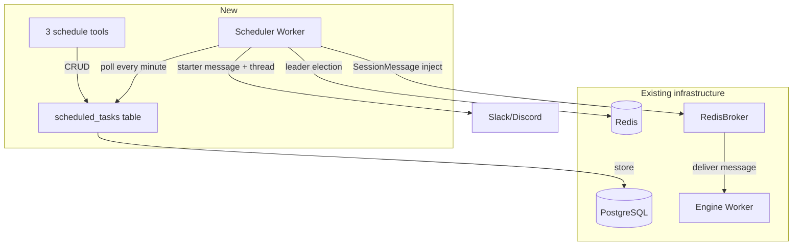

# Scheduled Tasks Design

## Overview

Feature allowing agent to create and manage scheduled tasks by itself.

- **Cron-based periodic execution** — "Summarize Sentry issues every day at 9 AM"
- **Scheduled execution (One-shot)** — "Check deployment status tomorrow at 3 PM"

Agent calls tools during conversation to register schedule, and Scheduler Worker creates new session at specified time and triggers agent.

## Architecture

### Execution Flow



### Components



## Data Model

### scheduled_tasks Table

```python
class ScheduleType(enum.StrEnum):
    CRON = "cron"
    ONCE = "once"

class RDBScheduledTask(Base):
    __tablename__ = "scheduled_tasks"

    id: Mapped[str] = mapped_column(sa.String(32), primary_key=True)
    workspace_id: Mapped[str] = mapped_column(
        sa.String(32),
        sa.ForeignKey("workspaces.id", ondelete="CASCADE"),
    )
    agent_id: Mapped[str] = mapped_column(
        sa.String(32),
        sa.ForeignKey("agents.id", ondelete="CASCADE"),
    )
    owner_user_id: Mapped[str] = mapped_column(sa.String(32))

    # schedule definition
    schedule_type: Mapped[ScheduleType] = mapped_column(
        ENUM(ScheduleType, name="schedule_type", create_type=False),
    )
    cron_expression: Mapped[str | None] = mapped_column(sa.String(100))
    scheduled_at: Mapped[datetime | None] = mapped_column(sa.DateTime(timezone=True))
    timezone: Mapped[str] = mapped_column(sa.String(50))

    # execution settings
    prompt: Mapped[str] = mapped_column(sa.Text)

    # result delivery — store InterfaceContext as JSON
    interface_type: Mapped[str | None] = mapped_column(sa.String(20))
    interface_data: Mapped[dict[str, object] | None] = mapped_column(sa.JSON)

    # state
    enabled: Mapped[bool] = mapped_column(sa.Boolean)
    next_run_at: Mapped[datetime | None] = mapped_column(sa.DateTime(timezone=True))
    last_run_at: Mapped[datetime | None] = mapped_column(sa.DateTime(timezone=True))
    last_error: Mapped[str | None] = mapped_column(sa.Text)
    consecutive_failures: Mapped[int] = mapped_column(sa.Integer)

    created_at: Mapped[datetime] = mapped_column(sa.DateTime(timezone=True))
    updated_at: Mapped[datetime] = mapped_column(sa.DateTime(timezone=True))

    IX_NEXT_RUN = sa.Index("ix_scheduled_tasks_next_run_at", "next_run_at")
    IX_WORKSPACE = sa.Index("ix_scheduled_tasks_workspace_id", "workspace_id")
    IX_AGENT = sa.Index("ix_scheduled_tasks_agent_id", "agent_id")
    IX_INTERFACE = sa.Index(
        "ix_scheduled_tasks_interface",
        "interface_type", "interface_data",
    )

    __table_args__ = (IX_NEXT_RUN, IX_WORKSPACE, IX_AGENT)
```

### conversation_sessions Change

```python
# add FK
scheduled_task_id: Mapped[str | None] = mapped_column(
    sa.String(32),
    sa.ForeignKey("scheduled_tasks.id", ondelete="SET NULL"),
)
```

## Tool Interface

### schedule_create (upsert)

```python
class ScheduleCreateInput(BaseModel):
    cron: str | None = Field(
        default=None,
        description="Cron expression (e.g. '0 9 * * 1-5')",
    )
    at: str | None = Field(
        default=None,
        description="ISO 8601 datetime for one-shot (e.g. '2026-04-01T15:00:00')",
    )
    prompt: str = Field(description="Message to send when fired")
    timezone: str = Field(default="UTC", description="IANA timezone")
    schedule_id: str | None = Field(
        default=None,
        description="Existing schedule ID for upsert",
    )
```

- One of `cron` and `at` is required.
- On upsert, **ownership transfers to caller** (prevents privilege escalation).
- cron validation: attempt parse with `croniter`, return error on failure.
- Return value must include owner + permission guidance.
- On upsert, adapter sends system message to channel.

### schedule_list

- Return **all** schedules targeting current channel (regardless of owner).
- Channel scoping: filter by current `interface_type` + channel_id in `interface_data`.

### schedule_delete

- Can delete schedules targeting current channel (regardless of owner).
- Any channel member can remove spam schedules.

## Scheduler Worker

### Process Structure

```python
# src/cli/scheduler.py
async def main() -> None:
    config = Config.from_env()
    configure_logging_for_runtime(...)
    shutdown_event = asyncio.Event()

    async with run_with_container(config) as container:
        scheduler = await container.solve(get_scheduler)
        # register signal handler
        await scheduler.run(shutdown_event=shutdown_event)
```

### Leader Election

- Redis `SETNX nointern:scheduler:leader {worker_id}` (TTL 30 seconds)
- Renew TTL every 10 seconds
- If acquire fails, wait 10 seconds and retry
- K8s replicas: 1 (HA guaranteed by leader election)

### Main Loop

```python
async def run(self, shutdown_event: asyncio.Event) -> None:
    while not shutdown_event.is_set():
        if not await self._acquire_leader_lock():
            await asyncio.sleep(10)
            continue
        try:
            await self._tick()
        except Exception:
            logger.exception("Scheduler tick failed")
        await asyncio.sleep(60)

async def _tick(self) -> None:
    tasks = await self._poll_due_tasks()
    for task in tasks:
        if not await self._claim_task(task):
            continue
        try:
            await self._fire_task(task)
            await self._mark_success(task)
        except Exception:
            logger.exception("Failed to fire task", extra={"task_id": task.id})
            await self._mark_failure(task)
```

### fire_task Flow

```python
async def _fire_task(self, task: ScheduledTask) -> None:
    # 1. create interface client
    client = self._get_interface_client(task)

    # 2. starter message in channel
    starter_text = f"📅 Scheduled by @{task.owner_username} — {task.prompt[:100]}"
    starter = await client.send_message(task.channel_id, starter_text)

    # 3. create thread
    thread_id = await client.create_thread(starter)

    # 4. create session
    session = await self._create_session(task, thread_id)

    # 5. inject into broker
    await self.broker.send_message(SessionMessage(
        agent_id=task.agent_id,
        session_id=session.id,
        messages=[InputMessage(text=task.prompt, ...)],
        user_id=task.owner_user_id,
        interface=self._build_interface_context(task, thread_id),
        workspace_id=task.workspace_id,
        ...
    ))
```

### Channel Result Delivery

Send last turn text to channel as well:

- **Slack**: `reply_broadcast=True` — SlackAdapter automatically applies when `ConversationSession.type == SYSTEM`
- **Discord**: send separate message to channel + attach original thread message link

### Failure Handling

- `_mark_failure()`: `consecutive_failures += 1`, record `last_error`
- `consecutive_failures >= 5`: set `enabled = False`
- after one-shot execution: set `enabled = False` regardless of success/failure

### next_run_at Calculation

```python
from croniter import croniter

def compute_next_run(task: ScheduledTask) -> datetime | None:
    if task.schedule_type == ScheduleType.ONCE:
        return task.scheduled_at
    tz = ZoneInfo(task.timezone)
    now = datetime.now(tz)
    cron = croniter(task.cron_expression, now)
    return cron.get_next(datetime)
```

## Security

### Ownership Model

- Schedule belongs to creator; runs with owner `user_id` for toolkit authentication.
- On upsert, ownership transfers → runs with modifier's permission (prevents privilege escalation).
- list/delete are channel-scoped (any channel member).
- create/update only by owner.

### Visibility

Owner is shown at system level in three places (not depending on LLM):

1. **schedule_create return value**: `⚠️ This schedule runs with @user's permissions`
2. **channel notification on upsert**: adapter sends system message
3. **starter message on fire**: `📅 Scheduled by @user`

### Limits

- maximum schedules per workspace: 20
- minimum execution interval: 1 minute
- token usage: aggregated per workspace

## Added Dependency

- `croniter` — parse cron expression and calculate next run time

## Infrastructure

- K8s Deployment: `scheduler-worker` (replicas: 1)
- DB Migration: `scheduled_tasks` table + `conversation_sessions.scheduled_task_id` FK
- No existing infra change

## Feasibility Verification Results

| Item | Result | Note |
|------|------|------|
| Independent RedisBroker call | ✓ | send_message() is interface-independent |
| ConversationSession creation | ✓ | directly create with Repository.create() |
| Independent DiscordRESTClient usage | ✓ | httpx-based, Gateway unnecessary |
| InterfaceContext serialization | ✓ | discriminated union, JSON compatible |
| Slack reply_broadcast | ✓ | native support in slack_sdk |
| resolve_invoke_input user_id | ✓ | works with only user_id |
| croniter dependency | ✗ → add | must add to pyproject.toml |
| scheduled session identification | ✓ | ConversationSession.type == SYSTEM |

## Implementation Plan

### Phase 1: Core Infrastructure
- `scheduled_tasks` DB model + migration
- `conversation_sessions.scheduled_task_id` FK
- ScheduledTaskRepository (CRUD + poll + claim)
- Add `croniter` dependency

### Phase 2: Tools
- schedule_create (upsert)
- schedule_list (channel scoping)
- schedule_delete (channel scoping)
- ScheduledTaskToolkit (ToolkitProvider pattern)

### Phase 3: Scheduler Worker
- `src/cli/scheduler.py` main loop
- Redis leader election
- fire_task: starter message → thread → session → broker inject
- K8s Deployment + Helm chart

### Phase 4: Interface Integration
- SlackAdapter: reply_broadcast (SYSTEM session)
- DiscordAdapter: channel result delivery + original link
- channel notification on upsert
- failure disable + one-shot auto delete
